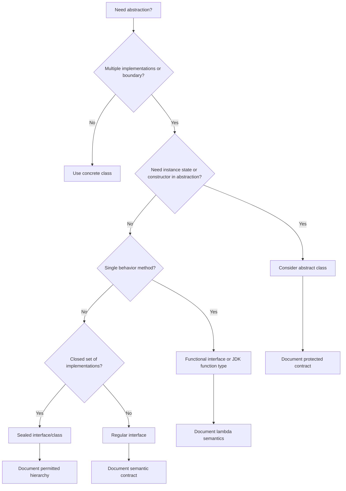

------
title: Learn Java Core Types, Data Model & Data APIs - Part 016
description: Deep engineering treatment of Java interfaces and abstract type boundaries: contracts, default/static/private methods, abstract classes, functional interfaces, marker interfaces, API evolution, sealed boundaries, and production design trade-offs.
series: learn-java-core-types
seriesTitle: Learn Java Core Types, Data Model & Data APIs
order: 16
partTitle: Interface and Abstract Type Boundaries
tags:
- java
- interface
- abstract-class
- type-system
- api-design
- functional-interface
- default-methods
- contracts
- advanced
date: 2026-06-27
---

# Part 016 — Interface and Abstract Type Boundaries

> Target skill: mampu menggunakan `interface` dan abstract type bukan sebagai “daftar method”, tetapi sebagai **boundary kontrak, substitution, API evolution, dan semantic capability**.

Jika Part 015 membahas `class` sebagai penjaga state dan invariant, part ini membahas **tipe abstrak** sebagai boundary antara pemakai dan implementasi.

Dalam Java modern, interface tidak lagi sekadar kumpulan method abstract. Interface bisa memiliki:

- abstract methods;
- default methods;
- static methods;
- private helper methods;
- constants;
- nested types;
- sealed boundary;
- functional-interface semantics.

Tapi fitur lebih banyak bukan berarti semua harus dipakai. Interface yang buruk menciptakan coupling yang lebih halus namun lebih berbahaya daripada class buruk.

---

## 1. Kaufman Deconstruction

Skill “menguasai interface dan abstract boundary” kita pecah menjadi:

| Sub-skill | Yang harus dikuasai |
|---|---|
| Contract design | Apa yang dijanjikan interface kepada caller |
| Capability modeling | Interface sebagai kemampuan, bukan sekadar kategori |
| Substitution | Implementasi harus benar-benar bisa menggantikan kontrak |
| Evolution | Bagaimana interface berubah tanpa menghancurkan implementor |
| Default method | Kapan berguna, kapan merusak semantic |
| Abstract class | Kapan state/constructor/skeletal implementation dibutuhkan |
| Functional interface | Lambda boundary dan single abstract method |
| Marker interface | Metadata type-level dan risikonya |
| Sealed boundary | Domain closedness di level type |
| API review | Bagaimana menghindari over-abstraction |

Pertanyaan utama:

> “Apakah interface ini merepresentasikan kontrak semantic yang stabil, atau hanya dibuat agar kode terlihat decoupled?”

---

## 2. Mental Model: Interface as Contract Boundary

Interface adalah type.

Namun secara engineering, interface adalah kontrak:

```java
public interface CaseRepository {
    Optional<CaseFile> findById(CaseId id);
    void save(CaseFile caseFile);
}
```

Contract-nya bukan hanya method signature.

Contract mencakup:

- apa arti `findById`;
- apakah return `Optional.empty()` berarti not found;
- apakah `save` insert, update, atau upsert;
- apakah method thread-safe;
- exception apa yang bisa muncul;
- apakah implementation boleh cache;
- consistency guarantee apa yang diberikan;
- apakah call idempotent;
- apakah null diterima atau ditolak.

Signature hanya permukaan. Kontrak asli ada pada semantics.

---

## 3. Interface Is a Type, Not an Implementation

Interface tidak menyimpan instance state.

Interface mendefinisikan apa yang bisa dilakukan object.

```java
public interface ClockSource {
    Instant now();
}
```

Object apa pun yang bisa menghasilkan `Instant` dapat menjadi `ClockSource`.

```java
public final class SystemClockSource implements ClockSource {
    @Override
    public Instant now() {
        return Instant.now();
    }
}
```

Caller tidak perlu tahu implementation.

```java
public final class DeadlinePolicy {
    private final ClockSource clock;

    public DeadlinePolicy(ClockSource clock) {
        this.clock = Objects.requireNonNull(clock);
    }

    boolean isOverdue(Instant dueAt) {
        return clock.now().isAfter(dueAt);
    }
}
```

Interface membuat dependency bisa diganti, tetapi hanya jika contract-nya benar-benar jelas.

---

## 4. Avoid Interface-as-Accidental-Abstraction

Banyak codebase membuat interface untuk setiap class:

```java
interface UserService {}
class UserServiceImpl implements UserService {}
```

Ini sering bukan abstraction, hanya duplication.

Interface bernilai jika:

- ada lebih dari satu implementation nyata;
- boundary crossing penting;
- caller butuh contract lebih sempit dari implementation;
- testing seam diperlukan dan tidak bisa lebih sederhana;
- module/API perlu stabil terhadap perubahan implementation;
- plugin/extension point dibutuhkan;
- domain capability ingin dimodelkan.

Interface tidak bernilai jika hanya menjadi ritual.

Rule praktis:

> Buat interface ketika abstraction sudah punya alasan, bukan karena “semua service harus punya interface”.

---

## 5. Capability Interface

Interface paling kuat sering merepresentasikan capability.

```java
public interface Auditable {
    AuditTrail auditTrail();
}

public interface Expirable {
    boolean isExpired(Clock clock);
}

public interface Identified<T> {
    T id();
}
```

Capability interface mengatakan:

> Object ini bisa diperlakukan sebagai sesuatu yang memiliki kemampuan tertentu.

Namun jangan pecah terlalu kecil tanpa manfaat.

Buruk:

```java
interface HasName { String name(); }
interface HasStatus { Status status(); }
interface HasCreatedAt { Instant createdAt(); }
```

Jika hanya membuat type soup, tidak membantu desain.

Capability interface harus punya use case nyata.

---

## 6. Semantic Contract Beats Method Shape

Dua interface bisa punya method sama tapi contract berbeda.

```java
interface IdGenerator {
    UUID nextId();
}

interface RandomUuidSupplier {
    UUID nextId();
}
```

Signature sama, semantic berbeda.

`IdGenerator.nextId()` mungkin harus:

- unique enough;
- monotonic;
- traceable;
- deterministic in test;
- stable across service instance.

`RandomUuidSupplier.nextId()` hanya menyatakan random UUID.

Jangan mendesain interface berdasarkan bentuk method saja. Desain berdasarkan meaning.

---

## 7. Interface Members

Interface Java modern dapat memiliki:

```java
public interface Example {
    int CONSTANT = 42; // implicitly public static final

    void abstractMethod(); // implicitly public abstract

    default void defaultMethod() {
        helper();
    }

    static Example noop() {
        return () -> {};
    }

    private void helper() {
        // helper for default methods
    }

    private static void staticHelper() {
        // helper for static methods
    }
}
```

Perhatikan:

- field interface adalah constant-style, bukan instance state;
- abstract method adalah contract utama;
- default method adalah inherited implementation;
- static method adalah utility/factory di namespace interface;
- private method hanya helper internal interface.

---

## 8. Interface Fields Are Constants, Not State

Semua field di interface secara implisit `public static final`.

```java
public interface HttpStatusCodes {
    int OK = 200;
    int NOT_FOUND = 404;
}
```

Masalah muncul jika interface dipakai sebagai “constant bag”.

```java
public interface AppConstants {
    String DEFAULT_COUNTRY = "ID";
    int MAX_RETRY = 3;
    String DATE_FORMAT = "yyyy-MM-dd";
}
```

Ini sering menjadi global namespace yang buruk.

Lebih baik gunakan class final khusus jika memang constant namespace diperlukan:

```java
public final class RetryDefaults {
    private RetryDefaults() {}

    public static final int MAX_ATTEMPTS = 3;
}
```

Atau enum/value object jika constant punya domain meaning.

---

## 9. Abstract Methods Define Required Behavior

Abstract method adalah bagian yang harus disediakan implementor.

```java
public interface CaseScoringPolicy {
    Score score(CaseFile caseFile);
}
```

Kontrak harus menjelaskan:

- apakah `caseFile` boleh null;
- apakah method pure;
- apakah deterministic;
- apakah bisa throw exception;
- apakah expensive;
- apakah result boleh cached;
- apakah thread-safe.

Dokumentasi minimal:

```java
/**
 * Computes a deterministic score for a valid case file.
 *
 * @throws NullPointerException if caseFile is null
 */
Score score(CaseFile caseFile);
```

Interface tanpa semantic documentation rawan disalahimplementasikan.

---

## 10. Default Methods

Default method memberi implementation di interface.

```java
public interface Named {
    String name();

    default String displayName() {
        return name();
    }
}
```

Default method berguna untuk:

- API evolution;
- derived behavior dari abstract primitive method;
- convenience method;
- small compositional behavior;
- menghindari breaking semua implementor saat menambah method tertentu.

Tapi default method berbahaya jika:

- menyimpan asumsi yang tidak berlaku untuk semua implementor;
- melakukan side effect besar;
- memakai method abstract dengan lifecycle yang tidak jelas;
- menciptakan diamond/conflict;
- membuat interface terlalu mirip abstract class.

Default method harus derived dari contract yang sudah ada.

---

## 11. Good Default Method Example

```java
public interface DateRangeLike {
    LocalDate startInclusive();
    LocalDate endExclusive();

    default boolean contains(LocalDate date) {
        Objects.requireNonNull(date, "date");
        return !date.isBefore(startInclusive()) && date.isBefore(endExclusive());
    }

    default long days() {
        return ChronoUnit.DAYS.between(startInclusive(), endExclusive());
    }
}
```

Mengapa baik?

- `contains` dan `days` diturunkan dari dua primitive methods;
- tidak menyimpan state;
- tidak melakukan I/O;
- berlaku untuk semua implementor yang mematuhi contract start/end;
- memperkuat semantic interface.

---

## 12. Bad Default Method Example

```java
public interface Persistable {
    String id();

    default void save() {
        GlobalDatabase.save(this);
    }
}
```

Masalah:

- hidden dependency ke global database;
- sulit dites;
- interface menjadi active record diam-diam;
- semua implementor dipaksa menerima storage model;
- side effect besar dalam default method.

Default method sebaiknya tidak menjadi tempat infrastructure dependency.

---

## 13. Default Method Conflict

Jika dua interface memberikan default method dengan signature sama, class implementor harus menyelesaikan conflict.

```java
interface A {
    default String label() { return "A"; }
}

interface B {
    default String label() { return "B"; }
}

class C implements A, B {
    @Override
    public String label() {
        return A.super.label();
    }
}
```

Conflict resolution eksplisit menjaga ambiguity tidak diam-diam.

Design implication:

> Semakin banyak default method di interface kecil-kecil, semakin besar risiko collision saat object mengimplementasikan banyak capability.

---

## 14. Static Methods in Interface

Static method pada interface tidak inherited sebagai instance method.

Ia dipanggil lewat nama interface:

```java
public interface CaseIdGenerator {
    CaseId next();

    static CaseIdGenerator randomUuid() {
        return () -> CaseId.of(UUID.randomUUID());
    }
}
```

Static method berguna untuk:

- factory;
- utility yang sangat terkait dengan interface;
- adapter construction;
- no-op implementation;
- composition helper.

Contoh:

```java
public interface Specification<T> {
    boolean isSatisfiedBy(T value);

    static <T> Specification<T> alwaysTrue() {
        return value -> true;
    }
}
```

Jangan jadikan interface sebagai utility dumping ground.

---

## 15. Private Methods in Interface

Private method membantu menghindari duplikasi antar default method.

```java
public interface NormalizedText {
    String value();

    default boolean hasSameNormalizedValue(String other) {
        return normalize(value()).equals(normalize(other));
    }

    default int normalizedLength() {
        return normalize(value()).length();
    }

    private static String normalize(String raw) {
        return raw == null ? "" : raw.trim().toLowerCase(Locale.ROOT);
    }
}
```

Private method tidak menjadi bagian API publik. Ini implementation detail interface.

Gunakan untuk helper kecil, bukan logic kompleks yang seharusnya berada di class biasa.

---

## 16. Functional Interface

Functional interface adalah interface dengan tepat satu abstract method.

```java
@FunctionalInterface
public interface CaseFilter {
    boolean test(CaseFile caseFile);
}
```

Bisa digunakan dengan lambda:

```java
CaseFilter submitted = c -> c.status() == CaseStatus.SUBMITTED;
```

`@FunctionalInterface` tidak wajib, tetapi sangat disarankan karena compiler akan menjaga niat desain.

Functional interface cocok untuk:

- predicate;
- mapping;
- callback;
- policy kecil;
- strategy behavior;
- event handler;
- lazy supplier.

Tapi jangan membuat functional interface baru jika JDK sudah punya yang tepat:

| Need | Existing JDK interface |
|---|---|
| value -> boolean | `Predicate<T>` |
| value -> result | `Function<T, R>` |
| no input -> value | `Supplier<T>` |
| value -> no result | `Consumer<T>` |
| two values -> result | `BiFunction<T, U, R>` |

Buat custom functional interface jika nama domain penting atau exception contract berbeda.

---

## 17. Object Methods and Functional Interface Count

Method yang public dari `Object` tidak dihitung sebagai abstract method functional interface.

```java
@FunctionalInterface
interface NamedPredicate<T> {
    boolean test(T value);

    String toString(); // Object method, tidak menambah abstract functional count
}
```

Namun mendeklarasikan method seperti ini sering membingungkan. Hindari kecuali ada alasan kuat.

---

## 18. Lambda Captures and Interface Design

Functional interface sering dipakai dengan lambda yang capture variable.

```java
int threshold = 10;
Predicate<CaseFile> highPriority = c -> c.priority().value() > threshold;
```

Variable yang dicapture harus effectively final.

Design implication:

- lambda cocok untuk behavior kecil;
- jangan masukkan state mutable kompleks ke lambda;
- jika behavior punya identity/lifecycle/config banyak, buat class eksplisit.

Buruk:

```java
List<String> errors = new ArrayList<>();
Predicate<Request> validator = r -> {
    if (r.name() == null) errors.add("name");
    return errors.isEmpty();
};
```

Lebih baik:

```java
final class RequestValidator {
    ValidationResult validate(Request request) { ... }
}
```

---

## 19. Marker Interface

Marker interface tidak memiliki method.

Contoh JDK klasik:

```java
public interface Serializable {}
```

Marker interface memberi metadata type-level yang bisa dicek dengan `instanceof` atau oleh framework/runtime.

Namun marker interface bisa disalahgunakan.

```java
interface Important {}
interface Processed {}
interface Validated {}
```

Jika marker hanya menggantikan boolean flag tanpa rule jelas, desainnya lemah.

Alternatif:

- annotation;
- enum status;
- sealed hierarchy;
- value object;
- explicit field;
- capability interface dengan behavior nyata.

Gunakan marker interface hanya jika type-level tagging benar-benar memberi manfaat.

---

## 20. Interface vs Abstract Class

Pertanyaan klasik: kapan interface, kapan abstract class?

| Gunakan interface jika | Gunakan abstract class jika |
|---|---|
| Ingin contract tanpa instance state | Butuh shared state |
| Implementor bisa berasal dari hierarchy berbeda | Ada common base implementation |
| Butuh multiple type inheritance | Single inheritance cukup |
| API boundary/capability | Skeletal implementation |
| Functional/lambda target | Constructor/invariant base dibutuhkan |
| Sealed interface untuk closed domain | Protected hooks dan template flow |

Interface:

```java
public interface CaseExporter {
    byte[] export(CaseFile caseFile);
}
```

Abstract class:

```java
public abstract class AbstractCaseExporter implements CaseExporter {
    private final Charset charset;

    protected AbstractCaseExporter(Charset charset) {
        this.charset = Objects.requireNonNull(charset);
    }

    protected Charset charset() {
        return charset;
    }
}
```

Abstract class bisa membawa state dan constructor. Interface tidak.

---

## 21. Abstract Class as Skeletal Implementation

Skeletal implementation berguna jika banyak implementor berbagi logic.

```java
public interface CaseFormatter {
    String format(CaseFile caseFile);
}

public abstract class BaseCaseFormatter implements CaseFormatter {
    @Override
    public final String format(CaseFile caseFile) {
        Objects.requireNonNull(caseFile, "caseFile");
        return header(caseFile) + "\n" + body(caseFile);
    }

    protected abstract String header(CaseFile caseFile);
    protected abstract String body(CaseFile caseFile);
}
```

Keputusan desain:

- `format` final agar flow tidak dirusak subclass;
- subclass hanya mengisi hook;
- null check central;
- shared algorithm ada di base.

Risiko:

- inheritance coupling;
- protected API menjadi contract permanen;
- subclass bisa bergantung pada detail internal;
- single inheritance limit.

---

## 22. Interface and Sealed Boundary Preview for Later

Sealed interface akan dibahas lebih dalam di Part 019.

Di sini cukup mental model:

```java
public sealed interface CaseOutcome
        permits Approved, Rejected, Escalated {
}

public record Approved(Instant at) implements CaseOutcome {}
public record Rejected(String reason, Instant at) implements CaseOutcome {}
public record Escalated(String reason, Instant at) implements CaseOutcome {}
```

Sealed interface menyatakan:

> Implementasi legal dari interface ini tertutup dan diketahui.

Ini berguna untuk domain outcome, command, event, state, atau result yang closed.

---

## 23. Interface as API Return Type

Return interface atau concrete type?

```java
List<CaseFile> findOpenCases();
```

vs

```java
ArrayList<CaseFile> findOpenCases();
```

Biasanya return interface lebih baik karena implementation tidak bocor.

Tapi terlalu abstrak juga bisa melemahkan contract.

```java
Collection<CaseFile> findOpenCases();
```

Apakah order penting? Duplicates boleh? Random access perlu?

Jika order penting, `List` lebih jelas daripada `Collection`.

Jika uniqueness penting, `Set` lebih jelas.

API harus memilih interface berdasarkan semantic, bukan “paling umum”.

---

## 24. Interface as Parameter Type

Untuk parameter, terima type yang cukup umum tetapi masih semantic.

```java
void addEvidence(Collection<Evidence> evidence)
```

Ini fleksibel jika method hanya iterasi.

Tapi jika method butuh order:

```java
void setReviewSteps(List<ReviewStep> steps)
```

Jika method butuh key lookup:

```java
void applyAttributes(Map<AttributeName, AttributeValue> attributes)
```

Rule:

> Parameter type harus menyatakan operasi dan semantic yang benar-benar dibutuhkan.

---

## 25. Interface and Null Contract

Interface harus punya null policy.

```java
public interface CaseRepository {
    Optional<CaseFile> findById(CaseId id);
}
```

Contract yang baik:

- `id` tidak boleh null;
- return tidak pernah null;
- not found direpresentasikan dengan `Optional.empty()`.

Implementasi harus patuh.

```java
@Override
public Optional<CaseFile> findById(CaseId id) {
    Objects.requireNonNull(id, "id");
    return Optional.ofNullable(storage.get(id));
}
```

Jangan return null dari method yang contract-nya `Optional`.

---

## 26. Interface and Exception Contract

Checked exception di interface menjadi bagian contract.

```java
public interface CaseFileReader {
    CaseFile read(Path path) throws IOException;
}
```

Ini masuk akal karena I/O adalah failure mode natural.

Untuk domain validation:

```java
public interface CaseTitleParser {
    CaseTitle parse(String raw);
}
```

Bisa throw unchecked `IllegalArgumentException` untuk fail-fast.

Atau:

```java
public interface CaseTitleParser {
    Either<ValidationErrors, CaseTitle> parse(String raw);
}
```

Jika ingin error accumulation.

Jangan sembarang menaruh `throws Exception`.

```java
void process() throws Exception;
```

Itu membuat caller kehilangan informasi recovery.

---

## 27. Interface Evolution

Menambah abstract method ke interface publik biasanya breaking untuk implementor.

```java
interface Repository {
    void save(Object o);

    // Menambah ini memaksa semua implementor berubah
    void delete(Object o);
}
```

Default method bisa membantu evolution:

```java
interface Repository<T> {
    void save(T value);

    default void saveAll(Collection<T> values) {
        for (T value : values) {
            save(value);
        }
    }
}
```

Karena `saveAll` diturunkan dari `save`, default method masuk akal.

Tapi jangan menambah default method yang contract-nya tidak bisa dijamin semua implementor.

---

## 28. Binary Compatibility Is Not Semantic Compatibility

Perubahan bisa binary-compatible tetapi tetap semantic-breaking.

Contoh: menambah default method mungkin tidak membuat implementor gagal compile, tetapi bisa mengubah behavior.

```java
interface Cache<K, V> {
    V get(K key);

    default V getOrDefault(K key, V fallback) {
        V value = get(key);
        return value == null ? fallback : value;
    }
}
```

Jika ada implementor yang mengizinkan cached null sebagai value valid, default method ini salah secara semantic.

Compatibility harus dipikirkan di dua level:

1. source/binary compatibility;
2. semantic compatibility.

Engineer senior sangat peduli poin kedua.

---

## 29. Interface Segregation Without Fragmentation

Interface yang terlalu besar buruk:

```java
interface CaseSystem {
    void create();
    void approve();
    void reject();
    void archive();
    void exportPdf();
    void sendEmail();
    void generateReport();
}
```

Caller yang hanya butuh export dipaksa bergantung pada semua.

Pecah berdasarkan role:

```java
interface CaseApprovalPort {
    void approve(CaseId id, ApprovalCommand command);
}

interface CaseExportPort {
    byte[] export(CaseId id, ExportFormat format);
}
```

Namun jangan pecah menjadi interface satu method tanpa semantic hanya karena dogma.

Fragmentasi berlebihan membuat dependency graph sulit dibaca.

---

## 30. Interface Naming

Nama interface harus menggambarkan contract/capability.

Baik:

```java
CaseRepository
CaseExporter
CaseScoringPolicy
DeadlineCalculator
EvidenceClassifier
NotificationSender
```

Kurang baik:

```java
ICaseService
CaseServiceInterface
BaseCaseThing
Doer
Handler
Processor
```

Suffix seperti `Handler`, `Processor`, `Manager` boleh jika domain jelas, tetapi sering terlalu generik.

Nama interface harus menjawab:

> “Kontrak apa yang dijalankan implementor?”

---

## 31. Interface and Generics

Interface sering generic:

```java
public interface Repository<ID, T> {
    Optional<T> findById(ID id);
    void save(T value);
}
```

Ini fleksibel, tapi bisa terlalu abstrak.

```java
Repository<String, Object> repository
```

Type generic harus punya meaning.

Domain-specific interface kadang lebih jelas:

```java
public interface CaseRepository {
    Optional<CaseFile> findById(CaseId id);
    void save(CaseFile caseFile);
}
```

Generic interface cocok untuk library/infrastructure. Domain interface sering lebih baik eksplisit.

Generics akan dibahas lebih dalam di Part 020–022.

---

## 32. Interface and Collections

JDK Collections adalah contoh besar interface-based design:

- `Collection`
- `List`
- `Set`
- `Map`
- `Queue`
- `Deque`
- `SortedSet`
- `NavigableMap`

Masing-masing membawa semantic contract.

`List` bukan hanya “collection yang bisa ditambah”. Ia menyatakan ordered sequence dan positional access.

`Set` menyatakan no duplicates berdasarkan equality semantics.

`Map` menyatakan key-value association.

Ini mengajarkan rule penting:

> Interface yang baik membawa semantic, bukan hanya method.

---

## 33. Interface and Testing

Interface memudahkan testing jika boundary benar.

```java
public interface CaseRepository {
    Optional<CaseFile> findById(CaseId id);
    void save(CaseFile caseFile);
}
```

Test fake:

```java
final class InMemoryCaseRepository implements CaseRepository {
    private final Map<CaseId, CaseFile> data = new HashMap<>();

    @Override
    public Optional<CaseFile> findById(CaseId id) {
        return Optional.ofNullable(data.get(id));
    }

    @Override
    public void save(CaseFile caseFile) {
        data.put(caseFile.id(), caseFile);
    }
}
```

Namun fake harus mematuhi contract. Jika production repository punya optimistic locking, fake yang terlalu sederhana bisa menyembunyikan bug.

Testing seam tidak boleh mengubah semantics.

---

## 34. Contract Tests

Jika interface punya banyak implementor, tulis contract test.

```java
interface CaseRepositoryContract {
    CaseRepository repository();

    @Test
    default void savedCaseCanBeFoundById() {
        CaseRepository repo = repository();
        CaseFile c = CaseFile.draft(CaseId.random(), "Test");

        repo.save(c);

        assertEquals(Optional.of(c), repo.findById(c.id()));
    }
}
```

Implementor test:

```java
class InMemoryCaseRepositoryTest implements CaseRepositoryContract {
    @Override
    public CaseRepository repository() {
        return new InMemoryCaseRepository();
    }
}
```

Contract test memastikan interface semantics tidak hanya tertulis di komentar.

---

## 35. Interface and Modules

Dalam sistem modular, interface sering menjadi boundary antar module.

```text
case-domain
  - CaseFile
  - CaseRepository interface

case-persistence
  - JdbcCaseRepository implements CaseRepository
```

Domain module tidak perlu tahu JDBC.

Namun jangan membuat interface di layer yang salah.

Jika interface hanya dipakai satu implementation dan berada di package yang sama, mungkin belum perlu.

Jika interface memisahkan domain dari infrastructure, nilainya jauh lebih tinggi.

---

## 36. Abstract Type Decision Flow



---

## 37. Worked Example: Scoring Policy

Bad design:

```java
class CaseService {
    int score(CaseFile c) {
        if (c.priority().value() > 3) return 100;
        return 10;
    }
}
```

Policy hardcoded.

Interface boundary:

```java
@FunctionalInterface
public interface CaseScoringPolicy {
    Score score(CaseFile caseFile);
}
```

Implementations:

```java
public final class PriorityBasedScoringPolicy implements CaseScoringPolicy {
    @Override
    public Score score(CaseFile caseFile) {
        Objects.requireNonNull(caseFile, "caseFile");
        return caseFile.priority().value() > 3 ? Score.high() : Score.low();
    }
}
```

Usage:

```java
public final class CaseRankingService {
    private final CaseScoringPolicy scoringPolicy;

    public CaseRankingService(CaseScoringPolicy scoringPolicy) {
        this.scoringPolicy = Objects.requireNonNull(scoringPolicy);
    }

    public List<RankedCase> rank(List<CaseFile> cases) {
        return cases.stream()
                .map(c -> new RankedCase(c.id(), scoringPolicy.score(c)))
                .sorted(Comparator.comparing(RankedCase::score).reversed())
                .toList();
    }
}
```

Interface cocok karena scoring policy bisa berubah berdasarkan regulation, jurisdiction, experiment, atau customer.

---

## 38. Worked Example: Repository Boundary

Repository interface harus hati-hati.

Buruk:

```java
interface Repository {
    Object find(Object id);
    void save(Object value);
}
```

Terlalu generic.

Lebih baik:

```java
public interface CaseRepository {
    Optional<CaseFile> findById(CaseId id);
    void save(CaseFile caseFile);
}
```

Jika butuh locking:

```java
public interface CaseRepository {
    Optional<CaseFile> findById(CaseId id);
    void save(CaseFile caseFile, Version expectedVersion);
}
```

Contract harus menyatakan apa yang terjadi jika version mismatch.

```java
/**
 * Saves the case if the current stored version matches expectedVersion.
 *
 * @throws OptimisticLockException if the stored version differs
 */
void save(CaseFile caseFile, Version expectedVersion);
```

Interface yang tidak menyatakan concurrency semantics akan menyebabkan bug di distributed systems.

---

## 39. Worked Example: Exporter Boundary

```java
public interface CaseExporter {
    ExportedFile export(CaseFile caseFile);
}
```

Apakah cukup?

Mungkin tidak. Kita perlu semantic:

- format apa?
- locale apa?
- timezone apa?
- apakah binary atau text?
- apakah deterministic?
- apakah include audit trail?

Lebih eksplisit:

```java
public interface CaseExporter {
    ExportedFile export(CaseFile caseFile, ExportOptions options);
}

public record ExportOptions(
        ExportFormat format,
        Locale locale,
        ZoneId zoneId,
        boolean includeAuditTrail
) {}
```

Interface kecil bukan berarti parameter tidak boleh kaya. Kadang contract yang baik butuh options object.

---

## 40. Common Failure Modes

### 40.1 Interface dibuat hanya karena convention

```java
interface UserService {}
class UserServiceImpl implements UserService {}
```

Tidak ada abstraction nyata.

### 40.2 Interface terlalu besar

Caller bergantung pada method yang tidak mereka butuhkan.

### 40.3 Interface terlalu kecil tanpa semantic

Banyak interface satu method yang tidak membawa meaning.

### 40.4 Default method melakukan side effect besar

Interface berubah menjadi hidden base class.

### 40.5 Constant interface anti-pattern

Class mengimplementasikan interface hanya untuk mendapat constant.

```java
class Foo implements AppConstants {}
```

Ini mencemari type hierarchy.

### 40.6 Null contract tidak jelas

Implementor A return null, implementor B return Optional, caller bingung.

### 40.7 Exception contract terlalu umum

`throws Exception` memaksa caller menangani semua sebagai unknown failure.

### 40.8 Fake implementation tidak mematuhi contract

Test hijau, production gagal.

### 40.9 Abstract class exposes too much protected state

Subclass bergantung pada internal detail.

### 40.10 Interface leaks infrastructure

Domain interface mengandung JDBC/HTTP/JSON detail.

---

## 41. Code Review Rubric

### Necessity

- Apakah interface ini punya lebih dari satu implementation nyata atau boundary kuat?
- Apakah concrete class cukup?

### Contract

- Apakah semantic tiap method jelas?
- Apakah null policy jelas?
- Apakah exception policy jelas?
- Apakah threading/consistency/idempotency perlu dijelaskan?

### Shape

- Apakah method terlalu banyak?
- Apakah interface terlalu kecil tanpa meaning?
- Apakah return/parameter type terlalu umum atau terlalu spesifik?

### Evolution

- Jika method ditambah, apakah implementor rusak?
- Apakah default method benar-benar derived dari existing contract?
- Apakah perubahan binary-compatible tetapi semantic-breaking?

### Implementation

- Apakah default method side-effect-free atau minimal?
- Apakah static method terkait erat dengan interface?
- Apakah private helper membuat interface terlalu kompleks?

### Abstract class

- Apakah shared state memang perlu?
- Apakah protected hook terdokumentasi?
- Apakah method final diperlukan untuk menjaga flow?

### Testing

- Apakah ada contract test untuk banyak implementor?
- Apakah fake/test implementation mematuhi semantic production?

---

## 42. Practice Drill

### Drill 1 — Remove ritual interface

Diberikan:

```java
interface PaymentService {}
class PaymentServiceImpl implements PaymentService {}
```

Tentukan apakah interface perlu. Jika tidak, hapus. Jika iya, tulis alasan boundary dan contract-nya.

### Drill 2 — Design repository contract

Buat `CaseRepository` dengan:

- `findById`;
- `save`;
- null policy;
- not-found representation;
- optimistic locking policy.

Tulis Javadoc contract minimal.

### Drill 3 — Good default method

Buat interface `Range<T>` dengan primitive method:

- `startInclusive()`;
- `endExclusive()`.

Tambahkan default method `contains` yang valid untuk semua implementor.

### Drill 4 — Bad default method review

Review interface ini:

```java
interface UserAware {
    User user();

    default void save() {
        Database.save(user());
    }
}
```

Jelaskan kenapa buruk dan refactor.

### Drill 5 — Interface vs abstract class

Desain exporter dengan dua implementation:

- PDF exporter;
- CSV exporter.

Tentukan apakah butuh:

- interface saja;
- abstract base class;
- helper class;
- atau combination.

Jelaskan trade-off.

---

## 43. Core Takeaways

1. Interface adalah semantic contract, bukan hanya daftar method.
2. Interface bernilai jika ada boundary, capability, substitution, atau multiple implementation nyata.
3. Default method sebaiknya derived dari primitive methods dan tidak punya side effect besar.
4. Static method interface cocok untuk factory/helper yang sangat terkait dengan interface.
5. Private method interface hanya implementation detail untuk default/static method.
6. Functional interface cocok untuk behavior kecil; class eksplisit lebih baik untuk behavior ber-state atau kompleks.
7. Abstract class cocok jika abstraction butuh state, constructor, atau skeletal implementation.
8. Return/parameter interface harus dipilih berdasarkan semantic, bukan sekadar generality.
9. Binary compatibility tidak sama dengan semantic compatibility.
10. Interface yang baik harus bisa diuji lewat contract test.

---

## 44. References

- Java Language Specification, Java SE 25, Chapter 9: Interfaces.
- Java Language Specification, Java SE 25, Chapter 8: Classes.
- Java SE 25 API Documentation: `java.lang.FunctionalInterface`.
- Java SE 25 API Documentation: `java.util.function`.
- Java SE 25 API Documentation: Java Collections Framework interfaces.
- Previous parts in this series: Part 011, Part 012, Part 014, Part 015.
