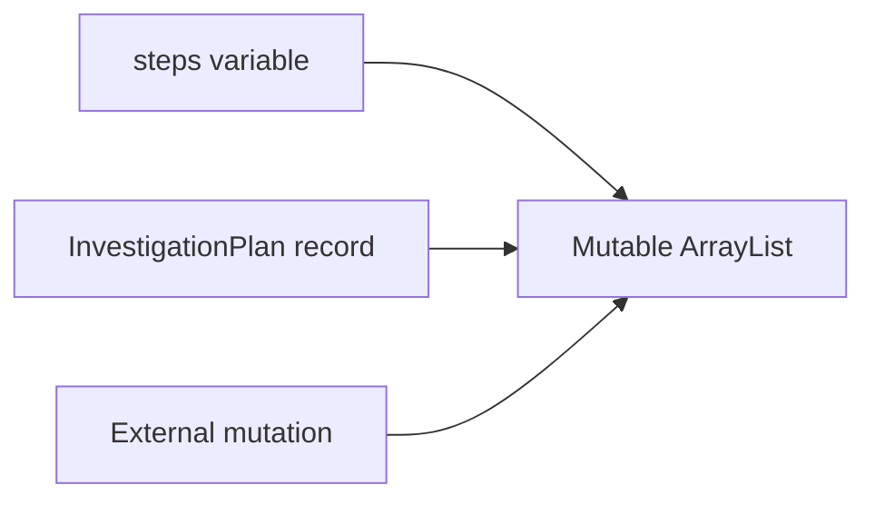
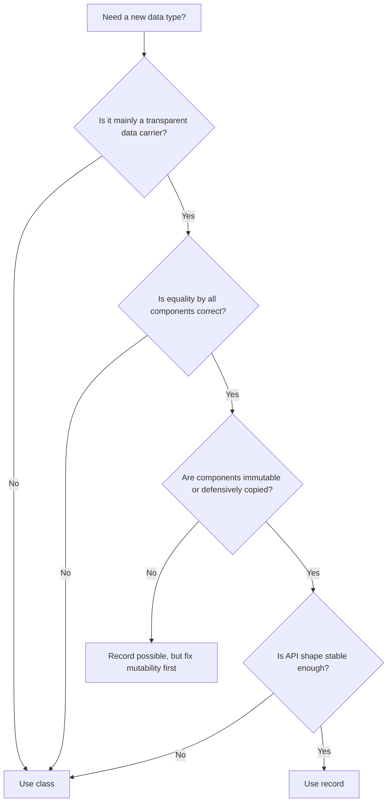
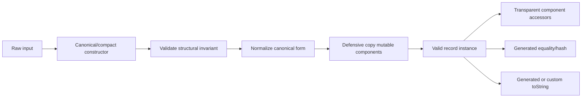

------
title: Learn Java Core Types, Data Model & Data APIs - Part 017
description: Deep engineering treatment of Java records as transparent data carriers: components, canonical and compact constructors, validation, normalization, defensive copying, generated methods, serialization boundaries, and production trade-offs.
series: learn-java-core-types
seriesTitle: Learn Java Core Types, Data Model & Data APIs
order: 17
partTitle: Records as Transparent Data Carriers
tags:
- java
- records
- data-modeling
- immutability
- value-object
- dto
- type-system
- advanced
date: 2026-06-27
---

# Part 017 — Records as Transparent Data Carriers

> Target skill: mampu menggunakan `record` bukan sebagai “class singkat”, tetapi sebagai **kontrak data transparan** dengan invariant, equality, defensive copying, dan boundary semantics yang benar.

Record adalah salah satu fitur Java modern yang terlihat sederhana tetapi punya konsekuensi desain besar.

```java
public record CaseId(String value) {}
```

Sekilas, record terlihat seperti shorthand untuk:

- private final fields;
- constructor;
- accessors;
- `equals`;
- `hashCode`;
- `toString`.

Tetapi mental model yang lebih tepat:

> Record adalah deklarasi bahwa API type ini adalah transparent carrier untuk sekumpulan component yang menjadi state description utamanya.

Dengan kata lain, ketika kita memilih record, kita sedang berkata kepada caller:

> “Identitas data ini adalah component-component yang saya deklarasikan. Anda boleh memahami value ini melalui component tersebut.”

Itu berbeda dari class biasa, yang bisa menyembunyikan representasi internalnya lebih kuat.

---

## 1. Kaufman Deconstruction

Skill “menguasai records” kita pecah menjadi beberapa sub-skill:

| Sub-skill | Yang harus dikuasai |
|---|---|
| Record mental model | Record sebagai transparent data carrier, bukan sekadar boilerplate reducer |
| Component design | Memilih component yang benar-benar bagian dari state description |
| Constructor control | Canonical constructor, compact constructor, validation, normalization |
| Immutability boundary | Memahami shallow immutability dan defensive copy |
| Generated methods | Efek component terhadap accessor, `equals`, `hashCode`, `toString` |
| API design | Record sebagai DTO, command, query result, key, value object |
| Anti-pattern detection | Kapan record buruk: entity, lifecycle-heavy object, mutable component leak |
| Framework boundary | Serialization, JSON mapping, reflection, persistence, proxy limitations |
| Evolution | Dampak menambah/menghapus/mengubah component |

Pertanyaan utama:

> “Apakah type ini memang ingin transparan terhadap component-nya?”

Jika jawabannya tidak, record kemungkinan bukan representasi terbaik.

---

## 2. Mental Model: Record Is a Nominal Tuple with a Contract

Record sering dijelaskan sebagai “nominal tuple”. Itu berguna, tetapi belum lengkap.

Tuple biasa biasanya hanya posisi:

```text
(String, int, boolean)
```

Record memberi nama pada type dan component:

```java
public record EnforcementCaseSummary(
        CaseId caseId,
        String respondentName,
        CaseStatus status,
        int openFindingCount
) {}
```

Yang penting:

- `EnforcementCaseSummary` adalah nominal type;
- `caseId`, `respondentName`, `status`, `openFindingCount` adalah component;
- component menjadi bagian dari public API;
- component ikut membentuk generated constructor, accessor, equality, hash, dan string representation.

Jadi record bukan anonymous structural type. Java tetap nominal.

```java
public record UserId(String value) {}
public record CaseId(String value) {}

UserId userId = new UserId("123");
CaseId caseId = new CaseId("123");

// Tidak assignable walaupun sama-sama punya satu String component.
// caseId = userId; // compile error
```

Ini sangat berguna untuk domain scalar.

---

## 3. Record Is Still a Class

Record adalah class khusus.

Artinya record:

- bisa memiliki methods;
- bisa memiliki static fields;
- bisa memiliki static methods;
- bisa implement interfaces;
- bisa memiliki nested types;
- bisa digunakan sebagai generic type;
- punya runtime class;
- punya object identity di JVM saat ini;
- bisa bernilai `null` karena record adalah reference type.

Contoh:

```java
public record Money(String currency, BigDecimal amount)
        implements Comparable<Money> {

    public Money {
        Objects.requireNonNull(currency, "currency");
        Objects.requireNonNull(amount, "amount");
        currency = currency.toUpperCase(Locale.ROOT);
        amount = amount.stripTrailingZeros();
    }

    public boolean isZero() {
        return amount.signum() == 0;
    }

    @Override
    public int compareTo(Money other) {
        requireSameCurrency(other);
        return amount.compareTo(other.amount);
    }

    private void requireSameCurrency(Money other) {
        if (!currency.equals(other.currency)) {
            throw new IllegalArgumentException("Cannot compare different currencies");
        }
    }
}
```

Namun record juga punya batasan penting:

- record tidak bisa extend class lain secara eksplisit;
- direct superclass record adalah `java.lang.Record`;
- record secara konsep final terhadap shape-nya;
- record tidak cocok untuk inheritance-based domain model;
- record tidak cocok untuk object yang identity/lifecycle-nya lebih penting daripada component.

---

## 4. Anatomy of a Record

Deklarasi:

```java
public record CaseAssignment(
        CaseId caseId,
        InvestigatorId investigatorId,
        Instant assignedAt
) {}
```

Record header mendefinisikan record components:

```java
CaseId caseId
InvestigatorId investigatorId
Instant assignedAt
```

Dari component tersebut, compiler menghasilkan secara konseptual:

```java
public final class CaseAssignment extends Record {
    private final CaseId caseId;
    private final InvestigatorId investigatorId;
    private final Instant assignedAt;

    public CaseAssignment(CaseId caseId,
                          InvestigatorId investigatorId,
                          Instant assignedAt) {
        this.caseId = caseId;
        this.investigatorId = investigatorId;
        this.assignedAt = assignedAt;
    }

    public CaseId caseId() { return caseId; }
    public InvestigatorId investigatorId() { return investigatorId; }
    public Instant assignedAt() { return assignedAt; }

    @Override public boolean equals(Object o) { ... }
    @Override public int hashCode() { ... }
    @Override public String toString() { ... }
}
```

Ini bukan source code literal yang compiler generate, tetapi cukup akurat sebagai mental model.

---

## 5. Component Names Are API

Dalam class biasa, field name bisa menjadi implementation detail.

Dalam record, component name adalah API.

```java
public record CustomerView(
        String fullName,
        String emailAddress
) {}
```

Caller akan memakai:

```java
view.fullName();
view.emailAddress();
```

Jika kita rename component:

```java
public record CustomerView(
        String name,
        String email
) {}
```

Maka accessor berubah:

```java
view.name();
view.email();
```

Itu bukan refactor internal. Itu breaking API change.

### Rule

> Jangan pilih record jika kita ingin bebas mengubah representasi internal tanpa mengubah public API.

Record cocok ketika representasi memang bagian dari kontrak.

---

## 6. Record Accessor Is Not JavaBean Getter

Record accessor mengikuti nama component, bukan `getX()`.

```java
public record Person(String name, int age) {}

Person p = new Person("Ayu", 30);
p.name();
p.age();
```

Bukan:

```java
p.getName();
p.getAge();
```

Ini penting untuk framework compatibility. Banyak framework modern mendukung record, tetapi framework lama mungkin mengasumsikan JavaBean getter.

### Production implication

Sebelum memakai record untuk DTO boundary, cek:

- JSON mapper;
- validation framework;
- ORM;
- API documentation generator;
- serialization framework;
- expression language;
- reflection-based mapper;
- test data builder.

Jika framework tidak memahami record, record bisa menciptakan friction besar.

---

## 7. Record Constructor Types

Record punya canonical constructor.

Untuk record:

```java
public record CaseId(String value) {}
```

Canonical constructor-nya:

```java
public CaseId(String value) {
    this.value = value;
}
```

Kita bisa menulis constructor secara eksplisit:

```java
public record CaseId(String value) {
    public CaseId(String value) {
        if (value == null || value.isBlank()) {
            throw new IllegalArgumentException("case id must not be blank");
        }
        this.value = value;
    }
}
```

Atau memakai compact constructor:

```java
public record CaseId(String value) {
    public CaseId {
        if (value == null || value.isBlank()) {
            throw new IllegalArgumentException("case id must not be blank");
        }
        value = value.trim();
    }
}
```

Pada compact constructor:

- parameter component tersedia;
- kita tidak menulis parameter list;
- assignment ke field dilakukan otomatis setelah body;
- kita boleh melakukan validation;
- kita boleh melakukan normalization dengan reassign parameter.

---

## 8. Canonical Constructor: Validation Boundary

Record constructor adalah tempat terbaik untuk menjaga invariant component.

Buruk:

```java
public record PageRequest(int page, int size) {}
```

Kode di atas memungkinkan:

```java
new PageRequest(-1, 0);
```

Lebih baik:

```java
public record PageRequest(int page, int size) {
    public PageRequest {
        if (page < 0) {
            throw new IllegalArgumentException("page must be >= 0");
        }
        if (size < 1 || size > 500) {
            throw new IllegalArgumentException("size must be between 1 and 500");
        }
    }
}
```

Dengan begitu semua instance `PageRequest` valid setelah construction.

### Invariant rule

> Jika record merepresentasikan domain value, canonical/compact constructor harus memastikan instance tidak pernah berada dalam state invalid.

---

## 9. Normalization in Records

Validation menolak input buruk. Normalization mengubah input menjadi bentuk canonical.

Contoh:

```java
public record EmailAddress(String value) {
    public EmailAddress {
        Objects.requireNonNull(value, "value");
        value = value.trim().toLowerCase(Locale.ROOT);

        if (!value.contains("@")) {
            throw new IllegalArgumentException("invalid email address");
        }
    }
}
```

Manfaat normalization:

- equality lebih stabil;
- duplicate detection lebih mudah;
- log dan audit lebih konsisten;
- boundary input lebih bersih.

Namun normalization harus hati-hati. Misalnya email case sensitivity secara domain bisa lebih kompleks dari sekadar lowercase. Untuk identifier eksternal, jangan normalize sembarangan jika ada aturan resmi.

### Rule

> Normalize hanya jika domain memang punya canonical form yang jelas.

---

## 10. Compact Constructor Assignment Pitfall

Dalam compact constructor, jangan assign ke field langsung.

```java
public record CaseId(String value) {
    public CaseId {
        // this.value = value; // tidak boleh dalam compact constructor
    }
}
```

Pola yang benar:

```java
public record CaseId(String value) {
    public CaseId {
        Objects.requireNonNull(value, "value");
        value = value.trim();
    }
}
```

Compiler akan melakukan assignment final setelah body constructor.

Mental model:

```text
compact constructor body
        ↓
implicit assignment to final fields
        ↓
record instance fully initialized
```

---

## 11. Additional Constructors

Record bisa punya constructor tambahan, tetapi harus delegate ke canonical constructor.

```java
public record CaseId(String value) {
    public CaseId(long numericId) {
        this("CASE-" + numericId);
    }

    public CaseId {
        Objects.requireNonNull(value, "value");
        if (value.isBlank()) {
            throw new IllegalArgumentException("blank case id");
        }
    }
}
```

Ini menjaga satu validation path.

### Rule

> Semua constructor alternatif harus mengalir ke canonical constructor agar invariant tidak bocor.

---

## 12. Shallow Immutability

Record sering disebut immutable data carrier. Tetapi secara engineering, record memberi **shallow immutability** untuk component fields.

Field record bersifat final. Artinya field tidak bisa diubah agar menunjuk ke reference lain.

Namun object yang direferensikan component bisa tetap mutable.

```java
public record InvestigationPlan(List<String> steps) {}

List<String> steps = new ArrayList<>();
steps.add("Collect evidence");

InvestigationPlan plan = new InvestigationPlan(steps);
steps.add("Delete evidence");

System.out.println(plan.steps());
```

`plan.steps()` berubah karena record menyimpan reference ke list mutable yang sama.

### Mental model



Record tidak otomatis deep immutable.

---

## 13. Defensive Copy for Collections

Untuk collection component, gunakan copy saat construction.

```java
public record InvestigationPlan(List<String> steps) {
    public InvestigationPlan {
        steps = List.copyOf(steps);
    }
}
```

`List.copyOf` membuat unmodifiable list dan menolak null element.

Sekarang:

```java
List<String> steps = new ArrayList<>();
steps.add("Collect evidence");

InvestigationPlan plan = new InvestigationPlan(steps);
steps.add("Mutate original");

System.out.println(plan.steps()); // tidak ikut berubah
```

Karena record menyimpan copy.

### Tetapi hati-hati

Jika element di dalam list mutable, `List.copyOf` hanya copy container.

```java
public record Plan(List<MutableStep> steps) {
    public Plan {
        steps = List.copyOf(steps);
    }
}
```

Object `MutableStep` masih bisa berubah.

Untuk deep immutability, element juga harus immutable atau dicopy.

---

## 14. Defensive Copy for Arrays

Array adalah mutable. Record dengan array component sangat mudah salah.

Buruk:

```java
public record AttachmentDigest(byte[] sha256) {}
```

Masalah:

```java
byte[] digest = computeDigest();
AttachmentDigest d = new AttachmentDigest(digest);
digest[0] = 99; // mutates record state

d.sha256()[1] = 88; // mutates record state through accessor
```

Lebih aman:

```java
public record AttachmentDigest(byte[] sha256) {
    public AttachmentDigest {
        Objects.requireNonNull(sha256, "sha256");
        if (sha256.length != 32) {
            throw new IllegalArgumentException("SHA-256 digest must be 32 bytes");
        }
        sha256 = sha256.clone();
    }

    @Override
    public byte[] sha256() {
        return sha256.clone();
    }
}
```

Untuk binary value, kadang lebih baik memakai wrapper type yang jelas:

```java
public record Sha256Digest(byte[] bytes) {
    public Sha256Digest {
        Objects.requireNonNull(bytes, "bytes");
        if (bytes.length != 32) {
            throw new IllegalArgumentException("invalid SHA-256 length");
        }
        bytes = bytes.clone();
    }

    @Override
    public byte[] bytes() {
        return bytes.clone();
    }
}
```

---

## 15. Array Component Equality Pitfall

Generated `equals` pada record mengikuti equality component. Untuk array, equality default adalah identity equality, bukan deep content equality.

```java
public record Digest(byte[] bytes) {}

Digest a = new Digest(new byte[] {1, 2, 3});
Digest b = new Digest(new byte[] {1, 2, 3});

System.out.println(a.equals(b)); // false
```

Ini mengejutkan banyak engineer.

Jika record harus punya array content equality, override `equals`, `hashCode`, dan accessor secara hati-hati.

```java
public record Digest(byte[] bytes) {
    public Digest {
        bytes = bytes.clone();
    }

    @Override
    public byte[] bytes() {
        return bytes.clone();
    }

    @Override
    public boolean equals(Object other) {
        return other instanceof Digest d
                && Arrays.equals(bytes, d.bytes);
    }

    @Override
    public int hashCode() {
        return Arrays.hashCode(bytes);
    }
}
```

Tetapi jika sudah sampai override seperti ini, pertimbangkan apakah record masih representasi terbaik.

---

## 16. Generated `equals`, `hashCode`, and `toString`

Record generated equality berdasarkan component.

```java
public record CaseId(String value) {}

new CaseId("A").equals(new CaseId("A")); // true
```

Generated `hashCode` juga berdasarkan component, sehingga cocok sebagai key bila component immutable.

```java
Map<CaseId, CaseFile> cases = new HashMap<>();
cases.put(new CaseId("CASE-1"), file);

cases.get(new CaseId("CASE-1")); // works
```

Generated `toString` biasanya berbentuk:

```text
CaseId[value=CASE-1]
```

### Production warning

Jangan masukkan secret ke record component jika `toString` bisa masuk log.

Buruk:

```java
public record LoginRequest(String username, String password) {}
```

Jika object ini dilog:

```text
LoginRequest[username=alice, password=secret]
```

Lebih aman:

```java
public record LoginRequest(String username, String password) {
    @Override
    public String toString() {
        return "LoginRequest[username=" + username + ", password=<redacted>]";
    }
}
```

Atau hindari record untuk secret-bearing request yang sering masuk logging pipeline.

---

## 17. Record as Value Object

Record sangat cocok untuk value object kecil.

```java
public record CaseId(String value) {
    public CaseId {
        Objects.requireNonNull(value, "value");
        value = value.trim();
        if (!value.matches("CASE-[0-9]{6}")) {
            throw new IllegalArgumentException("invalid case id: " + value);
        }
    }
}
```

Manfaat:

- type safety lebih tinggi daripada raw `String`;
- equality berbasis value;
- validasi terpusat;
- log lebih jelas;
- method domain bisa ditambahkan.

Contoh method domain:

```java
public record CaseId(String value) {
    public CaseId {
        Objects.requireNonNull(value, "value");
        if (!value.startsWith("CASE-")) {
            throw new IllegalArgumentException("invalid case id");
        }
    }

    public String numericPart() {
        return value.substring("CASE-".length());
    }
}
```

### Rule

> Record value object bagus ketika semua state relevan dapat diekspresikan sebagai component final yang stabil.

---

## 18. Record as DTO

Record cocok untuk DTO jika DTO benar-benar data carrier.

```java
public record CaseSummaryResponse(
        String caseId,
        String status,
        String assignedInvestigator,
        Instant updatedAt
) {}
```

Kelebihan:

- ringkas;
- jelas;
- immutable-ish;
- mudah dites;
- tidak butuh setter;
- cocok untuk response projection.

Namun DTO record perlu diperiksa terhadap framework:

- apakah JSON mapper mendukung constructor binding;
- apakah field naming sesuai API contract;
- apakah null policy jelas;
- apakah validation dilakukan di boundary;
- apakah time format jelas;
- apakah secret tidak bocor lewat `toString`.

DTO record bukan alasan untuk melepas boundary discipline.

---

## 19. Record as Command

Command object sering cocok sebagai record.

```java
public record AssignCaseCommand(
        CaseId caseId,
        InvestigatorId investigatorId,
        UserId requestedBy,
        Instant requestedAt
) {}
```

Command merepresentasikan intent.

Constructor bisa menjaga structural validity:

```java
public record AssignCaseCommand(
        CaseId caseId,
        InvestigatorId investigatorId,
        UserId requestedBy,
        Instant requestedAt
) {
    public AssignCaseCommand {
        Objects.requireNonNull(caseId, "caseId");
        Objects.requireNonNull(investigatorId, "investigatorId");
        Objects.requireNonNull(requestedBy, "requestedBy");
        Objects.requireNonNull(requestedAt, "requestedAt");
    }
}
```

Tetapi business validation biasanya tetap di service/domain layer:

```java
caseAssignmentService.assign(command);
```

Karena record tidak tahu:

- apakah case masih open;
- apakah investigator aktif;
- apakah user punya permission;
- apakah assignment melanggar workload rule.

### Boundary rule

> Record constructor menjaga structural invariant. Domain service menjaga contextual invariant.

---

## 20. Record as Query Result Projection

Record sangat bagus untuk read model/projection.

```java
public record InvestigatorWorkload(
        InvestigatorId investigatorId,
        int openCases,
        int overdueCases
) {
    public InvestigatorWorkload {
        if (openCases < 0 || overdueCases < 0) {
            throw new IllegalArgumentException("counts must be non-negative");
        }
        if (overdueCases > openCases) {
            throw new IllegalArgumentException("overdueCases cannot exceed openCases");
        }
    }
}
```

Projection seperti ini:

- tidak butuh identity;
- tidak punya lifecycle;
- equality by components masuk akal;
- immutable-ish;
- mudah dipakai di tests.

---

## 21. Record Is Usually Bad for Entities

Entity punya identity dan lifecycle.

Contoh buruk:

```java
public record CaseFile(
        CaseId id,
        CaseStatus status,
        List<Finding> findings
) {}
```

Kenapa berisiko?

- entity biasanya berubah state;
- equality entity biasanya by identity, bukan seluruh state;
- entity punya behavior lifecycle;
- entity bisa punya lazy-loaded association;
- entity sering butuh controlled mutation;
- framework persistence sering butuh proxy/no-arg constructor;
- component list bisa mutable.

Lebih baik class:

```java
public final class CaseFile {
    private final CaseId id;
    private CaseStatus status;
    private final List<Finding> findings;

    public CaseFile(CaseId id) {
        this.id = Objects.requireNonNull(id);
        this.status = CaseStatus.OPEN;
        this.findings = new ArrayList<>();
    }

    public void escalate(UserId actor, Instant at) {
        if (status != CaseStatus.OPEN) {
            throw new IllegalStateException("only open cases can be escalated");
        }
        status = CaseStatus.ESCALATED;
    }
}
```

Record bukan pengganti aggregate root.

---

## 22. Record with Behavior Is Allowed

Record boleh punya behavior.

```java
public record DateRange(LocalDate startInclusive, LocalDate endExclusive) {
    public DateRange {
        Objects.requireNonNull(startInclusive, "startInclusive");
        Objects.requireNonNull(endExclusive, "endExclusive");
        if (!startInclusive.isBefore(endExclusive)) {
            throw new IllegalArgumentException("start must be before end");
        }
    }

    public boolean contains(LocalDate date) {
        return !date.isBefore(startInclusive) && date.isBefore(endExclusive);
    }

    public long days() {
        return ChronoUnit.DAYS.between(startInclusive, endExclusive);
    }
}
```

Ini baik karena behavior derived dari component.

Yang buruk adalah record dengan behavior lifecycle berat:

```java
public record CaseWorkflow(CaseStatus status) {
    public CaseWorkflow approve() { ... }
    public CaseWorkflow reject() { ... }
    public CaseWorkflow reopen() { ... }
    public CaseWorkflow escalate() { ... }
}
```

Ini mungkin masih valid jika functional immutable state machine, tetapi perlu desain sadar. Jangan memakai record hanya karena boilerplate kecil.

---

## 23. Record and Null Policy

Record tidak otomatis non-null.

```java
public record Person(String name) {}

new Person(null); // valid unless constructor rejects
```

Jika domain tidak mengizinkan null, tulis eksplisit:

```java
public record Person(String name) {
    public Person {
        Objects.requireNonNull(name, "name");
    }
}
```

Untuk banyak component:

```java
public record CaseSummary(
        CaseId caseId,
        CaseStatus status,
        InvestigatorId assignedTo
) {
    public CaseSummary {
        Objects.requireNonNull(caseId, "caseId");
        Objects.requireNonNull(status, "status");
        // assignedTo nullable if unassigned is valid, but document it.
    }
}
```

Lebih baik lagi, modelkan absence secara eksplisit jika public API:

```java
public record CaseSummary(
        CaseId caseId,
        CaseStatus status,
        Optional<InvestigatorId> assignedTo
) {
    public CaseSummary {
        Objects.requireNonNull(caseId, "caseId");
        Objects.requireNonNull(status, "status");
        assignedTo = assignedTo == null ? Optional.empty() : assignedTo;
    }
}
```

Namun `Optional` sebagai field/component perlu konsistensi. Banyak team memilih tidak memakai `Optional` pada DTO field karena serialization friction.

### Rule

> Record component nullability harus menjadi keputusan API eksplisit, bukan default pasif.

---

## 24. Record and `final`

Record component fields final, tetapi local variable yang memegang record tidak otomatis final.

```java
CaseId id = new CaseId("CASE-000001");
id = new CaseId("CASE-000002"); // allowed unless variable final
```

Record object pertama tidak berubah, tetapi variable bisa menunjuk value lain.

Gunakan `final` pada variable jika membantu reasoning lokal:

```java
final CaseId id = parseCaseId(input);
```

Namun jangan salah paham:

- `final` variable mencegah reassignment;
- record component field final mencegah field reassignment;
- object component yang mutable tetap bisa berubah.

---

## 25. Record and Static Members

Record bisa memiliki static fields/methods.

```java
public record CaseId(String value) {
    private static final Pattern PATTERN = Pattern.compile("CASE-[0-9]{6}");

    public CaseId {
        Objects.requireNonNull(value, "value");
        if (!PATTERN.matcher(value).matches()) {
            throw new IllegalArgumentException("invalid case id");
        }
    }

    public static CaseId parse(String raw) {
        return new CaseId(raw.trim());
    }
}
```

Ini berguna untuk:

- validation pattern;
- factory method;
- parser;
- constants;
- shared formatter.

Hindari static mutable state di record.

Buruk:

```java
public record CaseId(String value) {
    private static long counter;
}
```

Record harus tetap terasa seperti value/data type, bukan global state holder.

---

## 26. Record and Interfaces

Record bisa implement interface.

```java
public interface DomainEvent {
    Instant occurredAt();
}

public record CaseAssigned(
        CaseId caseId,
        InvestigatorId investigatorId,
        Instant occurredAt
) implements DomainEvent {}
```

Ini sangat efektif untuk event model:

```java
List<DomainEvent> events = List.of(
        new CaseAssigned(caseId, investigatorId, Instant.now()),
        new CaseEscalated(caseId, reason, Instant.now())
);
```

Interface memberi semantic boundary. Record memberi data shape.

### Good combination

```java
sealed interface CaseEvent permits CaseAssigned, CaseEscalated, CaseClosed {
    CaseId caseId();
    Instant occurredAt();
}

record CaseAssigned(CaseId caseId, InvestigatorId investigatorId, Instant occurredAt)
        implements CaseEvent {}

record CaseEscalated(CaseId caseId, String reason, Instant occurredAt)
        implements CaseEvent {}

record CaseClosed(CaseId caseId, ClosureReason reason, Instant occurredAt)
        implements CaseEvent {}
```

Ini menggabungkan:

- closed hierarchy;
- transparent event payload;
- type-safe handling;
- pattern matching/switch readiness.

---

## 27. Record and Sealed Types

Record sering sangat cocok sebagai implementation dari sealed interface.

```java
public sealed interface ReviewDecision
        permits ReviewDecision.Approved,
                ReviewDecision.Rejected,
                ReviewDecision.NeedsMoreInformation {

    record Approved(UserId reviewer, Instant at) implements ReviewDecision {}
    record Rejected(UserId reviewer, String reason, Instant at) implements ReviewDecision {}
    record NeedsMoreInformation(UserId reviewer, List<String> questions, Instant at)
            implements ReviewDecision {
        public NeedsMoreInformation {
            questions = List.copyOf(questions);
        }
    }
}
```

Mental model:

```mermaid
classDiagram
    class ReviewDecision <<sealed interface>>
    class Approved <<record>>
    class Rejected <<record>>
    class NeedsMoreInformation <<record>>

    ReviewDecision <|.. Approved
    ReviewDecision <|.. Rejected
    ReviewDecision <|.. NeedsMoreInformation
```

Sealed interface menyatakan domain tertutup. Record menyatakan payload transparan.

---

## 28. Record Pattern Matching Mindset

Java modern mendukung pattern matching yang membuat record semakin berguna sebagai deconstructable data carrier.

Contoh konseptual:

```java
static String render(ReviewDecision decision) {
    return switch (decision) {
        case ReviewDecision.Approved(var reviewer, var at) ->
                "approved by " + reviewer;
        case ReviewDecision.Rejected(var reviewer, var reason, var at) ->
                "rejected: " + reason;
        case ReviewDecision.NeedsMoreInformation(var reviewer, var questions, var at) ->
                "questions: " + questions.size();
    };
}
```

Record cocok ketika deconstruction seperti ini memang natural.

Jika kita tidak ingin caller berpikir dalam component, record mungkin terlalu transparan.

---

## 29. Record API Evolution

Mengubah component record adalah perubahan besar.

### Menambah component

Sebelum:

```java
public record CaseSummary(CaseId id, CaseStatus status) {}
```

Sesudah:

```java
public record CaseSummary(CaseId id, CaseStatus status, Instant updatedAt) {}
```

Dampak:

- canonical constructor berubah;
- generated `equals` berubah;
- `hashCode` berubah;
- `toString` berubah;
- accessor bertambah;
- serialization format bisa berubah;
- JSON payload bisa berubah;
- pattern matching deconstruction berubah.

### Rename component

Rename component mengubah accessor.

### Remove component

Remove component menghapus accessor dan mengubah constructor/equality.

### Rule

> Record adalah API shape. Treat component changes as API changes.

---

## 30. Record vs Class Decision Framework

Gunakan record jika:

- type adalah data carrier;
- component adalah state description utama;
- equality by component masuk akal;
- state tidak berubah setelah construction;
- behavior mostly derived dari component;
- API boleh transparan;
- inheritance tidak dibutuhkan;
- framework mendukung record.

Gunakan class jika:

- representation harus disembunyikan;
- object punya lifecycle;
- identity lebih penting daripada state;
- mutation terkontrol dibutuhkan;
- equality custom yang tidak sesuai component;
- object butuh inheritance;
- framework butuh proxy/no-arg constructor/setter;
- constructor terlalu kompleks;
- data mengandung secret yang riskan di `toString`.

Decision flow:



---

## 31. Record vs Lombok Data Class

Lombok can generate boilerplate for classes.

Record is language-level semantic feature.

Perbedaan penting:

| Aspect | Record | Lombok-style data class |
|---|---|---|
| Language construct | Ya | Tidak, annotation processing |
| Component contract | Explicit in record header | Field/method convention |
| Accessor style | `name()` | biasanya `getName()` |
| Final shape | Record-specific restrictions | Class biasa |
| Generated methods | Defined by language | Generated by tool |
| Reflection support | `isRecord`, record components | normal fields/methods |
| Extensibility | limited | class rules biasa |

Record bukan hanya cara mengurangi boilerplate.

Jika butuh JavaBean compatibility, ORM proxy, setter, inheritance, atau mutable state, Lombok/class biasa mungkin lebih cocok.

---

## 32. Record and Serialization Boundary

Record sering dipakai untuk serialization boundary: JSON response, event payload, command payload.

Contoh:

```java
public record CaseCreatedEvent(
        String eventId,
        String caseId,
        Instant occurredAt,
        String createdBy
) {}
```

Pertanyaan production:

- Apakah component name sama dengan field name external?
- Apakah external schema versioned?
- Apakah adding component backward compatible?
- Apakah nullable field jelas?
- Apakah enum/string/time encoding stabil?
- Apakah `Instant` diformat konsisten?
- Apakah generated `toString` aman?

### Do not confuse internal record with external contract

Internal:

```java
public record CaseCreated(CaseId caseId, UserId createdBy, Instant occurredAt) {}
```

External:

```java
public record CaseCreatedPayload(String caseId, String createdBy, String occurredAt) {}
```

Kadang mapping eksplisit lebih baik daripada membocorkan domain type langsung ke wire format.

---

## 33. Record and Java Serialization

Record memiliki dukungan khusus di Java serialization.

Namun untuk sistem modern, Java native serialization sering dihindari untuk boundary eksternal karena:

- coupling tinggi ke class Java;
- security history buruk;
- schema evolution sulit;
- interop rendah;
- payload tidak human-readable.

Jika record harus serializable:

```java
public record CaseId(String value) implements Serializable {}
```

Tetap pikirkan:

- serialVersionUID;
- component evolution;
- validation saat deserialization;
- compatibility antar versi;
- apakah canonical constructor menjaga invariant.

Untuk event/API modern, format eksplisit seperti JSON/Avro/Protobuf biasanya lebih mudah dikontrol.

---

## 34. Record and Reflection

Runtime dapat mengenali record.

Contoh:

```java
Class<?> type = CaseId.class;
System.out.println(type.isRecord());
System.out.println(Arrays.toString(type.getRecordComponents()));
```

Reflection record berguna untuk:

- serialization frameworks;
- mapper;
- schema generator;
- validation framework;
- documentation generator.

Namun jangan membangun domain model yang bergantung pada reflection sebagai primary mechanism. Reflection membuat contract lebih implicit dan error sering muncul runtime.

---

## 35. Record and Generic Types

Record bisa generic.

```java
public record Page<T>(
        List<T> items,
        int page,
        int size,
        long totalItems
) {
    public Page {
        items = List.copyOf(items);
        if (page < 0) throw new IllegalArgumentException("page must be >= 0");
        if (size < 1) throw new IllegalArgumentException("size must be >= 1");
        if (totalItems < 0) throw new IllegalArgumentException("totalItems must be >= 0");
    }
}
```

Generic record berguna untuk:

- response wrapper;
- pair/result type;
- page/slice;
- range;
- typed key;
- validation result.

Namun hindari generic record yang terlalu abstrak:

```java
public record Triple<A, B, C>(A a, B b, C c) {}
```

`Triple` sering menghapus makna domain.

Lebih baik:

```java
public record CaseTransition(
        CaseStatus from,
        CaseStatus to,
        TransitionReason reason
) {}
```

Nama domain mengalahkan generic tuple.

---

## 36. Record and `Optional`

Record component bisa `Optional`, tetapi gunakan hati-hati.

```java
public record CaseSummary(
        CaseId caseId,
        Optional<InvestigatorId> assignedTo
) {
    public CaseSummary {
        Objects.requireNonNull(caseId, "caseId");
        assignedTo = assignedTo == null ? Optional.empty() : assignedTo;
    }
}
```

Kapan masuk akal:

- internal read model;
- method return aggregation;
- absence harus eksplisit;
- caller Java-native.

Kapan kurang cocok:

- JSON DTO external;
- JPA entity;
- serialization framework yang tidak natural untuk `Optional` field;
- high-allocation hot path;
- component yang sering kosong tapi harus compact.

Alternatif:

```java
public record CaseSummary(
        CaseId caseId,
        InvestigatorId assignedToOrNull
) {}
```

Nama `assignedToOrNull` jelek tapi eksplisit. Lebih baik, desain external DTO punya dokumentasi nullability jelas atau gunakan union-like response jika domain penting.

---

## 37. Record and Collections of Records

Record sering menjadi element collection.

```java
List<CaseSummary> summaries = cases.stream()
        .map(c -> new CaseSummary(c.id(), c.status(), c.assignedTo()))
        .toList();
```

Karena equality stable, records juga bagus sebagai keys:

```java
public record WorkloadKey(OfficeId officeId, CaseType caseType) {}

Map<WorkloadKey, Integer> counts = new HashMap<>();
```

Namun component harus immutable.

Buruk:

```java
public record BadKey(List<String> values) {}
```

Jika list berubah setelah masuk map, hash/equality berubah atau state logically berubah.

Lebih baik:

```java
public record GoodKey(List<String> values) {
    public GoodKey {
        values = List.copyOf(values);
    }
}
```

---

## 38. Record and `toString` in Observability

Generated `toString` sangat membantu debugging.

```java
CaseAssignment[caseId=CASE-1, investigatorId=INV-9, assignedAt=2026-06-27T10:00:00Z]
```

Namun observability production punya risiko:

- PII bocor;
- secret bocor;
- payload terlalu besar;
- recursive-like output terlalu noisy;
- audit log mencatat data yang tidak boleh disimpan.

Untuk data sensitif:

```java
public record PersonRecord(
        String nationalId,
        String fullName,
        LocalDate dateOfBirth
) {
    @Override
    public String toString() {
        return "PersonRecord[nationalId=<redacted>, fullName=<redacted>, dateOfBirth=<redacted>]";
    }
}
```

Atau jangan gunakan generated `toString` di logging. Gunakan structured safe log fields.

---

## 39. Record Anti-Patterns

### Anti-pattern 1 — Record as mutable holder

```java
public record MutableBox(List<String> values) {}
```

Tanpa defensive copy, ini bukan immutable value.

### Anti-pattern 2 — Record with meaningless components

```java
public record Data(String a, String b, String c) {}
```

Nama component tidak membawa domain meaning.

### Anti-pattern 3 — Record as entity

```java
public record User(Long id, String name, String passwordHash) {}
```

Mungkin valid untuk projection, tetapi buruk untuk entity lifecycle.

### Anti-pattern 4 — Record with secret component

```java
public record ApiCredential(String clientId, String clientSecret) {}
```

`toString` risk.

### Anti-pattern 5 — Record with unstable API shape

Jika component berubah tiap sprint, record public API akan sering breaking.

### Anti-pattern 6 — Record just because shorter

Jika alasan utama hanya “lebih singkat”, belum cukup.

---

## 40. Good Record Examples

### Domain scalar

```java
public record OfficeCode(String value) {
    public OfficeCode {
        Objects.requireNonNull(value, "value");
        value = value.trim().toUpperCase(Locale.ROOT);
        if (!value.matches("[A-Z]{3}")) {
            throw new IllegalArgumentException("office code must be 3 uppercase letters");
        }
    }
}
```

### Range

```java
public record IntRange(int startInclusive, int endExclusive) {
    public IntRange {
        if (startInclusive > endExclusive) {
            throw new IllegalArgumentException("start must be <= end");
        }
    }

    public boolean contains(int value) {
        return value >= startInclusive && value < endExclusive;
    }

    public int size() {
        return endExclusive - startInclusive;
    }
}
```

### Event payload

```java
public record CaseReassigned(
        CaseId caseId,
        InvestigatorId previousInvestigator,
        InvestigatorId newInvestigator,
        UserId changedBy,
        Instant changedAt
) {
    public CaseReassigned {
        Objects.requireNonNull(caseId, "caseId");
        Objects.requireNonNull(newInvestigator, "newInvestigator");
        Objects.requireNonNull(changedBy, "changedBy");
        Objects.requireNonNull(changedAt, "changedAt");

        if (Objects.equals(previousInvestigator, newInvestigator)) {
            throw new IllegalArgumentException("new investigator must differ from previous investigator");
        }
    }
}
```

### Composite key

```java
public record AssignmentKey(CaseId caseId, InvestigatorId investigatorId) {
    public AssignmentKey {
        Objects.requireNonNull(caseId, "caseId");
        Objects.requireNonNull(investigatorId, "investigatorId");
    }
}
```

---

## 41. Bad Record Example and Refactor

Bad:

```java
public record CaseFile(
        CaseId id,
        CaseStatus status,
        List<Finding> findings,
        List<AuditEntry> auditEntries
) {}
```

Problems:

- likely entity/aggregate;
- mutable collections;
- lifecycle status;
- equality includes mutable state;
- generated `toString` can be huge;
- behavior missing.

Better:

```java
public final class CaseFile {
    private final CaseId id;
    private CaseStatus status;
    private final List<Finding> findings = new ArrayList<>();
    private final List<AuditEntry> auditEntries = new ArrayList<>();

    public CaseFile(CaseId id) {
        this.id = Objects.requireNonNull(id, "id");
        this.status = CaseStatus.OPEN;
    }

    public CaseId id() {
        return id;
    }

    public CaseStatus status() {
        return status;
    }

    public List<Finding> findingsSnapshot() {
        return List.copyOf(findings);
    }

    public void addFinding(Finding finding, UserId actor, Instant at) {
        requireOpen();
        findings.add(Objects.requireNonNull(finding, "finding"));
        auditEntries.add(AuditEntry.findingAdded(actor, at));
    }

    private void requireOpen() {
        if (status != CaseStatus.OPEN) {
            throw new IllegalStateException("case is not open");
        }
    }
}
```

Use record for snapshots/projections:

```java
public record CaseFileSnapshot(
        CaseId id,
        CaseStatus status,
        List<Finding> findings
) {
    public CaseFileSnapshot {
        findings = List.copyOf(findings);
    }
}
```

---

## 42. Record Design Checklist

Before committing to a record, ask:

1. Is this type primarily a transparent data carrier?
2. Are all components part of the public semantic state?
3. Is equality by all components correct?
4. Are all component names stable public API?
5. Are mutable components defensively copied?
6. Are array components avoided or safely wrapped?
7. Is nullability explicit?
8. Is generated `toString` safe?
9. Are constructor invariants complete?
10. Will framework/tooling support record accessors and constructors?
11. Is component evolution acceptable?
12. Is this not an entity or lifecycle-heavy object?
13. Are secrets excluded or redacted?
14. Are collection components copied with `List.copyOf`, `Set.copyOf`, or equivalent?
15. Are domain scalar records validated and normalized?

---

## 43. Practice Drills

### Drill 1 — Convert primitive obsession to record

Start with:

```java
void assignCase(String caseId, String investigatorId) { ... }
```

Create:

- `CaseId` record;
- `InvestigatorId` record;
- validation rules;
- normalization rules;
- tests for invalid input.

### Drill 2 — Fix mutable record

Given:

```java
public record Report(List<String> sections) {}
```

Refactor so external mutation cannot affect record state.

Then add test:

- mutate original list after construction;
- verify record unchanged;
- verify accessor result cannot be modified.

### Drill 3 — Array component trap

Create `Digest(byte[] bytes)`.

Write test that proves naive record is mutable from outside.

Then fix using constructor clone and accessor clone.

### Drill 4 — Record or class?

Decide representation for:

- `CaseId`;
- `CaseFile` aggregate;
- `CaseSummaryResponse`;
- `EscalationDecision`;
- `PasswordResetToken`;
- `Money`;
- `InvestigationPlan`.

Explain why.

### Drill 5 — Record event hierarchy

Model case events as sealed interface plus records:

- `CaseOpened`;
- `CaseAssigned`;
- `CaseEscalated`;
- `CaseClosed`.

Add validation and defensive copy where needed.

---

## 44. Common Review Comments for Records

Use these comments in code review.

### “This record leaks mutable state.”

Usually caused by `List`, `Map`, `Set`, array, or mutable component.

Fix with defensive copy or immutable component type.

### “This looks like an entity, not a record.”

If object has lifecycle and mutation, use class.

### “Component name is now public API.”

Rename carefully.

### “Generated `equals` is not the equality we want.”

Use class or override only with strong reason.

### “Generated `toString` leaks sensitive data.”

Redact or avoid record for that payload.

### “Constructor validates structure but not business context.”

Move contextual validation to service/domain layer.

---

## 45. Mental Model Summary



Record quality depends mostly on constructor discipline and component choice.

The record header is not a small syntax convenience. It is the declaration of the data contract.

---

## 46. Core Takeaways

1. Record is a class, but a special class for transparent data carriers.
2. Component names are public API.
3. Record accessors are named after components, not JavaBean getters.
4. Record immutability is shallow unless components are immutable or defensively copied.
5. Compact constructor is the natural place for validation and normalization.
6. Record generated equality/hash/toString are component-based.
7. Array components are dangerous because array equality and mutability are surprising.
8. Record is excellent for value objects, DTOs, commands, events, projections, and composite keys.
9. Record is usually bad for lifecycle-heavy entities and aggregate roots.
10. Record plus sealed interface is a powerful model for closed domain events or decisions.
11. Changing record components is an API change.
12. The main decision is not “record or boilerplate”, but “transparent data contract or hidden representation”.

---

## 47. References

- Java Language Specification, Java SE 25, Chapter 8: Classes, especially record classes.
- Java SE 25 API Documentation: `java.lang.Record`.
- Java SE 25 API Documentation: `java.lang.Class`, record reflection support.
- Java SE 25 API Documentation: `java.lang.reflect.RecordComponent`.
- Java SE 25 API Documentation: `java.util.List.copyOf`, `Set.copyOf`, `Map.copyOf`.
- Previous parts in this series: Part 011, Part 012, Part 013, Part 014, Part 015, Part 016.
