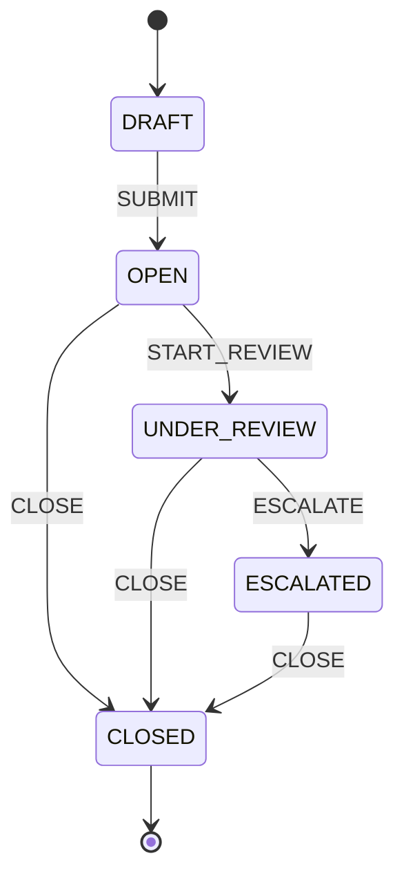
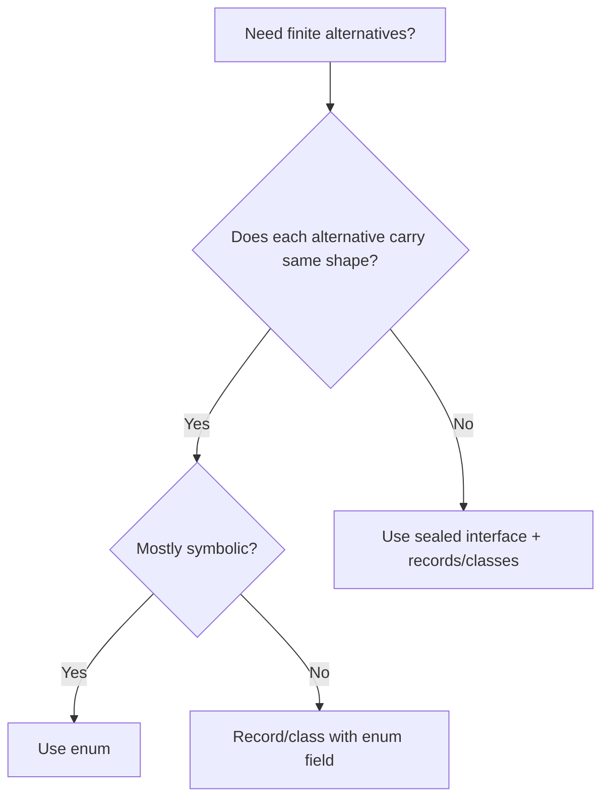
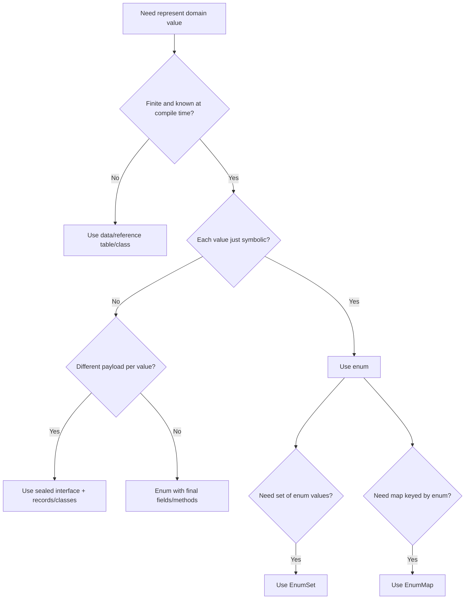

------
title: Learn Java Core Types, Data Model & Data APIs - Part 018
description: Deep engineering treatment of Java enums for closed symbolic domains: constants, identity, behavior, switch, persistence, EnumSet, EnumMap, state machines, and production failure modes.
series: learn-java-core-types
seriesTitle: Learn Java Core Types, Data Model & Data APIs
order: 18
partTitle: Enums for Closed Symbolic Domains
tags:
- java
- enum
- enumset
- enummap
- closed-domain
- state-machine
- type-system
- advanced
date: 2026-06-27
---

# Part 018 — Enums for Closed Symbolic Domains

> Target skill: mampu menggunakan `enum` sebagai **closed symbolic domain** yang type-safe, bukan sekadar pengganti integer constant atau string constant.

Enum adalah salah satu fitur Java yang sering dianggap mudah karena sintaksnya sederhana.

```java
public enum CaseStatus {
    OPEN,
    ESCALATED,
    CLOSED
}
```

Namun dalam sistem production, enum bisa menjadi salah satu alat modeling paling kuat untuk:

- state;
- category;
- capability;
- decision outcome;
- transition reason;
- policy mode;
- domain symbol;
- finite set;
- switch exhaustiveness;
- compact collection via `EnumSet` dan `EnumMap`.

Enum juga bisa menjadi sumber bug serius jika:

- `ordinal()` dipersist;
- enum dipakai untuk domain yang tidak benar-benar closed;
- external code bergantung ke `name()` secara rapuh;
- enum diberi mutable state;
- enum tumbuh menjadi god-object;
- switch tidak siap menghadapi evolution.

---

## 1. Kaufman Deconstruction

Skill “menguasai enums” kita pecah menjadi:

| Sub-skill | Yang harus dikuasai |
|---|---|
| Closed domain modeling | Kapan domain benar-benar finite dan known at compile time |
| Enum object model | Enum constant sebagai named singleton instance |
| Identity and equality | Kenapa `==` valid untuk enum |
| Behavior placement | Kapan enum boleh punya method/field/per-constant behavior |
| Persistence strategy | Kenapa `ordinal` buruk dan external code field lebih aman |
| Switch design | Exhaustive branch, default branch, evolution handling |
| EnumSet/EnumMap | Collection khusus enum yang compact dan semantic |
| State modeling | Enum untuk lifecycle state dan transition rules |
| Versioning | Menambah/menghapus/rename constant sebagai API/data change |
| Anti-pattern detection | Enum overuse, mutable enum, externalized enum yang tidak closed |

Pertanyaan utama:

> “Apakah nilai domain ini benar-benar himpunan simbolik tertutup yang stabil?”

Jika iya, enum sering menjadi representasi terbaik.

---

## 2. Mental Model: Enum as Named Singleton Instances

Setiap enum constant adalah instance dari enum class tersebut.

```java
public enum CaseStatus {
    OPEN,
    ESCALATED,
    CLOSED
}
```

Secara mental model, mirip:

```java
public final class CaseStatus extends Enum<CaseStatus> {
    public static final CaseStatus OPEN = new CaseStatus("OPEN", 0);
    public static final CaseStatus ESCALATED = new CaseStatus("ESCALATED", 1);
    public static final CaseStatus CLOSED = new CaseStatus("CLOSED", 2);

    private CaseStatus(String name, int ordinal) {
        super(name, ordinal);
    }
}
```

Ini bukan source literal yang boleh kita tulis, tetapi membantu memahami:

- enum constant adalah object;
- jumlah instance fixed;
- constructor enum tidak public;
- equality bisa pakai identity;
- enum punya name dan ordinal;
- enum bisa punya fields/methods.

---

## 3. Enum Is a Class

Enum adalah class khusus.

Artinya enum bisa:

- punya fields;
- punya constructor;
- punya methods;
- implement interface;
- punya abstract method yang diimplement per constant;
- punya static methods;
- punya nested types;
- digunakan sebagai generic type argument;
- digunakan di collections.

Contoh:

```java
public enum CasePriority {
    LOW(1),
    MEDIUM(5),
    HIGH(10),
    CRITICAL(20);

    private final int escalationWeight;

    CasePriority(int escalationWeight) {
        this.escalationWeight = escalationWeight;
    }

    public int escalationWeight() {
        return escalationWeight;
    }
}
```

Enum bukan hanya daftar label.

---

## 4. Enum Represents a Closed Symbolic Domain

Enum cocok untuk domain yang:

- finite;
- known at compile time;
- jarang berubah;
- perubahan constant adalah code/schema change yang bisa dikelola;
- semua nilai valid dapat disebutkan;
- caller perlu type-safety.

Contoh bagus:

```java
public enum CaseStatus {
    DRAFT,
    OPEN,
    UNDER_REVIEW,
    ESCALATED,
    CLOSED
}
```

Contoh buruk:

```java
public enum Country {
    INDONESIA,
    SINGAPORE,
    JAPAN,
    UNITED_STATES
}
```

Country list berubah secara politik, punya ISO code, localization, historical validity, dan external standard. Untuk banyak sistem, table/reference data lebih baik.

### Rule

> Enum cocok untuk domain closed by design, bukan closed karena saat ini datanya sedikit.

---

## 5. Enum vs String Constants

Buruk:

```java
public final class Statuses {
    public static final String OPEN = "OPEN";
    public static final String CLOSED = "CLOSED";
}

void transition(String status) { ... }
```

Masalah:

```java
transition("COLSED"); // typo compiles
transition("anything"); // compiles
```

Lebih baik:

```java
public enum CaseStatus {
    OPEN,
    CLOSED
}

void transition(CaseStatus status) { ... }
```

Sekarang invalid status tidak bisa direpresentasikan tanpa explicit unsafe mapping.

### Type-safety benefit

```java
public enum CaseStatus { OPEN, CLOSED }
public enum AccountStatus { OPEN, CLOSED }

void handleCase(CaseStatus status) {}

handleCase(AccountStatus.OPEN); // compile error
```

Walaupun symbol sama, type berbeda.

---

## 6. Enum Equality

Untuk enum, `==` adalah idiomatic dan aman.

```java
if (status == CaseStatus.OPEN) {
    ...
}
```

Karena enum constants adalah singleton instances.

`equals` juga bekerja:

```java
status.equals(CaseStatus.OPEN)
```

Tetapi `==` punya kelebihan:

```java
if (status == CaseStatus.OPEN) { ... }
```

Aman walaupun `status` null; hasilnya `false`.

Sedangkan:

```java
if (status.equals(CaseStatus.OPEN)) { ... }
```

akan NPE jika `status == null`.

Namun jangan gunakan null enum sebagai state normal. Absence tetap harus dimodelkan dengan jelas.

---

## 7. Enum `name()` vs `toString()`

Setiap enum punya `name()`.

```java
CaseStatus.OPEN.name(); // "OPEN"
```

`name()` adalah nama deklarasi constant.

`toString()` default mengembalikan `name()`, tetapi bisa dioverride.

```java
public enum CaseStatus {
    OPEN("Open"),
    CLOSED("Closed");

    private final String label;

    CaseStatus(String label) {
        this.label = label;
    }

    @Override
    public String toString() {
        return label;
    }
}
```

Sekarang:

```java
CaseStatus.OPEN.name();     // "OPEN"
CaseStatus.OPEN.toString(); // "Open"
```

### Rule

> Jangan gunakan `toString()` sebagai stable machine format. Gunakan explicit code field.

---

## 8. Enum `ordinal()` Is Not a Business Code

Setiap enum constant punya ordinal sesuai urutan deklarasi.

```java
public enum CaseStatus {
    DRAFT,       // ordinal 0
    OPEN,        // ordinal 1
    CLOSED       // ordinal 2
}
```

`ordinal()` berguna untuk internal enum machinery. Jangan persist ordinal.

Buruk:

```java
int stored = status.ordinal();
```

Jika enum berubah:

```java
public enum CaseStatus {
    DRAFT,
    OPEN,
    UNDER_REVIEW,
    CLOSED
}
```

Maka ordinal `CLOSED` berubah dari 2 menjadi 3. Data lama rusak.

### Rule keras

> Jangan persist, expose, atau rely on `ordinal()` sebagai business value.

Gunakan explicit code:

```java
public enum CaseStatus {
    DRAFT("DRAFT"),
    OPEN("OPEN"),
    UNDER_REVIEW("UNDER_REVIEW"),
    CLOSED("CLOSED");

    private final String code;

    CaseStatus(String code) {
        this.code = code;
    }

    public String code() {
        return code;
    }
}
```

---

## 9. External Code Mapping

Production enum sering butuh mapping dari external code.

```java
public enum CaseStatus {
    DRAFT("draft"),
    OPEN("open"),
    UNDER_REVIEW("under_review"),
    CLOSED("closed");

    private static final Map<String, CaseStatus> BY_CODE = Arrays.stream(values())
            .collect(Collectors.toUnmodifiableMap(CaseStatus::code, Function.identity()));

    private final String code;

    CaseStatus(String code) {
        this.code = code;
    }

    public String code() {
        return code;
    }

    public static CaseStatus fromCode(String code) {
        CaseStatus status = BY_CODE.get(code);
        if (status == null) {
            throw new IllegalArgumentException("unknown case status: " + code);
        }
        return status;
    }
}
```

Ini membuat external representation explicit.

Manfaat:

- bisa berbeda dari Java constant name;
- bisa stable walau internal name berubah;
- bisa handle legacy code;
- bisa validate unknown value;
- bisa centralize conversion.

---

## 10. Unknown External Values

Boundary eksternal bisa mengirim value yang tidak dikenal.

Jika kita parsing:

```java
CaseStatus.valueOf(raw);
```

Maka raw unknown melempar `IllegalArgumentException`.

Untuk internal domain, itu sering baik. Untuk API/client yang harus forward-compatible, kadang butuh explicit unknown handling.

```java
public enum ExternalCaseStatus {
    OPEN("open"),
    CLOSED("closed"),
    UNKNOWN("unknown");

    private final String code;

    ExternalCaseStatus(String code) {
        this.code = code;
    }

    public static ExternalCaseStatus fromCode(String code) {
        return switch (code) {
            case "open" -> OPEN;
            case "closed" -> CLOSED;
            default -> UNKNOWN;
        };
    }
}
```

Namun jangan menambahkan `UNKNOWN` ke internal domain sembarangan. `UNKNOWN` bisa merusak invariant jika business logic tidak tahu cara memprosesnya.

### Boundary rule

> Unknown value mungkin valid di integration boundary, tetapi biasanya tidak valid di core domain.

---

## 11. `values()` and `valueOf()`

Compiler menyediakan static method `values()` dan `valueOf(String)` untuk enum.

```java
CaseStatus[] all = CaseStatus.values();
CaseStatus open = CaseStatus.valueOf("OPEN");
```

`values()` mengembalikan array baru/copy. Jangan mutate dan mengira memengaruhi enum definition.

```java
CaseStatus[] statuses = CaseStatus.values();
statuses[0] = null; // only mutates this array copy
```

Untuk repeated hot path, hindari memanggil `values()` berkali-kali jika allocation penting.

```java
private static final CaseStatus[] ALL = values();
```

Namun jangan expose array internal:

```java
public static CaseStatus[] all() {
    return ALL.clone();
}
```

Atau lebih baik:

```java
public static List<CaseStatus> allStatuses() {
    return List.of(values());
}
```

---

## 12. Enum Fields Should Usually Be Final

Good:

```java
public enum RiskBand {
    LOW(0, 30),
    MEDIUM(31, 70),
    HIGH(71, 100);

    private final int minInclusive;
    private final int maxInclusive;

    RiskBand(int minInclusive, int maxInclusive) {
        this.minInclusive = minInclusive;
        this.maxInclusive = maxInclusive;
    }

    public boolean contains(int score) {
        return score >= minInclusive && score <= maxInclusive;
    }
}
```

Bad:

```java
public enum CaseStatus {
    OPEN;

    private int counter;

    public void increment() {
        counter++;
    }
}
```

Enum constants are global singleton objects. Mutable enum fields are effectively global mutable state.

### Rule

> Treat enum constants as immutable singletons.

---

## 13. Enum Constructor

Enum constructor is not public.

```java
public enum CasePriority {
    LOW(1), HIGH(10);

    private final int weight;

    CasePriority(int weight) {
        this.weight = weight;
    }
}
```

You cannot instantiate enum manually:

```java
// new CasePriority(1); // compile error
```

This is the point: all valid instances are declared as constants.

---

## 14. Enum with Methods

Enum can contain behavior derived from the symbol.

```java
public enum CasePriority {
    LOW(1),
    MEDIUM(5),
    HIGH(10),
    CRITICAL(20);

    private final int escalationWeight;

    CasePriority(int escalationWeight) {
        this.escalationWeight = escalationWeight;
    }

    public boolean requiresManagerReview() {
        return escalationWeight >= 10;
    }
}
```

This is good because behavior is stable and intrinsic to the enum value.

Bad:

```java
public enum CaseStatus {
    OPEN,
    CLOSED;

    public void saveToDatabase(CaseFile file) {
        Database.save(file);
    }
}
```

Database persistence is not intrinsic symbolic behavior. That belongs elsewhere.

### Rule

> Enum behavior should be intrinsic to the symbol, not application service behavior.

---

## 15. Per-Constant Behavior

Enum constants can override abstract methods.

```java
public enum EscalationPolicy {
    STANDARD {
        @Override
        public Instant dueAt(Instant openedAt) {
            return openedAt.plus(7, ChronoUnit.DAYS);
        }
    },
    URGENT {
        @Override
        public Instant dueAt(Instant openedAt) {
            return openedAt.plus(1, ChronoUnit.DAYS);
        }
    };

    public abstract Instant dueAt(Instant openedAt);
}
```

This removes switch:

```java
Instant due = policy.dueAt(openedAt);
```

But do not overuse. Per-constant class bodies can hide complex logic inside enum and make testing/reuse harder.

### Good use

- simple stable policy;
- formatting label;
- scoring weight;
- intrinsic transition capability;
- small algorithm variant.

### Bad use

- database access;
- HTTP calls;
- dependency injection;
- large business workflows;
- configuration-heavy rules.

---

## 16. Enum Implementing Interface

Enum can implement interface.

```java
public interface CodedEnum {
    String code();
}

public enum CaseStatus implements CodedEnum {
    OPEN("open"),
    CLOSED("closed");

    private final String code;

    CaseStatus(String code) {
        this.code = code;
    }

    @Override
    public String code() {
        return code;
    }
}
```

This helps generic utilities:

```java
public static <E extends Enum<E> & CodedEnum> E fromCode(
        Class<E> enumType,
        String code
) {
    for (E value : enumType.getEnumConstants()) {
        if (value.code().equals(code)) {
            return value;
        }
    }
    throw new IllegalArgumentException("unknown code: " + code);
}
```

Use carefully; generic enum utilities can become over-engineered.

---

## 17. Enum and Switch

Enum works naturally with `switch`.

```java
String label = switch (status) {
    case DRAFT -> "Draft";
    case OPEN -> "Open";
    case UNDER_REVIEW -> "Under review";
    case CLOSED -> "Closed";
};
```

For closed domains, switch can be clear and exhaustive.

### Avoid unnecessary default

If all enum constants are covered, adding `default` may hide future compiler help.

```java
return switch (status) {
    case DRAFT -> "Draft";
    case OPEN -> "Open";
    case UNDER_REVIEW -> "Under review";
    case CLOSED -> "Closed";
};
```

If a new enum constant is added later, compiler can flag missing branch.

With `default`:

```java
return switch (status) {
    case OPEN -> "Open";
    case CLOSED -> "Closed";
    default -> "Other";
};
```

A new status may silently fall into `Other`.

### Rule

> In internal domain switch, prefer explicit cases over broad default when exhaustiveness matters.

---

## 18. Null and Switch

Enum variable can be null.

```java
CaseStatus status = null;
```

Switching on null can throw unless null is handled depending on switch form/features.

Safer domain design:

```java
Objects.requireNonNull(status, "status");
```

or model absence explicitly before switching.

Do not add enum constant `NONE` just to avoid null unless `NONE` is a real domain value.

```java
public enum AssignmentStatus {
    UNASSIGNED,
    ASSIGNED
}
```

`UNASSIGNED` is valid if it is truly a business status. It is not just null replacement.

---

## 19. EnumSet

`EnumSet` is specialized `Set` implementation for enum types.

```java
EnumSet<CasePermission> permissions = EnumSet.of(
        CasePermission.READ,
        CasePermission.COMMENT,
        CasePermission.ASSIGN
);
```

It is usually more compact and efficient than `HashSet<Enum>`.

Good use cases:

- flags;
- permissions;
- capabilities;
- allowed transitions;
- supported modes;
- selected categories.

Example:

```java
public enum CasePermission {
    READ,
    COMMENT,
    ASSIGN,
    ESCALATE,
    CLOSE
}

public record UserCaseAccess(EnumSet<CasePermission> permissions) {
    public UserCaseAccess {
        permissions = permissions.clone();
    }

    public boolean can(CasePermission permission) {
        return permissions.contains(permission);
    }

    public Set<CasePermission> asSet() {
        return EnumSet.copyOf(permissions);
    }
}
```

But avoid exposing mutable `EnumSet` directly.

---

## 20. EnumSet Defensive Copy

`EnumSet` is mutable.

Bad:

```java
public record Permissions(EnumSet<CasePermission> values) {}
```

Caller can mutate it.

Better:

```java
public record Permissions(EnumSet<CasePermission> values) {
    public Permissions {
        values = values.clone();
    }

    @Override
    public EnumSet<CasePermission> values() {
        return values.clone();
    }

    public boolean contains(CasePermission permission) {
        return values.contains(permission);
    }
}
```

Alternative: store `Set.copyOf(values)` if mutation performance is not critical and you do not need EnumSet operations internally.

```java
public record Permissions(Set<CasePermission> values) {
    public Permissions {
        values = Set.copyOf(values);
    }
}
```

---

## 21. EnumMap

`EnumMap` is specialized `Map` where keys are enum constants.

```java
EnumMap<CaseStatus, Integer> counts = new EnumMap<>(CaseStatus.class);
counts.put(CaseStatus.OPEN, 42);
counts.put(CaseStatus.CLOSED, 10);
```

Good use cases:

- counts by status;
- handler by state;
- transition table;
- configuration per mode;
- display label per enum;
- policy per enum.

Example:

```java
EnumMap<CaseStatus, String> labels = new EnumMap<>(CaseStatus.class);
labels.put(CaseStatus.DRAFT, "Draft");
labels.put(CaseStatus.OPEN, "Open");
labels.put(CaseStatus.UNDER_REVIEW, "Under review");
labels.put(CaseStatus.CLOSED, "Closed");
```

However, for simple labels intrinsic to enum, field may be better:

```java
public enum CaseStatus {
    DRAFT("Draft"),
    OPEN("Open"),
    UNDER_REVIEW("Under review"),
    CLOSED("Closed");

    private final String label;

    CaseStatus(String label) {
        this.label = label;
    }

    public String label() {
        return label;
    }
}
```

Use `EnumMap` when mapping is contextual or external to enum.

---

## 22. EnumMap as Transition Table

Enums and `EnumMap` combine well for finite state machines.

```java
public enum CaseStatus {
    DRAFT,
    OPEN,
    UNDER_REVIEW,
    ESCALATED,
    CLOSED
}

public enum CaseAction {
    SUBMIT,
    START_REVIEW,
    ESCALATE,
    CLOSE,
    REOPEN
}
```

Transition table:

```java
public final class CaseTransitions {
    private static final EnumMap<CaseStatus, EnumSet<CaseAction>> ALLOWED =
            new EnumMap<>(CaseStatus.class);

    static {
        ALLOWED.put(CaseStatus.DRAFT, EnumSet.of(CaseAction.SUBMIT));
        ALLOWED.put(CaseStatus.OPEN, EnumSet.of(CaseAction.START_REVIEW, CaseAction.CLOSE));
        ALLOWED.put(CaseStatus.UNDER_REVIEW, EnumSet.of(CaseAction.ESCALATE, CaseAction.CLOSE));
        ALLOWED.put(CaseStatus.ESCALATED, EnumSet.of(CaseAction.CLOSE));
        ALLOWED.put(CaseStatus.CLOSED, EnumSet.noneOf(CaseAction.class));
    }

    public static boolean isAllowed(CaseStatus status, CaseAction action) {
        return ALLOWED.getOrDefault(status, EnumSet.noneOf(CaseAction.class))
                .contains(action);
    }
}
```

This is explicit and reviewable.

Mermaid view:



---

## 23. Enum as State: Good and Bad

Good enum state:

```java
public enum CaseStatus {
    DRAFT,
    OPEN,
    UNDER_REVIEW,
    ESCALATED,
    CLOSED
}
```

Good when:

- states are known;
- transitions are controlled elsewhere;
- state is stored as data;
- behavior not too variant-heavy.

Bad enum state:

```java
public enum CaseStatus {
    DRAFT,
    OPEN,
    UNDER_REVIEW,
    ESCALATED,
    CLOSED;

    public void apply(CaseFile file, CaseAction action) {
        // huge workflow logic here
    }
}
```

If enum becomes a giant workflow engine, refactor:

- state enum remains data;
- transition service handles rules;
- policy objects handle complex variation;
- state machine table documents allowed movement.

---

## 24. Enum vs Sealed Hierarchy

Use enum when each alternative has little/no different data.

```java
public enum DecisionStatus {
    APPROVED,
    REJECTED,
    NEEDS_MORE_INFORMATION
}
```

Use sealed hierarchy plus records when alternatives carry different payloads.

```java
public sealed interface ReviewDecision
        permits Approved, Rejected, NeedsMoreInformation {}

public record Approved(UserId reviewer, Instant at) implements ReviewDecision {}
public record Rejected(UserId reviewer, String reason, Instant at) implements ReviewDecision {}
public record NeedsMoreInformation(UserId reviewer, List<String> questions, Instant at)
        implements ReviewDecision {}
```

Decision flow:



---

## 25. Enum vs Boolean

Boolean is too small for many domains.

Bad:

```java
public record CaseFlag(boolean closed) {}
```

What about:

- draft?
- open?
- under review?
- escalated?
- archived?

Better:

```java
public enum CaseStatus {
    DRAFT,
    OPEN,
    UNDER_REVIEW,
    ESCALATED,
    CLOSED,
    ARCHIVED
}
```

Boolean is correct only when domain truly has two states and names are unambiguous.

Even then, enum can improve readability:

```java
public enum ValidationMode {
    STRICT,
    LENIENT
}
```

Instead of:

```java
validate(input, true); // what is true?
```

Use:

```java
validate(input, ValidationMode.STRICT);
```

---

## 26. Enum vs Database Reference Table

Enum is compile-time closed.

Database reference table is runtime configurable.

Use enum for:

- lifecycle states controlled by code;
- internal modes;
- stable finite categories;
- protocol symbols owned by application;
- permissions known by code.

Use reference table for:

- values administered by business users;
- values changing without deployment;
- localized labels;
- effective dates;
- regulatory list maintained externally;
- country/currency/industry codes;
- values requiring metadata.

Hybrid approach:

```java
public enum CaseTypeKind {
    CONSUMER_PROTECTION,
    MARKET_ABUSE,
    LICENSING,
    OTHER
}
```

and database table for detailed subtypes.

---

## 27. Enum Persistence Strategy

Bad persistence:

```java
// stores ordinal
@Enumerated(EnumType.ORDINAL)
private CaseStatus status;
```

Better in many systems:

```java
// stores string name
@Enumerated(EnumType.STRING)
private CaseStatus status;
```

But even `EnumType.STRING` stores Java constant name. If external storage format must survive rename, use explicit code conversion.

```java
public enum CaseStatus {
    OPEN("open"),
    CLOSED("closed");

    private final String code;

    CaseStatus(String code) {
        this.code = code;
    }

    public String code() {
        return code;
    }

    public static CaseStatus fromCode(String code) { ... }
}
```

Then persistence layer stores `code()`.

### Persistence rule

> Store explicit stable business code, not ordinal. Store name only if Java enum names are accepted as schema contract.

---

## 28. Enum Versioning

Adding enum constant is a code change and often a data/API change.

### Add constant

```java
public enum CaseStatus {
    DRAFT,
    OPEN,
    SUSPENDED,
    CLOSED
}
```

Review impact:

- switch expressions;
- JSON clients;
- database constraints;
- UI dropdowns;
- analytics grouping;
- permissions;
- transition tables;
- reports;
- API documentation;
- tests;
- data migration.

### Remove constant

Harder. Existing data may contain removed value.

### Rename constant

If persisted by name, rename breaks stored data. If exposed in API, rename breaks clients.

### Rule

> Treat enum evolution like schema evolution.

---

## 29. Enum and API Design

Public API enum is a contract.

```java
public enum SortDirection {
    ASC,
    DESC
}
```

External clients may depend on exact symbols.

For REST/JSON, avoid exposing Java implementation accidentally:

```java
public enum SortDirection {
    ASC("asc"),
    DESC("desc");

    private final String wireValue;

    SortDirection(String wireValue) {
        this.wireValue = wireValue;
    }

    public String wireValue() {
        return wireValue;
    }
}
```

This separates internal constant name from wire value.

---

## 30. Enum and Localization

Do not store localized label inside enum as the only representation.

Bad:

```java
public enum CaseStatus {
    OPEN("Terbuka"),
    CLOSED("Ditutup");

    private final String label;
}
```

This locks enum to one locale.

Better:

```java
public enum CaseStatus {
    OPEN("case.status.open"),
    CLOSED("case.status.closed");

    private final String messageKey;

    CaseStatus(String messageKey) {
        this.messageKey = messageKey;
    }

    public String messageKey() {
        return messageKey;
    }
}
```

Then localization layer resolves message key.

---

## 31. Enum and Ordering

Enum natural order follows declaration order via `compareTo`.

```java
CasePriority.LOW.compareTo(CasePriority.HIGH) < 0
```

This is useful only if declaration order is intended order.

For business order, be explicit:

```java
public enum CasePriority {
    LOW(10),
    MEDIUM(20),
    HIGH(30),
    CRITICAL(40);

    private final int rank;

    CasePriority(int rank) {
        this.rank = rank;
    }

    public int rank() {
        return rank;
    }
}
```

Then sort:

```java
Comparator.comparingInt(CasePriority::rank)
```

Do not rely on ordinal unless declaration order is intentionally part of the contract.

---

## 32. Enum as Permissions and Flags

Instead of bit flags:

```java
int permissions = READ | WRITE | DELETE;
```

Use `EnumSet`:

```java
EnumSet<Permission> permissions = EnumSet.of(
        Permission.READ,
        Permission.WRITE
);
```

This gives:

- type safety;
- readable code;
- set operations;
- no bit math errors;
- easy review.

Example:

```java
public enum Permission {
    READ_CASE,
    COMMENT_ON_CASE,
    ASSIGN_CASE,
    ESCALATE_CASE,
    CLOSE_CASE
}

public final class AccessPolicy {
    private final EnumSet<Permission> permissions;

    public AccessPolicy(Set<Permission> permissions) {
        this.permissions = permissions.isEmpty()
                ? EnumSet.noneOf(Permission.class)
                : EnumSet.copyOf(permissions);
    }

    public boolean allows(Permission permission) {
        return permissions.contains(permission);
    }

    public Set<Permission> snapshot() {
        return EnumSet.copyOf(permissions);
    }
}
```

---

## 33. Enum and Strategy Pattern Boundary

Sometimes enum with behavior replaces simple strategy.

```java
public enum RoundingPolicy {
    DOWN {
        @Override
        BigDecimal round(BigDecimal value) {
            return value.setScale(2, RoundingMode.DOWN);
        }
    },
    HALF_UP {
        @Override
        BigDecimal round(BigDecimal value) {
            return value.setScale(2, RoundingMode.HALF_UP);
        }
    };

    abstract BigDecimal round(BigDecimal value);
}
```

This is fine if:

- strategies are fixed;
- no DI needed;
- no external dependencies;
- behavior is small;
- testing remains simple.

Use separate classes if:

- strategies need dependencies;
- variants are plugin-like;
- behavior is large;
- variants change independently;
- configuration drives behavior.

---

## 34. Enum Initialization Pitfalls

Enum constants are initialized during class initialization.

Avoid complex initialization that depends on other mutable/global systems.

Bad:

```java
public enum ReportType {
    CASE_SUMMARY(ReportRegistry.lookup("case_summary"));

    private final ReportTemplate template;

    ReportType(ReportTemplate template) {
        this.template = template;
    }
}
```

This can create class loading order problems and hidden startup failures.

Better:

```java
public enum ReportType {
    CASE_SUMMARY("case_summary");

    private final String templateKey;

    ReportType(String templateKey) {
        this.templateKey = templateKey;
    }
}
```

Resolve external dependency in service layer.

---

## 35. Enum and Serialization

Enums have special serialization behavior: enum constant identity is preserved by name.

This is generally safer than ordinary object serialization, but still remember:

- rename breaks serialized data;
- remove constant breaks deserialization;
- external serialized form may become contract;
- Java native serialization is usually not ideal for external boundaries.

For JSON/API, control wire value explicitly.

---

## 36. Enum and Testing

Enums make exhaustive tests easy.

```java
@ParameterizedTest
@EnumSource(CaseStatus.class)
void everyStatusHasLabel(CaseStatus status) {
    assertThat(status.label()).isNotBlank();
}
```

Transition completeness:

```java
@ParameterizedTest
@EnumSource(CaseStatus.class)
void everyStatusHasTransitionRule(CaseStatus status) {
    assertThat(CaseTransitions.allowedActions(status)).isNotNull();
}
```

Mapping completeness:

```java
@ParameterizedTest
@EnumSource(CaseStatus.class)
void codeRoundTrips(CaseStatus status) {
    assertThat(CaseStatus.fromCode(status.code())).isEqualTo(status);
}
```

Test enum evolution explicitly.

---

## 37. Enum Review Checklist

Before adding enum:

1. Is the domain truly closed?
2. Are values known at compile time?
3. Is change frequency low enough for deployment-based evolution?
4. Is enum better than reference data table?
5. Are constant names stable?
6. Is external code explicit?
7. Are we avoiding `ordinal()` for persistence/business logic?
8. Are fields immutable?
9. Is behavior intrinsic and small?
10. Are switch expressions exhaustive?
11. Are transition rules explicit?
12. Are `EnumSet`/`EnumMap` useful?
13. Is localization separated from enum?
14. Is unknown external value handled at boundary?
15. Is adding/removing constants reviewed as schema change?

---

## 38. Common Enum Anti-Patterns

### Anti-pattern 1 — Persisting ordinal

```java
status.ordinal()
```

Breaks when order changes.

### Anti-pattern 2 — Enum for configurable data

```java
public enum ProductCategory { ... }
```

If business users manage categories, use data store.

### Anti-pattern 3 — Mutable enum state

```java
private int counter;
```

Global mutable singleton state.

### Anti-pattern 4 — Huge enum with service logic

```java
enum WorkflowStep {
    STEP1 { void execute() { ... 200 lines ... } }
}
```

Hard to test and evolve.

### Anti-pattern 5 — `default` swallowing future enum constants

```java
switch (status) {
    case OPEN -> ...;
    default -> ...;
}
```

May hide missing handling.

### Anti-pattern 6 — Using `toString()` as wire protocol

`toString()` is for human/debug representation unless explicitly documented otherwise.

### Anti-pattern 7 — Enum for non-closed external standard

Countries, currencies, legal codes, industry codes, and regulatory taxonomies often need external reference data, effective dates, and metadata.

---

## 39. Case Study: Regulatory Case Lifecycle

Imagine this status enum:

```java
public enum CaseStatus {
    DRAFT,
    OPEN,
    ASSESSMENT,
    INVESTIGATION,
    ENFORCEMENT_REVIEW,
    CLOSED
}
```

Transition enum:

```java
public enum CaseAction {
    SUBMIT,
    START_ASSESSMENT,
    OPEN_INVESTIGATION,
    SEND_TO_ENFORCEMENT_REVIEW,
    CLOSE
}
```

Transition table:

```java
public final class CaseLifecycle {
    private static final EnumMap<CaseStatus, EnumSet<CaseAction>> ALLOWED =
            new EnumMap<>(CaseStatus.class);

    static {
        ALLOWED.put(CaseStatus.DRAFT, EnumSet.of(CaseAction.SUBMIT));
        ALLOWED.put(CaseStatus.OPEN, EnumSet.of(CaseAction.START_ASSESSMENT, CaseAction.CLOSE));
        ALLOWED.put(CaseStatus.ASSESSMENT, EnumSet.of(CaseAction.OPEN_INVESTIGATION, CaseAction.CLOSE));
        ALLOWED.put(CaseStatus.INVESTIGATION, EnumSet.of(CaseAction.SEND_TO_ENFORCEMENT_REVIEW, CaseAction.CLOSE));
        ALLOWED.put(CaseStatus.ENFORCEMENT_REVIEW, EnumSet.of(CaseAction.CLOSE));
        ALLOWED.put(CaseStatus.CLOSED, EnumSet.noneOf(CaseAction.class));
    }

    public static void requireAllowed(CaseStatus status, CaseAction action) {
        if (!ALLOWED.getOrDefault(status, EnumSet.noneOf(CaseAction.class)).contains(action)) {
            throw new IllegalStateException("Action " + action + " is not allowed from " + status);
        }
    }
}
```

This gives:

- auditability;
- testability;
- reviewable state model;
- compact representation;
- clear transition failures.

But if transitions depend on many dynamic policies, do not force all logic into enum. Keep enum as state vocabulary and move policy to dedicated services.

---

## 40. Case Study: Enum as External Code Mapper

```java
public enum ViolationSeverity {
    LOW("L", 1),
    MEDIUM("M", 5),
    HIGH("H", 10),
    CRITICAL("C", 20);

    private static final Map<String, ViolationSeverity> BY_CODE = Arrays.stream(values())
            .collect(Collectors.toUnmodifiableMap(ViolationSeverity::code, Function.identity()));

    private final String code;
    private final int weight;

    ViolationSeverity(String code, int weight) {
        this.code = code;
        this.weight = weight;
    }

    public String code() {
        return code;
    }

    public int weight() {
        return weight;
    }

    public static ViolationSeverity fromCode(String code) {
        ViolationSeverity severity = BY_CODE.get(code);
        if (severity == null) {
            throw new IllegalArgumentException("unknown severity code: " + code);
        }
        return severity;
    }
}
```

Good properties:

- external code explicit;
- weight intrinsic;
- parse centralized;
- invalid code rejected;
- no ordinal dependency.

Potential risk:

- if severity definitions become administratively configurable, move to reference data.

---

## 41. Case Study: EnumSet for Capabilities

```java
public enum CaseCapability {
    CAN_VIEW,
    CAN_COMMENT,
    CAN_ASSIGN,
    CAN_ESCALATE,
    CAN_CLOSE,
    CAN_REOPEN
}
```

Access result:

```java
public record CaseAccess(EnumSet<CaseCapability> capabilities) {
    public CaseAccess {
        capabilities = capabilities.clone();
    }

    public boolean can(CaseCapability capability) {
        return capabilities.contains(capability);
    }

    @Override
    public EnumSet<CaseCapability> capabilities() {
        return capabilities.clone();
    }
}
```

Policy builder:

```java
public final class CaseAccessPolicy {
    public CaseAccess evaluate(User user, CaseFile caseFile) {
        EnumSet<CaseCapability> result = EnumSet.of(CaseCapability.CAN_VIEW);

        if (user.hasRole(Role.INVESTIGATOR) && caseFile.isOpen()) {
            result.add(CaseCapability.CAN_COMMENT);
            result.add(CaseCapability.CAN_ESCALATE);
        }

        if (user.hasRole(Role.SUPERVISOR)) {
            result.add(CaseCapability.CAN_ASSIGN);
            result.add(CaseCapability.CAN_CLOSE);
        }

        return new CaseAccess(result);
    }
}
```

This is clearer than multiple booleans:

```java
boolean canView;
boolean canComment;
boolean canAssign;
boolean canEscalate;
boolean canClose;
```

---

## 42. Enum Design Decision Table

| Need | Better choice |
|---|---|
| Fixed symbolic values | `enum` |
| Fixed symbolic values with different payload per alternative | sealed interface + records/classes |
| User-configurable reference data | database/reference table |
| Bit flags/permissions | `EnumSet` |
| Mapping enum to contextual value | `EnumMap` |
| Simple true/false | `boolean` if obvious, enum if call-site ambiguity matters |
| External standard list | usually reference data, not enum |
| Stable internal lifecycle states | enum |
| Complex workflow behavior | enum for state vocabulary, service/policy for logic |

---

## 43. Practice Drills

### Drill 1 — Replace string status

Start with:

```java
void updateStatus(String status) { ... }
```

Refactor to:

```java
void updateStatus(CaseStatus status) { ... }
```

Add:

- enum constants;
- external code field;
- `fromCode` parser;
- invalid code test.

### Drill 2 — Remove ordinal persistence

Given a database column storing enum ordinal, design migration to stable string/code.

Include:

- old ordinal mapping;
- new code mapping;
- migration script idea;
- compatibility strategy;
- tests.

### Drill 3 — Build transition table

Create:

- `CaseStatus`;
- `CaseAction`;
- `EnumMap<CaseStatus, EnumSet<CaseAction>>`;
- `isAllowed`;
- tests for every state.

### Drill 4 — EnumSet permissions

Model user capabilities with `EnumSet`.

Compare against:

- multiple booleans;
- `Set<String>`;
- bitmask int.

Explain trade-offs.

### Drill 5 — Enum or reference table?

Decide representation for:

- case status;
- violation severity;
- country;
- currency;
- user role;
- report category maintained by admins;
- workflow action;
- external regulatory taxonomy.

Explain each decision.

---

## 44. Code Review Comments for Enums

Use these in review.

### “Do not persist ordinal.”

Use explicit code/name strategy.

### “This enum may not be closed.”

If values are business-managed, use reference data.

### “This enum has mutable state.”

Enum constants are singleton global objects. Make state final or move elsewhere.

### “This switch default hides missing enum handling.”

Prefer exhaustive cases for internal domains.

### “This behavior does not belong in enum.”

Move application/service behavior outside.

### “Wire value should not depend on `toString()`.”

Use explicit `code()` or serializer config.

### “This enum is becoming a workflow engine.”

Split state vocabulary from transition/policy logic.

---

## 45. Mental Model Summary



Enum is a closed vocabulary.

`EnumSet` is a type-safe set of that vocabulary.

`EnumMap` is a type-safe table indexed by that vocabulary.

Together, they are extremely strong tools for finite domain modeling.

---

## 46. Core Takeaways

1. Enum is for closed symbolic domains, not just convenient constants.
2. Enum constants are singleton instances; `==` is idiomatic for equality.
3. `name()` is declaration name; `toString()` is not a stable machine format unless explicitly designed.
4. Never persist or expose `ordinal()` as business data.
5. Use explicit code fields for external/persistent representation.
6. Enum fields should usually be final; mutable enum state is global mutable state.
7. Put only intrinsic, small behavior inside enum.
8. Use `EnumSet` for sets of enum constants such as permissions/capabilities.
9. Use `EnumMap` for maps keyed by enum such as transition tables and counts.
10. Prefer exhaustive switch cases for internal enum domains.
11. Treat enum evolution as schema/API evolution.
12. Use sealed hierarchy instead of enum when alternatives carry different payload shapes.
13. Use reference data instead of enum when values are externally governed or business-configurable.
14. Enum is one of Java’s best tools for making invalid symbolic states unrepresentable.

---

## 47. References

- Java Language Specification, Java SE 25, Chapter 8: Classes, especially enum classes.
- Java SE 25 API Documentation: `java.lang.Enum`.
- Java SE 25 API Documentation: `java.util.EnumSet`.
- Java SE 25 API Documentation: `java.util.EnumMap`.
- Java SE 25 API Documentation: `java.lang.Class#getEnumConstants`.
- Previous parts in this series: Part 007, Part 012, Part 013, Part 015, Part 016, Part 017.
