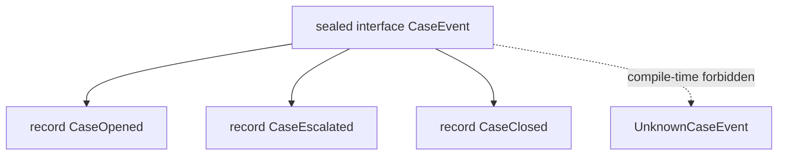
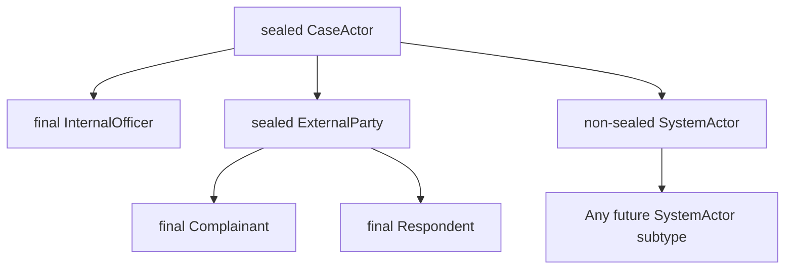
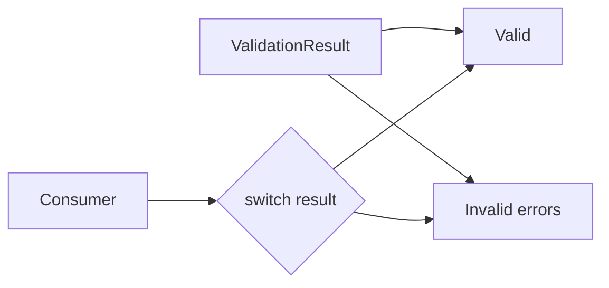
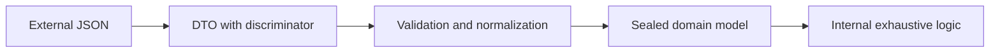
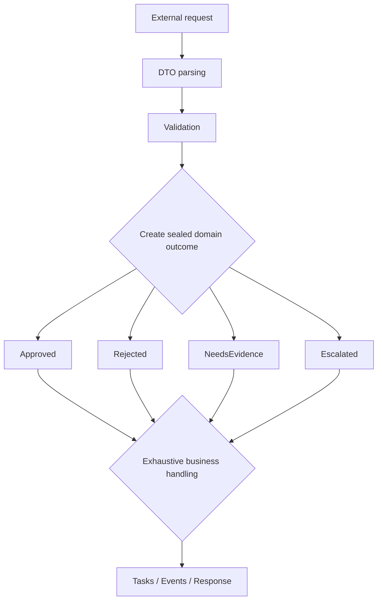

------
title: Learn Java Core Types, Data Model & Data APIs - Part 019
description: Deep engineering treatment of Java sealed classes and sealed interfaces for closed domain modeling, exhaustive reasoning, hierarchy control, and production API design.
series: learn-java-core-types
seriesTitle: Learn Java Core Types, Data Model & Data APIs
order: 19
partTitle: Sealed Types and Domain Closedness
tags:
- java
- sealed-types
- sealed-class
- sealed-interface
- domain-modeling
- type-system
- pattern-matching
- advanced
date: 2026-06-27
---

# Part 019 — Sealed Types and Domain Closedness

> Target skill: mampu memakai `sealed class` dan `sealed interface` untuk memodelkan domain tertutup secara eksplisit, sehingga compiler membantu menjaga completeness, subtype boundary, dan reasoning terhadap semua kemungkinan bentuk data.

Di part sebelumnya kita melihat `enum` sebagai representasi untuk himpunan simbolik tertutup:

```java
public enum CaseStatus {
    OPEN,
    ESCALATED,
    CLOSED
}
```

Namun tidak semua domain tertutup bisa direpresentasikan sebagai enum.

Kadang setiap variasi domain punya payload berbeda:

```java
sealed interface CaseEvent permits CaseOpened, CaseEscalated, CaseClosed {}

record CaseOpened(String caseId, String openedBy) implements CaseEvent {}
record CaseEscalated(String caseId, String reason, int severity) implements CaseEvent {}
record CaseClosed(String caseId, String resolutionCode) implements CaseEvent {}
```

Di sini kita tidak hanya punya simbol `OPENED`, `ESCALATED`, atau `CLOSED`. Kita punya beberapa **bentuk data** yang berbeda tetapi berada di bawah satu keluarga semantic yang tertutup: `CaseEvent`.

Itulah area tempat sealed types menjadi sangat kuat.

---

## 1. Kaufman Deconstruction

Skill “menguasai sealed types” kita pecah menjadi:

| Sub-skill | Yang harus dikuasai |
|---|---|
| Closed hierarchy modeling | Menentukan kapan subtype universe harus dibatasi |
| Syntax and rules | `sealed`, `permits`, `final`, `sealed`, `non-sealed` |
| Type boundary design | Memisahkan root type, permitted subtype, package/module boundary |
| Domain completeness | Menggunakan sealed hierarchy agar semua variasi domain terlihat |
| Pattern matching integration | Memanfaatkan exhaustiveness pada `switch`/pattern matching |
| Enum vs sealed decision | Memilih enum, record, class, atau sealed hierarchy |
| API evolution | Memahami breaking change saat subtype ditambah/dihapus |
| Framework boundary | Serialization, deserialization, ORM, proxy, reflection |
| Failure modeling | Menghindari `non-sealed` leak, default branch abuse, dan hierarchy overdesign |

Pertanyaan utama:

> “Apakah tipe ini seharusnya punya jumlah direct subtype yang terbatas dan diketahui oleh pemilik model?”

Jika jawabannya iya, sealed type patut dipertimbangkan.

---

## 2. Mental Model: Sealed Type adalah Perimeter Subtyping

Sealed type bukan tentang membuat object immutable.

Sealed type bukan tentang security boundary runtime.

Sealed type bukan tentang mencegah semua subclass di dunia absolut.

Sealed type adalah cara mengatakan:

> “Untuk root type ini, hanya daftar direct subtype tertentu yang boleh extend atau implement.”

Diagram mentalnya:



Jika `UnknownCaseEvent` tidak ada di daftar `permits`, compiler menolak implementasi tersebut.

Ini memberi kita tiga keuntungan besar:

1. **Domain visibility** — semua variasi utama domain terlihat dari root type.
2. **Exhaustive reasoning** — compiler bisa membantu mengecek apakah semua variasi sudah ditangani.
3. **Controlled extension** — pemilik model mengontrol siapa yang boleh menjadi subtype langsung.

---

## 3. Syntax Dasar

Bentuk paling umum:

```java
public sealed interface CaseDecision
        permits ApproveDecision, RejectDecision, RequestMoreInfoDecision {
}

public record ApproveDecision(String approvedBy) implements CaseDecision {}

public record RejectDecision(String rejectedBy, String reason) implements CaseDecision {}

public record RequestMoreInfoDecision(String requestedFrom, String question)
        implements CaseDecision {}
```

Karena `record` secara implisit `final`, ia cocok sebagai leaf subtype sealed interface.

Bentuk sealed abstract class:

```java
public abstract sealed class EnforcementAction
        permits WarningAction, FineAction, SuspensionAction {

    private final String caseId;

    protected EnforcementAction(String caseId) {
        if (caseId == null || caseId.isBlank()) {
            throw new IllegalArgumentException("caseId must not be blank");
        }
        this.caseId = caseId;
    }

    public final String caseId() {
        return caseId;
    }
}

public final class WarningAction extends EnforcementAction {
    public WarningAction(String caseId) {
        super(caseId);
    }
}

public final class FineAction extends EnforcementAction {
    private final long amountInMinorUnits;

    public FineAction(String caseId, long amountInMinorUnits) {
        super(caseId);
        if (amountInMinorUnits <= 0) {
            throw new IllegalArgumentException("fine amount must be positive");
        }
        this.amountInMinorUnits = amountInMinorUnits;
    }

    public long amountInMinorUnits() {
        return amountInMinorUnits;
    }
}

public final class SuspensionAction extends EnforcementAction {
    public SuspensionAction(String caseId) {
        super(caseId);
    }
}
```

Gunakan sealed interface ketika root type terutama menjadi **sum type** atau domain category.

Gunakan sealed abstract class ketika root type perlu membawa shared state, constructor control, atau shared implementation.

---

## 4. Tiga Modifier Wajib pada Direct Subtype

Direct subtype dari sealed type harus memilih salah satu dari tiga status:

| Modifier | Arti |
|---|---|
| `final` | Hierarchy berhenti di subtype ini |
| `sealed` | Subtype tetap tertutup, tetapi punya permitted subtype lanjutan |
| `non-sealed` | Subtype membuka kembali inheritance untuk cabang ini |

Contoh:

```java
sealed interface CaseActor permits InternalOfficer, ExternalParty, SystemActor {}

record InternalOfficer(String officerId) implements CaseActor {}

sealed interface ExternalParty extends CaseActor
        permits Complainant, Respondent {
}

record Complainant(String partyId) implements ExternalParty {}
record Respondent(String partyId) implements ExternalParty {}

non-sealed interface SystemActor extends CaseActor {
}
```

Diagram:



`non-sealed` harus dipakai dengan hati-hati. Ia adalah “lubang resmi” pada perimeter.

Kalau sebuah cabang `non-sealed`, maka branch tersebut tidak lagi tertutup. Ini bukan salah, tetapi harus disengaja.

---

## 5. `permits` dan Lokasi Subtype

Bentuk eksplisit:

```java
public sealed interface ReviewOutcome
        permits Approved, Rejected, Deferred {
}
```

Bentuk ringkas dalam satu source file:

```java
sealed interface ReviewOutcome {}

record Approved(String reviewer) implements ReviewOutcome {}
record Rejected(String reviewer, String reason) implements ReviewOutcome {}
record Deferred(String reviewer, String note) implements ReviewOutcome {}
```

Dalam bentuk ringkas, compiler dapat menginfer permitted subtype yang dideklarasikan dalam compilation unit yang sama.

Namun untuk production code yang lintas file, eksplisit lebih jelas:

```java
public sealed interface ReviewOutcome
        permits Approved, Rejected, Deferred {
}
```

Prinsip praktis:

- untuk tutorial atau model kecil, omitted `permits` bisa nyaman;
- untuk codebase besar, eksplisitkan `permits` agar boundary terbaca saat membuka root type;
- jangan sembunyikan subtype penting di file yang jauh tanpa alasan desain yang kuat.

---

## 6. Package dan Module Boundary

Sealed type bukan hanya sintaks. Ia punya boundary penempatan.

Secara praktis:

- permitted direct subtype harus berada dalam package/module boundary yang sesuai;
- dalam named module, permitted subtype harus berada dalam module yang sama;
- dalam unnamed module, permitted subtype harus berada dalam package yang sama.

Ini penting untuk architecture.

Jika Anda membuat public sealed interface di module `case-domain`, external module tidak bisa begitu saja menambahkan implementation baru. Ini bagus untuk domain model yang harus dikendalikan.

Contoh package layout:

```text
com.acme.case.domain.event
├── CaseEvent.java
├── CaseOpened.java
├── CaseAssigned.java
├── CaseEscalated.java
└── CaseClosed.java
```

Root type:

```java
package com.acme.case.domain.event;

public sealed interface CaseEvent
        permits CaseOpened, CaseAssigned, CaseEscalated, CaseClosed {
}
```

Ini menjadikan package tersebut sebagai rumah resmi dari event family.

---

## 7. Sealed Type sebagai Algebraic Data Type ala Java

Dalam functional programming, kita sering mendengar istilah **sum type**: sebuah value bisa berupa salah satu dari beberapa variasi.

Java tidak punya algebraic data type secara langsung seperti beberapa bahasa lain, tetapi kombinasi:

- sealed interface;
- record;
- pattern matching;
- exhaustive switch;

memberi model yang mirip.

Contoh:

```java
public sealed interface ValidationResult
        permits Valid, Invalid {
}

public record Valid() implements ValidationResult {}

public record Invalid(List<String> errors) implements ValidationResult {
    public Invalid {
        errors = List.copyOf(errors);
        if (errors.isEmpty()) {
            throw new IllegalArgumentException("errors must not be empty");
        }
    }
}
```

Pemakai:

```java
static String render(ValidationResult result) {
    return switch (result) {
        case Valid ignored -> "valid";
        case Invalid invalid -> "invalid: " + invalid.errors();
    };
}
```

Mental model:



Keuntungan desain:

- tidak perlu sentinel `null`;
- tidak perlu boolean + nullable error list;
- tidak perlu string status;
- tidak perlu inheritance terbuka;
- semua outcome terlihat.

Bandingkan dengan model rapuh:

```java
public record ValidationResponse(boolean valid, List<String> errors) {}
```

Model ini punya state ambigu:

| `valid` | `errors` | Makna |
|---|---|---|
| `true` | empty | valid |
| `false` | non-empty | invalid |
| `true` | non-empty | kontradiktif |
| `false` | empty | incomplete |
| any | null | error-prone |

Sealed type menghilangkan state yang tidak valid dari representasi.

---

## 8. Domain Closedness

Sealed type paling berguna ketika domain punya closedness yang nyata.

Contoh domain tertutup:

- hasil validasi internal;
- command internal pada bounded context;
- event internal yang diterbitkan service;
- lifecycle transition reason;
- decision outcome;
- expression tree;
- query AST;
- calculation result;
- permission decision;
- parse result;
- workflow node internal.

Contoh domain yang biasanya tidak cocok sealed:

- plugin extension point untuk pihak ketiga;
- driver/vendor implementation;
- strategy implementation yang sengaja extensible;
- framework callback type;
- domain taxonomy yang sering berubah karena regulasi eksternal;
- integration payload dari sistem yang tidak kita kontrol.

Rule of thumb:

> Seal model yang Anda miliki dan ingin tutup. Jangan seal extension point yang memang ingin dibuka.

---

## 9. Enum vs Sealed Type

Gunakan enum ketika variasi adalah simbol tanpa payload berbeda.

```java
public enum RiskLevel {
    LOW,
    MEDIUM,
    HIGH
}
```

Gunakan sealed type ketika variasi punya struktur data berbeda.

```java
sealed interface RiskAssessment permits LowRisk, MediumRisk, HighRisk {}

record LowRisk() implements RiskAssessment {}
record MediumRisk(String reason) implements RiskAssessment {}
record HighRisk(String reason, List<String> mandatoryActions) implements RiskAssessment {}
```

Tabel keputusan:

| Situasi | Pilihan utama |
|---|---|
| Nilai finite, tidak ada payload | `enum` |
| Nilai finite, payload berbeda per variasi | sealed interface + record |
| Butuh shared state/constructor | sealed abstract class |
| Butuh behavior polymorphic terbuka | interface biasa |
| Butuh DTO transparan satu bentuk | record |
| Butuh entity mutable/lifecycle | class biasa |

Anti-pattern umum:

```java
public record Decision(String type, String reason, String approver, Integer retryAfterDays) {}
```

Masalah:

- `type` string bisa salah ketik;
- field mana yang wajib bergantung ke type;
- kombinasi invalid mudah muncul;
- caller harus ingat matrix aturan.

Lebih baik:

```java
sealed interface Decision permits Approved, Rejected, Deferred {}

record Approved(String approver) implements Decision {}
record Rejected(String reason) implements Decision {}
record Deferred(int retryAfterDays) implements Decision {}
```

---

## 10. Exhaustive Switch

Salah satu manfaat besar sealed type adalah exhaustive switch.

```java
static int priority(CaseEvent event) {
    return switch (event) {
        case CaseOpened ignored -> 10;
        case CaseAssigned ignored -> 20;
        case CaseEscalated escalated -> escalated.severity() >= 8 ? 100 : 80;
        case CaseClosed ignored -> 0;
    };
}
```

Jika semua permitted subtype tertangani, branch `default` tidak diperlukan.

Ini bagus karena ketika subtype baru ditambahkan, compiler bisa memaksa consumer tertentu memperbarui logikanya.

Bandingkan:

```java
static int priority(CaseEvent event) {
    return switch (event) {
        case CaseOpened ignored -> 10;
        case CaseAssigned ignored -> 20;
        default -> 0;
    };
}
```

`default` di sini bisa menyembunyikan perubahan domain.

Guideline:

- untuk domain internal closed, hindari `default` jika ingin compiler membantu exhaustiveness;
- untuk boundary eksternal, `default`/fallback bisa valid karena input bisa datang dari versi masa depan;
- bedakan **exhaustive internal model** dan **robust external protocol handling**.

---

## 11. Pattern Matching dan Data Extraction

Sealed type sering dipakai bersama record pattern/pattern matching.

Contoh sederhana:

```java
static String describe(Decision decision) {
    return switch (decision) {
        case Approved approved -> "approved by " + approved.approver();
        case Rejected rejected -> "rejected: " + rejected.reason();
        case Deferred deferred -> "deferred for " + deferred.retryAfterDays() + " days";
    };
}
```

Manfaatnya bukan hanya syntax ringkas.

Manfaat utamanya:

- branch sesuai bentuk data;
- payload tersedia di branch yang benar;
- tidak ada cast manual;
- invalid combination hilang;
- logic menjadi dekat dengan domain variant.

Buruk:

```java
if (decision instanceof Approved) {
    Approved approved = (Approved) decision;
    return "approved by " + approved.approver();
}
if (decision instanceof Rejected) {
    Rejected rejected = (Rejected) decision;
    return "rejected: " + rejected.reason();
}
return "unknown";
```

Masalah:

- branch fallback bisa menyembunyikan subtype baru;
- cast manual meningkatkan noise;
- logic tidak terlihat exhaustive.

---

## 12. Sealed Type untuk Workflow dan Regulatory Lifecycle

Dalam sistem case management atau enforcement lifecycle, sealed type berguna untuk memisahkan:

- state;
- event;
- command;
- decision;
- transition;
- violation;
- remediation;
- escalation outcome.

Contoh command:

```java
public sealed interface CaseCommand
        permits AssignCase, EscalateCase, CloseCase, RequestEvidence {

    String caseId();
}

public record AssignCase(String caseId, String assigneeId) implements CaseCommand {
    public AssignCase {
        requireNonBlank(caseId, "caseId");
        requireNonBlank(assigneeId, "assigneeId");
    }
}

public record EscalateCase(String caseId, String reason, int targetLevel)
        implements CaseCommand {
    public EscalateCase {
        requireNonBlank(caseId, "caseId");
        requireNonBlank(reason, "reason");
        if (targetLevel < 1 || targetLevel > 5) {
            throw new IllegalArgumentException("targetLevel must be 1..5");
        }
    }
}

public record CloseCase(String caseId, String resolutionCode) implements CaseCommand {
    public CloseCase {
        requireNonBlank(caseId, "caseId");
        requireNonBlank(resolutionCode, "resolutionCode");
    }
}

public record RequestEvidence(String caseId, String evidenceType, LocalDate dueDate)
        implements CaseCommand {
    public RequestEvidence {
        requireNonBlank(caseId, "caseId");
        requireNonBlank(evidenceType, "evidenceType");
        Objects.requireNonNull(dueDate, "dueDate");
    }
}
```

Handler:

```java
public CaseResult handle(CaseCommand command) {
    return switch (command) {
        case AssignCase assign -> assign(assign);
        case EscalateCase escalate -> escalate(escalate);
        case CloseCase close -> close(close);
        case RequestEvidence request -> requestEvidence(request);
    };
}
```

Nilai arsitektural:

- command universe terlihat;
- handler internal exhaustive;
- subtype baru memaksa review handler;
- payload tiap command typed;
- validation dekat dengan construction;
- tidak ada stringly-typed `commandType`.

---

## 13. Modeling Result, Error, dan Policy Decision

Sealed type adalah alternatif kuat untuk exception-driven domain flow.

Contoh policy decision:

```java
sealed interface PolicyDecision
        permits Allowed, Denied, RequiresApproval {
}

record Allowed(String policyId) implements PolicyDecision {}

record Denied(String policyId, String reasonCode, String explanation)
        implements PolicyDecision {}

record RequiresApproval(String policyId, String approverRole, Duration sla)
        implements PolicyDecision {}
```

Pemakai:

```java
static boolean canProceed(PolicyDecision decision) {
    return switch (decision) {
        case Allowed ignored -> true;
        case Denied ignored -> false;
        case RequiresApproval ignored -> false;
    };
}
```

Rendering:

```java
static String userMessage(PolicyDecision decision) {
    return switch (decision) {
        case Allowed allowed -> "Allowed by policy " + allowed.policyId();
        case Denied denied -> "Denied: " + denied.explanation();
        case RequiresApproval approval ->
                "Requires approval from " + approval.approverRole();
    };
}
```

Ini lebih eksplisit daripada:

```java
record PolicyDecisionDto(
        boolean allowed,
        boolean requiresApproval,
        String reason,
        String approverRole
) {}
```

Karena DTO boolean-heavy mudah menghasilkan kombinasi invalid:

- allowed tetapi punya reason denied;
- requiresApproval tetapi tidak ada approver role;
- denied tetapi `reason` null;
- allowed dan requiresApproval sama-sama true.

---

## 14. Sealed Type Bukan Pengganti Semua Polymorphism

Jangan membuat semua interface menjadi sealed.

Interface biasa tetap tepat untuk extension point.

```java
public interface EvidenceParser {
    Evidence parse(byte[] payload);
}
```

Jika Anda ingin tim lain, plugin, atau vendor menambahkan parser baru, interface ini sebaiknya tetap terbuka.

Sealed buruk:

```java
public sealed interface EvidenceParser
        permits PdfEvidenceParser, ImageEvidenceParser {
    Evidence parse(byte[] payload);
}
```

Ini mengunci extension. Jika sistem memang butuh plugin parser, sealed justru menghambat.

Prinsip:

| Pertanyaan | Jika jawabannya iya |
|---|---|
| Apakah subtype harus dikontrol oleh pemilik domain? | sealed cocok |
| Apakah external party harus bebas menambah implementation? | interface biasa cocok |
| Apakah semua variasi diketahui saat compile time? | sealed cocok |
| Apakah variasi datang dari konfigurasi/runtime/plugin? | sealed biasanya tidak cocok |
| Apakah consumer harus exhaustive? | sealed cocok |
| Apakah consumer harus polymorphic tanpa tahu semua implementation? | interface biasa cocok |

---

## 15. `non-sealed`: Gunakan Seperti Emergency Exit

`non-sealed` membuka kembali extensibility.

Contoh valid:

```java
sealed interface NotificationChannel
        permits BuiltInChannel, CustomChannel {
}

sealed interface BuiltInChannel extends NotificationChannel
        permits EmailChannel, SmsChannel, PushChannel {
}

record EmailChannel(String fromAddress) implements BuiltInChannel {}
record SmsChannel(String senderId) implements BuiltInChannel {}
record PushChannel(String appId) implements BuiltInChannel {}

non-sealed interface CustomChannel extends NotificationChannel {
}
```

Maknanya:

- built-in channel tertutup;
- custom channel terbuka.

Ini bagus jika memang domain punya dua area:

- controlled core;
- extension branch.

Namun jangan menaruh `non-sealed` karena malas menentukan subtype.

Buruk:

```java
public sealed interface CaseEvent permits KnownCaseEvent {}

public non-sealed interface KnownCaseEvent extends CaseEvent {}
```

Ini secara praktis membuat `CaseEvent` hampir terbuka kembali.

---

## 16. Sealed Abstract Class vs Sealed Interface

Pilih sealed interface jika root type tidak perlu state.

```java
sealed interface AuditEntry permits UserAuditEntry, SystemAuditEntry {}
```

Pilih sealed abstract class jika butuh shared state atau constructor enforcement.

```java
abstract sealed class AuditEntry
        permits UserAuditEntry, SystemAuditEntry {

    private final Instant occurredAt;

    protected AuditEntry(Instant occurredAt) {
        this.occurredAt = Objects.requireNonNull(occurredAt);
    }

    public final Instant occurredAt() {
        return occurredAt;
    }
}
```

Trade-off:

| Aspek | Sealed interface | Sealed abstract class |
|---|---|---|
| Multiple inheritance of type | Ya | Tidak |
| Shared state | Tidak langsung | Ya |
| Constructor control | Tidak | Ya |
| Record implementation | Sangat cocok | Record tidak bisa extend class selain `Record` |
| Domain sum type | Sangat cocok | Cocok jika perlu base state |
| Framework proxy friendliness | Tergantung | Sering lebih terbatas |

Catatan penting: record tidak bisa extend arbitrary class karena semua record sudah extend `java.lang.Record`. Jadi jika ingin leaf berupa record, root sebaiknya sealed interface.

---

## 17. Combining Sealed Interface and Records

Kombinasi paling umum di Java modern:

```java
public sealed interface PaymentInstruction
        permits BankTransfer, CardCharge, WalletDebit {
}

public record BankTransfer(
        String accountNumber,
        BigDecimal amount
) implements PaymentInstruction {
    public BankTransfer {
        requireNonBlank(accountNumber, "accountNumber");
        requirePositive(amount, "amount");
    }
}

public record CardCharge(
        String cardToken,
        BigDecimal amount
) implements PaymentInstruction {
    public CardCharge {
        requireNonBlank(cardToken, "cardToken");
        requirePositive(amount, "amount");
    }
}

public record WalletDebit(
        String walletId,
        BigDecimal amount
) implements PaymentInstruction {
    public WalletDebit {
        requireNonBlank(walletId, "walletId");
        requirePositive(amount, "amount");
    }
}
```

Kelebihan:

- root type tertutup;
- leaf data transparan;
- equality by components;
- validation dekat construction;
- consumer bisa switch exhaustive;
- representasi domain mudah dibaca.

Risiko:

- record shallow immutable, bukan deep immutable;
- komponen mutable harus defensive copy;
- public accessor berarti data shape menjadi API;
- menambah/mengubah component adalah API change.

---

## 18. Hierarchy Design: Jangan Terlalu Dalam

Sealed hierarchy yang terlalu dalam bisa sulit dibaca.

Contoh overdesign:

```java
sealed interface CaseEvent permits HumanCaseEvent, SystemCaseEvent {}
sealed interface HumanCaseEvent extends CaseEvent permits OfficerCaseEvent, CitizenCaseEvent {}
sealed interface OfficerCaseEvent extends HumanCaseEvent permits OfficerAssigned, OfficerRemoved {}
sealed interface CitizenCaseEvent extends HumanCaseEvent permits EvidenceSubmitted, ComplaintUpdated {}
sealed interface SystemCaseEvent extends CaseEvent permits SlaExpired, RuleTriggered {}
```

Ini bisa valid jika domain benar-benar membutuhkan level-level tersebut. Tetapi sering kali hierarchy datar lebih jelas:

```java
sealed interface CaseEvent
        permits OfficerAssigned, OfficerRemoved, EvidenceSubmitted,
                ComplaintUpdated, SlaExpired, RuleTriggered {
}
```

Gunakan hierarchy bertingkat hanya jika tiap level punya semantic nyata:

- shared behavior;
- shared policy;
- shared handler;
- shared package boundary;
- shared authorization logic;
- meaningful grouping untuk exhaustive switch.

Jika level hanya untuk “rapi secara visual”, hindari.

---

## 19. API Evolution dan Breaking Change

Sealed type membuat domain lebih jelas, tetapi juga membuat perubahan lebih eksplisit.

Perubahan yang perlu diperhatikan:

| Perubahan | Dampak |
|---|---|
| Menambah permitted subtype | Consumer exhaustive switch mungkin perlu update |
| Menghapus subtype | Breaking untuk producer/consumer yang memakai subtype itu |
| Rename subtype | Breaking source/binary/API contract |
| Mengubah root dari open ke sealed | Breaking untuk external implementor |
| Mengubah subtype dari `final` ke `sealed` | Membuka cabang baru, perlu review semantic |
| Mengubah subtype dari `sealed` ke `non-sealed` | Membuka extension surface |
| Mengubah `non-sealed` ke `sealed`/`final` | Breaking bagi subclass eksternal |

Ini bukan kelemahan. Ini konsekuensi dari closedness.

Closed domain seharusnya memang membuat perubahan domain terlihat.

Jika Anda ingin menambah variasi tanpa memaksa consumer update, mungkin domain itu tidak cocok sealed atau consumer harus didesain dengan fallback boundary yang jelas.

---

## 20. Serialization Boundary

Sealed type bagus untuk domain internal, tetapi serialization butuh strategi.

Misalnya:

```java
sealed interface Decision permits Approved, Rejected {}
record Approved(String approver) implements Decision {}
record Rejected(String reason) implements Decision {}
```

JSON perlu discriminator:

```json
{ "type": "approved", "approver": "officer-123" }
```

atau:

```json
{ "approved": { "approver": "officer-123" } }
```

Hal yang harus diputuskan:

- bagaimana subtype diwakili di wire format;
- apakah nama Java class bocor ke API eksternal;
- bagaimana unknown future type ditangani;
- bagaimana versi lama membaca versi baru;
- apakah domain sealed internal perlu DTO eksternal terpisah.

Guideline:

> Jangan otomatis menjadikan sealed hierarchy internal sebagai kontrak wire eksternal.

Sering lebih aman:

```text
External JSON DTO -> parser/mapper -> sealed domain model
```

Diagram:



---

## 21. ORM dan Framework Proxy Boundary

Sealed class/interface bisa bertabrakan dengan framework yang membuat subclass/proxy runtime.

Contoh area risiko:

- lazy-loading proxy;
- runtime subclass generation;
- bytecode enhancement;
- deserialization framework;
- dependency injection proxy;
- mocking library tertentu;
- plugin mechanism.

Jika framework perlu membuat subclass yang tidak ada di `permits`, sealed hierarchy bisa gagal.

Guideline:

- gunakan sealed types untuk domain value, event, command, result, policy decision;
- hati-hati menggunakan sealed pada entity JPA atau type yang perlu proxy subclass;
- untuk boundary framework, lebih aman pakai interface biasa, adapter, atau DTO terpisah;
- jangan seal type hanya karena “modern Java”.

---

## 22. Reflection Boundary

Runtime bisa mengetahui apakah class sealed.

Contoh:

```java
static void inspect(Class<?> type) {
    System.out.println(type.isSealed());
    for (Class<?> permitted : type.getPermittedSubclasses()) {
        System.out.println(permitted.getName());
    }
}
```

Ini berguna untuk:

- framework internal;
- schema generator;
- test utility;
- documentation generator;
- validation bahwa hierarchy tetap sesuai ekspektasi.

Namun jangan membuat business logic utama bergantung pada reflection jika compile-time model cukup.

Lebih baik:

```java
return switch (event) {
    case CaseOpened opened -> ...;
    case CaseEscalated escalated -> ...;
    case CaseClosed closed -> ...;
};
```

Daripada:

```java
for (Class<?> subtype : CaseEvent.class.getPermittedSubclasses()) {
    // dynamic dispatch magic
}
```

Reflection adalah boundary tool, bukan default modeling tool.

---

## 23. Sealed Type dan Testing

Sealed hierarchy mengubah cara kita menulis test.

Untuk root type tertutup, test seharusnya memastikan:

1. semua subtype valid bisa dibuat;
2. invalid constructor input ditolak;
3. consumer exhaustive handling punya behavior benar per subtype;
4. serialization mapping punya discriminator stabil;
5. subtype baru memicu test failure yang jelas jika belum ditangani.

Contoh parameterized test:

```java
static Stream<CaseEvent> events() {
    return Stream.of(
            new CaseOpened("case-1", "alice"),
            new CaseAssigned("case-1", "bob"),
            new CaseEscalated("case-1", "urgent", 9),
            new CaseClosed("case-1", "resolved")
    );
}

@ParameterizedTest
@MethodSource("events")
void everyEventHasCaseId(CaseEvent event) {
    assertThat(event.caseId()).isNotBlank();
}
```

Jika root interface tidak punya common accessor, test bisa switch:

```java
static String caseIdOf(CaseEvent event) {
    return switch (event) {
        case CaseOpened opened -> opened.caseId();
        case CaseAssigned assigned -> assigned.caseId();
        case CaseEscalated escalated -> escalated.caseId();
        case CaseClosed closed -> closed.caseId();
    };
}
```

Jika subtype baru ditambahkan, test helper ini ikut memaksa update.

---

## 24. Failure Mode: Default Branch Menghapus Manfaat Sealed

Buruk:

```java
static RiskScore score(Assessment assessment) {
    return switch (assessment) {
        case LowRisk low -> RiskScore.low();
        case HighRisk high -> RiskScore.high();
        default -> RiskScore.unknown();
    };
}
```

Jika nanti `MediumRisk` ditambahkan, code tetap compile dan diam-diam masuk unknown.

Kadang fallback memang diperlukan. Tetapi untuk domain internal, fallback sering menutupi bug.

Lebih baik:

```java
static RiskScore score(Assessment assessment) {
    return switch (assessment) {
        case LowRisk low -> RiskScore.low();
        case MediumRisk medium -> RiskScore.medium();
        case HighRisk high -> RiskScore.high();
    };
}
```

Rule:

> Dalam closed internal domain, biarkan compiler mengganggu Anda saat model berubah.

---

## 25. Failure Mode: Sealed Root Tetapi Payload Masih Stringly Typed

Buruk:

```java
sealed interface CaseAction permits GenericCaseAction {}

record GenericCaseAction(String actionType, Map<String, Object> payload)
        implements CaseAction {
}
```

Ini secara formal sealed, tetapi secara semantic tetap terbuka dan tidak typed.

Lebih baik:

```java
sealed interface CaseAction permits Assign, Escalate, Close {}

record Assign(String assigneeId) implements CaseAction {}
record Escalate(String reason, int level) implements CaseAction {}
record Close(String resolutionCode) implements CaseAction {}
```

Jangan memakai sealed hanya sebagai dekorasi. Closedness harus muncul di struktur data.

---

## 26. Failure Mode: Over-Sealing Public API

Misalnya library publik:

```java
public sealed interface StorageBackend
        permits LocalStorageBackend, S3StorageBackend {
}
```

Jika user library ingin membuat `AzureStorageBackend`, mereka tidak bisa.

Jika tujuan library adalah open extension, jangan seal.

Alternatif:

```java
public interface StorageBackend {
    StorageResult store(byte[] data);
}
```

Atau gunakan sealed untuk internal representation saja:

```java
sealed interface BuiltInStorageBackend
        permits LocalStorageBackend, S3StorageBackend {
}

public interface StorageBackend {
    StorageResult store(byte[] data);
}
```

---

## 27. Failure Mode: Sealed Class untuk “Security”

Sealed type bisa membatasi subclassing, tetapi jangan jadikan ini satu-satunya kontrol security.

Buruk:

```java
public sealed interface AdminCommand permits DeleteUser, GrantPermission {}
```

Lalu berasumsi semua aman karena subtype tertutup.

Tetap perlu:

- authentication;
- authorization;
- audit;
- input validation;
- replay protection;
- policy enforcement;
- secure serialization boundary.

Sealed type membantu representasi command. Ia tidak menggantikan policy enforcement.

---

## 28. Practical Decision Framework

Gunakan sealed type jika mayoritas jawaban ini “ya”:

| Pertanyaan | Ya/Tidak |
|---|---|
| Apakah root type punya variasi finite? |  |
| Apakah variasi diketahui oleh pemilik domain? |  |
| Apakah external code tidak perlu menambah subtype? |  |
| Apakah setiap variasi punya payload/behavior berbeda? |  |
| Apakah consumer perlu exhaustive handling? |  |
| Apakah domain berubah cukup terkendali? |  |
| Apakah serialization boundary bisa dikontrol? |  |
| Apakah framework/proxy tidak membutuhkan subclass bebas? |  |

Jika banyak jawaban “tidak”, pertimbangkan:

- enum;
- interface biasa;
- class biasa;
- record tunggal;
- plugin registry;
- strategy map;
- external configuration model.

---

## 29. Worked Example: Enforcement Review Outcome

Masalah:

Sebuah review enforcement bisa menghasilkan:

1. approved — lanjut enforcement;
2. rejected — berhenti dengan reason;
3. needs evidence — butuh evidence tambahan dengan due date;
4. escalated — naik ke level lain karena risk.

Model rapuh:

```java
record ReviewOutcomeDto(
        String status,
        String reason,
        String evidenceType,
        LocalDate dueDate,
        Integer escalationLevel
) {}
```

Masalah:

- `status` bebas;
- field wajib bergantung pada status;
- kombinasi invalid banyak;
- consumer harus decode manual;
- compiler tidak tahu semua status.

Model sealed:

```java
sealed interface ReviewOutcome
        permits Approved, Rejected, NeedsEvidence, Escalated {
}

record Approved(String reviewerId) implements ReviewOutcome {
    public Approved {
        requireNonBlank(reviewerId, "reviewerId");
    }
}

record Rejected(String reviewerId, String reasonCode, String explanation)
        implements ReviewOutcome {
    public Rejected {
        requireNonBlank(reviewerId, "reviewerId");
        requireNonBlank(reasonCode, "reasonCode");
        requireNonBlank(explanation, "explanation");
    }
}

record NeedsEvidence(String reviewerId, String evidenceType, LocalDate dueDate)
        implements ReviewOutcome {
    public NeedsEvidence {
        requireNonBlank(reviewerId, "reviewerId");
        requireNonBlank(evidenceType, "evidenceType");
        Objects.requireNonNull(dueDate, "dueDate");
    }
}

record Escalated(String reviewerId, int level, String reason)
        implements ReviewOutcome {
    public Escalated {
        requireNonBlank(reviewerId, "reviewerId");
        requireNonBlank(reason, "reason");
        if (level < 1 || level > 5) {
            throw new IllegalArgumentException("level must be 1..5");
        }
    }
}
```

Consumer:

```java
static List<CaseTask> createFollowUpTasks(ReviewOutcome outcome) {
    return switch (outcome) {
        case Approved approved -> List.of();
        case Rejected rejected -> List.of(
                new CaseTask("Notify respondent: " + rejected.explanation())
        );
        case NeedsEvidence needs -> List.of(
                new CaseTask("Request " + needs.evidenceType() + " by " + needs.dueDate())
        );
        case Escalated escalated -> List.of(
                new CaseTask("Escalate to level " + escalated.level())
        );
    };
}
```

Keuntungan:

- semua outcome typed;
- field wajib terikat ke subtype;
- invalid state sulit dibuat;
- handler exhaustive;
- subtype baru memaksa review task creation.

---

## 30. Mermaid: Sealed Domain Flow



---

## 31. Review Checklist

Sebelum memakai sealed type, tanyakan:

- Apakah root type benar-benar punya closed subtype universe?
- Apakah permitted subtype berada di boundary package/module yang tepat?
- Apakah setiap subtype punya nama domain yang jelas?
- Apakah `non-sealed` benar-benar diperlukan?
- Apakah `default` pada switch menghilangkan exhaustiveness yang kita inginkan?
- Apakah enum sebenarnya cukup?
- Apakah record leaf cukup aman dari mutable component leak?
- Apakah serialization/wire format punya discriminator stabil?
- Apakah framework/proxy membutuhkan open subclassing?
- Apakah menambah subtype baru memang seharusnya memaksa consumer review?

---

## 32. Practice Drill

Buat sealed hierarchy untuk domain berikut:

```text
Case intake result:
- Accepted: caseId, intakeOfficer
- Duplicate: originalCaseId, duplicateReason
- Rejected: reasonCode, explanation
- NeedsManualReview: queueName, sla
```

Latihan:

1. Buat `sealed interface IntakeResult`.
2. Buat empat record subtype.
3. Tambahkan validation di compact constructor.
4. Buat method `toUserMessage(IntakeResult result)` dengan exhaustive switch.
5. Buat method `toAuditEvent(IntakeResult result)` dengan exhaustive switch.
6. Tambahkan subtype baru `Deferred` dan amati bagian mana yang harus berubah.
7. Putuskan apakah external JSON perlu memakai class name Java atau stable discriminator.

Target penguasaan:

> Anda bisa menjelaskan bukan hanya “cara menulis sealed class”, tetapi juga kapan hierarchy harus tertutup, apa konsekuensi evolusinya, dan bagaimana compiler membantu menjaga domain completeness.

---

## 33. Key Takeaways

- Sealed type membatasi direct subtype yang boleh extend/implement root type.
- Direct subtype harus `final`, `sealed`, atau `non-sealed`.
- Sealed type cocok untuk domain family yang tertutup dan diketahui pemilik model.
- Kombinasi sealed interface + record sangat kuat untuk sum-type-like domain modeling.
- Enum cocok untuk simbol finite tanpa payload berbeda; sealed type cocok untuk variasi dengan payload berbeda.
- Exhaustive switch adalah salah satu manfaat terbesar sealed type.
- `default` pada switch internal bisa menghilangkan manfaat exhaustiveness.
- `non-sealed` adalah extension escape hatch, bukan default.
- Jangan seal public extension point jika user/plugin/vendor perlu menambah implementation.
- Sealed type membantu model domain, tetapi tidak menggantikan authorization, validation, atau security boundary.

---

## 34. Referensi Lanjutan

- Java Language Specification — Classes, sealed classes, permitted direct subclasses
- Java Language Specification — Interfaces and sealed interfaces
- Java SE API — `Class.isSealed()` and `Class.getPermittedSubclasses()`
- JEP 409 — Sealed Classes
- Java Language Guide — Sealed Classes and Interfaces
