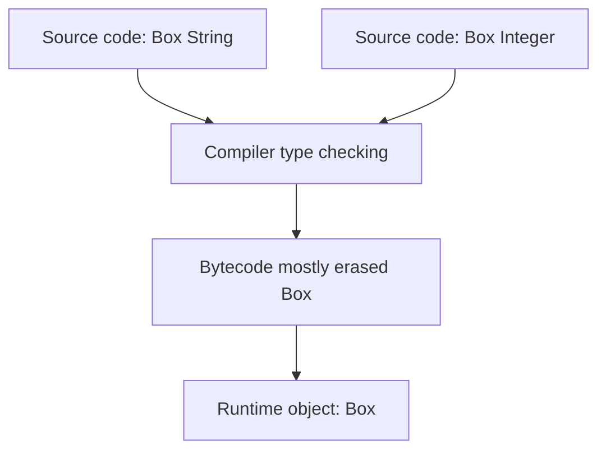
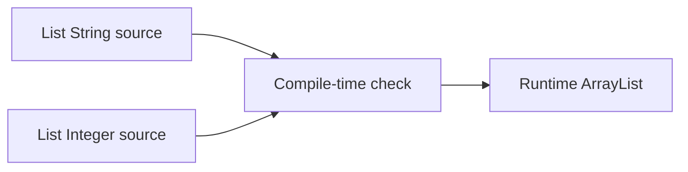
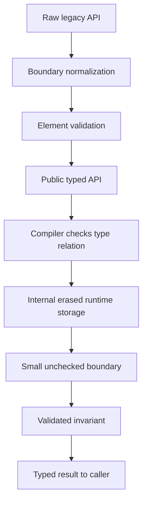

------
title: Learn Java Core Types, Data Model & Data APIs - Part 020
description: Deep engineering treatment of Java generics: type parameters, bounds, parameterized types, erasure, raw types, bridge methods, heap pollution, and production API design.
series: learn-java-core-types
seriesTitle: Learn Java Core Types, Data Model & Data APIs
order: 20
partTitle: Generics, Type Parameters, and Erasure
tags:
- java
- generics
- type-parameters
- erasure
- raw-types
- bridge-methods
- heap-pollution
- type-system
- advanced
date: 2026-06-27
---

# Part 020 — Generics, Type Parameters, and Erasure

> Target skill: mampu membaca, merancang, dan mendiagnosis generic Java API dengan memahami bahwa generics adalah compile-time type abstraction yang diimplementasikan terutama melalui erasure.

Generics adalah salah satu bagian Java yang tampak familiar tetapi sering disalahpahami.

Banyak engineer bisa menulis:

```java
List<String> names = new ArrayList<>();
```

Namun masih bingung ketika bertemu:

```java
<T extends Comparable<? super T>> T max(Collection<? extends T> values)
```

Atau ketika compiler memberi warning:

```text
unchecked conversion
heap pollution
raw use of parameterized class
```

Part ini membangun fondasi generics sebelum kita masuk lebih dalam ke wildcard/variance di Part 021 dan arrays/reifiability di Part 022.

---

## 1. Kaufman Deconstruction

Skill “menguasai generics” kita pecah menjadi:

| Sub-skill | Yang harus dikuasai |
|---|---|
| Generic mental model | Type parameter sebagai constraint compile-time, bukan runtime template |
| Parameterized type | `List<String>` sebagai type berbeda secara compile-time dari `List<Integer>` |
| Generic class/interface | Mendesain container, repository, result, command bus, mapper |
| Generic method | Membuat method reusable tanpa membuat class generic |
| Bounds | `T extends X`, multiple bounds, recursive bounds |
| Erasure | Apa yang hilang di runtime dan apa yang disisipkan compiler |
| Raw types | Legacy escape hatch dan sumber warning |
| Bridge methods | Kenapa compiler membuat synthetic method untuk polymorphism |
| Heap pollution | Saat variable generic menunjuk object dengan type argument tidak sesuai |
| Reifiability boundary | Kenapa tidak semua generic type tersedia penuh di runtime |
| API design | Kapan type parameter membantu, kapan justru menambah noise |

Pertanyaan utama:

> “Informasi type apa yang ingin saya jamin di compile time, dan informasi type apa yang masih tersedia di runtime?”

---

## 2. Mental Model: Generics adalah Compile-Time Contract

Generic type parameter bukan macro.

Generic type parameter bukan C++ template.

Generic type parameter bukan runtime specialization per type.

Generic type parameter adalah cara memberi compiler informasi bahwa beberapa nilai harus konsisten secara type.

Contoh:

```java
public final class Box<T> {
    private final T value;

    public Box(T value) {
        this.value = value;
    }

    public T value() {
        return value;
    }
}
```

Pemakaian:

```java
Box<String> name = new Box<>("Alice");
String value = name.value();
```

Compiler tahu bahwa `name.value()` menghasilkan `String`.

Namun di runtime, object `Box<String>` bukan class khusus yang berbeda dari `Box<Integer>`.

Diagram:



Generics memberi keamanan compile-time, bukan runtime specialization.

---

## 3. Mengapa Generics Ada

Sebelum generics, collection harus memakai `Object`.

```java
List names = new ArrayList();
names.add("Alice");
names.add("Bob");

String first = (String) names.get(0);
```

Masalah:

```java
names.add(42);
String second = (String) names.get(2); // runtime ClassCastException
```

Dengan generics:

```java
List<String> names = new ArrayList<>();
names.add("Alice");
names.add("Bob");
// names.add(42); // compile-time error

String first = names.get(0);
```

Perpindahan penting:

| Sebelum generics | Dengan generics |
|---|---|
| Error sering muncul runtime | Error dipindahkan ke compile time |
| Cast manual banyak | Cast disisipkan compiler |
| Collection tidak self-documenting | Type argument mendokumentasikan isi |
| API mudah salah pakai | API bisa encode constraint |

---

## 4. Type Parameter vs Type Argument

Deklarasi:

```java
public final class Repository<T> {
}
```

`T` adalah **type parameter**.

Pemakaian:

```java
Repository<CaseRecord> cases = new Repository<>();
```

`CaseRecord` adalah **type argument**.

Analogi:

```java
void greet(String name) { }

greet("Alice");
```

`name` adalah parameter. `"Alice"` adalah argument.

Pada generics:

```java
class Box<T> { }
Box<String> box;
```

`T` adalah type parameter. `String` adalah type argument.

---

## 5. Generic Class

Generic class cocok ketika type parameter menjadi bagian dari state/identity operasi class.

Contoh repository:

```java
public final class InMemoryRepository<ID, E> {
    private final Map<ID, E> entries = new HashMap<>();

    public void save(ID id, E entity) {
        entries.put(id, entity);
    }

    public Optional<E> findById(ID id) {
        return Optional.ofNullable(entries.get(id));
    }
}
```

Pemakaian:

```java
InMemoryRepository<CaseId, CaseFile> repository = new InMemoryRepository<>();

repository.save(new CaseId("CASE-001"), caseFile);
Optional<CaseFile> found = repository.findById(new CaseId("CASE-001"));
```

Compiler mencegah ID/entity tertukar:

```java
InMemoryRepository<UserId, User> users = new InMemoryRepository<>();
// users.save(new CaseId("CASE-001"), user); // compile-time error
```

Generic class berguna jika:

- class menyimpan value dengan type tertentu;
- beberapa method harus konsisten terhadap type yang sama;
- type parameter bagian dari abstraction class;
- caller memilih type sekali saat membuat object.

---

## 6. Generic Interface

Interface juga bisa generic.

```java
public interface Parser<T> {
    T parse(String input);
}
```

Implementasi:

```java
public final class CaseIdParser implements Parser<CaseId> {
    @Override
    public CaseId parse(String input) {
        return new CaseId(input);
    }
}
```

Pemakai:

```java
Parser<CaseId> parser = new CaseIdParser();
CaseId caseId = parser.parse("CASE-001");
```

Generic interface cocok untuk:

- parser;
- mapper;
- serializer;
- validator;
- handler;
- repository;
- policy;
- converter.

Contoh handler:

```java
public interface CommandHandler<C, R> {
    R handle(C command);
}
```

Implementasi:

```java
public final class EscalateCaseHandler
        implements CommandHandler<EscalateCase, CaseResult> {

    @Override
    public CaseResult handle(EscalateCase command) {
        return CaseResult.escalated(command.caseId());
    }
}
```

Ini jauh lebih aman daripada:

```java
public interface CommandHandler {
    Object handle(Object command);
}
```

---

## 7. Generic Method

Tidak semua generic butuh generic class.

Jika type parameter hanya relevan pada satu method, gunakan generic method.

```java
public static <T> T requirePresent(Optional<T> optional, String message) {
    return optional.orElseThrow(() -> new IllegalArgumentException(message));
}
```

Pemakaian:

```java
CaseFile caseFile = requirePresent(repository.findById(caseId), "case not found");
```

`T` diinfer dari `Optional<T>`.

Contoh lain:

```java
public static <T> List<T> copyToList(Iterable<T> source) {
    List<T> result = new ArrayList<>();
    for (T item : source) {
        result.add(item);
    }
    return result;
}
```

Generic method cocok jika:

- method reusable untuk banyak type;
- type tidak perlu disimpan sebagai state class;
- hubungan type hanya muncul dalam parameter/return method;
- caller tidak perlu membuat object generic.

Buruk:

```java
public final class StringUtils<T> {
    public String join(List<String> values) { ... }
}
```

`T` tidak dipakai. Ini noise.

---

## 8. Diamond Operator dan Type Inference

Java bisa menginfer type argument pada constructor.

```java
Map<CaseId, CaseFile> cases = new HashMap<>();
```

`<>` disebut diamond operator.

Compiler melihat target type di kiri:

```java
Map<CaseId, CaseFile> cases
```

lalu menginfer:

```java
new HashMap<CaseId, CaseFile>()
```

Type inference juga bekerja pada method:

```java
List<String> names = List.of("Alice", "Bob");
```

Namun jangan memaksa inference menjadi terlalu pintar.

Buruk:

```java
var result = complexGenericFactory().create().resolve().orElseThrow();
```

Jika type tidak jelas bagi manusia, tulis target type eksplisit:

```java
CaseDecision decision = complexGenericFactory().create().resolve().orElseThrow();
```

`var` dan generics bisa bekerja baik, tetapi jangan mengorbankan readability pada API kompleks.

---

## 9. Bounds: Membatasi Type Parameter

Unbounded type parameter:

```java
class Box<T> {
    T value;
}
```

`T` bisa apa pun.

Bounded type parameter:

```java
public static <T extends Comparable<T>> T max(T left, T right) {
    return left.compareTo(right) >= 0 ? left : right;
}
```

`T extends Comparable<T>` berarti `T` harus subtype dari `Comparable<T>`.

Catatan: keyword-nya tetap `extends`, bahkan jika bound adalah interface.

```java
<T extends Runnable>
```

bukan:

```java
<T implements Runnable> // invalid
```

Bound memberi compiler izin memanggil method bound:

```java
left.compareTo(right)
```

Tanpa bound, compiler hanya tahu `T` minimal seperti `Object`.

---

## 10. Multiple Bounds

Type parameter bisa punya beberapa bounds.

```java
public static <T extends CaseEntity & Auditable & Versioned> void persist(T entity) {
    entity.validateForPersistence();
    entity.auditTrail();
    entity.version();
}
```

Aturan penting:

- jika ada class bound, class bound harus pertama;
- setelah itu interface bounds;
- hanya boleh satu class bound.

Valid:

```java
<T extends BaseEntity & Auditable & Versioned>
```

Invalid:

```java
<T extends Auditable & BaseEntity>
```

Jika semua bounds interface:

```java
<T extends Auditable & Versioned>
```

boleh.

Gunakan multiple bounds hanya jika method benar-benar butuh semua kemampuan tersebut. Kalau tidak, API menjadi terlalu ketat.

---

## 11. Recursive Bounds dan Self Types

Kadang type parameter merujuk ke dirinya sendiri.

Contoh umum:

```java
public interface Comparable<T> {
    int compareTo(T other);
}
```

Contoh domain:

```java
public interface DomainId<T extends DomainId<T>>
        extends Comparable<T> {
    String value();
}
```

Implementasi:

```java
public record CaseId(String value) implements DomainId<CaseId> {
    @Override
    public int compareTo(CaseId other) {
        return value.compareTo(other.value);
    }
}
```

Ini disebut recursive bound atau F-bounded polymorphism.

Manfaat:

- method di base type bisa tetap preserve concrete subtype;
- comparison tidak tercampur antar ID type;
- fluent API bisa mengembalikan subtype yang tepat.

Namun jangan overuse. Recursive bounds bisa membuat API sulit dibaca.

Jika manfaatnya hanya “terlihat advanced”, jangan gunakan.

---

## 12. Parameterized Type Bukan Runtime Class Baru

Ini sangat penting.

```java
List<String> names = new ArrayList<>();
List<Integer> numbers = new ArrayList<>();
```

Secara compile-time:

- `List<String>` hanya boleh menerima `String`;
- `List<Integer>` hanya boleh menerima `Integer`.

Secara runtime:

- keduanya adalah object `ArrayList`;
- type argument tidak menjadi class runtime terpisah;
- `ArrayList<String>.class` tidak ada;
- `names instanceof List<String>` tidak valid.

Yang valid:

```java
if (names instanceof List<?>) {
    // only know it is some List at runtime
}
```

Mental model:



Generics Java menjaga backward compatibility dengan cara erasure.

---

## 13. Erasure: Apa yang Dilakukan Compiler

Erasure secara sederhana melakukan beberapa hal:

1. mengganti type parameter dengan bound-nya, atau `Object` jika tidak ada bound;
2. menyisipkan cast yang diperlukan;
3. membuat bridge method jika dibutuhkan untuk menjaga polymorphism;
4. mempertahankan compatibility dengan bytecode non-generic lama.

Contoh source:

```java
public final class Box<T> {
    private T value;

    public T get() {
        return value;
    }

    public void set(T value) {
        this.value = value;
    }
}
```

Kira-kira setelah erasure:

```java
public final class Box {
    private Object value;

    public Object get() {
        return value;
    }

    public void set(Object value) {
        this.value = value;
    }
}
```

Pemakaian source:

```java
Box<String> box = new Box<>();
box.set("hello");
String value = box.get();
```

Kira-kira runtime-level:

```java
Box box = new Box();
box.set("hello");
String value = (String) box.get();
```

Cast itu biasanya disisipkan compiler, bukan ditulis manual.

---

## 14. Erasure dengan Bounds

Jika type parameter punya bound, erasure memakai bound.

Source:

```java
public final class SortedBox<T extends Comparable<T>> {
    private T value;

    public int compareTo(T other) {
        return value.compareTo(other);
    }
}
```

Kira-kira setelah erasure:

```java
public final class SortedBox {
    private Comparable value;

    public int compareTo(Comparable other) {
        return value.compareTo(other);
    }
}
```

Jika multiple bounds:

```java
<T extends BaseEntity & Auditable>
```

Erasure memakai leftmost bound, yaitu `BaseEntity`.

Karena itu urutan bound bukan hanya estetika. Ia berpengaruh pada erasure.

---

## 15. Bridge Methods

Bridge method adalah method synthetic yang dibuat compiler agar polymorphism tetap bekerja setelah erasure.

Contoh:

```java
class Node<T> {
    private T data;

    void setData(T data) {
        this.data = data;
    }
}

class IntegerNode extends Node<Integer> {
    @Override
    void setData(Integer data) {
        System.out.println(data);
    }
}
```

Setelah erasure, `Node<T>.setData(T)` menjadi kira-kira:

```java
void setData(Object data)
```

Sedangkan `IntegerNode.setData(Integer)` tetap:

```java
void setData(Integer data)
```

Agar override tetap bekerja, compiler membuat bridge:

```java
void setData(Object data) {
    setData((Integer) data);
}
```

Implikasi production:

- stack trace kadang menunjukkan synthetic/bridge method;
- reflection bisa melihat method tambahan jika tidak difilter;
- bytecode-level tools harus memahami bridge methods;
- framework method scanning harus hati-hati.

Sebagai application engineer, Anda jarang menulis bridge method. Tetapi Anda perlu tahu bahwa compiler bisa membuatnya.

---

## 16. Raw Types

Raw type adalah penggunaan generic type tanpa type argument.

```java
List raw = new ArrayList();
```

Ini legal karena backward compatibility, tetapi berbahaya.

Contoh:

```java
List<String> names = new ArrayList<>();
List raw = names;
raw.add(42);

String first = names.get(0); // could fail later
```

Raw type melemahkan type safety.

Compiler biasanya memberi warning:

```text
unchecked call to add(E) as a member of the raw type List
```

Guideline:

- jangan gunakan raw type di code baru;
- treat unchecked warning sebagai design smell;
- jika harus interop dengan legacy API, isolasi raw type di boundary kecil;
- validate/copy data dari raw boundary ke typed collection.

Boundary pattern:

```java
@SuppressWarnings("unchecked")
static List<String> legacyNames(Object rawValue) {
    if (!(rawValue instanceof List<?> rawList)) {
        throw new IllegalArgumentException("expected list");
    }

    List<String> result = new ArrayList<>();
    for (Object item : rawList) {
        if (!(item instanceof String name)) {
            throw new IllegalArgumentException("expected string item: " + item);
        }
        result.add(name);
    }
    return List.copyOf(result);
}
```

Perhatikan: kita tidak cast langsung ke `List<String>`. Kita cek elemen satu per satu.

---

## 17. Unchecked Cast

Unchecked cast terjadi ketika compiler tidak bisa membuktikan cast generic aman.

```java
Object value = List.of("a", "b");
List<String> names = (List<String>) value; // unchecked cast
```

Mengapa unchecked?

Runtime hanya tahu value adalah `List`, bukan `List<String>`.

Cast ke raw list bisa dicek:

```java
if (value instanceof List<?>) {
    // runtime can check List-ness
}
```

Tetapi isi elemen tidak otomatis dicek sebagai `String`.

Lebih aman:

```java
static List<String> asStringList(Object value) {
    if (!(value instanceof List<?> list)) {
        throw new IllegalArgumentException("expected list");
    }

    List<String> result = new ArrayList<>();
    for (Object item : list) {
        if (!(item instanceof String string)) {
            throw new IllegalArgumentException("expected string item");
        }
        result.add(string);
    }
    return List.copyOf(result);
}
```

Guideline:

- unchecked cast boleh hanya di boundary yang kecil;
- selalu jelaskan invariant di komentar;
- gunakan `@SuppressWarnings("unchecked")` pada scope sekecil mungkin;
- jangan suppress warning di class penuh jika hanya satu statement bermasalah.

Buruk:

```java
@SuppressWarnings("unchecked")
public class BigService {
    // hundreds of lines
}
```

Lebih baik:

```java
@SuppressWarnings("unchecked")
private static <T> T trustedCast(Object value) {
    return (T) value;
}
```

Tetapi hanya jika benar-benar ada invariant eksternal yang menjamin type.

---

## 18. Heap Pollution

Heap pollution terjadi ketika variable dengan parameterized type menunjuk object yang bukan type parameterized itu secara benar.

Contoh:

```java
List<String> strings = new ArrayList<>();
List raw = strings;
raw.add(123);

String value = strings.get(0); // ClassCastException
```

`strings` bertipe `List<String>`, tetapi heap object berisi `Integer`.

Masalahnya sering muncul terlambat. Error tidak terjadi saat `raw.add(123)`, tetapi saat mengambil dan meng-cast ke `String`.

Heap pollution juga bisa muncul pada generic varargs, reflection, unsafe cast, dan legacy API.

Prinsip:

> Jika Anda melihat unchecked warning, bayangkan ada potensi heap pollution yang mungkin meledak jauh dari sumber masalah.

---

## 19. Reifiable vs Non-Reifiable Types

Type reifiable adalah type yang informasi runtime-nya tersedia penuh.

Contoh reifiable:

```java
String.class
int.class
String[].class
List.class
List<?>.class // not actual syntax for class literal, but unbounded wildcard is reifiable conceptually
```

Contoh non-reifiable:

```java
List<String>
Map<String, Integer>
T
List<T>
```

Karena `List<String>` non-reifiable:

```java
if (value instanceof List<String>) { // invalid
}
```

Yang bisa:

```java
if (value instanceof List<?>) {
    List<?> list = (List<?>) value;
}
```

Part 022 akan membahas reifiability lebih dalam bersama arrays.

Untuk sekarang, ingat:

> Runtime bisa mengecek “ini List”, tetapi biasanya tidak bisa mengecek “ini List of String”.

---

## 20. Why `new T()` Tidak Bisa

Dalam generic class:

```java
public final class Factory<T> {
    public T create() {
        return new T(); // invalid
    }
}
```

Mengapa invalid?

Karena setelah erasure, `T` tidak tersedia sebagai concrete runtime class.

Solusi tergantung kebutuhan.

Gunakan `Supplier<T>`:

```java
public final class Factory<T> {
    private final Supplier<T> supplier;

    public Factory(Supplier<T> supplier) {
        this.supplier = supplier;
    }

    public T create() {
        return supplier.get();
    }
}
```

Pemakaian:

```java
Factory<ArrayList<String>> factory = new Factory<>(ArrayList::new);
ArrayList<String> list = factory.create();
```

Atau gunakan `Class<T>` jika butuh reflection:

```java
public final class ReflectiveFactory<T> {
    private final Class<T> type;

    public ReflectiveFactory(Class<T> type) {
        this.type = type;
    }

    public T create() {
        try {
            return type.getDeclaredConstructor().newInstance();
        } catch (ReflectiveOperationException e) {
            throw new IllegalStateException("cannot instantiate " + type.getName(), e);
        }
    }
}
```

Namun `Supplier<T>` biasanya lebih sederhana dan testable.

---

## 21. Generic Type Information dan Reflection

`Class<T>` bisa membawa raw runtime class.

```java
Class<String> stringClass = String.class;
```

Namun `Class<List<String>>` tidak tersedia langsung sebagai `List<String>.class`.

Untuk generic type lengkap, reflection memakai `Type`, `ParameterizedType`, dan sejenisnya.

Contoh field:

```java
class Example {
    List<String> names;
}
```

Reflection bisa membaca generic signature field:

```java
Field field = Example.class.getDeclaredField("names");
Type type = field.getGenericType();
```

Namun ini metadata signature, bukan berarti object runtime membawa semua type argument secara langsung.

Untuk JSON libraries, dependency injection frameworks, atau serialization, sering ada pola type token:

```java
TypeReference<List<String>> ref = new TypeReference<>() {};
```

Konsepnya: generic info ditangkap melalui anonymous subclass signature.

Prinsip:

- `Class<T>` cukup untuk non-parameterized type;
- `Type`/type token dibutuhkan untuk `List<String>`, `Map<String, CaseDto>`, dsb.;
- runtime object collection tetap tidak menjamin elemennya benar tanpa validasi.

---

## 22. Generic API Design: Class Type Parameter atau Method Type Parameter?

Gunakan class type parameter jika seluruh object bekerja untuk satu type.

```java
public final class JsonCodec<T> {
    private final Class<T> type;

    public JsonCodec(Class<T> type) {
        this.type = type;
    }

    public T decode(String json) { ... }

    public String encode(T value) { ... }
}
```

Gunakan method type parameter jika setiap call bisa berbeda type.

```java
public final class JsonMapper {
    public <T> T decode(String json, Class<T> type) { ... }

    public <T> String encode(T value) { ... }
}
```

Pertanyaan desain:

| Pertanyaan | Jika ya |
|---|---|
| Object instance diikat ke satu type? | class type parameter |
| Setiap method call bisa memakai type berbeda? | method type parameter |
| Type parameter muncul di banyak method dan state? | class type parameter |
| Type parameter hanya menghubungkan input-output satu method? | method type parameter |

Buruk:

```java
public final class Utils<T> {
    public <U> U convert(Object value, Class<U> type) { ... }
}
```

Jika `T` tidak dipakai, class generic tidak perlu.

---

## 23. Generic Return Type dan Type Inference Pitfall

Generic method bisa terlihat aman tetapi sebenarnya terlalu bebas.

Buruk:

```java
public static <T> T parse(String value) {
    return (T) value;
}
```

Pemakaian:

```java
Integer number = parse("123"); // compiles, fails at runtime
```

Ini disebut “liar generic return”. Type parameter tidak terikat ke input yang cukup.

Lebih baik:

```java
public static <T> T parse(String value, Class<T> type) {
    if (type == Integer.class) {
        return type.cast(Integer.valueOf(value));
    }
    if (type == String.class) {
        return type.cast(value);
    }
    throw new IllegalArgumentException("unsupported type: " + type.getName());
}
```

Atau lebih explicit:

```java
public static int parseInt(String value) {
    return Integer.parseInt(value);
}
```

Generic return type harus punya sumber kebenaran:

- parameter `Class<T>`;
- parameter `TypeRef<T>`;
- input collection `Collection<T>`;
- receiver generic type;
- mapper/parser typed;
- supplier/factory typed.

Jika `T` hanya muncul di return type, curiga.

---

## 24. Type Parameter Naming

Konvensi umum:

| Nama | Arti umum |
|---|---|
| `T` | Type |
| `E` | Element |
| `K` | Key |
| `V` | Value |
| `R` | Result/Return |
| `ID` | Identifier domain-specific |
| `C` | Command/Context/Comparable, tergantung konteks |
| `S` | Source/State |

Contoh:

```java
public interface Repository<ID, E> {
    Optional<E> findById(ID id);
    void save(ID id, E entity);
}
```

Untuk API domain, nama deskriptif kadang lebih baik daripada satu huruf:

```java
public interface Transition<State, Event> {
    State apply(State current, Event event);
}
```

Namun jangan terlalu panjang:

```java
public interface Mapper<SourceDomainTransferObjectType, TargetDomainEntityType> {
}
```

Nama type parameter harus membantu membaca hubungan antar type.

---

## 25. Generic Type dan Primitive Types

Generic type argument harus reference type.

Tidak bisa:

```java
List<int> numbers = new ArrayList<>(); // invalid
```

Harus:

```java
List<Integer> numbers = new ArrayList<>();
```

Ini menyebabkan boxing/unboxing.

Untuk stream numerik, Java menyediakan specialization:

```java
IntStream.range(0, 10).sum();
LongStream.of(1L, 2L, 3L).sum();
DoubleStream.of(1.0, 2.0).average();
```

Untuk collection primitive besar, standard Java collections tetap memakai wrapper. Jika performance/memory kritis, pertimbangkan struktur khusus, tetapi ukur dulu.

Kaitan dengan Part 024:

- generics memaksa primitive menjadi wrapper;
- wrapper bisa menyebabkan allocation/autoboxing cost;
- null unboxing bisa menyebabkan NPE;
- equality wrapper punya jebakan `==`.

---

## 26. Generic Collections dan Invariance Preview

Java generics invariant.

Artinya:

```java
List<Integer> integers = List.of(1, 2, 3);
// List<Number> numbers = integers; // invalid
```

Walaupun `Integer extends Number`, `List<Integer>` bukan subtype dari `List<Number>`.

Mengapa?

Jika diizinkan:

```java
List<Integer> integers = new ArrayList<>();
List<Number> numbers = integers; // hypothetical
numbers.add(3.14);               // Double masuk ke List<Integer>
Integer value = integers.get(0); // type safety rusak
```

Solusinya adalah wildcard:

```java
List<? extends Number> numbers = integers;
```

Namun wildcard punya aturan producer/consumer yang akan kita bahas penuh di Part 021.

Untuk sekarang, ingat:

> `List<Child>` bukan `List<Parent>`. Variance harus dinyatakan eksplisit dengan wildcard.

---

## 27. Generic Arrays Preview

Anda tidak bisa membuat array generic langsung:

```java
List<String>[] lists = new List<String>[10]; // invalid
```

Penyebabnya gabungan:

- arrays reified dan covariant;
- generics erased dan invariant;
- `List<String>` tidak tersedia penuh di runtime.

Part 022 akan membahas detailnya.

Untuk sekarang:

- prefer `List<List<String>>` daripada `List<String>[]`;
- hindari generic arrays kecuali benar-benar perlu;
- hati-hati dengan varargs generic.

---

## 28. Bounded Generic Domain Example: Typed ID

Masalah umum di sistem besar: ID tertukar.

Buruk:

```java
void assignCase(String caseId, String officerId) {
}

assignCase("OFFICER-9", "CASE-1"); // compiles
```

Lebih baik:

```java
public interface Identifier<T> {
    String value();
}

public record CaseId(String value) implements Identifier<CaseId> {
    public CaseId {
        requireNonBlank(value, "value");
    }
}

public record OfficerId(String value) implements Identifier<OfficerId> {
    public OfficerId {
        requireNonBlank(value, "value");
    }
}
```

Repository generic:

```java
public interface Repository<ID extends Identifier<ID>, E> {
    Optional<E> findById(ID id);
    void save(ID id, E entity);
}
```

Pemakaian:

```java
Repository<CaseId, CaseFile> cases = ...;
Repository<OfficerId, Officer> officers = ...;

cases.findById(new CaseId("CASE-1"));
// cases.findById(new OfficerId("OFFICER-9")); // compile-time error
```

Ini contoh generics sebagai **domain safety**, bukan sekadar collection syntax.

---

## 29. Generic Result Type

Generic result sering berguna untuk operasi yang bisa sukses/gagal.

```java
public sealed interface Result<T, E>
        permits Success, Failure {
}

public record Success<T, E>(T value) implements Result<T, E> {
    public Success {
        Objects.requireNonNull(value, "value");
    }
}

public record Failure<T, E>(E error) implements Result<T, E> {
    public Failure {
        Objects.requireNonNull(error, "error");
    }
}
```

Pemakaian:

```java
Result<CaseFile, ValidationError> result = validate(input);
```

Consumer:

```java
String message = switch (result) {
    case Success<CaseFile, ValidationError> success ->
            "valid case " + success.value().id();
    case Failure<CaseFile, ValidationError> failure ->
            "invalid: " + failure.error().message();
};
```

Catatan: pattern matching terhadap parameterized type punya batas karena erasure. Jangan mendesain API yang bergantung pada runtime differentiation antara `Result<A, B>` dan `Result<C, D>`.

Generic result berguna karena compile-time relation:

- success value type jelas;
- error type jelas;
- handler tahu kombinasi operasi.

---

## 30. Type Erasure dan Overloading

Erasure mempengaruhi method signature.

Tidak bisa:

```java
void process(List<String> names) { }
void process(List<Integer> numbers) { }
```

Keduanya erase menjadi:

```java
void process(List values)
```

Compiler menolak karena name clash.

Solusi:

```java
void processNames(List<String> names) { }
void processNumbers(List<Integer> numbers) { }
```

Atau gunakan wrapper type:

```java
record Names(List<String> values) {}
record Scores(List<Integer> values) {}

void process(Names names) { }
void process(Scores scores) { }
```

Wrapper record sering lebih baik karena memberi semantic name.

---

## 31. Type Erasure dan Static Members

Type parameter class tidak tersedia untuk static context.

Invalid:

```java
public final class Box<T> {
    private static T defaultValue; // invalid
}
```

Mengapa?

Static member milik class, bukan instance `Box<String>` atau `Box<Integer>`.

Karena di runtime hanya ada satu `Box` class, `static T` tidak bermakna.

Valid:

```java
public final class Box<T> {
    private final T value;

    public Box(T value) {
        this.value = value;
    }

    public static <T> Box<T> of(T value) {
        return new Box<>(value);
    }
}
```

Static method boleh punya type parameter sendiri:

```java
public static <T> Box<T> of(T value)
```

`T` di static method bukan `T` milik class. Ia parameter method.

---

## 32. Generic Exceptions Tidak Bisa

Java tidak mengizinkan generic class menjadi subtype `Throwable`.

Invalid:

```java
class Problem<T> extends Exception { }
```

Alasannya berkaitan dengan erasure dan exception handling runtime.

Jangan mencoba membuat exception generic. Gunakan field typed biasa, error code, sealed error result, atau subtype exception spesifik.

Contoh:

```java
public final class ValidationException extends RuntimeException {
    private final List<ValidationError> errors;

    public ValidationException(List<ValidationError> errors) {
        super("validation failed");
        this.errors = List.copyOf(errors);
    }

    public List<ValidationError> errors() {
        return errors;
    }
}
```

Atau gunakan sealed result:

```java
sealed interface ValidationResult permits Valid, Invalid {}
record Valid() implements ValidationResult {}
record Invalid(List<ValidationError> errors) implements ValidationResult {}
```

---

## 33. Generic API Smells

### Smell 1 — Type parameter hanya muncul sekali

```java
public static <T> void log(String message) {
    System.out.println(message);
}
```

`T` tidak berguna.

### Smell 2 — Generic return liar

```java
public static <T> T get(String key) {
    return (T) map.get(key);
}
```

Caller bisa meminta type apa pun. Runtime bisa gagal.

Lebih baik:

```java
public static <T> Optional<T> get(String key, Class<T> type) {
    Object value = map.get(key);
    return type.isInstance(value) ? Optional.of(type.cast(value)) : Optional.empty();
}
```

### Smell 3 — Raw type di tengah domain code

```java
List values = service.findAll();
```

Harusnya:

```java
List<CaseFile> values = service.findAll();
```

### Smell 4 — Type parameter berlebihan

```java
class Processor<A, B, C, D, E, F> {
}
```

Bisa jadi model terlalu generic dan kurang domain-specific.

### Smell 5 — Suppress warning luas

```java
@SuppressWarnings({"unchecked", "rawtypes"})
public class CaseService {
}
```

Ini menyembunyikan masalah.

---

## 34. Worked Example: Type-Safe Registry

Masalah:

Kita ingin registry handler per command type.

Versi raw dan rapuh:

```java
public final class HandlerRegistry {
    private final Map<Class<?>, CommandHandler> handlers = new HashMap<>();

    public void register(Class<?> commandType, CommandHandler handler) {
        handlers.put(commandType, handler);
    }

    public Object handle(Object command) {
        CommandHandler handler = handlers.get(command.getClass());
        return handler.handle(command);
    }
}
```

Masalah:

- handler bisa didaftarkan untuk command yang salah;
- return type `Object`;
- cast tersebar;
- error muncul runtime.

Versi lebih typed:

```java
public interface Command<R> {
}

public interface CommandHandler<C extends Command<R>, R> {
    R handle(C command);
}
```

Command:

```java
public record EscalateCase(String caseId, int level)
        implements Command<CaseResult> {
}
```

Handler:

```java
public final class EscalateCaseHandler
        implements CommandHandler<EscalateCase, CaseResult> {

    @Override
    public CaseResult handle(EscalateCase command) {
        return CaseResult.escalated(command.caseId(), command.level());
    }
}
```

Registry tetap butuh boundary unchecked karena runtime dispatch by `Class<?>`:

```java
public final class HandlerRegistry {
    private final Map<Class<?>, CommandHandler<?, ?>> handlers = new HashMap<>();

    public <C extends Command<R>, R> void register(
            Class<C> commandType,
            CommandHandler<C, R> handler
    ) {
        handlers.put(commandType, handler);
    }

    public <R> R handle(Command<R> command) {
        CommandHandler<Command<R>, R> handler = findHandler(command);
        return handler.handle(command);
    }

    @SuppressWarnings("unchecked")
    private <R> CommandHandler<Command<R>, R> findHandler(Command<R> command) {
        CommandHandler<?, ?> handler = handlers.get(command.getClass());
        if (handler == null) {
            throw new IllegalArgumentException("no handler for " + command.getClass().getName());
        }
        return (CommandHandler<Command<R>, R>) handler;
    }
}
```

Perhatikan boundary:

- unchecked cast diisolasi di satu method;
- public API tetap typed;
- registry invariant dijaga oleh `register`;
- caller mendapat return type sesuai command.

Pemakaian:

```java
HandlerRegistry registry = new HandlerRegistry();
registry.register(EscalateCase.class, new EscalateCaseHandler());

CaseResult result = registry.handle(new EscalateCase("CASE-1", 3));
```

Ini contoh realistis: kadang erasure membuat kita tidak bisa menghindari unchecked cast sepenuhnya. Yang penting adalah mengisolasi dan menjaga invariant.

---

## 35. Mermaid: Generic Safety Boundary



Pesan utama:

> Generic code production-grade tidak berarti tidak ada unchecked cast sama sekali. Ia berarti unchecked cast dilokalisasi, diberi invariant, dan tidak bocor ke caller.

---

## 36. Review Checklist

Saat membaca atau menulis generic API, tanyakan:

- Apakah type parameter punya tujuan jelas?
- Apakah type parameter muncul cukup untuk mengikat input dan output?
- Apakah generic class seharusnya generic method saja?
- Apakah bound terlalu ketat atau terlalu longgar?
- Apakah raw type muncul di domain code?
- Apakah unchecked warning diisolasi?
- Apakah `@SuppressWarnings` berada di scope sekecil mungkin?
- Apakah runtime membutuhkan `Class<T>` atau type token?
- Apakah API bergantung pada type argument yang hilang karena erasure?
- Apakah overloading rusak karena erasure?
- Apakah primitive boxing menjadi masalah?
- Apakah wildcard seharusnya digunakan agar API lebih fleksibel?

---

## 37. Practice Drill

Bangun mini API berikut:

```text
Typed query bus:
- Query<R> merepresentasikan query yang menghasilkan R
- QueryHandler<Q extends Query<R>, R> menangani query tertentu
- QueryBus bisa register handler dan execute query
```

Latihan:

1. Buat interface `Query<R>`.
2. Buat interface `QueryHandler<Q extends Query<R>, R>`.
3. Buat record `FindCaseById(CaseId id) implements Query<Optional<CaseFile>>`.
4. Buat handler `FindCaseByIdHandler`.
5. Buat `QueryBus` dengan registry internal `Map<Class<?>, QueryHandler<?, ?>>`.
6. Isolasi unchecked cast pada satu private method.
7. Pastikan public API `execute(Query<R> query)` mengembalikan `R`.
8. Jelaskan invariant yang membuat unchecked cast aman.

Target penguasaan:

> Anda bisa membedakan type safety yang dijamin compiler, type information yang hilang karena erasure, dan boundary kecil tempat runtime cast tetap diperlukan.

---

## 38. Key Takeaways

- Generics adalah compile-time type abstraction, bukan runtime template.
- `List<String>` dan `List<Integer>` berbeda secara compile-time, tetapi tidak menjadi class runtime berbeda.
- Erasure mengganti type parameter dengan bound atau `Object`, menyisipkan cast, dan bisa membuat bridge methods.
- Raw types ada untuk backward compatibility, tetapi sebaiknya dihindari di code baru.
- Unchecked warning adalah sinyal bahwa compiler tidak bisa membuktikan type safety.
- Heap pollution bisa membuat error muncul jauh dari sumber masalah.
- `new T()` tidak bisa karena `T` tidak tersedia sebagai concrete runtime type setelah erasure.
- `Class<T>` membantu untuk runtime class biasa, tetapi generic type lengkap butuh `Type`/type token pattern.
- Generic return type harus terikat ke input/receiver yang cukup; jika tidak, ia hanya cast tersembunyi.
- API generic yang baik mengisolasi unchecked boundary dan menjaga public API tetap typed.

---

## 39. Referensi Lanjutan

- Java Language Specification — Type variables, parameterized types, raw types
- Java Language Specification — Type erasure
- Java Language Specification — Reifiable types and heap pollution
- Java Tutorials — Generics and type erasure
- Java Tutorials — Effects of type erasure and bridge methods
- Java SE API — `Class<T>`, `Type`, `ParameterizedType`
