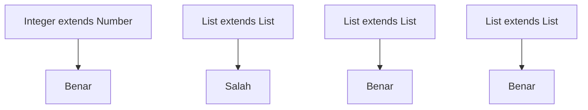
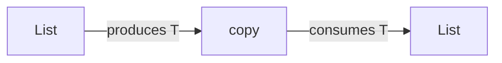
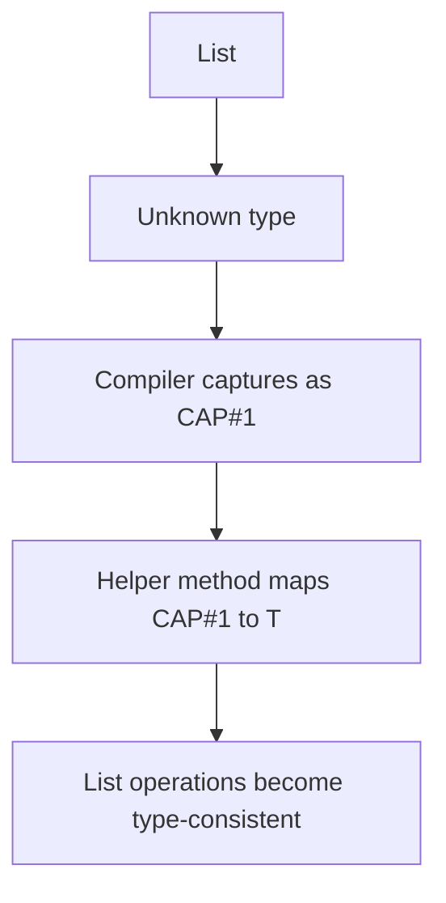
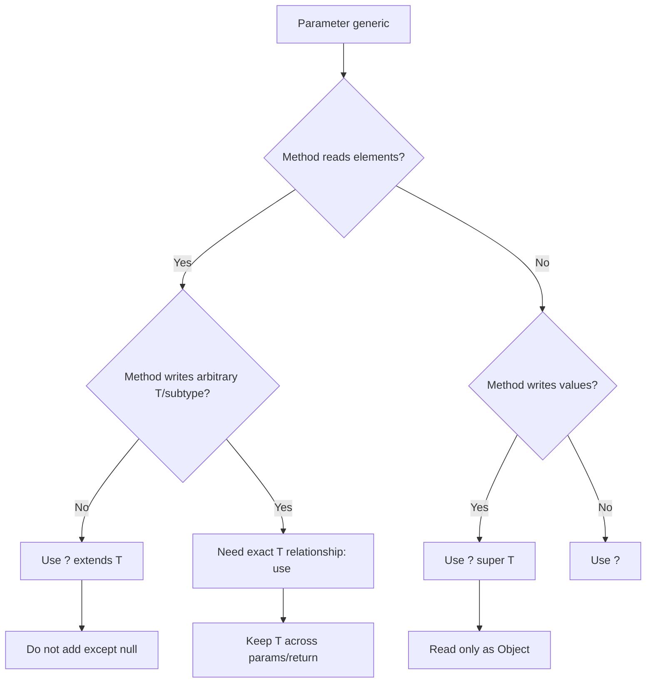

------
title: Learn Java Core Types, Data Model & Data APIs - Part 021
description: Wildcards, variance, PECS, capture conversion, and generic API design for production-grade Java APIs.
series: learn-java-core-types
seriesTitle: Learn Java Core Types, Data Model & Data APIs
order: 21
partTitle: Wildcards, Variance, and API Design
tags:
- java
- generics
- variance
- wildcards
- api-design
- type-system
date: 2026-06-27
---

# Part 021 — Wildcards, Variance, and API Design

> Goal: setelah bagian ini, kita tidak hanya hafal `? extends` dan `? super`, tetapi bisa mendesain method signature generic yang aman, fleksibel, mudah dipakai, dan tidak membocorkan kompleksitas type system ke caller.

Bagian sebelumnya membahas generics dan erasure. Sekarang kita masuk ke masalah yang biasanya membuat Java generics terasa tidak intuitif: **variance**.

Pertanyaan besarnya sederhana:

> Jika `Integer` adalah subtype dari `Number`, apakah `List<Integer>` adalah subtype dari `List<Number>`?

Jawaban Java: **tidak**.

Itu bukan kelemahan. Itu keputusan desain type-safety. Kalau `List<Integer>` boleh diperlakukan sebagai `List<Number>`, maka caller bisa memasukkan `Double` ke list yang runtime-nya sebenarnya list of integer. Generics Java mencegah itu di compile time.

```java
List<Integer> ints = new ArrayList<>();
// List<Number> numbers = ints; // compile-time error

// Jika ini diizinkan:
// numbers.add(3.14); // memasukkan Double ke List<Integer>
```

Mental model yang harus dipakai:

> Generic type biasa di Java bersifat **invariant**. Wildcard dipakai saat kita ingin menyatakan variance secara lokal pada API boundary.

---

## 1. Kaufman Skill Target

Kita ingin menguasai sub-skill berikut:

1. Membaca signature generic dengan cepat.
2. Menentukan apakah parameter generic adalah source, sink, atau keduanya.
3. Memilih `T`, `?`, `? extends T`, atau `? super T` secara tepat.
4. Menghindari wildcard pada return type kecuali ada alasan kuat.
5. Memahami kenapa compiler menolak operasi tertentu.
6. Menggunakan helper method untuk wildcard capture.
7. Mendesain API generic yang tidak menyiksa caller.

Ukuran keberhasilan:

- Bisa menjelaskan kenapa `List<Integer>` bukan `List<Number>`.
- Bisa mendesain method `copy`, `map`, `filter`, `merge`, `index`, dan `registerHandler` dengan type bounds yang tepat.
- Bisa membaca error `capture of ?` dan tahu apakah error itu bisa diselesaikan dengan helper method atau memang desain operasinya salah.

---

## 2. Core Vocabulary

| Istilah | Makna praktis |
|---|---|
| invariant | `Box<Integer>` bukan subtype dari `Box<Number>` walau `Integer extends Number` |
| covariant | subtype relation bergerak searah: `Producer<Integer>` dapat dipakai sebagai `Producer<? extends Number>` |
| contravariant | subtype relation bergerak berlawanan: `Consumer<Number>` dapat dipakai sebagai `Consumer<? super Integer>` |
| wildcard | unknown type argument: `?`, `? extends T`, `? super T` |
| upper bounded wildcard | unknown subtype dari batas atas: `? extends Number` |
| lower bounded wildcard | unknown supertype dari batas bawah: `? super Integer` |
| capture conversion | compiler membuat type variable internal untuk wildcard tertentu |
| PECS | Producer Extends, Consumer Super |

Jangan menghafal `extends` = read dan `super` = write secara dangkal. Lebih tepat:

- `? extends T` berarti kita tahu value yang keluar **minimal aman dibaca sebagai `T`**.
- `? super T` berarti kita tahu container itu **aman menerima `T`**.

---

## 3. Invariance: Kenapa `List<Integer>` Bukan `List<Number>`

Contoh domain:

```java
class Payment {}
class CardPayment extends Payment {}
class BankTransfer extends Payment {}
```

Kalau Java mengizinkan ini:

```java
List<CardPayment> cards = new ArrayList<>();
List<Payment> payments = cards; // tidak diizinkan oleh Java
payments.add(new BankTransfer());

CardPayment card = cards.get(0); // runtime-nya bisa BankTransfer
```

Masalahnya bukan pada read. Masalahnya pada **write**.

Kalau `List<CardPayment>` menjadi `List<Payment>`, maka semua operasi `add(Payment)` pada `List<Payment>` harus legal. Tetapi runtime storage sebenarnya hanya valid untuk `CardPayment`.

Karena `List` bisa read dan write, Java memilih invariant.



Rule:

> Subtyping pada element type tidak otomatis menjadi subtyping pada container type.

---

## 4. Upper Bounded Wildcard: `? extends T`

`? extends T` berarti:

> “Ada suatu type X yang tidak kita tahu persis, tetapi X adalah T atau subtype dari T.”

Contoh:

```java
static BigDecimal totalAmount(List<? extends Payment> payments) {
    BigDecimal total = BigDecimal.ZERO;
    for (Payment payment : payments) {
        total = total.add(payment.amount());
    }
    return total;
}
```

Method ini menerima:

```java
List<Payment> payments = List.of(...);
List<CardPayment> cards = List.of(...);
List<BankTransfer> transfers = List.of(...);

totalAmount(payments);
totalAmount(cards);
totalAmount(transfers);
```

Kenapa read aman?

Kalau list berisi unknown subtype dari `Payment`, maka setiap elemen pasti minimal bisa diperlakukan sebagai `Payment`.

```java
Payment p = payments.get(0); // aman
```

Kenapa write tidak aman?

```java
static void addDummy(List<? extends Payment> payments) {
    // payments.add(new CardPayment(...)); // compile-time error
}
```

Compiler tidak tahu apakah actual list adalah `List<CardPayment>`, `List<BankTransfer>`, `List<InternationalWirePayment>`, atau subtype lain. Menambahkan `CardPayment` hanya aman untuk sebagian kemungkinan, bukan semua.

Satu-satunya value yang aman ditambahkan adalah `null`, karena `null` assignable ke semua reference type. Tetapi secara design, itu biasanya buruk.

---

## 5. Lower Bounded Wildcard: `? super T`

`? super T` berarti:

> “Ada suatu type X yang tidak kita tahu persis, tetapi X adalah T atau supertype dari T.”

Contoh:

```java
static void addDefaultCards(List<? super CardPayment> target) {
    target.add(new CardPayment(...));
}
```

Method ini bisa menerima:

```java
List<CardPayment> cards = new ArrayList<>();
List<Payment> payments = new ArrayList<>();
List<Object> objects = new ArrayList<>();

addDefaultCards(cards);
addDefaultCards(payments);
addDefaultCards(objects);
```

Kenapa write aman?

Kalau target adalah `List<CardPayment>`, `CardPayment` bisa masuk. Kalau target adalah `List<Payment>`, `CardPayment` juga bisa masuk karena `CardPayment extends Payment`. Kalau target adalah `List<Object>`, semua object bisa masuk.

Kenapa read menjadi terbatas?

```java
static void inspect(List<? super CardPayment> target) {
    Object value = target.get(0); // satu-satunya guarantee universal
    // CardPayment card = target.get(0); // compile-time error
}
```

Karena actual container bisa `List<Object>`. Kalau `get(0)` dari `List<Object>`, isinya belum tentu `CardPayment`.

---

## 6. PECS: Producer Extends, Consumer Super

PECS bukan hukum mutlak, tetapi heuristic yang sangat berguna.

- Kalau parameter **menghasilkan** value untuk method kita, gunakan `? extends T`.
- Kalau parameter **menerima** value dari method kita, gunakan `? super T`.
- Kalau parameter perlu read dan write sebagai exact same type, gunakan type parameter biasa `<T>` tanpa wildcard.

Contoh canonical:

```java
static <T> void copy(List<? extends T> source, List<? super T> target) {
    for (T item : source) {
        target.add(item);
    }
}
```

Artinya:

- `source` memproduksi `T`, jadi `extends`.
- `target` mengonsumsi `T`, jadi `super`.

Pemakaian:

```java
List<Integer> ints = List.of(1, 2, 3);
List<Number> numbers = new ArrayList<>();
List<Object> objects = new ArrayList<>();

copy(ints, numbers);
copy(ints, objects);
```

Compiler mencari `T` yang membuat dua sisi konsisten.



---

## 7. Exact Type Parameter vs Wildcard

Ada dua style yang sering tampak mirip:

```java
static <T> T first(List<T> items) {
    return items.get(0);
}

static Number firstNumber(List<? extends Number> items) {
    return items.get(0);
}
```

Perbedaannya:

- `<T> T first(List<T>)` mempertahankan exact type relation antara input dan output.
- `Number firstNumber(List<? extends Number>)` melebur semua subtype menjadi `Number`.

Contoh:

```java
List<Integer> ints = List.of(1, 2, 3);

Integer a = first(ints);       // exact T = Integer
Number b = firstNumber(ints);  // output hanya Number
```

Gunakan type parameter bila API perlu mempertahankan hubungan antar posisi type.

Contoh lain:

```java
static <T> T choose(T left, T right) {
    return Math.random() < 0.5 ? left : right;
}
```

Wildcard tidak cocok karena tidak ada satu container boundary. Kita butuh satu type variable yang mengikat beberapa parameter dan return.

---

## 8. Wildcard pada Return Type: Biasanya Jangan

Ini buruk untuk API publik:

```java
interface PaymentRepository {
    List<? extends Payment> findRecentPayments();
}
```

Caller akan kesulitan:

```java
List<? extends Payment> payments = repo.findRecentPayments();
Payment p = payments.get(0);
// payments.add(new CardPayment(...)); // tidak bisa
```

Return wildcard memaksa caller membawa ketidakpastian type yang seharusnya diselesaikan oleh API provider.

Lebih baik:

```java
interface PaymentRepository {
    List<Payment> findRecentPayments();
}
```

Atau kalau exact subtype memang bagian dari kontrak:

```java
interface PaymentRepository<P extends Payment> {
    List<P> findRecentPayments();
}
```

Rule:

> Wildcard bagus di parameter input API. Wildcard pada return type sering berarti desain belum matang.

Ada pengecualian, misalnya low-level framework API yang memang merepresentasikan type unknown, tetapi untuk service/domain API production, hindari kecuali sangat sengaja.

---

## 9. Unbounded Wildcard: `?`

`List<?>` berarti list of unknown type.

Gunakan saat operasi tidak peduli element type.

```java
static int sizeOf(List<?> items) {
    return items.size();
}

static void printAll(List<?> items) {
    for (Object item : items) {
        System.out.println(item);
    }
}
```

Kenapa bukan `List<Object>`?

```java
static void printObjects(List<Object> items) { }

List<String> names = List.of("A", "B");
// printObjects(names); // error
printAll(names);        // ok
```

`List<Object>` berarti list yang memang bisa menyimpan object apa pun. `List<?>` berarti list dengan element type tertentu tetapi unknown.

Mental model:

| Signature | Bisa menerima `List<String>`? | Bisa add `Integer`? | Bisa read sebagai |
|---|---:|---:|---|
| `List<Object>` | tidak | ya | `Object` |
| `List<?>` | ya | tidak, kecuali `null` | `Object` |

---

## 10. Capture Conversion

Wildcard capture adalah saat compiler memberi nama internal pada unknown wildcard.

Contoh yang terlihat aneh:

```java
static void rotateFirstToSamePosition(List<?> items) {
    // items.set(0, items.get(0)); // bisa error pada beberapa bentuk operasi
}
```

Secara manusia, operasi “ambil elemen dari list yang sama, taruh kembali ke list yang sama” tampak aman. Tetapi type expression `items.get(0)` terlihat sebagai `Object`, sedangkan `set` membutuhkan captured unknown type.

Solusi: helper method dengan type parameter.

```java
static void normalize(List<?> items) {
    normalizeCaptured(items);
}

private static <T> void normalizeCaptured(List<T> items) {
    items.set(0, items.get(0));
}
```

Di helper method, unknown type sudah ditangkap sebagai `T`.

Pola ini penting saat membuat utility generic.



Tetapi tidak semua capture error bisa diperbaiki.

```java
static void unsafeSwap(List<? extends Number> a, List<? extends Number> b) {
    Number temp = a.get(0);
    // a.set(0, b.get(0)); // wrong
    // b.set(0, temp);     // wrong
}
```

`a` bisa `List<Integer>`, `b` bisa `List<Double>`. Bound-nya sama-sama `Number`, tetapi captured type-nya berbeda. Memindahkan value antar keduanya tidak aman.

---

## 11. Designing with Producer/Consumer Interfaces

Kadang wildcard di collection tidak cukup. Desain yang lebih bersih adalah memisahkan producer dan consumer interface.

```java
interface Source<T> {
    T next();
}

interface Sink<T> {
    void accept(T value);
}
```

Lalu method:

```java
static <T> void drain(Source<? extends T> source, Sink<? super T> sink, int limit) {
    for (int i = 0; i < limit; i++) {
        sink.accept(source.next());
    }
}
```

Ini pattern umum pada Java functional API:

- `Supplier<? extends T>` menghasilkan `T`.
- `Consumer<? super T>` menerima `T`.
- `Function<? super T, ? extends R>` menerima `T` atau supertype-nya, menghasilkan `R` atau subtype-nya.

Contoh API map:

```java
static <T, R> List<R> map(
        List<? extends T> source,
        Function<? super T, ? extends R> mapper
) {
    List<R> result = new ArrayList<>(source.size());
    for (T item : source) {
        result.add(mapper.apply(item));
    }
    return result;
}
```

Kenapa mapper `? super T` untuk input?

Jika source berisi `CardPayment`, mapper yang menerima `Payment` tetap valid.

Kenapa output `? extends R`?

Jika kita ingin result `List<PaymentView>`, mapper boleh mengembalikan subtype seperti `DetailedPaymentView`.

---

## 12. Case Study: API yang Terlalu Ketat

Desain awal:

```java
static BigDecimal sum(List<Payment> payments) {
    return payments.stream()
            .map(Payment::amount)
            .reduce(BigDecimal.ZERO, BigDecimal::add);
}
```

Masalah:

```java
List<CardPayment> cards = List.of(...);
// sum(cards); // compile-time error
```

Method hanya membaca payment. Maka parameter harus menjadi producer:

```java
static BigDecimal sum(List<? extends Payment> payments) {
    return payments.stream()
            .map(Payment::amount)
            .reduce(BigDecimal.ZERO, BigDecimal::add);
}
```

Sekarang caller dengan subtype collection bisa memakai API.

---

## 13. Case Study: API yang Terlalu Longgar

Desain awal:

```java
static void appendDefaults(List<? super Payment> payments) {
    payments.add(new CardPayment(...));
    payments.add(new BankTransfer(...));
}
```

Ini menerima `List<Payment>` dan `List<Object>`, tetapi tidak menerima `List<CardPayment>` karena method juga menambahkan `BankTransfer`.

Kalau maksudnya menambahkan berbagai jenis `Payment`, signature ini benar.

Tetapi kalau maksudnya menambahkan default card payment, signature harus lebih spesifik:

```java
static void appendDefaultCards(List<? super CardPayment> payments) {
    payments.add(new CardPayment(...));
}
```

Rule:

> Lower bound harus mengikuti type paling spesifik yang benar-benar akan ditulis.

---

## 14. Wildcard Leakage

Wildcard leakage terjadi saat API internal uncertainty bocor ke caller.

Contoh buruk:

```java
class Registry {
    private final Map<Class<?>, List<?>> handlers = new HashMap<>();

    List<?> handlersFor(Class<?> eventType) {
        return handlers.getOrDefault(eventType, List.of());
    }
}
```

Caller harus cast sendiri:

```java
List<?> handlers = registry.handlersFor(OrderCreated.class);
```

Lebih baik gunakan type witness pada method boundary:

```java
class Registry {
    private final Map<Class<?>, List<Handler<?>>> handlers = new HashMap<>();

    public <E> List<Handler<? super E>> handlersFor(Class<E> eventType) {
        // isolated unchecked conversion inside registry boundary
        @SuppressWarnings("unchecked")
        List<Handler<? super E>> result =
                (List<Handler<? super E>>) (List<?>) handlers.getOrDefault(eventType, List.of());
        return result;
    }
}
```

Unchecked cast masih ada, tetapi dikurung pada boundary yang bisa diuji.

Production principle:

> Jangan sebar unchecked cast dan wildcard complexity ke seluruh codebase. Isolasi pada satu adapter/registry boundary dengan invariant yang terdokumentasi dan test.

---

## 15. Designing Event Handler APIs

Misal domain event hierarchy:

```java
sealed interface DomainEvent permits OrderCreated, OrderCancelled {}
record OrderCreated(String orderId) implements DomainEvent {}
record OrderCancelled(String orderId, String reason) implements DomainEvent {}

interface Handler<E extends DomainEvent> {
    void handle(E event);
}
```

Register API:

```java
class EventBus {
    public <E extends DomainEvent> void register(
            Class<E> eventType,
            Handler<? super E> handler
    ) {
        // store handler
    }
}
```

Kenapa `Handler<? super E>`?

Kalau event type `OrderCreated`, handler yang bisa menerima `DomainEvent` juga valid.

```java
Handler<DomainEvent> auditHandler = event -> audit(event);

bus.register(OrderCreated.class, auditHandler); // should be allowed
```

Kalau signature terlalu ketat:

```java
public <E extends DomainEvent> void register(Class<E> eventType, Handler<E> handler)
```

maka `Handler<DomainEvent>` tidak bisa dipakai untuk `OrderCreated`, padahal secara behavioral aman.

---

## 16. Function Variance in Java APIs

Banyak Java standard APIs memakai variance.

Contoh konseptual:

```java
<R> Stream<R> map(Function<? super T, ? extends R> mapper)
```

Artinya:

- Mapper boleh menerima `T` atau supertype dari `T`.
- Mapper boleh menghasilkan `R` atau subtype dari `R`.

Contoh:

```java
Function<Object, String> objectToString = Object::toString;
Stream<Integer> ints = Stream.of(1, 2, 3);
Stream<CharSequence> strings = ints.map(objectToString);
```

Mapper menerima `Object`, lebih umum dari `Integer`, jadi aman. Output `String` adalah subtype dari `CharSequence`, jadi aman untuk target `Stream<CharSequence>`.

---

## 17. Common Signature Patterns

### Read-only collection parameter

```java
void process(Collection<? extends Payment> payments)
```

Use when method only reads elements as `Payment`.

### Write-only destination

```java
void emit(Collection<? super PaymentEvent> out)
```

Use when method only puts `PaymentEvent` into destination.

### Copy between source and target

```java
<T> void copy(Collection<? extends T> source, Collection<? super T> target)
```

### Comparator

```java
<T> void sort(List<T> list, Comparator<? super T> comparator)
```

A comparator that compares `Payment` can sort `List<CardPayment>`.

### Mapper

```java
<T, R> List<R> map(
        Collection<? extends T> source,
        Function<? super T, ? extends R> mapper)
```

### Predicate

```java
<T> List<T> filter(
        Collection<? extends T> source,
        Predicate<? super T> predicate)
```

Predicate can accept `T` or broader type.

---

## 18. When Not to Use Wildcards

Jangan gunakan wildcard bila method perlu exact same type relation.

Bad:

```java
static void replaceAll(List<?> list, Object oldValue, Object newValue) {
    // cannot safely set newValue
}
```

Better:

```java
static <T> void replaceAll(List<T> list, T oldValue, T newValue) {
    for (int i = 0; i < list.size(); i++) {
        if (Objects.equals(list.get(i), oldValue)) {
            list.set(i, newValue);
        }
    }
}
```

But this also constrains `oldValue` and `newValue` to same inferred `T`. If you want more flexible matching:

```java
static <T> void replaceAll(
        List<T> list,
        Predicate<? super T> matcher,
        UnaryOperator<T> replacement
) {
    for (int i = 0; i < list.size(); i++) {
        T current = list.get(i);
        if (matcher.test(current)) {
            list.set(i, replacement.apply(current));
        }
    }
}
```

Rule:

> Wildcard expresses unknown. Type parameter expresses relationship.

---

## 19. Failure Modes

### 19.1 Overly concrete parameters

```java
void audit(List<Payment> payments)
```

Rejects `List<CardPayment>` even if only reading.

Fix:

```java
void audit(List<? extends Payment> payments)
```

### 19.2 Wildcard return type

```java
List<? extends Payment> findAll()
```

Forces callers into wildcard handling.

Fix:

```java
List<Payment> findAll()
```

or generic repository:

```java
interface Repository<P extends Payment> {
    List<P> findAll();
}
```

### 19.3 Lower bound too broad

```java
void addCard(List<? super Payment> out) {
    out.add(new CardPayment(...));
}
```

This rejects `List<CardPayment>` unnecessarily.

Fix:

```java
void addCard(List<? super CardPayment> out)
```

### 19.4 Using `List<Object>` as “any list”

```java
void print(List<Object> values)
```

This does not accept `List<String>`.

Fix:

```java
void print(List<?> values)
```

### 19.5 `@SuppressWarnings` used as design eraser

Bad:

```java
@SuppressWarnings("unchecked")
void everywhere() { }
```

Better:

- Narrow suppressions to local variables.
- Explain invariant.
- Add runtime validation if boundary consumes external data.
- Add tests that prove type association.

---

## 20. Decision Framework

Gunakan pertanyaan berikut saat mendesain signature generic:



More practical version:

| API intent | Recommended signature |
|---|---|
| read items as `T` | `Collection<? extends T>` |
| add items of `T` | `Collection<? super T>` |
| inspect size/iterate as object | `Collection<?>` |
| preserve exact input-output type | `<T> T method(T input)` |
| transform `T` to `R` | `Function<? super T, ? extends R>` |
| compare items of `T` | `Comparator<? super T>` |
| return list to caller | usually `List<T>`, not `List<? extends T>` |

---

## 21. Worked Example: Data Import Pipeline

Domain:

```java
sealed interface ImportRow permits CsvRow, JsonRow {}
record CsvRow(Map<String, String> columns) implements ImportRow {}
record JsonRow(String json) implements ImportRow {}

record Violation(String code, String message) {}
record ImportResult(int accepted, List<Violation> violations) {}
```

Validator:

```java
interface Validator<T> {
    List<Violation> validate(T value);
}
```

Aggregator method:

```java
static <T> List<Violation> validateAll(
        Collection<? extends T> rows,
        Validator<? super T> validator
) {
    List<Violation> violations = new ArrayList<>();
    for (T row : rows) {
        violations.addAll(validator.validate(row));
    }
    return violations;
}
```

Usage:

```java
Validator<ImportRow> genericValidator = row -> List.of();
List<CsvRow> csvRows = List.of(new CsvRow(Map.of("id", "1")));

List<Violation> violations = validateAll(csvRows, genericValidator);
```

Why this is good:

- `rows` produces `T`: `? extends T`.
- `validator` consumes `T`: `? super T`.
- Result type does not leak wildcard.

---

## 22. Practice Drill

Refactor these signatures:

```java
void printPayments(List<Payment> payments);
void addAuditEvents(List<Object> events);
List<? extends Payment> recentPayments();
void sortCards(List<CardPayment> cards, Comparator<CardPayment> comparator);
void copyPayments(List<Payment> source, List<Payment> target);
```

Suggested direction:

```java
void printPayments(List<? extends Payment> payments);
void addAuditEvents(List<? super AuditEvent> events);
List<Payment> recentPayments();
void sortCards(List<CardPayment> cards, Comparator<? super CardPayment> comparator);
<T> void copy(List<? extends T> source, List<? super T> target);
```

Then test with subtype and supertype call sites:

```java
List<CardPayment> cards = new ArrayList<>();
List<Payment> payments = new ArrayList<>();
List<Object> objects = new ArrayList<>();

printPayments(cards);
addAuditEvents(objects);
copy(cards, payments);
copy(cards, objects);
```

---

## 23. Review Checklist

Sebelum menyetujui generic API, cek:

- Apakah parameter hanya dibaca? Gunakan `? extends T`.
- Apakah parameter hanya ditulis? Gunakan `? super T`.
- Apakah parameter read-write exact same type? Gunakan `<T>` tanpa wildcard.
- Apakah return type mengandung wildcard? Tantang desainnya.
- Apakah wildcard muncul di public DTO/domain object? Biasanya smell.
- Apakah unchecked cast dikurung di satu boundary?
- Apakah ada test dengan subtype dan supertype nyata?
- Apakah caller harus menulis cast? Kalau iya, API mungkin belum cukup typed.
- Apakah `List<Object>` dipakai untuk menerima arbitrary list? Ganti `List<?>`.
- Apakah `? extends` dianggap immutable? Koreksi: ia hanya membatasi add melalui reference itu.

---

## 24. Key Takeaways

1. Java generic types invariant by default.
2. `? extends T` membuat API lebih fleksibel untuk source/producer.
3. `? super T` membuat API lebih fleksibel untuk destination/consumer.
4. Wildcard bukan fitur kosmetik; ia adalah cara menyatakan variance lokal.
5. Type parameter `<T>` dipakai untuk mengikat hubungan antar parameter/return.
6. Wildcard return type biasanya membocorkan complexity ke caller.
7. `capture of ?` bukan musuh; ia sinyal bahwa compiler sedang menjaga type safety.
8. API generic yang bagus mengurangi cast di caller dan mengurung unchecked logic di boundary yang jelas.

---

## Official References

- Java Language Specification SE 25 — Chapter 4: Types, Values, and Variables
- Java Language Specification SE 25 — Type Arguments of Parameterized Types
- Java Language Specification SE 25 — Capture Conversion
- Java Tutorials — Wildcards, Wildcards and Subtyping, Wildcard Capture, Guidelines for Wildcard Use
- Java SE 25 API — `java.util.Collection`, `java.util.List`, `java.util.Comparator`, `java.util.function.Function`
