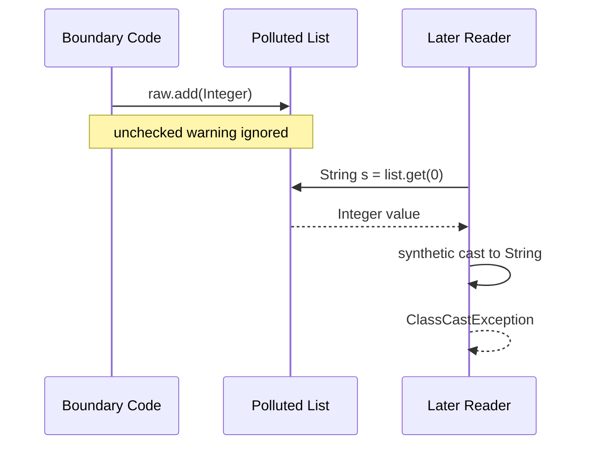
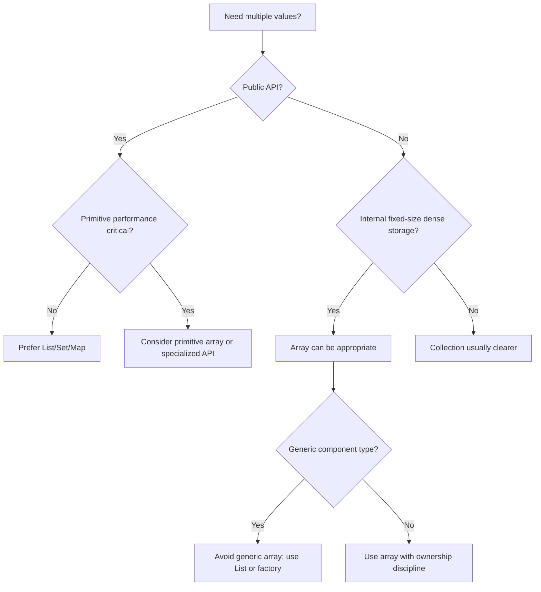

------
title: Learn Java Core Types, Data Model & Data APIs - Part 022
description: Arrays, generics, reifiability, covariance, heap pollution, varargs, and safe array boundaries in Java.
series: learn-java-core-types
seriesTitle: Learn Java Core Types, Data Model & Data APIs
order: 22
partTitle: Arrays, Generics, and Reifiability
tags:
- java
- arrays
- generics
- reifiability
- heap-pollution
- varargs
- type-system
date: 2026-06-27
---

# Part 022 — Arrays, Generics, and Reifiability

> Goal: memahami konflik desain antara arrays dan generics di Java: arrays bersifat reified dan covariant, sedangkan generics bersifat erased dan invariant. Setelah bagian ini, kita bisa membaca warning generic varargs, menghindari heap pollution, dan mendesain boundary array/generic yang aman.

Arrays adalah fitur Java paling tua. Generics datang jauh setelah Java sudah dipakai luas. Karena Java menjaga backward compatibility, generics dirancang dengan **type erasure**. Akibatnya, arrays dan generics punya karakter yang berbeda:

| Feature | Array | Generic collection |
|---|---|---|
| Runtime type information | reified | mostly erased |
| Variance | covariant | invariant |
| Runtime store check | yes | no equivalent per type argument |
| Primitive support | yes, `int[]` | no direct primitive type argument |
| Size | fixed | usually dynamic |
| Preferred public API | rarely | usually yes |

Ini bukan trivia. Ini sumber banyak bug dan warning yang sering diabaikan.

---

## 1. Mental Model

Array membawa component type di runtime.

```java
String[] names = new String[3];
System.out.println(names.getClass()); // class [Ljava.lang.String;
```

`List<String>` tidak membawa `String` sebagai runtime type argument yang bisa dibedakan dari `List<Integer>`.

```java
List<String> names = new ArrayList<>();
List<Integer> numbers = new ArrayList<>();

System.out.println(names.getClass() == numbers.getClass()); // true
```

Itulah alasan:

```java
if (names instanceof List<String>) { } // illegal
```

Tetapi ini legal:

```java
if (names instanceof List<?>) { }
```

Karena `List<?>` reifiable sebagai unbounded wildcard invocation.

---

## 2. Arrays Are Objects

Array bukan primitive. Array adalah object.

```java
int[] numbers = {1, 2, 3};
Object object = numbers;
Cloneable cloneable = numbers;
Serializable serializable = numbers;
```

Semua array:

- memiliki field `length`;
- bisa diakses dengan index;
- melempar `ArrayIndexOutOfBoundsException` bila index invalid;
- punya runtime component type;
- subtype dari `Object`;
- implement `Cloneable` dan `Serializable`.

Array of primitive dan array of reference sama-sama object, tetapi component storage-nya berbeda secara konseptual.

```java
int[] primitives = new int[10];
Integer[] references = new Integer[10];
```

`int[]` menyimpan primitive int values. `Integer[]` menyimpan reference values ke `Integer` objects atau `null`.

---

## 3. Array Covariance

Arrays di Java covariant.

Jika `String extends Object`, maka `String[] extends Object[]`.

```java
String[] strings = new String[2];
Object[] objects = strings;
```

Ini legal di compile time. Tetapi runtime tetap tahu bahwa array sebenarnya `String[]`.

```java
objects[0] = "ok";
objects[1] = new Object(); // ArrayStoreException
```

Kenapa exception?

Karena runtime store check melihat bahwa actual array component type adalah `String`, dan `Object` bukan `String`.

```mermaid
flowchart TD
    A[String[] actual object] --> B[Assigned to Object[] reference]
    B --> C[objects[1] = new Object]
    C --> D{Runtime component type allows Object?}
    D -- No --> E[ArrayStoreException]
    D -- Yes --> F[Store succeeds]
```

Array covariance adalah kompromi historis. Ia memberi fleksibilitas, tetapi type-safety baru dipastikan sebagian di runtime.

Generics memilih arah berbeda: invariant di compile time.

---

## 4. Generic Invariance vs Array Covariance

Bandingkan:

```java
String[] strings = new String[1];
Object[] objects = strings; // legal

List<String> stringList = new ArrayList<>();
// List<Object> objectList = stringList; // illegal
```

Generics mencegah problem sejak compile time.

Jika `List<String>` boleh menjadi `List<Object>`, ini bisa terjadi:

```java
List<String> strings = new ArrayList<>();
// List<Object> objects = strings;
// objects.add(new Object());
// String s = strings.get(0);
```

Karena generics erased, runtime tidak punya `List<String>` component type untuk dicek seperti array. Maka compiler harus lebih ketat.

Rule:

> Arrays memilih runtime check. Generics memilih compile-time check.

---

## 5. Reifiable Types

Type disebut reifiable bila informasi type-nya tersedia penuh di runtime.

Contoh reifiable:

```java
int
String
String[]
List<?>          // unbounded wildcard invocation
List             // raw type, legacy
```

Contoh non-reifiable:

```java
List<String>
List<Integer>
Map<String, BigDecimal>
T
List<T>
List<? extends Number>
```

Non-reifiable berarti sebagian informasi type hilang karena erasure.

Implikasi:

```java
List<String> names = List.of("a");
// if (names instanceof List<String>) { } // illegal

if (names instanceof List<?>) { // legal
    // runtime hanya memastikan object adalah List
}
```

---

## 6. Why Generic Array Creation Is Illegal

Ini illegal:

```java
// List<String>[] array = new List<String>[10];
```

Kenapa?

Karena arrays reified dan melakukan runtime store check. Runtime harus tahu component type array. Tetapi `List<String>` non-reifiable; runtime hanya tahu `List`.

Jika diizinkan, type-safety bisa rusak:

```java
// Hypothetical illegal Java
List<String>[] stringLists = new List<String>[1];
Object[] objects = stringLists;
objects[0] = List.of(123); // runtime hanya lihat List, bisa lolos
String s = stringLists[0].get(0); // ClassCastException later
```

Compiler mencegah dari awal.

---

## 7. Legal but Dangerous: Array of Raw or Wildcard Type

Ini legal:

```java
List<?>[] lists = new List<?>[10];
```

Kenapa? `List<?>` reifiable enough untuk runtime. Tetapi operasi element tetap terbatas.

```java
lists[0] = List.of("a", "b");
lists[1] = List.of(1, 2, 3);

Object first = lists[0].get(0);
```

Kita tidak bisa memperlakukan `lists[0]` sebagai `List<String>` tanpa check/cast.

Raw array juga legal tapi sebaiknya dihindari:

```java
List[] rawLists = new List[10]; // raw type warning risk
rawLists[0] = List.of("a");
rawLists[1] = List.of(1);
```

Raw type melepas type checking generic. Gunakan hanya di boundary legacy, dan bungkus segera dengan adapter yang typed.

---

## 8. Heap Pollution

Heap pollution terjadi saat variable parameterized type menunjuk ke object yang bukan parameterized type tersebut.

Contoh:

```java
List<String> strings = new ArrayList<>();
List raw = strings;
raw.add(123); // unchecked warning, but compiles

String value = strings.get(0); // ClassCastException
```

Kesalahannya terjadi saat raw add. Exception muncul belakangan saat read.

Ini membuat heap pollution sulit didiagnosis:



Production rule:

> Treat unchecked warnings as design debt. Kalau harus ada, isolasi dan dokumentasikan invariant-nya.

---

## 9. Generic Varargs: Why Warnings Exist

Varargs di Java memakai array di balik layar.

```java
static void logAll(String... messages) {
    for (String message : messages) {
        System.out.println(message);
    }
}
```

`String...` kira-kira menjadi `String[]`.

Generic varargs bermasalah karena component type generic bisa non-reifiable.

```java
static <T> List<T> listOf(T... items) {
    return Arrays.asList(items);
}
```

Ini sering berguna, tetapi compiler bisa memberi warning:

```text
Possible heap pollution from parameterized vararg type T
```

Lebih berbahaya:

```java
static void dangerous(List<String>... stringLists) {
    Object[] array = stringLists;
    array[0] = List.of(42);
    String s = stringLists[0].get(0); // ClassCastException
}
```

Karena varargs parameter adalah array, dan array bisa dilihat sebagai `Object[]`.

---

## 10. `@SafeVarargs`

`@SafeVarargs` menyatakan bahwa method tidak melakukan operasi tidak aman pada varargs parameter.

Contoh aman:

```java
@SafeVarargs
static <T> List<T> immutableListOf(T... items) {
    return List.of(items);
}
```

Tetapi annotation ini adalah janji dari programmer. Compiler tidak membuktikan semua invariant semantik.

Aman bila method:

- tidak menulis ke varargs array dengan value yang salah type;
- tidak mengekspos varargs array ke caller atau tempat lain yang bisa memodifikasinya;
- hanya membaca elemen dan/atau membuat defensive copy;
- tidak menyimpan array untuk digunakan setelah method return, kecuali sudah aman dan terkendali.

Buruk:

```java
private static Object[] leaked;

@SafeVarargs
static <T> void unsafe(T... items) {
    leaked = items; // exposes array through global state
}
```

Annotation tidak membuat ini aman.

---

## 11. Safe Generic Varargs Pattern

Pattern aman:

```java
@SafeVarargs
static <T> List<T> snapshot(T... items) {
    return List.copyOf(Arrays.asList(items));
}
```

Kenapa lebih aman?

- Method membaca `items`.
- Tidak menulis value asing ke array.
- Tidak menyimpan array.
- Return berupa unmodifiable snapshot.

Pattern hati-hati untuk builder:

```java
@SafeVarargs
static <T> Set<T> setOfNonNull(T... items) {
    Set<T> result = new LinkedHashSet<>();
    for (T item : items) {
        result.add(Objects.requireNonNull(item));
    }
    return Set.copyOf(result);
}
```

---

## 12. Arrays and Wildcards

Array of wildcard bisa berguna untuk internal structure, tetapi jarang ideal untuk public API.

```java
List<?>[] buckets = new List<?>[16];
```

Bisa dipakai untuk heterogeneous buckets:

```java
buckets[0] = List.of("a", "b");
buckets[1] = List.of(1, 2, 3);
```

Tetapi read type-nya hanya `Object`:

```java
Object value = buckets[0].get(0);
```

Kalau setiap bucket punya type association, lebih baik gunakan typed registry:

```java
final class TypedKey<T> {
    private final String name;
    private final Class<T> type;

    TypedKey(String name, Class<T> type) {
        this.name = name;
        this.type = type;
    }

    Class<T> type() {
        return type;
    }
}
```

Lalu isolasi unchecked cast dalam registry.

---

## 13. `Class<T>` and Runtime Type Tokens

Karena `T` erased, kita tidak bisa menulis:

```java
// T value = new T();
// if (x instanceof T) { }
// T[] array = new T[10];
```

Solusi umum: bawa runtime token.

```java
static <T> T cast(Object value, Class<T> type) {
    return type.cast(value);
}
```

Untuk array:

```java
@SuppressWarnings("unchecked")
static <T> T[] newArray(Class<T> componentType, int length) {
    return (T[]) java.lang.reflect.Array.newInstance(componentType, length);
}
```

Pemakaian:

```java
String[] names = newArray(String.class, 10);
```

Unchecked cast ada, tetapi runtime array benar-benar punya component type `String`.

Boundary principle:

> Kalau butuh runtime type untuk generic T, minta `Class<T>` atau type token lain dari caller.

Untuk nested generic seperti `List<String>`, `Class<List>` tidak cukup untuk membawa `String`. Framework biasanya memakai `Type`, `ParameterizedType`, atau custom type reference.

---

## 14. Arrays vs Collections in API Design

Gunakan array bila:

- API low-level dan ukuran fixed penting;
- interoperasi dengan Java APIs lama atau JNI-like boundary;
- primitive array diperlukan untuk memory/performance;
- data benar-benar dense dan index-based;
- varargs memberi ergonomi yang nyata.

Gunakan collection bila:

- public domain/service API;
- ukuran berubah;
- butuh semantic contract seperti set/map/queue;
- butuh generics dan wildcard variance;
- butuh unmodifiable factory methods;
- butuh stream pipeline integration.

Bad public API:

```java
Payment[] findPayments();
```

Masalah:

- caller bisa mutate array;
- ukuran fixed tapi ownership tidak jelas;
- tidak ada semantic richness;
- array covariance bisa membuka `ArrayStoreException` pada boundary tertentu.

Better:

```java
List<Payment> findPayments();
```

Kalau harus return array, defensive copy:

```java
class PaymentBatch {
    private final Payment[] payments;

    PaymentBatch(Payment[] payments) {
        this.payments = payments.clone();
    }

    Payment[] payments() {
        return payments.clone();
    }
}
```

---

## 15. Primitive Arrays vs Boxed Collections

Generic type argument tidak bisa primitive.

```java
// List<int> ints; // illegal
List<Integer> ints; // boxes values
```

Untuk data numeric besar, `int[]` bisa jauh lebih hemat alokasi daripada `List<Integer>` karena tidak perlu boxing per element.

Trade-off:

| Need | Prefer |
|---|---|
| dense numeric computation | `int[]`, `long[]`, `double[]` |
| semantic domain list | `List<T>` |
| unknown size accumulation | `IntStream.Builder`, collection, specialized buffer |
| interoperability with APIs expecting objects | `List<Integer>` |
| avoid boxing in stream | `IntStream`, `LongStream`, `DoubleStream` |

Contoh:

```java
int[] latenciesMillis = new int[1_000_000];
```

lebih natural untuk raw metric buffer daripada:

```java
List<Integer> latenciesMillis = new ArrayList<>();
```

Tetapi untuk domain object:

```java
List<Payment> payments = repository.findPayments();
```

lebih baik daripada `Payment[]`.

---

## 16. Defensive Copy and Array Ownership

Array mutable selalu butuh ownership discipline.

Bad:

```java
record Payload(byte[] bytes) {}
```

Record ini shallowly immutable, tetapi array di dalamnya mutable.

```java
byte[] data = {1, 2, 3};
Payload p = new Payload(data);
data[0] = 99;
System.out.println(p.bytes()[0]); // 99
```

Better:

```java
record Payload(byte[] bytes) {
    Payload {
        bytes = bytes.clone();
    }

    @Override
    public byte[] bytes() {
        return bytes.clone();
    }
}
```

Untuk `List`, bisa gunakan snapshot:

```java
record Batch(List<Payment> payments) {
    Batch {
        payments = List.copyOf(payments);
    }
}
```

Array tidak punya built-in immutable variant. Maka clone/copy discipline sangat penting.

---

## 17. `Arrays.asList` Trap

```java
String[] array = {"a", "b"};
List<String> list = Arrays.asList(array);
```

List yang dihasilkan fixed-size dan backed by array.

```java
list.set(0, "x");       // ok, modifies array
// list.add("c");       // UnsupportedOperationException
System.out.println(array[0]); // x
```

Kalau ingin mutable independent list:

```java
List<String> mutable = new ArrayList<>(Arrays.asList(array));
```

Kalau ingin unmodifiable snapshot:

```java
List<String> snapshot = List.copyOf(Arrays.asList(array));
```

Atau:

```java
List<String> snapshot = List.of(array); // hati-hati: varargs copies references, not deep copy
```

Untuk object mutable elements, snapshot collection tidak membuat deep immutable element.

---

## 18. `toArray` Correct Usage

Modern idiom:

```java
List<String> names = List.of("a", "b");
String[] array = names.toArray(String[]::new);
```

Alternative classic:

```java
String[] array = names.toArray(new String[0]);
```

Hindari:

```java
Object[] objects = names.toArray();
// String[] strings = (String[]) names.toArray(); // ClassCastException
```

Karena no-arg `toArray()` menghasilkan `Object[]`, bukan `String[]`.

---

## 19. Multi-dimensional Arrays

Java multidimensional array adalah array of arrays.

```java
int[][] matrix = new int[2][3];
```

Secara konseptual:

```java
int[][] matrix = new int[2][];
matrix[0] = new int[3];
matrix[1] = new int[3];
```

Jagged array legal:

```java
int[][] triangle = new int[3][];
triangle[0] = new int[1];
triangle[1] = new int[2];
triangle[2] = new int[3];
```

Failure mode:

```java
int[][] rows = new int[3][];
rows[0][0] = 1; // NullPointerException, rows[0] belum diinisialisasi
```

Untuk large matrix performance, flat array sering lebih predictable:

```java
final class IntMatrix {
    private final int rows;
    private final int cols;
    private final int[] values;

    IntMatrix(int rows, int cols) {
        this.rows = rows;
        this.cols = cols;
        this.values = new int[Math.multiplyExact(rows, cols)];
    }

    int get(int row, int col) {
        return values[index(row, col)];
    }

    void set(int row, int col, int value) {
        values[index(row, col)] = value;
    }

    private int index(int row, int col) {
        Objects.checkIndex(row, rows);
        Objects.checkIndex(col, cols);
        return Math.addExact(Math.multiplyExact(row, cols), col);
    }
}
```

---

## 20. Arrays and Pattern Matching / `instanceof`

Array runtime type can be checked:

```java
Object value = new String[] {"a", "b"};

if (value instanceof String[] strings) {
    System.out.println(strings.length);
}
```

But parameterized generic type cannot:

```java
Object value = List.of("a", "b");

if (value instanceof List<?> list) {
    // ok
}

// if (value instanceof List<String> strings) { } // illegal
```

If you need validate list element type at runtime, you must inspect elements:

```java
static <T> List<T> checkedList(Object value, Class<T> elementType) {
    if (!(value instanceof List<?> raw)) {
        throw new IllegalArgumentException("Expected List");
    }

    List<T> result = new ArrayList<>(raw.size());
    for (Object element : raw) {
        result.add(elementType.cast(element));
    }
    return List.copyOf(result);
}
```

This turns runtime uncertainty into a typed immutable snapshot.

---

## 21. Case Study: JSON Boundary

JSON parser often returns generic structures:

```java
Map<String, Object> payload = parseJson(...);
```

Bad approach:

```java
@SuppressWarnings("unchecked")
List<String> tags = (List<String>) payload.get("tags");
```

This only checks runtime object is `List`, not element type `String`.

Better boundary normalization:

```java
static List<String> requireStringList(Map<String, Object> payload, String key) {
    Object value = payload.get(key);
    if (!(value instanceof List<?> raw)) {
        throw new IllegalArgumentException("Expected list for " + key);
    }

    List<String> result = new ArrayList<>(raw.size());
    for (Object element : raw) {
        if (!(element instanceof String s)) {
            throw new IllegalArgumentException("Expected string element for " + key);
        }
        result.add(s);
    }
    return List.copyOf(result);
}
```

Principle:

> Validate external untyped data at the boundary, then move inward with strongly typed immutable data.

---

## 22. Case Study: Generic Repository `findAllAsArray`

Tempting API:

```java
interface Repository<T> {
    T[] findAllAsArray(); // hard to implement safely
}
```

Implementation cannot simply:

```java
// return new T[items.size()]; // illegal
```

Better options:

Option 1: return `List<T>`.

```java
interface Repository<T> {
    List<T> findAll();
}
```

Option 2: accept array generator.

```java
interface Repository<T> {
    T[] findAll(IntFunction<T[]> arrayFactory);
}
```

Usage:

```java
Payment[] payments = repo.findAll(Payment[]::new);
```

Option 3: accept `Class<T>` if runtime component type is enough.

```java
final class Repository<T> {
    private final Class<T> type;

    Repository(Class<T> type) {
        this.type = type;
    }

    T[] findAllArray(List<T> items) {
        @SuppressWarnings("unchecked")
        T[] array = (T[]) java.lang.reflect.Array.newInstance(type, items.size());
        return items.toArray(array);
    }
}
```

Prefer option 1 for most domain APIs.

---

## 23. Failure Modes

### 23.1 `ArrayStoreException`

```java
Object[] objects = new String[1];
objects[0] = new Object(); // runtime failure
```

Cause: array covariance plus runtime component type check.

### 23.2 `ClassCastException` far from root cause

```java
List<String> strings = new ArrayList<>();
List raw = strings;
raw.add(1);
String s = strings.get(0); // fails here, not at pollution point
```

Cause: raw type / unchecked operation.

### 23.3 Unsafe generic array cast

```java
@SuppressWarnings("unchecked")
List<String>[] lists = (List<String>[]) new List<?>[10];
```

Can be safe only if you fully control writes and reads. Avoid in public API.

### 23.4 Leaking mutable array from immutable-looking object

```java
record Digest(byte[] value) {}
```

Cause: shallow immutability.

### 23.5 Treating `toArray()` as typed

```java
String[] names = (String[]) list.toArray(); // wrong
```

Use `toArray(String[]::new)`.

### 23.6 Ignoring varargs heap pollution warning

```java
static void f(List<String>... lists) { }
```

Review whether method is truly safe and annotate only if invariant is clear.

---

## 24. Decision Framework



---

## 25. API Checklist

Before using array in a design, ask:

- Is the array exposed to caller?
- Does caller own it or should we defensive copy?
- Is component type reifiable?
- Could covariance cause `ArrayStoreException`?
- Is a primitive array needed for performance?
- Would `List<T>` express semantics better?
- Is the size fixed by contract or merely current implementation?
- Are we mixing arrays with generic varargs?
- Do we have unchecked warnings?
- If using `@SafeVarargs`, can we prove we do not corrupt or leak the varargs array?

Before suppressing unchecked warning, ask:

- What invariant makes this safe?
- Can runtime validation replace unchecked cast?
- Can the unchecked operation be isolated in one method?
- Is there a test that fails if invariant is broken?
- Is the suppression local, not method/class-wide?

---

## 26. Practical Rules

1. Prefer `List<T>` over `T[]` for public object APIs.
2. Prefer primitive arrays for dense numeric buffers when performance and memory matter.
3. Never expose internal mutable arrays without defensive copying.
4. Avoid generic arrays; use collections or array factories.
5. Treat raw types as legacy interop only.
6. Treat unchecked warnings as defects until proven otherwise.
7. Use `List<?>` for unknown element type, not `List<Object>`.
8. Use `toArray(Type[]::new)` or `toArray(new Type[0])` for typed arrays.
9. Use `@SafeVarargs` only when method is genuinely safe.
10. Validate untyped external data at the boundary and return typed immutable snapshots.

---

## 27. Practice Drill

Fix this code:

```java
record Attachment(byte[] bytes) {}

class UnsafeBox<T> {
    private T[] values;

    @SuppressWarnings("unchecked")
    UnsafeBox(int size) {
        this.values = (T[]) new Object[size];
    }

    T[] values() {
        return values;
    }
}

static void accept(List<String>... names) {
    Object[] array = names;
    array[0] = List.of(1, 2, 3);
}
```

Possible refactor:

```java
record Attachment(byte[] bytes) {
    Attachment {
        bytes = bytes.clone();
    }

    @Override
    public byte[] bytes() {
        return bytes.clone();
    }
}

class SafeBox<T> {
    private final List<T> values;

    SafeBox(Collection<? extends T> values) {
        this.values = List.copyOf(values);
    }

    List<T> values() {
        return values;
    }
}

@SafeVarargs
static <T> List<T> snapshot(T... values) {
    return List.copyOf(Arrays.asList(values));
}
```

Then explain:

- `Attachment` now protects array ownership.
- `SafeBox` avoids generic array creation.
- `snapshot` reads varargs and returns copy, without corrupting or leaking array.

---

## 28. Key Takeaways

1. Arrays are reified; generics are erased.
2. Arrays are covariant; generic collections are invariant.
3. Array covariance can fail at runtime with `ArrayStoreException`.
4. Generic invariance prevents many errors at compile time.
5. Non-reifiable types cannot be fully checked at runtime.
6. Generic array creation is illegal because runtime component type cannot represent type arguments.
7. Varargs uses arrays, so generic varargs can create heap pollution risk.
8. `@SafeVarargs` is a promise, not magic.
9. Public APIs should usually return collections, not arrays.
10. Mutable arrays require explicit ownership and defensive copy discipline.

---

## Official References

- Java Language Specification SE 25 — Chapter 4: Types, Values, and Variables
- Java Language Specification SE 25 — Array Types, Subtyping among Array Types, Reifiable Types, Raw Types
- Java Language Specification SE 25 — Chapter 10: Arrays
- Java Tutorials — Non-Reifiable Types, Heap Pollution, Generic Varargs
- Java SE 25 API — `java.lang.SafeVarargs`, `java.lang.reflect.Array`, `java.util.Arrays`, `java.util.List`
