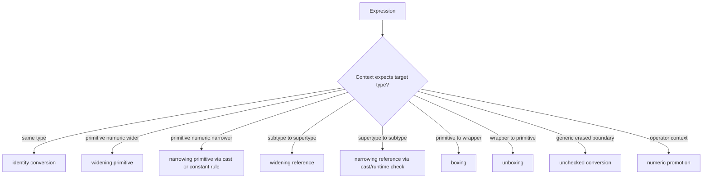
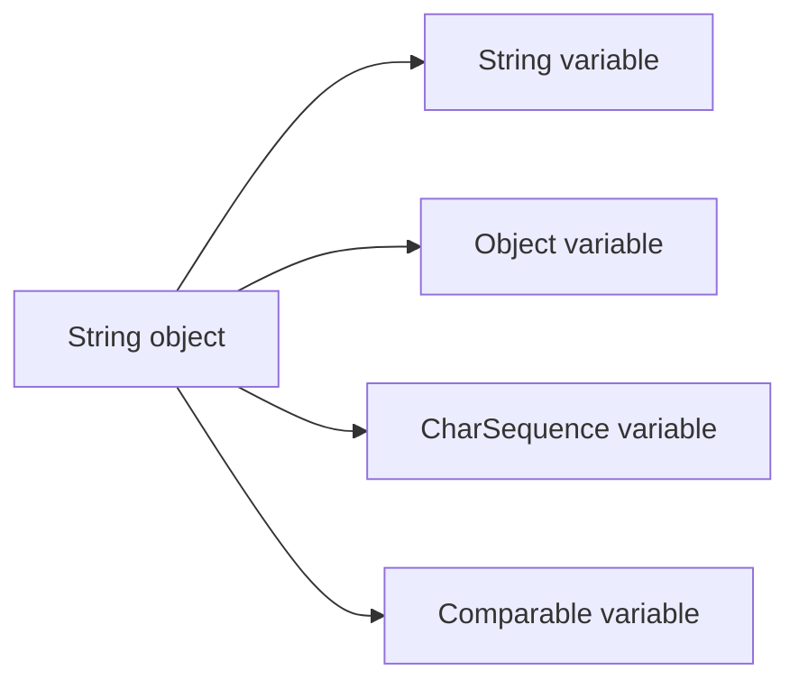
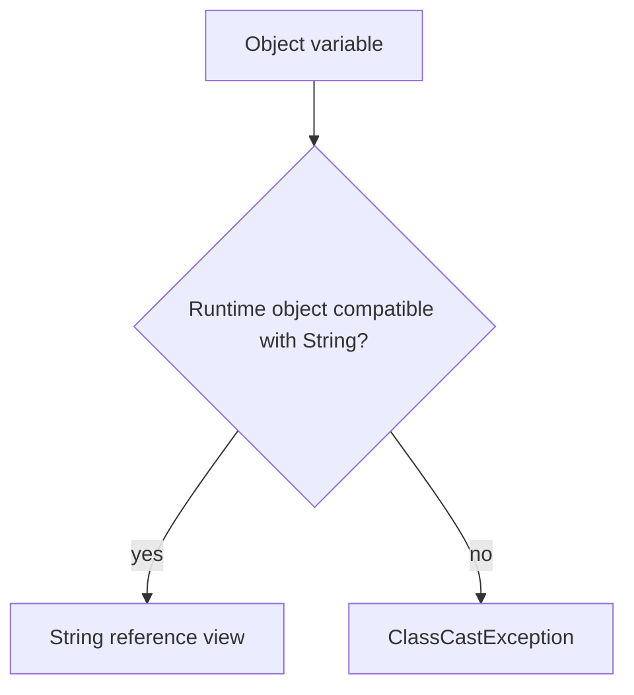

------
title: Learn Java Core Types, Data Model & Data APIs - Part 023
description: Conversion contexts, casting, primitive/reference conversions, overload effects, and numeric promotion rules in Java.
series: learn-java-core-types
seriesTitle: Learn Java Core Types, Data Model & Data APIs
order: 23
partTitle: Conversions, Casting, and Numeric Promotion
tags:
- java
- conversions
- casting
- numeric-promotion
- type-system
- primitives
- references
- overload-resolution
date: 2026-06-27
---

# Part 023 — Conversions, Casting, and Numeric Promotion

> Goal: memahami cara Java mengubah type secara eksplisit maupun implisit, kapan compiler membantu, kapan runtime melakukan check, dan kapan data berubah tanpa error. Setelah bagian ini, kita bisa membaca error conversion, overload confusion, numeric promotion, dan `ClassCastException` sebagai konsekuensi formal dari type system, bukan sebagai kejadian acak.

Conversion di Java sering terasa seperti “compiler magic”. Padahal aturannya sangat formal. Banyak bug production muncul karena engineer tidak membedakan:

- **conversion**: perubahan type yang diizinkan bahasa;
- **cast**: permintaan eksplisit dari programmer agar expression diperlakukan sebagai target type;
- **promotion**: conversion khusus yang terjadi pada operasi numeric;
- **runtime check**: check yang baru bisa dilakukan ketika program berjalan;
- **representation change**: value benar-benar berubah bentuk/precision/range;
- **view change**: reference yang sama dilihat lewat supertype/subtype/interface.

Kita akan membangun mental model dari bawah, lalu masuk ke contoh yang umum muncul di API, overload, stream, collection, parsing, dan domain model.

---

## 1. Mental Model

Java adalah bahasa statically typed. Setiap expression punya compile-time type. Saat expression masuk ke context tertentu, compiler bertanya:

> “Apakah expression ini compatible dengan target type context?”

Contoh assignment context:

```java
long count = 10;       // int literal 10 compatible with long
Integer boxed = 10;    // int literal 10 boxed to Integer
Object obj = "hello";  // String widened to Object
```

Contoh casting context:

```java
Object raw = "hello";
String text = (String) raw;
```

Contoh numeric context:

```java
byte a = 10;
byte b = 20;
int c = a + b;         // a and b promoted to int
```

Conversion bukan satu konsep tunggal. Ada beberapa kategori yang berbeda:



The practical rule:

> Jangan hafal “bisa/tidak bisa” sebagai daftar. Pahami context, target type, conversion category, dan apakah runtime check diperlukan.

---

## 2. Conversion Is Contextual

Expression yang sama bisa legal di satu tempat dan illegal di tempat lain.

```java
byte b1 = 100;     // legal: int constant expression narrowed to byte
// byte b2 = 1000; // illegal: outside byte range

int i = 100;
// byte b3 = i;    // illegal: non-constant int variable to byte needs cast
byte b4 = (byte) i;
```

`100` bukan “bertipe byte”. Integer literal decimal tanpa suffix umumnya bertipe `int` jika muat. Tetapi assignment context punya rule khusus untuk constant expression yang muat dalam `byte`, `short`, atau `char`.

Context berbeda, rule berbeda:

| Context | Example | Allowed conversion style |
|---|---|---|
| Assignment | `long x = 1;` | assignment conversion |
| Method invocation | `m(1)` | invocation conversion, overload resolution applies |
| Cast | `(byte) x` | casting conversion |
| String | `"x=" + value` | string conversion |
| Numeric operator | `a + b` | numeric promotion |
| Conditional/operator context | `cond ? a : b` | target typing + numeric/reference rules |

The same value may cross multiple contexts in one expression.

```java
Long x = 1L;      // long literal -> boxing to Long
Object y = 1L;    // long literal -> boxing to Long -> widening reference to Object
```

But not every chain is allowed in every context.

```java
// Long bad = 1;  // illegal: int cannot widen to long and then box to Long in assignment
Long ok1 = 1L;    // long -> Long
Number ok2 = 1;   // int -> Integer -> Number
```

Why?

`Long` is not the wrapper of `int`. Boxing maps `int` to `Integer`, not to `Long`. Assignment conversion can box then widen reference, so `int` can become `Integer`, then `Number`, but not `Long`.

---

## 3. Identity Conversion

Identity conversion means no type change is needed.

```java
String a = "hello";
String b = a;
```

This sounds trivial, but it matters in overload resolution and generic inference.

```java
void f(String x) {}
void f(Object x) {}

f("hello"); // chooses f(String), the most specific match
```

When multiple overloads are possible, exact/specific compatibility generally wins over broader conversion paths. This is one reason overloaded APIs can become confusing when primitive, wrapper, generic, and varargs overloads coexist.

---

## 4. Widening Primitive Conversion

Widening primitive conversion moves from a smaller or narrower primitive type to a wider primitive type.

Examples:

```java
int i = 42;
long l = i;
float f = l;
double d = f;
```

Common widening paths:

```text
byte  -> short -> int -> long -> float -> double
byte  -> int
short -> int
char  -> int
int   -> long -> float -> double
long  -> float -> double
float -> double
```

Important nuance: widening does not always mean exact preservation of precision.

```java
long precise = 9_007_199_254_740_993L; // 2^53 + 1
double asDouble = precise;
long back = (long) asDouble;

System.out.println(precise);  // 9007199254740993
System.out.println(back);     // 9007199254740992, likely due to double precision limit
```

Widening from `int`/`long` to `float` or from `long` to `double` may lose precision because floating-point types have limited significant bits.

Mental model:

| Widening conversion | Usually safe for range? | Always exact? |
|---|---:|---:|
| `byte` → `short/int/long` | yes | yes |
| `short` → `int/long` | yes | yes |
| `char` → `int/long` | yes | yes |
| `int` → `long` | yes | yes |
| `int` → `float` | range yes | not always exact |
| `long` → `float/double` | range yes | not always exact |
| `float` → `double` | range yes | represents float value exactly as double |

Production implication:

> Treat widening to floating-point as “range-safe but precision-risky”.

---

## 5. Narrowing Primitive Conversion

Narrowing primitive conversion moves to a type with smaller range or different representation. It usually requires an explicit cast, except for certain constant expressions in assignment.

```java
int i = 300;
byte b = (byte) i;
System.out.println(b); // 44, because high-order bits are discarded
```

Narrowing can silently change value.

```java
long big = 3_000_000_000L;
int small = (int) big;
System.out.println(small); // negative value due to truncation/wrap-style narrowing
```

Floating-point to integral narrowing is especially dangerous:

```java
double amount = 12.99;
int units = (int) amount;
System.out.println(units); // 12, fractional part discarded toward zero
```

Some important behaviors:

| Conversion | Risk |
|---|---|
| `int` → `byte` | high bits discarded |
| `long` → `int` | high bits discarded |
| `double` → `int` | fractional part lost; overflow saturated; NaN becomes zero |
| `float` → `short` | fractional + range + bit loss |
| `int` → `char` | interpreted as unsigned 16-bit code unit |

Example with `char`:

```java
int code = 65;
char c = (char) code;
System.out.println(c); // A
```

But this is not Unicode-safe character modeling. It is only conversion to a UTF-16 code unit.

---

## 6. Constant Expression Narrowing

Java allows certain narrowing conversions when the source is a compile-time constant expression and the value fits.

```java
byte b = 127;
short s = 32_000;
char c = 65;
```

But this fails:

```java
// byte b = 128;    // out of range
// char c = -1;     // out of char range
```

And this also fails:

```java
int x = 127;
// byte b = x;      // x is not a compile-time constant variable unless final and constant-initialized
```

With `final`:

```java
final int x = 127;
byte b = x;         // legal: x is a constant variable
```

This rule is useful, but do not overuse it as “implicit cast”. In production code, make range assumptions visible.

```java
static byte checkedByte(int value) {
    if (value < Byte.MIN_VALUE || value > Byte.MAX_VALUE) {
        throw new IllegalArgumentException("out of byte range: " + value);
    }
    return (byte) value;
}
```

---

## 7. Widening Reference Conversion

Widening reference conversion moves from a subtype to a supertype or implemented interface. It changes the static view, not the object.

```java
String text = "hello";
Object object = text;
CharSequence chars = text;
Comparable<String> comparable = text;
```

The runtime object is still a `String`.

```java
System.out.println(object.getClass()); // class java.lang.String
```

Mental model:



All variables can reference the same object, but each variable exposes a different compile-time contract.

```java
Object o = "hello";
// o.length();      // illegal: Object contract has no length()
String s = (String) o;
s.length();
```

Widening reference conversion is usually safe because every `String` is an `Object`, but not every `Object` is a `String`.

---

## 8. Narrowing Reference Conversion and Cast

Narrowing reference conversion moves from a wider reference type to a narrower one. It requires a cast and may fail at runtime.

```java
Object object = "hello";
String text = (String) object; // runtime check passes
```

Failure:

```java
Object object = 123;
String text = (String) object; // ClassCastException
```

The cast does not change the object. It asks the runtime to check whether the object is compatible with the target type.



Use `instanceof` pattern matching when the control flow needs a checked narrow view:

```java
Object input = "hello";

if (input instanceof String text) {
    System.out.println(text.length());
}
```

This is safer than cast-first code:

```java
// String text = (String) input;
// if (text.length() > 0) { ... }
```

But avoid turning domain design into a large `instanceof` chain. If the type hierarchy is yours, prefer polymorphism or sealed exhaustive handling where appropriate.

---

## 9. Checked vs Unchecked Casts

A checked cast can be validated at runtime.

```java
Object value = "x";
String text = (String) value; // checked cast
```

A cast involving non-reifiable generic type cannot be fully checked at runtime due to erasure.

```java
Object raw = java.util.List.of("a", "b");
@SuppressWarnings("unchecked")
java.util.List<String> names = (java.util.List<String>) raw;
```

The runtime can check that `raw` is a `List`, but cannot fully verify every element is `String` at the cast site.

Failure may occur later:

```java
Object raw = java.util.List.of(1, 2, 3);
@SuppressWarnings("unchecked")
java.util.List<String> names = (java.util.List<String>) raw;

String first = names.get(0); // ClassCastException here, not necessarily at cast line
```

Rule:

> An unchecked cast is a trust boundary. Localize it, validate it, document it, and do not spread it across your codebase.

Safer parser boundary:

```java
static java.util.List<String> requireStringList(Object raw) {
    if (!(raw instanceof java.util.List<?> list)) {
        throw new IllegalArgumentException("expected list");
    }

    java.util.ArrayList<String> result = new java.util.ArrayList<>(list.size());
    for (Object element : list) {
        if (!(element instanceof String s)) {
            throw new IllegalArgumentException("expected string element: " + element);
        }
        result.add(s);
    }
    return java.util.List.copyOf(result);
}
```

This converts an erased trust problem into validated domain data.

---

## 10. Boxing and Unboxing as Conversions

Boxing converts primitive value to wrapper object.

```java
Integer i = 10; // int -> Integer
Boolean b = true;
```

Unboxing converts wrapper object to primitive value.

```java
Integer boxed = 10;
int i = boxed;  // Integer -> int
```

But boxing/unboxing are not “free semantics”. They change the universe:

| Primitive | Wrapper |
|---|---|
| no null | can be null |
| value only | object/reference identity exists but should usually be ignored |
| used in arithmetic directly | unboxed before arithmetic |
| cannot be generic type argument | can be used in `List<Integer>` |
| compact arrays | object references in collections |

Unboxing null fails:

```java
Integer count = null;
// int c = count; // NullPointerException
```

This is a conversion failure, not arithmetic failure.

Part 024 will cover boxing/unboxing deeply. Here, remember that conversion chains involving boxing have strict rules and affect overload resolution.

---

## 11. String Conversion

String conversion happens in string concatenation context.

```java
int count = 3;
String message = "count=" + count;
```

For reference values, `String.valueOf`-like behavior applies. `null` becomes `
null`.

```java
Object value = null;
System.out.println("value=" + value); // value=null
```

Do not confuse string conversion with parsing.

```java
String text = "42";
int number = Integer.parseInt(text); // parsing, not conversion context
```

Production rule:

> Java language conversion can make a primitive/reference value into text in concatenation. It will not make arbitrary text into validated domain data. Parsing is an explicit boundary.

---

## 12. Numeric Promotion

Numeric promotion happens when numeric operands participate in operators.

### 12.1 Unary Numeric Promotion

Unary numeric promotion promotes `byte`, `short`, and `char` to `int`.

```java
byte b = 1;
int promoted = +b;
```

This is why this fails:

```java
byte b = 1;
// byte x = +b; // illegal: +b is int
```

### 12.2 Binary Numeric Promotion

Binary numeric promotion happens for many binary numeric operators like `+`, `-`, `*`, `/`, `%`, comparisons, and bitwise numeric operators.

Simplified rules:

1. if either operand is `double`, both become `double`;
2. else if either is `float`, both become `float`;
3. else if either is `long`, both become `long`;
4. else both become `int`.

```java
byte a = 10;
byte b = 20;
// byte c = a + b; // illegal: a + b is int
int c = a + b;
```

With `long`:

```java
int i = 10;
long l = 20L;
long result = i + l; // i promoted to long
```

With floating-point:

```java
int count = 10;
double ratio = 3.0;
double result = count / ratio;
```

But integer division stays integer when both operands are integer types after promotion.

```java
int a = 5;
int b = 2;
System.out.println(a / b); // 2
```

One operand must be floating-point before division:

```java
System.out.println(a / 2.0);      // 2.5
System.out.println((double) a / b); // 2.5
```

---

## 13. Numeric Promotion With `char`, `byte`, and `short`

This is one of the most common “why is Java doing this?” moments.

```java
char c = 'A';
System.out.println(c + 1); // 66
```

`char` participates as a numeric type in this context. It is promoted to `int`.

```java
char next = (char) (c + 1);
System.out.println(next); // B
```

Same for `short`:

```java
short s = 1;
// short t = s + 1; // illegal: s + 1 is int
short t = (short) (s + 1);
```

This protects operations from overflowing too early for small integral types, but it also surprises engineers who expect result type to match operand type.

---

## 14. Compound Assignment Has an Implicit Cast

Compound assignment is not exactly the same as simple assignment.

```java
byte b = 1;
b += 1;      // legal
// b = b + 1; // illegal without cast
```

Conceptually:

```java
b = (byte) (b + 1);
```

This can hide overflow.

```java
byte b = 127;
b += 1;
System.out.println(b); // -128
```

Do not use compound assignment when range overflow would be surprising.

---

## 15. Conditional Operator Type Surprises

The ternary conditional operator also performs type analysis.

```java
boolean flag = true;
int x = flag ? 1 : 2;
```

With mixed numeric types:

```java
Number n = flag ? 1 : 2.0; // result expression involves numeric promotion to double, boxed to Double for Number
System.out.println(n.getClass()); // class java.lang.Double
```

With `null` and wrapper:

```java
Integer maybe = flag ? 1 : null;
```

But mixing primitive and wrapper can trigger unboxing.

```java
Integer boxed = null;
// int value = flag ? boxed : 0; // if flag true, unboxing null causes NPE
```

Rule:

> In conditional expressions, do not assume each branch is isolated. Java computes a result type for the whole expression.

---

## 16. Method Invocation Conversion and Overload Resolution

Overload resolution is where conversion rules become practical engineering risk.

```java
void f(long x) {
    System.out.println("long");
}

void f(Integer x) {
    System.out.println("Integer");
}

f(1); // long, because widening primitive is preferred before boxing
```

Another case:

```java
void g(Integer x) {
    System.out.println("Integer");
}

void g(Object x) {
    System.out.println("Object");
}

g(1); // Integer: int boxes to Integer, then Integer is more specific than Object
```

Varargs can add another phase:

```java
void h(int x) {}
void h(Integer... xs) {}

h(1); // h(int), fixed arity exact/primitive match wins
```

Avoid overload sets that mix:

- primitive and wrapper variants;
- numeric siblings like `int`, `long`, `double`;
- generic and raw-ish `Object` variants;
- varargs and non-varargs alternatives;
- `null`-accepting reference overloads.

Ambiguous `null`:

```java
void send(String value) {}
void send(Integer value) {}

// send(null); // ambiguous
```

Fix by making the call explicit:

```java
send((String) null);
```

But if you need this often, your API shape is probably too ambiguous.

---

## 17. Casting Does Not Mean Conversion Is Semantically Safe

A cast can make code compile. It does not make the operation domain-correct.

```java
long cents = 123_456_789_012L;
int unsafe = (int) cents;
```

The cast says “I accept the language-level narrowing.” It says nothing about domain safety.

Better:

```java
static int requireIntRange(long value, String field) {
    if (value < Integer.MIN_VALUE || value > Integer.MAX_VALUE) {
        throw new IllegalArgumentException(field + " out of int range: " + value);
    }
    return (int) value;
}
```

A cast should often be preceded by a domain predicate:

| Cast kind | Good guard |
|---|---|
| `long` → `int` | range check |
| `double` → `BigDecimal` | avoid direct binary constructor; parse decimal text or use controlled scale |
| `Object` → `DomainEvent` | `instanceof`/sealed dispatch/validated deserialization |
| `List<?>` → `List<OrderId>` | element validation |
| `String` → `UUID` | parser with failure handling |

---

## 18. Conversion at API Boundaries

Conversion is most dangerous at system boundaries:


Bad boundary design:

```java
record CreateAccountRequest(String age, String balance, String countryCode) {}
```

Then business code repeatedly converts:

```java
int age = Integer.parseInt(request.age());
```

Better boundary:

```java
record CreateAccountCommand(Age age, Money openingBalance, CountryCode countryCode) {}
```

The conversion should be localized:

```java
static CreateAccountCommand parse(CreateAccountRequest request) {
    return new CreateAccountCommand(
            Age.parse(request.age()),
            Money.parse(request.balance()),
            CountryCode.parse(request.countryCode())
    );
}
```

Once inside the domain, avoid repeated primitive/string conversion.

---

## 19. Conversion Matrix for Daily Use

| Source | Target | Implicit? | Runtime check? | Main risk |
|---|---|---:|---:|---|
| `int` | `long` | yes | no | usually safe |
| `long` | `int` | no, cast | no | truncation |
| `int` | `float` | yes | no | precision loss |
| `double` | `int` | no, cast | no | fractional loss, saturation, NaN behavior |
| `byte`/`short`/`char` in arithmetic | `int` | yes | no | unexpected result type |
| subtype | supertype | yes | no | method visibility narrowed to supertype contract |
| supertype | subtype | no, cast | yes | `ClassCastException` |
| primitive | wrapper | context-dependent | allocation/caching details | null/identity/perf assumptions |
| wrapper | primitive | context-dependent | null check | `NullPointerException` |
| raw/generic erased object | parameterized type | no, unchecked cast | partial | heap pollution |
| any value in string concat | `String` | yes | no | accidental logging/format ambiguity |

---

## 20. Common Failure Modes

### 20.1 Silent Numeric Overflow

```java
int seconds = 60 * 60 * 24 * 365 * 100; // overflow before assignment if all int literals
long secondsLong = 60L * 60 * 24 * 365 * 100;
```

Put `L` early enough.

### 20.2 Integer Division Hidden in Larger Expression

```java
double ratio = 1 / 3; // 0.0, because 1 / 3 is int division first
double ok = 1.0 / 3;
```

### 20.3 Cast Too Late

```java
int a = 1;
int b = 3;
double wrong = (double) (a / b); // 0.0
double right = (double) a / b;   // 0.333...
```

### 20.4 Ambiguous Null Overload

```java
void audit(String message) {}
void audit(Throwable error) {}

// audit(null); // ambiguous
```

Use distinct method names if the semantics differ.

### 20.5 Unchecked Cast Hidden in Utility

```java
@SuppressWarnings("unchecked")
static <T> T unsafe(Object value) {
    return (T) value;
}
```

This function exports heap pollution risk to every caller. Avoid it unless the caller supplies a `Class<T>` or validation strategy.

### 20.6 Accidental Floating-Point Aggregation

```java
long totalCents = 0;
// double totalMoney = ... // avoid for money
```

Represent money as integer minor units or `BigDecimal` with explicit scale/rounding.

---

## 21. Production Decision Framework

When you see a conversion, ask:

1. **What is the source type?** Static type and runtime type may differ.
2. **What is the target type?** Is it primitive, wrapper, class, interface, generic?
3. **Which context is this?** Assignment, invocation, cast, numeric, string?
4. **Is data representation changed?** Range, precision, scale, encoding, nullability?
5. **Is there a runtime check?** Could it throw `ClassCastException` or `NullPointerException`?
6. **Is the conversion domain-safe?** Does it preserve business meaning?
7. **Should conversion be localized?** Boundary parser/mapper instead of scattered casts.
8. **Could overload resolution choose a surprising method?** Especially with primitives/wrappers/varargs.

---

## 22. Worked Example: Raw Payload to Domain Command

Bad version:

```java
void createAccount(Map<String, Object> payload) {
    int age = (Integer) payload.get("age");
    double openingBalance = (Double) payload.get("openingBalance");
    String country = (String) payload.get("country");

    // business logic...
}
```

Problems:

- unchecked trust in runtime types;
- money modeled as `double`;
- missing key becomes `null`, possibly causing NPE;
- casts are mixed with business logic;
- conversion errors are not domain errors.

Better:

```java
record CreateAccountCommand(Age age, Money openingBalance, CountryCode country) {}

static CreateAccountCommand toCommand(Map<String, ?> payload) {
    return new CreateAccountCommand(
            Age.from(requireNumber(payload, "age").intValue()),
            Money.parse(requireString(payload, "openingBalance")),
            CountryCode.parse(requireString(payload, "country"))
    );
}

static Number requireNumber(Map<String, ?> payload, String key) {
    Object value = payload.get(key);
    if (value instanceof Number n) {
        return n;
    }
    throw new IllegalArgumentException("Expected numeric field: " + key);
}

static String requireString(Map<String, ?> payload, String key) {
    Object value = payload.get(key);
    if (value instanceof String s && !s.isBlank()) {
        return s;
    }
    throw new IllegalArgumentException("Expected non-blank string field: " + key);
}
```

Still not perfect, but the conversion boundary is now visible.

---

## 23. Practice Drill

### Drill 1 — Predict the Type

For each expression, write the result type before compiling:

```java
byte b = 1;
short s = 2;
char c = 'A';
int i = 3;
long l = 4L;
float f = 5.0f;
double d = 6.0;

var r1 = b + s;
var r2 = c + i;
var r3 = i + l;
var r4 = l + f;
var r5 = f + d;
var r6 = true ? i : d;
```

Expected mental model:

- `r1`: `int`
- `r2`: `int`
- `r3`: `long`
- `r4`: `float`
- `r5`: `double`
- `r6`: `double`

### Drill 2 — Find the Hidden Conversion Bug

```java
static long daysToMillis(int days) {
    return days * 24 * 60 * 60 * 1000;
}
```

Bug: multiplication happens as `int` before assignment to `long`. Fix:

```java
static long daysToMillis(int days) {
    return days * 24L * 60 * 60 * 1000;
}
```

### Drill 3 — Remove Unsafe Casts

Rewrite:

```java
@SuppressWarnings("unchecked")
List<String> roles = (List<String>) payload.get("roles");
```

Into:

```java
static List<String> requireStringList(Object value) {
    if (!(value instanceof List<?> list)) {
        throw new IllegalArgumentException("expected list");
    }
    ArrayList<String> result = new ArrayList<>();
    for (Object element : list) {
        if (!(element instanceof String role)) {
            throw new IllegalArgumentException("expected string role");
        }
        result.add(role);
    }
    return List.copyOf(result);
}
```

---

## 24. Review Checklist

Use this during code review:

- [ ] Are all narrowing primitive conversions explicit and range-checked if domain-sensitive?
- [ ] Are `byte`, `short`, and `char` arithmetic results expected to become `int`?
- [ ] Is integer division intentional?
- [ ] Is floating-point conversion acceptable for the domain?
- [ ] Are casts guarded by `instanceof`, sealed dispatch, or validated boundary logic?
- [ ] Are unchecked casts localized and documented?
- [ ] Are overloads avoiding primitive/wrapper/null ambiguity?
- [ ] Is conversion at system boundaries separated from business logic?
- [ ] Are string conversions not being confused with parsing/validation?
- [ ] Are compound assignments not hiding overflow?

---

## 25. Key Takeaways

- Conversion is context-dependent.
- Widening primitive conversion may still lose precision when floating-point is involved.
- Narrowing primitive conversion can silently change data.
- `byte`, `short`, and `char` arithmetic usually promotes to `int`.
- Casts make code compile; they do not make domain assumptions true.
- Reference casts are runtime checks over object compatibility.
- Generic casts are often only partially checked because of erasure.
- Boxing/unboxing are real conversions with nullability, identity, and performance consequences.
- Conversion should be explicit and localized at boundaries.

---

## References

- Java Language Specification, Java SE 25 — Chapter 5: Conversions and Contexts: https://docs.oracle.com/javase/specs/jls/se25/html/jls-5.html
- Java Language Specification, Java SE 25 — Chapter 4: Types, Values, and Variables: https://docs.oracle.com/javase/specs/jls/se25/html/jls-4.html
- Java Language Specification, Java SE 25 — Chapter 15: Expressions: https://docs.oracle.com/javase/specs/jls/se25/html/jls-15.html
- Java SE 25 API — `Object`: https://docs.oracle.com/en/java/javase/25/docs/api/java.base/java/lang/Object.html
- Java SE 25 API — `Number`: https://docs.oracle.com/en/java/javase/25/docs/api/java.base/java/lang/Number.html
