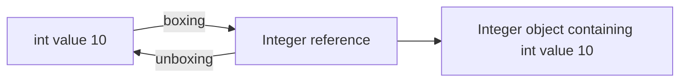
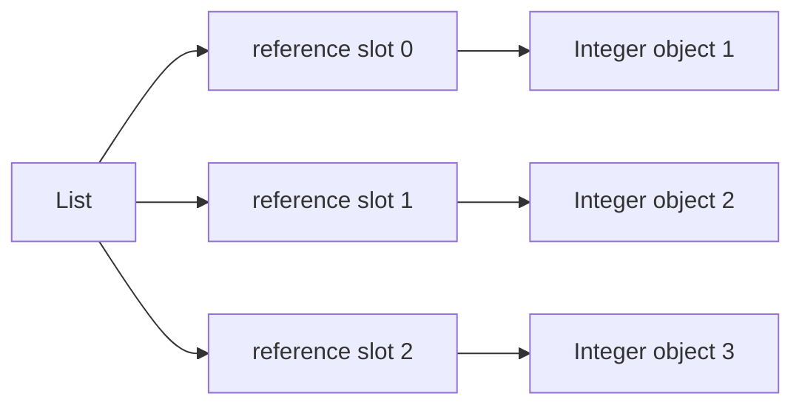

------
title: Learn Java Core Types, Data Model & Data APIs - Part 024
description: Boxing, unboxing, wrapper classes, nullability, identity traps, generic collections, primitive streams, and production trade-offs.
series: learn-java-core-types
seriesTitle: Learn Java Core Types, Data Model & Data APIs
order: 24
partTitle: Boxing, Unboxing, and Wrapper Types
tags:
- java
- boxing
- unboxing
- wrapper-types
- primitives
- nullability
- performance
- streams
- collections
date: 2026-06-27
---

# Part 024 — Boxing, Unboxing, and Wrapper Types

> Goal: memahami primitive wrapper types sebagai jembatan antara dunia primitive value dan dunia object/reference. Setelah bagian ini, kita bisa membaca bug `Integer == Integer`, `NullPointerException` saat unboxing, generic collection overhead, overload confusion, dan primitive stream trade-off secara sistematis.

Boxing dan unboxing membuat Java terasa nyaman:

```java
List<Integer> numbers = List.of(1, 2, 3);
int first = numbers.get(0);
```

Tetapi kenyamanan ini menyembunyikan beberapa perubahan besar:

- primitive menjadi reference;
- non-null value bisa berubah menjadi nullable wrapper;
- arithmetic bisa memicu unboxing lalu boxing kembali;
- identity object muncul pada value yang semestinya diperlakukan sebagai value;
- generic collections tidak bisa menyimpan primitive secara langsung;
- overload resolution bisa memilih method yang tidak kita duga;
- performance bisa berubah karena allocation, cache, memory layout, dan indirection.

Top engineer tidak menghindari boxing secara dogmatis. Mereka tahu kapan boxing adalah API boundary yang tepat dan kapan boxing adalah bug tersembunyi.

---

## 1. Mental Model

Primitive value hidup di dunia value langsung:

```java
int count = 10;
boolean active = true;
```

Wrapper object hidup di dunia reference:

```java
Integer count = 10;
Boolean active = true;
```

Boxing:

```java
int primitive = 10;
Integer boxed = primitive; // int -> Integer
```

Unboxing:

```java
Integer boxed = 10;
int primitive = boxed; // Integer -> int
```

Diagram konseptual:



The important distinction:

> `int` is the value. `Integer` is an object that contains an `int` value and is accessed through a reference.

---

## 2. Wrapper Type Map

Java has wrapper classes for primitive types:

| Primitive | Wrapper |
|---|---|
| `byte` | `Byte` |
| `short` | `Short` |
| `int` | `Integer` |
| `long` | `Long` |
| `float` | `Float` |
| `double` | `Double` |
| `char` | `Character` |
| `boolean` | `Boolean` |
| `void` | `Void` |

Most numeric wrappers extend `Number`:

```java
Number n1 = Integer.valueOf(10);
Number n2 = Double.valueOf(10.5);
```

But `Character` and `Boolean` do not extend `Number`.

```java
// Number n = Character.valueOf('A'); // illegal
// Number b = Boolean.TRUE;           // illegal
```

Wrapper classes are final, immutable, and commonly used as value-like objects. They should not be subclassed or mutated.

---

## 3. Boxing Conversion

Boxing conversion maps primitive value to its wrapper class:

```java
Integer i = 42;
Long l = 42L;
Double d = 42.0;
Character c = 'A';
Boolean b = true;
```

Equivalent explicit style:

```java
Integer i = Integer.valueOf(42);
```

Prefer `valueOf` or autoboxing over wrapper constructors. Wrapper constructors are legacy style and should not be used in modern Java.

```java
Integer good = Integer.valueOf(42);
Integer alsoGood = 42;
// Integer bad = new Integer(42); // legacy/deprecated style in modern Java
```

Boxing is not always allocation in practice because JVMs and wrapper APIs may cache common values or optimize allocations. But semantically, your program now has a reference to an object-like wrapper, not a primitive value.

---

## 4. Unboxing Conversion

Unboxing extracts primitive value from wrapper reference:

```java
Integer boxed = 42;
int primitive = boxed;
```

Equivalent explicit style:

```java
int primitive = boxed.intValue();
```

Unboxing happens in many contexts:

```java
Integer a = 10;
Integer b = 20;
int sum = a + b;        // both unboxed, int addition
boolean ok = a < b;     // both unboxed
```

It also happens in control flow:

```java
Boolean enabled = Boolean.TRUE;
if (enabled) {
    System.out.println("enabled");
}
```

But null unboxing fails:

```java
Boolean enabled = null;
// if (enabled) { } // NullPointerException
```

The `if` statement needs a primitive `boolean`; Java unboxes `Boolean`; unboxing null throws.

---

## 5. Nullability Is the Biggest Semantic Difference

Primitive values cannot be null:

```java
int count = 0;
boolean active = false;
```

Wrappers can be null:

```java
Integer count = null;
Boolean active = null;
```

That can be useful for modeling “not provided”, but it can also introduce ambiguous state.

Example: DTO from JSON patch:

```java
record UpdateUserRequest(Boolean active) {}
```

Here `active == null` may mean “client did not provide this field”. That is distinct from `false`.

But inside domain state:

```java
final class User {
    private final boolean active;

    User(boolean active) {
        this.active = active;
    }
}
```

The domain object should often use primitive because active/inactive is not optional after validation.

Decision heuristic:

| Situation | Prefer |
|---|---|
| Required numeric/boolean domain field | primitive |
| Optional input field at boundary | wrapper or explicit optional/patch type |
| Generic collection | wrapper, unless primitive-specialized library/API exists |
| High-volume numeric array | primitive array |
| Stream numeric aggregation | primitive stream |
| Nullable database column | wrapper at boundary, explicit domain model after normalization |

---

## 6. Identity Trap: `==` with Wrappers

Primitive `==` compares values.

```java
int a = 1000;
int b = 1000;
System.out.println(a == b); // true
```

Wrapper `==` compares references.

```java
Integer a = 1000;
Integer b = 1000;
System.out.println(a == b); // false is possible/typical
```

Use `equals` or `Objects.equals` for wrapper value comparison:

```java
System.out.println(a.equals(b));              // true
System.out.println(Objects.equals(a, b));     // null-safe
```

But small values may appear to work:

```java
Integer x = 100;
Integer y = 100;
System.out.println(x == y); // often true, guaranteed for certain boxed constants
```

This happens because Java guarantees canonical boxing results for certain small values, such as boolean values, byte values, char values from `\u0000` to `\u007f`, and integral values in the `-128` to `127` range. Implementations may cache more, but portable code must not depend on that.

Rule:

> Never use `==` to compare wrapper values unless you intentionally compare reference identity, which is almost never the right domain semantics for wrappers.

---

## 7. Wrapper Cache and `valueOf`

`Integer.valueOf(10)` may return a cached instance. `Integer.valueOf(1000)` may or may not, depending on implementation/settings.

```java
Integer a = Integer.valueOf(10);
Integer b = Integer.valueOf(10);
System.out.println(a == b); // true for guaranteed cache range

Integer c = Integer.valueOf(1000);
Integer d = Integer.valueOf(1000);
System.out.println(c == d); // do not rely on result
```

Caching is an implementation optimization and specification guarantee for a small range, not a semantic contract for domain identity.

Do not write code like this:

```java
if (statusCode == Integer.valueOf(200)) {
    // misleading: may unbox or compare reference depending context
}
```

Prefer primitive or explicit equality:

```java
if (statusCode != null && statusCode == 200) {
    // statusCode unboxed after null check
}
```

or:

```java
if (Objects.equals(statusCode, 200)) {
    // null-safe wrapper equality
}
```

---

## 8. Arithmetic With Wrappers

Wrapper arithmetic unboxes operands, performs primitive arithmetic, then boxes if target requires wrapper.

```java
Integer a = 10;
Integer b = 20;
Integer c = a + b;
```

Conceptually:

```java
Integer c = Integer.valueOf(a.intValue() + b.intValue());
```

Null risk:

```java
Integer a = null;
Integer b = 20;
// Integer c = a + b; // NullPointerException
```

Overflow risk still follows primitive rules:

```java
Integer max = Integer.MAX_VALUE;
Integer overflow = max + 1;
System.out.println(overflow); // Integer.MIN_VALUE
```

Boxing does not make arithmetic safer. It only wraps primitive values in objects.

---

## 9. Boolean Wrapper Pitfalls

`Boolean` is common in request objects, feature flags, database rows, and configuration.

Bad:

```java
Boolean enabled = loadFlag();
if (enabled) {
    activate();
}
```

If `loadFlag()` returns null, this throws `NullPointerException`.

Use explicit policy:

```java
if (Boolean.TRUE.equals(enabled)) {
    activate();
}
```

This treats null as false.

Or fail fast:

```java
boolean required = Objects.requireNonNull(enabled, "enabled flag is required");
```

Or model tri-state explicitly:

```java
enum FlagDecision {
    ENABLED,
    DISABLED,
    INHERIT
}
```

Do not let `Boolean` become an accidental tri-state without naming the third state.

---

## 10. Wrapper Types in Generic Collections

Generics cannot use primitive type arguments:

```java
// List<int> values; // illegal
List<Integer> values = List.of(1, 2, 3);
```

This means every element is conceptually a wrapper reference.



Compare with primitive array:

```java
int[] values = {1, 2, 3};
```

Conceptually, primitive array stores values directly in array storage.

Trade-off:

| Structure | Benefit | Cost |
|---|---|---|
| `List<Integer>` | collection API, generics, dynamic size | boxing, references, possible nulls |
| `int[]` | compact, fast numeric storage | fixed size, less expressive API |
| `IntStream` | primitive pipeline | one-shot stream model, less general collection storage |

For small business lists, `List<Integer>` is fine. For high-volume numeric processing, use primitive arrays, primitive streams, or specialized libraries.

---

## 11. Autoboxing in Maps and Counters

Common counter pattern:

```java
Map<String, Integer> counts = new HashMap<>();
counts.put("A", counts.getOrDefault("A", 0) + 1);
```

What happens:

1. `getOrDefault` returns `Integer`;
2. value is unboxed for `+ 1`;
3. result is boxed for `put`.

This is acceptable for many business workloads, but know the cost.

Better readability:

```java
counts.merge("A", 1, Integer::sum);
```

Still uses boxing, but expresses the intent clearly.

For hot counters under concurrency, consider specialized structures:

```java
ConcurrentHashMap<String, LongAdder> counts = new ConcurrentHashMap<>();
counts.computeIfAbsent("A", k -> new LongAdder()).increment();
```

This avoids creating a new boxed `Long` for every increment and improves contention behavior.

---

## 12. Parsing vs Boxing

Boxing is not parsing.

```java
Integer x = 10; // boxing
```

Parsing converts text to value:

```java
int x = Integer.parseInt("10");      // returns primitive int
Integer y = Integer.valueOf("10");  // parses, then returns Integer
```

Distinguish methods:

| Method | Returns | Use case |
|---|---|---|
| `Integer.parseInt(String)` | `int` | primitive result |
| `Integer.valueOf(String)` | `Integer` | wrapper result / generic APIs |
| `Integer.toString(int)` | `String` | formatting integer |
| `Integer.decode(String)` | `Integer` | decimal/hex/octal-like textual forms |
| `Integer.parseUnsignedInt(String)` | `int` interpreted unsigned | protocol/binary-like unsigned text |

For domain parsing, wrap low-level parse errors:

```java
record Port(int value) {
    Port {
        if (value < 1 || value > 65_535) {
            throw new IllegalArgumentException("port out of range: " + value);
        }
    }

    static Port parse(String text) {
        try {
            return new Port(Integer.parseInt(text));
        } catch (NumberFormatException e) {
            throw new IllegalArgumentException("invalid port: " + text, e);
        }
    }
}
```

Parsing is a boundary concern. Boxing is a representation concern.

---

## 13. Wrapper Comparison and Ordering

Wrappers implement `Comparable`.

```java
List<Integer> values = new ArrayList<>(List.of(3, 1, 2));
Collections.sort(values);
```

Use `compare`, not subtraction, for comparators:

```java
Comparator<Integer> good = Integer::compare;
```

Avoid:

```java
Comparator<Integer> bad = (a, b) -> a - b;
```

Because subtraction can overflow:

```java
int a = Integer.MIN_VALUE;
int b = 1;
System.out.println(a - b); // overflow
```

For nullable wrappers, decide null ordering explicitly:

```java
Comparator<Integer> nullable = Comparator.nullsLast(Integer::compareTo);
```

Do not let sorting fail randomly due to `NullPointerException` in data with null wrappers.

---

## 14. Wrapper and Overload Confusion

Consider:

```java
void f(long x) {
    System.out.println("long");
}

void f(Integer x) {
    System.out.println("Integer");
}

f(1); // chooses long, not Integer
```

Widening primitive can be preferred over boxing.

Another case:

```java
void g(int x) {}
void g(Integer x) {}

g(1);              // int
// g(null);         // Integer, because null cannot go to int
```

Ambiguous:

```java
void h(Integer x) {}
void h(Long x) {}

// h(null); // ambiguous
```

Avoid API overloads that mix primitive/wrapper siblings unless there is a strong reason.

Bad API:

```java
void setLimit(int limit) {}
void setLimit(Integer limit) {}
```

Better API:

```java
void setLimit(int limit) {}
void clearLimit() {}
```

or:

```java
void setLimit(OptionalInt limit) {}
```

depending on domain semantics.

---

## 15. Primitive Streams vs Boxed Streams

Streams have primitive specializations:

- `IntStream`
- `LongStream`
- `DoubleStream`

Boxed stream:

```java
Stream<Integer> stream = List.of(1, 2, 3).stream();
int sum = stream.mapToInt(Integer::intValue).sum();
```

Primitive stream:

```java
int sum = IntStream.of(1, 2, 3).sum();
```

Converting between them:

```java
IntStream primitive = IntStream.of(1, 2, 3);
Stream<Integer> boxed = primitive.boxed();

IntStream again = boxed.mapToInt(Integer::intValue);
```

Use primitive streams for numeric aggregation:

```java
double average = orders.stream()
        .mapToInt(Order::itemCount)
        .average()
        .orElse(0.0);
```

Avoid unnecessary boxed reduce:

```java
Integer total = orders.stream()
        .map(Order::itemCount)     // Stream<Integer>
        .reduce(0, Integer::sum);  // boxing-heavy relative to mapToInt
```

Better:

```java
int total = orders.stream()
        .mapToInt(Order::itemCount)
        .sum();
```

---

## 16. Optional Wrappers vs Primitive Optional

`Optional<Integer>` boxes the integer.

```java
Optional<Integer> maybeCount = Optional.of(10);
```

Primitive alternatives exist:

```java
OptionalInt maybeCount = OptionalInt.of(10);
OptionalLong maybeId = OptionalLong.of(123L);
OptionalDouble maybeScore = OptionalDouble.of(98.5);
```

Use primitive optional when:

- the value is naturally primitive;
- you are in numeric-heavy code;
- you want to avoid wrapper null confusion;
- you do not need generic `Optional<T>` composition.

But note: primitive optional APIs are less uniform than `Optional<T>`. In general business domain models, a named domain scalar record may be clearer:

```java
record CustomerScore(int value) {}
Optional<CustomerScore> score;
```

This preserves meaning better than `OptionalInt` when the value has domain semantics beyond being a number.

---

## 17. Wrapper Types and Serialization Boundaries

Boundary DTOs often use wrappers to distinguish absent/null from default primitive value.

```java
record UserPatchRequest(
        String displayName,
        Boolean active,
        Integer maxSessions
) {}
```

But this must be normalized before domain use.

```java
record UserSettings(boolean active, int maxSessions) {}
```

Mapper:

```java
static UserSettings applyPatch(UserSettings current, UserPatchRequest patch) {
    boolean active = patch.active() != null ? patch.active() : current.active();
    int maxSessions = patch.maxSessions() != null ? patch.maxSessions() : current.maxSessions();
    return new UserSettings(active, maxSessions);
}
```

Be careful: `null` can mean many things:

- field missing;
- field explicitly null;
- unknown;
- not applicable;
- default should apply;
- delete/clear existing value.

For complex patch semantics, model it explicitly instead of relying on raw wrapper null.

```java
sealed interface PatchField<T> permits PatchField.Absent, PatchField.Set, PatchField.Clear {
    record Absent<T>() implements PatchField<T> {}
    record Set<T>(T value) implements PatchField<T> {}
    record Clear<T>() implements PatchField<T> {}
}
```

---

## 18. Wrapper Types and Value-Based Thinking

Modern Java documentation describes many classes as value-based. Wrapper classes should be treated as value-like: compare by value, do not synchronize on them, do not depend on identity, and do not use them as identity tokens.

Bad:

```java
Integer lock = 1;
synchronized (lock) {
    // dangerous style: wrapper identity is not a safe lock design
}
```

Use a dedicated lock object:

```java
private final Object lock = new Object();

void update() {
    synchronized (lock) {
        // critical section
    }
}
```

This matters for future Java evolution too: code that treats value-like objects as identity-bearing locks is brittle.

Part 025 will go deeper into value-based classes and the future value model.

---

## 19. Performance Model Without Mythology

Boxing performance depends on context:

- cached wrappers may avoid allocation for some values;
- JIT escape analysis may eliminate some allocations;
- collections still store references, not primitive values;
- memory locality is worse for boxed collections than primitive arrays;
- null checks and indirection may matter in hot loops;
- for I/O-bound business code, boxing cost may be irrelevant.

Bad performance thinking:

> “Boxing is always slow, never use it.”

Better performance thinking:

> “Boxing changes allocation, memory layout, nullability, and indirection. In hot numeric paths, measure and prefer primitive representations.”

Example high-volume path:

```java
static long sumBoxed(List<Integer> values) {
    long sum = 0;
    for (Integer value : values) {
        sum += value; // unboxing each element
    }
    return sum;
}

static long sumPrimitive(int[] values) {
    long sum = 0;
    for (int value : values) {
        sum += value;
    }
    return sum;
}
```

For millions of numbers, the primitive array is usually more memory-efficient and cache-friendly.

---

## 20. Production Patterns

### 20.1 Required Domain Primitive

```java
record RetryPolicy(int maxAttempts) {
    RetryPolicy {
        if (maxAttempts < 1) {
            throw new IllegalArgumentException("maxAttempts must be positive");
        }
    }
}
```

### 20.2 Nullable Boundary Wrapper

```java
record RetryPolicyRequest(Integer maxAttempts) {}

static RetryPolicy toPolicy(RetryPolicyRequest request) {
    int maxAttempts = request.maxAttempts() != null ? request.maxAttempts() : 3;
    return new RetryPolicy(maxAttempts);
}
```

### 20.3 Null-Safe Boolean

```java
static boolean isExplicitlyEnabled(Boolean value) {
    return Boolean.TRUE.equals(value);
}
```

### 20.4 Counter Map

```java
Map<String, Integer> counts = new HashMap<>();
for (String key : keys) {
    counts.merge(key, 1, Integer::sum);
}
```

### 20.5 Primitive Stream Aggregation

```java
int total = invoices.stream()
        .mapToInt(Invoice::lineCount)
        .sum();
```

### 20.6 Dedicated Domain Scalar Instead of Raw Wrapper

```java
record Age(int value) {
    Age {
        if (value < 0 || value > 150) {
            throw new IllegalArgumentException("invalid age: " + value);
        }
    }
}
```

Instead of passing `Integer age` everywhere, parse/validate once and pass `Age`.

---

## 21. Common Failure Modes

### 21.1 `Integer == Integer`

```java
Integer a = 1000;
Integer b = 1000;
if (a == b) {
    // unreliable value comparison
}
```

Fix:

```java
if (Objects.equals(a, b)) {
    // value comparison, null-safe
}
```

### 21.2 Null Unboxing

```java
Integer timeout = config.timeoutSeconds();
int seconds = timeout; // NPE if null
```

Fix:

```java
int seconds = timeout != null ? timeout : DEFAULT_TIMEOUT_SECONDS;
```

or:

```java
int seconds = Objects.requireNonNull(timeout, "timeoutSeconds is required");
```

### 21.3 Accidental Tri-State Boolean

```java
Boolean approved;
```

Does null mean pending, unknown, not reviewed, or absent? Model it:

```java
enum ApprovalStatus {
    PENDING,
    APPROVED,
    REJECTED
}
```

### 21.4 Boxed Stream Overhead

```java
int total = values.stream()
        .reduce(0, Integer::sum);
```

Better:

```java
int total = values.stream()
        .mapToInt(Integer::intValue)
        .sum();
```

Best if data is already primitive:

```java
int total = IntStream.of(array).sum();
```

### 21.5 Overload Surprise

```java
void log(long value) {}
void log(Integer value) {}

log(1); // chooses long
```

Avoid confusing overload sets.

### 21.6 Wrapper Lock

```java
synchronized (Integer.valueOf(id)) {
    // broken lock design
}
```

Use proper lock striping or dedicated lock objects.

---

## 22. API Design Guidelines

### 22.1 Public Methods

Use primitive when value is required:

```java
void setPageSize(int pageSize)
```

Use wrapper only when null is part of the API contract:

```java
void setOptionalLimit(Integer limit)
```

But often a clearer API is better:

```java
void setLimit(int limit)
void clearLimit()
```

### 22.2 Records and DTOs

Boundary DTO:

```java
record SearchRequest(Integer pageSize, Boolean includeArchived) {}
```

Domain query:

```java
record SearchQuery(PageSize pageSize, boolean includeArchived) {}
```

Normalize early.

### 22.3 Collections

A `List<Integer>` can contain null unless prohibited by construction.

```java
List<Integer> values = new ArrayList<>();
values.add(null);
```

Defend if null is not allowed:

```java
static List<Integer> requireNonNullIntegers(List<Integer> values) {
    ArrayList<Integer> copy = new ArrayList<>(values.size());
    for (Integer value : values) {
        copy.add(Objects.requireNonNull(value, "integer element"));
    }
    return List.copyOf(copy);
}
```

### 22.4 Persistence

Database nullable numeric columns map naturally to wrappers at persistence boundary. But domain should not automatically inherit database nullability.

Bad:

```java
class AccountEntity {
    Integer status;
}

class AccountDomain {
    Integer status; // leaked persistence ambiguity
}
```

Better:

```java
enum AccountStatus {
    ACTIVE,
    SUSPENDED,
    CLOSED
}
```

---

## 23. Debugging Boxing Bugs

When you see a weird wrapper bug, ask:

1. Is there an implicit unboxing?
2. Can the wrapper be null?
3. Is `==` comparing references?
4. Is overload resolution choosing a primitive overload?
5. Is a boxed collection introducing nulls?
6. Is arithmetic causing unbox-compute-box behavior?
7. Is a cached wrapper making tests pass accidentally?
8. Is a hot loop allocating or dereferencing boxed values?
9. Is a `Boolean` actually modeling three states?
10. Is a wrapper used as a lock or identity key?

---

## 24. Worked Example: Patch Request Done Properly

Naive design:

```java
record AccountPatchRequest(Boolean frozen, Integer riskScore) {}

void apply(Account account, AccountPatchRequest request) {
    if (request.frozen()) {             // NPE if null
        account.freeze();
    }
    account.setRiskScore(request.riskScore()); // maybe null leak
}
```

Better design with explicit interpretation:

```java
record AccountPatchRequest(Boolean frozen, Integer riskScore) {}

record AccountPatch(Optional<Boolean> frozen, Optional<RiskScore> riskScore) {}

record RiskScore(int value) {
    RiskScore {
        if (value < 0 || value > 100) {
            throw new IllegalArgumentException("riskScore out of range: " + value);
        }
    }
}

static AccountPatch normalize(AccountPatchRequest request) {
    Optional<Boolean> frozen = Optional.ofNullable(request.frozen());
    Optional<RiskScore> riskScore = Optional.ofNullable(request.riskScore())
            .map(RiskScore::new);
    return new AccountPatch(frozen, riskScore);
}
```

Then business logic is explicit:

```java
void apply(Account account, AccountPatch patch) {
    patch.frozen().ifPresent(value -> {
        if (value) {
            account.freeze();
        } else {
            account.unfreeze();
        }
    });

    patch.riskScore().ifPresent(account::setRiskScore);
}
```

Now wrapper nullability is isolated to the input boundary.

---

## 25. Practice Drill

### Drill 1 — Predict Output

```java
Integer a = 127;
Integer b = 127;
Integer c = 128;
Integer d = 128;

System.out.println(a == b);
System.out.println(c == d);
System.out.println(c.equals(d));
```

Expected mental model:

- first: true due to guaranteed small boxed value canonicalization;
- second: do not rely on true; typically false;
- third: true.

### Drill 2 — Find the Null Unboxing

```java
record Config(Boolean enabled, Integer retryCount) {}

static boolean shouldRetry(Config config) {
    return config.enabled() && config.retryCount() > 0;
}
```

Both accessors can cause null unboxing. Safer:

```java
static boolean shouldRetry(Config config) {
    return Boolean.TRUE.equals(config.enabled())
            && config.retryCount() != null
            && config.retryCount() > 0;
}
```

Better domain normalization:

```java
record RetryConfig(boolean enabled, int retryCount) {}
```

### Drill 3 — Replace Boxed Aggregation

Before:

```java
Integer total = orders.stream()
        .map(Order::amountCents)
        .reduce(0, Integer::sum);
```

After:

```java
int total = orders.stream()
        .mapToInt(Order::amountCents)
        .sum();
```

### Drill 4 — Remove Wrapper Overload Ambiguity

Before:

```java
void setTimeout(int seconds) {}
void setTimeout(Integer seconds) {}
```

After:

```java
void setTimeoutSeconds(int seconds) {}
void clearTimeout() {}
```

---

## 26. Review Checklist

Use this in code review:

- [ ] Are wrappers used only when nullability/reference API is intentional?
- [ ] Are wrapper values compared with `equals`, `Objects.equals`, or primitive comparison after null check?
- [ ] Is any `Boolean` null state explicitly defined?
- [ ] Are unboxing operations guarded if wrappers can be null?
- [ ] Are generic collections validated against null elements when required?
- [ ] Are hot numeric paths using primitive arrays/streams where appropriate?
- [ ] Are overloads avoiding primitive/wrapper ambiguity?
- [ ] Are wrappers not used as locks or identity tokens?
- [ ] Are boundary DTO wrappers normalized into domain primitives/scalars?
- [ ] Are parsing and boxing kept conceptually separate?

---

## 27. Key Takeaways

- Boxing converts primitive values to wrapper references.
- Unboxing converts wrapper references to primitive values and throws on null.
- Wrapper `==` compares references, not value semantics.
- Some boxed values are cached/canonicalized, but production logic must not depend on wrapper identity.
- Generic collections require wrappers for primitive values.
- Numeric wrapper arithmetic still follows primitive arithmetic rules after unboxing.
- `Boolean` can accidentally create tri-state logic.
- Primitive streams avoid unnecessary boxed numeric pipelines.
- Wrapper nullability is useful at boundaries but should usually be normalized before domain logic.
- Treat wrappers as value-like objects, not identity-bearing synchronization or locking objects.

---

## References

- Java Language Specification, Java SE 25 — Chapter 5: Conversions and Contexts: https://docs.oracle.com/javase/specs/jls/se25/html/jls-5.html
- Java SE 25 API — `java.lang` package summary: https://docs.oracle.com/en/java/javase/25/docs/api/java.base/java/lang/package-summary.html
- Java SE 25 API — `Integer`: https://docs.oracle.com/en/java/javase/25/docs/api/java.base/java/lang/Integer.html
- Java SE 25 API — `Boolean`: https://docs.oracle.com/en/java/javase/25/docs/api/java.base/java/lang/Boolean.html
- Java SE 25 API — `Number`: https://docs.oracle.com/en/java/javase/25/docs/api/java.base/java/lang/Number.html
- Java SE 25 API — `IntStream`: https://docs.oracle.com/en/java/javase/25/docs/api/java.base/java/util/stream/IntStream.html
- Java SE 25 API — `OptionalInt`: https://docs.oracle.com/en/java/javase/25/docs/api/java.base/java/util/OptionalInt.html
