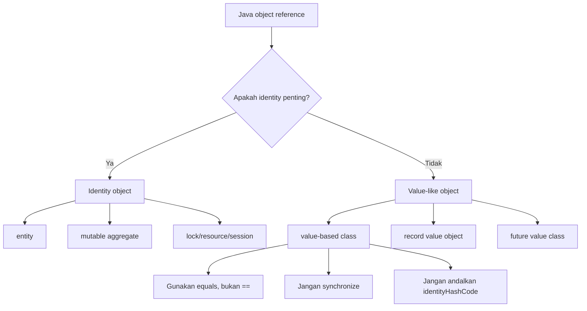
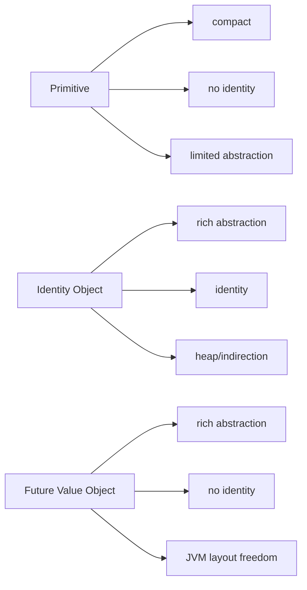
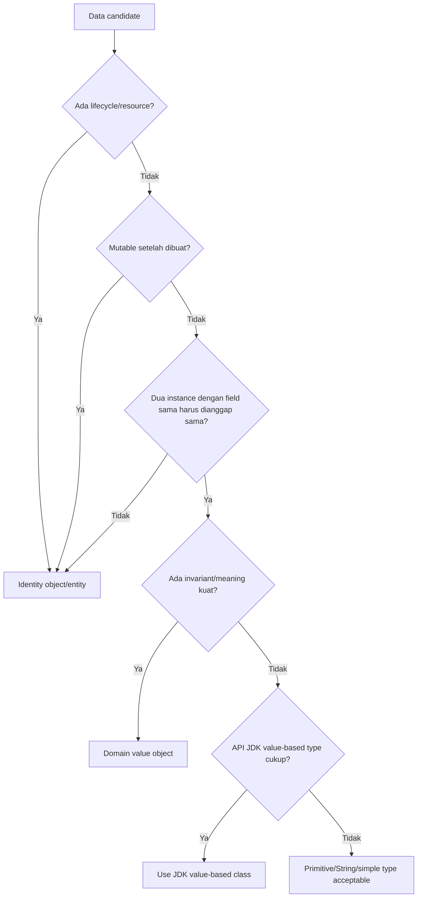

------
title: Learn Java Core Types, Data Model & Data APIs - Part 025
description: Value-based classes, identity avoidance, value semantics, wrapper/time/optional classes, synchronization hazards, and the future value model through Project Valhalla.
series: learn-java-core-types
seriesTitle: Learn Java Core Types, Data Model & Data APIs
order: 25
partTitle: Value-Based Classes and the Future Value Model
tags:
- java
- value-based-classes
- identity
- value-semantics
- wrappers
- optional
- java-time
- valhalla
- domain-modeling
date: 2026-06-27
---

# Part 025 — Value-Based Classes and the Future Value Model

> Goal: memahami perbedaan antara **identity semantics** dan **value semantics** di Java modern. Setelah bagian ini, kita bisa membaca dokumentasi `Integer`, `Optional`, `LocalDate`, `Duration`, dan class value-like lain dengan benar; menghindari bug identity; dan menyiapkan desain domain agar tidak bentrok dengan arah evolusi Java menuju value objects/value classes.

Bagian sebelumnya membahas boxing dan wrapper types. Sekarang kita naik satu level: tidak semua object Java sebaiknya diperlakukan sebagai object dengan identity penting.

Ada object yang secara domain lebih mirip angka:

```java
LocalDate a = LocalDate.of(2026, 6, 27);
LocalDate b = LocalDate.of(2026, 6, 27);

System.out.println(a.equals(b)); // true
System.out.println(a == b);      // mungkin false, dan tidak boleh dijadikan kontrak
```

Untuk object seperti ini, yang penting adalah **isi/value**, bukan “object ini instance yang mana”. Inilah area value-based classes.

---

## 1. Mental Model: Identity Object vs Value-Like Object

Di Java tradisional, semua class instance adalah object dengan identity.

```java
new Object() == new Object(); // false
```

Dua object bisa punya state sama tetapi identity berbeda.

```java
class Point {
    final int x;
    final int y;

    Point(int x, int y) {
        this.x = x;
        this.y = y;
    }
}

Point p1 = new Point(1, 2);
Point p2 = new Point(1, 2);

System.out.println(p1 == p2); // false
```

Identity object cocok ketika kita memang butuh membedakan instance:

- entity database;
- mutable aggregate;
- lock object;
- connection/session;
- actor/worker;
- cache entry dengan lifecycle;
- UI component;
- object yang punya ownership resource.

Value-like object cocok ketika instance hanya representasi nilai:

- date;
- duration;
- amount;
- coordinate;
- range;
- identifier typed value;
- optional result;
- numeric wrapper;
- immutable command snapshot;
- domain scalar.

Diagram mental:



Intinya:

> Identity object menjawab “object yang mana?”. Value-like object menjawab “nilai apa?”.

---

## 2. Apa Itu Value-Based Class?

Java platform mendokumentasikan sebagian class sebagai **value-based**. Contoh yang sering ditemui:

- primitive wrappers seperti `Integer`, `Long`, `Double`, `Boolean`;
- `Optional`, `OptionalInt`, `OptionalLong`, `OptionalDouble`;
- banyak type di `java.time`, seperti `LocalDate`, `LocalTime`, `LocalDateTime`, `Instant`, `Duration`, `Period`;
- beberapa class immutable lain di JDK.

Sebuah value-based class secara konseptual punya karakteristik berikut:

1. field instance final;
2. `equals`, `hashCode`, dan `toString` dihitung dari value, bukan identity;
3. instance yang equal dianggap substitutable;
4. tidak memakai monitor instance untuk synchronization;
5. tidak menjanjikan constructor/factory menghasilkan identity unik;
6. class final atau berada di hierarchy yang tidak menambah state identity-sensitive.

Implikasinya besar:

```java
Integer a = Integer.valueOf(1000);
Integer b = Integer.valueOf(1000);

System.out.println(a.equals(b)); // true
System.out.println(a == b);      // jangan dipakai sebagai kontrak
```

Untuk value-based class, `==` adalah smell, walaupun kadang hasilnya “kebetulan benar”.

---

## 3. Substitutability: Konsep Paling Penting

Value semantics berdiri di atas konsep substitutability.

Dua instance `x` dan `y` substitutable jika:

```java
x.equals(y) == true
```

maka menukar `x` dengan `y` tidak mengubah behavior observable program.

Contoh:

```java
LocalDate invoiceDate1 = LocalDate.of(2026, 6, 27);
LocalDate invoiceDate2 = LocalDate.parse("2026-06-27");

invoiceDate1.equals(invoiceDate2); // true
```

Kalau semua logic domain hanya bertanya “tanggalnya apa?”, dua object itu setara.

Tetapi kalau ada code seperti ini:

```java
if (invoiceDate1 == invoiceDate2) {
    audit("same date object");
}
```

maka code itu memasukkan identity ke type yang semestinya value-like. Ini bukan hanya bug hari ini, tetapi juga migrasi risk untuk masa depan.

---

## 4. Value-Based Class Bukan Primitive

Kesalahan umum: mengira value-based class sudah sama dengan primitive.

Tidak.

Pada Java biasa hari ini, value-based class tetap class biasa dari perspektif umum:

```java
Optional<String> name = Optional.of("Ayu");
Object obj = name;
```

Tetapi dokumentasi memberi aturan penggunaan:

- jangan andalkan identity;
- jangan synchronize pada instance;
- jangan butuh identity-stable object;
- perlakukan sebagai immutable value;
- gunakan factory/static constructor bila tersedia;
- gunakan `equals`, bukan `==`.

Mental model aman:

```text
value-based class = class biasa dengan kontrak pemakaian value semantics
future value class = fitur bahasa/runtime yang benar-benar mengubah model identity/layout
```

Jangan mencampur keduanya.

---

## 5. Identity-Sensitive Operations yang Harus Dihindari

Untuk value-based classes, operasi berikut harus dianggap berbahaya:

| Operation | Problem |
|---|---|
| `==` | Membandingkan reference identity, bukan logical value. |
| `System.identityHashCode(x)` | Mengambil hash identity yang semestinya tidak relevan. |
| `synchronized (x)` | Menggunakan monitor object yang tidak boleh dianggap stabil/unik. |
| `x.wait()` / `x.notify()` | Menggunakan object sebagai coordination monitor. |
| `IdentityHashMap` | Menggunakan identity semantics secara eksplisit. |
| Weak identity cache | Mengasumsikan object identity adalah resource/key stabil. |

Contoh buruk:

```java
private final Map<Optional<String>, Metadata> cache = new IdentityHashMap<>();
```

Lebih benar:

```java
private final Map<Optional<String>, Metadata> cache = new HashMap<>();
```

Namun lebih baik lagi, jangan jadikan `Optional` sebagai key domain kecuali benar-benar masuk akal. Biasanya key harus model domain eksplisit.

---

## 6. Synchronization Hazard

Jangan pernah menggunakan value-based object sebagai lock.

Buruk:

```java
Integer accountId = 42;

synchronized (accountId) {
    updateBalance();
}
```

Masalahnya:

1. `Integer` adalah wrapper/value-based usage model;
2. instance bisa berasal dari cache;
3. code lain bisa memakai instance yang sama tanpa sengaja;
4. lock tidak merepresentasikan ownership resource;
5. future runtime bisa makin agresif mengoptimalkan value-like object.

Gunakan lock object dedicated:

```java
final class AccountLock {
    private final Object monitor = new Object();

    void update() {
        synchronized (monitor) {
            updateBalance();
        }
    }

    private void updateBalance() {
        // mutation protected by monitor
    }
}
```

Atau gunakan concurrency primitive yang lebih eksplisit:

```java
private final ReentrantLock lock = new ReentrantLock();
```

Rule:

> Lock harus identity object yang ownership-nya jelas. Value object tidak boleh menjadi lock.

---

## 7. Wrapper Types sebagai Value-Based-Like Usage Model

Primitive wrappers punya banyak jebakan karena berada di boundary primitive/object.

```java
Integer a = 128;
Integer b = 128;

System.out.println(a == b);      // false pada banyak runtime scenario
System.out.println(a.equals(b)); // true
```

Untuk beberapa nilai kecil, wrapper cache bisa membuat `==` terlihat benar:

```java
Integer x = 10;
Integer y = 10;

System.out.println(x == y); // true karena cache, tetapi jangan dijadikan kontrak domain
```

Engineer pemula belajar “Integer cache range”. Engineer matang belajar aturan lebih penting:

> Jangan pakai `==` untuk wrapper object kecuali membandingkan dengan `null`.

```java
Integer count = readCount();

if (count == null) {
    return 0;
}

if (count.equals(42)) {
    // ok
}
```

Atau unbox secara eksplisit setelah null handling:

```java
int safeCount = count == null ? 0 : count;
```

---

## 8. Optional sebagai Value-Based Class

`Optional<T>` harus diperlakukan sebagai container value, bukan object dengan identity.

Benar:

```java
Optional<String> displayName = user.displayName();

displayName.ifPresent(System.out::println);
```

Buruk:

```java
if (displayName == Optional.empty()) {
    // jangan lakukan ini
}
```

Benar:

```java
if (displayName.isEmpty()) {
    // no value
}
```

`Optional.empty()` mungkin mengembalikan singleton hari ini, tetapi caller tidak perlu dan tidak boleh bergantung pada identity itu.

### Optional bukan field default

Sering ada code seperti ini:

```java
record User(Optional<String> middleName) {}
```

Ini kadang acceptable untuk API internal, tetapi untuk domain model yang serius sering kurang ideal. Kenapa?

- `Optional` adalah return-type communication tool;
- field/domain sering lebih jelas dengan invariant eksplisit;
- serialization/ORM/framework kadang kurang natural;
- nested optional membuat model sulit dibaca;
- `Optional` sendiri bisa `null` jika boundary buruk.

Alternatif domain:

```java
record MiddleName(String value) {
    MiddleName {
        if (value == null || value.isBlank()) {
            throw new IllegalArgumentException("middle name must be non-blank");
        }
    }
}

record User(String firstName, String lastName, MiddleName middleNameOrNull) {}
```

Atau gunakan sealed model bila absence punya makna bisnis:

```java
sealed interface MiddleName permits MiddleName.Present, MiddleName.Absent {
    record Present(String value) implements MiddleName {
        public Present {
            if (value == null || value.isBlank()) {
                throw new IllegalArgumentException("value must be non-blank");
            }
        }
    }

    enum Absent implements MiddleName {
        INSTANCE
    }
}
```

Ini lebih verbose, tetapi lebih defensible ketika absence bukan sekadar “tidak ada string”.

---

## 9. java.time sebagai Model Value Semantics

Type `java.time` adalah contoh value-based API yang sangat baik.

```java
LocalDate start = LocalDate.of(2026, 1, 1);
LocalDate end = start.plusDays(30);
```

`plusDays` tidak mengubah `start`; ia menghasilkan value baru.

```java
System.out.println(start); // 2026-01-01
System.out.println(end);   // 2026-01-31
```

Mental model:

```text
LocalDate = calendar date value
Instant = timeline point value
Duration = machine-time amount value
Period = human calendar amount value
```

Value semantics membuat API time lebih aman:

- tidak ada mutation tersembunyi seperti legacy `Date`/`Calendar`;
- method chaining aman;
- sharing antar thread aman secara state;
- equality berbasis value;
- transformation menghasilkan value baru.

Tetapi tetap jangan pakai identity:

```java
LocalDate a = LocalDate.now();
LocalDate b = LocalDate.parse(a.toString());

if (a == b) {        // salah
    // ...
}

if (a.equals(b)) {   // benar
    // ...
}
```

---

## 10. Records vs Value-Based Classes

Record bukan otomatis value-based class.

Record memberi:

- final class;
- final fields untuk components;
- generated accessor;
- generated `equals`, `hashCode`, `toString`;
- transparent data carrier contract.

Tetapi record tetap punya identity dalam Java saat ini.

```java
record Point(int x, int y) {}

Point p1 = new Point(1, 2);
Point p2 = new Point(1, 2);

System.out.println(p1.equals(p2)); // true
System.out.println(p1 == p2);      // false
```

Jadi record adalah **value-object-friendly syntax**, bukan runtime value object.

Gunakan record untuk membuat domain value object yang siap secara semantic:

```java
record MoneyAmount(BigDecimal amount, Currency currency) {
    MoneyAmount {
        amount = amount.stripTrailingZeros();
        if (amount.signum() < 0) {
            throw new IllegalArgumentException("amount must be non-negative");
        }
        if (currency == null) {
            throw new NullPointerException("currency");
        }
    }
}
```

Tetapi tetap:

```java
money1.equals(money2); // yes
money1 == money2;      // no
```

---

## 11. Value Object dalam Domain Modeling

Dalam domain-driven design, “value object” biasanya berarti object yang equality-nya ditentukan oleh value, bukan identity.

Java value-based class adalah konsep platform/JDK. Domain value object adalah konsep desain.

Keduanya selaras tetapi tidak identik.

Contoh domain value object:

```java
record CaseNumber(String value) {
    CaseNumber {
        if (value == null || !value.matches("CASE-[0-9]{8}")) {
            throw new IllegalArgumentException("invalid case number: " + value);
        }
    }
}
```

Contoh penggunaan:

```java
record EnforcementCase(CaseNumber caseNumber, CaseStatus status) {}
```

Kenapa bukan `String caseNumber`?

Karena `String` terlalu umum. `CaseNumber` membawa:

- validation;
- domain meaning;
- type safety;
- equality semantics;
- formatting boundary;
- future migration path.

Decision rule:

| Data | Better model |
|---|---|
| raw input belum divalidasi | `String` / DTO field |
| sudah validated domain ID | typed value object |
| entity identity | entity id + entity lifecycle |
| numeric amount | domain scalar, not naked `BigDecimal` everywhere |
| status finite set | enum/sealed type |

---

## 12. Jangan Membuat Semua Hal Menjadi Value Object

Over-modeling juga buruk.

Contoh terlalu berat:

```java
record FirstName(String value) {}
record LastName(String value) {}
record EmailSubject(String value) {}
record CommentText(String value) {}
```

Ini bisa benar dalam domain tertentu, tetapi bisa juga membuat code noisy.

Gunakan typed value object ketika minimal satu hal ini benar:

1. ada invariant kuat;
2. ada format eksternal yang harus distabilkan;
3. ada risiko tertukar dengan type lain;
4. ada behavior domain kecil;
5. sering menjadi key/map/index;
6. dipakai lintas boundary service;
7. kesalahan nilainya mahal.

Contoh layak:

```java
record AccountId(UUID value) {}
record CaseNumber(String value) {}
record Percentage(BigDecimal value) {}
record Money(BigDecimal amount, Currency currency) {}
record TimeWindow(Instant startInclusive, Instant endExclusive) {}
```

Contoh mungkin cukup `String`:

```java
record SearchRequest(String freeText) {}
```

Jika freeText hanya diteruskan ke query builder dengan escaping jelas, wrapper tambahan mungkin tidak memberi banyak nilai.

---

## 13. Value-Based Class dan Collections

Value-like object sangat cocok menjadi key collection bila `equals/hashCode` stabil.

```java
Map<LocalDate, List<Invoice>> invoicesByDate = new HashMap<>();
```

Aman karena `LocalDate` immutable dan equality stabil.

Domain value record juga aman jika komponennya immutable:

```java
record CustomerId(UUID value) {}

Map<CustomerId, CustomerProfile> profiles = new HashMap<>();
```

Bahaya muncul jika value object menyimpan mutable component:

```java
record Tags(List<String> values) {}

Tags tags = new Tags(new ArrayList<>(List.of("urgent")));
Map<Tags, String> map = new HashMap<>();
map.put(tags, "x");

tags.values().add("late"); // hashCode berubah
```

Perbaikan:

```java
record Tags(List<String> values) {
    Tags {
        values = List.copyOf(values);
    }
}
```

Rule:

> Value object yang menjadi map key harus deeply stable untuk field yang ikut equality/hashCode.

---

## 14. Value-Based Class dan Serialization Boundary

Value semantics harus tetap jelas saat data keluar-masuk sistem.

Contoh:

```java
record Price(BigDecimal amount, Currency currency) {}
```

Pertanyaan boundary:

- apakah amount dikirim sebagai number atau string?
- apakah scale dipertahankan?
- apakah currency ISO code?
- apakah rounding terjadi sebelum atau sesudah serialization?
- apakah equality domain menganggap `1.0` sama dengan `1.00`?

Masalah value object sering bukan di Java-nya, tetapi di boundary representation.

Contoh DTO eksplisit:

```java
record PriceJson(String amount, String currency) {}
```

Mapper:

```java
final class PriceMapper {
    static Price toDomain(PriceJson json) {
        return new Price(new BigDecimal(json.amount()), Currency.getInstance(json.currency()));
    }

    static PriceJson toJson(Price price) {
        return new PriceJson(price.amount().toPlainString(), price.currency().getCurrencyCode());
    }
}
```

Prinsip:

> Domain value object boleh presisi; DTO harus stabil untuk external contract.

---

## 15. Future Value Model: Project Valhalla

Project Valhalla adalah usaha OpenJDK untuk membawa model value yang lebih dalam ke Java: class-like abstraction dengan potensi footprint/performance primitive-like.

Namun saat menulis production code, pisahkan tiga level:

| Level | Status mental model |
|---|---|
| Value object concept | Design concept yang bisa dipakai sekarang. |
| Value-based classes | Kontrak JDK yang sudah ada untuk class tertentu. |
| Value classes / primitive classes future | Fitur evolusioner/preview/draft tergantung JDK dan JEP. |

Jangan menulis materi production seolah semua fitur Valhalla sudah final untuk semua runtime.

Yang penting untuk kita hari ini adalah migration mindset:

- jangan andalkan identity untuk object value-like;
- jangan synchronize pada value-based instances;
- biasakan factory method;
- buat value object immutable;
- hindari public mutable state;
- override equality secara value-based bila perlu;
- jangan menyimpan resource/lifecycle di value object;
- pisahkan entity dari value.

---

## 16. Bagaimana Value Classes Akan Mengubah Cara Berpikir?

Secara konseptual, future value classes ingin memberi class yang:

- tidak punya identity unik seperti object biasa;
- equality bisa statewise;
- immutable/interchangeable;
- bisa dioptimalkan layout-nya oleh JVM;
- bisa mengurangi allocation/indirection;
- tetap punya method dan abstraction seperti class.

Ini menjembatani gap:

```text
primitive: cepat, compact, no identity, tetapi poor abstraction
object: expressive, identity, nullable, allocation/indirection
future value class: expressive + no identity + optimizable layout
```

Diagram:



Tetapi future model tidak menghapus kebutuhan desain domain. Ia justru menghukum desain yang selama ini salah:

- lock pada wrapper;
- `==` pada value object;
- identity-based cache untuk value;
- mutable state dalam value object;
- equality yang tidak stabil;
- constructor yang menjanjikan uniqueness.

---

## 17. Migration-Friendly Value Object Design

Jika ingin class domain siap terhadap arah value model, gunakan aturan berikut.

### 17.1 Jadikan State Final

```java
public final class Percentage {
    private final BigDecimal value;

    private Percentage(BigDecimal value) {
        this.value = value;
    }
}
```

### 17.2 Gunakan Factory Method

```java
public static Percentage of(BigDecimal value) {
    return new Percentage(normalize(value));
}
```

Factory memberi ruang:

- validation;
- normalization;
- caching;
- canonicalization;
- migration;
- hiding constructor.

### 17.3 Hindari Identity Contract

Jangan dokumentasikan:

```text
Each call returns a unique instance.
```

Lebih baik:

```text
Returns an instance representing the given percentage.
```

### 17.4 Jangan Expose Mutable Components

```java
public final class Snapshot {
    private final List<String> events;

    public Snapshot(List<String> events) {
        this.events = List.copyOf(events);
    }

    public List<String> events() {
        return events;
    }
}
```

### 17.5 Equality Berdasarkan State Stabil

```java
@Override
public boolean equals(Object o) {
    return o instanceof Percentage other
            && value.compareTo(other.value) == 0;
}

@Override
public int hashCode() {
    return value.stripTrailingZeros().hashCode();
}
```

Jika equality memakai `compareTo` untuk BigDecimal, hashCode harus mengikuti normalization yang sama.

---

## 18. Canonicalization vs Identity

Canonicalization adalah memilih representasi tunggal untuk value yang secara domain sama.

Contoh:

```java
record NormalizedEmail(String value) {
    NormalizedEmail {
        value = value.trim().toLowerCase(Locale.ROOT);
        if (!value.contains("@")) {
            throw new IllegalArgumentException("invalid email");
        }
    }
}
```

Sekarang:

```java
new NormalizedEmail("A@EXAMPLE.COM").equals(new NormalizedEmail("a@example.com")); // true
```

Canonicalization bukan berarti object identity sama.

```java
new NormalizedEmail("A@EXAMPLE.COM") == new NormalizedEmail("a@example.com"); // false
```

Canonicalization menjamin representasi value, bukan reference.

Jika ingin interning/cache, lakukan hati-hati:

```java
final class CurrencyCode {
    private static final ConcurrentMap<String, CurrencyCode> CACHE = new ConcurrentHashMap<>();

    private final String value;

    private CurrencyCode(String value) {
        this.value = value;
    }

    static CurrencyCode of(String raw) {
        String normalized = raw.trim().toUpperCase(Locale.ROOT);
        return CACHE.computeIfAbsent(normalized, CurrencyCode::new);
    }
}
```

Tetapi meski cache membuat `==` kadang benar, API tetap harus menjanjikan value equality, bukan identity equality.

---

## 19. Value Object, Security, dan Sensitive Data

Tidak semua immutable data aman dijadikan value-like tanpa pikir.

Contoh:

```java
record SecretToken(String value) {}
```

Masalah:

- `toString` record bisa membocorkan token;
- `equals` bisa timing-sensitive dalam konteks tertentu;
- string immutable sulit dihapus dari memory;
- logs bisa membawa value rahasia;
- serialization bisa membocorkan representasi.

Untuk sensitive value, jangan asal pakai record default.

```java
final class SecretToken {
    private final String value;

    private SecretToken(String value) {
        this.value = Objects.requireNonNull(value);
    }

    static SecretToken of(String value) {
        return new SecretToken(value);
    }

    boolean matches(String candidate) {
        return MessageDigest.isEqual(
                value.getBytes(StandardCharsets.UTF_8),
                candidate.getBytes(StandardCharsets.UTF_8)
        );
    }

    @Override
    public String toString() {
        return "SecretToken[redacted]";
    }
}
```

Value semantics bukan alasan untuk expose semua state.

---

## 20. Failure Modes

### 20.1 Menggunakan `==` pada Wrapper

```java
Integer a = 1000;
Integer b = 1000;

if (a == b) {
    // unpredictable expectation
}
```

Perbaikan:

```java
if (Objects.equals(a, b)) {
    // ok
}
```

### 20.2 Mengunci pada Value-Based Object

```java
synchronized (LocalDate.now()) {
    // meaningless lock
}
```

Perbaikan:

```java
private final Object monitor = new Object();
```

### 20.3 Record dengan Mutable Component

```java
record RuleSet(List<String> rules) {}
```

Perbaikan:

```java
record RuleSet(List<String> rules) {
    RuleSet {
        rules = List.copyOf(rules);
    }
}
```

### 20.4 BigDecimal Equality Salah untuk Domain

```java
new BigDecimal("1.0").equals(new BigDecimal("1.00")); // false
```

Perbaikan domain:

```java
record Amount(BigDecimal value) {
    Amount {
        value = value.stripTrailingZeros();
    }
}
```

### 20.5 Optional sebagai Identity Sentinel

```java
if (result == Optional.empty()) {
    // wrong
}
```

Perbaikan:

```java
if (result.isEmpty()) {
    // ok
}
```

---

## 21. Decision Framework: Apakah Ini Value Object?

Gunakan pertanyaan berikut.



Contoh keputusan:

| Candidate | Decision | Reason |
|---|---|---|
| `LocalDate birthDate` | JDK value-based | Type sudah tepat, immutable, value semantics. |
| `String caseNumber` | Domain value object | Ada format dan meaning domain. |
| `BigDecimal amount` | Biasanya domain value object | Perlu currency, scale, rounding. |
| `Connection` | Identity object | Resource/lifecycle. |
| `User` aggregate | Entity | Identity dan lifecycle penting. |
| `SearchText` | Depends | Kalau hanya raw query, wrapper bisa overkill. |

---

## 22. Production Checklist

Gunakan checklist ini saat review PR.

### Identity

- Apakah `==` dipakai pada wrapper, `Optional`, `LocalDate`, atau value-like object?
- Apakah `IdentityHashMap` dipakai tanpa alasan eksplisit?
- Apakah `System.identityHashCode` muncul di domain logic?

### Synchronization

- Apakah lock memakai wrapper/string/date/optional?
- Apakah monitor object dedicated?
- Apakah lock ownership jelas?

### Equality

- Apakah value object override `equals/hashCode` dengan konsisten?
- Apakah `BigDecimal` equality sesuai domain?
- Apakah mutable component ikut equality?

### Mutability

- Apakah record menyimpan `List`, `Map`, array, atau mutable object?
- Apakah constructor melakukan defensive copy?
- Apakah accessor membocorkan mutable reference?

### Boundary

- Apakah DTO dan domain value object dipisah?
- Apakah serialization format stabil?
- Apakah sensitive value aman dari `toString`/log?

### Future-readiness

- Apakah class immutable dan final bila value-like?
- Apakah constructor bisa dibuat private/factory?
- Apakah dokumentasi tidak menjanjikan unique identity?

---

## 23. Practice Drill

### Drill 1 — Refactor Wrapper Identity Bug

Ubah code berikut agar aman:

```java
final class RetryPolicy {
    private final Integer maxRetries;

    RetryPolicy(Integer maxRetries) {
        this.maxRetries = maxRetries;
    }

    boolean isDefault() {
        return maxRetries == 3;
    }
}
```

Target:

- handle null eksplisit;
- hindari wrapper identity;
- pilih primitive jika absence tidak valid.

Kemungkinan solusi:

```java
final class RetryPolicy {
    private final int maxRetries;

    RetryPolicy(int maxRetries) {
        if (maxRetries < 0) {
            throw new IllegalArgumentException("maxRetries must be non-negative");
        }
        this.maxRetries = maxRetries;
    }

    boolean isDefault() {
        return maxRetries == 3;
    }
}
```

### Drill 2 — Buat Domain Value Object

Buat `CaseNumber` dengan invariant:

- format `CASE-YYYY-NNNNNN`;
- uppercase;
- trim input;
- equality berdasarkan normalized string;
- `toString` aman untuk log.

Skeleton:

```java
public record CaseNumber(String value) {
    private static final Pattern PATTERN = Pattern.compile("CASE-[0-9]{4}-[0-9]{6}");

    public CaseNumber {
        value = Objects.requireNonNull(value).trim().toUpperCase(Locale.ROOT);
        if (!PATTERN.matcher(value).matches()) {
            throw new IllegalArgumentException("invalid case number: " + value);
        }
    }
}
```

### Drill 3 — Mutability Trap

Temukan bug:

```java
record DateRange(LocalDate start, LocalDate end, List<String> labels) {}
```

Perbaiki:

```java
record DateRange(LocalDate start, LocalDate end, List<String> labels) {
    DateRange {
        Objects.requireNonNull(start);
        Objects.requireNonNull(end);
        if (!start.isBefore(end)) {
            throw new IllegalArgumentException("start must be before end");
        }
        labels = List.copyOf(labels);
    }
}
```

---

## 24. Review Questions

1. Apa perbedaan identity object, domain value object, value-based class, dan future value class?
2. Mengapa `==` berbahaya pada `Integer`, `Optional`, dan `LocalDate`?
3. Mengapa lock harus memakai identity object dedicated?
4. Apakah record otomatis value-based class?
5. Apa risiko record dengan mutable component?
6. Kapan `String` cukup dan kapan perlu typed value object?
7. Bagaimana membuat value object migration-friendly terhadap future Java?
8. Apa yang salah dari `Optional.empty() == optional`?
9. Bagaimana `BigDecimal` memengaruhi equality value object?
10. Mengapa sensitive value tidak selalu cocok memakai record default?

---

## 25. Key Takeaways

- Value semantics berarti value lebih penting daripada object identity.
- Value-based classes adalah class JDK dengan kontrak penggunaan value-like; jangan perlakukan sebagai lock atau identity key.
- `equals` adalah operasi utama untuk value-like object; `==` hanya untuk primitive dan null check pada reference.
- Record membantu membuat data carrier/value object, tetapi record tetap identity object pada Java biasa.
- Value object domain harus immutable, invariant-rich, dan equality-stable.
- Project Valhalla memperkuat arah Java ke value model, tetapi production code harus membedakan fitur stabil dari preview/draft/future.
- Desain yang tidak bergantung pada identity lebih aman, lebih mudah dites, dan lebih siap terhadap evolusi Java.

---

## 26. References

- Java SE 25 API — Value-based Classes: `https://docs.oracle.com/en/java/javase/25/docs/api/java.base/java/lang/doc-files/ValueBased.html`
- Java SE 25 API — `Optional`: `https://docs.oracle.com/en/java/javase/25/docs/api/java.base/java/util/Optional.html`
- Java SE 25 API — `LocalDate`: `https://docs.oracle.com/en/java/javase/25/docs/api/java.base/java/time/LocalDate.html`
- JEP 390 — Warnings for Value-Based Classes: `https://openjdk.org/jeps/390`
- OpenJDK Project Valhalla: `https://openjdk.org/projects/valhalla/`
- JEP 401 — Value Classes and Objects: `https://openjdk.org/jeps/401`
