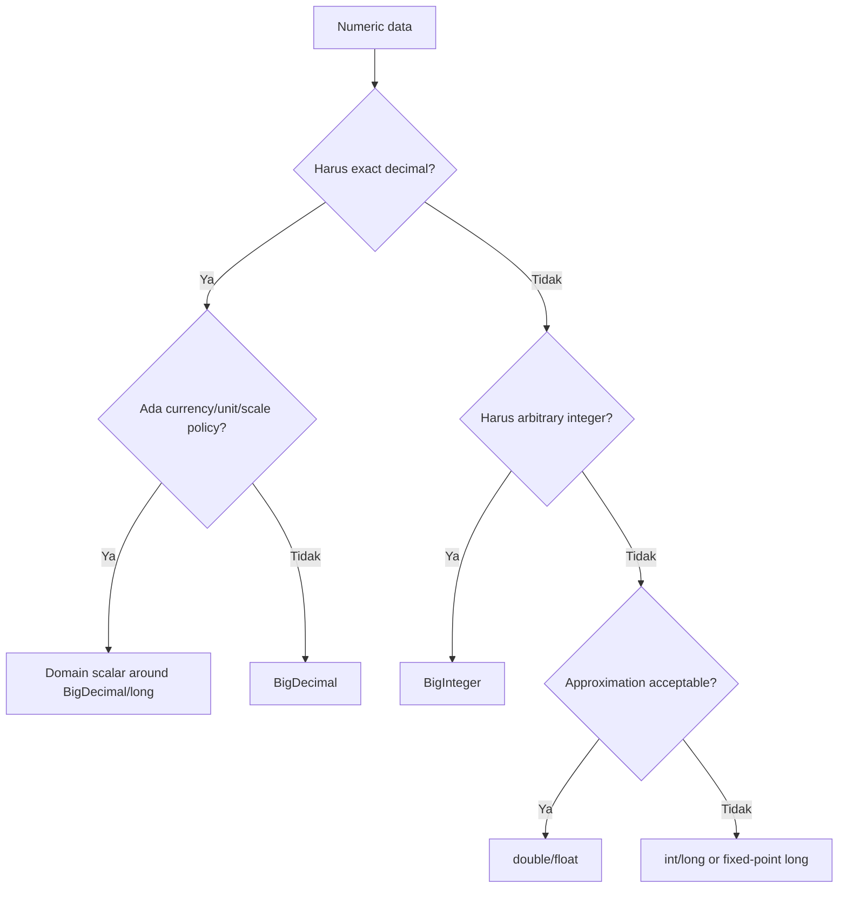

------
title: Learn Java Core Types, Data Model & Data APIs - Part 026
description: BigDecimal, BigInteger, arbitrary precision, scale, precision, rounding, money modeling, domain scalar design, equality pitfalls, and production numeric discipline.
series: learn-java-core-types
seriesTitle: Learn Java Core Types, Data Model & Data APIs
order: 26
partTitle: BigDecimal, BigInteger, Money, and Precision
tags:
- java
- bigdecimal
- biginteger
- money
- precision
- rounding
- mathcontext
- domain-modeling
- finance
date: 2026-06-27
---

# Part 026 — BigDecimal, BigInteger, Money, and Precision

> Goal: memahami kapan primitive numeric tidak cukup, bagaimana `BigDecimal` dan `BigInteger` benar-benar bekerja, dan bagaimana mendesain amount/money/quantity/ratio secara aman untuk production. Setelah bagian ini, kita tidak hanya tahu “pakai BigDecimal untuk uang”, tetapi tahu **bagaimana** memakai `BigDecimal` tanpa membuat bug scale, equality, rounding, serialization, dan aggregation.

Di Part 005 dan Part 006 kita sudah membahas integer dan floating-point. Ringkasnya:

- `int`/`long` cepat tetapi punya batas range dan overflow;
- `float`/`double` cepat tetapi binary floating-point tidak cocok untuk decimal-exact domain seperti uang;
- `BigInteger` memberi arbitrary-precision integer;
- `BigDecimal` memberi arbitrary-precision signed decimal dengan scale.

Masalahnya, banyak codebase “sudah pakai BigDecimal” tetapi tetap salah.

Contoh:

```java
new BigDecimal(0.1);      // buruk untuk decimal literal
new BigDecimal("0.1");    // benar

new BigDecimal("1.0").equals(new BigDecimal("1.00"));    // false
new BigDecimal("1.0").compareTo(new BigDecimal("1.00")); // 0
```

Top engineer memahami perbedaan value, representation, rounding policy, dan domain invariant.

---

## 1. Mental Model: Numeric Data Bukan Satu Jenis

Sebelum memilih type, tanya: angka ini merepresentasikan apa?

| Domain | Contoh | Type kandidat |
|---|---:|---|
| count kecil | retry count, page size | `int` |
| count besar | total events, bytes processed | `long` |
| unbounded integer | cryptography, combinatorics | `BigInteger` |
| approximate measurement | telemetry, ML score, geometry | `double` |
| decimal exact | money, tax, interest rate | `BigDecimal` |
| fixed minor unit | cents, basis points | `long` + domain wrapper |
| finite category | risk level | `enum` |
| ratio/percentage | 12.5%, 0.125 | domain scalar around `BigDecimal` |

Decision diagram:



Rule:

> Pilihan numeric type adalah keputusan domain, bukan keputusan syntax.

---

## 2. BigInteger: Arbitrary-Precision Integer

`BigInteger` merepresentasikan integer dengan precision yang tidak dibatasi oleh 32-bit/64-bit primitive.

```java
BigInteger a = new BigInteger("9223372036854775808");
BigInteger b = BigInteger.TWO;

BigInteger result = a.multiply(b);
```

Kapan memakai `BigInteger`:

- nilai bisa melebihi `long`;
- operasi integer harus exact;
- cryptography/modular arithmetic;
- combinatorics/factorial;
- arbitrary precision IDs dari external system;
- bit manipulation skala besar;
- database numeric integer tanpa batas aman di Java primitive.

Kapan tidak perlu:

- counter biasa;
- ID database yang dijamin 64-bit;
- timestamp epoch;
- jumlah item bounded;
- hot path yang butuh performa dan range `long` cukup.

---

## 3. BigInteger Bukan Primitive Besar Saja

`BigInteger` immutable.

```java
BigInteger x = BigInteger.TEN;
x.add(BigInteger.ONE);

System.out.println(x); // 10
```

Harus assign hasilnya:

```java
x = x.add(BigInteger.ONE);
```

Ini mirip `String`, `LocalDate`, dan value-like API lain.

### 3.1 Operasi dasar

```java
BigInteger a = new BigInteger("100000000000000000000");
BigInteger b = new BigInteger("3");

BigInteger sum = a.add(b);
BigInteger diff = a.subtract(b);
BigInteger product = a.multiply(b);
BigInteger quotient = a.divide(b);
BigInteger remainder = a.remainder(b);
BigInteger[] qr = a.divideAndRemainder(b);
```

### 3.2 Exact conversion

Jangan asal:

```java
long value = big.longValue(); // bisa truncate
```

Gunakan exact conversion jika overflow harus terdeteksi:

```java
long value = big.longValueExact();
```

Jika tidak muat, method exact akan throw `ArithmeticException`.

### 3.3 Sign dan compare

```java
if (amount.signum() < 0) {
    throw new IllegalArgumentException("negative amount");
}

if (a.compareTo(b) > 0) {
    // a > b
}
```

Jangan gunakan `equals` untuk ordering.

---

## 4. BigInteger Performance Reality

`BigInteger` arbitrary precision berarti cost tergantung ukuran angka.

```java
BigInteger huge = BigInteger.TEN.pow(1_000_000);
```

Operasi pada angka besar bisa mahal dari sisi CPU dan memory.

Production implication:

- jangan menerima numeric input arbitrarily large tanpa limit;
- validasi length string sebelum parsing;
- batasi exponent/power;
- hati-hati pada API public yang menerima `BigInteger` dari user;
- jangan gunakan `BigInteger` sebagai default “biar aman” di hot path.

Contoh guard:

```java
static BigInteger parseBoundedInteger(String raw, int maxDigits) {
    String normalized = raw.trim();
    if (normalized.length() > maxDigits) {
        throw new IllegalArgumentException("too many digits");
    }
    return new BigInteger(normalized);
}
```

---

## 5. BigDecimal: Value = Unscaled Value × 10^-Scale

`BigDecimal` bukan hanya “angka decimal”. Ia adalah pasangan:

```text
unscaled value + scale
```

Formula:

```text
value = unscaledValue × 10^(-scale)
```

Contoh:

| BigDecimal string | unscaled value | scale | numeric value |
|---|---:|---:|---:|
| `"123"` | 123 | 0 | 123 |
| `"12.3"` | 123 | 1 | 12.3 |
| `"1.23"` | 123 | 2 | 1.23 |
| `"0.0123"` | 123 | 4 | 0.0123 |
| `"1.2300"` | 12300 | 4 | 1.2300 |

Code:

```java
BigDecimal x = new BigDecimal("1.2300");

System.out.println(x.unscaledValue()); // 12300
System.out.println(x.scale());         // 4
System.out.println(x.precision());     // 5
```

`scale` adalah bagian representasi, bukan hanya formatting.

---

## 6. BigDecimal Construction Rules

### 6.1 Gunakan String untuk decimal literal

Buruk:

```java
BigDecimal x = new BigDecimal(0.1);
```

Karena `0.1` sudah lebih dulu menjadi binary floating-point approximation sebelum masuk ke constructor.

Benar:

```java
BigDecimal x = new BigDecimal("0.1");
```

Atau:

```java
BigDecimal x = BigDecimal.valueOf(0.1);
```

`valueOf(double)` menggunakan canonical string representation dari double, sehingga biasanya lebih sesuai daripada constructor `new BigDecimal(double)`. Namun untuk domain money, string eksplisit atau integer minor unit biasanya lebih defensible.

### 6.2 Gunakan constants

```java
BigDecimal zero = BigDecimal.ZERO;
BigDecimal one = BigDecimal.ONE;
BigDecimal ten = BigDecimal.TEN;
BigDecimal two = BigDecimal.TWO;
```

### 6.3 Parse external decimal sebagai string

DTO:

```java
record AmountJson(String amount) {}
```

Mapper:

```java
static BigDecimal parseAmount(AmountJson json) {
    return new BigDecimal(json.amount());
}
```

Jangan pakai JSON number untuk amount financial lintas bahasa jika precision/scale harus stabil. Banyak parser/runtime akan melewati binary double atau punya batas precision berbeda.

---

## 7. Scale, Precision, dan MathContext

### 7.1 Scale

Scale = jumlah digit di kanan decimal point jika non-negative.

```java
new BigDecimal("12.30").scale(); // 2
new BigDecimal("12").scale();    // 0
```

Scale negatif mungkin ada:

```java
BigDecimal x = new BigDecimal("1E+3");
System.out.println(x.scale()); // -3
```

### 7.2 Precision

Precision = jumlah digit signifikan.

```java
new BigDecimal("123.45").precision(); // 5
new BigDecimal("0.00123").precision(); // 3
```

### 7.3 MathContext

`MathContext` mengontrol precision dan rounding mode untuk operasi.

```java
MathContext mc = new MathContext(3, RoundingMode.HALF_UP);

BigDecimal result = new BigDecimal("10").divide(new BigDecimal("3"), mc);
System.out.println(result); // 3.33
```

Tanpa rounding policy, beberapa operasi exact bisa gagal:

```java
new BigDecimal("1").divide(new BigDecimal("3")); // ArithmeticException
```

Perbaikan:

```java
BigDecimal third = new BigDecimal("1")
        .divide(new BigDecimal("3"), 10, RoundingMode.HALF_EVEN);
```

---

## 8. RoundingMode: Policy, Bukan Detail Teknis

Rounding bukan “pilih mana yang enak”. Rounding adalah kebijakan domain.

Beberapa mode umum:

| Mode | Intuisi | Contoh penggunaan |
|---|---|---|
| `HALF_UP` | .5 naik | common business rounding |
| `HALF_EVEN` | .5 ke tetangga genap | mengurangi bias akumulasi, banking-style |
| `DOWN` | menuju nol | truncation eksplisit |
| `UP` | menjauh dari nol | conservative over-estimation |
| `FLOOR` | menuju negatif infinity | tax/threshold tertentu |
| `CEILING` | menuju positif infinity | minimum charge tertentu |
| `UNNECESSARY` | harus exact | validasi tidak boleh rounding |

Contoh:

```java
BigDecimal tax = net.multiply(rate)
        .setScale(2, RoundingMode.HALF_UP);
```

Lebih baik bungkus policy:

```java
final class MoneyRounding {
    static final int MONEY_SCALE = 2;
    static final RoundingMode MONEY_ROUNDING = RoundingMode.HALF_EVEN;

    static BigDecimal toMoneyScale(BigDecimal value) {
        return value.setScale(MONEY_SCALE, MONEY_ROUNDING);
    }
}
```

Jangan sebar `setScale(2, HALF_UP)` di 50 tempat.

---

## 9. BigDecimal Equality Trap

Ini salah satu jebakan Java paling mahal.

```java
BigDecimal a = new BigDecimal("1.0");
BigDecimal b = new BigDecimal("1.00");

System.out.println(a.compareTo(b)); // 0
System.out.println(a.equals(b));    // false
```

Kenapa?

- `compareTo` membandingkan numeric value;
- `equals` membandingkan numeric value **dan representation/scale**.

Implikasi collection:

```java
Set<BigDecimal> hashSet = new HashSet<>();
hashSet.add(new BigDecimal("1.0"));
hashSet.add(new BigDecimal("1.00"));

System.out.println(hashSet.size()); // 2
```

Tetapi:

```java
Set<BigDecimal> treeSet = new TreeSet<>();
treeSet.add(new BigDecimal("1.0"));
treeSet.add(new BigDecimal("1.00"));

System.out.println(treeSet.size()); // 1
```

Karena `TreeSet` menggunakan ordering (`compareTo`) untuk uniqueness.

### 9.1 Solusi: Normalisasi Domain

```java
record DecimalAmount(BigDecimal value) {
    DecimalAmount {
        value = value.stripTrailingZeros();
    }
}
```

Tetapi hati-hati:

```java
new BigDecimal("1000").stripTrailingZeros(); // bisa menjadi 1E+3 dengan scale negatif
```

Jika output format harus fixed scale, gunakan `setScale`.

```java
record MoneyAmount(BigDecimal value) {
    private static final int SCALE = 2;

    MoneyAmount {
        value = value.setScale(SCALE, RoundingMode.UNNECESSARY);
    }
}
```

`UNNECESSARY` berarti constructor menolak value yang tidak sudah valid scale-nya.

---

## 10. Money: Jangan Hanya BigDecimal

`BigDecimal` merepresentasikan decimal number. Money butuh lebih dari decimal number.

Minimal money biasanya butuh:

- amount;
- currency;
- scale policy;
- rounding policy;
- arithmetic rules;
- formatting rules;
- comparison rule;
- serialization rule.

Buruk:

```java
BigDecimal price = new BigDecimal("10.00");
```

Lebih baik:

```java
record Money(BigDecimal amount, Currency currency) {
    Money {
        amount = Objects.requireNonNull(amount, "amount");
        currency = Objects.requireNonNull(currency, "currency");
        amount = amount.setScale(currency.getDefaultFractionDigits(), RoundingMode.UNNECESSARY);
    }
}
```

Namun ini masih terlalu sederhana untuk currency tertentu:

- beberapa currency punya non-standard cash rounding;
- crypto/token punya scale lain;
- tax calculation bisa butuh intermediate precision lebih tinggi;
- historical currency fraction digits bisa berubah;
- accounting policy bisa berbeda dari display policy.

Jadi `Currency.getDefaultFractionDigits()` boleh jadi default awal, bukan hukum universal.

---

## 11. Money Arithmetic

Money arithmetic harus menjaga currency.

```java
record Money(BigDecimal amount, Currency currency) {
    Money {
        amount = Objects.requireNonNull(amount);
        currency = Objects.requireNonNull(currency);
    }

    Money add(Money other) {
        requireSameCurrency(other);
        return new Money(amount.add(other.amount), currency);
    }

    Money subtract(Money other) {
        requireSameCurrency(other);
        return new Money(amount.subtract(other.amount), currency);
    }

    Money multiply(BigDecimal factor, RoundingMode roundingMode) {
        int scale = currency.getDefaultFractionDigits();
        return new Money(amount.multiply(factor).setScale(scale, roundingMode), currency);
    }

    private void requireSameCurrency(Money other) {
        if (!currency.equals(other.currency)) {
            throw new IllegalArgumentException("currency mismatch: " + currency + " vs " + other.currency);
        }
    }
}
```

Jangan lakukan:

```java
BigDecimal total = usdAmount.add(eurAmount); // meaningless
```

Kalau lintas currency, domain harus eksplisit:

```java
interface FxRateProvider {
    Money convert(Money source, Currency targetCurrency, Instant at);
}
```

---

## 12. Minor Unit Representation: long Cents

Untuk beberapa sistem financial, menyimpan amount dalam minor unit sebagai `long` lebih sederhana dan cepat.

```java
record MoneyMinor(long minorUnits, Currency currency) {
    MoneyMinor add(MoneyMinor other) {
        requireSameCurrency(other);
        return new MoneyMinor(Math.addExact(minorUnits, other.minorUnits), currency);
    }

    private void requireSameCurrency(MoneyMinor other) {
        if (!currency.equals(other.currency)) {
            throw new IllegalArgumentException("currency mismatch");
        }
    }
}
```

Keuntungan:

- exact integer arithmetic;
- lebih cepat;
- equality sederhana;
- storage sederhana;
- tidak ada scale mismatch.

Risiko:

- overflow tetap mungkin;
- tidak semua domain cocok dengan 2 decimal places;
- intermediate calculation seperti tax/interest butuh precision lebih tinggi;
- currency scale tidak selalu sama;
- konversi display/parse harus disiplin.

Decision rule:

| Approach | Cocok untuk |
|---|---|
| `BigDecimal` | calculation decimal kompleks, tax, interest, arbitrary scale |
| `long minorUnits` | ledger/posting fixed scale, high-throughput accounting, storage normalized |
| kombinasi | input/calculation dengan BigDecimal, persisted ledger dengan minor units |

---

## 13. Percentage, Ratio, Quantity

Money bukan satu-satunya domain decimal.

### 13.1 Percentage

```java
record Percentage(BigDecimal value) {
    Percentage {
        value = Objects.requireNonNull(value).stripTrailingZeros();
        if (value.compareTo(BigDecimal.ZERO) < 0) {
            throw new IllegalArgumentException("percentage must be non-negative");
        }
    }

    BigDecimal asRatio() {
        return value.divide(new BigDecimal("100"));
    }
}
```

Masalah:

```java
new Percentage(new BigDecimal("12.5")); // berarti 12.5%, bukan 0.125
```

Nama factory lebih jelas:

```java
record Percentage(BigDecimal percentValue) {
    static Percentage ofPercent(String value) {
        return new Percentage(new BigDecimal(value));
    }

    static Percentage ofRatio(String ratio) {
        return new Percentage(new BigDecimal(ratio).multiply(new BigDecimal("100")));
    }
}
```

### 13.2 Ratio

```java
record Ratio(BigDecimal value) {
    Ratio {
        value = Objects.requireNonNull(value);
    }

    static Ratio of(String value) {
        return new Ratio(new BigDecimal(value));
    }
}
```

### 13.3 Quantity with Unit

```java
record Quantity(BigDecimal amount, String unit) {
    Quantity {
        amount = Objects.requireNonNull(amount);
        unit = Objects.requireNonNull(unit).trim();
        if (unit.isEmpty()) {
            throw new IllegalArgumentException("unit must not be empty");
        }
    }
}
```

Lebih kuat bila unit finite:

```java
enum WeightUnit {
    GRAM,
    KILOGRAM
}

record Weight(BigDecimal amount, WeightUnit unit) {}
```

---

## 14. Rounding Location: Input, Operation, or Output?

Salah satu keputusan paling penting: rounding dilakukan di mana?

### 14.1 Rounding saat input

```java
Money parsed = Money.parse("10.999", USD); // reject or round?
```

Cocok jika input contract harus strict.

### 14.2 Rounding saat operasi

```java
Money tax = net.multiply(rate, HALF_UP);
```

Cocok jika aturan bisnis bilang setiap line item harus rounded.

### 14.3 Rounding saat output

```java
display(total.setScale(2, HALF_UP));
```

Cocok jika internal precision lebih tinggi, output hanya presentation.

Masalah umum:

```text
round each line then sum != sum all then round
```

Contoh:

```java
BigDecimal a = new BigDecimal("0.015");
BigDecimal b = new BigDecimal("0.015");

BigDecimal roundEach = a.setScale(2, HALF_UP).add(b.setScale(2, HALF_UP)); // 0.04
BigDecimal roundTotal = a.add(b).setScale(2, HALF_UP);                    // 0.03
```

Tidak ada jawaban universal. Jawaban harus datang dari policy domain.

---

## 15. Aggregation and Precision Drift

BigDecimal exact arithmetic tidak otomatis mencegah kesalahan policy.

Buruk:

```java
BigDecimal total = BigDecimal.ZERO;
for (Line line : lines) {
    total = total.add(line.amount().multiply(taxRate).setScale(2, HALF_UP));
}
```

Mungkin benar jika tax dibulatkan per line. Mungkin salah jika tax dibulatkan di invoice total.

Desain lebih jelas:

```java
interface TaxPolicy {
    Money taxForLine(Money net, Percentage rate);
    Money taxForInvoice(List<InvoiceLine> lines, Percentage rate);
}
```

Dengan policy eksplisit, reviewer bisa menilai domain rule, bukan menebak dari `setScale` tersebar.

---

## 16. BigDecimal in HashMap, TreeMap, and Sorting

Karena `BigDecimal.compareTo` tidak konsisten dengan `equals`, hati-hati pada collection.

```java
var hash = new HashSet<BigDecimal>();
hash.add(new BigDecimal("2.0"));
hash.add(new BigDecimal("2.00"));

var tree = new TreeSet<BigDecimal>();
tree.add(new BigDecimal("2.0"));
tree.add(new BigDecimal("2.00"));

System.out.println(hash.size()); // 2
System.out.println(tree.size()); // 1
```

Solusi domain:

```java
record NormalizedDecimal(BigDecimal value) {
    NormalizedDecimal {
        value = value.stripTrailingZeros();
    }
}
```

Atau fixed scale:

```java
record FixedScaleDecimal(BigDecimal value) {
    private static final int SCALE = 4;

    FixedScaleDecimal {
        value = value.setScale(SCALE, RoundingMode.UNNECESSARY);
    }
}
```

Pilih normalization sesuai domain.

---

## 17. Persistence Strategy

### 17.1 Database DECIMAL/NUMERIC

Untuk money/decimal exact, gunakan kolom `DECIMAL(p, s)` atau `NUMERIC(p, s)` sesuai database.

Contoh policy:

```text
amount DECIMAL(19, 4) NOT NULL
currency CHAR(3) NOT NULL
```

Pastikan:

- precision cukup untuk maksimum nilai;
- scale sesuai domain;
- rounding dilakukan di domain atau database, bukan tanpa sadar;
- driver tidak mengubah scale secara mengejutkan;
- migration tidak mengurangi precision;
- index/selectivity tetap masuk akal.

### 17.2 Store minor units

```text
amount_minor BIGINT NOT NULL
currency CHAR(3) NOT NULL
```

Pastikan:

- currency scale fixed;
- overflow dicek dengan `Math.addExact`/`multiplyExact`;
- display converter benar;
- migration currency fraction digit dipikirkan.

### 17.3 JSON/API

Prefer string untuk decimal exact:

```json
{
  "amount": "123.45",
  "currency": "USD"
}
```

Daripada:

```json
{
  "amount": 123.45,
  "currency": "USD"
}
```

Karena JSON number bisa diproses oleh client dengan numeric model berbeda.

---

## 18. Parsing and Validation

Jangan biarkan constructor `BigDecimal` menjadi satu-satunya validation.

```java
static BigDecimal parseDecimal(String raw, int maxDigits, int maxScale) {
    String s = raw.trim();

    if (!s.matches("[+-]?[0-9]+(\\.[0-9]+)?")) {
        throw new IllegalArgumentException("invalid decimal format");
    }

    BigDecimal value = new BigDecimal(s);

    if (value.precision() > maxDigits) {
        throw new IllegalArgumentException("too many digits");
    }
    if (value.scale() > maxScale) {
        throw new IllegalArgumentException("too many decimal places");
    }

    return value;
}
```

Kenapa perlu guard?

- input seperti `1E1000000000` bisa menyebabkan output/formatting mahal;
- precision terlalu besar bisa membebani CPU/memory;
- domain biasanya punya batas realistis;
- scientific notation mungkin tidak diinginkan untuk public API.

---

## 19. `setScale` Bukan Formatting

`setScale` mengubah representation value.

```java
BigDecimal x = new BigDecimal("1.234");
BigDecimal y = x.setScale(2, RoundingMode.HALF_UP);

System.out.println(y); // 1.23
```

Untuk formatting tampilan, gunakan formatter/presentation layer.

```java
NumberFormat format = NumberFormat.getCurrencyInstance(Locale.US);
String text = format.format(new BigDecimal("123.45"));
```

Namun jangan biarkan presentation formatter menjadi policy domain arithmetic.

Rule:

| Kebutuhan | Tempat |
|---|---|
| memastikan scale domain | constructor/factory domain |
| membulatkan hasil operasi bisnis | domain service/policy |
| menampilkan ke user | presentation formatter |
| menyimpan ke DB | persistence mapper |

---

## 20. Exact Arithmetic and Exceptions

`BigDecimal` bisa throw `ArithmeticException` dalam beberapa situasi:

```java
new BigDecimal("1").divide(new BigDecimal("3")); // non-terminating decimal expansion
```

```java
new BigDecimal("1.23").setScale(1, RoundingMode.UNNECESSARY); // rounding necessary
```

```java
new BigDecimal("123.45").intValueExact(); // fractional part exists
```

Jangan tangkap lalu diamkan:

```java
try {
    return amount.divide(rate);
} catch (ArithmeticException e) {
    return BigDecimal.ZERO; // buruk, menyembunyikan data/rule problem
}
```

Lebih baik policy eksplisit:

```java
return amount.divide(rate, 10, RoundingMode.HALF_EVEN);
```

Atau validasi exactness:

```java
return amount.divide(rate, MathContext.UNLIMITED);
```

hanya jika domain memang menjamin hasil terminating.

---

## 21. Domain Scalar Pattern

Daripada menyebar `BigDecimal` mentah, bungkus dengan domain scalar.

```java
record TaxRate(BigDecimal value) {
    TaxRate {
        value = Objects.requireNonNull(value).stripTrailingZeros();
        if (value.compareTo(BigDecimal.ZERO) < 0) {
            throw new IllegalArgumentException("tax rate must be non-negative");
        }
        if (value.compareTo(BigDecimal.ONE) > 0) {
            throw new IllegalArgumentException("tax rate must be <= 1.0");
        }
    }

    static TaxRate percent(String percent) {
        return new TaxRate(new BigDecimal(percent).divide(new BigDecimal("100")));
    }
}
```

Kemudian:

```java
Money tax = invoice.net().multiply(taxRate.value(), HALF_EVEN);
```

Lebih baik lagi, behavior domain bisa masuk ke scalar:

```java
record TaxRate(BigDecimal ratio) {
    Money applyTo(Money base, RoundingMode roundingMode) {
        return base.multiply(ratio, roundingMode);
    }
}
```

Jangan semua behavior dimasukkan ke value object; cukup behavior yang natural dan tidak butuh dependency eksternal.

---

## 22. Worked Example: Money yang Lebih Defensible

```java
import java.math.BigDecimal;
import java.math.RoundingMode;
import java.util.Currency;
import java.util.Objects;

public record Money(BigDecimal amount, Currency currency) implements Comparable<Money> {
    public Money {
        amount = Objects.requireNonNull(amount, "amount");
        currency = Objects.requireNonNull(currency, "currency");

        int scale = currency.getDefaultFractionDigits();
        if (scale < 0) {
            throw new IllegalArgumentException("currency has no default fraction digits: " + currency);
        }

        amount = amount.setScale(scale, RoundingMode.UNNECESSARY);
    }

    public static Money of(String amount, String currencyCode) {
        return new Money(new BigDecimal(amount), Currency.getInstance(currencyCode));
    }

    public Money add(Money other) {
        requireSameCurrency(other);
        return new Money(amount.add(other.amount), currency);
    }

    public Money subtract(Money other) {
        requireSameCurrency(other);
        return new Money(amount.subtract(other.amount), currency);
    }

    public Money multiply(BigDecimal factor, RoundingMode roundingMode) {
        int scale = currency.getDefaultFractionDigits();
        return new Money(amount.multiply(factor).setScale(scale, roundingMode), currency);
    }

    public boolean isNegative() {
        return amount.signum() < 0;
    }

    @Override
    public int compareTo(Money other) {
        requireSameCurrency(other);
        return amount.compareTo(other.amount);
    }

    private void requireSameCurrency(Money other) {
        Objects.requireNonNull(other, "other");
        if (!currency.equals(other.currency)) {
            throw new IllegalArgumentException("currency mismatch: " + currency + " vs " + other.currency);
        }
    }
}
```

Kelebihan:

- amount dan currency tidak bisa dipisahkan;
- addition/subtraction memaksa same currency;
- scale validated saat construction;
- rounding eksplisit saat multiply;
- compareTo tidak mengizinkan cross-currency comparison diam-diam.

Kekurangan:

- terlalu sederhana untuk semua financial domain;
- `Currency.getDefaultFractionDigits()` tidak selalu cukup;
- no allocation optimization;
- no custom cash rounding;
- no accounting policy.

Ini starting point, bukan universal money library.

---

## 23. Worked Example: Ledger Amount dengan Minor Units

```java
import java.math.BigDecimal;
import java.math.RoundingMode;
import java.util.Currency;
import java.util.Objects;

public record LedgerAmount(long minorUnits, Currency currency) {
    public LedgerAmount {
        Objects.requireNonNull(currency, "currency");
        if (currency.getDefaultFractionDigits() < 0) {
            throw new IllegalArgumentException("unsupported currency: " + currency);
        }
    }

    public static LedgerAmount fromMajor(String major, String currencyCode) {
        Currency currency = Currency.getInstance(currencyCode);
        int scale = currency.getDefaultFractionDigits();
        BigDecimal decimal = new BigDecimal(major).setScale(scale, RoundingMode.UNNECESSARY);
        long minor = decimal.movePointRight(scale).longValueExact();
        return new LedgerAmount(minor, currency);
    }

    public BigDecimal toMajor() {
        return BigDecimal.valueOf(minorUnits, currency.getDefaultFractionDigits());
    }

    public LedgerAmount add(LedgerAmount other) {
        requireSameCurrency(other);
        return new LedgerAmount(Math.addExact(minorUnits, other.minorUnits), currency);
    }

    private void requireSameCurrency(LedgerAmount other) {
        if (!currency.equals(other.currency)) {
            throw new IllegalArgumentException("currency mismatch");
        }
    }
}
```

Kelebihan:

- storage integer;
- equality sederhana;
- exact addition/subtraction;
- overflow detection.

Kekurangan:

- multiplication/division masih butuh rounding policy;
- currency scale fixed assumption;
- tidak cocok untuk arbitrary precision calculation.

---

## 24. Common Anti-Patterns

### 24.1 `new BigDecimal(double)`

```java
new BigDecimal(0.1); // wrong for decimal domain
```

Gunakan:

```java
new BigDecimal("0.1");
```

### 24.2 Rounding Tersebar

```java
a.setScale(2, HALF_UP);
b.setScale(2, HALF_UP);
c.setScale(2, HALF_UP);
```

Buat policy:

```java
final class InvoiceRoundingPolicy {
    Money roundTax(Money tax) { ... }
    Money roundTotal(Money total) { ... }
}
```

### 24.3 BigDecimal sebagai Money Tanpa Currency

```java
record Invoice(BigDecimal total) {}
```

Perbaiki:

```java
record Invoice(Money total) {}
```

### 24.4 Silent Primitive Conversion

```java
int cents = amount.multiply(new BigDecimal("100")).intValue();
```

Gunakan exact:

```java
int cents = amount.multiply(new BigDecimal("100")).intValueExact();
```

### 24.5 Ignore Scale in Equality

```java
Map<BigDecimal, Rule> rules = new HashMap<>();
```

Jika numeric equality yang diinginkan, bungkus dan normalisasi.

### 24.6 Divide Tanpa Rounding Policy

```java
amount.divide(count);
```

Perbaiki:

```java
amount.divide(count, 8, RoundingMode.HALF_EVEN);
```

---

## 25. Production Review Checklist

### Type Selection

- Apakah `double` dipakai untuk uang/tax/rate decimal exact?
- Apakah `BigInteger` dipakai hanya karena takut overflow padahal `long` cukup?
- Apakah fixed-point `long` lebih cocok daripada `BigDecimal`?
- Apakah amount dipasangkan dengan unit/currency?

### Construction

- Apakah ada `new BigDecimal(double)`?
- Apakah external decimal diparse dari string?
- Apakah input digits/scale dibatasi?
- Apakah scientific notation diterima atau ditolak secara sadar?

### Rounding

- Apakah rounding policy eksplisit?
- Apakah rounding location jelas: input, line item, total, atau display?
- Apakah `UNNECESSARY` dipakai untuk invariant exact scale?
- Apakah `MathContext` dipakai bila precision perlu dibatasi?

### Equality and Collections

- Apakah `BigDecimal` dipakai sebagai `HashMap` key tanpa normalisasi?
- Apakah `TreeSet<BigDecimal>` behavior sudah dipahami?
- Apakah domain equality memakai scale atau numeric value?

### Conversion

- Apakah `intValue`, `longValue`, `doubleValue` dipakai tanpa memahami loss?
- Apakah exact conversion dipakai pada boundary penting?
- Apakah overflow minor unit dicek dengan `Math.addExact`?

### Boundary

- Apakah JSON amount dikirim sebagai string?
- Apakah DB precision/scale sesuai domain max?
- Apakah mapper menjaga scale?
- Apakah UI formatting dipisahkan dari arithmetic policy?

---

## 26. Practice Drill

### Drill 1 — Perbaiki BigDecimal Construction

Code awal:

```java
BigDecimal price = new BigDecimal(19.99);
BigDecimal taxRate = new BigDecimal(0.11);
BigDecimal tax = price.multiply(taxRate).setScale(2);
```

Masalah:

- constructor dari double;
- `setScale(2)` tanpa rounding mode bisa throw;
- tax policy tidak eksplisit.

Perbaikan:

```java
BigDecimal price = new BigDecimal("19.99");
BigDecimal taxRate = new BigDecimal("0.11");
BigDecimal tax = price.multiply(taxRate).setScale(2, RoundingMode.HALF_EVEN);
```

Lebih baik: bungkus ke policy/domain type.

### Drill 2 — HashSet vs TreeSet

Prediksi output:

```java
Set<BigDecimal> a = new HashSet<>();
a.add(new BigDecimal("1.0"));
a.add(new BigDecimal("1.00"));

Set<BigDecimal> b = new TreeSet<>();
b.add(new BigDecimal("1.0"));
b.add(new BigDecimal("1.00"));

System.out.println(a.size());
System.out.println(b.size());
```

Jawaban:

```text
2
1
```

Lalu jelaskan kenapa berdasarkan `equals` vs `compareTo`.

### Drill 3 — Money Domain Scalar

Buat `Money` dengan:

- amount `BigDecimal`;
- currency `Currency`;
- add/subtract hanya same currency;
- constructor reject scale salah;
- multiply butuh rounding mode eksplisit;
- JSON DTO memakai amount string.

### Drill 4 — Fixed Minor Unit

Buat `LedgerAmount` dengan:

- `long minorUnits`;
- `Currency currency`;
- `addExact`;
- parse dari decimal string;
- convert ke plain string output.

---

## 27. Review Questions

1. Apa perbedaan `BigInteger`, `BigDecimal`, `long`, dan `double` dari sisi semantics?
2. Mengapa `new BigDecimal(0.1)` buruk untuk decimal domain?
3. Apa hubungan `unscaledValue`, `scale`, dan numeric value pada `BigDecimal`?
4. Mengapa `1.0` dan `1.00` bisa `compareTo == 0` tetapi `equals == false`?
5. Apa risiko memakai `BigDecimal` sebagai `HashMap` key?
6. Kapan `long minorUnits` lebih baik daripada `BigDecimal`?
7. Di mana rounding sebaiknya dilakukan: input, operation, atau output?
8. Mengapa money butuh currency, bukan hanya amount?
9. Apa fungsi `RoundingMode.UNNECESSARY` dalam domain invariant?
10. Bagaimana membatasi input numeric agar tidak menjadi DoS vector?

---

## 28. Key Takeaways

- `BigInteger` dan `BigDecimal` memberi precision lebih besar, bukan otomatis desain domain yang benar.
- `BigDecimal` adalah unscaled integer plus scale; scale adalah bagian representation.
- Untuk decimal literal, gunakan string atau factory yang tepat; hindari `new BigDecimal(double)`.
- Rounding adalah policy bisnis, bukan detail teknis.
- `BigDecimal.equals` memperhitungkan scale; `compareTo` membandingkan numeric value.
- Money harus memodelkan amount, currency, scale, rounding, dan arithmetic rules.
- Fixed minor unit dengan `long` sering lebih baik untuk ledger/storage, tetapi tidak selalu cocok untuk calculation.
- Domain scalar mengurangi bug primitive obsession dan membuat invariant numeric eksplisit.
- Boundary JSON/DB/UI harus menjaga precision dan scale secara sadar.

---

## 29. References

- Java SE 25 API — `BigDecimal`: `https://docs.oracle.com/en/java/javase/25/docs/api/java.base/java/math/BigDecimal.html`
- Java SE 25 API — `BigInteger`: `https://docs.oracle.com/en/java/javase/25/docs/api/java.base/java/math/BigInteger.html`
- Java SE 25 API — `MathContext`: `https://docs.oracle.com/en/java/javase/25/docs/api/java.base/java/math/MathContext.html`
- Java SE 25 API — `RoundingMode`: `https://docs.oracle.com/en/java/javase/25/docs/api/java.base/java/math/RoundingMode.html`
- Java SE 25 API — `Currency`: `https://docs.oracle.com/en/java/javase/25/docs/api/java.base/java/util/Currency.html`
