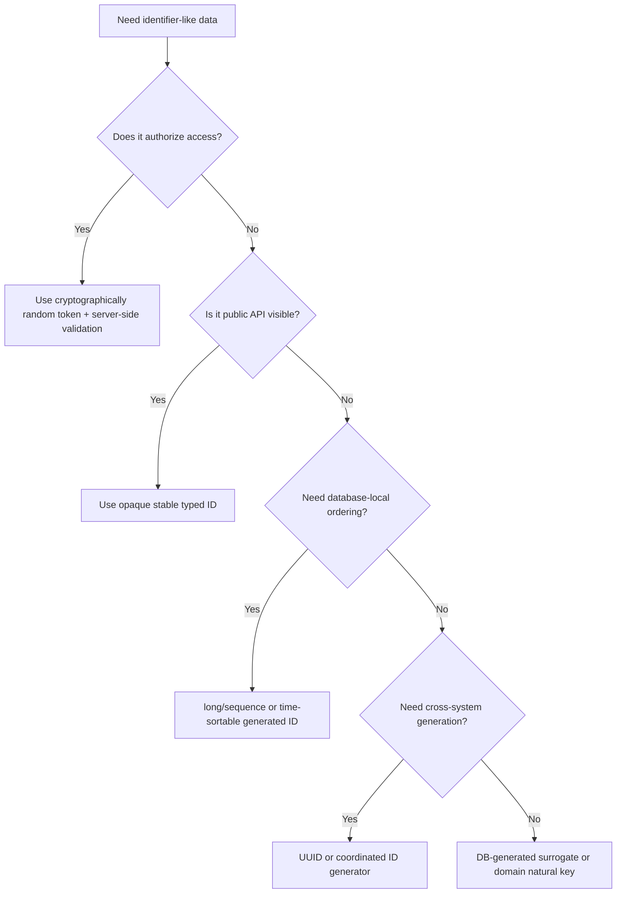

------
title: Learn Java Core Types, Data Model & Data APIs - Part 027
description: Identifier modeling, UUID, typed IDs, randomness, SecureRandom, token-like data, external references, normalization, collision thinking, and production ID discipline.
series: learn-java-core-types
seriesTitle: Learn Java Core Types, Data Model & Data APIs
order: 27
partTitle: IDs, UUID, Random, and Token-like Data
tags:
- java
- uuid
- random
- securerandom
- identifiers
- tokens
- domain-modeling
- security
- data-modeling
date: 2026-06-27
---

# Part 027 — IDs, UUID, Random, and Token-like Data

> Goal: memahami identifier bukan sekadar `String`, `Long`, atau `UUID`, tetapi **kontrak identitas data**. Setelah bagian ini, kita bisa memilih representasi ID, UUID, random value, dan token-like data dengan benar berdasarkan domain, keamanan, ordering, storage, observability, dan boundary antar sistem.

Di Part 012 kita membedakan identity equality dan logical equality. Di Part 026 kita membahas numeric scalar. Sekarang kita masuk ke kategori data yang tampak sederhana tetapi sering menentukan kualitas arsitektur: **identifier**.

Contoh bug yang terlihat kecil:

```java
String accountId = "001234";
long parsed = Long.parseLong(accountId);
String restored = String.valueOf(parsed); // "1234" — leading zero hilang
```

Atau:

```java
String resetToken = String.valueOf(new Random().nextLong()); // buruk untuk security token
```

Atau:

```java
UUID id = UUID.randomUUID();
// aman untuk uniqueness praktis, tetapi bukan authorization proof
```

Top engineer tidak bertanya “pakai UUID atau Long?”, tetapi:

- ID ini dibuat siapa?
- Apakah ID ini internal atau external?
- Apakah perlu sortable?
- Apakah boleh leak informasi?
- Apakah perlu cryptographically unpredictable?
- Apakah akan dipersist, di-log, di-copy, di-share, atau dipakai sebagai authorization bearer?
- Apakah equality-nya case-sensitive?
- Apakah formatnya bagian dari public contract?

---

## 1. Mental Model: Identifier Adalah Boundary Contract

Identifier adalah value yang menunjuk entity, aggregate, resource, event, command, file, session, token, atau external reference.

Identifier bukan cuma “angka unik”. Identifier membawa beberapa kontrak:

| Kontrak | Pertanyaan |
|---|---|
| Uniqueness | unik dalam scope apa? global, tenant, table, aggregate, hari, partition? |
| Stability | berubah atau tidak? bisa regenerate? |
| Opacity | caller boleh tahu struktur internalnya? |
| Sortability | perlu ordered by creation time? |
| Guessability | boleh ditebak? |
| Security | apakah tahu ID berarti boleh akses? |
| Encoding | string, UUID, long, binary, base64url? |
| Compatibility | format public bisa berubah? |
| Observability | aman di-log? berisi PII? |
| Persistence | disimpan sebagai text, binary, numeric, composite? |

Decision diagram:



Core rule:

> **ID identifies. Token authorizes. Random value samples. Do not collapse them into one mental bucket.**

---

## 2. Natural ID, Surrogate ID, External Reference

### 2.1 Natural ID

Natural ID berasal dari domain nyata.

Contoh:

- tax number;
- email address;
- account number assigned by regulator;
- vehicle registration number;
- national ID;
- ISO currency code;
- external case number.

Natural ID bagus ketika memang domain menganggapnya identitas stabil. Tetapi natural ID sering punya masalah:

- bisa berubah;
- bisa salah input;
- bisa reuse;
- bisa berisi PII;
- punya format berubah berdasarkan negara/lembaga;
- bisa case-insensitive;
- bisa punya leading zero;
- bisa punya check digit;
- bisa punya canonical form dan display form berbeda.

Contoh wrapper:

```java
public record TaxpayerNumber(String value) {
    public TaxpayerNumber {
        if (value == null || value.isBlank()) {
            throw new IllegalArgumentException("taxpayer number is required");
        }
        value = normalize(value);
        if (!isValid(value)) {
            throw new IllegalArgumentException("invalid taxpayer number");
        }
    }

    private static String normalize(String raw) {
        return raw.replace("-", "").trim().toUpperCase(Locale.ROOT);
    }

    private static boolean isValid(String value) {
        return value.matches("[A-Z0-9]{8,20}");
    }
}
```

Mental model:

- raw input bukan ID final;
- canonical form dipakai untuk equality;
- display form bisa berbeda;
- validation ada di boundary.

### 2.2 Surrogate ID

Surrogate ID dibuat oleh sistem, bukan berasal dari domain nyata.

Contoh:

```java
public record AccountId(UUID value) {
    public AccountId {
        Objects.requireNonNull(value, "value");
    }

    public static AccountId newId() {
        return new AccountId(UUID.randomUUID());
    }
}
```

Surrogate ID cocok untuk:

- database primary key;
- aggregate identity;
- message ID;
- event ID;
- correlation ID;
- internal reference.

Kelebihan:

- tidak tergantung domain mutable;
- bisa opaque;
- bisa dibuat sebelum persist;
- menghindari PII sebagai primary key.

Risiko:

- domain masih butuh uniqueness natural key;
- bisa bikin duplicate domain entity jika natural identity tidak dikontrol;
- ID dapat diperlakukan sebagai authorization proof padahal bukan.

### 2.3 External Reference

External reference adalah ID dari sistem lain.

```java
public record PaymentProviderChargeId(String value) {
    public PaymentProviderChargeId {
        if (value == null || value.isBlank()) {
            throw new IllegalArgumentException("provider charge id is required");
        }
        value = value.trim();
    }
}
```

External reference sebaiknya dipisah dari internal ID.

Buruk:

```java
record Payment(UUID id, String idFromProvider) {}
```

Lebih jelas:

```java
record Payment(
    PaymentId id,
    PaymentProviderChargeId providerChargeId
) {}
```

Kenapa?

Karena internal ID dan external ID punya lifecycle, stability, format, privacy, dan ownership berbeda.

---

## 3. String ID vs Numeric ID vs UUID vs Typed ID

### 3.1 `String` ID

`String` fleksibel dan boundary-friendly. Banyak API memakai string karena mudah masuk JSON, URL, log, database, dan message queue.

Tetapi `String` terlalu lemah sebagai domain type.

Buruk:

```java
void suspendAccount(String accountId, String caseId, String userId) { ... }
```

Bug mudah terjadi:

```java
suspendAccount(userId, caseId, accountId); // compile, salah semantik
```

Lebih aman:

```java
void suspendAccount(AccountId accountId, CaseId caseId, UserId userId) { ... }
```

Typed ID mengubah bug runtime menjadi compile-time error.

### 3.2 Numeric ID

`long` sering dipakai untuk DB-generated IDs.

Kelebihan:

- compact;
- efficient index;
- mudah sorting;
- sequential locality bagus untuk B-tree;
- mudah debugging.

Risiko:

- guessable;
- leak volume bisnis;
- sering disalahgunakan sebagai public ID;
- leading zero hilang jika asalnya bukan numeric domain;
- dapat overflow jika lifecycle panjang dan generator buruk;
- tenant-boundary bisa bocor jika endpoint hanya cek ID.

Rule:

> `long` bagus sebagai internal storage identity. Jangan jadikan `long` sequential sebagai public authorization boundary.

Typed wrapper:

```java
public record CaseId(long value) {
    public CaseId {
        if (value <= 0) {
            throw new IllegalArgumentException("case id must be positive");
        }
    }
}
```

### 3.3 UUID

`java.util.UUID` merepresentasikan 128-bit immutable universally unique identifier. Di Java, `UUID` final dan comparable.

```java
UUID id = UUID.randomUUID();
```

Kelebihan UUID:

- bisa dibuat tanpa round-trip ke DB;
- sangat kecil peluang collision untuk practical distributed systems;
- opaque-ish dibanding sequential long;
- didukung banyak database dan platform;
- baik untuk event/message/correlation/resource ID.

Risiko UUID:

- lebih besar dari `long`;
- random UUID buruk untuk locality index pada beberapa database jika tidak ada strategi indexing;
- string UUID panjang;
- bukan token authorization;
- version/variant dapat membocorkan jenis generator;
- `UUID.fromString` menerima format canonical dengan hyphen, tetapi input normalization tetap harus dikontrol di boundary.

Typed wrapper:

```java
public record EventId(UUID value) {
    public EventId {
        Objects.requireNonNull(value, "value");
    }

    public static EventId generate() {
        return new EventId(UUID.randomUUID());
    }

    public static EventId parse(String raw) {
        return new EventId(UUID.fromString(raw));
    }

    @Override
    public String toString() {
        return value.toString();
    }
}
```

Rule:

> `UUID` adalah representation. `EventId`, `CaseId`, dan `AccountId` adalah domain meaning.

---

## 4. UUID Semantics in Java

### 4.1 Construction

Common factories:

```java
UUID random = UUID.randomUUID();
UUID parsed = UUID.fromString("123e4567-e89b-12d3-a456-426614174000");
UUID named = UUID.nameUUIDFromBytes("abc".getBytes(StandardCharsets.UTF_8));
```

Use cases:

| Factory | Use case |
|---|---|
| `randomUUID()` | random generated ID |
| `fromString(String)` | parsing external string |
| `nameUUIDFromBytes(byte[])` | deterministic name-based UUID |

### 4.2 UUID Is Not Secret

A UUID is often hard to guess, especially random UUID, but it should not be treated as a permission token.

Bad authorization:

```java
@GetMapping("/cases/{caseId}")
CaseView view(@PathVariable UUID caseId) {
    return caseService.get(caseId); // missing authorization check
}
```

Better:

```java
@GetMapping("/cases/{caseId}")
CaseView view(@AuthenticationPrincipal User user, @PathVariable CaseId caseId) {
    return caseService.getAuthorized(user.id(), caseId);
}
```

UUID identifies a resource. Authorization policy decides whether the caller may access it.

### 4.3 UUID and Database Storage

Options:

| Storage | Pros | Cons |
|---|---|---|
| native UUID type | good semantics, compact enough | DB-specific behavior |
| `BINARY(16)` | compact | harder manual debugging |
| `CHAR(36)` | readable | larger index/storage |
| `VARCHAR` | flexible | weaker constraints |

Practical rule:

- for PostgreSQL, native UUID is usually sensible;
- for cross-DB portability, evaluate binary/string trade-off;
- do not store UUID as unrelated `String` everywhere unless boundary simplicity matters more than constraints.

---

## 5. Typed IDs as Domain Scalar

Part 026 introduced domain scalar around numeric values. ID deserves the same treatment.

Bad model:

```java
record Case(String id, String ownerId, String assignedOfficerId) {}
```

Better:

```java
record Case(
    CaseId id,
    UserId ownerId,
    OfficerId assignedOfficerId
) {}
```

Typed ID benefits:

- prevents parameter swapping;
- centralizes parsing/formatting;
- documents scope;
- separates internal/external IDs;
- allows different validation per ID type;
- makes test fixtures explicit;
- improves refactoring safety.

Minimal typed UUID ID:

```java
public record CaseId(UUID value) {
    public CaseId {
        Objects.requireNonNull(value, "value");
    }

    public static CaseId newId() {
        return new CaseId(UUID.randomUUID());
    }

    public static CaseId parse(String raw) {
        return new CaseId(UUID.fromString(raw));
    }

    public String externalForm() {
        return value.toString();
    }
}
```

Minimal typed string ID:

```java
public record ExternalCaseReference(String value) {
    public ExternalCaseReference {
        if (value == null || value.isBlank()) {
            throw new IllegalArgumentException("external case reference is required");
        }
        value = value.trim();
    }
}
```

Avoid putting too much behavior into IDs. An ID should validate identity shape, not load objects, call repositories, or enforce business workflow.

---

## 6. Scope of Uniqueness

“Unique” is incomplete unless the scope is explicit.

Examples:

| ID | Scope |
|---|---|
| database sequence | one table/database |
| tenant-local case number | one tenant |
| correlation ID | one trace/workflow context |
| event ID | event log/global system |
| payment provider charge ID | provider namespace |
| username | product/account realm |
| filename | directory/bucket/path scope |

Design model:

```java
record TenantId(UUID value) {}
record CaseNumber(String value) {}

record TenantScopedCaseRef(TenantId tenantId, CaseNumber caseNumber) {}
```

This prevents false assumptions:

```java
// misleading: case number might only be tenant-unique
record CaseRef(String caseNumber) {}
```

In regulatory/case platforms, this matters because a “case number” may be:

- internal workflow number;
- external complaint number;
- regulator-issued reference;
- court reference;
- legacy migration reference;
- tenant-local sequential number.

These should not be collapsed into a single `String caseId`.

---

## 7. Randomness: Random, RandomGenerator, ThreadLocalRandom, SplittableRandom, SecureRandom

Java has multiple random APIs because use cases differ.

### 7.1 `Random`

`java.util.Random` is a legacy pseudorandom generator.

Use for:

- simple simulations;
- non-security sampling;
- test data where reproducibility is desired.

Do not use for:

- password reset token;
- session token;
- API key;
- CSRF token;
- cryptographic nonce;
- anything whose unpredictability protects users.

### 7.2 `RandomGenerator`

`java.util.random.RandomGenerator` provides a common protocol for generators of pseudorandom sequences.

Example:

```java
RandomGenerator rng = RandomGenerator.getDefault();
int sample = rng.nextInt(100);
```

This is useful when designing APIs that accept a random generator without hardcoding implementation:

```java
public final class LoadBalancerTestData {
    private final RandomGenerator rng;

    public LoadBalancerTestData(RandomGenerator rng) {
        this.rng = Objects.requireNonNull(rng);
    }

    public int nextWeight() {
        return rng.nextInt(1, 101);
    }
}
```

For tests:

```java
RandomGenerator seeded = new Random(42);
```

The key design idea: inject randomness if reproducibility matters.

### 7.3 `ThreadLocalRandom`

Useful for high-throughput non-security random values across threads.

```java
int shard = ThreadLocalRandom.current().nextInt(16);
```

Use for:

- randomized backoff jitter, when not security-sensitive;
- load distribution;
- simple sampling.

Not for security tokens.

### 7.4 `SplittableRandom`

Useful for parallel-friendly pseudorandom generation and splitting independent generators.

```java
SplittableRandom rng = new SplittableRandom();
long value = rng.nextLong();
```

Use for:

- simulations;
- randomized algorithms;
- parallel streams or forked generation where reproducibility/statistical quality matters.

Not for cryptographic secret generation.

### 7.5 `SecureRandom`

`java.security.SecureRandom` is for cryptographically strong random values.

Use for:

- password reset token;
- email verification token;
- API key material;
- session secret;
- nonce/salt where cryptographic unpredictability matters.

Example token generator:

```java
public final class TokenGenerator {
    private static final int DEFAULT_BYTES = 32; // 256 bits

    private final SecureRandom secureRandom;

    public TokenGenerator(SecureRandom secureRandom) {
        this.secureRandom = Objects.requireNonNull(secureRandom);
    }

    public String newUrlToken() {
        byte[] bytes = new byte[DEFAULT_BYTES];
        secureRandom.nextBytes(bytes);
        return Base64.getUrlEncoder().withoutPadding().encodeToString(bytes);
    }
}
```

Why URL-safe Base64?

- compact compared with hex;
- safe in URLs when using URL encoder;
- no `+` or `/` characters;
- no padding if you choose `.withoutPadding()`.

---

## 8. ID vs Token vs Secret

Do not confuse:

| Data | Purpose | Should be secret? | Example |
|---|---|---:|---|
| ID | identify resource | usually no | `caseId`, `userId` |
| Correlation ID | trace operation | no | `X-Correlation-ID` |
| Token | prove possession/authorization | yes | reset token, API token |
| Secret | cryptographic key/password | yes | signing key |
| Nonce | one-time cryptographic value | often no, but unpredictable/unique rules apply | OAuth nonce |

Bad:

```java
// Treating ID as token
GET /download/9b9e4c5d-... // anyone with ID can download
```

Better:

```java
// ID identifies file. Policy checks access.
GET /files/{fileId}
Authorization: Bearer ...
```

Or for one-time download:

```java
// Token references a server-side grant with expiration and scope.
GET /download?token=...
```

Token table design:

```java
record ResetPasswordToken(
    String tokenHash,
    UserId userId,
    Instant expiresAt,
    boolean used
) {}
```

Important: store token hash, not raw token, when the token behaves like a credential.

---

## 9. Token Generation Discipline

A production token should have:

- enough entropy;
- cryptographic randomness;
- URL-safe representation;
- expiration;
- scope;
- replay policy;
- storage policy;
- audit policy;
- revocation/used flag if one-time;
- rate limits around verification.

Example service:

```java
public final class ResetTokenService {
    private final SecureRandom random;
    private final MessageDigest sha256;

    public ResetTokenService() throws NoSuchAlgorithmException {
        this.random = new SecureRandom();
        this.sha256 = MessageDigest.getInstance("SHA-256");
    }

    public IssuedToken issue(UserId userId, Instant now) {
        byte[] raw = new byte[32];
        random.nextBytes(raw);

        String token = Base64.getUrlEncoder().withoutPadding().encodeToString(raw);
        String tokenHash = hash(token);
        Instant expiresAt = now.plus(Duration.ofMinutes(15));

        return new IssuedToken(token, tokenHash, userId, expiresAt);
    }

    private String hash(String token) {
        byte[] digest = sha256.digest(token.getBytes(StandardCharsets.UTF_8));
        return HexFormat.of().formatHex(digest);
    }
}
```

Note:

- this is a modeling example, not a complete auth system;
- verification should use constant-time comparison for sensitive values;
- rate limiting and expiration are part of the security model.

---

## 10. Correlation ID, Request ID, Idempotency Key

These look similar but have different semantics.

### 10.1 Correlation ID

Tracks related work across services.

```java
record CorrelationId(String value) {
    static CorrelationId newId() {
        return new CorrelationId(UUID.randomUUID().toString());
    }
}
```

Properties:

- not a security credential;
- safe to log if it does not encode PII;
- should propagate across service boundaries;
- helps observability.

### 10.2 Request ID

Identifies one inbound request.

- one per HTTP request/message processing attempt;
- useful for logs and debugging;
- usually generated at edge/gateway.

### 10.3 Idempotency Key

Provided by client or generated for retry-safe operations.

Properties:

- defines “same logical operation”;
- needs scope: user/account/operation;
- must store result or decision;
- can expire;
- should not be confused with resource ID.

Example:

```java
record IdempotencyKey(String value) {
    public IdempotencyKey {
        if (value == null || value.isBlank()) {
            throw new IllegalArgumentException("idempotency key is required");
        }
        if (value.length() > 200) {
            throw new IllegalArgumentException("idempotency key too long");
        }
    }
}

record IdempotencyScope(UserId userId, String operation, IdempotencyKey key) {}
```

---

## 11. Case Sensitivity, Canonicalization, and Display

Identifier equality depends on canonicalization rules.

Email-like ID:

```java
public record EmailAddress(String value) {
    public EmailAddress {
        if (value == null || value.isBlank()) {
            throw new IllegalArgumentException("email is required");
        }
        value = value.trim().toLowerCase(Locale.ROOT);
    }
}
```

But be careful: real email semantics can be provider-specific. Do not over-normalize beyond what your domain owns.

External case reference:

```java
public record ExternalCaseReference(String canonical, String display) {
    public ExternalCaseReference(String raw) {
        this(canonicalize(raw), raw.trim());
    }

    private static String canonicalize(String raw) {
        if (raw == null || raw.isBlank()) {
            throw new IllegalArgumentException("reference is required");
        }
        return raw.trim().replace(" ", "").toUpperCase(Locale.ROOT);
    }
}
```

Useful distinction:

- canonical form: equality, lookup, unique index;
- display form: user-facing representation;
- raw form: audit if needed, but not trusted.

---

## 12. Serialization and Public Contracts

Once an ID format is exposed, it becomes API contract.

Bad:

```json
{ "id": 12345 }
```

Then later you want UUID:

```json
{ "id": "0a5be6d7-..." }
```

This is breaking for clients expecting number.

For public APIs, prefer an opaque string shape from the start:

```json
{ "id": "case_0a5be6d71c9e4e9abcc1b4dd3a1ce920" }
```

Prefixing can help humans and systems:

| Prefix | Meaning |
|---|---|
| `case_` | case ID |
| `acct_` | account ID |
| `evt_` | event ID |
| `tok_` | token-like value, but do not log blindly |

Typed parser:

```java
public record PublicCaseId(String value) {
    private static final Pattern PATTERN = Pattern.compile("case_[a-zA-Z0-9_-]{20,80}");

    public PublicCaseId {
        if (value == null || !PATTERN.matcher(value).matches()) {
            throw new IllegalArgumentException("invalid public case id");
        }
    }
}
```

---

## 13. Collision Thinking

Collision probability is not just math. It is also operational design.

Questions:

- What happens if collision occurs?
- Is there a unique database constraint?
- Does retry generate a new ID?
- Can collision overwrite data?
- Is the ID generator deterministic under bad seed?
- Is ID generation centralized or distributed?

Safe insert pattern:

```java
for (int attempt = 0; attempt < 3; attempt++) {
    CaseId id = CaseId.newId();
    try {
        repository.insert(new Case(id, ...));
        return id;
    } catch (DuplicateKeyException collision) {
        // extremely unlikely for UUID, but safe behavior is explicit
    }
}
throw new IllegalStateException("failed to allocate case id after retries");
```

For UUID v4, collision is practically negligible at typical system scales, but unique constraints are still good architecture because they protect against:

- generator bugs;
- test fixtures;
- migration mistakes;
- manual imports;
- duplicate replay;
- wrong ID scope.

---

## 14. Ordering and Time-Sortable IDs

Random UUIDs do not preserve creation order.

If you need ordering, options include:

- database sequence/time column;
- `created_at` plus ID tie-breaker;
- time-sortable ID format;
- event log offset;
- monotonically increasing per-partition sequence.

Do not assume lexical order of arbitrary ID equals time order.

Bad:

```java
events.stream()
      .sorted(Comparator.comparing(Event::id))
      .toList(); // not necessarily chronological
```

Better:

```java
events.stream()
      .sorted(Comparator.comparing(Event::occurredAt).thenComparing(Event::id))
      .toList();
```

Rule:

> If ordering matters, model ordering explicitly. Do not smuggle ordering assumptions through ID format unless the format is designed and documented for that purpose.

---

## 15. Logging and Privacy

IDs often appear in logs. Some are safe; some are sensitive.

| Value | Log safe? | Notes |
|---|---:|---|
| correlation ID | yes | if generated and non-PII |
| internal case UUID | usually yes | still consider access/privacy policy |
| email address | often no | PII |
| reset token | no | credential-like |
| API key | no | secret |
| national ID | no | high-risk PII |
| external complaint number | depends | may identify person/case |

Safer domain types can control logging:

```java
public record ApiToken(String value) {
    @Override
    public String toString() {
        return "ApiToken[redacted]";
    }
}
```

For IDs that are not secret but sensitive, use partial masking:

```java
public record ExternalCaseReference(String value) {
    public String logSafe() {
        int keep = Math.min(4, value.length());
        return "***" + value.substring(value.length() - keep);
    }
}
```

---

## 16. Equality and Hashing for IDs

Record-based typed IDs are usually excellent because generated `equals` and `hashCode` are component-based.

```java
record AccountId(UUID value) {}
record UserId(UUID value) {}
```

Even if both wrap UUID, they are not equal because they are different runtime classes.

```java
AccountId a = new AccountId(uuid);
UserId u = new UserId(uuid);

// a.equals(u) is false
```

This is good. It protects domain meaning.

But avoid mutable ID components:

```java
record BadId(byte[] bytes) {} // array equality is reference-based, array mutable
```

Better:

```java
public final class BinaryId {
    private final byte[] bytes;

    public BinaryId(byte[] bytes) {
        this.bytes = Objects.requireNonNull(bytes).clone();
    }

    public byte[] bytes() {
        return bytes.clone();
    }

    @Override
    public boolean equals(Object o) {
        return o instanceof BinaryId other && Arrays.equals(bytes, other.bytes);
    }

    @Override
    public int hashCode() {
        return Arrays.hashCode(bytes);
    }
}
```

---

## 17. ID Design in Layered Systems

### 17.1 Domain Layer

Use typed ID:

```java
record CaseId(UUID value) {}
record Case(CaseId id, CaseStatus status) {}
```

### 17.2 API Layer

Expose as string:

```java
record CaseResponse(String id, String status) {
    static CaseResponse from(Case c) {
        return new CaseResponse(c.id().value().toString(), c.status().name());
    }
}
```

### 17.3 Persistence Layer

Map to DB-supported representation:

```java
record CaseRow(UUID id, String status) {}
```

Boundary conversion should be explicit:

```java
CaseRow toRow(Case c) {
    return new CaseRow(c.id().value(), c.status().name());
}

Case toDomain(CaseRow row) {
    return new Case(new CaseId(row.id()), CaseStatus.valueOf(row.status()));
}
```

Do not leak persistence row types into domain simply because they have the same fields.

---

## 18. ID Anti-Patterns

### 18.1 `String id` Everywhere

Symptom:

```java
void assign(String caseId, String officerId, String departmentId) {}
```

Consequence:

- parameter swap compiles;
- no validation ownership;
- no format control;
- ambiguous logs;
- weak refactoring.

### 18.2 Sequential Public IDs Without Authorization

Symptom:

```text
/cases/1001
/cases/1002
/cases/1003
```

Consequence:

- enumeration attack;
- business volume leak;
- missing access checks become catastrophic.

### 18.3 Using Random as Security

Symptom:

```java
new Random().nextLong()
```

Consequence:

- predictable values;
- token compromise risk.

### 18.4 Using UUID as Permission

Symptom:

```java
if (repository.exists(fileId)) return file;
```

Consequence:

- anyone with ID can access resource.

### 18.5 Persisting Enum Ordinal-Like IDs

Symptom:

```java
status.ordinal()
```

Consequence:

- enum reorder corrupts meaning.

### 18.6 ID Format Coupled to Database Choice

Symptom:

Public API exposes database sequence and later must migrate.

Consequence:

- client-breaking API change;
- hard migration.

---

## 19. Production Checklist

Before approving an ID/token design, answer:

- What is the uniqueness scope?
- Who generates it?
- Is it stable?
- Is it public?
- Is it guessable?
- Is guessability acceptable?
- Is it a credential?
- Can it be logged?
- Does it contain PII?
- Is canonicalization defined?
- Is display formatting separate?
- Is database uniqueness enforced?
- Is serialization format stable?
- Is there a typed wrapper?
- Can two different ID types be accidentally swapped?
- Does ordering rely on explicit timestamp or hidden ID assumptions?
- Are test IDs deterministic where useful?
- Is randomness injected for reproducible tests?
- Is `SecureRandom` used for security-sensitive values?

---

## 20. Practice Drill

### Drill 1 — Replace String IDs

Refactor this:

```java
record Assignment(String caseId, String officerId, String reviewerId) {}
```

Into typed IDs:

```java
record CaseId(UUID value) {}
record OfficerId(UUID value) {}
record ReviewerId(UUID value) {}
record Assignment(CaseId caseId, OfficerId officerId, ReviewerId reviewerId) {}
```

Then intentionally swap `OfficerId` and `ReviewerId` in a method call and confirm the compiler catches it.

### Drill 2 — Token Generator

Implement:

```java
interface TokenGenerator {
    String newToken();
}
```

Requirements:

- uses `SecureRandom`;
- generates at least 256 bits;
- encodes using URL-safe Base64 without padding;
- does not log raw token;
- has tests for approximate length and allowed character set.

### Drill 3 — External Reference Canonicalization

Create:

```java
record ExternalCaseReference(String canonical, String display) {}
```

Rules:

- trim input;
- canonical uppercase;
- remove spaces and dashes;
- retain display value;
- reject blank input.

### Drill 4 — ID Scope Modeling

Model tenant-scoped case number:

```java
record TenantId(UUID value) {}
record CaseNumber(String value) {}
record TenantCaseKey(TenantId tenantId, CaseNumber caseNumber) {}
```

Add tests showing two tenants can have the same case number but different `TenantCaseKey`.

---

## 21. Review Checklist

You understand this part if you can explain:

- why ID and token are different;
- why `UUID` is not authorization;
- when `long` ID is appropriate;
- why leading zero can be domain-significant;
- why typed IDs improve API safety;
- why `SecureRandom` is required for security tokens;
- what `RandomGenerator` is useful for;
- how to model uniqueness scope;
- why public ID format is long-lived API contract;
- why collision handling still deserves a database constraint;
- when ID ordering assumptions are dangerous.

---

## 22. References

- Java SE 25 API — `java.util.UUID`
- Java SE 25 API — `java.util.random.RandomGenerator`
- Java SE 25 API — `java.security.SecureRandom`
- Java SE 25 API — `java.util.Base64`
- Java SE 25 API — `java.util.HexFormat`
- RFC 4122 / UUID concepts
- RFC 4648 / Base64 concepts
