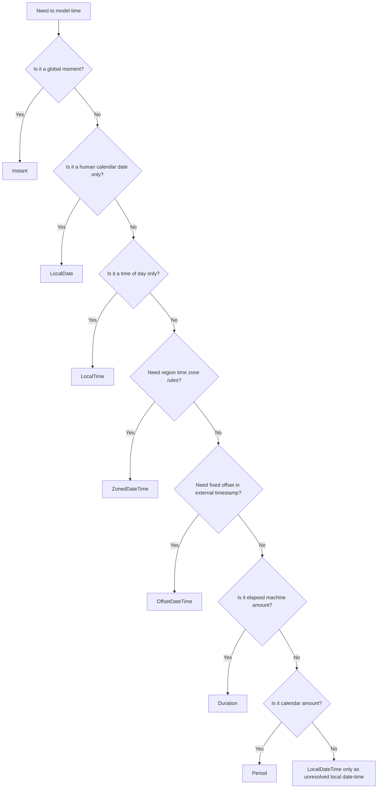

------
title: Learn Java Core Types, Data Model & Data APIs - Part 028
description: java.time mental model, Instant, LocalDate, LocalTime, LocalDateTime, ZonedDateTime, OffsetDateTime, Duration, Period, Clock, time-line vs calendar-time, and production time type selection.
series: learn-java-core-types
seriesTitle: Learn Java Core Types, Data Model & Data APIs
order: 28
partTitle: Java Time Mental Model
tags:
- java
- java-time
- instant
- localdate
- zoneddatetime
- duration
- period
- clock
- timezone
- domain-modeling
date: 2026-06-27
---

# Part 028 — Java Time Mental Model

> Goal: memahami `java.time` sebagai model data, bukan sekadar API tanggal. Setelah bagian ini, kita bisa memilih `Instant`, `LocalDate`, `LocalDateTime`, `ZonedDateTime`, `OffsetDateTime`, `Duration`, `Period`, dan `Clock` berdasarkan makna domain, bukan kebiasaan atau trial-and-error.

Time bugs mahal karena biasanya muncul di boundary:

- pengguna di zona waktu berbeda;
- daylight saving time;
- end-of-day filtering;
- scheduling;
- expiry;
- audit trail;
- database persistence;
- distributed systems;
- reporting bulanan/tahunan;
- legal/regulatory deadlines.

Contoh bug klasik:

```java
LocalDateTime expiresAt = LocalDateTime.now().plusHours(1);
```

Kelihatannya benar. Tetapi untuk token expiry di distributed system, `LocalDateTime` tidak punya time zone atau offset. Ia adalah waktu lokal, bukan titik waktu global.

Lebih tepat:

```java
Instant expiresAt = clock.instant().plus(Duration.ofHours(1));
```

Untuk jadwal meeting di Jakarta:

```java
ZonedDateTime meeting = ZonedDateTime.of(
    2026, 7, 1, 9, 0, 0, 0,
    ZoneId.of("Asia/Jakarta")
);
```

Untuk tanggal lahir:

```java
LocalDate birthDate = LocalDate.of(1990, 5, 12);
```

Top engineer tidak memilih time type berdasarkan “yang gampang diparse”, tetapi berdasarkan pertanyaan:

> Apakah data ini adalah titik di time-line, tanggal kalender manusia, waktu lokal, jadwal dengan zona, offset timestamp, durasi mesin, atau periode kalender?

---

## 1. Mental Model: Time Has Multiple Meanings

Dalam sistem, “time” minimal punya tujuh makna berbeda:

| Meaning | Java type kandidat | Contoh |
|---|---|---|
| titik global di time-line | `Instant` | event occurred at, token expires at |
| tanggal kalender tanpa waktu | `LocalDate` | birth date, due date, holiday date |
| waktu harian tanpa tanggal | `LocalTime` | office opens at 09:00 |
| tanggal+waktu lokal tanpa zona | `LocalDateTime` | user input sebelum zone resolved |
| tanggal+waktu dengan region zone | `ZonedDateTime` | meeting in Europe/Paris |
| tanggal+waktu dengan fixed offset | `OffsetDateTime` | API timestamp with `+07:00` |
| machine elapsed time | `Duration` | timeout, SLA latency |
| calendar amount | `Period` | 3 months, 1 year |
| injectable current time | `Clock` | deterministic testing |

Decision diagram:



Core rule:

> **Use the narrowest type that preserves the domain meaning.**

---

## 2. Timeline Time vs Calendar Time

There are two major mental models.

### 2.1 Timeline Time

Timeline time is a global sequence of instants.

Use for:

- event occurred time;
- creation timestamp;
- update timestamp;
- token expiration;
- audit log;
- message enqueue time;
- file modified time;
- timeout deadline;
- distributed ordering approximation.

Java type:

```java
Instant occurredAt = clock.instant();
```

An `Instant` does not know Jakarta, Paris, New York, or DST. It is a point on the UTC-based time-line.

### 2.2 Calendar Time

Calendar time is human interpretation.

Use for:

- birthday;
- holiday;
- business date;
- monthly billing cycle;
- “due by March 31”;
- “office opens at 09:00”;
- court/regulatory date;
- reporting period.

Java types:

```java
LocalDate filingDate = LocalDate.of(2026, 6, 27);
LocalTime officeOpen = LocalTime.of(9, 0);
Period retentionPeriod = Period.ofYears(7);
```

Calendar time requires business rules. A “day” in calendar terms is not always 24 hours in zones with daylight saving time.

---

## 3. `Instant`: A Global Moment

`Instant` represents an instantaneous point on the time-line.

Use `Instant` for machine/audit/security/distributed timestamps:

```java
record AuditEvent(
    UUID id,
    String action,
    Instant occurredAt
) {}
```

Good uses:

```java
Instant createdAt = clock.instant();
Instant expiresAt = createdAt.plus(Duration.ofMinutes(15));
boolean expired = !clock.instant().isBefore(expiresAt);
```

Avoid using `Instant` for concepts that are not global moments:

```java
// Poor for birth date
Instant birthDate;
```

A birth date is usually a `LocalDate`, not an exact global instant.

### 3.1 Persistence

For audit fields, store an instant-like timestamp consistently.

Common strategy:

- domain: `Instant`;
- database: `timestamp with time zone` or equivalent instant semantics depending on DB;
- API: ISO-8601 timestamp with `Z` or explicit offset;
- UI: convert to user zone for display.

Example API response:

```json
{
  "createdAt": "2026-06-27T09:15:30Z"
}
```

### 3.2 Do Not Format Too Early

Bad:

```java
record Event(String occurredAt) {}
```

Better:

```java
record Event(Instant occurredAt) {}
```

Format at boundary:

```java
String text = DateTimeFormatter.ISO_INSTANT.format(event.occurredAt());
```

---

## 4. `LocalDate`: A Human Calendar Date

`LocalDate` is a date without time and without time-zone.

Use for:

- birth date;
- due date;
- filing date;
- report date;
- holiday;
- effective date;
- settlement date;
- business day.

Example:

```java
record FilingDeadline(LocalDate dueDate) {
    boolean isOverdue(LocalDate today) {
        return today.isAfter(dueDate);
    }
}
```

Why `LocalDate` instead of `Instant`?

Because the domain says “date”, not “moment”.

A regulatory deadline like “submit by 2026-06-30” may need zone/business cut-off rules, but its core representation may still be a `LocalDate` plus policy.

### 4.1 Inclusive Date Ranges

Date ranges are often inclusive in business language.

```java
record DateRange(LocalDate startInclusive, LocalDate endInclusive) {
    DateRange {
        if (endInclusive.isBefore(startInclusive)) {
            throw new IllegalArgumentException("invalid date range");
        }
    }

    boolean contains(LocalDate date) {
        return !date.isBefore(startInclusive) && !date.isAfter(endInclusive);
    }
}
```

But database/query ranges are often easier as half-open intervals.

For a day in a zone:

```java
ZoneId zone = ZoneId.of("Asia/Jakarta");
LocalDate day = LocalDate.of(2026, 6, 27);

Instant start = day.atStartOfDay(zone).toInstant();
Instant end = day.plusDays(1).atStartOfDay(zone).toInstant();

// query: occurredAt >= start AND occurredAt < end
```

Half-open intervals avoid fractional second/nanosecond end-of-day bugs.

---

## 5. `LocalTime`: Time of Day

`LocalTime` is time without date and without zone.

Use for:

- opening hour;
- daily cut-off;
- recurring schedule time;
- form input “09:00”.

Example:

```java
record OfficeHours(LocalTime opensAt, LocalTime closesAt) {
    boolean isOpenAt(LocalTime time) {
        return !time.isBefore(opensAt) && time.isBefore(closesAt);
    }
}
```

Beware overnight ranges:

```java
record TimeWindow(LocalTime start, LocalTime end) {
    boolean contains(LocalTime time) {
        if (start.equals(end)) {
            return true; // policy: full day
        }
        if (start.isBefore(end)) {
            return !time.isBefore(start) && time.isBefore(end);
        }
        return !time.isBefore(start) || time.isBefore(end); // crosses midnight
    }
}
```

`LocalTime` alone cannot tell whether “02:30” exists on a daylight-saving transition day. You need a date and zone for that.

---

## 6. `LocalDateTime`: Local Date-Time Without Zone

`LocalDateTime` is often overused.

It represents:

- a date;
- a time;
- no offset;
- no region zone;
- no global instant.

Good use:

```java
record AppointmentInput(LocalDateTime requestedLocalDateTime) {}
```

But before scheduling globally, resolve with a `ZoneId`:

```java
ZoneId zone = ZoneId.of("Asia/Jakarta");
ZonedDateTime scheduled = requestedLocalDateTime.atZone(zone);
Instant instant = scheduled.toInstant();
```

Bad use for audit:

```java
record AuditLog(LocalDateTime occurredAt) {} // ambiguous across systems
```

Better:

```java
record AuditLog(Instant occurredAt) {}
```

### 6.1 When `LocalDateTime` Is Legitimate

Use it when the value is intentionally not a global instant yet:

- local form input;
- local schedule template;
- local appointment draft before zone selection;
- imported legacy field that lacks zone;
- calendar concept where zone resolved later.

Do not use it because “it displays nicely”.

---

## 7. `ZonedDateTime`: Date-Time With Region Zone

`ZonedDateTime` combines:

- local date;
- local time;
- zone rules;
- offset resolved from those rules.

Use for:

- meeting in a named zone;
- local legal deadline with zone;
- scheduled job tied to region;
- store opening in a jurisdiction;
- recurring calendar event.

Example:

```java
ZoneId zone = ZoneId.of("Asia/Jakarta");
ZonedDateTime hearing = ZonedDateTime.of(
    LocalDate.of(2026, 7, 15),
    LocalTime.of(10, 0),
    zone
);
```

Convert to instant for persistence/execution:

```java
Instant executionTime = hearing.toInstant();
```

Keep zone if future local meaning matters:

```java
record ScheduledHearing(
    LocalDate date,
    LocalTime time,
    ZoneId zone
) {
    ZonedDateTime asZonedDateTime() {
        return ZonedDateTime.of(date, time, zone);
    }
}
```

Why keep zone separately?

Because a future event at “09:00 Europe/Paris” is not just an instant. Time-zone rules can change, and recurring future events are local-time concepts.

---

## 8. `OffsetDateTime`: Date-Time With Fixed Offset

`OffsetDateTime` has an offset like `+07:00`, but not full regional zone rules.

Use for:

- external API timestamp that includes offset;
- representing “local date-time plus known offset”;
- systems where zone region is unavailable but offset exists.

Example:

```java
OffsetDateTime received = OffsetDateTime.parse("2026-06-27T16:30:00+07:00");
Instant instant = received.toInstant();
```

Offset is not the same as zone.

| Concept | Example | Knows DST/future rules? |
|---|---|---:|
| `ZoneOffset` | `+07:00` | no |
| `ZoneId` | `Asia/Jakarta` | yes, based on zone rules |

If you need “local civil time in a jurisdiction”, use `ZoneId`/`ZonedDateTime`, not only offset.

---

## 9. `Duration` vs `Period`

This distinction matters.

### 9.1 `Duration`

`Duration` is time-based amount.

Use for:

- timeout;
- TTL;
- elapsed time;
- latency;
- cooldown;
- retry backoff;
- token expiration.

```java
Duration ttl = Duration.ofMinutes(15);
Instant expiresAt = clock.instant().plus(ttl);
```

### 9.2 `Period`

`Period` is date-based amount.

Use for:

- one month;
- seven years retention;
- age calculation;
- calendar billing interval;
- legal/regulatory period.

```java
Period retention = Period.ofYears(7);
LocalDate purgeAfter = caseClosedDate.plus(retention);
```

### 9.3 Why They Differ

One day as `Duration.ofDays(1)` means 24 hours.

One day as `Period.ofDays(1)` means next calendar date.

In zones with DST, these can produce different local clock results.

```java
ZonedDateTime zdt = ...;
ZonedDateTime plusDuration = zdt.plus(Duration.ofDays(1));
ZonedDateTime plusPeriod = zdt.plus(Period.ofDays(1));
```

Rule:

> Use `Duration` for machine elapsed time. Use `Period` for human calendar amount.

---

## 10. `Clock`: Make Time Testable

Calling `Instant.now()` directly scatters an implicit dependency.

Bad:

```java
class TokenService {
    Token issue() {
        Instant expiresAt = Instant.now().plus(Duration.ofMinutes(15));
        return new Token(expiresAt);
    }
}
```

Better:

```java
class TokenService {
    private final Clock clock;

    TokenService(Clock clock) {
        this.clock = Objects.requireNonNull(clock);
    }

    Token issue() {
        Instant now = clock.instant();
        return new Token(now.plus(Duration.ofMinutes(15)));
    }
}
```

Test:

```java
Clock fixed = Clock.fixed(
    Instant.parse("2026-06-27T00:00:00Z"),
    ZoneOffset.UTC
);
TokenService service = new TokenService(fixed);
```

Benefits:

- deterministic tests;
- no sleep-based tests;
- easy boundary testing;
- clear dependency;
- supports simulated time.

### 10.1 Avoid Multiple `now()` Calls for One Decision

Bad:

```java
if (start.isBefore(Instant.now()) && end.isAfter(Instant.now())) {
    ...
}
```

Better:

```java
Instant now = clock.instant();
if (start.isBefore(now) && end.isAfter(now)) {
    ...
}
```

One decision should use one captured time.

---

## 11. Choosing Time Type by Domain Scenario

### 11.1 Token Expiry

Use `Instant` + `Duration` + `Clock`.

```java
record ResetToken(Instant expiresAt) {
    boolean isExpired(Clock clock) {
        return !clock.instant().isBefore(expiresAt);
    }
}
```

### 11.2 Date of Birth

Use `LocalDate`.

```java
record Person(LocalDate birthDate) {}
```

Age calculation needs “as of” date:

```java
int ageAt(LocalDate birthDate, LocalDate asOf) {
    return Period.between(birthDate, asOf).getYears();
}
```

### 11.3 Business Day Deadline

Use `LocalDate` plus policy.

```java
record FilingDeadline(LocalDate dueDate, ZoneId zone) {
    Instant endExclusiveInstant() {
        return dueDate.plusDays(1).atStartOfDay(zone).toInstant();
    }
}
```

### 11.4 Scheduled Hearing

Use `LocalDate`, `LocalTime`, `ZoneId`, or `ZonedDateTime`.

```java
record HearingSchedule(LocalDate date, LocalTime time, ZoneId zone) {
    ZonedDateTime scheduledAt() {
        return ZonedDateTime.of(date, time, zone);
    }
}
```

### 11.5 Audit Event

Use `Instant`.

```java
record AuditEvent(String action, Instant occurredAt) {}
```

### 11.6 External API Timestamp

If incoming timestamp includes offset:

```java
OffsetDateTime dtoTime = OffsetDateTime.parse(input);
Instant occurredAt = dtoTime.toInstant();
```

Domain may still store `Instant`.

### 11.7 Report Month

Do not use a random date string.

```java
record YearMonthPeriod(YearMonth month) {
    LocalDate startInclusive() {
        return month.atDay(1);
    }

    LocalDate endExclusive() {
        return month.plusMonths(1).atDay(1);
    }
}
```

`YearMonth` is better for month-only concepts.

---

## 12. Time Ranges and Intervals

Prefer half-open intervals for machine time:

```java
record InstantRange(Instant startInclusive, Instant endExclusive) {
    InstantRange {
        Objects.requireNonNull(startInclusive);
        Objects.requireNonNull(endExclusive);
        if (!startInclusive.isBefore(endExclusive)) {
            throw new IllegalArgumentException("start must be before end");
        }
    }

    boolean contains(Instant instant) {
        return !instant.isBefore(startInclusive) && instant.isBefore(endExclusive);
    }
}
```

Benefits:

- no overlap ambiguity;
- easy concatenation;
- no “23:59:59.999” hacks;
- works with nanosecond precision;
- maps well to database queries.

Adjacent intervals:

```text
[A, B) and [B, C)
```

No overlap, no gap.

---

## 13. The End-of-Day Trap

Bad:

```java
LocalDate date = LocalDate.of(2026, 6, 27);
LocalDateTime end = date.atTime(23, 59, 59);
```

Problems:

- ignores fractional seconds/nanos;
- assumes local date-time can be converted safely;
- duplicates boundary bugs;
- can fail around DST in some zones.

Better:

```java
Instant start = date.atStartOfDay(zone).toInstant();
Instant end = date.plusDays(1).atStartOfDay(zone).toInstant();
```

Query:

```sql
WHERE occurred_at >= :start
  AND occurred_at < :end
```

---

## 14. Time Zone Design

### 14.1 System Default Zone Is a Hidden Dependency

Bad:

```java
LocalDate today = LocalDate.now();
```

This uses default zone implicitly.

Better:

```java
LocalDate today = LocalDate.now(clock);
```

Or:

```java
LocalDate todayInJakarta = LocalDate.now(ZoneId.of("Asia/Jakarta"));
```

In services, prefer injecting `Clock` with explicit zone when local date is needed.

### 14.2 Store User Zone Explicitly

For user-facing scheduling:

```java
record UserPreferences(ZoneId timeZone) {}
```

Do not infer zone forever from one offset. `+07:00` is not the same as `Asia/Jakarta` as a domain concept.

### 14.3 Zone Rules Can Change

Governments can change time-zone rules. For far-future schedules, preserve the intended local time and zone, not only a computed instant.

For one-off event already executed, `Instant` is enough for audit.

For future recurring event, store:

```java
record RecurringSchedule(
    LocalTime localTime,
    ZoneId zone,
    Set<DayOfWeek> days
) {}
```

---

## 15. Immutability and Thread Safety

Most `java.time` types are immutable and value-based.

This matters because old APIs such as `java.util.Date` are mutable.

Bad legacy style:

```java
Date date = entity.getCreatedAt();
date.setTime(0); // mutates Date object if not defensively copied
```

Modern style:

```java
Instant createdAt = entity.createdAt();
Instant changed = createdAt.plus(Duration.ofDays(1)); // returns new value
```

Time values should be treated like values, not identity-bearing mutable objects.

---

## 16. Legacy Interop: `Date`, `Calendar`, `Timestamp`

You will still meet legacy APIs.

Basic conversions:

```java
Date date = Date.from(instant);
Instant instant = date.toInstant();
```

```java
GregorianCalendar calendar = GregorianCalendar.from(zonedDateTime);
ZonedDateTime zdt = calendar.toZonedDateTime();
```

Guideline:

- convert at boundary;
- keep domain in `java.time`;
- do not spread `Date`/`Calendar` internally;
- defensively copy legacy mutable values where needed.

---

## 17. API Boundary Strategy

### 17.1 JSON

For machine timestamps, prefer ISO-8601 with offset or `Z`:

```json
{ "occurredAt": "2026-06-27T09:30:00Z" }
```

For date-only:

```json
{ "dueDate": "2026-06-30" }
```

For local schedule:

```json
{
  "date": "2026-07-01",
  "time": "09:00:00",
  "zone": "Asia/Jakarta"
}
```

Do not serialize everything as epoch millis just because it is compact. Epoch millis loses readability and can cause unit confusion.

### 17.2 Database

General guidance:

| Domain type | DB concept |
|---|---|
| `Instant` | instant/timestamp normalized to UTC semantics |
| `LocalDate` | date |
| `LocalTime` | time |
| `LocalDateTime` | timestamp without zone only if truly local/zone-less |
| `ZoneId` | string zone ID |
| `Duration` | numeric seconds/millis/nanos or ISO string depending use |
| `Period` | ISO period string or structured fields |

Always verify database semantics. Different databases interpret timestamp/time-zone columns differently.

---

## 18. Regulatory / Case Management Examples

### 18.1 Enforcement Case Opened

This is an audit event.

```java
record CaseOpened(CaseId caseId, Instant occurredAt, UserId openedBy) {}
```

### 18.2 Submission Due Date

This is usually a business date plus jurisdiction policy.

```java
record SubmissionDeadline(LocalDate dueDate, ZoneId jurisdictionZone) {
    Instant endExclusive() {
        return dueDate.plusDays(1).atStartOfDay(jurisdictionZone).toInstant();
    }
}
```

### 18.3 Review SLA

This is elapsed machine/business duration depending rule.

```java
record ReviewSla(Duration maxElapsedTime) {}
```

If weekends/holidays excluded, do not use only `Duration`. Model business calendar:

```java
interface BusinessCalendar {
    LocalDate addBusinessDays(LocalDate start, int days);
    boolean isBusinessDay(LocalDate date);
}
```

### 18.4 Retention Period

This is calendar period.

```java
record RetentionPolicy(Period retainFor) {
    LocalDate purgeAfter(LocalDate closedDate) {
        return closedDate.plus(retainFor);
    }
}
```

### 18.5 Hearing Schedule

This is local date/time in a zone.

```java
record Hearing(LocalDate date, LocalTime time, ZoneId zone) {
    ZonedDateTime scheduledAt() {
        return ZonedDateTime.of(date, time, zone);
    }
}
```

---

## 19. Common Failure Modes

### 19.1 Using `LocalDateTime` for Audit

```java
LocalDateTime createdAt;
```

Problem: ambiguous across servers/zones.

Use:

```java
Instant createdAt;
```

### 19.2 Using `Instant` for Date of Birth

Problem: birth date is not a global instant in most business domains.

Use:

```java
LocalDate birthDate;
```

### 19.3 Adding Months With Duration

```java
instant.plus(Duration.ofDays(30)); // not “one month”
```

Use calendar type:

```java
localDate.plusMonths(1);
```

Or:

```java
localDate.plus(Period.ofMonths(1));
```

### 19.4 End-of-Day Inclusive Query

```java
WHERE created_at <= '2026-06-27T23:59:59'
```

Use half-open:

```java
WHERE created_at >= :start
  AND created_at < :nextDayStart
```

### 19.5 System Default Zone Drift

Different servers can have different default zones.

Use explicit zone or injected clock.

### 19.6 Time Unit Confusion

Epoch seconds vs millis vs nanos.

```java
Instant.ofEpochSecond(value);
Instant.ofEpochMilli(value);
```

Make units explicit in names:

```java
long expiresAtEpochMillis;
long delaySeconds;
```

Better domain values:

```java
Instant expiresAt;
Duration retryDelay;
```

---

## 20. Type Selection Cheat Sheet

| Requirement | Prefer |
|---|---|
| audit timestamp | `Instant` |
| created/updated at | `Instant` |
| token expiry | `Instant` + `Duration` |
| timeout | `Duration` |
| SLA elapsed time | `Duration` |
| birthday | `LocalDate` |
| due date | `LocalDate` + zone/policy if deadline instant needed |
| office opening time | `LocalTime` |
| meeting in a region | `ZonedDateTime` or `LocalDate` + `LocalTime` + `ZoneId` |
| incoming API timestamp with offset | `OffsetDateTime`, often convert to `Instant` |
| recurring local schedule | local fields + `ZoneId` |
| retention of 7 years | `Period` |
| report month | `YearMonth` |
| testable current time | `Clock` |

---

## 21. Practice Drill

### Drill 1 — Replace `LocalDateTime` Audit Field

Refactor:

```java
record AuditLog(String action, LocalDateTime occurredAt) {}
```

Into:

```java
record AuditLog(String action, Instant occurredAt) {}
```

Add conversion only at UI/API boundary.

### Drill 2 — Token Expiry With Clock

Implement:

```java
record Token(Instant issuedAt, Instant expiresAt) {
    boolean isExpired(Clock clock) { ... }
}
```

Rules:

- `issuedAt` and `expiresAt` are `Instant`;
- expiry uses half-open logic: expired when `now >= expiresAt`;
- tests use `Clock.fixed`.

### Drill 3 — Business Day Date Range

Create:

```java
record LocalDateRange(LocalDate startInclusive, LocalDate endExclusive) {}
```

Rules:

- `endExclusive` must be after `startInclusive`;
- `contains` uses half-open semantics;
- add test for adjacent ranges.

### Drill 4 — User Schedule

Model a user-defined schedule:

```java
record UserSchedule(LocalDate date, LocalTime time, ZoneId zone) {}
```

Convert it to `ZonedDateTime` and `Instant` for execution.

### Drill 5 — Report Month

Model monthly report period using `YearMonth`.

```java
record ReportMonth(YearMonth value) {
    LocalDate startInclusive() { ... }
    LocalDate endExclusive() { ... }
}
```

---

## 22. Review Checklist

You understand this part if you can explain:

- why `Instant` is usually correct for audit timestamps;
- why `LocalDateTime` is dangerous for distributed audit data;
- why `LocalDate` is right for birthday/due-date concepts;
- why offset is not the same as time zone;
- why `Duration` and `Period` are not interchangeable;
- why `Clock` should be injected into time-dependent services;
- why half-open intervals reduce bugs;
- why end-of-day timestamps are fragile;
- why future recurring schedules need local time and zone;
- how to convert domain time values at API and persistence boundaries.

---

## 23. References

- Java SE 25 API — `java.time` package summary
- Java SE 25 API — `Instant`
- Java SE 25 API — `LocalDate`
- Java SE 25 API — `LocalTime`
- Java SE 25 API — `LocalDateTime`
- Java SE 25 API — `ZonedDateTime`
- Java SE 25 API — `OffsetDateTime`
- Java SE 25 API — `Duration`
- Java SE 25 API — `Period`
- Java SE 25 API — `Clock`
