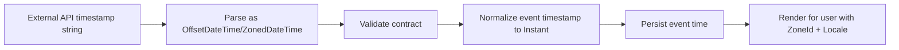
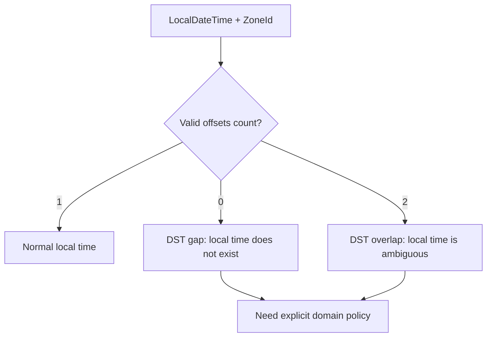

------
title: Learn Java Core Types, Data Model & Data APIs - Part 029
description: Time zone, DST, DateTimeFormatter, strict parsing, inclusive/exclusive ranges, persistence, API boundary, and legacy Date/Calendar interoperability in Java.
series: learn-java-core-types
seriesTitle: Learn Java Core Types, Data Model & Data APIs
order: 29
partTitle: Time Zone, DST, Formatting, and Parsing
tags:
- java
- java-time
- timezone
- dst
- datetimeformatter
- parsing
- formatting
- instant
- zoneddatetime
- production-bugs
date: 2026-06-27
---

# Part 029 — Time Zone, DST, Formatting, and Parsing

> Goal: mampu menangani time zone, DST, parsing, formatting, range query, persistence, dan API boundary secara defensible. Setelah bagian ini, kita tidak lagi memperlakukan waktu sebagai `String`, `long`, atau `LocalDateTime` yang kebetulan bisa disimpan, tetapi sebagai data dengan aturan kalender, aturan zona, dan invariant domain.

Part sebelumnya membangun peta `java.time`: `Instant`, `LocalDate`, `LocalTime`, `LocalDateTime`, `ZonedDateTime`, `OffsetDateTime`, `Duration`, `Period`, dan `Clock`.

Part ini masuk ke area yang biasanya membuat sistem production rusak:

- jadwal berulang melewati daylight saving time;
- parsing timestamp dari API external;
- query database dengan end-of-day yang salah;
- offset disangka sama dengan time zone;
- format display dicampur dengan format transport;
- legacy `Date`/`Calendar` bercampur dengan `java.time`;
- test gagal hanya di mesin CI karena default zone berbeda;
- audit trail kehilangan presisi atau zone context.

Core principle:

> **Time value must carry exactly the context required by its domain. Do not smuggle missing context through convention.**

---

## 1. Kaufman Deconstruction: Sub-Skill yang Harus Dikuasai

Untuk menguasai time-zone engineering di Java, pecah skill menjadi sub-skill berikut:

| Sub-skill | Output yang harus bisa dilakukan |
|---|---|
| Zone vs offset | Bisa menjelaskan kenapa `+07:00` bukan `Asia/Jakarta` |
| Instant vs local time | Bisa memisahkan event timestamp dari human schedule |
| DST gap/overlap | Bisa mendesain behavior saat local time tidak ada atau ambigu |
| Formatting | Bisa membedakan human display format dari machine transport format |
| Parsing | Bisa memilih strict parsing, resolver style, dan error handling |
| Range query | Bisa membangun half-open interval `[start, end)` |
| Persistence | Bisa memilih apa yang disimpan: instant, zone, offset, local date, atau composite |
| API boundary | Bisa membuat kontrak timestamp external yang stabil |
| Legacy interop | Bisa mengonversi `Date`, `Calendar`, `Timestamp` tanpa kehilangan makna |
| Testing | Bisa membuat test deterministic dengan `Clock` dan explicit `ZoneId` |

Target 20 jam untuk area ini bukan “hafal semua formatter symbol”, tetapi mampu membuat keputusan ini secara otomatis:

```java
// Machine event: use Instant
Instant submittedAt = clock.instant();

// Human deadline date in a legal/regulatory calendar: use LocalDate + ZoneId/rule when materialized
LocalDate responseDueDate = LocalDate.of(2026, 7, 15);
ZoneId jurisdictionZone = ZoneId.of("Asia/Jakarta");

// External ISO offset timestamp: use OffsetDateTime at API edge, normalize internally if needed
OffsetDateTime receivedAt = OffsetDateTime.parse("2026-07-01T10:15:30+07:00");
Instant normalized = receivedAt.toInstant();
```

---

## 2. ZoneId vs ZoneOffset

`ZoneOffset` adalah fixed offset dari UTC, misalnya:

```java
ZoneOffset.of("+07:00");
ZoneOffset.UTC;
```

`ZoneId` adalah region-based time zone, misalnya:

```java
ZoneId.of("Asia/Jakarta");
ZoneId.of("Europe/Paris");
ZoneId.of("America/New_York");
```

Perbedaan penting:

| Concept | Example | Bisa berubah menurut tanggal? | Punya DST/history rules? |
|---|---|---:|---:|
| `ZoneOffset` | `+07:00` | Tidak | Tidak |
| `ZoneId` | `Europe/Paris` | Ya | Ya |

Offset menjawab:

> Pada timestamp ini, lokal time berjarak berapa dari UTC?

Zone menjawab:

> Untuk region ini, aturan kalender dan offset apa yang berlaku pada tanggal/waktu tertentu?

Contoh:

```java
ZoneId paris = ZoneId.of("Europe/Paris");

Instant winter = Instant.parse("2026-01-15T12:00:00Z");
Instant summer = Instant.parse("2026-07-15T12:00:00Z");

System.out.println(winter.atZone(paris).getOffset()); // likely +01:00
System.out.println(summer.atZone(paris).getOffset()); // likely +02:00
```

Core rule:

> **Use `ZoneOffset` for a known offset in a timestamp. Use `ZoneId` for human schedules, jurisdictions, calendars, and recurring business rules.**

Bad model:

```java
record OfficeHours(LocalTime opensAt, ZoneOffset offset) {}
```

Better:

```java
record OfficeHours(LocalTime opensAt, ZoneId zone) {}
```

Why?

Because office hours are not “09:00 at offset +01:00 forever”. They are “09:00 in a region whose rules may produce different offsets over time”.

---

## 3. Instant, OffsetDateTime, ZonedDateTime: Three Different Questions

The same moment can be represented in multiple ways.

```java
Instant instant = Instant.parse("2026-07-01T03:00:00Z");

OffsetDateTime offsetDateTime = instant.atOffset(ZoneOffset.of("+07:00"));
ZonedDateTime zonedDateTime = instant.atZone(ZoneId.of("Asia/Jakarta"));
```

They answer different questions:

| Type | Question answered | Typical use |
|---|---|---|
| `Instant` | When did this happen on the global timeline? | audit, event log, expiry, ordering |
| `OffsetDateTime` | What local date-time and offset were stated? | API timestamp, SQL offset timestamp |
| `ZonedDateTime` | What local date-time under region rules? | schedule, meeting, jurisdiction time |

A clean internal architecture often does this:



But for schedules, do not normalize too early:

```java
record HearingSchedule(
    LocalDate date,
    LocalTime startTime,
    ZoneId jurisdictionZone
) {
    ZonedDateTime startsAt() {
        return ZonedDateTime.of(date, startTime, jurisdictionZone);
    }
}
```

A hearing at 09:00 in a jurisdiction is not just an instant until the local rule is applied. Keeping the domain shape prevents losing the reason behind the time.

---

## 4. DST Gap and Overlap

Daylight Saving Time creates two important anomalies:

1. **Gap**: a local time does not exist.
2. **Overlap**: a local time occurs twice.

This matters when converting local date-time to zoned date-time.

```java
LocalDateTime local = LocalDateTime.of(2026, 3, 29, 2, 30);
ZoneId zone = ZoneId.of("Europe/Paris");
ZonedDateTime zdt = local.atZone(zone);
```

In many DST-start transitions, a local time around 02:30 may be skipped. Java must resolve it somehow. That default behavior may be acceptable for UI convenience, but it may be unacceptable for legal deadlines, scheduling, billing, or regulatory actions.

Mental model:



Policy examples:

| Situation | Possible policy |
|---|---|
| User schedules at missing local time | Reject and ask user to choose valid time |
| System recurring job hits gap | Move forward to next valid time |
| Legal deadline at local midnight | Define statutory rule explicitly |
| Overlap creates two 01:30 values | Choose earlier/later offset explicitly or reject |

Do not hide policy inside default conversion.

A more explicit validation approach:

```java
import java.time.*;
import java.time.zone.ZoneRules;
import java.util.List;

static ZonedDateTime requireValidLocalTime(LocalDateTime local, ZoneId zone) {
    ZoneRules rules = zone.getRules();
    List<ZoneOffset> offsets = rules.getValidOffsets(local);

    if (offsets.isEmpty()) {
        throw new IllegalArgumentException("Local time falls in a DST gap: " + local + " " + zone);
    }
    if (offsets.size() > 1) {
        throw new IllegalArgumentException("Local time is ambiguous due to DST overlap: " + local + " " + zone);
    }
    return ZonedDateTime.ofLocal(local, zone, offsets.get(0));
}
```

For some domains, ambiguity is okay if captured:

```java
record ScheduledLocalTime(
    LocalDateTime localDateTime,
    ZoneId zone,
    ZoneOffset preferredOffset
) {}
```

This is heavier, but honest.

---

## 5. DateTimeFormatter: Formatting Is a Boundary Concern

`DateTimeFormatter` is used for printing and parsing date-time objects. Treat it as a boundary tool.

Good rule:

> **Store and compute using semantic time types. Format only at the edge.**

Bad:

```java
String submittedAt = LocalDateTime.now().format(DateTimeFormatter.ofPattern("dd/MM/yyyy HH:mm"));
```

Better:

```java
Instant submittedAt = clock.instant();
String display = DateTimeFormatter
    .ofPattern("dd MMM uuuu HH:mm")
    .withLocale(Locale.forLanguageTag("id-ID"))
    .withZone(ZoneId.of("Asia/Jakarta"))
    .format(submittedAt);
```

Formatter categories:

| Category | Example | Use |
|---|---|---|
| Standard ISO formatter | `DateTimeFormatter.ISO_INSTANT` | transport/logging |
| Pattern formatter | `ofPattern("dd MMM uuuu")` | human display |
| Localized formatter | `ofLocalizedDate(FormatStyle.LONG)` | locale-aware UI |
| Builder formatter | `DateTimeFormatterBuilder` | complex protocol parsing |

Important distinction:

```java
DateTimeFormatter.ISO_INSTANT.format(Instant.now());
DateTimeFormatter.ISO_OFFSET_DATE_TIME.format(OffsetDateTime.now());
DateTimeFormatter.ISO_ZONED_DATE_TIME.format(ZonedDateTime.now());
DateTimeFormatter.ISO_LOCAL_DATE.format(LocalDate.now());
```

Use a formatter that matches the type and contract.

---

## 6. Pattern Pitfalls: `yyyy` vs `uuuu`, `YYYY` vs `yyyy`

Date-time pattern letters matter.

Common production mistakes:

| Pattern | Meaning | Risk |
|---|---|---|
| `yyyy` | year-of-era | can interact badly with era handling |
| `uuuu` | proleptic year | usually better for ISO calendar parsing |
| `YYYY` | week-based-year | wrong around year boundary for calendar date |
| `MM` | month-of-year | correct for month |
| `mm` | minute-of-hour | wrong if intended month |
| `DD` | day-of-year | wrong if intended day-of-month |
| `dd` | day-of-month | correct for common date display |
| `HH` | hour 0-23 | 24-hour time |
| `hh` | clock-hour 1-12 | needs AM/PM marker |

Bug example:

```java
DateTimeFormatter wrong = DateTimeFormatter.ofPattern("YYYY-MM-dd");
DateTimeFormatter right = DateTimeFormatter.ofPattern("uuuu-MM-dd");
```

Around late December or early January, `YYYY` can produce surprising results because it refers to week-based-year, not calendar year.

Production rule:

> For ISO calendar dates, prefer built-in ISO formatters or `uuuu-MM-dd`.

---

## 7. Strict Parsing and ResolverStyle

Parsing is not formatting in reverse. Parsing must define how strict the input contract is.

Example:

```java
DateTimeFormatter strictDate = DateTimeFormatter
    .ofPattern("uuuu-MM-dd")
    .withResolverStyle(ResolverStyle.STRICT);

LocalDate date = LocalDate.parse("2026-02-28", strictDate);
```

With strict parsing, invalid dates should fail:

```java
LocalDate.parse("2026-02-31", strictDate); // exception
```

Resolver styles:

| Style | Meaning | Use |
|---|---|---|
| `STRICT` | must be valid and exact | APIs, legal data, financial/regulatory boundaries |
| `SMART` | sensible normalization | UI convenience with caution |
| `LENIENT` | broad arithmetic interpretation | rare; migration/import tools only with logging |

Safe API parser:

```java
static LocalDate parseIsoDate(String input) {
    try {
        return LocalDate.parse(input, DateTimeFormatter.ISO_LOCAL_DATE);
    } catch (DateTimeParseException e) {
        throw new IllegalArgumentException("Expected ISO date yyyy-MM-dd: " + input, e);
    }
}
```

Do not catch and silently default:

```java
// Dangerous: turns bad input into real domain data.
try {
    return LocalDate.parse(input);
} catch (DateTimeParseException e) {
    return LocalDate.now();
}
```

That creates data corruption.

---

## 8. Transport Format vs Display Format

Never use the same format just because it is visually convenient.

| Boundary | Recommended style |
|---|---|
| Machine API event timestamp | ISO-8601 with offset or instant |
| Internal event timestamp | `Instant` |
| Human date input | explicit locale/calendar validation |
| Human display | `DateTimeFormatter` with `Locale` and `ZoneId` |
| Database range query | typed parameters, not formatted strings |
| Logs | ISO instant or structured timestamp |

Example API request:

```json
{
  "submittedAt": "2026-07-01T03:15:30Z",
  "hearingDate": "2026-07-15",
  "jurisdictionZone": "Asia/Jakarta"
}
```

Domain model:

```java
record CaseSubmission(
    Instant submittedAt,
    LocalDate hearingDate,
    ZoneId jurisdictionZone
) {}
```

Display:

```java
String display = DateTimeFormatter
    .ofPattern("dd MMMM uuuu, HH:mm z")
    .withLocale(Locale.forLanguageTag("id-ID"))
    .withZone(ZoneId.of("Asia/Jakarta"))
    .format(submission.submittedAt());
```

The API contract should optimize for precision and interoperability. The UI should optimize for human readability.

---

## 9. Half-Open Intervals: `[start, end)`

For time ranges, use half-open intervals:

```text
[startInclusive, endExclusive)
```

Example: all events on a local date in a zone.

Wrong:

```java
LocalDate date = LocalDate.of(2026, 7, 1);
LocalDateTime start = date.atStartOfDay();
LocalDateTime end = date.atTime(23, 59, 59);
```

Problems:

- ignores nanoseconds;
- assumes day length is always 24 hours;
- ignores zone;
- misses records at `23:59:59.999999999`;
- breaks around DST.

Better:

```java
LocalDate date = LocalDate.of(2026, 7, 1);
ZoneId zone = ZoneId.of("Asia/Jakarta");

Instant start = date.atStartOfDay(zone).toInstant();
Instant end = date.plusDays(1).atStartOfDay(zone).toInstant();

// SQL style: occurred_at >= start AND occurred_at < end
```

Range value object:

```java
record InstantRange(Instant startInclusive, Instant endExclusive) {
    InstantRange {
        Objects.requireNonNull(startInclusive);
        Objects.requireNonNull(endExclusive);
        if (!startInclusive.isBefore(endExclusive)) {
            throw new IllegalArgumentException("start must be before end");
        }
    }

    boolean contains(Instant value) {
        return !value.isBefore(startInclusive) && value.isBefore(endExclusive);
    }
}
```

For date-only business ranges:

```java
record LocalDateRange(LocalDate startInclusive, LocalDate endExclusive) {
    LocalDateRange {
        Objects.requireNonNull(startInclusive);
        Objects.requireNonNull(endExclusive);
        if (!startInclusive.isBefore(endExclusive)) {
            throw new IllegalArgumentException("start must be before end");
        }
    }
}
```

Do not mix date range and instant range without explicit zone conversion.

---

## 10. Start of Day Is Not Always Midnight in the Naive Sense

`LocalDate.atStartOfDay()` returns a `LocalDateTime` at midnight:

```java
LocalDateTime localStart = date.atStartOfDay();
```

`LocalDate.atStartOfDay(zone)` returns a `ZonedDateTime` at the earliest valid time for that date in that zone:

```java
ZonedDateTime zonedStart = date.atStartOfDay(zone);
```

This matters when a time zone transition happens at midnight or creates a gap.

Rule:

> For local-date-to-instant conversion, prefer `date.atStartOfDay(zone).toInstant()` over manually creating `LocalDateTime` and attaching a zone later without policy awareness.

---

## 11. Duration vs Period Under Time Zones

`Duration` is machine time.

```java
Duration.ofHours(24);
```

`Period` is calendar time.

```java
Period.ofDays(1);
```

They are not always interchangeable.

```java
ZonedDateTime start = ZonedDateTime.of(
    2026, 3, 28, 12, 0, 0, 0,
    ZoneId.of("Europe/Paris")
);

ZonedDateTime plusOneDay = start.plus(Period.ofDays(1));
ZonedDateTime plus24Hours = start.plus(Duration.ofHours(24));
```

Around DST transitions, “same local time tomorrow” and “24 elapsed hours later” can differ.

| Domain meaning | Use |
|---|---|
| timeout 30 minutes | `Duration` |
| SLA elapsed time | `Duration` |
| subscription renewal next month | `Period` or calendar rule |
| hearing same local time next week | calendar scheduling with `ZonedDateTime`/`LocalDate` + `LocalTime` + `ZoneId` |
| retention after 7 elapsed days | clarify: machine duration or calendar days? |

Do not let method names hide meaning:

```java
// Ambiguous
expiresAt.plusDays(1);

// Better domain naming
deadlinePolicy.nextBusinessDateAfter(submittedDate);
retentionPolicy.expiresAfter(submittedInstant);
```

---

## 12. Recurring Schedules

Recurring schedules should usually store local components plus zone and recurrence rule, not only a precomputed `Instant`.

Example:

```java
record RecurringLocalSchedule(
    LocalTime time,
    ZoneId zone,
    DayOfWeek dayOfWeek
) {
    ZonedDateTime nextAfter(Instant now) {
        ZonedDateTime localNow = now.atZone(zone);
        LocalDate candidateDate = localNow.toLocalDate();

        int delta = Math.floorMod(dayOfWeek.getValue() - candidateDate.getDayOfWeek().getValue(), 7);
        LocalDate candidate = candidateDate.plusDays(delta);
        ZonedDateTime scheduled = ZonedDateTime.of(candidate, time, zone);

        if (!scheduled.toInstant().isAfter(now)) {
            scheduled = ZonedDateTime.of(candidate.plusWeeks(1), time, zone);
        }
        return scheduled;
    }
}
```

This says:

> Every Monday at 09:00 in this zone.

Not:

> Every 168 elapsed hours after the last run.

Both may be valid. They are different business rules.

---

## 13. Persistence Strategy

Persistence design must preserve domain meaning.

| Domain data | Persist as | Why |
|---|---|---|
| event happened at | `Instant` / UTC timestamp | global ordering |
| user-chosen local appointment | local date, local time, zone id | preserves schedule rule |
| external submitted timestamp with offset | normalized instant plus original string/offset if audit requires | traceability |
| due date with no time | `DATE` / `LocalDate` | avoid fake midnight |
| recurring rule | local components + zone + rule | future materialization |
| report period | `LocalDate` range | calendar semantics |

Dangerous persistence:

```java
// Stores local time without zone; cannot reconstruct instant safely.
LocalDateTime submittedAt;
```

Better for events:

```java
Instant submittedAt;
```

Better for future schedule:

```java
record AppointmentDraft(LocalDate date, LocalTime time, ZoneId zone) {}
```

Better for audit-heavy external input:

```java
record ReceivedTimestamp(
    Instant normalizedInstant,
    String originalText,
    ZoneOffset suppliedOffset
) {}
```

---

## 14. Database Query Boundaries

Use typed parameters where possible. Avoid string formatting into SQL.

Good conceptual query:

```sql
SELECT *
FROM case_event
WHERE occurred_at >= :startInclusive
  AND occurred_at <  :endExclusive
ORDER BY occurred_at ASC
```

Java boundary:

```java
Instant startInclusive = date.atStartOfDay(zone).toInstant();
Instant endExclusive = date.plusDays(1).atStartOfDay(zone).toInstant();
```

Anti-pattern:

```java
String day = date.format(DateTimeFormatter.ofPattern("dd/MM/yyyy"));
String sql = "WHERE format(occurred_at, 'dd/MM/yyyy') = '" + day + "'";
```

Problems:

- loses index usage;
- mixes display format with query logic;
- risks locale issues;
- unclear zone conversion;
- prone to SQL injection if generalized.

---

## 15. API Boundary Contract

A good time API contract is explicit:

```json
{
  "eventOccurredAt": "2026-07-01T03:15:30Z",
  "effectiveDate": "2026-07-01",
  "scheduledLocalDateTime": "2026-07-01T09:00:00",
  "scheduledZone": "Asia/Jakarta"
}
```

Do not use ambiguous fields:

```json
{
  "date": "01/07/26",
  "time": "09:00",
  "timezone": "+07:00"
}
```

Problems:

- date order ambiguous;
- two-digit year;
- offset called timezone;
- no stated semantics;
- no DST policy.

Better DTOs:

```java
record EventDto(String occurredAt) {}
record DueDateDto(String dueDate) {}
record ScheduleDto(String localDateTime, String zoneId) {}
```

Then parse explicitly:

```java
Instant occurredAt = Instant.parse(dto.occurredAt());
LocalDate dueDate = LocalDate.parse(dto.dueDate(), DateTimeFormatter.ISO_LOCAL_DATE);
LocalDateTime local = LocalDateTime.parse(dto.localDateTime(), DateTimeFormatter.ISO_LOCAL_DATE_TIME);
ZoneId zone = ZoneId.of(dto.zoneId());
```

---

## 16. Locale and Calendar Display

Human display must use `Locale`.

```java
DateTimeFormatter formatter = DateTimeFormatter
    .ofPattern("EEEE, dd MMMM uuuu", Locale.forLanguageTag("id-ID"));

String text = LocalDate.of(2026, 7, 1).format(formatter);
```

Avoid:

```java
DateTimeFormatter.ofPattern("dd MMMM yyyy"); // default locale hidden
```

Default locale is process/environment state. It can differ between developer laptop, CI, container, and production host.

Better:

```java
Locale displayLocale = Locale.forLanguageTag(user.localeTag());
ZoneId displayZone = ZoneId.of(user.zoneId());
```

Then render.

---

## 17. Default Zone and Default Locale Are Hidden Global Inputs

These are dangerous:

```java
LocalDateTime.now();
ZonedDateTime.now();
ZoneId.systemDefault();
Locale.getDefault();
```

They are not always wrong, but they are hidden dependencies.

For domain logic:

```java
class CaseDeadlineService {
    private final Clock clock;
    private final ZoneId jurisdictionZone;

    CaseDeadlineService(Clock clock, ZoneId jurisdictionZone) {
        this.clock = Objects.requireNonNull(clock);
        this.jurisdictionZone = Objects.requireNonNull(jurisdictionZone);
    }

    LocalDate responseDueDate(int days) {
        LocalDate today = LocalDate.now(clock.withZone(jurisdictionZone));
        return today.plusDays(days);
    }
}
```

In tests:

```java
Clock fixed = Clock.fixed(
    Instant.parse("2026-07-01T03:00:00Z"),
    ZoneId.of("Asia/Jakarta")
);
```

Core rule:

> Hidden time input makes deterministic business logic impossible.

---

## 18. Legacy Interop: Date, Calendar, Timestamp

Legacy types still appear in old frameworks and JDBC code.

Important mental model:

| Legacy type | Issue |
|---|---|
| `java.util.Date` | name is misleading; represents instant-like timestamp, mutable |
| `java.util.Calendar` | mutable, zone/locale heavy, old API design |
| `java.sql.Date` | date-only-ish JDBC type with legacy complications |
| `java.sql.Timestamp` | timestamp with nanos but tricky equality/history |

Interop examples:

```java
Date legacyDate = Date.from(instant);
Instant instant = legacyDate.toInstant();
```

```java
GregorianCalendar calendar = GregorianCalendar.from(zonedDateTime);
ZonedDateTime zdt = calendar.toZonedDateTime();
```

JDBC with modern drivers often supports `java.time` types directly:

```java
preparedStatement.setObject(1, instant);
preparedStatement.setObject(2, localDate);
preparedStatement.setObject(3, offsetDateTime);
```

But always verify database column semantics and driver behavior.

Boundary rule:

> Convert legacy types at the edge. Do not let them leak into domain model.

---

## 19. Failure Mode: Offset Stored Without Zone for Future Schedule

Bug:

```java
record Meeting(LocalDateTime localTime, ZoneOffset offset) {}
```

This can represent a past timestamp-ish value, but it is weak for future scheduling.

Suppose meeting is “every Monday 09:00 Europe/Paris”. If you store only `+01:00`, summer meetings may be wrong.

Better:

```java
record Meeting(LocalDate date, LocalTime time, ZoneId zone) {
    ZonedDateTime startsAt() {
        return ZonedDateTime.of(date, time, zone);
    }
}
```

If you also need audit of what user saw:

```java
record Meeting(
    LocalDate date,
    LocalTime time,
    ZoneId zone,
    Instant createdAt,
    ZoneOffset offsetAtCreation
) {}
```

Separate schedule meaning from audit metadata.

---

## 20. Failure Mode: LocalDateTime for Event Timestamp

Bad:

```java
record CaseEvent(String type, LocalDateTime occurredAt) {}
```

Question:

> Occurred where?

If the event is a real occurrence in a distributed system, use `Instant`.

```java
record CaseEvent(String type, Instant occurredAt) {}
```

Render later:

```java
String display = DateTimeFormatter
    .ofPattern("dd MMM uuuu HH:mm")
    .withLocale(locale)
    .withZone(userZone)
    .format(event.occurredAt());
```

`LocalDateTime` is acceptable when the data really is a local date-time before zone resolution:

```java
record UserEnteredAppointmentTime(LocalDateTime localDateTime) {}
```

But it is not enough for global event ordering.

---

## 21. Failure Mode: Date-Only Value Converted to Fake Instant Too Early

Bad:

```java
Instant birthDate = LocalDate.of(1990, 5, 12)
    .atStartOfDay(ZoneId.of("UTC"))
    .toInstant();
```

A birth date is not an instant. It is a calendar date.

Better:

```java
record Person(LocalDate birthDate) {}
```

Only convert to instant if a downstream system requires it, and label that conversion as a boundary artifact.

---

## 22. Failure Mode: Stringly-Typed Time

Bad:

```java
record Event(String occurredAt) {}
```

Problems:

- no compile-time semantics;
- repeated parsing;
- inconsistent formats;
- invalid states live too long;
- timezone semantics are hidden;
- sorting may be lexical, not chronological.

Better:

```java
record Event(Instant occurredAt) {}
```

At boundary:

```java
record EventRequest(String occurredAt) {
    Event toDomain() {
        return new Event(Instant.parse(occurredAt));
    }
}
```

String is fine at wire boundary. It is poor as domain time.

---

## 23. Regulatory Case Example: Filing Deadline

Problem:

- A complaint is filed at an instant.
- Response is due 14 calendar days after filing date in jurisdiction zone.
- Deadline expires at end of due date in that jurisdiction.

Model:

```java
record FilingPolicy(ZoneId jurisdictionZone, int responseDays) {
    LocalDate filingDate(Instant filedAt) {
        return filedAt.atZone(jurisdictionZone).toLocalDate();
    }

    LocalDate responseDueDate(Instant filedAt) {
        return filingDate(filedAt).plusDays(responseDays);
    }

    Instant responseDeadlineExclusive(Instant filedAt) {
        return responseDueDate(filedAt)
            .plusDays(1)
            .atStartOfDay(jurisdictionZone)
            .toInstant();
    }
}
```

Notice the types:

- filing event is `Instant`;
- jurisdiction date is `LocalDate`;
- jurisdiction zone is `ZoneId`;
- deadline boundary is `Instant` for enforcement comparisons;
- range is half-open.

Use:

```java
boolean isLate(Instant submittedAt, Instant filedAt, FilingPolicy policy) {
    return !submittedAt.isBefore(policy.responseDeadlineExclusive(filedAt));
}
```

This is much more defensible than:

```java
LocalDateTime due = LocalDateTime.now().plusDays(14).withHour(23).withMinute(59);
```

---

## 24. Test Matrix for Time-Zone Code

Time-zone code should not be tested only in your local zone.

Minimum matrix:

| Scenario | Example |
|---|---|
| no DST zone | `Asia/Jakarta` |
| DST zone | `Europe/Paris`, `America/New_York` |
| UTC | `UTC` |
| positive offset | `Asia/Tokyo` |
| negative offset | `America/Los_Angeles` |
| date near year boundary | Dec 31 / Jan 1 |
| DST gap date | spring transition |
| DST overlap date | autumn transition |
| leap year | Feb 29 |
| month-end | Jan 31 plus one month |

Example parameterized test idea:

```java
static Stream<ZoneId> zones() {
    return Stream.of(
        ZoneId.of("UTC"),
        ZoneId.of("Asia/Jakarta"),
        ZoneId.of("Europe/Paris"),
        ZoneId.of("America/New_York")
    );
}
```

Assertions should test domain behavior, not just object equality.

---

## 25. Operational Checklist

Before merging time-zone/date-time code, ask:

1. Is this value an event timestamp, date-only value, local schedule, or display string?
2. Are we using `Instant` for global event ordering?
3. Are we using `LocalDate` for date-only domain values?
4. Are future human schedules storing `ZoneId`, not just `ZoneOffset`?
5. Are ranges modeled as `[startInclusive, endExclusive)`?
6. Are date-to-instant conversions using an explicit zone?
7. Is parsing strict at machine/API boundaries?
8. Is display formatting separated from persistence/transport?
9. Are default zone and locale avoided in domain logic?
10. Are DST gap/overlap policies explicit where relevant?
11. Are legacy date/time types converted at the edge?
12. Do tests cover at least one DST and one non-DST zone?

---

## 26. Practice Drill

Implement a small `DeadlineCalculator` for a regulatory case system.

Requirements:

1. Filing event is captured as `Instant`.
2. Jurisdiction zone is configurable as `ZoneId`.
3. Due date is `N` calendar days after filing date in that jurisdiction.
4. Deadline is exclusive start of the day after due date.
5. Public method:

```java
record DeadlineResult(
    LocalDate filingDate,
    LocalDate dueDate,
    Instant deadlineExclusive
) {}
```

6. Write tests for:
   - `Asia/Jakarta`;
   - `Europe/Paris` near DST transition;
   - Dec 31 crossing into next year;
   - leap year Feb 29;
   - submission exactly at deadline boundary.

Expected invariant:

```java
submittedAt.isBefore(deadlineExclusive) == true  // on time
!submittedAt.isBefore(deadlineExclusive) == true // late
```

This drill forces separation of `Instant`, `LocalDate`, `ZoneId`, and half-open interval semantics.

---

## 27. Summary

Time-zone correctness is not about memorizing API names. It is about preserving domain meaning:

- `Instant` for global event time;
- `LocalDate` for calendar date without time;
- `LocalTime` for time of day;
- `LocalDateTime` for unresolved local date-time;
- `ZonedDateTime` for region-rule-aware time;
- `OffsetDateTime` for timestamp with explicit offset;
- `ZoneId` for region rules;
- `ZoneOffset` for fixed offset;
- `Duration` for elapsed machine time;
- `Period` for calendar amount;
- `DateTimeFormatter` for boundaries;
- `[start, end)` for ranges.

The main invariant:

> **Do not erase time context before the domain has finished using it.**

If a value needs zone rules, keep `ZoneId`. If it needs global ordering, normalize to `Instant`. If it is just a date, keep `LocalDate`. If it is display text, format it at the edge.

