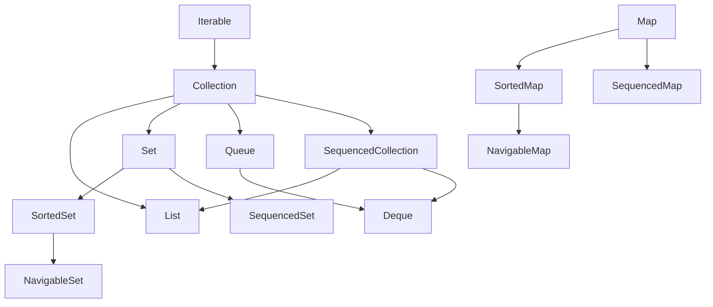
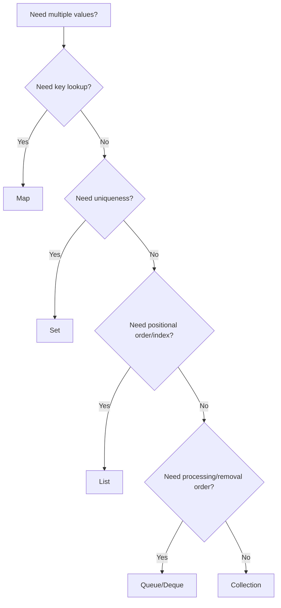

------
title: Learn Java Core Types, Data Model & Data APIs - Part 030
description: Java Collections semantics for Collection, List, Set, Map, Queue, Deque, ordering, duplicates, null handling, optional operations, iterators, and production collection contracts.
series: learn-java-core-types
seriesTitle: Learn Java Core Types, Data Model & Data APIs
order: 30
partTitle: Collections Semantics: List, Set, Map, Queue
tags:
- java
- collections
- list
- set
- map
- queue
- deque
- iterator
- equality
- data-modeling
date: 2026-06-27
---

# Part 030 — Collections Semantics: List, Set, Map, Queue

> Goal: memahami Java Collections sebagai kontrak semantik data, bukan sekadar container. Setelah bagian ini, kita memilih `List`, `Set`, `Map`, `Queue`, dan `Deque` berdasarkan meaning: ordering, uniqueness, key lookup, processing order, null policy, mutability, iteration, dan failure behavior.

Banyak engineer memilih collection seperti ini:

```java
List<String> ids = new ArrayList<>();
```

Karena `ArrayList` familiar.

Top engineer mulai dari pertanyaan:

- Apakah urutan penting?
- Apakah duplikasi valid?
- Apakah lookup by key dominan?
- Apakah consumer memproses item satu per satu?
- Apakah null boleh masuk?
- Apakah collection ini mutable atau snapshot?
- Apakah iteration order bagian dari kontrak?
- Apakah equality elemen sudah benar?
- Apakah operasi gagal dengan exception atau special value?
- Apakah caller boleh memodifikasi hasil?

Collection adalah bagian dari model domain. Salah memilih collection bisa membuat invariant domain hilang.

---

## 1. Kaufman Deconstruction: Sub-Skill Collections

Untuk menguasai collections di level production, pecah menjadi sub-skill berikut:

| Sub-skill | Kemampuan |
|---|---|
| Semantic selection | Memilih interface berdasarkan meaning, bukan habit |
| Equality dependency | Tahu kapan `equals`, `hashCode`, dan comparator menentukan behavior |
| Ordering model | Membedakan insertion order, encounter order, sorted order, access order, no order |
| Mutability boundary | Membedakan mutable, unmodifiable view, immutable snapshot |
| Null policy | Tahu apakah null valid sebagai element/key/value |
| Iterator semantics | Mengerti fail-fast, remove, concurrent modification risk |
| Optional operations | Tahu operasi bisa unsupported pada beberapa collection |
| API exposure | Bisa mengembalikan collection tanpa membocorkan internal state |
| Performance awareness | Memahami implikasi besar tanpa premature micro-optimization |
| Domain invariant | Menggunakan collection untuk menjaga uniqueness, membership, lookup, dan queue semantics |

Part ini fokus ke **semantics**. Part berikutnya akan fokus ke **implementations and trade-offs**.

---

## 2. Collections Framework Mental Model

Java Collections Framework punya beberapa interface utama:



Simplified selection:



Core rule:

> **Program to the narrowest interface that expresses the contract you need.**

Not always:

```java
ArrayList<User> users
```

Prefer in API:

```java
List<User> users          // order/index matters
Set<Role> roles           // uniqueness matters
Map<UserId, User> usersById // key lookup matters
Queue<Job> pendingJobs    // processing order matters
Collection<Event> events  // only group semantics matter
```

---

## 3. Collection: Group of Elements

`Collection<E>` is the root interface for most element containers.

It says:

> This is a group of elements.

It does **not** say:

- order is meaningful;
- duplicates are allowed;
- indexing exists;
- lookup is fast;
- null is allowed;
- mutation is supported.

Use `Collection` when you only need group-level operations:

```java
void publishAll(Collection<DomainEvent> events) {
    for (DomainEvent event : events) {
        publisher.publish(event);
    }
}
```

This API does not require order, uniqueness, or indexing. If order matters, say so:

```java
void publishInOrder(List<DomainEvent> events) { ... }
```

If uniqueness matters, say so:

```java
void assignRoles(Set<Role> roles) { ... }
```

Do not accept `List` when you only need `Collection`. It forces caller to adapt data unnecessarily.

---

## 4. List: Ordered Sequence with Positional Access

`List<E>` means:

- ordered sequence;
- duplicates usually allowed;
- positional access by index;
- order is part of equality;
- operations may be index-sensitive.

Example:

```java
List<String> steps = List.of("CREATED", "VALIDATED", "APPROVED");
```

Here `List` is correct because sequence matters.

`List` equality is order-sensitive:

```java
List.of("A", "B").equals(List.of("B", "A")); // false
```

Use cases:

| Use case | Why List |
|---|---|
| ordered workflow steps | sequence matters |
| UI rows | display order matters |
| parsed CSV columns | index/position matters |
| ordered validation errors | stable presentation matters |
| stream result with encounter order | order preserved |

Bad use of `List`:

```java
List<Role> roles;
```

If a user cannot have duplicate roles, `List` does not encode the invariant.

Better:

```java
Set<Role> roles;
```

If role order matters for display but uniqueness also matters, you may need a sequenced set or explicit model.

---

## 5. Set: Uniqueness by Equality

`Set<E>` means:

- no duplicate elements;
- uniqueness is defined by `equals`/`hashCode` for hash-based sets;
- sorted sets may use comparator ordering;
- order may or may not exist depending on implementation;
- set equality is generally based on membership, not iteration order.

Example:

```java
Set<Permission> permissions = Set.of(
    Permission.READ_CASE,
    Permission.UPDATE_CASE
);
```

This encodes uniqueness.

But `Set` is only as correct as equality.

```java
record Permission(String code) {}
```

This is fine because record equality is component-based.

Entity example:

```java
class User {
    private Long id;
    private String email;
}
```

If `equals` uses mutable email, placing `User` in `HashSet` can become dangerous.

Core rule:

> **A Set is an equality-dependent invariant. Bad equality means bad Set semantics.**

---

## 6. Set Equality vs Iteration Order

Two sets can be equal even if they iterate differently:

```java
Set<String> a = Set.of("A", "B");
Set<String> b = Set.of("B", "A");

System.out.println(a.equals(b)); // true
```

Do not infer display order from `Set` unless the specific type contract says it has order.

If display order matters:

```java
List<Role> sorted = roles.stream()
    .sorted(Comparator.comparing(Role::code))
    .toList();
```

Or choose an ordered implementation intentionally in Part 031.

---

## 7. Map: Key-to-Value Association

`Map<K, V>` is not a `Collection`, but part of the Collections Framework.

It means:

- each key maps to at most one value;
- key uniqueness is based on key equality/comparator;
- values may repeat;
- key lookup is core semantic operation;
- iteration order depends on implementation;
- null key/value policy depends on implementation.

Example:

```java
Map<CaseId, CaseFile> casesById;
```

This says lookup by `CaseId` matters.

Bad model:

```java
List<CaseFile> cases;

CaseFile find(CaseId id) {
    return cases.stream()
        .filter(c -> c.id().equals(id))
        .findFirst()
        .orElseThrow();
}
```

If lookup by ID is central, model it as map:

```java
Map<CaseId, CaseFile> casesById;
```

However, do not use `Map` when the value relationship needs domain behavior.

Weak:

```java
Map<String, Object> caseData;
```

Better:

```java
record CaseFile(
    CaseId id,
    CaseStatus status,
    List<CaseEvent> events
) {}
```

Map is good for association. It is bad as a substitute for domain modeling.

---

## 8. Map Key Discipline

A map key must be stable under its equality/hash semantics.

Bad:

```java
class MutableKey {
    String value;

    @Override
    public boolean equals(Object o) { ... }

    @Override
    public int hashCode() { return value.hashCode(); }
}

Map<MutableKey, String> map = new HashMap<>();
MutableKey key = new MutableKey("A");
map.put(key, "value");
key.value = "B";
map.get(key); // may fail
```

Better:

```java
record CaseId(String value) {
    CaseId {
        Objects.requireNonNull(value);
        if (value.isBlank()) throw new IllegalArgumentException("blank case id");
    }
}
```

Stable key rule:

> **Map keys should be immutable value objects or stable identity tokens.**

---

## 9. Queue: Elements Awaiting Processing

`Queue<E>` means:

- elements are held prior to processing;
- insertion, extraction, and inspection are core operations;
- ordering policy depends on implementation;
- methods usually come in exception-returning and special-value-returning pairs.

Typical method pairs:

| Operation | Throws on failure | Special value on failure |
|---|---|---|
| insert | `add(e)` | `offer(e)` |
| remove | `remove()` | `poll()` |
| inspect | `element()` | `peek()` |

Example:

```java
Queue<Job> queue = new ArrayDeque<>();
queue.offer(new Job("validate-case"));

Job job = queue.poll();
if (job != null) {
    process(job);
}
```

Use `Queue` when the data structure represents processing semantics, not merely a collection.

Bad:

```java
List<Job> jobs = new ArrayList<>();
Job next = jobs.remove(0);
```

This hides queue semantics and may have poor implementation behavior depending on list type.

---

## 10. Deque: Double-Ended Queue

`Deque<E>` supports insertion/removal at both ends.

Use cases:

| Use case | Operation |
|---|---|
| stack | `push`, `pop`, `peek` |
| FIFO queue | `offerLast`, `pollFirst` |
| work deque | add/remove both ends |
| sliding window | remove old from front, add new to back |

Prefer `Deque` over legacy `Stack`.

```java
Deque<String> stack = new ArrayDeque<>();
stack.push("A");
stack.push("B");
System.out.println(stack.pop()); // B
```

For clarity, you can use explicit end methods:

```java
Deque<Job> jobs = new ArrayDeque<>();
jobs.offerLast(job);
Job next = jobs.pollFirst();
```

This reads as FIFO.

---

## 11. Ordering: A Taxonomy

“Ordered” can mean several different things.

| Ordering type | Meaning |
|---|---|
| positional order | list index order |
| insertion order | order elements were inserted |
| sorted order | comparator/natural order |
| access order | recent access changes order |
| encounter order | stream/source iteration order |
| priority order | queue priority determines removal |
| no guaranteed order | iteration order not part of contract |

Do not write APIs that vaguely say “ordered” without specifying which one.

Better names:

```java
List<ApprovalStep> stepsInExecutionOrder;
Set<Role> assignedRoles;
Map<CaseId, CaseFile> casesById;
Queue<Notification> pendingNotifications;
```

The variable name should reinforce collection semantics.

---

## 12. Sequenced Collections

Modern Java includes sequenced collection interfaces to express first/last encounter order more directly.

Conceptually:

- `SequencedCollection` has a well-defined encounter order and operations at both ends;
- `SequencedSet` is a set with encounter order;
- `SequencedMap` is a map with encounter order.

This matters because many real collections have order but are not lists.

Example concept:

```java
SequencedCollection<CaseEvent> events = ...;
CaseEvent first = events.getFirst();
CaseEvent last = events.getLast();
SequencedCollection<CaseEvent> reversed = events.reversed();
```

Use it when the contract is:

> There is a meaningful first and last element, but the data is not necessarily indexed like a list.

It helps avoid abusing `List` just to get first/last semantics.

---

## 13. Null Policy

Collections differ in null support.

Some allow null. Some do not. Some allow null values but not null keys. Some reject null for concurrency or ambiguity reasons.

Do not design APIs where null elements are normal unless you have a strong reason.

Bad:

```java
List<CaseEvent> events = new ArrayList<>();
events.add(null);
```

Now every consumer must defend:

```java
for (CaseEvent event : events) {
    if (event != null) {
        handle(event);
    }
}
```

Better:

```java
List<CaseEvent> events = List.copyOf(nonNullEvents);
```

or validate:

```java
static <T> List<T> requireNoNulls(Collection<T> input) {
    for (T value : input) {
        Objects.requireNonNull(value, "collection contains null element");
    }
    return List.copyOf(input);
}
```

Core rule:

> **Null elements turn every collection operation into partial failure handling. Prefer absence at collection level: empty collection, Optional return, or explicit domain marker.**

---

## 14. Empty Collection vs Null Collection

Return empty collection, not null.

Bad:

```java
List<Violation> violations() {
    return hasViolations ? violations : null;
}
```

Better:

```java
List<Violation> violations() {
    return violations;
}
```

where invariant says:

```java
this.violations = List.copyOf(violations);
```

Empty list means:

> There are zero elements.

Null means:

> The collection reference itself is absent/unknown/uninitialized.

Those are different. Most domain methods should not expose null collection references.

---

## 15. Optional Operations

Collection interfaces define operations that some implementations may not support.

Example:

```java
List<String> names = List.of("A", "B");
names.add("C"); // UnsupportedOperationException
```

This is not a type-system violation. `List` permits implementations that reject mutation.

Therefore, API contracts must say whether caller may mutate.

Ambiguous:

```java
List<Item> items();
```

Better:

```java
List<Item> items(); // returns immutable snapshot
```

Or:

```java
void addItem(Item item);
void removeItem(Item item);
```

Expose behavior instead of exposing mutable collection internals.

---

## 16. Unmodifiable View vs Immutable Snapshot

Important distinction:

| Concept | Meaning |
|---|---|
| unmodifiable view | caller cannot mutate through this reference, but backing collection may change |
| immutable snapshot | contents will not change after construction |

Example of view risk:

```java
List<String> mutable = new ArrayList<>();
List<String> view = Collections.unmodifiableList(mutable);

mutable.add("A");
System.out.println(view); // [A]
```

Snapshot:

```java
List<String> snapshot = List.copyOf(mutable);
mutable.add("B");
System.out.println(snapshot); // unchanged
```

For domain objects, prefer snapshots:

```java
record CaseFile(List<CaseEvent> events) {
    CaseFile {
        events = List.copyOf(events);
    }
}
```

Remember: this is shallow. If elements are mutable, they can still change.

---

## 17. Iterator Semantics and Concurrent Modification

Enhanced for-loop uses an iterator:

```java
for (String item : items) {
    ...
}
```

Many mutable collections are fail-fast: if structurally modified outside the iterator during iteration, they may throw `ConcurrentModificationException`.

Bad:

```java
for (String item : items) {
    if (item.isBlank()) {
        items.remove(item); // risk
    }
}
```

Better:

```java
items.removeIf(String::isBlank);
```

Or explicit iterator:

```java
Iterator<String> iterator = items.iterator();
while (iterator.hasNext()) {
    if (iterator.next().isBlank()) {
        iterator.remove();
    }
}
```

Important: fail-fast is a bug detector, not a concurrency guarantee.

Do not rely on `ConcurrentModificationException` for correctness.

---

## 18. Structural Modification

Structural modification usually means changing collection shape:

- adding element;
- removing element;
- clearing collection;
- changing map key membership.

Changing mutable state inside an element is not necessarily structural to the collection, but can still break semantics.

Example:

```java
Set<User> users = new HashSet<>();
User user = new User("old@example.com");
users.add(user);
user.setEmail("new@example.com"); // if email participates in hashCode, set is corrupted
```

Collection did not structurally change. Its invariants may still be broken.

---

## 19. Equality Dependencies by Collection Type

| Collection | Depends on |
|---|---|
| `List.contains` | element `equals` |
| `List.equals` | order + element equality |
| `Set` | element equality/hash or comparator |
| `Map` | key equality/hash or comparator |
| sorted collections | comparator/natural ordering |
| priority queue | comparator/natural ordering for priority |

This is why Part 012 matters before Collections.

Example:

```java
record CaseId(String value) {}
record CaseFile(CaseId id, String title) {}

Map<CaseId, CaseFile> byId = new HashMap<>();
```

This is safe because `CaseId` is immutable and has value equality.

---

## 20. List vs Set vs Map Decision Examples

### Example 1: User roles

Question: can a user have duplicate roles?

No.

```java
record UserAccess(Set<Role> roles) {
    UserAccess {
        roles = Set.copyOf(roles);
    }
}
```

### Example 2: Approval route

Question: does order matter?

Yes.

```java
record ApprovalRoute(List<ApprovalStep> steps) {
    ApprovalRoute {
        steps = List.copyOf(steps);
        if (steps.isEmpty()) throw new IllegalArgumentException("approval route must not be empty");
    }
}
```

### Example 3: Cases by ID

Question: is lookup by ID core?

Yes.

```java
record CaseIndex(Map<CaseId, CaseFile> casesById) {
    CaseIndex {
        casesById = Map.copyOf(casesById);
    }

    CaseFile require(CaseId id) {
        CaseFile file = casesById.get(id);
        if (file == null) throw new NoSuchElementException("case not found: " + id);
        return file;
    }
}
```

### Example 4: Pending jobs

Question: are items processed and removed in order?

Yes.

```java
Queue<Job> pendingJobs = new ArrayDeque<>();
```

---

## 21. Collection as Domain Boundary

Avoid exposing mutable internals:

```java
class CaseFile {
    private final List<CaseEvent> events = new ArrayList<>();

    List<CaseEvent> events() {
        return events; // leak
    }
}
```

Caller can now mutate the aggregate directly:

```java
caseFile.events().clear();
```

Better:

```java
class CaseFile {
    private final List<CaseEvent> events = new ArrayList<>();

    List<CaseEvent> events() {
        return List.copyOf(events);
    }

    void recordEvent(CaseEvent event) {
        events.add(Objects.requireNonNull(event));
    }
}
```

Even better if event ordering is central:

```java
SequencedCollection<CaseEvent> eventsView() {
    return Collections.unmodifiableSequencedCollection(events);
}
```

Choose based on JDK/API availability and contract.

---

## 22. Collection Return Types in APIs

Return type communicates allowed assumptions.

| Return type | Caller can assume |
|---|---|
| `Iterable<T>` | can iterate once or more depending implementation; minimal contract |
| `Collection<T>` | group of elements, size maybe available |
| `List<T>` | order and index matter |
| `Set<T>` | uniqueness by equality |
| `SortedSet<T>` | sorted membership |
| `Map<K,V>` | key lookup |
| `Queue<T>` | processing semantics |
| `Stream<T>` | one-shot pipeline, not collection |

Do not return `Stream` when caller needs collection semantics like size, multiple traversal, or stable snapshot.

Bad:

```java
Stream<CaseEvent> events();
```

Maybe okay for a large lazy source, but poor for aggregate state.

Better:

```java
List<CaseEvent> events();
```

or:

```java
void forEachEvent(Consumer<CaseEvent> consumer);
```

based on contract.

---

## 23. Defensive Copy on Input and Output

Input copy:

```java
record Policy(Set<Permission> permissions) {
    Policy {
        permissions = Set.copyOf(permissions);
    }
}
```

Output copy:

```java
class Policy {
    private final Set<Permission> permissions;

    Set<Permission> permissions() {
        return permissions; // okay if already immutable snapshot
    }
}
```

If internal collection is mutable:

```java
List<Item> items() {
    return List.copyOf(items);
}
```

Avoid repeated copies on hot paths without considering cost, but start with correctness. Optimize with documented ownership when needed.

---

## 24. `contains` Is a Semantic Operation

`contains` depends on equality.

```java
permissions.contains(Permission.UPDATE_CASE);
```

This reads well if `Permission` equality is stable.

But:

```java
users.contains(new User("alice@example.com"));
```

This is meaningful only if `User.equals` is designed around email.

For entity lookup, prefer explicit key:

```java
Map<UserId, User> usersById;
usersById.containsKey(userId);
```

Do not let collection operations hide domain identity decisions.

---

## 25. Sorting Is Not Ordering

A collection may have encounter order without being sorted.

```java
List<CaseEvent> events = ...; // chronological insertion order maybe
```

If chronological order is required, enforce it.

```java
List<CaseEvent> chronological = events.stream()
    .sorted(Comparator.comparing(CaseEvent::occurredAt))
    .toList();
```

But if the domain invariant says events must always be chronological, enforce at insertion time or construction time.

```java
record EventLog(List<CaseEvent> events) {
    EventLog {
        events = List.copyOf(events);
        for (int i = 1; i < events.size(); i++) {
            if (events.get(i).occurredAt().isBefore(events.get(i - 1).occurredAt())) {
                throw new IllegalArgumentException("events must be chronological");
            }
        }
    }
}
```

Sorting at display time is presentation. Sorting as invariant is domain modeling.

---

## 26. Duplicate Handling Is a Domain Policy

When duplicates appear, decide explicitly.

Possible policies:

| Policy | Collection/API |
|---|---|
| duplicates are valid | `List` |
| duplicates are invalid and should fail | validate while constructing `Set` |
| duplicates should collapse | `Set` or `Map` merge |
| duplicates should be counted | `Map<T, Integer>` or domain type |
| duplicates should keep last value | `Map.merge` / collector merge policy |
| duplicates should be audited | custom result object |

Example: fail on duplicate role assignment:

```java
static Set<Role> requireUniqueRoles(List<Role> roles) {
    Set<Role> unique = new HashSet<>(roles);
    if (unique.size() != roles.size()) {
        throw new IllegalArgumentException("duplicate roles are not allowed");
    }
    return Set.copyOf(unique);
}
```

Do not silently use `Set.copyOf` if duplicates indicate upstream data corruption.

---

## 27. Collection Normalization

At boundaries, normalize collection data:

```java
record CreateUserRequest(List<String> roleCodes) {}
```

Domain conversion:

```java
record UserRoles(Set<Role> roles) {
    static UserRoles from(CreateUserRequest request) {
        Set<Role> roles = request.roleCodes().stream()
            .map(String::trim)
            .filter(code -> !code.isBlank())
            .map(Role::new)
            .collect(Collectors.toUnmodifiableSet());

        return new UserRoles(roles);
    }
}
```

But be careful: `toUnmodifiableSet` may not preserve duplicate diagnostics. If duplicate is an error, validate before collecting.

Boundary normalization should define:

- null policy;
- trimming/canonicalization;
- duplicate policy;
- ordering policy;
- mutability policy.

---

## 28. Concurrent Access Is Not Solved by Interface Choice

`List`, `Set`, and `Map` do not imply thread-safety.

Bad assumption:

```java
private final Map<CaseId, CaseFile> cache = new HashMap<>();
```

Using it from multiple threads without coordination is unsafe.

Part 031 will cover implementation trade-offs including concurrent implementations. For now:

- collection interface describes data semantics;
- implementation describes operational behavior;
- synchronization/concurrency policy must be explicit.

API naming can help:

```java
interface CaseRepository {
    Optional<CaseFile> findById(CaseId id);
}
```

This hides collection implementation and concurrency policy behind a repository boundary.

---

## 29. Anti-Patterns

### Anti-pattern 1: Always using `List`

```java
List<Role> roles;
List<CaseFile> cases;
List<Job> jobs;
```

This erases uniqueness, lookup, and processing semantics.

### Anti-pattern 2: Returning mutable internals

```java
List<Item> items() { return items; }
```

Leaks invariant control.

### Anti-pattern 3: `Map<String, Object>` as domain model

```java
Map<String, Object> payload;
```

Useful at dynamic boundary, harmful inside domain.

### Anti-pattern 4: Depending on unspecified iteration order

```java
for (Role role : roles) {
    // assumes first role has priority
}
```

If priority matters, model priority.

### Anti-pattern 5: Null collection means empty

```java
if (items != null) { ... }
```

Use empty collection.

### Anti-pattern 6: Duplicate collapse without audit

```java
Set<Email> emails = new HashSet<>(inputEmails);
```

If duplicates are invalid, fail. If they are harmless, document collapse.

---

## 30. Production Decision Matrix

| Need | Prefer | Why |
|---|---|---|
| ordered sequence | `List` | index/order semantics |
| uniqueness | `Set` | no duplicates |
| lookup by key | `Map` | association semantics |
| FIFO/LIFO processing | `Queue`/`Deque` | processing semantics |
| first/last encounter order without index | `SequencedCollection` | explicit end operations |
| immutable result | `List.copyOf`, `Set.copyOf`, `Map.copyOf` | snapshot boundary |
| optional result | `Optional<T>` | not null collection element |
| no results | empty collection | clear zero cardinality |
| dynamic boundary | DTO/Map then normalize | do not leak dynamic map inward |

---

## 31. Practice Drill

Given this weak model:

```java
record CaseView(
    List<String> roleCodes,
    List<CaseEvent> events,
    List<CaseFile> relatedCases,
    List<Job> pendingJobs
) {}
```

Refactor it based on semantics:

1. Role codes must be unique and non-blank.
2. Events must be chronological.
3. Related cases are looked up by `CaseId`.
4. Pending jobs are processed FIFO.
5. Exposed collections must not be externally mutable.

Possible shape:

```java
record CaseView(
    Set<RoleCode> roleCodes,
    List<CaseEvent> events,
    Map<CaseId, CaseFile> relatedCasesById,
    Queue<Job> pendingJobs
) {
    CaseView {
        roleCodes = Set.copyOf(roleCodes);
        events = List.copyOf(events);
        relatedCasesById = Map.copyOf(relatedCasesById);
        pendingJobs = new ArrayDeque<>(pendingJobs);
        validateChronological(events);
    }

    private static void validateChronological(List<CaseEvent> events) {
        for (int i = 1; i < events.size(); i++) {
            if (events.get(i).occurredAt().isBefore(events.get(i - 1).occurredAt())) {
                throw new IllegalArgumentException("events must be chronological");
            }
        }
    }
}
```

Then improve it further:

- Should `pendingJobs` be exposed as `Queue`, or should processing be behavior?
- Should `relatedCasesById` be a dedicated `RelatedCases` type?
- Should duplicate role input fail rather than collapse?
- Should events be modeled as `EventLog`?

Top-level design answer:

```java
record CaseView(
    UserRoles roles,
    EventLog eventLog,
    RelatedCases relatedCases,
    PendingJobs pendingJobs
) {}
```

Collections are often implementation details behind stronger domain types.

---

## 32. Review Checklist

Before merging collection-heavy code, ask:

1. Does the chosen interface express the real semantic contract?
2. Is uniqueness encoded with `Set` where required?
3. Is lookup encoded with `Map` where required?
4. Is processing order encoded with `Queue`/`Deque` where required?
5. Is order type documented: insertion, sorted, priority, encounter, positional?
6. Are null elements/keys/values allowed intentionally?
7. Are duplicate policies explicit?
8. Are mutable internals protected?
9. Are returned collections snapshots or views?
10. Are map keys immutable/stable?
11. Are set elements safe under equality/hash semantics?
12. Are iterator modifications safe?
13. Are optional operations considered?
14. Is concurrency policy explicit?
15. Should a domain-specific collection wrapper replace raw collection exposure?

---

## 33. Summary

Collections are not just data structures. They are semantic commitments.

- `Collection` says group of elements.
- `List` says ordered positional sequence.
- `Set` says uniqueness by equality/comparator.
- `Map` says key-based association.
- `Queue` says pending processing.
- `Deque` says both-end processing/stack/queue behavior.
- Sequenced interfaces say first/last encounter order matters.

The central invariant:

> **Choose the collection type that makes invalid domain states harder to represent.**

If duplicates are illegal, do not model with plain `List`. If lookup by ID is core, do not repeatedly scan a list. If processing order matters, do not hide it inside arbitrary collection operations. If collection mutation threatens invariants, expose behavior or immutable snapshots.

Part berikutnya akan membahas implementation trade-offs: `ArrayList`, `LinkedList`, `HashSet`, `LinkedHashSet`, `TreeSet`, `HashMap`, `LinkedHashMap`, `TreeMap`, `EnumSet`, `EnumMap`, `IdentityHashMap`, `WeakHashMap`, `ArrayDeque`, `PriorityQueue`, concurrent collections, and unmodifiable/immutable factories.

