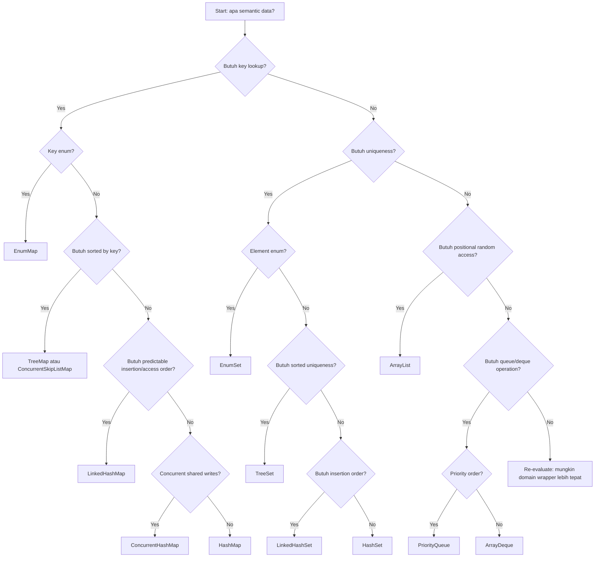
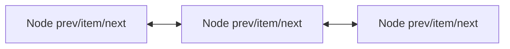

------
title: Learn Java Core Types, Data Model & Data APIs - Part 031
description: Java Collections implementations and production trade-offs: ArrayList, LinkedList, HashMap, LinkedHashMap, TreeMap, EnumSet, EnumMap, IdentityHashMap, WeakHashMap, ArrayDeque, PriorityQueue, ConcurrentHashMap, CopyOnWriteArrayList, factories, capacity, mutability, ordering, and failure modes.
series: learn-java-core-types
seriesTitle: Learn Java Core Types, Data Model & Data APIs
order: 31
partTitle: Collections Implementations and Production Trade-offs
tags:
- java
- collections
- arraylist
- hashmap
- linkedhashmap
- treemap
- enumset
- enummap
- identityhashmap
- weakhashmap
- deque
- priorityqueue
- concurrenthashmap
- copyonwritearraylist
- performance
- data-modeling
date: 2026-06-27
---

# Part 031 — Collections Implementations and Production Trade-offs

> Goal: memilih implementasi collection berdasarkan semantic contract, cost model, failure behavior, mutability policy, concurrency requirement, dan operational risk. Setelah bagian ini, kita tidak lagi memilih `ArrayList`, `HashMap`, atau `TreeMap` karena kebiasaan, tetapi karena invariant dan workload memang cocok.

Part sebelumnya membahas **collection semantics**:

- `List` berarti positional sequence.
- `Set` berarti uniqueness.
- `Map` berarti key-value association.
- `Queue` berarti pending processing.
- `Deque` berarti both-end processing.
- Sequenced collections berarti first/last encounter order adalah bagian dari kontrak.

Part ini menjawab pertanyaan berikutnya:

> Jika interface sudah benar, implementasi mana yang paling defensible?

Di production, salah implementasi bisa menyebabkan:

- latency naik karena hidden O(n);
- memory membengkak karena overhead node/hash table;
- ordering tidak stabil;
- key lookup gagal karena mutable key;
- concurrency bug;
- cache eviction salah;
- duplicate suppression tidak bekerja;
- code tampak benar tetapi bergantung pada implementation detail.

---

## 1. Kaufman Deconstruction: Sub-Skill Implementation Choice

Untuk menguasai collection implementations, pecah skill menjadi sub-skill berikut.

| Sub-skill | Pertanyaan utama |
|---|---|
| Cost model | Operasi dominan apa: append, random access, lookup, sorted iteration, remove middle, queue pop? |
| Semantic preservation | Apakah implementasi menjaga uniqueness/order/null policy yang dibutuhkan? |
| Equality dependency | Apakah behavior bergantung pada `equals/hashCode` atau `Comparator`? |
| Mutability risk | Apakah key/element berubah setelah masuk collection? |
| Capacity planning | Apakah resizing/rebalancing menjadi biaya tersembunyi? |
| Iteration contract | Apakah iteration order dijamin atau kebetulan? |
| Memory model | Apakah overhead per-entry masuk akal untuk volume data? |
| Concurrency boundary | Apakah collection dibagi antar-thread? |
| Snapshot vs live view | Apakah caller boleh melihat perubahan internal? |
| Failure mode | Ketika salah, apakah fail fast, silent corruption, memory leak, atau data loss? |

Prinsip latihan 20 jam:

> Jangan hafal semua class. Latih kemampuan membaca workload dan memilih implementation yang membuat invariant domain tetap kuat.

---

## 2. First Principle: Interface First, Implementation Second

Jangan mulai dari:

```java
HashMap<String, CaseFile> cases = new HashMap<>();
```

Mulai dari semantic contract:

```java
Map<CaseId, CaseFile> casesById;
```

Lalu pilih implementasi:

```java
Map<CaseId, CaseFile> casesById = new HashMap<>();
```

Jika iteration order bagian dari kontrak:

```java
Map<CaseId, CaseFile> casesById = new LinkedHashMap<>();
```

Jika sorted by key adalah kontrak:

```java
Map<CaseId, CaseFile> casesById = new TreeMap<>();
```

Jika key adalah enum:

```java
Map<CaseStatus, Integer> counts = new EnumMap<>(CaseStatus.class);
```

Top engineer menjaga dua level ini tetap terpisah:

| Level | Contoh | Tujuan |
|---|---|---|
| API contract | `Map<CaseId, CaseFile>` | Apa yang dijanjikan ke caller |
| Implementation choice | `HashMap`, `LinkedHashMap`, `TreeMap` | Bagaimana kontrak dipenuhi secara efisien |

Implementation detail boleh berubah selama kontrak tidak berubah.

---

## 3. Implementation Decision Flow



Flowchart ini bukan aturan absolut. Ia adalah starting point. Selalu validasi dengan:

- volume data;
- mutation pattern;
- ordering requirement;
- equality/comparator correctness;
- thread sharing;
- API boundary.

---

## 4. Implementation Matrix

| Need | Default candidate | Alternative | Warning |
|---|---|---|---|
| Ordered positional sequence | `ArrayList` | `LinkedList`, `CopyOnWriteArrayList` | `LinkedList` jarang unggul untuk general use |
| Unique membership | `HashSet` | `LinkedHashSet`, `TreeSet`, `EnumSet` | Hash-based set butuh stable `hashCode` |
| Key lookup | `HashMap` | `LinkedHashMap`, `TreeMap`, `EnumMap` | `HashMap` order bukan kontrak |
| Insertion-order map | `LinkedHashMap` | `SequencedMap` view | Cocok untuk predictable iteration/LRU-like behavior |
| Sorted keys | `TreeMap` | `ConcurrentSkipListMap` | Comparator harus total dan stabil |
| Enum keys | `EnumMap` | `Map.of` untuk small immutable map | Sangat efisien tetapi key universe fixed |
| Enum set | `EnumSet` | `Set.of` untuk fixed small set | Jangan persist ordinal |
| Stack/deque | `ArrayDeque` | `LinkedList` | Hindari legacy `Stack` |
| Priority processing | `PriorityQueue` | external scheduler/heap | Tidak sorted iteration; hanya head priority |
| Read-mostly concurrent list | `CopyOnWriteArrayList` | immutable snapshot | Mahal saat write |
| Concurrent key lookup | `ConcurrentHashMap` | synchronized map | Compound logic harus atomic dengan API map |
| Weak association | `WeakHashMap` | explicit lifecycle cleanup | Mudah salah paham soal weak key |
| Identity semantics | `IdentityHashMap` | normal `HashMap` | Bukan logical equality; niche |

---

## 5. `ArrayList`: Default List untuk Random Access dan Append

`ArrayList` adalah resizable-array implementation dari `List`.

Mental model:

```mermaid
flowchart LR
    A[ArrayList] --> B[Backing Object[]]
    B --> C[index 0]
    B --> D[index 1]
    B --> E[index 2]
    B --> F[capacity > size]
```

Karakteristik praktis:

| Operation | Cost mental model |
|---|---|
| `get(index)` | cepat, direct indexed access |
| `set(index, value)` | cepat |
| `add(value)` at end | amortized cepat |
| `add(index, value)` middle/front | shift elements |
| `remove(index)` middle/front | shift elements |
| `contains(value)` | linear scan |
| iteration | cache-friendly dibanding linked nodes |

Gunakan `ArrayList` ketika:

- urutan positional penting;
- append dominan;
- random access dominan;
- data sering diiterasi;
- remove mostly dari akhir atau jarang;
- volume cukup besar sehingga locality matters.

Contoh defensible:

```java
List<CaseEvent> events = new ArrayList<>();
events.add(new CaseEvent(caseId, "CREATED", now));
events.add(new CaseEvent(caseId, "ASSIGNED", now));
```

### 5.1 Capacity Matters

`ArrayList` punya size dan capacity. Size adalah jumlah elemen valid. Capacity adalah ukuran internal array.

```java
List<CaseEvent> events = new ArrayList<>(expectedEventCount);
```

Gunakan initial capacity ketika:

- jumlah elemen kira-kira diketahui;
- list dibangun dalam hot path;
- resizing berulang bisa mahal;
- batch processing besar.

Jangan over-engineer untuk list kecil.

### 5.2 `ArrayList` Failure Modes

| Failure | Penyebab | Pencegahan |
|---|---|---|
| Slow remove from front | Semua elemen digeser | Gunakan `ArrayDeque` untuk queue |
| `ConcurrentModificationException` | Mutasi saat iteration | Gunakan iterator remove, snapshot, atau concurrent structure |
| Memory retention | List besar masih mereferensikan elemen | Clear/release reference setelah dipakai |
| Internal state leak | Return mutable internal list | Return `List.copyOf` atau domain method |
| Random access assumption broken | API return `List` tapi implementation `LinkedList` | Jangan index loop jika implementation unknown |

Buruk:

```java
for (int i = 0; i < list.size(); i++) {
    process(list.get(i));
}
```

Lebih aman untuk unknown list:

```java
for (CaseEvent event : list) {
    process(event);
}
```

---

## 6. `LinkedList`: Jarang Menjadi Default yang Benar

`LinkedList` adalah doubly-linked list dan juga implementasi `Deque`.

Mental model:



Kelebihan konseptual:

- add/remove di ujung cepat;
- add/remove via iterator pada posisi yang sudah ditemukan bisa efisien;
- implementasi `Deque`.

Namun untuk general `List`, `LinkedList` sering kalah karena:

- random access linear;
- tiap elemen butuh node object;
- pointer chasing buruk untuk cache locality;
- memory overhead besar;
- branch/pointer cost sering lebih mahal dari shifting array untuk ukuran umum.

Gunakan `LinkedList` hanya jika:

- Anda benar-benar membutuhkan `Deque` behavior dan tidak cocok dengan `ArrayDeque`;
- mutasi tengah via iterator adalah operasi dominan;
- sudah ada bukti profil bahwa lebih cocok.

Untuk queue/deque biasa, prefer:

```java
Deque<Job> queue = new ArrayDeque<>();
```

Bukan:

```java
Queue<Job> queue = new LinkedList<>();
```

### 6.1 Legacy Classes: `Vector` dan `Stack`

`Vector` dan `Stack` adalah legacy. Jangan jadikan default.

Untuk stack:

```java
Deque<Command> stack = new ArrayDeque<>();
stack.push(command);
Command current = stack.pop();
```

Bukan:

```java
Stack<Command> stack = new Stack<>();
```

---

## 7. `CopyOnWriteArrayList`: Read-Mostly Snapshot Semantics

`CopyOnWriteArrayList` cocok saat:

- reads sangat dominan;
- writes jarang;
- iteration harus aman tanpa external synchronization;
- snapshot semantics berguna;
- jumlah elemen relatif kecil/sedang.

Contoh:

```java
private final CopyOnWriteArrayList<Listener> listeners = new CopyOnWriteArrayList<>();

public void addListener(Listener listener) {
    listeners.add(Objects.requireNonNull(listener));
}

public void publish(Event event) {
    for (Listener listener : listeners) {
        listener.onEvent(event);
    }
}
```

Ini bagus untuk listener registry.

Tidak cocok untuk:

- frequent writes;
- large mutable list;
- high-throughput append/remove;
- queue processing.

Failure mode utamanya: write cost tinggi karena copy internal array.

---

## 8. `HashSet`: Default Set untuk Membership

`HashSet` cocok ketika:

- uniqueness berdasarkan `equals/hashCode`;
- order tidak penting;
- membership check dominan;
- elemen immutable/stable.

Contoh:

```java
Set<Permission> permissions = new HashSet<>();
permissions.add(Permission.VIEW_CASE);
permissions.add(Permission.APPROVE_CASE);
```

Namun jika `Permission` enum, `EnumSet` lebih tepat:

```java
EnumSet<Permission> permissions = EnumSet.of(
    Permission.VIEW_CASE,
    Permission.APPROVE_CASE
);
```

### 8.1 Stable Equality Is Mandatory

Bahaya terbesar hash-based collection:

```java
record CaseKey(String authority, String number) {}

Set<CaseKey> keys = new HashSet<>();
CaseKey key = new CaseKey("OJK", "123");
keys.add(key);
```

Aman karena record immutable.

Buruk:

```java
final class MutableCaseKey {
    String authority;
    String number;

    // equals/hashCode use authority and number
}
```

Jika field berubah setelah masuk `HashSet`, set bisa “kehilangan” elemen secara logis.

Invariant:

> Elemen `HashSet` harus punya equality/hash state yang stabil selama berada di dalam set.

### 8.2 Iteration Order Is Not a Contract

Jangan menulis test seperti:

```java
assertEquals(List.of("A", "B", "C"), new ArrayList<>(hashSet));
```

Gunakan:

```java
assertEquals(Set.of("A", "B", "C"), hashSet);
```

Jika order penting, pilih `LinkedHashSet` atau `TreeSet`.

---

## 9. `LinkedHashSet`: Unique + Predictable Encounter Order

`LinkedHashSet` menjaga uniqueness seperti `HashSet`, tetapi iteration order predictable, umumnya insertion order.

Gunakan ketika:

- duplicate suppression perlu;
- output order harus stabil;
- user-visible display membutuhkan order input;
- deterministic tests/logs penting;
- pipeline mengumpulkan unique item tanpa mengacak encounter order.

Contoh:

```java
Set<String> uniqueInInputOrder = new LinkedHashSet<>();
uniqueInInputOrder.add("risk");
uniqueInInputOrder.add("compliance");
uniqueInInputOrder.add("risk");

System.out.println(uniqueInInputOrder); // [risk, compliance]
```

Trade-off:

- memory lebih besar dari `HashSet`;
- sedikit overhead untuk linked order;
- tetap bergantung pada stable `equals/hashCode`.

---

## 10. `TreeSet`: Unique + Sorted Order

`TreeSet` cocok ketika uniqueness dan sorted iteration sama-sama bagian dari kontrak.

```java
Set<Deadline> deadlines = new TreeSet<>(Comparator.comparing(Deadline::dueAt));
```

Namun hati-hati:

```java
record Deadline(String id, Instant dueAt) {}
```

Comparator di atas hanya membandingkan `dueAt`. Jika dua deadline berbeda punya `dueAt` sama, `TreeSet` menganggapnya duplicate.

Lebih aman:

```java
Set<Deadline> deadlines = new TreeSet<>(
    Comparator.comparing(Deadline::dueAt)
              .thenComparing(Deadline::id)
);
```

Invariant:

> Untuk sorted set/map, comparator menentukan equality versi collection.

Jika comparator menganggap dua object “sama”, hanya satu yang bisa bertahan.

### 10.1 `TreeSet` Failure Modes

| Failure | Penyebab |
|---|---|
| Elemen hilang | Comparator tidak membedakan identity logis |
| `ClassCastException` | Elemen tidak comparable dan tidak ada comparator |
| Order berubah rusak | Field yang dipakai comparator mutable |
| Inconsistent behavior | Comparator tidak transitive/total |
| Performance surprise | Semua lookup berbasis tree, bukan hash |

---

## 11. `EnumSet`: Set Terbaik untuk Enum

Jika elemen adalah enum, `EnumSet` biasanya pilihan paling kuat.

```java
enum Permission {
    VIEW_CASE,
    EDIT_CASE,
    APPROVE_CASE,
    CLOSE_CASE
}

EnumSet<Permission> reviewerPermissions =
    EnumSet.of(Permission.VIEW_CASE, Permission.APPROVE_CASE);
```

Kelebihan:

- sangat compact;
- sangat cepat;
- semantic domain tertutup;
- operasi set seperti union/intersection natural;
- tidak perlu hashing object arbitrary.

Contoh domain:

```java
record RolePolicy(Role role, EnumSet<Permission> permissions) {
    RolePolicy {
        permissions = permissions.clone();
    }

    boolean allows(Permission permission) {
        return permissions.contains(permission);
    }

    Set<Permission> view() {
        return EnumSet.copyOf(permissions);
    }
}
```

Jangan expose internal `EnumSet` mutable.

---

## 12. `HashMap`: Default Key-Value Lookup

`HashMap` cocok ketika:

- lookup by key dominan;
- order tidak penting;
- key punya stable `equals/hashCode`;
- null key/value policy diterima;
- concurrency bukan requirement.

Contoh:

```java
Map<CaseId, CaseFile> byId = new HashMap<>();
byId.put(caseFile.id(), caseFile);

CaseFile found = byId.get(caseId);
```

### 12.1 Key Design Lebih Penting dari Map Class

Buruk:

```java
Map<String, CaseFile> byCompositeKey = new HashMap<>();

String key = authority + ":" + number;
byCompositeKey.put(key, file);
```

Lebih kuat:

```java
record CaseKey(String authority, String number) {
    CaseKey {
        authority = authority.strip().toUpperCase(Locale.ROOT);
        number = number.strip();
    }
}

Map<CaseKey, CaseFile> byKey = new HashMap<>();
```

String composite key raw rawan:

- delimiter collision;
- normalization inconsistency;
- hidden parsing;
- typo;
- duplicate representation.

### 12.2 `computeIfAbsent` and Friends

Common pattern:

```java
Map<CaseId, List<CaseEvent>> eventsByCase = new HashMap<>();

eventsByCase
    .computeIfAbsent(caseId, ignored -> new ArrayList<>())
    .add(event);
```

Ini bagus untuk grouping manual.

Namun hati-hati:

- mapping function tidak boleh punya side effect kompleks;
- jangan recursively modify same map dengan cara membingungkan;
- untuk concurrent map, gunakan atomic operation yang disediakan map.

### 12.3 Capacity and Load Factor

Jika akan memasukkan banyak item, beri initial capacity yang masuk akal.

```java
Map<CaseId, CaseFile> byId = new HashMap<>(expectedSize * 4 / 3 + 1);
```

Tujuannya mengurangi resize/rehash.

Jangan terlalu obsesif untuk map kecil. Capacity planning penting untuk batch besar, hot path, atau service dengan latency constraint.

### 12.4 `HashMap` Failure Modes

| Failure | Penyebab |
|---|---|
| Lookup gagal | Key mutable setelah dimasukkan |
| Duplicate logical key | `equals/hashCode` salah |
| Order berubah antar-run | Bergantung pada iteration order |
| NPE ambiguity | `get` return null bisa berarti key absent atau value null |
| Race/corruption risk | Shared mutable `HashMap` tanpa synchronization |
| Memory growth | Map jadi cache tanpa eviction |

Untuk absent vs null:

```java
if (map.containsKey(key)) {
    Value value = map.get(key);
}
```

Lebih baik lagi: hindari null value jika map adalah domain store.

---

## 13. `LinkedHashMap`: Predictable Order dan LRU-Like Cache

`LinkedHashMap` menjaga map entries dalam predictable iteration order. Secara umum digunakan untuk:

- insertion-order map;
- deterministic output;
- preserving input order after lookup indexing;
- simple LRU-like cache dengan access-order.

Contoh preserving order:

```java
Map<CaseId, CaseSummary> summaries = new LinkedHashMap<>();
```

Contoh access-order cache:

```java
final class SmallLruCache<K, V> extends LinkedHashMap<K, V> {
    private final int maxEntries;

    SmallLruCache(int maxEntries) {
        super(16, 0.75f, true); // access-order
        this.maxEntries = maxEntries;
    }

    @Override
    protected boolean removeEldestEntry(Map.Entry<K, V> eldest) {
        return size() > maxEntries;
    }
}
```

Catatan:

- Ini bukan distributed cache.
- Ini bukan solusi caching production high-concurrency.
- Ini cocok untuk bounded in-memory helper kecil.
- Perhatikan synchronization jika dipakai antar-thread.

---

## 14. `TreeMap`: Sorted Key Map

`TreeMap` cocok ketika:

- sorted key order bagian dari kontrak;
- range query berguna;
- navigation operation diperlukan;
- comparator stabil dan total.

Contoh:

```java
NavigableMap<Instant, List<CaseEvent>> timeline = new TreeMap<>();
timeline.computeIfAbsent(event.occurredAt(), ignored -> new ArrayList<>())
        .add(event);
```

Range query:

```java
NavigableMap<Instant, List<CaseEvent>> today =
    timeline.subMap(startInclusive, true, endExclusive, false);
```

Hati-hati dengan key collision karena comparator:

```java
Comparator<String> caseInsensitive = String.CASE_INSENSITIVE_ORDER;
Map<String, User> users = new TreeMap<>(caseInsensitive);

users.put("alice", user1);
users.put("ALICE", user2); // replace secara comparator
```

Jika itu memang desired, dokumentasikan. Jika tidak, gunakan normalized key type.

---

## 15. `EnumMap`: Map Terbaik untuk Enum Key

Jika key adalah enum, gunakan `EnumMap`.

```java
enum CaseStatus {
    DRAFT,
    SUBMITTED,
    UNDER_REVIEW,
    APPROVED,
    REJECTED
}

EnumMap<CaseStatus, Integer> counts = new EnumMap<>(CaseStatus.class);
for (CaseStatus status : CaseStatus.values()) {
    counts.put(status, 0);
}
```

Kelebihan:

- compact;
- cepat;
- key universe jelas;
- iteration mengikuti enum natural order;
- tidak perlu hashing arbitrary.

Domain example:

```java
final class TransitionPolicy {
    private final EnumMap<CaseStatus, EnumSet<CaseStatus>> allowed;

    TransitionPolicy(EnumMap<CaseStatus, EnumSet<CaseStatus>> allowed) {
        this.allowed = new EnumMap<>(CaseStatus.class);
        allowed.forEach((from, tos) -> this.allowed.put(from, tos.clone()));
    }

    boolean canMove(CaseStatus from, CaseStatus to) {
        return allowed.getOrDefault(from, EnumSet.noneOf(CaseStatus.class)).contains(to);
    }
}
```

---

## 16. `IdentityHashMap`: Identity Semantics, Niche Only

`IdentityHashMap` memakai reference identity, bukan logical equality.

Gunakan untuk kasus khusus:

- object graph traversal;
- cycle detection by object identity;
- serialization framework internals;
- preserving aliases;
- proxy/object identity diagnostics.

Contoh:

```java
Set<Object> visited = Collections.newSetFromMap(new IdentityHashMap<>());

boolean firstTime(Object object) {
    return visited.add(object);
}
```

Jangan gunakan untuk domain map biasa.

Buruk:

```java
Map<CustomerId, Customer> customers = new IdentityHashMap<>();
```

Jika dua `CustomerId` berbeda instance tetapi equal secara value, lookup bisa gagal.

Rule:

> Jika Anda tidak bisa menjelaskan mengapa `==` lebih benar daripada `equals`, jangan gunakan `IdentityHashMap`.

---

## 17. `WeakHashMap`: Lifecycle Berdasarkan Reachability Key

`WeakHashMap` menyimpan key secara weak. Entry bisa hilang ketika key tidak lagi strongly reachable di tempat lain.

Use case:

- metadata tambahan untuk object yang lifecycle-nya dikontrol pihak lain;
- cache sangat khusus yang boleh kehilangan entry;
- association yang tidak boleh mencegah GC.

Contoh konseptual:

```java
Map<Object, Metadata> metadataByObject = new WeakHashMap<>();
metadataByObject.put(externalObject, metadata);
```

Failure modes:

| Failure | Penyebab |
|---|---|
| Entry hilang “misterius” | Key hanya weakly reachable |
| Memory tidak turun | Value mereferensikan key secara kuat |
| Salah cache | Mengira `WeakHashMap` adalah LRU/cache biasa |
| Equality surprise | Weak key tetap memakai `equals/hashCode` selama reachable |

Hindari untuk application-level cache tanpa pemahaman GC yang kuat.

---

## 18. `ArrayDeque`: Default Queue/Deque Non-Concurrent

`ArrayDeque` adalah pilihan default untuk stack/queue/deque single-threaded atau externally synchronized.

```java
Deque<Job> jobs = new ArrayDeque<>();
jobs.addLast(job);
Job next = jobs.removeFirst();
```

Stack:

```java
Deque<Command> stack = new ArrayDeque<>();
stack.push(command);
Command current = stack.pop();
```

Gunakan untuk:

- BFS/DFS worklist;
- parser stack;
- retry queue local;
- in-memory temporary processing;
- command stack.

Hindari:

- null elements;
- concurrent sharing tanpa synchronization;
- priority scheduling;
- bounded blocking queue semantics.

---

## 19. `PriorityQueue`: Head Berdasarkan Priority, Bukan Sorted List

`PriorityQueue` cocok ketika Anda hanya perlu mengambil elemen prioritas tertinggi/terendah berikutnya.

```java
PriorityQueue<Task> tasks = new PriorityQueue<>(
    Comparator.comparing(Task::deadline)
              .thenComparing(Task::id)
);

tasks.add(task);
Task next = tasks.poll();
```

Important:

- iteration order tidak sorted;
- hanya `peek`/`poll` yang mengikuti priority;
- comparator harus stabil;
- element mutation setelah masuk queue bisa merusak heap invariant;
- tidak thread-safe.

Buruk:

```java
for (Task task : priorityQueue) {
    // Jangan anggap ini urutan prioritas
}
```

Jika butuh sorted iteration, gunakan `TreeSet`/`TreeMap` atau copy lalu sort.

---

## 20. Concurrent Collection Decision Boundary

Jangan memilih concurrent collection hanya karena “mungkin ada thread”.

Tanyakan:

1. Apakah collection benar-benar shared antar-thread?
2. Apakah operation harus atomic?
3. Apakah iteration harus consistent snapshot?
4. Apakah order penting?
5. Apakah workload read-heavy, write-heavy, atau mixed?
6. Apakah blocking behavior dibutuhkan?
7. Apakah contention tinggi?
8. Apakah lifecycle ownership bisa dibuat single-threaded saja?

Sering kali solusi terbaik bukan concurrent collection, tetapi ownership yang jelas:

```java
final class CaseAggregator {
    private final Map<CaseId, CaseSummary> summaries = new HashMap<>();

    void accept(CaseEvent event) {
        // single-threaded actor/batch owner
    }
}
```

Concurrency primitive bukan pengganti ownership model.

---

## 21. `ConcurrentHashMap`: Concurrent Key Lookup dan Atomic Map Operations

`ConcurrentHashMap` cocok untuk concurrent reads/writes by key.

Common pattern frequency map:

```java
ConcurrentHashMap<String, LongAdder> counts = new ConcurrentHashMap<>();

void record(String key) {
    counts.computeIfAbsent(key, ignored -> new LongAdder()).increment();
}
```

Gunakan atomic map methods:

- `computeIfAbsent`
- `computeIfPresent`
- `compute`
- `merge`
- `putIfAbsent`
- `replace`

Buruk:

```java
if (!map.containsKey(key)) {
    map.put(key, value);
}
```

Race-prone.

Lebih baik:

```java
map.putIfAbsent(key, value);
```

### 21.1 `ConcurrentHashMap` Failure Modes

| Failure | Penyebab |
|---|---|
| Lost update | Read-modify-write manual |
| Null confusion | `ConcurrentHashMap` tidak menerima null key/value |
| Long mapping function | `compute` menahan internal coordination lebih lama |
| Order assumption | Tidak ada ordering semantic seperti sorted/insertion order |
| Cross-key invariant broken | Atomicity hanya per operation/key, bukan global transaction |

Jika invariant melibatkan banyak key, butuh lock/transaction/actor/domain aggregate.

---

## 22. `ConcurrentSkipListMap` and Sorted Concurrent Maps

Gunakan ketika butuh:

- concurrent map;
- sorted key order;
- navigation operation;
- range query;
- weakly consistent concurrent access.

Contoh:

```java
ConcurrentNavigableMap<Instant, CaseEvent> events = new ConcurrentSkipListMap<>();
```

Trade-off:

- lebih mahal dari `ConcurrentHashMap` untuk lookup umum;
- comparator harus stabil;
- range operations tetap perlu dipahami concurrency semantics-nya.

---

## 23. Blocking Queues and Producer-Consumer Boundaries

Untuk producer-consumer concurrent workflows, gunakan queue yang memang dirancang untuk concurrency.

Contoh umum:

```java
BlockingQueue<Job> queue = new LinkedBlockingQueue<>();

void producer(Job job) throws InterruptedException {
    queue.put(job);
}

void consumer() throws InterruptedException {
    while (!Thread.currentThread().isInterrupted()) {
        Job job = queue.take();
        process(job);
    }
}
```

Namun dalam sistem modern, pertimbangkan juga:

- executor framework;
- message broker;
- reactive stream;
- actor model;
- structured concurrency;
- bounded queue dengan backpressure.

Unbounded queue bisa menjadi memory leak berbentuk “buffer”.

---

## 24. Factory Methods: `List.of`, `Set.of`, `Map.of`, `copyOf`

Gunakan factory methods untuk membuat unmodifiable collections.

```java
List<String> roles = List.of("reviewer", "approver");
Set<String> labels = Set.of("urgent", "regulatory");
Map<String, Integer> limits = Map.of("daily", 100, "monthly", 1000);
```

Untuk boundary copy:

```java
record CaseView(List<CaseEvent> events) {
    CaseView {
        events = List.copyOf(events);
    }
}
```

Perbedaan penting:

| API | Meaning |
|---|---|
| `List.of(...)` | create unmodifiable collection dari values |
| `List.copyOf(collection)` | create unmodifiable copy/snapshot-ish boundary |
| `Collections.unmodifiableList(list)` | unmodifiable view terhadap backing list |
| `new ArrayList<>(list)` | mutable copy |

Danger:

```java
List<String> mutable = new ArrayList<>();
List<String> view = Collections.unmodifiableList(mutable);

mutable.add("A");
System.out.println(view); // view ikut berubah
```

Jika ingin snapshot boundary:

```java
List<String> snapshot = List.copyOf(mutable);
```

---

## 25. `Collections.unmodifiable*`: View, Bukan Snapshot

Unmodifiable wrapper menolak mutasi via wrapper, tetapi backing collection masih bisa berubah.

```java
final class CaseHistory {
    private final List<CaseEvent> events = new ArrayList<>();

    List<CaseEvent> eventsView() {
        return Collections.unmodifiableList(events);
    }
}
```

Ini tidak selalu salah. View bisa berguna untuk internal read-only window. Tapi sebagai public API boundary, snapshot biasanya lebih defensible:

```java
List<CaseEvent> events() {
    return List.copyOf(events);
}
```

Trade-off:

- view murah tetapi live;
- snapshot lebih aman tetapi copy cost;
- immutable persistent collection tidak tersedia di JDK core collections seperti library tertentu.

---

## 26. `Arrays.asList`: Fixed-Size List View

`Arrays.asList(array)` menghasilkan list fixed-size backed by array.

```java
String[] arr = {"A", "B"};
List<String> list = Arrays.asList(arr);

list.set(0, "X"); // allowed
list.add("C");    // UnsupportedOperationException
```

Jika butuh mutable list:

```java
List<String> mutable = new ArrayList<>(Arrays.asList(arr));
```

Jika butuh unmodifiable list:

```java
List<String> immutable = List.of(arr);
```

Hati-hati primitive array:

```java
int[] numbers = {1, 2, 3};
List<int[]> oneElement = Arrays.asList(numbers);
```

Ini list berisi satu elemen, yaitu `int[]`.

---

## 27. Null Policy Across Implementations

Null policy berbeda-beda.

| Implementation | Null element/key/value |
|---|---|
| `ArrayList` | permits null |
| `HashSet` | permits null element |
| `HashMap` | permits null key/value |
| `TreeSet`/`TreeMap` | depends comparator/natural ordering; null sering problematic |
| `EnumSet` | no null elements |
| `EnumMap` | no null keys; values may be null |
| `ArrayDeque` | no null elements |
| `PriorityQueue` | no null elements |
| `ConcurrentHashMap` | no null key/value |
| `List.of`/`Set.of`/`Map.of` | no nulls |

Design recommendation:

> Jangan gunakan null sebagai element/key/value kecuali ada alasan eksplisit dan terdokumentasi.

Null in collection sering menciptakan ambiguity:

```java
Map<CaseId, Decision> decisions = new HashMap<>();
Decision decision = decisions.get(caseId);
```

`null` bisa berarti absent atau present-with-null.

Lebih baik:

```java
Optional<Decision> decisionFor(CaseId id) {
    return Optional.ofNullable(decisions.get(id));
}
```

Tetapi jangan simpan `Optional` sebagai map value secara default kecuali memang representasi domain membutuhkan state “known absent”.

---

## 28. Equality and Comparator Policy by Implementation

| Implementation | Equality source |
|---|---|
| `HashSet`, `HashMap` | `equals` + `hashCode` |
| `LinkedHashSet`, `LinkedHashMap` | `equals` + `hashCode` plus linked order |
| `TreeSet`, `TreeMap` | comparator/natural ordering |
| `EnumSet`, `EnumMap` | enum identity/universe |
| `IdentityHashMap` | reference identity |
| `PriorityQueue` | comparator/natural ordering for heap priority |
| `List` | ordered element equality |

Checklist untuk key/element:

1. Immutable?
2. Equality fields final?
3. Normalized at construction?
4. `equals` and `hashCode` consistent?
5. Comparator total?
6. Comparator consistent enough with domain equality?
7. No mutable sort key?
8. No locale/time-zone surprise?
9. Tests include collision/equal-but-not-same-instance?
10. Tests include duplicate and boundary cases?

---

## 29. Ordering Taxonomy

Order bisa berarti banyak hal.

| Order type | Implementation |
|---|---|
| Positional order | `ArrayList`, `LinkedList` |
| Insertion order | `LinkedHashSet`, `LinkedHashMap` |
| Access order | `LinkedHashMap` with access-order |
| Sorted order | `TreeSet`, `TreeMap`, `ConcurrentSkipListMap` |
| Enum declaration order | `EnumSet`, `EnumMap` |
| Priority head order | `PriorityQueue` |
| Encounter order | streams/iteration source dependent |
| No guaranteed order | `HashSet`, `HashMap` |
| Identity traversal order | `IdentityHashMap`, implementation detail |

Never say “ordered” without specifying which one.

---

## 30. Memory and CPU Trade-offs

Simplified mental model:

| Implementation | Memory tendency | CPU tendency |
|---|---|---|
| `ArrayList` | compact references + spare capacity | good locality |
| `LinkedList` | high per-node overhead | pointer chasing |
| `HashMap` | bucket/table + nodes/tree bins | fast lookup average, resize cost |
| `LinkedHashMap` | extra links per entry | predictable iteration, extra overhead |
| `TreeMap` | tree nodes | log-time operations |
| `EnumMap` | array-like | very efficient |
| `EnumSet` | bit-vector-like | very efficient |
| `PriorityQueue` | array heap | efficient head priority |
| `CopyOnWriteArrayList` | copies on write | excellent read iteration, expensive writes |

Do not optimize blindly, but know the direction of cost.

Production rule:

> For high-volume collections, choose by workload and measure with representative data.

Microbenchmarks that do not represent real key distribution, mutation pattern, and object graph can mislead.

---

## 31. Domain-Specific Collection Wrappers

Raw collections expose too much.

Buruk:

```java
record CaseFile(List<CaseEvent> events) {}
```

Lebih kuat:

```java
final class CaseHistory {
    private final List<CaseEvent> events = new ArrayList<>();

    void append(CaseEvent event) {
        Objects.requireNonNull(event);
        if (!events.isEmpty()) {
            CaseEvent last = events.get(events.size() - 1);
            if (event.occurredAt().isBefore(last.occurredAt())) {
                throw new IllegalArgumentException("events must be chronological");
            }
        }
        events.add(event);
    }

    List<CaseEvent> snapshot() {
        return List.copyOf(events);
    }
}
```

Dengan wrapper, collection menjadi enforcement boundary.

Gunakan wrapper ketika:

- ada invariant;
- ada normalization;
- ada validation;
- ada domain operation;
- ada lifecycle rule;
- raw add/remove tidak boleh bebas;
- representation mungkin berubah.

---

## 32. Case Study: Enforcement Case Dashboard

Requirement:

- tampilkan case by ID;
- preserve order dari input query;
- deduplicate roles;
- map counts by status;
- queue pending background jobs;
- prioritize overdue tasks;
- maintain transition policy by enum status;
- expose read-only snapshot to UI layer.

Desain:

```java
record DashboardData(
    Map<CaseId, CaseSummary> casesById,
    List<CaseSummary> casesInInputOrder,
    Set<Role> uniqueRoles,
    Map<CaseStatus, Integer> countsByStatus,
    Queue<Job> pendingJobs,
    Queue<Task> priorityTasks
) {
    DashboardData {
        casesById = Map.copyOf(casesById);
        casesInInputOrder = List.copyOf(casesInInputOrder);
        uniqueRoles = Set.copyOf(uniqueRoles);
        countsByStatus = Map.copyOf(countsByStatus);
        pendingJobs = new ArrayDeque<>(pendingJobs);
        priorityTasks = new PriorityQueue<>(priorityTasks);
    }
}
```

But we can improve semantics:

```java
record DashboardData(
    Map<CaseId, CaseSummary> casesById,
    List<CaseSummary> casesInInputOrder,
    EnumSet<Role> uniqueRoles,
    EnumMap<CaseStatus, Integer> countsByStatus,
    List<Job> pendingJobsSnapshot,
    List<Task> priorityTasksSnapshot
) {}
```

Even better: wrap domain groups:

```java
record DashboardData(
    CaseIndex caseIndex,
    RoleSet roles,
    StatusCounts statusCounts,
    JobBacklog jobs,
    TaskSchedule tasks
) {}
```

Top engineer recognizes when raw collection types are too low-level for a boundary.

---

## 33. Anti-Patterns

### 33.1 `LinkedList` by Habit

```java
List<Event> events = new LinkedList<>();
```

Unless you need linked-list specific properties, use `ArrayList`.

### 33.2 `HashMap` But Relying on Order

```java
Map<String, String> headers = new HashMap<>();
return headers.toString(); // order-sensitive output
```

Use `LinkedHashMap` if output order matters.

### 33.3 Mutable Key

```java
Map<MutableKey, Value> map = new HashMap<>();
map.put(key, value);
key.setId("changed");
```

This is a structural bug.

### 33.4 `TreeSet` Comparator Drops Domain Identity

```java
new TreeSet<>(Comparator.comparing(User::lastName));
```

Two users with same last name collide.

### 33.5 Exposing Internal Mutable Collection

```java
List<Event> events() {
    return events;
}
```

Return snapshot or domain view.

### 33.6 Using `WeakHashMap` as Normal Cache

Weak reachability is not eviction policy.

### 33.7 Concurrent Map with Non-Atomic Compound Logic

```java
var current = map.get(key);
map.put(key, current + 1);
```

Use `merge`, `compute`, or `LongAdder`.

### 33.8 `PriorityQueue` Iteration as Sorted Output

```java
priorityQueue.forEach(System.out::println);
```

Only poll order is priority order.

---

## 34. Practice Drill

### Drill 1 — Choose Implementation

For each requirement, choose implementation and explain:

1. Unique permissions for enum role.
2. Case summaries in exact input order.
3. Lookup case by normalized regulatory case number.
4. Timeline range query by `Instant`.
5. Read-mostly event listeners.
6. Local BFS queue.
7. Concurrent frequency counter.
8. Small ordered JSON field map.
9. Object graph cycle detection by identity.
10. Cache-like metadata that should not keep external object alive.

Expected direction:

| Requirement | Candidate |
|---|---|
| enum permissions | `EnumSet` |
| input order list | `ArrayList` or `List.copyOf` |
| normalized lookup | `HashMap<CaseKey, Case>` |
| timeline range | `TreeMap<Instant, ...>` |
| listeners | `CopyOnWriteArrayList` |
| BFS queue | `ArrayDeque` |
| concurrent frequency | `ConcurrentHashMap<K, LongAdder>` |
| ordered JSON map | `LinkedHashMap` |
| identity cycle detection | `IdentityHashMap`-backed set |
| weak metadata | `WeakHashMap` |

### Drill 2 — Find Hidden Bugs

```java
record User(String id, String name) {}

Set<User> users = new TreeSet<>(Comparator.comparing(User::name));
users.add(new User("1", "Alex"));
users.add(new User("2", "Alex"));
```

Bug:

- comparator considers both users equal;
- second user will not be added;
- comparator does not include `id`.

Fix:

```java
Set<User> users = new TreeSet<>(
    Comparator.comparing(User::name)
              .thenComparing(User::id)
);
```

### Drill 3 — Protect Boundary

Refactor:

```java
record CaseDto(List<String> tags) {}
```

Into:

```java
record CaseDto(List<String> tags) {
    CaseDto {
        tags = List.copyOf(tags);
    }
}
```

Then improve with domain scalar:

```java
record Tags(Set<String> values) {
    Tags {
        values = values.stream()
            .map(String::strip)
            .filter(s -> !s.isEmpty())
            .collect(Collectors.toCollection(LinkedHashSet::new));
        values = Set.copyOf(values);
    }
}
```

---

## 35. Review Checklist

Before approving collection implementation choices:

1. Is the public type an interface or domain wrapper rather than concrete implementation?
2. Does the implementation preserve required ordering?
3. Does it enforce or support uniqueness correctly?
4. Are `equals/hashCode` stable for hash-based collections?
5. Is comparator total, transitive, and domain-correct?
6. Are nulls allowed intentionally?
7. Are mutable internals protected?
8. Is capacity planning needed for batch size?
9. Are map operations atomic under concurrency?
10. Is iteration order documented if visible?
11. Is `PriorityQueue` used only for priority head retrieval?
12. Is `WeakHashMap` used only for reachability-based association?
13. Is `IdentityHashMap` used only for identity semantics?
14. Are unmodifiable wrappers understood as views?
15. Are immutable snapshots used at module/API boundaries?
16. Are domain-specific wrappers needed?
17. Are tests checking duplicates, ordering, nulls, and mutation?
18. Is the implementation choice based on workload rather than habit?

---

## 36. Summary

Collection implementation choice is a design decision, not a syntax decision.

- `ArrayList` is the default for ordered positional data.
- `LinkedList` is rarely the best general-purpose list.
- `HashSet` and `HashMap` require stable equality.
- `LinkedHashSet` and `LinkedHashMap` encode predictable encounter order.
- `TreeSet` and `TreeMap` encode sorted order through comparator semantics.
- `EnumSet` and `EnumMap` are excellent for enum domains.
- `ArrayDeque` is the default non-concurrent queue/deque.
- `PriorityQueue` gives priority head access, not sorted iteration.
- `ConcurrentHashMap` solves concurrent map access, not multi-key domain transactions.
- `CopyOnWriteArrayList` is for read-mostly snapshot iteration.
- `List.of`, `Set.of`, `Map.of`, and `copyOf` are powerful boundary tools.
- Raw collections should often be hidden behind domain wrappers.

The core rule:

> Pick the implementation whose natural behavior makes your required domain behavior boring.

Part berikutnya adalah part terakhir: streams, collectors, and data pipeline semantics. Di sana kita akan mengintegrasikan type model, equality, mutability, collections, time, numbers, and domain values into processing pipelines.
