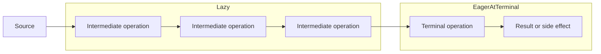
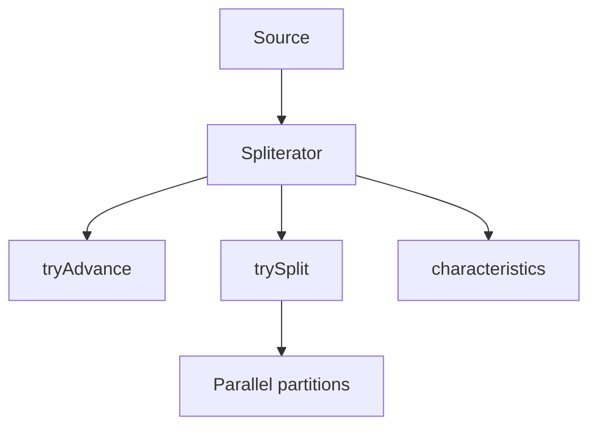
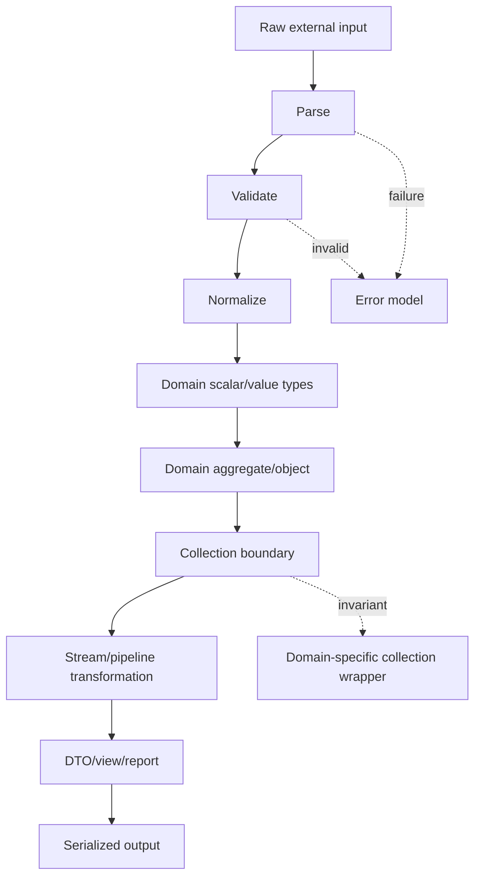

------
title: Learn Java Core Types, Data Model & Data APIs - Part 032
description: Java Streams, collectors, data pipeline semantics, laziness, encounter order, side effects, primitive streams, grouping, reducing, parallel stream caveats, spliterator mental model, and final integration rubric for Java core data modeling.
series: learn-java-core-types
seriesTitle: Learn Java Core Types, Data Model & Data APIs
order: 32
partTitle: Streams, Collectors, and Data Pipeline Semantics
tags:
- java
- streams
- collectors
- spliterator
- pipeline
- functional
- collections
- data-processing
- parallel-stream
- grouping
- reducing
- data-modeling
date: 2026-06-27
---

# Part 032 — Streams, Collectors, and Data Pipeline Semantics

> Goal: memahami stream sebagai pipeline data yang lazy, typed, ordered atau unordered, side-effect-sensitive, dan memiliki terminal semantics yang jelas. Setelah bagian ini, kita bisa memutuskan kapan memakai stream, kapan memakai loop, bagaimana menulis collector yang benar, dan bagaimana menghindari bug akibat mutation, ordering, null, parallelism, boxing, dan reduction yang tidak associative.

Ini adalah part terakhir seri `learn-java-core-types`.

Streams sering diajarkan sebagai:

```java
list.stream()
    .filter(...)
    .map(...)
    .collect(...);
```

Itu hanya syntax.

Top engineer melihat stream sebagai:

> deklarasi transformasi data dari source ke terminal result, dengan kontrak laziness, encounter order, statelessness, non-interference, type conversion, and reduction semantics.

Stream bukan collection. Stream bukan selalu lebih cepat. Stream bukan magic parallelism. Stream adalah abstraction untuk pipeline.

---

## 1. Kaufman Deconstruction: Sub-Skill Streams

| Sub-skill | Kemampuan |
|---|---|
| Pipeline model | Bisa membedakan source, intermediate operation, terminal operation |
| Laziness | Tahu kapan computation benar-benar terjadi |
| Encounter order | Tahu apakah order dipertahankan, diabaikan, atau mahal |
| Statelessness | Menghindari operation yang bergantung pada mutable external state |
| Non-interference | Tidak memodifikasi source saat pipeline berjalan |
| Mapping discipline | Memisahkan parse, validate, normalize, map, filter, reduce |
| Collector design | Memilih collector sesuai output semantics |
| Reduction correctness | Menggunakan identity/accumulator/combiner yang associative |
| Primitive specialization | Menghindari boxing overhead ketika perlu |
| Parallel caution | Tahu kapan parallel stream aman dan kapan berbahaya |
| Debuggability | Bisa menulis pipeline yang dapat dites dan dibaca |
| Integration | Mengubah raw data menjadi domain model dengan boundary yang jelas |

---

## 2. Stream Mental Model



Pipeline parts:

| Part | Example | Meaning |
|---|---|---|
| Source | `list.stream()` | dari mana elemen berasal |
| Intermediate | `filter`, `map`, `sorted`, `distinct` | transform stream menjadi stream lain |
| Terminal | `collect`, `toList`, `count`, `forEach` | memicu traversal dan menghasilkan result/side effect |

Example:

```java
List<String> activeNames = users.stream()
    .filter(User::active)
    .map(User::name)
    .sorted()
    .toList();
```

Interpretasi:

1. Ambil source `users`.
2. Pilih user active.
3. Ubah user menjadi name.
4. Sort names.
5. Materialize ke list.

---

## 3. Stream Is Not a Collection

Collection:

- menyimpan data;
- bisa diiterasi berkali-kali;
- punya size;
- bisa mutable/unmodifiable;
- adalah data structure.

Stream:

- bukan storage;
- biasanya one-shot;
- lazy;
- bisa finite atau infinite;
- merepresentasikan computation pipeline.

Buruk:

```java
Stream<User> stream = users.stream();
long count = stream.count();
List<User> again = stream.toList(); // IllegalStateException
```

Stream sudah consumed setelah terminal operation.

Jika perlu reuse, simpan source atau supplier:

```java
Supplier<Stream<User>> userStream = users::stream;

long count = userStream.get().count();
List<User> active = userStream.get()
    .filter(User::active)
    .toList();
```

Namun jangan overuse supplier jika loop lebih jelas.

---

## 4. Laziness: No Terminal, No Work

```java
users.stream()
    .filter(user -> {
        System.out.println("filter " + user.id());
        return user.active();
    });
```

Tidak ada output. Belum ada terminal operation.

Dengan terminal:

```java
long activeCount = users.stream()
    .filter(user -> {
        System.out.println("filter " + user.id());
        return user.active();
    })
    .count();
```

Baru berjalan.

Mental model:

> Intermediate operations membangun recipe. Terminal operation menjalankan recipe.

Laziness memungkinkan:

- short-circuiting;
- operation fusion;
- processing only needed elements;
- efficient infinite stream handling.

Contoh short-circuit:

```java
Optional<User> firstActive = users.stream()
    .filter(User::active)
    .findFirst();
```

Pipeline berhenti setelah first active ditemukan, jika source/order memungkinkan.

---

## 5. Intermediate Operations: Stateless vs Stateful

### 5.1 Stateless Operations

Stateless operation tidak perlu mengingat elemen sebelumnya.

| Operation | Meaning |
|---|---|
| `filter` | keep/drop element |
| `map` | one-to-one transform |
| `flatMap` | one-to-many flatten |
| `peek` | observe/debug, not business mutation |
| `mapToInt` | transform to primitive stream |

Example:

```java
List<CaseId> ids = cases.stream()
    .filter(CaseFile::open)
    .map(CaseFile::id)
    .toList();
```

### 5.2 Stateful Operations

Stateful operation perlu melihat beberapa/banyak elemen.

| Operation | Needs state |
|---|---|
| `distinct` | seen set |
| `sorted` | buffering/sorting |
| `limit` | count/short-circuit semantics |
| `skip` | count |
| `takeWhile` | prefix condition |
| `dropWhile` | prefix dropping |

Example:

```java
List<CaseFile> latest = cases.stream()
    .sorted(Comparator.comparing(CaseFile::submittedAt).reversed())
    .limit(10)
    .toList();
```

Stateful operations bisa mahal, terutama pada parallel stream dan ordered source.

---

## 6. Encounter Order

Encounter order adalah urutan elemen yang dilihat pipeline dari source.

| Source | Encounter order |
|---|---|
| `ArrayList` | positional order |
| `LinkedHashSet` | insertion order |
| `TreeSet` | sorted order |
| `HashSet` | no guaranteed order |
| `HashMap.entrySet()` | no guaranteed order |
| `LinkedHashMap.entrySet()` | insertion/access order depending config |
| `TreeMap.entrySet()` | sorted key order |

Example:

```java
List<String> names = users.stream()
    .map(User::name)
    .toList();
```

Jika `users` adalah `List`, result mengikuti list order.

Jika `users` adalah `HashSet`, jangan anggap order stabil.

### 6.1 `findFirst` vs `findAny`

```java
Optional<User> first = users.stream()
    .filter(User::active)
    .findFirst();
```

`findFirst` menghormati encounter order.

```java
Optional<User> any = users.parallelStream()
    .filter(User::active)
    .findAny();
```

`findAny` memberi lebih banyak kebebasan, terutama parallel.

Rule:

> Jika order tidak penting, jangan memaksa order. Jika order penting, pilih source dan terminal yang mengekspresikannya.

---

## 7. Non-Interference: Jangan Modifikasi Source

Buruk:

```java
List<User> users = new ArrayList<>();

users.stream()
    .filter(User::inactive)
    .forEach(users::remove); // dangerous
```

Source dimodifikasi saat traversal. Ini bisa menyebabkan exception atau behavior tidak jelas.

Lebih baik:

```java
users.removeIf(User::inactive);
```

Atau buat result baru:

```java
List<User> activeUsers = users.stream()
    .filter(User::active)
    .toList();
```

Pipeline harus membaca source, bukan merusak source.

---

## 8. Statelessness: Jangan Bergantung pada Mutable External State

Buruk:

```java
Set<String> seen = new HashSet<>();

List<User> unique = users.stream()
    .filter(user -> seen.add(user.email()))
    .toList();
```

Ini tampak bekerja sequential, tetapi:

- tidak jelas;
- tidak thread-safe;
- parallel unsafe;
- menyembunyikan stateful logic dalam predicate;
- lebih sulit dites.

Lebih baik jika uniqueness berdasarkan object equality:

```java
List<User> unique = users.stream()
    .distinct()
    .toList();
```

Jika uniqueness berdasarkan key, gunakan helper eksplisit atau collector.

Sequential-only helper bisa dibuat jelas:

```java
static <T, K> Predicate<T> distinctByKey(Function<T, K> keyExtractor) {
    Set<K> seen = new HashSet<>();
    return item -> seen.add(keyExtractor.apply(item));
}
```

Namun dokumentasikan bahwa ini sequential-stateful. Untuk production, sering lebih jelas memakai map:

```java
Map<Email, User> byEmail = new LinkedHashMap<>();
for (User user : users) {
    byEmail.putIfAbsent(user.email(), user);
}
List<User> unique = List.copyOf(byEmail.values());
```

Loop kadang lebih defensible.

---

## 9. Side Effects: `forEach` Is a Terminal Escape Hatch

`forEach` bukan pengganti `map`.

Buruk:

```java
List<CaseDto> result = new ArrayList<>();

cases.stream()
    .filter(CaseFile::open)
    .forEach(c -> result.add(toDto(c)));
```

Lebih baik:

```java
List<CaseDto> result = cases.stream()
    .filter(CaseFile::open)
    .map(this::toDto)
    .toList();
```

Use `forEach` untuk side effect yang memang terminal:

```java
cases.stream()
    .filter(CaseFile::overdue)
    .forEach(notificationService::sendReminder);
```

Tetapi untuk side effects production:

- consider retry;
- consider idempotency;
- consider transaction boundary;
- consider partial failure;
- consider logging and observability.

Stream pipeline tidak otomatis memberi workflow semantics.

---

## 10. `peek`: Debug, Not Business Logic

`peek` sering disalahgunakan.

Acceptable debugging:

```java
List<CaseDto> result = cases.stream()
    .peek(c -> log.debug("input {}", c.id()))
    .filter(CaseFile::open)
    .peek(c -> log.debug("open {}", c.id()))
    .map(this::toDto)
    .toList();
```

Bad business mutation:

```java
List<CaseFile> result = cases.stream()
    .peek(c -> c.markReviewed())
    .toList();
```

Jika mutation adalah tujuan, gunakan loop atau explicit command method. `peek` membuat mutation tersembunyi di tengah pipeline.

---

## 11. Mapping Discipline: Parse → Validate → Normalize → Model

Untuk input eksternal, jangan langsung stream menjadi domain object tanpa boundary.

Buruk:

```java
List<CaseId> ids = rawIds.stream()
    .map(CaseId::new)
    .toList();
```

Jika constructor throw di tengah, error reporting buruk.

Lebih kuat:

```java
List<CaseId> ids = rawIds.stream()
    .map(String::strip)
    .filter(s -> !s.isEmpty())
    .map(CaseId::parse)
    .toList();
```

Lebih production-ready dengan error accumulation:

```java
record ParseResult<T>(T value, String error) {
    static <T> ParseResult<T> ok(T value) {
        return new ParseResult<>(value, null);
    }

    static <T> ParseResult<T> fail(String error) {
        return new ParseResult<>(null, error);
    }

    boolean valid() {
        return error == null;
    }
}

List<ParseResult<CaseId>> parsed = rawIds.stream()
    .map(CaseId::tryParse)
    .toList();

List<String> errors = parsed.stream()
    .filter(result -> !result.valid())
    .map(ParseResult::error)
    .toList();

List<CaseId> ids = parsed.stream()
    .filter(ParseResult::valid)
    .map(ParseResult::value)
    .toList();
```

Untuk batch validation, stream bisa bagus, tetapi jangan kehilangan error context.

---

## 12. Nulls in Streams

Stream can contain null elements unless source/operations prevent them.

Buruk:

```java
List<String> names = users.stream()
    .map(User::name)
    .map(String::toUpperCase)
    .toList();
```

Jika `name()` bisa null, NPE.

Options:

```java
List<String> names = users.stream()
    .map(User::name)
    .filter(Objects::nonNull)
    .map(name -> name.toUpperCase(Locale.ROOT))
    .toList();
```

Atau model domain seharusnya non-null sejak awal:

```java
record UserName(String value) {
    UserName {
        value = Objects.requireNonNull(value).strip();
        if (value.isEmpty()) {
            throw new IllegalArgumentException("empty user name");
        }
    }
}
```

Rule:

> Stream bukan pengganti nullability design. Bersihkan null di boundary.

---

## 13. Primitive Streams

Boxing cost bisa muncul pada stream numeric.

```java
int total = orders.stream()
    .map(Order::amountInCents)
    .reduce(0, Integer::sum);
```

Jika `amountInCents()` return `int`, lebih baik:

```java
int total = orders.stream()
    .mapToInt(Order::amountInCents)
    .sum();
```

Primitive streams:

| Type | Stream |
|---|---|
| `int` | `IntStream` |
| `long` | `LongStream` |
| `double` | `DoubleStream` |

Useful operations:

```java
IntSummaryStatistics stats = orders.stream()
    .mapToInt(Order::amountInCents)
    .summaryStatistics();
```

But for money, prefer `BigDecimal` or minor units depending domain. Jangan gunakan `DoubleStream` untuk money hanya karena enak.

---

## 14. `map` vs `flatMap`

`map` transforms one element into one value.

```java
List<CaseId> ids = cases.stream()
    .map(CaseFile::id)
    .toList();
```

`flatMap` transforms one element into stream of values, then flattens.

```java
List<CaseEvent> allEvents = cases.stream()
    .flatMap(caseFile -> caseFile.events().stream())
    .toList();
```

Common domain example:

```java
Set<Permission> permissions = users.stream()
    .flatMap(user -> user.roles().stream())
    .flatMap(role -> role.permissions().stream())
    .collect(Collectors.toSet());
```

If role/permission are enums:

```java
EnumSet<Permission> permissions = users.stream()
    .flatMap(user -> user.roles().stream())
    .flatMap(role -> role.permissions().stream())
    .collect(Collectors.toCollection(() -> EnumSet.noneOf(Permission.class)));
```

---

## 15. `toList()` vs `Collectors.toList()` vs `toUnmodifiableList()`

Modern Java has `Stream.toList()`.

```java
List<CaseDto> result = cases.stream()
    .map(this::toDto)
    .toList();
```

Guideline:

| Method | Use when |
|---|---|
| `stream.toList()` | You want a simple unmodifiable result list |
| `collect(Collectors.toList())` | You need collector form or do not require specific mutability |
| `collect(Collectors.toUnmodifiableList())` | You explicitly want unmodifiable collector and null rejection |
| `collect(Collectors.toCollection(ArrayList::new))` | You need a specific mutable implementation |

If caller will mutate result, be explicit:

```java
List<CaseDto> mutable = cases.stream()
    .map(this::toDto)
    .collect(Collectors.toCollection(ArrayList::new));
```

Don't rely on unspecified implementation details.

---

## 16. Collectors: Materialization Semantics

Collectors turn stream elements into result containers.

Common collectors:

| Collector | Result |
|---|---|
| `toList` | list |
| `toSet` | set |
| `toCollection` | chosen collection |
| `toMap` | map |
| `groupingBy` | map from classifier to list/collector result |
| `partitioningBy` | map `true/false` |
| `mapping` | downstream mapping |
| `filtering` | downstream filtering |
| `flatMapping` | downstream flattening |
| `reducing` | downstream reduction |
| `summarizingInt` | numeric summary |
| `joining` | string join |
| `teeing` | combine two collectors |

Example:

```java
Map<CaseStatus, List<CaseFile>> byStatus = cases.stream()
    .collect(Collectors.groupingBy(CaseFile::status));
```

But if `CaseStatus` is enum:

```java
EnumMap<CaseStatus, List<CaseFile>> byStatus = cases.stream()
    .collect(Collectors.groupingBy(
        CaseFile::status,
        () -> new EnumMap<>(CaseStatus.class),
        Collectors.toList()
    ));
```

Implementation choice still matters inside collectors.

---

## 17. `toMap`: Duplicate Key Must Be Designed

Buruk:

```java
Map<CaseId, CaseFile> byId = cases.stream()
    .collect(Collectors.toMap(CaseFile::id, Function.identity()));
```

Jika duplicate ID muncul, exception.

Sometimes that is good. It fails fast.

If duplicate policy exists, encode it.

Keep first:

```java
Map<CaseId, CaseFile> byId = cases.stream()
    .collect(Collectors.toMap(
        CaseFile::id,
        Function.identity(),
        (first, duplicate) -> first
    ));
```

Keep latest:

```java
Map<CaseId, CaseFile> byId = cases.stream()
    .collect(Collectors.toMap(
        CaseFile::id,
        Function.identity(),
        (oldValue, newValue) -> newValue
    ));
```

Preserve encounter order:

```java
Map<CaseId, CaseFile> byId = cases.stream()
    .collect(Collectors.toMap(
        CaseFile::id,
        Function.identity(),
        (first, duplicate) -> first,
        LinkedHashMap::new
    ));
```

Rule:

> Duplicate key policy is domain logic. Never leave it implicit unless fail-fast is the desired contract.

---

## 18. `groupingBy`: Classification Semantics

Basic:

```java
Map<CaseStatus, List<CaseFile>> byStatus = cases.stream()
    .collect(Collectors.groupingBy(CaseFile::status));
```

Counting:

```java
Map<CaseStatus, Long> countByStatus = cases.stream()
    .collect(Collectors.groupingBy(
        CaseFile::status,
        Collectors.counting()
    ));
```

EnumMap + count:

```java
EnumMap<CaseStatus, Long> countByStatus = cases.stream()
    .collect(Collectors.groupingBy(
        CaseFile::status,
        () -> new EnumMap<>(CaseStatus.class),
        Collectors.counting()
    ));
```

Mapping downstream:

```java
Map<CaseStatus, List<CaseId>> idsByStatus = cases.stream()
    .collect(Collectors.groupingBy(
        CaseFile::status,
        Collectors.mapping(CaseFile::id, Collectors.toList())
    ));
```

Grouping is not free:

- creates maps/lists;
- stores grouped elements;
- depends on classifier equality;
- may create skewed groups;
- can hide memory growth in large streams.

For very large datasets, consider database grouping, streaming aggregation, or incremental processing.

---

## 19. `partitioningBy`: Boolean Split

Use when classifier is truly binary.

```java
Map<Boolean, List<CaseFile>> partitioned = cases.stream()
    .collect(Collectors.partitioningBy(CaseFile::overdue));
```

More expressive wrapper:

```java
record OverduePartition(
    List<CaseFile> overdue,
    List<CaseFile> notOverdue
) {
    static OverduePartition from(List<CaseFile> cases) {
        Map<Boolean, List<CaseFile>> map = cases.stream()
            .collect(Collectors.partitioningBy(CaseFile::overdue));
        return new OverduePartition(
            List.copyOf(map.get(true)),
            List.copyOf(map.get(false))
        );
    }
}
```

Avoid leaking `Map<Boolean, ...>` across domain boundaries. Boolean keys are not self-documenting.

---

## 20. Reduction: Identity, Accumulator, Combiner

Reduction looks simple but has strict semantics.

```java
int total = numbers.stream()
    .reduce(0, Integer::sum);
```

For sequential stream, many reductions appear to work. For parallel stream, identity/accumulator/combiner must be correct and associative.

Bad:

```java
int result = numbers.parallelStream()
    .reduce(1, Integer::sum);
```

Identity `1` is wrong for sum. Parallel partitions will each start with 1, causing inflated result.

Correct:

```java
int result = numbers.parallelStream()
    .reduce(0, Integer::sum);
```

### 20.1 Prefer Specialized Operations

```java
int total = numbers.stream()
    .mapToInt(Integer::intValue)
    .sum();
```

Clearer than manual reduce.

### 20.2 Reduce for Immutable Aggregation

```java
BigDecimal total = invoices.stream()
    .map(Invoice::amount)
    .reduce(BigDecimal.ZERO, BigDecimal::add);
```

This is good because `BigDecimal` is immutable and addition identity is correct.

---

## 21. Custom Collector Mental Model

A collector has:

| Component | Role |
|---|---|
| supplier | create mutable accumulation container |
| accumulator | add one element |
| combiner | merge two containers |
| finisher | convert container to final result |
| characteristics | metadata such as unordered/concurrent/identity finish |

Example: collect case IDs into `LinkedHashSet` then immutable list.

```java
List<CaseId> uniqueIdsInOrder = cases.stream()
    .map(CaseFile::id)
    .collect(Collectors.collectingAndThen(
        Collectors.toCollection(LinkedHashSet::new),
        List::copyOf
    ));
```

Custom collector rarely needed. Compose existing collectors first.

If writing a custom collector, test:

- empty stream;
- one element;
- duplicate elements;
- parallel stream;
- unordered source;
- null policy;
- combiner correctness.

---

## 22. Parallel Streams: Use with Skepticism

Parallel stream can help when:

- source can split efficiently;
- data size large enough;
- operation CPU-bound;
- operation stateless and non-blocking;
- reduction is associative;
- no ordering requirement or ordering cost acceptable;
- common pool interaction is acceptable.

Parallel stream is risky when:

- operation does I/O;
- operation blocks;
- shared mutable state exists;
- transaction/security/request context is thread-bound;
- order matters;
- source splits poorly;
- result aggregation is expensive;
- service already uses common fork-join pool heavily.

Bad:

```java
orders.parallelStream()
    .forEach(order -> paymentGateway.charge(order));
```

This is not safe just because it is shorter.

Better: design explicit concurrency with backpressure, timeout, retry, idempotency, and observability.

---

## 23. Spliterator Mental Model

A `Spliterator` is the bridge between source and stream traversal/splitting.



Important characteristics:

| Characteristic | Meaning |
|---|---|
| `ORDERED` | encounter order is defined |
| `DISTINCT` | elements are distinct |
| `SORTED` | elements follow sorted order |
| `SIZED` | exact size known before traversal |
| `SUBSIZED` | splits are also sized |
| `NONNULL` | elements are non-null |
| `IMMUTABLE` | source cannot be structurally modified |
| `CONCURRENT` | source can be safely concurrently modified |
| `UNORDERED` concept | stream can ignore order when requested |

You do not need to implement `Spliterator` often. But understanding it explains why:

- `ArrayList.parallelStream()` splits well;
- `LinkedList.parallelStream()` is less naturally split-friendly;
- `HashSet` has no encounter order guarantee;
- `sorted`/`distinct` may require buffering;
- parallel performance depends heavily on source characteristics.

---

## 24. Ordered vs Unordered Pipelines

If order does not matter, you can allow optimizations:

```java
long count = users.parallelStream()
    .unordered()
    .filter(User::active)
    .count();
```

But only do this if output semantics truly do not depend on order.

Example where order matters:

```java
List<CaseEvent> firstTen = events.stream()
    .filter(CaseEvent::visible)
    .limit(10)
    .toList();
```

`limit(10)` on ordered stream means first ten in encounter order.

Unordered limit may return any ten matching elements.

---

## 25. Stream vs Loop Decision Framework

Use stream when:

- transformation pipeline is linear and readable;
- mapping/filtering/collecting expresses intent;
- side effects are absent or terminal and controlled;
- output is a collection/map/reduction;
- operations are stateless;
- data size is moderate or source supports lazy processing.

Use loop when:

- complex branching;
- early exits with multiple conditions;
- mutation is domain operation;
- exception handling per item is complex;
- partial failure must be recorded carefully;
- multiple outputs are built together;
- performance hot path requires explicit control;
- debugging pipeline would be harder than loop.

Stream version:

```java
List<CaseDto> result = cases.stream()
    .filter(CaseFile::visible)
    .map(this::toDto)
    .toList();
```

Loop version better for multi-result validation:

```java
List<CaseDto> valid = new ArrayList<>();
List<ValidationError> errors = new ArrayList<>();

for (RawCase raw : rawCases) {
    try {
        CaseFile file = parse(raw);
        valid.add(toDto(file));
    } catch (ValidationException ex) {
        errors.add(new ValidationError(raw.id(), ex.getMessage()));
    }
}
```

Readable beats fashionable.

---

## 26. Exception Handling in Streams

Don't hide checked/meaningful exceptions in generic wrappers without policy.

Bad:

```java
List<CaseFile> files = paths.stream()
    .map(path -> {
        try {
            return readCaseFile(path);
        } catch (IOException e) {
            throw new RuntimeException(e);
        }
    })
    .toList();
```

Maybe acceptable for scripts, but weak for production.

Better options:

1. handle outside stream with loop;
2. return result type;
3. separate I/O from pure transformation;
4. collect errors explicitly;
5. fail fast intentionally with domain exception.

Example result type:

```java
sealed interface LoadResult permits LoadResult.Success, LoadResult.Failure {
    record Success(CaseFile file) implements LoadResult {}
    record Failure(Path path, String message) implements LoadResult {}
}
```

Then:

```java
List<LoadResult> results = paths.stream()
    .map(this::tryLoad)
    .toList();
```

This preserves failure information.

---

## 27. Pipeline Layering: Do Not Mix Boundaries

Bad:

```java
List<ResponseDto> response = request.items().stream()
    .filter(item -> database.exists(item.id()))
    .map(item -> service.enrich(item))
    .map(item -> mapper.toResponse(item))
    .toList();
```

Problems:

- database call hidden in filter;
- service side effects hidden in map;
- latency per item unclear;
- error handling weak;
- no batching;
- hard to observe.

Better layering:

```java
List<ItemId> ids = request.items().stream()
    .map(RequestItem::id)
    .distinct()
    .toList();

Map<ItemId, ItemRecord> records = repository.findAllById(ids);

List<ResponseDto> response = ids.stream()
    .map(records::get)
    .filter(Objects::nonNull)
    .map(mapper::toResponse)
    .toList();
```

This separates:

- extraction;
- batch I/O;
- transformation;
- output.

---

## 28. Case Study: Regulatory Case Event Pipeline

Input:

```java
record RawEvent(String caseId, String type, String occurredAt, String actor) {}
```

Domain:

```java
record CaseId(String value) {
    CaseId {
        value = Objects.requireNonNull(value).strip();
        if (value.isEmpty()) {
            throw new IllegalArgumentException("empty caseId");
        }
    }
}

enum EventType {
    CREATED,
    ASSIGNED,
    APPROVED,
    REJECTED
}

record CaseEvent(
    CaseId caseId,
    EventType type,
    Instant occurredAt,
    String actor
) {}
```

Parsing:

```java
CaseEvent parse(RawEvent raw) {
    return new CaseEvent(
        new CaseId(raw.caseId()),
        EventType.valueOf(raw.type().strip().toUpperCase(Locale.ROOT)),
        Instant.parse(raw.occurredAt()),
        raw.actor().strip()
    );
}
```

Pipeline:

```java
List<CaseEvent> events = rawEvents.stream()
    .map(this::parse)
    .sorted(Comparator.comparing(CaseEvent::occurredAt))
    .toList();
```

Index by case preserving first-seen order:

```java
Map<CaseId, List<CaseEvent>> eventsByCase = events.stream()
    .collect(Collectors.groupingBy(
        CaseEvent::caseId,
        LinkedHashMap::new,
        Collectors.toList()
    ));
```

Count by event type using enum map:

```java
EnumMap<EventType, Long> countsByType = events.stream()
    .collect(Collectors.groupingBy(
        CaseEvent::type,
        () -> new EnumMap<>(EventType.class),
        Collectors.counting()
    ));
```

Build timeline view:

```java
List<TimelineItem> timeline = events.stream()
    .map(TimelineItem::from)
    .toList();
```

This pipeline is defensible because:

- raw strings are converted at boundary;
- time is represented by `Instant`;
- event type is enum;
- order is explicit via `sorted`;
- grouping map implementation preserves first-seen case order;
- enum counts use `EnumMap`;
- output list is unmodifiable via `toList`.

---

## 29. Data Pipeline Review Rubric

Before merging stream-heavy code, ask:

### Source

1. What is the source?
2. Is it ordered?
3. Is it finite?
4. Can it contain null?
5. Can it be modified during traversal?
6. Is it cheap or expensive to traverse?
7. Does it split well if parallel?

### Operations

8. Are operations stateless?
9. Are operations non-interfering?
10. Are side effects absent or explicit?
11. Is `peek` only debug/observation?
12. Are stateful operations necessary?
13. Is sorting/distinct done on correct equality/comparator?
14. Is null handling explicit?
15. Are conversions/parsing separated clearly?

### Terminal

16. Does terminal operation express desired result?
17. Is duplicate key policy explicit for `toMap`?
18. Is grouping output implementation correct?
19. Is mutability of result intentional?
20. Is reduction identity correct?
21. Is reduction associative?
22. Are exceptions handled intentionally?
23. Is parallelism avoided unless justified?

### Domain

24. Are raw data converted into domain scalar/value types early?
25. Are IDs typed?
26. Are times represented with correct `java.time` type?
27. Are money/precision values represented correctly?
28. Are collections hidden behind domain wrappers if invariants exist?
29. Are null/absence semantics clear?
30. Are equality/hash/comparator contracts correct?

---

## 30. Common Stream Anti-Patterns

### 30.1 Stream Everything

Not every loop should become stream.

If loop is clearer, use loop.

### 30.2 Hidden Mutation in `map`

```java
.map(user -> {
    user.activate();
    return user;
})
```

Use explicit command loop.

### 30.3 Side Effects in `filter`

```java
.filter(user -> audit(user))
```

Predicate should answer a question, not perform action.

### 30.4 Parallel Stream for I/O

```java
urls.parallelStream().map(this::httpGet).toList();
```

Use explicit concurrency model.

### 30.5 `toMap` Without Duplicate Policy

If duplicates are possible, define merge behavior.

### 30.6 `sorted` Before Reducing Data

```java
largeStream.sorted().filter(...).limit(10)
```

Often filter before sort:

```java
largeStream.filter(...).sorted().limit(10)
```

But validate semantics.

### 30.7 `distinct` on Wrong Equality

If uniqueness is by email, but `equals` is by ID, `distinct` is wrong.

### 30.8 `Optional.get` After `findFirst`

```java
User user = users.stream()
    .filter(User::active)
    .findFirst()
    .get();
```

Use `orElseThrow` with meaningful error:

```java
User user = users.stream()
    .filter(User::active)
    .findFirst()
    .orElseThrow(() -> new IllegalStateException("no active user"));
```

---

## 31. Final Integration: Choosing Representation from Raw Input to Output



The full-series mental model:

| Layer | Strong representation |
|---|---|
| Raw text | `String`, `byte[]`, charset-aware parsing |
| Numeric | primitive, `BigInteger`, `BigDecimal`, domain scalar |
| ID | typed ID record/value object |
| Time | `Instant`, `LocalDate`, `ZonedDateTime`, `Duration`, `Period` |
| Absence | null at boundary, `Optional` for return, explicit state in domain |
| Symbolic domain | enum or sealed type |
| Transparent data | record |
| Behavioral invariant | class |
| API boundary | interface/sealed interface |
| Grouping | collection interface/domain wrapper |
| Implementation | chosen by workload/contract |
| Transformation | stream or loop |
| Output | immutable DTO/view |

---

## 32. Top 1% Java Data Modeling Review Rubric

Use this as final checklist for the entire series.

### Type and Representation

1. Is each domain concept represented by the narrowest useful type?
2. Are raw strings avoided beyond boundaries?
3. Are IDs typed instead of generic `String`/`Long` everywhere?
4. Are booleans replaced by enum/sealed state when domain has more than yes/no?
5. Are numbers represented with correct precision?
6. Is money never modeled as `double`?
7. Is text handled with Unicode/locale awareness where needed?
8. Is byte/text conversion explicit with `Charset`?

### Object and Value Semantics

9. Is identity vs value equality clear?
10. Are `equals/hashCode` correct and stable?
11. Are records used only when transparent data carrier semantics are appropriate?
12. Are mutable components in records defensively copied?
13. Are entities not accidentally modeled as pure value objects?
14. Are value-based classes not used with identity-sensitive operations?
15. Are object aliases controlled?

### Null and Absence

16. Is null accepted only at clear boundaries?
17. Is absence represented explicitly?
18. Is `Optional` used mainly as return type, not as universal field wrapper?
19. Are empty string, null, empty collection, and absent field semantically distinct when needed?

### Conversions and Generics

20. Are narrowing conversions explicit and safe?
21. Is numeric promotion understood in calculations?
22. Are unchecked casts isolated and justified?
23. Are wildcards used to make APIs flexible without leaking complexity?
24. Are arrays/generics/reifiability risks avoided?
25. Is boxing avoided in hot numeric paths?

### Collections and Streams

26. Is collection interface chosen by semantic contract?
27. Is collection implementation chosen by workload and invariant?
28. Are map/set keys immutable or stable?
29. Is ordering explicit and documented?
30. Are unmodifiable snapshots used at boundaries?
31. Are domain-specific collection wrappers used when raw collections leak invariants?
32. Are streams stateless and non-interfering?
33. Are collectors chosen with duplicate/mutability/order semantics explicit?
34. Is parallel stream avoided unless demonstrably safe?
35. Are loops used where they are clearer?

### Time, Lifecycle, and Production Defensibility

36. Is time type chosen by meaning, not convenience?
37. Are time zones and DST handled intentionally?
38. Are inclusive/exclusive intervals explicit?
39. Are validation and normalization done at construction/boundary?
40. Are failure modes tested, not just happy paths?
41. Are serialization/database/API representations separated from domain representation?
42. Is concurrency ownership clear?
43. Are data structures observable/debuggable under production incidents?
44. Are invariants documented in code structure, not only comments?
45. Can a reviewer infer the domain rule from the type choices?

---

## 33. Final Practice: Refactor Weak Data Code

Weak version:

```java
Map<String, Object> caseData = new HashMap<>();
caseData.put("id", " CASE-123 ");
caseData.put("status", "approved");
caseData.put("submittedAt", "2026-06-27T10:15:30Z");
caseData.put("amount", 100.25);
caseData.put("tags", List.of(" urgent ", "regulatory", "urgent"));
```

Strong version:

```java
record CaseId(String value) {
    CaseId {
        value = Objects.requireNonNull(value).strip().toUpperCase(Locale.ROOT);
        if (value.isEmpty()) {
            throw new IllegalArgumentException("empty case id");
        }
    }
}

enum CaseStatus {
    DRAFT,
    SUBMITTED,
    APPROVED,
    REJECTED
}

record Money(BigDecimal amount, Currency currency) {
    Money {
        amount = Objects.requireNonNull(amount).setScale(2, RoundingMode.HALF_UP);
        currency = Objects.requireNonNull(currency);
    }
}

record Tags(Set<String> values) {
    Tags {
        values = values.stream()
            .map(String::strip)
            .filter(s -> !s.isEmpty())
            .collect(Collectors.toCollection(LinkedHashSet::new));
        values = Set.copyOf(values);
    }
}

record CaseData(
    CaseId id,
    CaseStatus status,
    Instant submittedAt,
    Money amount,
    Tags tags
) {}
```

Transformation boundary:

```java
CaseData parse(Map<String, Object> raw) {
    return new CaseData(
        new CaseId((String) raw.get("id")),
        CaseStatus.valueOf(((String) raw.get("status")).strip().toUpperCase(Locale.ROOT)),
        Instant.parse((String) raw.get("submittedAt")),
        new Money(BigDecimal.valueOf((Double) raw.get("amount")), Currency.getInstance("USD")),
        new Tags(new LinkedHashSet<>((List<String>) raw.get("tags")))
    );
}
```

Even this can be improved by avoiding raw `Map<String, Object>` and `Double` at the boundary. But the point is clear:

> Strong representation makes invalid states harder to express and easier to detect.

---

## 34. What Mastery Looks Like

At the end of this series, mastery is not memorizing every class.

Mastery is being able to say:

- This should be a `record` because it is transparent data with fixed components.
- This should be a `class` because it owns invariant and lifecycle.
- This should be an `enum` because the domain is a closed symbolic set.
- This should be a sealed hierarchy because variants carry different data.
- This should be `Instant`, not `LocalDateTime`, because it is timeline event time.
- This should be `BigDecimal`, not `double`, because it is decimal money.
- This should be `EnumMap`, not `HashMap`, because key universe is enum.
- This should be `LinkedHashMap`, not `HashMap`, because encounter order is output contract.
- This should be `ArrayDeque`, not `LinkedList`, because we need queue/deque behavior.
- This stream should be a loop because error handling and multiple outputs matter.
- This parallel stream is unsafe because operation is blocking and stateful.
- This map key is dangerous because equality field is mutable.
- This API leaks internal mutable state.
- This `Optional` hides a domain state that should be explicit.
- This cast is unchecked and should be isolated at boundary.
- This wildcard makes input flexible but should not appear in return type.
- This collection needs a domain wrapper.

That is the difference between writing Java that compiles and writing Java whose data model survives production.

---

## 35. Series Completion

This is the final part of:

**Learn Java Core Types, Data Model & Data APIs**

The series covered:

1. Kaufman skill map
2. Java type system
3. values, variables, references, objects
4. primitive types and literals
5. integral types
6. floating-point types
7. boolean semantics
8. text and Unicode
9. parsing, formatting, regex
10. bytes and binary data
11. object and runtime type
12. equality, hash, comparison
13. null and absence
14. mutability and defensive copying
15. class as data model
16. interface and abstract boundaries
17. records
18. enums
19. sealed types
20. generics and erasure
21. wildcards and variance
22. arrays and reifiability
23. conversions and casting
24. boxing and wrappers
25. value-based classes
26. BigDecimal, BigInteger, money, precision
27. IDs, UUID, random, tokens
28. java.time mental model
29. time zone, DST, formatting, parsing
30. collection semantics
31. collection implementations
32. streams, collectors, and pipeline semantics

**Status: seri selesai.**
