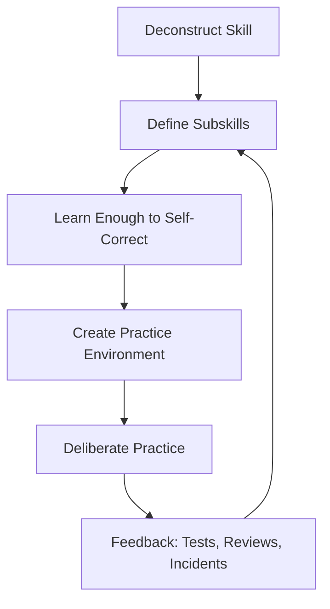
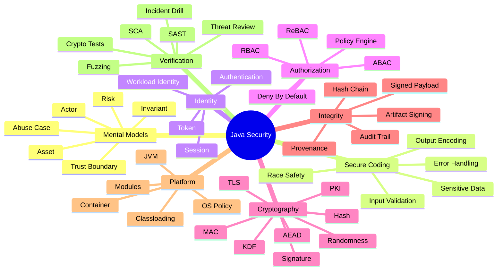
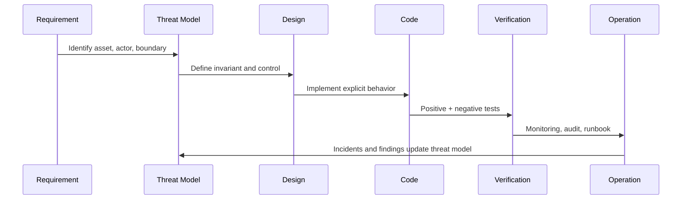

------
title: Learn Java Security, Cryptography, Integrity and Platform Hardening - Part 001
description: Kaufman-style skill map for mastering Java security as an engineering discipline: decomposition, deliberate practice, mental models, output artifacts, and the first 20 hours plan.
series: learn-java-security-cryptography-integrity-hardening
seriesTitle: Learn Java Security, Cryptography, Integrity and Platform Hardening
order: 1
partTitle: Kaufman Skill Map
tags:
- java
- security
- cryptography
- hardening
- integrity
- secure-coding
- kaufman
- series
date: 2026-06-28
---

# Part 001 — Kaufman Skill Map

> Target part ini: membangun **peta belajar security Java** yang efektif, tidak melebar, tidak mengulang Java basic, dan langsung diarahkan ke kemampuan engineer senior: membuat keputusan keamanan yang bisa diuji, diaudit, dan dipertahankan di production.

Security bukan satu skill tunggal. Security adalah gabungan dari beberapa kemampuan:

1. memahami sistem dan trust boundary,
2. memodelkan attacker capability,
3. memilih control yang tepat,
4. menghindari primitive crypto yang salah,
5. menjaga integrity data dan artifact,
6. mengeraskan runtime/platform,
7. membuktikan bahwa control bekerja,
8. menyiapkan failure response saat control gagal.

Josh Kaufman dalam *The First 20 Hours* mengajarkan pendekatan belajar skill secara cepat dengan cara: **deconstruct the skill**, belajar cukup untuk bisa mengoreksi diri, menghilangkan friction untuk praktik, lalu deliberate practice selama minimal 20 jam. Untuk Java Security, pendekatan ini sangat cocok karena jebakan terbesar security adalah merasa “sudah aman” hanya karena mengikuti template.

Di seri ini kita tidak mengejar hafalan checklist. Kita mengejar kemampuan membuat keputusan seperti ini:

- “Boundary mana yang sedang dilintasi data ini?”
- “Invariant security apa yang tidak boleh dilanggar?”
- “Crypto primitive apa yang benar untuk problem ini?”
- “Apa bukti bahwa artifact yang berjalan di production berasal dari source yang benar?”
- “Jika secret bocor, apa blast radius dan apa recovery path?”
- “Jika authorization bug terjadi, data mana yang terdampak dan bagaimana kita membuktikannya?”

---

## 1. Apa yang Berbeda dari Seri Ini

Seri Java sebelumnya sudah mencakup core Java, pattern, persistence, REST, messaging, BPMN, dan arsitektur aplikasi. Maka seri ini **tidak akan mengulang**:

- dasar class/interface/record/enum,
- dasar collection/stream/concurrency,
- REST CRUD design,
- JPA/Hibernate mapping,
- SQL transaction basic,
- BPMN orchestration basic,
- general design pattern.

Kita akan menggunakan semua pengetahuan itu sebagai asumsi dasar. Fokus seri ini adalah lapisan yang sering tidak terlihat di tutorial umum:

- trust boundary,
- data/control integrity,
- cryptographic correctness,
- secure defaults,
- operational hardening,
- supply-chain integrity,
- auditability,
- incident readiness.

Security engineer yang matang tidak bertanya “library apa yang dipakai?” terlebih dahulu. Mereka bertanya:

> “Apa properti keamanan yang harus tetap benar saat sistem diserang, salah dikonfigurasi, di-upgrade, atau gagal sebagian?”

---

## 2. Kaufman Framework untuk Java Security

Kita adaptasikan empat langkah Kaufman menjadi learning loop untuk security engineering.



### 2.1 Deconstruct the Skill

Java Security kita pecah menjadi 8 subskill utama:

| Subskill | Pertanyaan Inti | Output Engineering |
|---|---|---|
| Security mental model | Apa yang harus dilindungi dan dari siapa? | Threat model, asset map, trust boundary map |
| Secure coding | Bagaimana bug biasa berubah menjadi vulnerability? | Secure coding rules, negative tests, safe API usage |
| Identity & authorization | Siapa boleh melakukan apa, pada resource mana, dalam konteks apa? | Policy model, authorization matrix, access invariant |
| Cryptography | Properti apa yang dibutuhkan: secrecy, integrity, authenticity, non-repudiation? | Crypto design, key lifecycle, algorithm policy |
| Integrity | Bagaimana membuktikan data/artifact/event tidak berubah secara tidak sah? | Signatures, hash chain, audit trail, provenance |
| Platform hardening | Apa boundary runtime yang realistis untuk JVM modern? | JVM/container/OS hardening baseline |
| Supply chain | Bagaimana membuktikan dependency dan binary tidak disusupi? | SBOM, provenance, signing, SCA policy |
| Verification & response | Bagaimana membuktikan control bekerja dan pulih saat gagal? | Security tests, drills, runbooks, incident playbooks |

### 2.2 Learn Enough to Self-Correct

Dalam security, “belajar cukup” bukan berarti tahu semua CVE. Artinya tahu prinsip yang membuat Anda bisa mendeteksi bahwa solusi Anda salah.

Contoh self-correction:

| Area | Solusi yang Tampak Benar | Tanda Bahwa Itu Salah |
|---|---|---|
| Password | `SHA-256(password)` | Tidak adaptive, tidak memory-hard, mudah brute-force jika database bocor |
| Encryption | AES tanpa mode jelas | Bisa jadi ECB/CBC tanpa integrity; ciphertext bisa dimanipulasi |
| Token | Random string dengan `java.util.Random` | PRNG bukan CSPRNG; token bisa ditebak |
| TLS | Disable certificate validation saat error | Menghapus authenticity; MITM menjadi mungkin |
| Authorization | Cek role di controller | Bypass lewat service/internal call; policy tersebar |
| Logging | Log semua request/response | Bocor secret, token, PII, credential, atau regulated data |
| Audit | Simpan audit sebagai row biasa | Admin/attacker bisa mengubah audit tanpa tamper evidence |
| Dependency | Update hanya saat error build | Known vulnerability tetap masuk production |

Kemampuan self-correct muncul ketika Anda bisa mengaitkan keputusan implementasi dengan properti keamanan:

- confidentiality,
- integrity,
- availability,
- authenticity,
- authorization,
- accountability,
- privacy,
- non-repudiation,
- resilience.

### 2.3 Remove Practice Barriers

Security sulit dipelajari kalau hanya membaca. Kita perlu friction rendah untuk eksperimen.

Minimal practice environment:

```text
java-security-lab/
├── build.gradle.kts or pom.xml
├── src/main/java/
│   └── lab/
│       ├── crypto/
│       ├── authz/
│       ├── integrity/
│       ├── serialization/
│       └── hardening/
├── src/test/java/
│   └── lab/
│       ├── crypto/
│       ├── authz/
│       ├── threatmodel/
│       └── supplychain/
├── docs/
│   ├── threat-model.md
│   ├── security-adr.md
│   ├── asset-register.md
│   └── runbooks/
└── scripts/
    ├── generate-sbom.sh
    ├── verify-signature.sh
    └── rotate-test-keys.sh
```

Environment ini bukan untuk membangun produk penuh. Tujuannya membuat setiap konsep bisa diuji cepat:

- membuat token aman vs tidak aman,
- membuktikan nonce reuse merusak AEAD,
- memvalidasi certificate path,
- menguji authorization invariant,
- membuat signed audit event,
- mensimulasikan secret leak,
- membaca dependency graph,
- menjalankan SCA/SBOM.

### 2.4 Deliberate Practice

Security practice yang efektif tidak hanya “membuat fitur login”. Practice harus memaksa kita melihat failure mode.

Format latihan yang dipakai seri ini:

```text
Scenario:
  Sistem menerima request dari actor tertentu.

Asset:
  Data, credential, token, key, artifact, atau audit event yang dilindungi.

Threat:
  Apa yang bisa dilakukan attacker?

Invariant:
  Properti yang tidak boleh rusak.

Control:
  Mekanisme untuk mempertahankan invariant.

Verification:
  Test atau review yang membuktikan control bekerja.

Failure Drill:
  Apa yang dilakukan saat control gagal?
```

Contoh:

```text
Scenario:
  Case officer mengubah status enforcement case dari UNDER_REVIEW menjadi ESCALATED.

Asset:
  Case state, actor attribution, timestamp, decision reason.

Threat:
  User mengubah status tanpa otorisasi; admin DB mengubah audit row; replay request lama.

Invariant:
  Semua transition harus diotorisasi, valid menurut state machine, dan menghasilkan audit event tamper-evident.

Control:
  Centralized authorization decision, optimistic concurrency, signed audit event, replay nonce.

Verification:
  Negative test untuk forbidden transition, property test untuk state transition, audit signature verification.

Failure Drill:
  Jika signing key bocor, revoke key, rotate signer, mark affected audit period, regenerate trust report.
```

---

## 3. Skill Tree Java Security



Skill tree ini akan menjadi kompas semua part berikutnya.

---

## 4. Level Kompetensi yang Kita Kejar

Kita tidak menargetkan “tahu istilah”. Kita menargetkan **operational competence**.

| Level | Ciri | Risiko |
|---|---|---|
| Beginner | Mengikuti tutorial security framework | Aman hanya pada happy path |
| Intermediate | Tahu OWASP Top 10, TLS, JWT, hashing password | Masih rentan salah boundary dan salah crypto primitive |
| Senior | Bisa threat model, membuat invariant, menulis negative test, dan memilih control sesuai risk | Masih perlu disiplin review untuk supply chain dan ops |
| Top-tier | Bisa mendesain security platform, membuktikan integrity, memodelkan compromise, dan melakukan migration/incident dengan minimal chaos | Risiko utama: overengineering jika tidak dikaitkan dengan threat nyata |

Seri ini berorientasi ke level senior → top-tier.

---

## 5. Output yang Harus Bisa Anda Hasilkan

Setelah menyelesaikan seri ini, Anda harus bisa menghasilkan artifact berikut.

### 5.1 Security Architecture Artifact

- asset register,
- trust boundary diagram,
- data-flow diagram,
- abuse case list,
- risk register,
- security ADR,
- crypto design document,
- authorization model,
- audit event taxonomy,
- platform hardening baseline,
- incident runbook.

### 5.2 Code Artifact

- secure random token generator,
- password hashing service,
- AEAD encryption module,
- HMAC/signature verification module,
- certificate validation utility,
- central authorization service,
- tamper-evident audit writer,
- secure parser wrapper,
- safe secret loading abstraction,
- security regression test suite.

### 5.3 Operational Artifact

- SBOM,
- dependency risk report,
- key rotation plan,
- certificate expiry monitor,
- secret leak response plan,
- vulnerability triage policy,
- signed artifact verification pipeline,
- evidence package for audit/regulatory review.

Security yang matang selalu meninggalkan evidence. Tanpa evidence, “secure” hanya klaim.

---

## 6. Peta 20 Jam Pertama

Kaufman tidak mengatakan 20 jam membuat seseorang menjadi expert. Target 20 jam adalah melewati fase paling canggung sehingga kita punya traction untuk belajar lebih lanjut. Untuk Java Security, 20 jam pertama harus dipakai untuk membangun foundation yang benar.

### 6.1 Jadwal 20 Jam

| Jam | Fokus | Praktik | Output |
|---:|---|---|---|
| 1 | Skill map | Baca daftar seri, buat personal target | Learning target |
| 2 | Asset & actor | Ambil satu sistem Java nyata, daftar asset/actor | Asset register v1 |
| 3 | Trust boundary | Gambar data-flow dan boundary | Trust boundary diagram |
| 4 | Threat modeling | Buat abuse case dari 3 endpoint/process | Abuse case list |
| 5 | Security invariant | Tulis invariant untuk authz, data, audit | Invariant list |
| 6 | Secure coding | Review input/output/error handling | Secure coding checklist |
| 7 | Randomness | Implement token generator dengan `SecureRandom` | Token module + tests |
| 8 | Hash/MAC/KDF | Bedakan hash, HMAC, KDF | Decision matrix |
| 9 | Password storage | Implement password hashing policy | Password module design |
| 10 | AEAD | Implement AES-GCM wrapper dengan AAD | Encryption module |
| 11 | Signature | Implement signed payload verification | Signature module |
| 12 | TLS/PKI | Inspect truststore, hostname verification | TLS notes |
| 13 | Authorization | Centralize authorization decision | Policy skeleton |
| 14 | Audit integrity | Buat signed audit event | Audit event schema |
| 15 | Serialization | Review parser/deserialization risk | Parser policy |
| 16 | JVM hardening | Review JMX/debug/heap dump/secrets | Runtime baseline |
| 17 | Container hardening | Non-root, read-only FS, capabilities | Container checklist |
| 18 | Dependency integrity | Generate SBOM, scan dependencies | Dependency report |
| 19 | Incident drill | Simulasi leaked secret atau key compromise | Runbook v1 |
| 20 | Capstone mini-review | Review semua artifact | Security review report |

### 6.2 Kenapa Urutan Ini Penting

Jangan mulai dari crypto API. Itu kesalahan umum.

Crypto hanya benar jika problem-nya benar. Sebelum memilih AES-GCM, HMAC, EdDSA, atau TLS config, kita harus tahu:

- asset apa yang dilindungi,
- attacker bisa berada di mana,
- data melewati boundary apa,
- apakah butuh confidentiality, integrity, authenticity, atau replay protection,
- siapa yang memegang key,
- apa yang terjadi saat key bocor.

Tanpa threat model, crypto berubah menjadi dekorasi.

---

## 7. Security as Invariant Engineering

Mental model paling berguna untuk engineer adalah melihat security sebagai **invariant engineering**.

Invariant adalah properti yang harus tetap benar pada semua kondisi penting.

Contoh invariant:

```text
INV-AUTHZ-001:
  A user must never read a case unless the authorization decision says the user has access to that case at request time.

INV-AUDIT-001:
  Every state-changing command must produce an audit event that binds actor, action, resource, timestamp, reason, and request correlation id.

INV-CRYPTO-001:
  The same AEAD key and nonce pair must never be reused.

INV-SECRET-001:
  A production secret must never be present in source code, build logs, application logs, crash dumps, or client-visible responses.

INV-SUPPLY-001:
  A deployable artifact must not be promoted unless its source, dependency graph, build workflow, and signature can be verified.
```

Security bug sering terjadi saat invariant tidak tertulis. Jika invariant tidak tertulis, test tidak ada. Jika test tidak ada, regression akan lolos.

---

## 8. Control Bukan Tujuan

Security control adalah alat, bukan tujuan.

| Control | Properti yang Mungkin Diberikan | Hal yang Tidak Otomatis Dijamin |
|---|---|---|
| TLS | Confidentiality dan integrity in transit | Authorization, data-level integrity, secure endpoint |
| JWT | Portable claims dan signature | Session safety, revocation, correct authorization |
| Encryption at rest | Confidentiality saat storage dicuri | Integrity, access control, key safety |
| Hash | Integrity check jika reference hash trusted | Confidentiality |
| HMAC | Integrity dan authenticity shared-secret | Non-repudiation |
| Digital signature | Integrity dan authenticity private-key holder | Kebenaran business decision |
| RBAC | Coarse access policy | Contextual access control |
| Audit log | Observability/accountability | Tamper-evidence jika tidak didesain demikian |
| Container | Process isolation improvement | Full sandbox guarantee |

Engineer matang selalu bertanya:

> “Control ini menjaga properti apa, terhadap threat mana, dan bagaimana kita membuktikannya?”

---

## 9. Java-Specific Reality Check

Java punya security primitives yang kuat, tetapi ada beberapa realitas penting.

### 9.1 JCA Itu Powerful tetapi Mudah Disalahgunakan

Java Cryptography Architecture menyediakan provider architecture dan API untuk signature, digest, certificate validation, encryption, key generation/management, dan secure random. Ini kuat, tetapi API-nya menuntut pemilihan algorithm/mode/padding yang tepat.

Kesalahan umum:

```java
Cipher.getInstance("AES"); // ambiguous, provider-dependent default; often unsafe mental model
```

Lebih baik berpikir eksplisit:

```java
Cipher.getInstance("AES/GCM/NoPadding");
```

Tetapi bahkan ini belum cukup. Anda masih harus menjamin:

- key dibuat dengan benar,
- nonce unik,
- tag diverifikasi,
- associated data dipakai jika perlu,
- key rotation dirancang,
- error handling tidak bocor informasi,
- ciphertext format versioned.

### 9.2 Security Manager Bukan Fondasi Hardening Modern

Security Manager pernah menjadi mekanisme sandboxing internal JVM. Namun di Java modern, Security Manager telah dideprecate untuk removal sejak Java 17 dan JDK 24 melalui JEP 486 membuatnya tidak bisa diaktifkan lagi. Maka hardening modern harus berpindah ke boundary yang lebih realistis:

- process isolation,
- container isolation,
- OS permissions,
- network policy,
- least privilege runtime identity,
- read-only filesystem,
- dependency control,
- secure deployment pipeline.

Implikasinya: jangan mendesain plugin architecture atau sandbox Java modern dengan asumsi `SecurityManager` masih bisa menjadi boundary utama.

### 9.3 Framework Security Tidak Mengganti Security Model

Spring Security, Jakarta Security, Quarkus Security, Micronaut Security, atau custom gateway bisa membantu, tetapi tetap membutuhkan model:

- siapa actor,
- apa resource,
- apa action,
- apa context,
- apa policy,
- apa audit evidence,
- apa fallback saat policy engine unavailable.

Framework bisa mengeksekusi keputusan. Ia tidak otomatis membuat keputusan benar.

---

## 10. Security Learning Loop untuk Setiap Part

Setiap part idealnya dipelajari dengan loop berikut:



Jangan berhenti di code. Security harus lanjut sampai verification dan operation.

---

## 11. Struktur Artifact Belajar

Gunakan template berikut untuk setiap topik.

```md
# Security Learning Note

## Topic

## Asset Protected

## Threats Considered

## Security Property Needed
- Confidentiality:
- Integrity:
- Authenticity:
- Authorization:
- Availability:
- Accountability:

## Invariants

## Design Decision

## Implementation Notes

## Negative Tests

## Operational Concerns

## Failure / Incident Scenario

## References
```

Template ini memaksa kita menghindari jawaban dangkal.

---

## 12. Taxonomy Keputusan Security

Setiap keputusan security sebaiknya dikategorikan.

| Category | Contoh Keputusan | Pertanyaan Review |
|---|---|---|
| Policy | Role mana boleh approve case? | Apakah deny-by-default? |
| Mechanism | Pakai HMAC atau signature? | Properti apa yang dibutuhkan? |
| Configuration | TLS protocol/cipher apa? | Apakah default provider cukup? |
| Lifecycle | Kapan key dirotasi? | Apa dampak key compromise? |
| Evidence | Apa audit event yang disimpan? | Apakah tamper-evident? |
| Recovery | Bagaimana revoke token massal? | Apakah blast radius diketahui? |
| Governance | Siapa approve exception? | Apakah ada expiry exception? |

Security failure sering bukan karena tidak ada control, tetapi karena keputusan tidak punya lifecycle.

---

## 13. Anti-Pattern Belajar Security

### 13.1 Checklist-Driven Security

Checklist berguna, tetapi checklist tidak memahami sistem Anda.

Gejala:

- “Sudah pakai HTTPS berarti aman.”
- “Sudah pakai JWT berarti stateless dan secure.”
- “Sudah encryption at rest berarti data aman.”
- “Sudah scan dependency berarti supply chain aman.”

Perbaikannya: selalu turunkan checklist menjadi invariant, threat, dan verification.

### 13.2 Crypto-First Design

Gejala:

- langsung memilih AES/RSA/JWT sebelum threat model,
- menggabungkan crypto primitive sendiri,
- tidak punya key lifecycle,
- tidak punya ciphertext versioning,
- tidak tahu failure mode saat key bocor.

Perbaikannya: mulai dari security property, bukan algoritma.

### 13.3 Framework Absolutism

Gejala:

- semua masalah authorization dianggap selesai oleh annotation,
- semua endpoint dianggap aman karena gateway,
- internal service call dianggap trusted total,
- test hanya happy path.

Perbaikannya: treat framework sebagai enforcement mechanism, bukan policy model.

### 13.4 No Negative Testing

Gejala:

- test hanya memastikan admin boleh akses,
- tidak ada test bahwa non-owner tidak boleh akses,
- tidak ada test replay,
- tidak ada test expired token,
- tidak ada test corrupted signature.

Perbaikannya: security test harus banyak berisi negative case.

---

## 14. Mini Case Study: Enforcement Case Management

Misalkan ada sistem regulatory enforcement lifecycle:

- case intake,
- triage,
- investigation,
- evidence collection,
- escalation,
- enforcement decision,
- appeal,
- closure,
- audit/reporting.

Security concern-nya bukan hanya login.

### 14.1 Asset

| Asset | Sensitivity | Integrity Need | Availability Need |
|---|---:|---:|---:|
| Case record | High | High | High |
| Evidence document | Very high | Very high | Medium/High |
| Enforcement decision | High | Very high | Medium |
| Audit trail | Very high | Very high | High |
| Officer identity | High | High | High |
| Signing key | Critical | Critical | Medium |
| Report export | High | High | Medium |

### 14.2 Actor

| Actor | Capability | Risk |
|---|---|---|
| Case officer | View/update assigned cases | Excessive access, mistaken transition |
| Supervisor | Approve escalation/closure | Privilege abuse |
| External party | Submit documents/respond | Injection, forged identity, replay |
| System integration | Push status/evidence | Confused deputy, stale credential |
| Admin/operator | Access infrastructure | Data tampering, log access, secret exposure |
| Attacker | Compromised account or network position | Lateral movement, data theft |

### 14.3 Invariant

```text
A case state transition is valid only if:
  1. the transition is allowed by the lifecycle state machine,
  2. the actor is authorized for the specific case and action,
  3. mandatory evidence/reason fields are present,
  4. the command is not a replay,
  5. the resulting audit event is written before success is returned,
  6. the audit event is tamper-evident.
```

Notice: ini bukan pattern umum. Ini security + lifecycle model.

---

## 15. Personal Mastery Checklist

Sebelum lanjut ke part berikutnya, Anda sebaiknya bisa menjawab ini tanpa melihat catatan:

- Apa bedanya asset, threat, vulnerability, control, dan risk?
- Apa bedanya confidentiality, integrity, authenticity, dan authorization?
- Kenapa hash bukan encryption?
- Kenapa encryption tidak otomatis memberi integrity?
- Kenapa TLS tidak mengganti authorization?
- Kenapa JWT signature tidak berarti user masih boleh akses resource?
- Kenapa audit log biasa belum tentu tamper-evident?
- Kenapa Security Manager tidak bisa dijadikan fondasi sandbox modern?
- Kenapa security test harus punya banyak negative case?
- Apa artifact minimum dari security architecture review?

Jika belum bisa, ulangi part ini dan buat contoh dari sistem nyata Anda.

---

## 16. Latihan Part 001

### Latihan 1 — Personal Security Target

Tulis target 20 jam pertama Anda:

```text
Dalam 20 jam, saya ingin bisa:
  - membuat threat model untuk satu service Java,
  - memilih crypto primitive untuk 3 skenario umum,
  - menulis authorization invariant,
  - membuat audit event tamper-evident sederhana,
  - membuat baseline hardening runtime Java,
  - menjelaskan residual risk secara jernih.
```

### Latihan 2 — Pilih Sistem Latihan

Ambil satu service Java nyata atau fiktif. Contoh:

- case management service,
- payment authorization service,
- document upload service,
- internal admin portal,
- event ingestion service,
- user identity service.

Tulis:

```text
System:
Primary assets:
Actors:
External boundaries:
Internal boundaries:
Most dangerous operation:
Most sensitive data:
Worst realistic incident:
```

### Latihan 3 — Buat 5 Invariant

Minimal:

1. satu authorization invariant,
2. satu data integrity invariant,
3. satu crypto/key invariant,
4. satu audit invariant,
5. satu supply-chain/runtime invariant.

Contoh format:

```text
INV-XXX-001:
  [property] must never [bad outcome] when [condition].

Rationale:
  [why this matters]

Verification:
  [test/review/monitoring]
```

---

## 17. Kesalahan yang Harus Dihindari dari Awal

1. Menggunakan istilah security tanpa mendefinisikan property.
2. Menganggap internal network selalu trusted.
3. Menganggap admin/operator tidak perlu dimodelkan sebagai risk.
4. Memakai crypto sebelum memahami key lifecycle.
5. Mencampur authentication dan authorization.
6. Menganggap audit log sama dengan audit evidence.
7. Mengabaikan dependency dan build pipeline.
8. Tidak menulis negative test.
9. Membuat exception security tanpa expiry.
10. Menerima “secure by default” tanpa verifikasi.

---

## 18. Reference Baseline untuk Seri Ini

Seri ini akan memakai baseline referensi berikut:

- Java Cryptography Architecture Reference Guide, Java SE 25.
- Oracle Secure Coding Guidelines for Java SE.
- OpenJDK JEP 411 dan JEP 486 untuk status Security Manager.
- OWASP Application Security Verification Standard.
- NIST cryptographic standards, termasuk post-quantum readiness.
- SLSA untuk supply-chain integrity.
- Dokumentasi resmi library/framework saat membahas implementasi spesifik.

Prinsip referensi:

1. Untuk Java platform behavior, gunakan dokumentasi JDK/OpenJDK.
2. Untuk application security requirement, gunakan OWASP ASVS.
3. Untuk crypto standard, gunakan NIST/IETF/RFC atau dokumentasi JDK provider.
4. Untuk supply chain, gunakan SLSA, Sigstore, Maven/Gradle official docs.
5. Untuk implementasi framework, gunakan dokumentasi resmi framework, bukan blog acak.

---

## 19. Ringkasan

Part ini memberikan peta. Intinya:

- Java Security adalah gabungan mental model, coding discipline, crypto correctness, runtime hardening, supply-chain integrity, dan operational response.
- Kaufman framework membantu kita belajar efektif dengan memecah skill menjadi subskill dan langsung berlatih pada artifact nyata.
- Target seri ini bukan hafal checklist, tetapi mampu membuat security decision yang punya invariant, control, verification, dan recovery path.
- Kita akan selalu bergerak dari asset → threat → invariant → control → verification → operation.

Di part berikutnya, kita masuk ke fondasi paling penting: **security mental model**.
