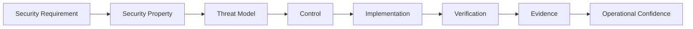
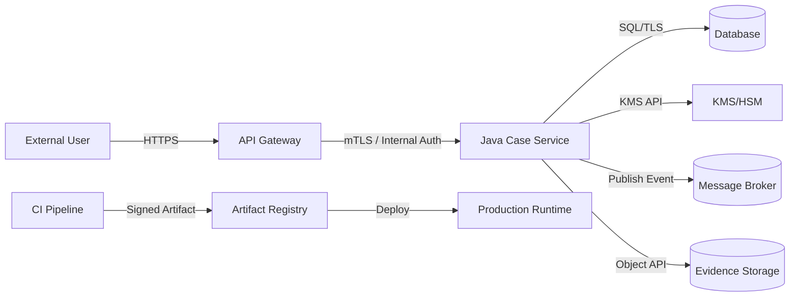
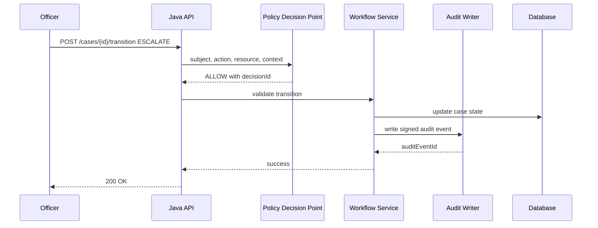
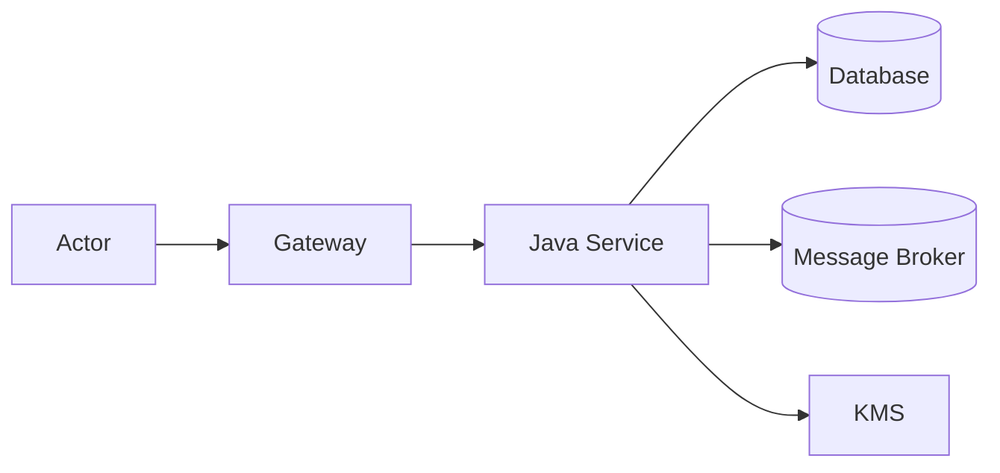

------
title: Learn Java Security, Cryptography, Integrity and Platform Hardening - Part 002
description: Security mental model for Java engineers: asset, actor, trust boundary, threat, invariant, control, residual risk, abuse case, and evidence-driven security design.
series: learn-java-security-cryptography-integrity-hardening
seriesTitle: Learn Java Security, Cryptography, Integrity and Platform Hardening
order: 2
partTitle: Security Mental Model
tags:
- java
- security
- threat-modeling
- secure-architecture
- risk
- integrity
- hardening
- series
date: 2026-06-28
---

# Part 002 — Security Mental Model

> Target part ini: membangun cara berpikir security yang presisi. Sebelum masuk ke crypto, TLS, keystore, authorization framework, serialization, atau hardening JVM, kita harus bisa memodelkan sistem sebagai kumpulan asset, actor, boundary, capability, invariant, dan evidence.

Security sering gagal bukan karena engineer tidak tahu tools. Security gagal karena model mentalnya kabur.

Contoh model kabur:

- “Endpoint ini aman karena sudah login.”
- “Service internal tidak perlu authorization.”
- “Data sudah encrypted, jadi integrity aman.”
- “JWT valid berarti user masih boleh melakukan action.”
- “Audit log sudah ada, jadi regulator pasti menerima.”
- “Container sudah cukup sebagai sandbox.”
- “Dependency scanner hijau berarti supply chain aman.”

Semua kalimat di atas bisa benar dalam konteks tertentu, tetapi berbahaya jika dianggap absolut. Security membutuhkan reasoning yang lebih tajam.

---

## 1. Security adalah Properti, Bukan Fitur

Fitur security adalah sesuatu yang kita implementasikan:

- login,
- TLS,
- password hashing,
- JWT,
- encryption,
- access control,
- audit log,
- dependency scanning,
- container hardening.

Properti security adalah sesuatu yang ingin kita pertahankan:

- confidentiality,
- integrity,
- availability,
- authenticity,
- authorization,
- accountability,
- non-repudiation,
- privacy,
- safety,
- resilience.

Fitur tanpa properti adalah checklist. Properti tanpa verification adalah klaim.



Contoh:

```text
Requirement:
  Evidence documents must not be altered after submission.

Property:
  Integrity and accountability.

Threat:
  A compromised operator modifies a stored document or metadata row.

Control:
  Content hash, immutable storage policy, signed audit event, separation of duties.

Verification:
  Tamper simulation, signature verification test, audit reconciliation job.

Evidence:
  Hash records, audit signature, storage retention policy, verification report.
```

---

## 2. Vocabulary yang Wajib Presisi

### 2.1 Asset

Asset adalah sesuatu yang bernilai dan perlu dilindungi.

Dalam sistem Java, asset bisa berupa:

| Asset Type | Contoh |
|---|---|
| Data | Case record, PII, evidence file, payment instruction, medical record |
| Credential | Password hash, API key, OAuth refresh token, mTLS private key |
| Crypto material | Symmetric key, signing key, truststore, certificate, salt, nonce counter |
| Computation | Authorization decision, risk score, enforcement decision |
| State | Workflow state, approval state, lock state, session state |
| Artifact | JAR, container image, dependency, migration script, config bundle |
| Evidence | Audit log, signed event, build provenance, approval record |
| Availability | Queue processing capacity, database access, certificate validity, KMS availability |

Asset harus spesifik. “Database” terlalu besar. “Officer assignment table that determines who may access case records” lebih berguna.

### 2.2 Actor

Actor adalah entitas yang bisa melakukan tindakan.

| Actor | Contoh Security Concern |
|---|---|
| End user | Account takeover, excessive privilege |
| Admin user | Privilege abuse, accidental data exposure |
| Service account | Secret leakage, overbroad access |
| Batch job | Unauthorized bulk mutation |
| External integration | Replay, spoofing, stale credential |
| Operator/SRE | Debug access, heap dump leakage |
| Build system | Artifact tampering, dependency substitution |
| Library/dependency | Malicious code, vulnerable transitive dependency |
| Attacker | Network MITM, credential stuffing, lateral movement |

Security model yang tidak memasukkan operator, build system, dan dependency sebagai actor biasanya terlalu sempit.

### 2.3 Capability

Capability adalah apa yang bisa dilakukan actor, bukan hanya role formalnya.

Contoh:

```text
Role:
  Database administrator

Capability:
  Can update rows directly, read encrypted blobs, access backups, trigger restores, inspect slow query logs.

Security implication:
  Application-level authorization alone does not protect against direct database tampering.
```

Ini penting: attacker sering mendapatkan capability dari compromise, bukan dari role yang sah.

### 2.4 Trust Boundary

Trust boundary adalah titik di mana asumsi berubah.

Contoh boundary:

- internet → API gateway,
- API gateway → Java service,
- Java service → database,
- Java service → KMS,
- Java service → message broker,
- service → filesystem,
- CI pipeline → artifact repository,
- artifact repository → production deployment,
- operator laptop → production cluster,
- JVM process → native library,
- application code → dynamically loaded plugin.

Boundary bukan hanya network. Boundary juga bisa berupa:

- privilege boundary,
- data ownership boundary,
- tenant boundary,
- lifecycle boundary,
- cryptographic trust boundary,
- administrative boundary,
- build/runtime boundary.

### 2.5 Threat

Threat adalah potensi peristiwa buruk yang melibatkan actor, asset, dan capability.

Format sederhana:

```text
Actor with capability does action against asset causing violated property.
```

Contoh:

```text
A compromised service account replays an old case-approval command against the case workflow API, causing an unauthorized state transition and invalid audit evidence.
```

### 2.6 Vulnerability

Vulnerability adalah kelemahan yang membuat threat bisa terjadi.

Contoh:

| Threat | Vulnerability |
|---|---|
| Replay approval command | Tidak ada nonce/idempotency/replay window |
| Modify audit row | Audit tidak signed/append-only |
| Read other tenant data | Query tidak memfilter tenant boundary di service layer |
| Forge webhook | Tidak ada HMAC/signature verification |
| Steal token from logs | Logging middleware mencatat Authorization header |

### 2.7 Control

Control adalah mekanisme untuk mengurangi likelihood atau impact threat.

Jenis control:

| Control Type | Contoh |
|---|---|
| Preventive | Authorization check, mTLS, input validation, deny-by-default |
| Detective | Audit log, anomaly detection, signature verification job |
| Corrective | Key rotation, token revocation, rollback, quarantine |
| Compensating | Manual approval, read-only mode, secondary reconciliation |
| Deterrent | Accountability, separation of duties, tamper-evident audit |

Control tidak harus sempurna. Tetapi control harus jelas terhadap threat mana ia bekerja.

### 2.8 Risk

Risk adalah kombinasi dari likelihood, impact, exposure, dan control effectiveness.

Jangan berpura-pura terlalu presisi dengan angka jika datanya lemah. Untuk banyak engineering decision, klasifikasi seperti ini cukup:

```text
Likelihood: Low / Medium / High
Impact: Low / Medium / High / Critical
Exposure: Internal / Partner / Internet-facing / Supply-chain-wide
Detection: Easy / Moderate / Hard
Recovery: Easy / Costly / Irreversible
```

Risk yang matang selalu menyebut residual risk:

```text
Control:
  Sign webhook payload with HMAC-SHA-256.

Residual risk:
  If shared secret leaks from sender or receiver, attacker can forge valid webhooks until secret rotation completes.
```

---

## 3. Core Security Properties

### 3.1 Confidentiality

Confidentiality berarti data tidak bisa dibaca oleh pihak yang tidak berhak.

Control umum:

- access control,
- TLS,
- encryption at rest,
- field-level encryption,
- secret management,
- data minimization,
- redaction/masking,
- memory/heap dump controls.

Common Java failure:

```java
log.info("request={}", request); // may include token, password, PII, case detail
```

Confidentiality tidak hanya soal database encryption. Logging, metrics, error response, cache, queue, search index, backup, dan heap dump juga termasuk.

### 3.2 Integrity

Integrity berarti data atau computation tidak berubah secara tidak sah atau tidak terdeteksi.

Control umum:

- MAC,
- digital signature,
- optimistic locking,
- append-only log,
- hash chain,
- database constraints,
- signed event,
- build artifact signing,
- provenance verification.

Common Java failure:

```text
Application writes audit rows, but privileged DB access can update or delete them without detection.
```

Integrity bukan hanya “data valid”. Integrity adalah kemampuan mendeteksi atau mencegah perubahan yang tidak sah.

### 3.3 Availability

Availability berarti sistem atau capability tetap bisa digunakan saat dibutuhkan.

Control umum:

- rate limiting,
- circuit breaker,
- bulkhead,
- timeout,
- queue backpressure,
- redundancy,
- graceful degradation,
- certificate/key expiry monitoring,
- incident runbook.

Common Java failure:

```text
All token validation depends on remote introspection service with no timeout/circuit breaker.
```

Security yang mengabaikan availability bisa menciptakan denial of service lewat control-nya sendiri.

### 3.4 Authenticity

Authenticity berarti identitas asal atau sumber bisa dipercaya.

Control umum:

- password/passkey/authenticator,
- mTLS,
- digital signature,
- HMAC,
- certificate validation,
- workload identity,
- signed artifact.

Common Java failure:

```text
Service accepts webhook because source IP looks internal, without verifying payload signature.
```

Network location bukan authenticity yang kuat.

### 3.5 Authorization

Authorization berarti actor hanya bisa melakukan action yang diizinkan pada resource tertentu dalam context tertentu.

Authorization selalu minimal punya tuple:

```text
subject + action + resource + context -> decision
```

Contoh:

```text
Subject:
  Officer A

Action:
  ESCALATE_CASE

Resource:
  Case #123

Context:
  assigned_region=WEST, case_state=UNDER_REVIEW, conflict_of_interest=false

Decision:
  ALLOW or DENY
```

Common Java failure:

```java
@PreAuthorize("hasRole('OFFICER')")
public CaseDetail getCase(String caseId) { ... }
```

Role saja tidak cukup jika access bergantung pada assignment, tenant, region, state, ownership, atau conflict-of-interest.

### 3.6 Accountability

Accountability berarti tindakan bisa dikaitkan dengan actor, waktu, resource, dan alasan secara kredibel.

Control umum:

- audit event,
- signed audit,
- correlation ID,
- immutable log,
- strong identity,
- approval workflow,
- separation of duties.

Common Java failure:

```text
Audit event says updatedBy='system' for many actions because asynchronous worker loses original actor context.
```

Accountability rusak jika actor context hilang di boundary async.

### 3.7 Non-Repudiation

Non-repudiation berarti actor sulit menyangkal tindakan tertentu karena ada bukti kuat.

Biasanya membutuhkan:

- strong authentication,
- digital signature atau equivalent evidence,
- timestamping,
- audit integrity,
- key custody model,
- legal/process support.

Hati-hati: HMAC tidak memberi non-repudiation kuat karena secret dibagi oleh lebih dari satu pihak.

### 3.8 Privacy

Privacy bukan hanya confidentiality. Privacy juga mencakup:

- data minimization,
- purpose limitation,
- retention,
- consent/legal basis,
- subject access controls,
- unlinkability/pseudonymization jika relevan,
- privacy-safe logging.

Dalam Java system, privacy sering bocor lewat:

- DTO terlalu besar,
- logs,
- analytics event,
- debug endpoint,
- search index,
- BI export,
- backup retention.

---

## 4. Trust Boundary Mapping

Security design dimulai dari menggambar boundary.



Untuk setiap edge, tanyakan:

1. Siapa yang memanggil siapa?
2. Bagaimana caller diautentikasi?
3. Bagaimana caller diotorisasi?
4. Data apa yang dikirim?
5. Apakah data butuh confidentiality?
6. Apakah data butuh integrity?
7. Apakah replay mungkin?
8. Apakah error response bisa bocor informasi?
9. Apakah ada audit event?
10. Apa yang terjadi jika dependency/boundary ini down?

Boundary map adalah alat untuk menemukan security requirement yang tersembunyi.

---

## 5. Threat Modeling Minimal yang Praktis

Threat model tidak harus dokumen 80 halaman. Untuk engineering flow, cukup mulai dari lima pertanyaan.

```text
1. What are we building?
2. What can go wrong?
3. What are we doing about it?
4. Did we do a good job?
5. What changed?
```

Untuk Java system, ubah menjadi:

```text
1. Asset apa yang dilindungi service ini?
2. Actor/capability apa yang menyentuh asset itu?
3. Boundary apa yang dilintasi data/control?
4. Invariant apa yang tidak boleh dilanggar?
5. Control dan test apa yang membuktikan invariant?
```

### 5.1 Threat Model Template

```md
# Threat Model: <System / Feature>

## Scope

## Assets

## Actors and Capabilities

## Trust Boundaries

## Data Flows

## Security Invariants

## Threats

| ID | Threat | Asset | Actor | Boundary | Impact | Control | Verification |
|---|---|---|---|---|---|---|---|

## Residual Risks

## Security Decisions

## Open Questions
```

### 5.2 Example: Document Upload

```text
Feature:
  External party uploads evidence document for an enforcement case.

Assets:
  Document content, metadata, case linkage, uploader identity, audit event.

Threats:
  - Upload malware or parser bomb.
  - Link document to unauthorized case.
  - Replace document after submission.
  - Replay upload confirmation.
  - Leak document via logs or temporary file.
  - Bypass file type validation.

Invariants:
  - Uploaded document must be linked only to cases the actor may access.
  - Document content hash must be computed before persistence confirmation.
  - Document content must not be logged.
  - Audit event must bind uploader, case, content hash, timestamp, and request ID.
  - File scanning failure must not silently mark document as safe.
```

---

## 6. Abuse Case Thinking

Use case menjelaskan apa yang user ingin lakukan. Abuse case menjelaskan bagaimana actor menyalahgunakan sistem.

| Use Case | Abuse Case |
|---|---|
| Officer views assigned case | Officer changes case ID in URL to view another region's case |
| External party uploads evidence | External party uploads file that triggers parser vulnerability |
| Supervisor approves escalation | Compromised supervisor token replays old approval |
| System exports report | User exports more data than visible in UI |
| Admin rotates key | Old key remains accepted forever |
| CI builds artifact | Build pulls malicious transitive dependency |

Abuse case harus dekat dengan real workflow. Jangan hanya menulis “hacker attacks system”.

---

## 7. Invariant-First Design

Invariant adalah kontrak security.

Format yang bagus:

```text
INV-<DOMAIN>-<NUMBER>
  Under <condition>, <bad outcome> must never happen.

Rationale:
  Why this matters.

Controls:
  Mechanisms used.

Verification:
  Tests/reviews/monitoring.

Failure Handling:
  What happens if invariant may have been violated.
```

Contoh:

```text
INV-AUTHZ-001
  A user must never read, update, approve, export, or delete a case unless an authorization decision allows that subject-action-resource-context tuple at request time.

Rationale:
  Case access is sensitive and context-dependent.

Controls:
  Central policy decision point, resource-scoped checks, deny-by-default, assignment validation.

Verification:
  Negative tests for cross-region, cross-tenant, unassigned, stale assignment, and state-incompatible actions.

Failure Handling:
  Disable affected access path, identify accessed case IDs, notify security/regulatory owner, generate incident evidence.
```

### 7.1 Good vs Bad Invariant

Bad:

```text
System must be secure.
```

Better:

```text
A case export must contain only records visible to the requesting subject under the same policy used by the read API at export creation time.
```

Bad:

```text
Use encryption for sensitive data.
```

Better:

```text
Evidence documents stored outside the primary database must be encrypted with a data key that is unique per document or per bounded encryption context and protected by a managed key encryption key.
```

---

## 8. Control Selection Matrix

Pilih control berdasarkan property dan threat.

| Problem | Wrong Reflex | Better Reasoning |
|---|---|---|
| Need to hide data in transit | “Use JWT” | Use TLS; JWT is not transport encryption |
| Need to prove payload came from partner | “Use HTTPS only” | Use mTLS or payload signature/HMAC depending on trust model |
| Need to store password | “Encrypt password” | Use adaptive password hashing with salt and policy |
| Need to detect audit tampering | “Only restrict DB access” | Add append-only design, signatures/hash chain, reconciliation |
| Need to prevent replay | “Use encryption” | Use nonce/timestamp/idempotency/replay cache/signature binding |
| Need to protect artifact | “Run unit tests” | Use signed artifact, provenance, dependency verification, deployment policy |
| Need to sandbox plugin | “Use Security Manager” | Use process/container isolation and capability-limited interface |

The right control depends on the security property.

---

## 9. Security Decision Record

Security decisions harus bisa dibaca ulang ketika incident, audit, atau migration.

Template:

```md
# Security Decision Record: <Title>

## Status
Accepted / Deprecated / Superseded

## Context
What system, asset, threat, and constraints exist?

## Decision
What are we choosing?

## Security Properties
- Confidentiality:
- Integrity:
- Authenticity:
- Authorization:
- Availability:
- Accountability:

## Alternatives Considered

## Consequences

## Residual Risk

## Verification

## Expiry / Review Date
```

### 9.1 Example Decision

```md
# Security Decision Record: Signed Case State Transition Events

## Status
Accepted

## Context
Case transition events are consumed by reporting, notification, and audit services. A compromised broker or database operator must not be able to silently alter event content.

## Decision
Every state transition event will include a canonical payload and detached digital signature. Consumers must verify signature before accepting the event for audit-sensitive processing.

## Security Properties
- Integrity: Detect unauthorized modification.
- Authenticity: Bind event to authorized signing service.
- Accountability: Preserve actor and command context.

## Alternatives Considered
- HMAC: rejected for cross-service non-repudiation concerns.
- Broker ACL only: insufficient against broker/admin tampering.

## Consequences
- Requires key lifecycle and signing service availability.
- Requires canonical serialization.
- Requires signature verification tests.

## Residual Risk
If signing key is compromised, attacker can forge events until key is revoked and consumers reject affected key ID.

## Verification
- Negative test with modified payload.
- Negative test with wrong key ID.
- Replay test.
- Key rotation drill every quarter.
```

---

## 10. Boundary-Specific Java Questions

### 10.1 HTTP Boundary

Ask:

- Is authentication required?
- Is authorization resource-scoped?
- Are request bodies size-limited?
- Is input parsed safely?
- Are errors sanitized?
- Are sensitive headers logged?
- Are CSRF/CORS concerns relevant?
- Are idempotency/replay protections needed?

### 10.2 Database Boundary

Ask:

- Does app-level authorization still hold if someone has DB access?
- Are row-level ownership/tenant constraints enforced?
- Are migrations reviewed for privilege escalation?
- Are sensitive columns encrypted or tokenized?
- Are backups protected with equal or stronger controls?
- Are audit rows tamper-evident?

### 10.3 Message Broker Boundary

Ask:

- Can producer identity be verified?
- Can consumer trust message content?
- Is replay possible?
- Are messages signed/MACed if broker is not fully trusted?
- Are dead-letter queues protected?
- Are sensitive payloads logged by broker tooling?

### 10.4 Filesystem Boundary

Ask:

- Is path canonicalized?
- Are temp files protected?
- Are uploaded files scanned?
- Are file permissions minimal?
- Are filenames trusted?
- Can symlink/hardlink attacks matter?
- Are heap dumps/thread dumps exposed?

### 10.5 Classloading / Plugin Boundary

Ask:

- Who supplies code?
- Is code trusted or untrusted?
- What permissions/capabilities does plugin need?
- Is reflection allowed?
- Can plugin access secrets through environment/system properties?
- Is plugin isolated by process/container?

### 10.6 Build Boundary

Ask:

- Are dependencies pinned or floating?
- Are checksums verified?
- Are artifacts signed?
- Is provenance generated?
- Can CI secrets be exfiltrated by build scripts?
- Can pull requests execute privileged workflows?

---

## 11. Java Security Review Heuristics

Gunakan heuristik berikut saat membaca code.

### 11.1 Dangerous Import/Usage Signals

| Signal | Why It Matters |
|---|---|
| `java.util.Random` for token/security | Not cryptographically secure |
| `Cipher.getInstance("AES")` | Ambiguous mode/padding; often unsafe default mental model |
| `MessageDigest` for password | Fast hash unsuitable for password storage |
| `X509TrustManager` that accepts all | Breaks TLS authenticity |
| Disabled hostname verification | Enables MITM |
| Java native serialization | Gadget/deserialization risk |
| Reflection on untrusted input | Boundary bypass/code execution risk |
| Logging full request/response | Secret/PII leakage |
| `@PreAuthorize("hasRole(...)")` only | Often insufficient for resource-scoped authz |
| Hardcoded secrets | Source/build/log exposure |
| Overbroad service account | Large blast radius |

### 11.2 Review Question Pattern

For every risky code path:

```text
What asset does this touch?
Who can call it?
What boundary is crossed?
What assumption is made?
What happens if the assumption is false?
What invariant should hold?
Where is it verified?
What evidence remains after execution?
```

---

## 12. Failure Mode Thinking

Security design is incomplete without failure mode.

| Component | Failure | Security Impact | Design Response |
|---|---|---|---|
| KMS | unavailable | Cannot decrypt/sign | Fail closed or degraded mode depending asset criticality |
| Truststore | stale | Cert validation fails or accepts wrong CA | Rotation process, expiry monitor, rollout test |
| Policy engine | unavailable | Authz decision unavailable | Fail closed for sensitive actions |
| Audit writer | unavailable | State change without audit | Transactional outbox or fail command |
| Token revocation store | unavailable | Revoked tokens may pass | Short-lived token or fail closed for high-risk ops |
| Dependency scanner | unavailable | Builds bypass security gate | Explicit exception with expiry |
| Signing key | compromised | Forged events/artifacts possible | Key revocation, trust policy update, affected period analysis |

Security maturity terlihat dari jawaban saat control gagal.

---

## 13. Evidence-Driven Security

Dalam production dan regulasi, kita perlu evidence.

Evidence menjawab:

- apa yang terjadi,
- siapa yang melakukan,
- kapan,
- resource apa yang terdampak,
- control apa yang bekerja,
- control apa yang gagal,
- bagaimana dampak dibatasi,
- bagaimana sistem dipulihkan.

### 13.1 Evidence Types

| Evidence | Use |
|---|---|
| Access log | Request-level trace |
| Audit event | Business/security-relevant action |
| Signature/hash | Tamper detection |
| Correlation ID | Cross-service reconstruction |
| Build provenance | Artifact origin proof |
| SBOM | Dependency visibility |
| Key rotation record | Crypto lifecycle proof |
| Incident runbook execution log | Response proof |
| Security test report | Control verification |
| Risk acceptance record | Governance proof |

### 13.2 Audit Event Minimum

```json
{
  "eventId": "01H...",
  "eventType": "CASE_STATE_TRANSITIONED",
  "occurredAt": "2026-06-28T10:15:30Z",
  "actor": {
    "type": "USER",
    "id": "officer-123",
    "authnMethod": "OIDC_MFA"
  },
  "resource": {
    "type": "CASE",
    "id": "case-456"
  },
  "action": "ESCALATE",
  "reason": "High risk threshold exceeded",
  "previousState": "UNDER_REVIEW",
  "newState": "ESCALATED",
  "requestId": "req-789",
  "policyDecisionId": "pdp-abc",
  "payloadHash": "base64url...",
  "signature": "base64url...",
  "keyId": "audit-signing-key-2026-q2"
}
```

Audit event yang baik bukan hanya log message. Ia adalah business/security evidence.

---

## 14. Running Example: Case Transition Security

Mari modelkan satu flow.



Security questions:

| Step | Question |
|---|---|
| Request | Is actor authenticated strongly enough? |
| API | Is case ID authorization resource-scoped? |
| PDP | Is decision based on current assignment/state/context? |
| Workflow | Is state transition valid and concurrency-safe? |
| DB | Can direct DB mutation bypass audit? |
| Audit | Is event tamper-evident and linked to decision? |
| Response | Does response leak sensitive case information? |

Security invariants:

```text
INV-CASE-001:
  A case state transition must not be executed unless both authorization policy and lifecycle state machine allow it.

INV-CASE-002:
  A successful case state transition must produce a tamper-evident audit event before success is returned.

INV-CASE-003:
  The audit event must bind actor, action, resource, prior state, new state, decision ID, timestamp, and request ID.

INV-CASE-004:
  A repeated command with the same idempotency key must not create multiple effective transitions.
```

Negative tests:

```text
- officer from wrong region cannot transition case
- officer assigned yesterday but removed today cannot transition case
- valid role but invalid lifecycle state cannot transition case
- replayed request does not transition twice
- audit writer failure prevents success or triggers guaranteed recovery path
- modified audit payload fails verification
```

---

## 15. Risk Acceptance Without Self-Deception

Tidak semua risk bisa dihilangkan. Tetapi risk acceptance harus eksplisit.

Bad:

```text
We accept the risk because it is internal only.
```

Better:

```text
Risk:
  Internal batch service can read all case metadata.

Reason for acceptance:
  Current reporting architecture requires full metadata scan. Replacing it requires project X.

Compensating controls:
  Dedicated service account, read-only DB role, network policy, query logging, no evidence content access, quarterly access review.

Expiry:
  Revisit by 2026-12-31.

Owner:
  Platform Security + Reporting Service Owner.
```

Risk acceptance tanpa owner dan expiry adalah risk hiding.

---

## 16. Security Design Smells

| Smell | Why Dangerous |
|---|---|
| “Internal only” | Internal compromise is common and lateral movement matters |
| “Admin can do anything” | No separation of duties or accountability |
| “We encrypt it” | Missing key lifecycle, integrity, access model |
| “Gateway handles auth” | Internal paths may bypass gateway |
| “JWT contains role” | Role may be stale or insufficient for resource context |
| “Logs are enough for audit” | Logs may be mutable, incomplete, or privacy-unsafe |
| “Scanner passed” | Scanners miss logic flaws and context |
| “Temporary exception” without expiry | Becomes permanent vulnerability |
| “We trust this library” | Dependency may be compromised or misused |
| “Security will review later” | Late review finds architecture-level issues too late |

---

## 17. Security Mental Model Checklist

Gunakan checklist ini saat mendesain feature Java baru.

```text
Feature:

Assets:
  -

Actors:
  -

Trust boundaries crossed:
  -

Security properties required:
  Confidentiality:
  Integrity:
  Availability:
  Authenticity:
  Authorization:
  Accountability:
  Privacy:

Threats:
  -

Invariants:
  -

Controls:
  -

Negative tests:
  -

Operational evidence:
  -

Residual risks:
  -

Runbook needed:
  yes/no
```

---

## 18. Latihan Part 002

### Latihan 1 — Asset Register

Pilih satu Java service. Isi tabel:

| Asset | Owner | Sensitivity | Integrity Need | Availability Need | Current Control | Gap |
|---|---|---:|---:|---:|---|---|
| | | | | | | |

Minimal 10 asset.

### Latihan 2 — Boundary Diagram

Gambar boundary dengan Mermaid:



Lalu untuk setiap edge, tulis:

```text
Edge:
Authentication:
Authorization:
Confidentiality:
Integrity:
Replay protection:
Audit evidence:
Failure mode:
```

### Latihan 3 — Tulis 8 Abuse Case

Minimal mencakup:

- unauthorized read,
- unauthorized update,
- replay,
- data tampering,
- secret leakage,
- dependency compromise,
- audit tampering,
- availability failure.

### Latihan 4 — Ubah Abuse Case Menjadi Invariant

Contoh:

```text
Abuse case:
  User changes caseId in request to access another region's case.

Invariant:
  A case read must return data only if the authorization decision allows the subject to read the specific case ID under current assignment and region context.

Negative test:
  Authenticated officer with valid role but wrong region receives 403 and no case data is serialized.
```

---

## 19. Ringkasan

Part ini membangun fondasi security mental model:

- Security adalah properti yang harus dipertahankan, bukan fitur yang dicentang.
- Asset, actor, capability, trust boundary, threat, vulnerability, control, dan residual risk harus dibedakan dengan presisi.
- Authorization, integrity, authenticity, confidentiality, availability, accountability, privacy, dan non-repudiation adalah properti berbeda.
- Security design yang baik dimulai dari invariant dan diakhiri dengan evidence.
- Untuk Java system, boundary penting tidak hanya HTTP dan database, tetapi juga classloading, filesystem, message broker, KMS, build pipeline, artifact repository, dan runtime platform.

Di part berikutnya, kita akan membuat **Java Attack Surface Map**: JVM, classpath/module path, reflection, serialization, native access, network, filesystem, environment variables, dependencies, CI/CD, dan runtime config.
