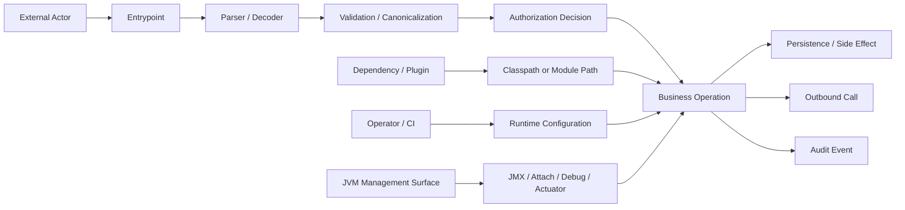
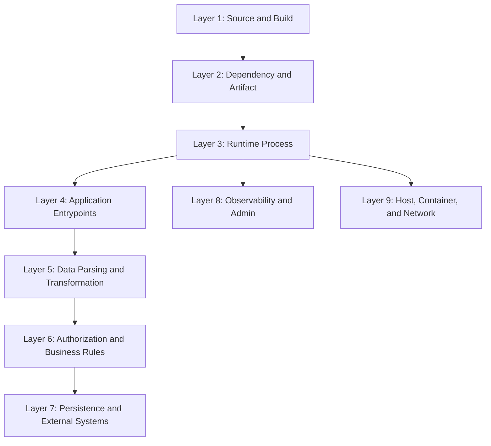
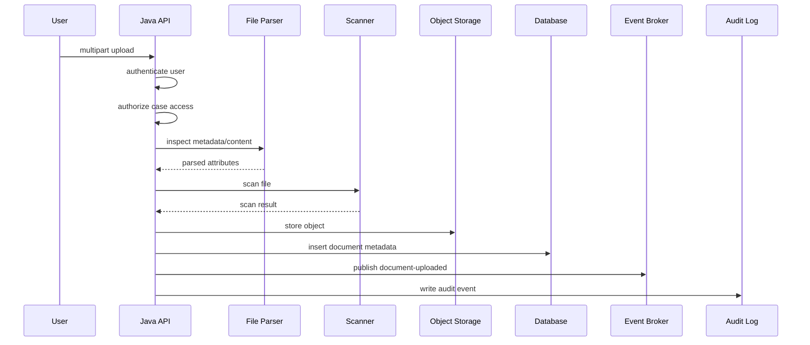

------
title: Learn Java Security, Cryptography, Integrity and Platform Hardening - Part 003
description: Java attack surface map: entrypoints, trust boundaries, classpath/module path, reflection, serialization, filesystem, network, runtime management, dependency supply chain, and operational exposure.
series: learn-java-security-cryptography-integrity-hardening
seriesTitle: Learn Java Security, Cryptography, Integrity and Platform Hardening
order: 3
partTitle: Java Attack Surface Map
tags:
- java
- security
- attack-surface
- threat-modeling
- jvm
- classloading
- hardening
- secure-architecture
- series
date: 2026-06-28
---

# Part 003 — Java Attack Surface Map

> Target part ini: mampu membuat **peta attack surface Java system** yang bisa dipakai untuk threat modeling, architecture review, hardening, security testing, dan incident response. Kita belum masuk crypto detail. Kita sedang membangun peta medan perang.

Attack surface adalah semua tempat di mana attacker, user, dependency, operator, sistem lain, runtime, atau environment bisa memengaruhi sistem.

Untuk Java engineer, attack surface tidak hanya berarti HTTP endpoint. Attack surface meliputi:

- API endpoint,
- message consumer,
- scheduler,
- file parser,
- database boundary,
- cache boundary,
- deserialization boundary,
- classpath/module path,
- dependency resolver,
- JVM flags,
- JMX/Actuator/admin endpoint,
- keystore/truststore,
- environment variable,
- CI/CD pipeline,
- container image,
- log/audit pipeline,
- runtime attach/debug interface,
- native library,
- plugin/extension mechanism.

Security bug yang serius sering tidak masuk dari endpoint yang terlihat. Ia masuk dari “jalur samping”: dependency transitive, parser file, debug port, permissive deserialization, broken truststore, artifact palsu, atau konfigurasi runtime yang dianggap harmless.

---

## 1. Attack Surface sebagai Model, Bukan Daftar Endpoint

Daftar endpoint seperti ini tidak cukup:

```text
POST /login
POST /orders
GET  /orders/{id}
POST /documents/upload
POST /webhooks/payment
```

Daftar itu hanya menunjukkan **interface publik**. Attack surface map harus menjawab pertanyaan yang lebih struktural:

- Data dari siapa masuk?
- Data berubah bentuk di mana?
- Data melewati boundary apa?
- Code path mana yang aktif karena input tersebut?
- Resource apa yang bisa dikonsumsi input tersebut?
- Secret atau key mana yang disentuh?
- Authorization decision terjadi di mana?
- Integrity check terjadi sebelum atau sesudah side effect?
- Jika komponen ini dikompromikan, apa blast radius-nya?

Attack surface map adalah gabungan dari:

1. **entrypoint map** — semua cara sistem dipanggil,
2. **trust boundary map** — semua lintasan dari zona kurang dipercaya ke zona lebih dipercaya,
3. **capability map** — apa yang bisa dilakukan code path setelah dipanggil,
4. **data transformation map** — parsing, decoding, validation, canonicalization, deserialization,
5. **runtime exposure map** — hal-hal yang tidak muncul di source code tetapi aktif saat production,
6. **supply-chain map** — dari source menjadi artifact production.

Mental model-nya:



Hal penting: attacker tidak harus menjadi “external hacker”. Dalam sistem enterprise, actor bisa berupa:

- user valid yang menyalahgunakan haknya,
- service internal yang compromised,
- partner system yang bug,
- operator dengan credential berlebih,
- dependency maintainer yang akunnya disusupi,
- CI job yang dimodifikasi,
- attacker yang hanya bisa mengirim file/message,
- attacker yang hanya bisa membaca logs.

---

## 2. Kenapa Java Punya Attack Surface yang Khas

Java punya beberapa karakter yang kuat:

- managed runtime,
- rich standard library,
- classloading dinamis,
- reflection,
- serialization history,
- provider-based security architecture,
- besar di enterprise integration,
- banyak framework berbasis annotation dan runtime scanning,
- dependency graph Maven/Gradle yang dalam,
- deployment di app server, container, serverless, batch, dan desktop.

Kekuatan ini juga menjadi attack surface.

Contoh:

| Java Capability | Manfaat | Attack Surface |
|---|---|---|
| Classloading | Plugin, modularity, container runtime | classpath poisoning, unexpected implementation, malicious JAR |
| Reflection | Framework injection, serialization, mapping | bypass encapsulation, unsafe dynamic method access |
| Serialization | Object transfer, legacy persistence | gadget chain, type confusion, remote code execution |
| JCA Provider | Pluggable crypto implementation | provider order, weak algorithm availability, accidental provider mismatch |
| JMX | Runtime management | remote management exposure, credential leak, privileged operation |
| Agents/Attach API | Observability, profiling | runtime instrumentation, memory extraction, code injection |
| Native access/JNI/FFM | Performance/integration | memory corruption, privilege boundary collapse |
| Maven/Gradle | Dependency management | dependency confusion, typosquatting, malicious transitive dependency |

Java juga sering berada di sistem yang punya data bernilai tinggi:

- banking,
- insurance,
- regulatory workflow,
- identity systems,
- government records,
- healthcare,
- payment,
- logistics,
- telecom,
- enterprise ERP/CRM.

Artinya, security posture Java tidak boleh berhenti di “pakai framework X”. Kita harus melihat platform secara penuh.

---

## 3. Attack Surface Layer Model

Untuk membuat peta yang konsisten, gunakan layer berikut.



### Layer 1 — Source and Build

Pertanyaan utama:

- Siapa yang bisa mengubah source?
- Siapa yang bisa mengubah build script?
- Apakah build reproducible?
- Apakah CI job bisa mengambil secret?
- Apakah PR dari fork bisa menjalankan workflow privileged?
- Apakah generated code diaudit?
- Apakah test artifact bisa masuk ke production artifact?

Java-specific surface:

- `pom.xml`, `build.gradle`, `settings.gradle`, Gradle init script,
- annotation processor,
- code generator,
- Maven plugin,
- Gradle plugin,
- test fixture yang accidentally packaged,
- shaded/fat JAR,
- generated sources,
- Dockerfile/Jib config,
- CI cache.

Anti-pattern:

```text
Security review hanya membaca src/main/java, tetapi tidak membaca pom.xml/build.gradle.
```

Build script adalah executable specification. Jika build script compromised, source code yang benar tidak cukup.

### Layer 2 — Dependency and Artifact

Pertanyaan utama:

- Dependency berasal dari repository mana?
- Apakah dependency lock/checksum digunakan?
- Apakah transitive dependency terlihat?
- Apakah artifact ditandatangani atau diverifikasi?
- Apakah artifact production sama dengan artifact yang diuji?
- Apakah ada dependency snapshot/dynamic version?

Java-specific surface:

```xml
<dependency>
  <groupId>com.example</groupId>
  <artifactId>security-utils</artifactId>
  <version>LATEST</version>
</dependency>
```

Dynamic version atau snapshot di production build membuat artifact tidak deterministik. Ini melemahkan forensic dan rollback.

Surface penting:

- Maven Central,
- private repository,
- internal mirror,
- dependency substitution,
- plugin repository,
- container base image,
- JDK distribution,
- generated SBOM,
- signed JAR,
- build provenance.

### Layer 3 — Runtime Process

Pertanyaan utama:

- User OS apa yang menjalankan proses?
- File permission apa yang dimiliki JVM?
- Apakah heap dump bisa dibuat?
- Apakah debug/attach/JMX aktif?
- Apakah environment variable membawa secret?
- Apakah process bisa menulis ke filesystem luas?
- Apakah JVM bisa membuka outbound connection ke mana saja?

Java-specific surface:

```bash
java \
  -Dspring.profiles.active=prod \
  -Djavax.net.ssl.trustStore=/secrets/truststore.p12 \
  -Dcom.sun.management.jmxremote \
  -jar app.jar
```

Satu flag bisa mengubah security posture. Source code yang aman bisa menjadi insecure jika runtime config membuka management surface.

### Layer 4 — Application Entrypoints

Entrypoint tidak hanya REST.

| Entrypoint | Contoh | Risiko Utama |
|---|---|---|
| HTTP API | REST/JAX-RS/Spring MVC | auth bypass, injection, SSRF, mass assignment |
| gRPC | service method | schema evolution, metadata trust, auth propagation |
| Message consumer | Kafka/Rabbit/JMS | poison message, replay, unsafe deserialization |
| Scheduler | cron/quartz/batch | privilege misuse, stale credential, idempotency failure |
| File import | CSV/XML/PDF/ZIP | zip slip, XXE, parser bomb, malware, path traversal |
| Webhook | payment/partner callback | signature bypass, replay, spoofing |
| Admin UI | internal console | overprivilege, CSRF, missing audit |
| CLI | batch tool | argument injection, unsafe file path |
| Plugin SPI | extension JAR | code execution boundary collapse |

Rule:

> Setiap entrypoint harus punya owner, trust level, input contract, authentication model, authorization model, rate/resource limit, dan audit decision.

### Layer 5 — Data Parsing and Transformation

Banyak exploit dimulai sebelum business logic berjalan.

Examples:

- JSON polymorphic deserialization,
- XML external entity,
- YAML object construction,
- ZIP path traversal,
- regex catastrophic backtracking,
- CSV formula injection,
- Unicode normalization bypass,
- URL parsing ambiguity,
- date/time parsing mismatch,
- integer overflow in length/limit calculation,
- compressed payload bomb.

Parser adalah boundary. Jangan menganggap parsing sebagai operasi pasif.

### Layer 6 — Authorization and Business Rules

Authorization bukan hanya filter di controller.

Pertanyaan utama:

- Siapa actor sebenarnya?
- Apakah actor bertindak atas dirinya sendiri, organisasi, atau sistem lain?
- Apakah authorization dilakukan sebelum side effect?
- Apakah query database sudah scoped?
- Apakah object-level access diuji?
- Apakah batch job memakai privilege terlalu besar?
- Apakah service-to-service call membawa user context atau service context?

Attack surface authorization sering muncul di:

- admin endpoint,
- internal endpoint,
- scheduled job,
- async consumer,
- export/reporting,
- search endpoint,
- object reference,
- workflow transition,
- approval override,
- support tooling.

### Layer 7 — Persistence and External Systems

Persistence bukan hanya database. Ia meliputi:

- relational database,
- NoSQL,
- cache,
- object storage,
- search index,
- queue,
- audit store,
- data warehouse,
- external SaaS,
- identity provider,
- KMS/HSM,
- payment provider,
- email/SMS provider.

Pertanyaan utama:

- Data mana yang menjadi source of truth?
- Apakah cache bisa mengungkap data lintas tenant?
- Apakah audit log immutable atau hanya table biasa?
- Apakah external call bisa dimanipulasi menjadi SSRF?
- Apakah retry menyebabkan duplicate side effect?
- Apakah outbound payload membawa data berlebih?

### Layer 8 — Observability and Admin

Observability sering menjadi data exfiltration surface.

Surface:

- logs,
- metrics,
- traces,
- heap dump,
- thread dump,
- profiler,
- JMX,
- admin console,
- health endpoint,
- feature flags,
- remote config,
- alert payload,
- SIEM forwarding.

Contoh leak:

```text
User login failed: password=Summer2026! token=eyJhbGciOi...
```

Log bukan tempat aman untuk secret, token, private key, one-time code, atau raw PII.

### Layer 9 — Host, Container, and Network

Java app sering dianggap “aman karena di container”. Container bukan security boundary sempurna; ia adalah isolation layer yang harus dikonfigurasi.

Pertanyaan utama:

- Apakah process non-root?
- Apakah filesystem read-only?
- Apakah Linux capabilities diminimalkan?
- Apakah outbound network dibatasi?
- Apakah service account punya privilege minimum?
- Apakah secret mounted sebagai file atau env?
- Apakah pod/container bisa membaca metadata service?
- Apakah base image minimal dan patchable?

---

## 4. Java Entrypoint Inventory Template

Gunakan template ini untuk setiap service.

```yaml
service: case-management-api
owner: regulatory-platform-team
runtime:
  jdk: "25"
  packaging: container
  entry_command: "java -jar app.jar"
  user: non-root
  network_zone: private-app-subnet

entrypoints:
  - id: ep-http-case-transition
    type: http
    method: POST
    path: /cases/{caseId}/transitions/{transition}
    exposed_to: authenticated-users
    trust_level: external-authenticated
    input_formats: [json, path-param]
    authentication: oidc-access-token
    authorization: object-and-transition-policy
    resource_limits:
      rate_limit: per-user-and-tenant
      body_size: 64kb
    side_effects:
      - update-case-state
      - write-audit-event
      - publish-domain-event
    sensitive_data:
      - case-id
      - actor-id
      - decision-reason
    audit_required: true
    main_risks:
      - broken-object-level-authorization
      - invalid-transition
      - replay
      - audit-tampering

  - id: ep-kafka-document-scan-result
    type: message-consumer
    topic: document-scan-result-v1
    exposed_to: internal-service
    trust_level: internal-untrusted-payload
    input_formats: [json]
    authentication: broker-acl-and-mtls
    authorization: producer-allowlist
    idempotency_key: scanJobId
    side_effects:
      - update-document-risk-status
      - notify-case-owner
    main_risks:
      - spoofed-message
      - replay
      - poison-message
      - stale-scan-result
```

Kunci penting: `trust_level: internal-untrusted-payload`.

Internal network tidak otomatis berarti trusted payload. Message dari service internal tetap perlu divalidasi, diotorisasi, dan diberi batas resource.

---

## 5. Trust Boundary Matrix

Buat matriks lintasan data.

| From | To | Boundary | Control Minimum | Evidence |
|---|---|---|---|---|
| Browser/client | API gateway | public → edge | TLS, auth, WAF/rate limit | gateway logs, auth logs |
| API gateway | Java service | edge → app | verified identity propagation, mTLS/service auth | request trace, cert identity |
| Java service | DB | app → data | least privilege DB user, scoped query | DB audit, query logs |
| Java service | KMS | app → key service | workload identity, key policy | KMS audit event |
| Partner webhook | Java service | third-party → app | signature verification, replay window | signature validation log |
| CI pipeline | Artifact registry | build → artifact | signed artifact, provenance | signature, SBOM, attestation |
| Operator | Runtime config | human → production | approval, audit, secret handling | change record |
| JVM | Logs/SIEM | app → observability | redaction, integrity, retention | log policy, hash chain if needed |

Boundary matrix membuat review lebih tajam karena setiap lintasan punya control dan evidence.

Security tanpa evidence hanya klaim.

---

## 6. Capability Mapping

Setelah entrypoint dipetakan, tanya: “code path ini bisa melakukan apa?”

Contoh capability:

```yaml
capabilities:
  filesystem:
    read:
      - /app/config
      - /secrets/truststore.p12
    write:
      - /tmp/app
  network:
    outbound:
      - postgres.internal:5432
      - kafka.internal:9093
      - kms.internal:443
    inbound:
      - 8080
  secrets:
    reads:
      - db-password
      - tls-client-key
      - jwt-verification-key
  data:
    reads:
      - case
      - document-metadata
      - user-profile
    writes:
      - case-state
      - audit-event
      - notification-outbox
  privileged_operations:
    - approve-transition
    - override-escalation
    - export-case-record
```

Jika sebuah endpoint hanya perlu membaca case summary tetapi process punya capability export seluruh case archive, maka blast radius endpoint itu besar jika RCE atau SSRF terjadi.

Prinsip:

> Attack surface bukan hanya “cara masuk”. Attack surface juga “apa yang bisa dilakukan setelah masuk”.

---

## 7. Java-Specific Hidden Surfaces

### 7.1 Classpath and Module Path

Classpath/module path menentukan code mana yang bisa dieksekusi.

Risiko:

- malicious JAR lebih dulu di classpath,
- duplicate class,
- dependency version drift,
- test dependency masuk runtime,
- shaded dependency menyembunyikan CVE,
- service provider interface memuat implementation yang tidak diharapkan.

Contoh service provider risk:

```text
META-INF/services/com.example.PaymentVerifier
```

Jika aplikasi memuat provider via `ServiceLoader`, maka dependency baru bisa menambah behavior runtime tanpa perubahan eksplisit di business code.

Checklist:

- Inventory dependency runtime, bukan hanya compile-time.
- Bedakan application dependency, build plugin, test dependency, annotation processor.
- Jangan anggap `provided` atau `optional` selalu aman.
- Review `META-INF/services` pada dependency sensitif.
- Hindari dynamic plugin tanpa trust policy.

### 7.2 Reflection

Reflection sering dibutuhkan oleh framework, tetapi tetap surface.

Risiko:

- akses field/method yang tidak dimaksudkan,
- bypass setter validation,
- mass assignment,
- unsafe object construction,
- framework binding terlalu permissive,
- exposure internal object lewat JSON/XML mapper.

Contoh anti-pattern:

```java
public class UserUpdateRequest {
    public String displayName;
    public boolean admin;
    public String tenantId;
}
```

Jika binder otomatis mengisi semua field dari request, attacker bisa mencoba mengatur `admin` atau `tenantId`.

Better:

```java
public record UserProfileUpdateRequest(
        String displayName,
        String timezone
) {}
```

Jangan expose field yang tidak boleh dikontrol client.

### 7.3 Serialization

Java native serialization punya sejarah panjang sebagai RCE surface. Bahkan jika tidak memakai `ObjectInputStream` langsung, framework atau library bisa membuka surface serupa lewat polymorphic deserialization.

Surface:

- `ObjectInputStream`,
- RMI,
- HTTP session replication legacy,
- distributed cache,
- message payload object,
- JSON polymorphic type info,
- XML object binding,
- YAML object construction.

Rule:

> Treat deserialization as code-adjacent execution boundary, not as simple parsing.

### 7.4 JMX, Debug, Attach, and Heap Dumps

Management tools sangat berguna, tetapi privileged.

Surface:

- remote JMX,
- unauthenticated actuator endpoint,
- JDWP debug port,
- attach API,
- heap dump endpoint,
- thread dump endpoint,
- profiler agent,
- JVM diagnostic command.

Heap dump bisa berisi:

- password,
- token,
- private key material,
- session,
- PII,
- database credentials,
- request payload.

Checklist:

- Jangan expose debug/JMX ke network publik.
- Batasi siapa yang bisa membuat heap dump.
- Treat heap dump as sensitive artifact.
- Jangan simpan dump di shared storage tanpa encryption/access control.
- Disable atau restrict endpoint diagnostics di production.

### 7.5 Environment Variables and System Properties

Java apps sering membaca config dari env/system properties:

```java
String password = System.getenv("DB_PASSWORD");
String profile = System.getProperty("spring.profiles.active");
```

Risiko:

- env leak di crash dump,
- env terlihat oleh process lain tergantung OS/config,
- secret tercetak dalam startup logs,
- system property override melemahkan TLS/crypto,
- malicious config mengubah endpoint ke attacker-controlled host.

Treat config as input. Config juga bisa malicious atau salah.

---

## 8. Attack Surface Review untuk Java Service

Gunakan urutan review berikut.

### Step 1 — Enumerate Entrypoints

Jangan berhenti di HTTP controller.

Cari:

```text
@Controller / @RestController / @Path
@MessageListener / @KafkaListener / JMS listener
@Scheduled / Quartz job
CommandLineRunner / ApplicationRunner
Servlet Filter / Interceptor
Webhook endpoint
File watcher
RMI/JMX exposure
gRPC service
GraphQL resolver
Batch job
Migration script
Plugin SPI
```

### Step 2 — Mark Trust Level

Trust level contoh:

```text
public-anonymous
public-authenticated
partner-authenticated
internal-service
internal-untrusted-payload
operator-admin
ci-build
runtime-platform
third-party-library
```

Jangan gunakan `trusted` tanpa definisi.

### Step 3 — Identify Parsing Boundary

Untuk setiap entrypoint:

- Apa format input?
- Siapa parser-nya?
- Apakah parser strict?
- Apakah parser punya limit?
- Apakah parser melakukan type coercion?
- Apakah payload bisa nested dalam?
- Apakah content-type dipercaya begitu saja?

### Step 4 — Identify Security Decisions

Security decision meliputi:

- authentication,
- authorization,
- tenant isolation,
- quota/rate/resource limit,
- integrity check,
- replay protection,
- idempotency,
- audit eligibility,
- data classification.

### Step 5 — Identify Side Effects

Side effect:

- database write,
- event publish,
- email/SMS,
- file write,
- cache mutation,
- external API call,
- workflow transition,
- audit event.

Security review harus memastikan decision terjadi sebelum side effect.

### Step 6 — Identify Blast Radius

Tanya:

- Jika endpoint ini dieksploitasi, data mana yang bisa dibaca?
- Data mana yang bisa diubah?
- Secret mana yang bisa dicapai?
- Apakah attacker bisa bergerak lateral?
- Apakah exploit bisa diulang massal?
- Apakah audit akan mencatat actor dan object?
- Apakah recovery bisa dilakukan?

---

## 9. Example: Document Upload Attack Surface

Skenario: service menerima dokumen PDF/ZIP dari user untuk proses regulatory case.

### Naive View

```text
POST /cases/{caseId}/documents
```

### Real Attack Surface



### Attack Surface Questions

| Area | Question |
|---|---|
| Upload | Is body size limited before buffering? |
| Filename | Is filename treated as display-only, not path? |
| Content type | Is MIME sniffing controlled? |
| Archive | Is zip-slip prevented? Is decompressed size limited? |
| Parser | Can parser fetch external resource? |
| Malware | Is scan async or sync? What state before scan completes? |
| Storage | Is object key attacker-controlled? |
| Authorization | Can user attach document to another case? |
| Integrity | Is file hash stored? Is metadata bound to file? |
| Replay | Can same upload token be reused? |
| Audit | Is actor, case, document hash, decision logged? |
| Retention | Can deleted file remain in object storage? |

### Better Design Invariants

```text
I1: A user can upload a document only to a case they are authorized to modify.
I2: User-supplied filename is never used as filesystem/object-storage path.
I3: Raw file bytes are hashed before storage, and hash is stored with metadata.
I4: Document is not usable by downstream workflows until malware scan passes.
I5: Parser failure must not create partial approved state.
I6: Audit log records actor, case, document id, hash, upload decision, and timestamp.
I7: Every upload has a resource limit before expensive parsing.
```

Notice: these are not implementation details. They are security invariants.

---

## 10. Common Java Attack Surface Anti-Patterns

### Anti-pattern 1 — “Internal Means Trusted”

Bad assumption:

```text
Only internal services call this endpoint, so no authorization is needed.
```

Better model:

```text
Internal service identity proves caller workload, not user intent.
```

Internal service can be compromised. Internal traffic can carry user-controlled payload. Internal endpoint can be reached accidentally after network change.

### Anti-pattern 2 — “Framework Handles Security”

Framework can help, but it cannot know your business invariant.

Framework may enforce:

- token exists,
- role exists,
- CSRF token exists,
- TLS enabled,
- JSON parsed.

Framework cannot automatically know:

- whether this user may approve this exact case,
- whether this transition is allowed from current state,
- whether support override is permitted under this regulation,
- whether document metadata matches actual file,
- whether audit record is legally sufficient.

### Anti-pattern 3 — “Dependency Scanner Green Means Safe”

Scanner mostly catches known vulnerabilities in known versions. It may not catch:

- malicious maintainer update before CVE,
- dependency confusion,
- build plugin compromise,
- typo-squatted dependency,
- vulnerable configuration,
- vulnerable usage of safe library,
- shaded vulnerable dependency,
- generated code issue.

### Anti-pattern 4 — “Security Manager Will Sandbox It”

Modern Java cannot rely on Security Manager as a sandbox foundation. Security Manager was deprecated for removal by JEP 411 and permanently disabled by JEP 486. The practical replacement is stronger isolation outside the JVM: process boundary, container/OS policy, service decomposition, least privilege identity, and capability minimization.

### Anti-pattern 5 — “Crypto Solves Integrity Automatically”

Encryption without authentication does not guarantee integrity. Hash without key does not guarantee authenticity. Signature without canonicalization may sign a representation that is not the one business logic uses.

We will detail this in crypto parts. For attack surface mapping, the important point is:

> Integrity requirement must be explicit before choosing crypto primitive.

---

## 11. Attack Surface Register

For each system, maintain a register like this.

```markdown
# Attack Surface Register — case-management-api

## Runtime

- JDK: 25
- Deployment: Kubernetes container
- OS user: non-root
- Inbound ports: 8080
- Outbound: postgres, kafka, kms, identity-provider
- Management endpoints: health only, no heapdump in prod
- Debug/JMX: disabled in prod

## Entrypoints

| ID | Type | Trust Level | Side Effects | Primary Risks | Evidence |
|---|---|---|---|---|---|
| EP-001 | HTTP POST /cases/{id}/transition | public-authenticated | DB update, audit, event | BOLA, invalid transition, replay | authz test, audit test |
| EP-002 | Kafka document-scan-result | internal-untrusted-payload | DB update, notification | spoof, stale result, poison message | producer ACL, signature, idempotency test |
| EP-003 | Scheduled escalation job | internal-system | DB update, event | overprivilege, stale policy | job audit, policy test |

## Dependencies

- Runtime dependencies reviewed via SBOM.
- Build plugins reviewed separately.
- No dynamic dependency version allowed.
- Shaded dependencies must be listed.

## Data Classification

- Case data: confidential regulatory data.
- Document: confidential, may include PII.
- Audit event: integrity critical.
- Access token: secret.
- Case transition reason: sensitive.
```

Register ini bukan dokumen compliance pasif. Gunakan untuk:

- design review,
- pull request review,
- test planning,
- incident response,
- penetration test scoping,
- onboarding engineer baru,
- audit evidence.

---

## 12. Attack Surface as Code

Untuk system besar, simpan surface metadata dekat dengan repo.

Contoh:

```yaml
security:
  service: case-management-api
  owner: reg-platform
  data_classification:
    - confidential
    - integrity-critical
  entrypoints:
    - id: ep-case-transition
      type: http
      authn: oidc
      authz: case-transition-policy
      audit: required
      tests:
        - CaseTransitionAuthorizationTest
        - CaseTransitionAuditTest
    - id: ep-escalation-job
      type: scheduled-job
      authn: workload-identity
      authz: system-policy
      audit: required
      tests:
        - EscalationPolicyInvariantTest
```

Benefit:

- review bisa otomatis mendeteksi entrypoint tanpa metadata,
- security tests bisa dikaitkan ke control,
- audit evidence lebih mudah,
- perubahan attack surface terlihat di diff PR.

---

## 13. Practice: 90-Minute Attack Surface Drill

Pilih satu service Java yang kamu pahami. Dalam 90 menit, buat artifact berikut.

### 0–15 menit — Enumerate

Cari semua entrypoint:

- controller/resource,
- consumer,
- scheduler,
- batch,
- admin,
- file import,
- webhook,
- JMX/diagnostic,
- plugin extension.

### 15–35 menit — Boundary

Untuk setiap entrypoint, tulis:

- caller,
- trust level,
- input format,
- authentication,
- authorization,
- side effect.

### 35–55 menit — Capability

Tulis apa yang bisa dilakukan process:

- filesystem,
- network,
- secret,
- database,
- object storage,
- event publish,
- external call.

### 55–75 menit — Risk

Pilih 5 entrypoint paling berbahaya berdasarkan:

- data sensitivity,
- privilege,
- side effect,
- exposure,
- parser complexity,
- history of bugs.

### 75–90 menit — Evidence

Untuk masing-masing 5 entrypoint, tulis evidence yang harus ada:

- automated test,
- log/audit event,
- config assertion,
- policy rule,
- build scan,
- runtime check.

Output minimal:

```text
attack-surface-register.md
security-entrypoints.yaml
risk-top-5.md
```

---

## 14. Review Rubric

Gunakan rubric ini saat membaca design atau PR.

| Question | Good Signal | Bad Signal |
|---|---|---|
| Entrypoints lengkap? | HTTP, async, scheduler, admin, file, build included | Only REST endpoints listed |
| Trust level eksplisit? | `internal-untrusted-payload` etc. | “trusted internal” tanpa definisi |
| Parser risk jelas? | size, nesting, type, external resource controlled | accepts raw object/map/file blindly |
| Authorization dekat dengan object? | policy checks actor + object + action | role check only |
| Side effect protected? | decision before mutation | mutation before validation/audit |
| Runtime exposed? | JMX/debug/heapdump reviewed | “ops will handle it” |
| Supply chain included? | dependency/plugin/artifact considered | only app code reviewed |
| Evidence defined? | test/log/config proof | control claimed but unverified |

---

## 15. What Top Engineers Notice Early

Engineer yang matang melihat pola berikut lebih cepat:

1. **Parser is a boundary.** File, JSON, XML, YAML, ZIP, JWT, certificate, and URL parsing are not neutral operations.
2. **Internal is not trusted.** Internal is only a different threat model.
3. **Runtime config is code.** JVM flags, env, truststore, logging config, and management endpoints can change security posture.
4. **Build is production.** Build plugin and dependency resolver can compromise artifact before app starts.
5. **Audit is a security control.** But only if it has integrity, actor attribution, and retention.
6. **Capability determines blast radius.** Least privilege is not aesthetic; it limits damage after compromise.
7. **Security Manager is not the plan.** Modern Java hardening must use external isolation and least privilege.
8. **Evidence beats assertion.** Every serious control needs a test, configuration proof, runtime proof, audit event, or cryptographic proof.

---

## 16. Checklist Ringkas

Sebelum lanjut ke secure coding guideline, pastikan kamu bisa menjawab:

- Apa semua entrypoint sistem?
- Mana entrypoint yang bukan HTTP?
- Boundary mana yang paling lemah?
- Parser mana yang menerima input dari luar?
- Apakah internal message tetap dianggap untrusted?
- Apa side effect terbesar per entrypoint?
- Apakah authorization dilakukan sebelum mutation?
- Apakah runtime management surface aktif?
- Apakah heap dump/log bisa membocorkan secret?
- Apakah build dependency dan plugin masuk peta?
- Jika attacker mendapat RCE, apa yang bisa dicapai process?
- Evidence apa yang membuktikan control bekerja?

---

## 17. Summary

Attack surface map adalah fondasi sebelum secure coding, crypto, TLS, keystore, supply-chain hardening, dan incident response.

Tanpa attack surface map:

- secure coding menjadi checklist acak,
- crypto dipasang tanpa properti yang jelas,
- authorization test tidak tahu boundary,
- hardening hanya mengikuti template,
- incident response tidak tahu blast radius,
- audit evidence sulit dipertahankan.

Dengan attack surface map:

- setiap entrypoint punya owner dan trust model,
- setiap boundary punya control,
- setiap side effect punya authorization dan audit,
- setiap runtime exposure bisa diputuskan secara sadar,
- setiap build/dependency risk terlihat,
- setiap control bisa dibuktikan.

Di Part 004, kita akan turun dari architecture map ke level coding: bagaimana menulis Java code yang mempertahankan security invariant di trust boundary, parser, exception handling, resource management, logging, dan concurrency.

---

## References

- Oracle Java SE 25 Security Developer's Guide — Java Cryptography Architecture: https://docs.oracle.com/en/java/javase/25/security/java-cryptography-architecture-jca-reference-guide.html
- Oracle Secure Coding Guidelines for Java SE: https://www.oracle.com/java/technologies/javase/seccodeguide.html
- Java SE 25 `java.security` package summary: https://docs.oracle.com/en/java/javase/25/docs/api/java.base/java/security/package-summary.html
- OpenJDK JEP 411 — Deprecate the Security Manager for Removal: https://openjdk.org/jeps/411
- OpenJDK JEP 486 — Permanently Disable the Security Manager: https://openjdk.org/jeps/486
- OWASP Application Security Verification Standard: https://owasp.org/www-project-application-security-verification-standard/
