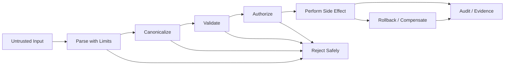
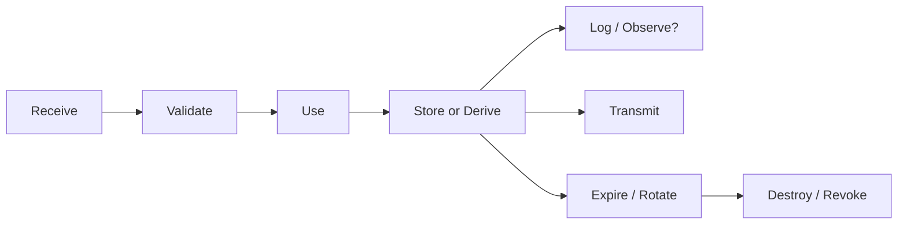

------
title: Learn Java Security, Cryptography, Integrity and Platform Hardening - Part 004
description: Secure coding guidelines for Java systems: trust-boundary validation, canonicalization, defensive design, exception safety, sensitive data lifecycle, resource limits, concurrency security, and review rubrics.
series: learn-java-security-cryptography-integrity-hardening
seriesTitle: Learn Java Security, Cryptography, Integrity and Platform Hardening
order: 4
partTitle: Secure Coding Guidelines
tags:
- java
- security
- secure-coding
- input-validation
- canonicalization
- integrity
- hardening
- series
date: 2026-06-28
---

# Part 004 — Secure Coding Guidelines

> Target part ini: mengubah secure coding dari “kumpulan larangan” menjadi teknik menjaga **security invariant** di level code. Kita akan fokus ke Java-specific failure modes: input boundary, canonicalization, exception safety, resource limit, sensitive data lifecycle, logging, race condition, parser safety, filesystem, process execution, dan API design.

Secure coding bukan berarti menulis code yang terlihat defensif. Secure coding berarti menulis code yang tetap mempertahankan properti keamanan saat input jahat, konfigurasi salah, dependency berubah, request paralel, resource habis, atau downstream gagal.

Contoh properti yang harus tetap benar:

```text
User tidak bisa membaca case tenant lain.
File upload tidak bisa menulis di luar storage directory.
Password tidak pernah masuk log.
Token reset hanya bisa dipakai sekali.
Audit event tidak boleh hilang setelah state berubah.
Parser tidak boleh menghabiskan heap karena payload kecil tapi nested ekstrem.
Exception tidak boleh mengubah deny menjadi allow.
```

Ini adalah cara berpikir yang lebih kuat daripada “pakai library X”.

---

## 1. Secure Coding sebagai Local Invariant Preservation

Di Part 002, kita mendefinisikan security invariant sebagai kondisi yang harus tetap benar. Di Part 003, kita memetakan entrypoint dan attack surface. Sekarang kita turun ke code.

Secure coding di Java berarti setiap fungsi yang berada di boundary harus jelas:

- input mana yang trusted/untrusted,
- validasi apa yang wajib,
- canonical form apa yang dipakai,
- privilege apa yang dibutuhkan,
- side effect apa yang bisa terjadi,
- exception apa yang mungkin muncul,
- resource apa yang dikonsumsi,
- data sensitif apa yang disentuh,
- audit evidence apa yang dihasilkan.

Mental model:



Rule utama:

> Jangan lakukan side effect irreversible sebelum input, authority, dan invariant utama lolos.

---

## 2. Core Principles

### Principle 1 — Validate at Trust Boundary

Validasi harus terjadi saat data melintasi boundary, bukan jauh di bawah secara implisit.

Bad:

```java
public void approveCase(String caseId, String userId) {
    caseRepository.approve(caseId, userId);
}
```

Masalah:

- `caseId` belum jelas formatnya,
- actor belum jelas berasal dari mana,
- authorization tidak terlihat,
- tidak ada invariant transition,
- audit tidak dijamin.

Better:

```java
public ApprovalResult approveCase(ApproveCaseCommand command, Actor actor) {
    CaseId caseId = CaseId.parse(command.caseId());
    DecisionReason reason = DecisionReason.requireValid(command.reason());

    CaseRecord record = caseRepository.requireById(caseId);
    policy.requireAllowed(actor, Action.APPROVE_CASE, record);
    transitionPolicy.requireTransitionAllowed(record.status(), CaseStatus.APPROVED);

    CaseRecord approved = record.approve(actor.id(), reason);
    caseRepository.save(approved);
    audit.record(CaseAuditEvent.approved(actor, approved, reason));

    return ApprovalResult.success(approved.id());
}
```

Perhatikan urutannya:

1. parse,
2. validate,
3. load authoritative state,
4. authorize,
5. check business invariant,
6. mutate,
7. audit.

### Principle 2 — Reject Ambiguity

Security bug sering muncul dari representasi ganda:

- `../a/b` vs canonical path,
- Unicode normalized vs non-normalized string,
- uppercase/lowercase locale issue,
- URL dengan encoded host/path,
- duplicate HTTP header,
- JSON field duplicate,
- `null` vs missing,
- empty string vs absent,
- local time vs instant,
- user id display name vs immutable subject id.

Gunakan canonical representation sebelum decision.

Bad:

```java
if (path.startsWith("/safe/uploads")) {
    Files.writeString(Path.of(path), content);
}
```

Better:

```java
Path base = Path.of("/safe/uploads").toRealPath();
Path target = base.resolve(userSuppliedFilename).normalize();

if (!target.startsWith(base)) {
    throw new SecurityException("Invalid path");
}

Files.writeString(target, content);
```

Catatan: untuk upload production, filename user sebaiknya hanya display metadata. Object key/path lebih aman dibuat oleh server menggunakan ID acak atau content hash.

### Principle 3 — Fail Closed

Fail closed berarti error tidak berubah menjadi allow.

Bad:

```java
boolean allowed;
try {
    allowed = policyService.isAllowed(actor, action, resource);
} catch (Exception e) {
    allowed = true; // keep system available
}
```

Better:

```java
try {
    policyService.requireAllowed(actor, action, resource);
} catch (PolicyUnavailableException e) {
    audit.record(SecurityAuditEvent.authorizationUnavailable(actor, action, resource));
    throw new AccessDeniedException("Authorization unavailable");
}
```

Availability penting, tetapi bukan alasan untuk mengizinkan action berisiko saat authorization engine gagal. Untuk operation tertentu, kamu bisa mendesain degraded mode, tetapi harus eksplisit dan terbatas.

### Principle 4 — Make Illegal State Unrepresentable

Gunakan type/domain object untuk mencegah raw string menyebar.

Bad:

```java
void transition(String caseId, String fromStatus, String toStatus, String actorId) { ... }
```

Better:

```java
record CaseTransitionCommand(
        CaseId caseId,
        CaseStatus targetStatus,
        ActorId actorId,
        DecisionReason reason
) {}
```

Manfaat:

- validasi dekat dengan construction,
- code lebih self-documenting,
- raw user input tidak menyebar,
- invariant lebih mudah diuji.

### Principle 5 — Minimize Privilege and Capability

Secure coding bukan hanya method-level validation. Code harus berjalan dengan capability minimum.

Contoh:

- DB user read-only untuk reporting service,
- storage key scoped ke bucket/prefix tertentu,
- KMS key policy scoped ke service identity,
- filesystem write hanya ke `/tmp/app`,
- outbound network hanya ke dependency yang dibutuhkan,
- admin operation tidak satu process dengan public endpoint jika blast radius terlalu tinggi.

Di Java, jangan menunggu Security Manager untuk membatasi semua ini. Hardening modern harus terjadi lewat platform boundary: OS, container, network policy, IAM/workload identity, dan process separation.

---

## 3. Input Validation: Shape, Semantics, and Authority

Validasi input punya tiga lapisan.

### 3.1 Shape Validation

Apakah bentuk input sesuai?

Contoh:

```java
public record CreateUserRequest(
        String email,
        String displayName,
        String timezone
) {}
```

Shape checks:

- required/optional,
- length,
- pattern,
- enum value,
- array size,
- nesting depth,
- content type,
- file size.

### 3.2 Semantic Validation

Apakah input masuk akal secara domain?

Contoh:

```text
case transition PENDING_REVIEW -> CLOSED tidak valid tanpa decision reason.
```

Semantic checks:

- transition allowed,
- date range valid,
- amount non-negative,
- state compatible,
- file belongs to case,
- token not expired,
- workflow step active.

### 3.3 Authority Validation

Apakah actor boleh melakukan action ini terhadap object ini?

```java
policy.requireAllowed(actor, Action.UPDATE_CASE, caseRecord);
```

Authority validation harus memakai authoritative data, bukan hanya request payload.

Bad:

```java
if (request.tenantId().equals(actor.tenantId())) {
    update(request.caseId(), request.payload());
}
```

Better:

```java
CaseRecord record = caseRepository.requireById(CaseId.parse(request.caseId()));
policy.requireAllowed(actor, Action.UPDATE_CASE, record);
```

`tenantId` dari request adalah claim yang bisa dimanipulasi. Tenant/resource ownership harus diambil dari source of truth.

---

## 4. Canonicalization Pitfalls

Canonicalization adalah mengubah input menjadi satu bentuk standar sebelum decision.

### 4.1 Path Canonicalization

Bad:

```java
Path target = Path.of("/data/uploads", request.filename());
Files.copy(request.inputStream(), target);
```

Risiko:

```text
../../etc/passwd
subdir/../../../app/config.yml
```

Better baseline:

```java
Path base = Path.of("/data/uploads").toRealPath();
Path target = base.resolve(request.filename()).normalize();

if (!target.startsWith(base)) {
    throw new SecurityException("Path traversal attempt");
}
```

Even better for upload:

```java
String objectId = UUID.randomUUID().toString();
Path target = base.resolve(objectId + ".bin");
```

User filename disimpan sebagai metadata display-only setelah divalidasi panjang dan karakter aman.

### 4.2 URL Canonicalization and SSRF

Bad:

```java
URI uri = URI.create(request.callbackUrl());
httpClient.send(HttpRequest.newBuilder(uri).GET().build(), BodyHandlers.ofString());
```

Risiko:

- SSRF ke metadata service,
- localhost/internal IP,
- DNS rebinding,
- encoded host ambiguity,
- redirect ke internal host,
- non-http scheme.

Better direction:

```java
URI uri = URI.create(request.callbackUrl()).normalize();

if (!Set.of("https").contains(uri.getScheme())) {
    throw new IllegalArgumentException("Only HTTPS callbacks are allowed");
}

if (!callbackAllowlist.isAllowed(uri.getHost())) {
    throw new AccessDeniedException("Callback host is not allowed");
}
```

Untuk high-risk SSRF, allowlist host saja belum cukup. Perlu DNS/IP validation, redirect policy, egress network policy, dan metadata service blocking di platform.

### 4.3 Unicode and Locale

Bad:

```java
String normalized = username.toLowerCase();
```

Masalah:

- default locale bisa berbeda,
- Unicode punya representasi berbeda untuk karakter yang tampak sama,
- case folding kompleks.

Better:

```java
String normalized = Normalizer.normalize(username, Normalizer.Form.NFKC)
        .toLowerCase(Locale.ROOT);
```

Namun jangan sembarang normalize semua data. Untuk identifier security-sensitive, definisikan policy jelas:

- character set allowed,
- normalization form,
- case sensitivity,
- max length setelah normalization,
- display form vs comparison form.

---

## 5. Sensitive Data Lifecycle

Sensitive data tidak hanya password. Dalam sistem Java enterprise, data sensitif meliputi:

- access token,
- refresh token,
- API key,
- private key,
- TLS key material,
- password,
- OTP,
- reset token,
- session id,
- PII,
- regulatory case detail,
- audit evidence,
- cryptographic nonce/seed,
- KMS credential,
- database credential,
- internal correlation metadata.

Lifecycle:



Untuk setiap sensitive field, tanya:

- Apakah perlu diterima?
- Apakah perlu disimpan?
- Apakah perlu plain text?
- Apakah bisa di-hash/HMAC/tokenize?
- Apakah bisa di-redact?
- Apakah bisa dibatasi retention?
- Apakah bisa di-scope?
- Apakah masuk log/trace/exception?
- Apakah ikut heap dump?

### 5.1 Avoid Logging Secrets

Bad:

```java
log.info("Login request: {}", request);
```

Jika `request.toString()` mencetak password/token, secret bocor.

Better:

```java
log.info("Login attempt for userHash={} from ip={}",
        auditHash.of(request.username()),
        request.clientIp());
```

Gunakan DTO khusus untuk logging jika perlu.

```java
record SafeLoginLog(String userHash, String clientIp, Instant timestamp) {}
```

### 5.2 Do Not Overtrust `char[]`

Sering ada saran “gunakan `char[]` untuk password agar bisa dihapus dari memory.” Ini bisa membantu dalam konteks tertentu, tetapi jangan menjualnya sebagai solusi lengkap.

Masalah praktis:

- banyak API Java menerima `String`,
- GC/copying bisa membuat salinan,
- framework binding sering memakai String,
- heap dump tetap berisiko,
- log/exception lebih sering menjadi leak nyata.

Prinsip yang lebih penting:

- minimalkan waktu hidup secret,
- jangan log secret,
- jangan simpan secret plain,
- batasi heap dump access,
- gunakan secret manager/KMS,
- rotate/revoke jika bocor.

---

## 6. Exception Safety

Exception dapat menyebabkan security bug jika:

- authorization failure ditelan,
- partial state tersimpan,
- audit event tidak ditulis,
- detail internal bocor ke client,
- retry menggandakan side effect,
- transaction rollback tidak sesuai,
- catch-all mengubah deny menjadi allow.

### 6.1 Error Response Hygiene

Bad:

```java
catch (Exception e) {
    return Response.serverError()
            .entity(e.toString())
            .build();
}
```

Risiko:

- class name leak,
- SQL/query leak,
- path leak,
- secret leak,
- stack trace exposure.

Better:

```java
catch (AccessDeniedException e) {
    audit.record(SecurityAuditEvent.denied(actor, action, resource));
    return Response.status(403).entity(new ErrorResponse("ACCESS_DENIED")).build();
} catch (ValidationException e) {
    return Response.status(400).entity(new ErrorResponse("INVALID_REQUEST")).build();
} catch (Exception e) {
    incidentLogger.error("Unhandled request failure correlationId={}", correlationId, e);
    return Response.status(500).entity(new ErrorResponse("INTERNAL_ERROR")).build();
}
```

Client mendapat error code stabil; detail penuh hanya masuk log internal yang sudah dikontrol.

### 6.2 Audit on Failure

Untuk action security-sensitive, failure juga perlu audit.

Audit events:

- access denied,
- invalid token,
- expired token,
- replay attempt,
- signature mismatch,
- policy engine unavailable,
- key rotation failure,
- mTLS identity mismatch,
- suspicious parser rejection.

Namun audit event juga harus privacy-safe. Jangan mencatat raw password/token/payload penuh.

---

## 7. Resource Limits and Denial of Service

Secure coding harus membatasi resource sebelum operasi mahal.

Risiko umum Java:

- request body besar,
- JSON/XML nested ekstrem,
- regex catastrophic backtracking,
- ZIP bomb,
- decompression bomb,
- unbounded collection,
- unbounded cache,
- unlimited thread creation,
- blocking I/O tanpa timeout,
- unbounded queue,
- large BigInteger/BigDecimal parsing,
- image/PDF parser memory blow-up.

### 7.1 Regex ReDoS

Bad:

```java
private static final Pattern EMAIL = Pattern.compile("^(.+)+@(.+)+$");
```

Better:

- gunakan regex sederhana,
- batasi panjang input sebelum regex,
- hindari nested quantifier,
- gunakan parser/library yang mature,
- tambahkan timeout di layer request bila memungkinkan.

Example:

```java
if (email.length() > 254) {
    throw new ValidationException("Email too long");
}

if (!SIMPLE_EMAIL_PATTERN.matcher(email).matches()) {
    throw new ValidationException("Invalid email");
}
```

### 7.2 Bounded Parsing

Bad:

```java
List<Item> items = objectMapper.readValue(body, new TypeReference<>() {});
```

Better approach:

- enforce request size at gateway/server,
- enforce max collection size after parsing,
- configure parser constraints where available,
- reject unknown fields for sensitive DTOs,
- avoid polymorphic type binding from untrusted input.

Example invariant:

```java
if (request.items().size() > 100) {
    throw new ValidationException("Too many items");
}
```

### 7.3 Timeouts

Bad:

```java
HttpClient client = HttpClient.newHttpClient();
```

Better:

```java
HttpClient client = HttpClient.newBuilder()
        .connectTimeout(Duration.ofSeconds(2))
        .build();

HttpRequest request = HttpRequest.newBuilder(uri)
        .timeout(Duration.ofSeconds(5))
        .GET()
        .build();
```

Every outbound call should have:

- connect timeout,
- request timeout,
- retry policy,
- circuit breaker where appropriate,
- idempotency awareness,
- egress restriction.

---

## 8. Filesystem Safety

Filesystem bugs sering muncul di upload/export/import.

### 8.1 Treat Filename as Data, Not Path

Bad:

```java
Path target = uploadDir.resolve(upload.filename());
```

Better:

```java
String objectName = UUID.randomUUID() + ".bin";
Path target = uploadDir.resolve(objectName);
```

Store original filename separately:

```java
record UploadedFileMetadata(
        String objectName,
        String originalFilename,
        String contentType,
        long size,
        String sha256
) {}
```

### 8.2 Temporary Files

Use safe temp APIs and permissions appropriate to platform.

```java
Path temp = Files.createTempFile("upload-", ".bin");
try {
    Files.copy(inputStream, temp, StandardCopyOption.REPLACE_EXISTING);
    // scan, hash, validate
} finally {
    Files.deleteIfExists(temp);
}
```

Checklist:

- do not use predictable names,
- delete after use,
- do not place sensitive temp files in world-readable location,
- enforce size before copying where possible,
- consider encrypted storage for sensitive intermediate files,
- do not trust extension as content type.

### 8.3 ZIP Slip

When extracting archive:

```java
Path destination = Path.of("/safe/extract").toRealPath();

try (ZipInputStream zis = new ZipInputStream(inputStream)) {
    ZipEntry entry;
    while ((entry = zis.getNextEntry()) != null) {
        Path target = destination.resolve(entry.getName()).normalize();
        if (!target.startsWith(destination)) {
            throw new SecurityException("Archive entry escapes destination");
        }
        // also enforce entry count, total size, compression ratio, file type policy
    }
}
```

Path check saja tidak cukup. Tambahkan:

- max entry count,
- max total uncompressed size,
- max per-file size,
- symlink policy,
- file type allowlist,
- duplicate filename policy.

---

## 9. Process Execution Safety

Executing OS commands from Java is high risk.

Bad:

```java
Runtime.getRuntime().exec("convert " + input + " " + output);
```

Risiko command injection.

Better:

```java
ProcessBuilder pb = new ProcessBuilder(
        "/usr/bin/convert",
        inputPath.toString(),
        outputPath.toString()
);
pb.redirectErrorStream(true);
Process process = pb.start();
boolean finished = process.waitFor(10, TimeUnit.SECONDS);
if (!finished) {
    process.destroyForcibly();
    throw new TimeoutException("Conversion timed out");
}
```

Still required:

- validate file paths,
- run tool in sandbox/container if input untrusted,
- limit CPU/memory/time,
- avoid shell invocation,
- use allowlist of commands,
- do not pass secrets via command line,
- capture output safely with limits.

---

## 10. XML, JSON, YAML, and Object Mapping

### 10.1 XML

XML parser must be configured defensively. Risks include XXE, entity expansion, external resource fetching, and large document DoS.

General direction:

- disable external entity resolution,
- disable DTD if not needed,
- limit entity expansion,
- limit document size,
- avoid fetching external schemas from untrusted URLs,
- validate against local known schema if required.

### 10.2 JSON

JSON risk often comes from:

- unknown fields silently ignored,
- duplicate fields,
- polymorphic type info,
- large nested payload,
- mass assignment,
- binding directly to entity/domain object.

Bad:

```java
User user = objectMapper.readValue(body, User.class);
```

Better:

```java
UserProfileUpdateRequest request = objectMapper.readValue(body, UserProfileUpdateRequest.class);
```

Use request DTO that exposes only client-controlled fields.

### 10.3 YAML

YAML parsers can be dangerous when they construct arbitrary objects. Treat YAML from untrusted input as high risk. Prefer strict data-only parsing, schema validation, and bounded input.

---

## 11. Concurrency and Security

Security bugs can be race conditions.

Examples:

- check-then-act authorization race,
- token reuse race,
- password reset token used twice,
- approval transition applied twice,
- idempotency key collision,
- stale permission cache,
- TOCTOU path check,
- rate limit non-atomic increment,
- optimistic lock missing on state transition.

### 11.1 Check-Then-Act

Bad:

```java
if (!tokenRepository.isUsed(token)) {
    tokenRepository.markUsed(token);
    resetPassword(token, newPassword);
}
```

Two parallel requests can pass `isUsed` before either marks it.

Better direction:

- atomic update,
- unique constraint,
- transaction isolation appropriate to invariant,
- compare-and-set,
- optimistic locking,
- idempotency table.

Example:

```sql
UPDATE reset_token
SET used_at = now()
WHERE token_hash = ?
  AND used_at IS NULL
  AND expires_at > now()
```

Then require affected row count exactly 1.

### 11.2 Authorization Cache

Caching policy decisions can create stale authorization.

Questions:

- How long can stale allow survive?
- What event invalidates cache?
- Are denies cached?
- Is cache scoped by actor + action + resource + context?
- Does tenant/role change invalidate authorization?

For high-risk operation, prefer fresh authorization or very short TTL with explicit invalidation.

---

## 12. API Design for Secure Defaults

Secure coding is easier when API shape prevents misuse.

### 12.1 Require Actor Explicitly

Bad:

```java
caseService.closeCase(caseId);
```

Better:

```java
caseService.closeCase(actor, caseId, reason);
```

Make actor/context explicit so authorization and audit cannot be “forgotten silently”.

### 12.2 Separate Trusted and Untrusted Types

```java
record RawCaseId(String value) {}
record CaseId(UUID value) {}
```

Only validated parser converts raw to trusted domain type.

```java
CaseId caseId = caseIdParser.parse(rawCaseId);
```

### 12.3 Use Capability-Specific Interfaces

Bad:

```java
interface CaseRepository {
    CaseRecord findById(CaseId id);
    List<CaseRecord> findAll();
    void deleteAll();
    void save(CaseRecord record);
}
```

If every service gets this interface, blast radius grows.

Better:

```java
interface CaseReadPort {
    Optional<CaseRecord> findById(CaseId id);
}

interface CaseTransitionPort {
    void saveTransitioned(CaseRecord record);
}
```

Capability-specific interfaces reduce accidental misuse.

---

## 13. Logging and Audit Guidelines

Logging and audit are related but not identical.

| Aspect | Application Log | Audit Log |
|---|---|---|
| Purpose | Debug/operate system | Accountability/evidence |
| Audience | Engineers/SRE | Security/compliance/business/regulator |
| Retention | Operational | Policy/regulatory |
| Integrity | Useful | Often critical |
| Content | Technical context | Actor, action, resource, decision |
| Sensitivity | Must redact | Must be minimal but sufficient |

### 13.1 Safe Logging Rules

Never log:

- password,
- access token,
- refresh token,
- API key,
- private key,
- OTP,
- reset token,
- full authorization header,
- full session id,
- raw sensitive document,
- unnecessary PII.

Prefer:

- stable event code,
- correlation id,
- actor id or hashed actor reference,
- resource id if allowed,
- decision,
- reason code,
- sanitized metadata.

Example:

```java
log.warn("access_denied actor={} action={} resourceType={} resourceId={} correlationId={}",
        actor.id(), action, resource.type(), resource.id(), correlationId);
```

### 13.2 Audit Event Shape

```java
record AuditEvent(
        String eventId,
        Instant occurredAt,
        ActorId actorId,
        String action,
        String resourceType,
        String resourceId,
        String decision,
        String reasonCode,
        String correlationId,
        String integrityHash
) {}
```

Audit design questions:

- Is actor attributable?
- Is resource identifiable?
- Is decision clear?
- Is failed attempt recorded?
- Is event immutable enough for your domain?
- Can event be correlated with request and domain change?
- Are sensitive fields minimized?
- Can audit survive service crash after state mutation?

---

## 14. Secure Coding Review Checklist

Gunakan checklist ini saat PR review.

### Boundary

- [ ] Semua input dari luar dianggap untrusted.
- [ ] Input divalidasi dekat boundary.
- [ ] Unknown/extra fields ditangani secara sadar.
- [ ] Size/depth/length limit ada sebelum operasi mahal.
- [ ] Canonicalization dilakukan sebelum decision.

### Authorization

- [ ] Actor eksplisit.
- [ ] Resource diambil dari source of truth.
- [ ] Policy memeriksa actor + action + resource + context.
- [ ] Authorization terjadi sebelum mutation/side effect.
- [ ] Deny/failure diaudit untuk action sensitif.

### Data Protection

- [ ] Secret tidak masuk log/exception/trace.
- [ ] Sensitive field punya retention jelas.
- [ ] DTO logging aman.
- [ ] Error response tidak membocorkan detail internal.
- [ ] Heap dump/diagnostic exposure dipertimbangkan.

### Resource Safety

- [ ] Timeout outbound call jelas.
- [ ] Retry tidak menggandakan side effect.
- [ ] Queue/cache/collection bounded.
- [ ] Parser punya limit.
- [ ] File/archive extraction dibatasi.

### Filesystem/Process

- [ ] User input tidak menjadi path langsung.
- [ ] Path canonicalization benar.
- [ ] Temp file aman dan dibersihkan.
- [ ] Command execution tidak lewat shell string.
- [ ] Process execution punya timeout dan sandbox bila input untrusted.

### Exception/Transaction

- [ ] Fail closed untuk authorization/security decision.
- [ ] Partial state dicegah atau dikompensasi.
- [ ] Audit tidak hilang setelah critical mutation.
- [ ] Catch-all tidak menelan security exception.
- [ ] Transaction boundary sesuai invariant.

### Concurrency

- [ ] Token/idempotency/transition sensitive memakai atomicity.
- [ ] TOCTOU risk ditangani.
- [ ] Authorization cache punya invalidation/TTL.
- [ ] Optimistic/pessimistic locking sesuai risk.

---

## 15. Common Anti-Patterns

### Anti-pattern 1 — Direct Entity Binding

```java
UserEntity entity = objectMapper.readValue(body, UserEntity.class);
repository.save(entity);
```

Risiko:

- mass assignment,
- field internal bisa diubah,
- persistence concern bocor ke API,
- validation ambiguous.

Better: request DTO → validated command → domain operation → persistence.

### Anti-pattern 2 — Security by Naming Convention

```java
if (roleName.contains("ADMIN")) { ... }
```

Better: explicit permission/policy model.

### Anti-pattern 3 — Catch and Continue

```java
try {
    verifySignature(payload);
} catch (Exception ignored) {
    // continue for compatibility
}
```

Signature verification failure adalah security decision. Jangan lanjut kecuali ada migration mode yang eksplisit, terbatas, diaudit, dan punya tanggal mati.

### Anti-pattern 4 — Logging Whole Object

```java
log.info("request={}", request);
```

Tidak semua `toString()` aman. Record Java otomatis menghasilkan `toString()` yang mencetak semua component.

### Anti-pattern 5 — Unbounded Defaults

```java
new LinkedBlockingQueue<>();
```

Unbounded queue bisa menjadi memory DoS. Pilih bounded queue dan backpressure policy.

### Anti-pattern 6 — Trusting Client-Supplied IDs for Authority

```java
if (request.userId().equals(currentUser.id())) { ... }
```

Untuk banyak operasi, lebih aman memakai actor dari security context dan resource dari database, bukan userId dari request.

---

## 16. Practice Lab

### Lab 1 — Secure File Upload Boundary

Implementasikan upload flow dengan invariant:

```text
I1: filename tidak pernah menjadi storage path.
I2: file size dibatasi sebelum parsing mahal.
I3: SHA-256 file dihitung dan disimpan.
I4: file tidak aktif sampai scan selesai.
I5: audit event mencatat actor, caseId, documentId, hash, decision.
```

Deliverables:

- request DTO,
- validator,
- storage object key generator,
- hash calculator,
- audit event,
- negative tests untuk path traversal dan oversized file.

### Lab 2 — One-Time Token Atomicity

Implementasikan password reset token consume dengan invariant:

```text
A valid token can be consumed exactly once before expiry.
```

Deliverables:

- token hashed at rest,
- atomic consume operation,
- concurrent test,
- audit event for success/failure,
- no raw token logging.

### Lab 3 — Authorization Fail Closed

Simulasikan policy service unavailable.

Expected:

- high-risk operation denied,
- audit event written,
- client receives stable error code,
- no state mutation occurs.

---

## 17. Self-Correction Questions

Saat menulis Java code, biasakan bertanya:

1. Apakah input ini sudah melewati trust boundary?
2. Apakah bentuk input sudah dibatasi?
3. Apakah canonical representation sudah dipakai untuk decision?
4. Apakah actor eksplisit dan berasal dari sumber yang benar?
5. Apakah resource ownership diambil dari source of truth?
6. Apakah authorization terjadi sebelum mutation?
7. Apakah exception bisa mengubah deny menjadi allow?
8. Apakah sensitive data bisa masuk log, trace, exception, metric, heap dump?
9. Apakah operasi ini bounded dari sisi size, time, memory, dan concurrency?
10. Apakah retry bisa menggandakan side effect?
11. Apakah ada race condition di check-then-act?
12. Apakah audit event cukup untuk membuktikan apa yang terjadi?
13. Apakah API shape memudahkan misuse?
14. Apakah test mencakup negative/security path?

---

## 18. Summary

Secure coding Java bukan daftar “jangan pakai X”. Ini disiplin menjaga invariant pada level code.

Prinsip yang harus tertanam:

- validate at boundary,
- canonicalize before decision,
- fail closed,
- make illegal state unrepresentable,
- minimize capability,
- protect sensitive data lifecycle,
- bound resource consumption,
- treat parser/filesystem/process execution as dangerous boundaries,
- design API that makes misuse harder,
- audit both success and meaningful failure,
- test negative path, concurrency, and failure mode.

Setelah Part 004, kita punya fondasi secure architecture dan secure coding. Part 005 akan masuk ke threat modeling untuk Java systems: bagaimana mengubah attack surface map menjadi abuse case, risk decision, control, test, dan security ADR.

---

## References

- Oracle Secure Coding Guidelines for Java SE: https://www.oracle.com/java/technologies/javase/seccodeguide.html
- Oracle Java SE 25 Security Developer's Guide — Java Cryptography Architecture: https://docs.oracle.com/en/java/javase/25/security/java-cryptography-architecture-jca-reference-guide.html
- Java SE 25 `java.security` package summary: https://docs.oracle.com/en/java/javase/25/docs/api/java.base/java/security/package-summary.html
- OWASP Application Security Verification Standard: https://owasp.org/www-project-application-security-verification-standard/
- OpenJDK JEP 411 — Deprecate the Security Manager for Removal: https://openjdk.org/jeps/411
- OpenJDK JEP 486 — Permanently Disable the Security Manager: https://openjdk.org/jeps/486
