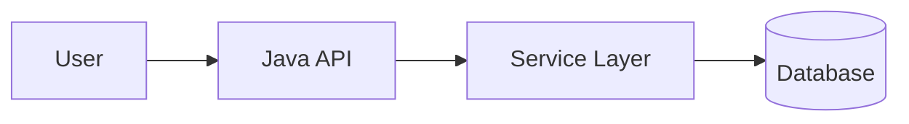
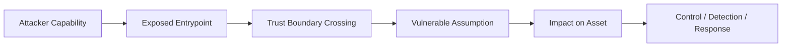
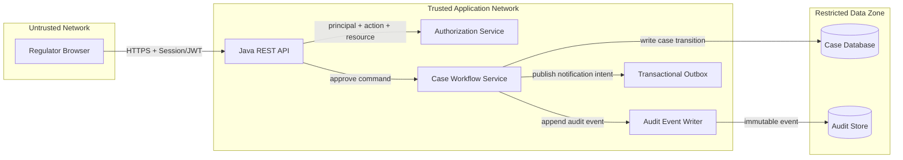
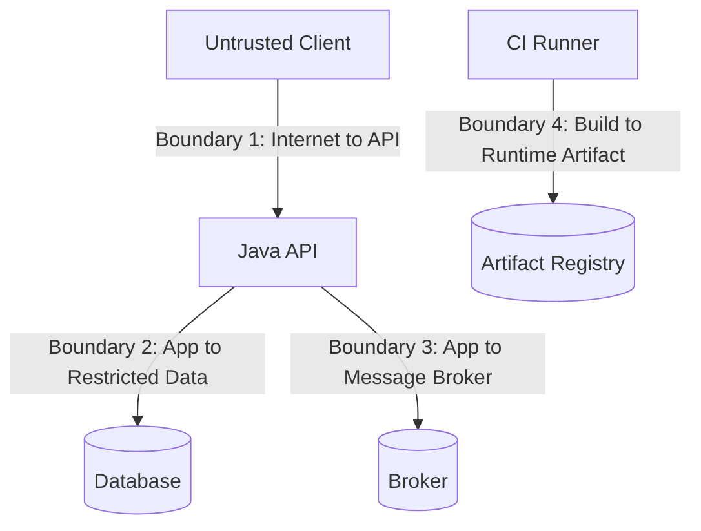
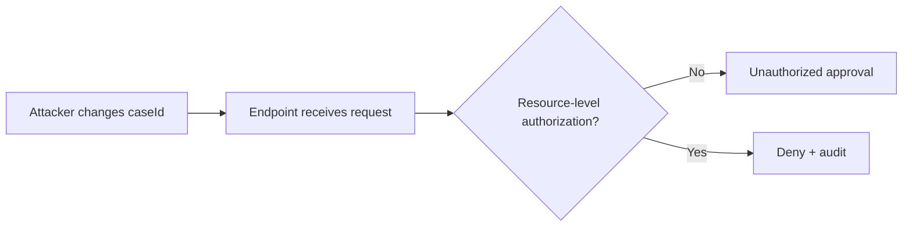
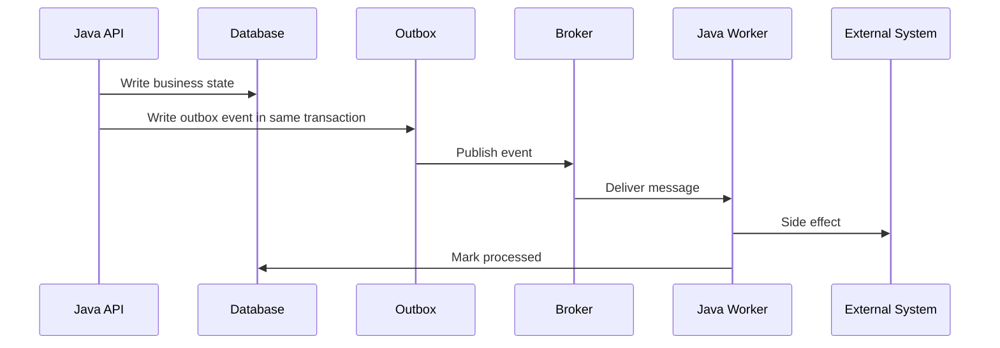
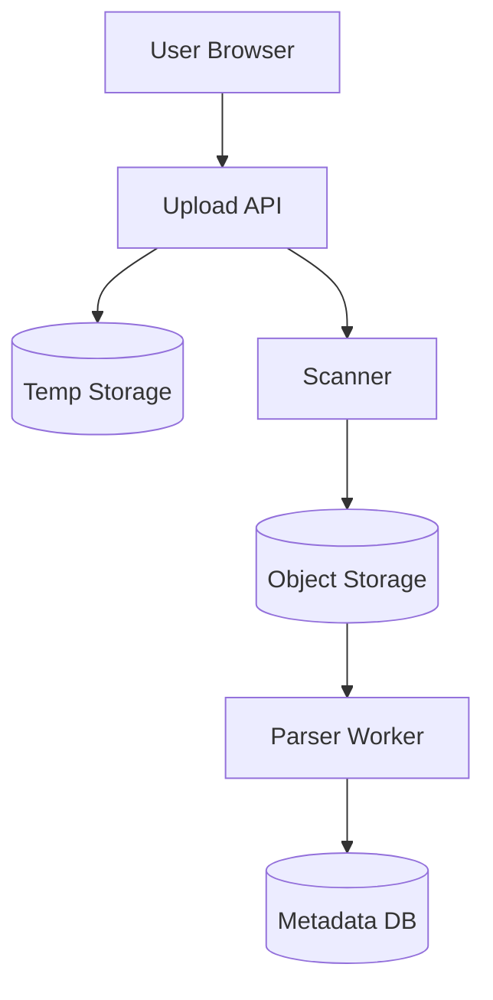
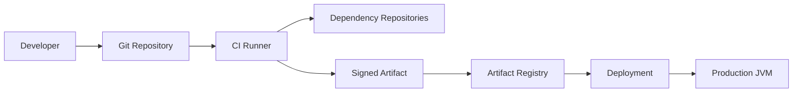

# Part 005 — Threat Modeling for Java Systems

> Security yang matang bukan dimulai dari library crypto, firewall, atau checklist scanner. Security yang matang dimulai dari kemampuan menjawab: **apa yang kita lindungi, dari siapa, lewat jalur apa, dengan asumsi apa, dan kontrol mana yang benar-benar memutus attack path**.

Part ini membangun cara berpikir threat modeling untuk sistem Java modern. Kita tidak akan menjadikannya ritual dokumentasi yang berat. Kita akan menjadikannya **alat desain, review, dan debugging risiko**.

Threat modeling adalah teknik untuk memahami sistem dari perspektif keamanan, mengidentifikasi ancaman yang relevan, memilih mitigasi, lalu memvalidasi apakah mitigasi tersebut cukup. OWASP Threat Modeling Cheat Sheet merangkum proses ini menjadi dekomposisi aplikasi, identifikasi/ranking ancaman, mitigasi, dan review/validasi. Dalam praktik engineering, empat langkah itu harus diterjemahkan menjadi artifact yang bisa dipakai di design review, pull request review, incident analysis, dan audit.

---

## 1. Posisi Part Ini dalam Framework Kaufman

Josh Kaufman menekankan bahwa skill kompleks harus dipecah menjadi subskill kecil, lalu dipraktikkan cukup agar kita bisa **self-correct**. Threat modeling cocok dengan pendekatan ini karena masalahnya bukan kurang tahu nama ancaman, tetapi tidak punya cara konsisten untuk melihat sistem.

Dalam konteks Java security, subskill threat modeling adalah:

| Subskill | Tujuan |
|---|---|
| System decomposition | Memecah sistem menjadi actor, process, datastore, dependency, dan data flow. |
| Trust boundary identification | Menemukan titik perubahan level trust: user ke API, service ke database, CI ke repository, JVM ke OS. |
| Threat enumeration | Menyusun ancaman berdasarkan capability attacker, bukan berdasarkan imajinasi random. |
| Control selection | Memilih kontrol yang memutus attack path, bukan sekadar menambah tool. |
| Risk ranking | Memprioritaskan berdasarkan impact, likelihood, exposure, dan detectability. |
| Validation | Membuktikan kontrol bekerja melalui test, review, monitoring, atau operational drill. |

Target part ini: setelah selesai, kamu mampu membuat threat model ringkas untuk service Java produksi dan menggunakannya untuk memandu desain security.

---

## 2. Threat Model Bukan Sekadar Dokumen

Threat model yang buruk biasanya berbentuk dokumen panjang berisi tabel ancaman generik:

- SQL injection
- XSS
- Broken authentication
- Insecure deserialization
- Sensitive data exposure

Itu belum threat model. Itu masih daftar kategori.

Threat model yang berguna menjawab pertanyaan konkret:

1. **Asset apa yang bernilai?**
2. **Actor mana yang punya akses langsung/tidak langsung?**
3. **Boundary mana yang dilintasi data atau command?**
4. **Asumsi security apa yang harus benar?**
5. **Bagaimana attacker bisa mengubah asumsi itu menjadi exploit path?**
6. **Kontrol apa yang memutus path itu?**
7. **Bagaimana kita tahu kontrol itu masih bekerja di production?**

Threat model yang baik tidak harus panjang. Ia harus **tajam**.

---

## 3. Mental Model: Dari Feature ke Attack Path

Software engineer biasanya memodelkan sistem sebagai feature path:



Security engineer memodelkan sistem sebagai attack path:



Perbedaannya penting.

Feature path bertanya: “Bagaimana user berhasil memakai sistem?”

Attack path bertanya: “Bagaimana actor dengan capability tertentu bisa mencapai state yang tidak seharusnya?”

Contoh:

| Feature view | Threat view |
|---|---|
| User mengunggah dokumen pendukung kasus. | Actor mengunggah file dengan nama path traversal, MIME palsu, payload parser bomb, atau metadata sensitif. |
| Admin menyetujui enforcement action. | Actor mencoba menaikkan privilege, replay approval request, atau memalsukan audit trail. |
| Service membaca message dari Kafka. | Producer tidak dipercaya mengirim command yang menyebabkan state transition ilegal. |
| Worker mendekripsi payload. | Key exposure atau nonce reuse membuat confidentiality/integrity runtuh. |

Threat modeling mengubah diskusi dari “apakah endpoint ini sudah dibuat?” menjadi “state buruk apa yang tidak boleh terjadi?”

---

## 4. Artifact Minimum Threat Model

Untuk sistem Java produksi, threat model minimum sebaiknya punya 7 bagian:

1. **Scope**
2. **Assets**
3. **Actors**
4. **Data flows**
5. **Trust boundaries**
6. **Threats and mitigations**
7. **Validation plan**

Template ringkas:

```mdx
## Threat Model: <System / Feature>

### Scope
- In scope:
- Out of scope:
- Assumptions:

### Assets
| Asset | Sensitivity | Integrity requirement | Availability requirement |
|---|---:|---:|---:|

### Actors
| Actor | Trust level | Capability | Notes |
|---|---:|---|---|

### Data Flow
<Mermaid diagram>

### Trust Boundaries
| Boundary | Crossing | Risk |
|---|---|---|

### Threats
| ID | Threat | Attack path | Impact | Mitigation | Validation |
|---|---|---|---|---|---|

### Open Risks
| Risk | Owner | Decision | Expiry |
|---|---|---|---|
```

Artifact ini cukup kecil untuk masuk pull request design doc, tetapi cukup kaya untuk review serius.

---

## 5. Scope: Jangan Mulai dari “Seluruh Sistem”

Threat model terlalu luas akan mati karena tidak actionable.

Mulai dari unit yang memiliki boundary jelas:

- satu endpoint penting,
- satu workflow approval,
- satu asynchronous command,
- satu integration dengan third-party,
- satu key management flow,
- satu artifact build pipeline,
- satu admin operation,
- satu data export/reporting job.

Contoh scope buruk:

> Threat model untuk seluruh platform case management.

Contoh scope baik:

> Threat model untuk workflow “case escalation approval” dari API request sampai audit event dan notification message.

Scope yang baik punya input, output, actor, dan state transition yang jelas.

---

## 6. Asset: Security Selalu Tentang Sesuatu yang Bernilai

Asset bukan hanya data. Asset adalah apa pun yang jika rusak, bocor, hilang, atau disalahgunakan akan menimbulkan dampak.

Dalam sistem Java enterprise, asset umum:

| Asset | Risiko utama |
|---|---|
| PII / confidential records | Disclosure, unauthorized access, retention violation. |
| Case state | Unauthorized transition, tampering, race condition. |
| Approval decision | Forgery, replay, non-repudiation failure. |
| Audit log | Tampering, omission, actor misattribution. |
| Signing key / encryption key | Confidentiality collapse, forged artifacts. |
| Session / access token | Account takeover, privilege escalation. |
| Build artifact | Supply-chain compromise. |
| Configuration / secret | Lateral movement, environment takeover. |
| Scheduler / worker command | Unauthorized execution, duplicate execution, replay. |

Asset harus diberi requirement, bukan hanya nama.

```mdx
Asset: Enforcement approval decision
Confidentiality: medium
Integrity: critical
Availability: high
Non-repudiation: high
Retention: 7 years
Security invariant: once approved, decision must be attributable to exactly one authorized actor and must not be silently mutated.
```

Security invariant lebih berguna daripada label “critical”.

---

## 7. Actor: User Bukan Satu-Satunya Actor

Threat model sering gagal karena actor terlalu sempit.

Actor di sistem Java modern bisa berupa:

- anonymous internet client,
- authenticated user,
- privileged admin,
- support operator,
- batch job,
- message producer,
- message consumer,
- CI runner,
- dependency maintainer,
- cloud metadata service,
- third-party integration,
- malicious insider,
- compromised service account,
- compromised browser/session,
- attacker with read-only database access,
- attacker with log access,
- attacker with artifact repository access.

Actor perlu dimodelkan berdasarkan **capability**, bukan title.

| Actor | Capability yang relevan |
|---|---|
| Authenticated user | Bisa mengirim request valid dengan token miliknya. |
| Compromised user | Bisa replay request, mengubah parameter, mengeksekusi action sesuai privilege token. |
| Malicious operator | Bisa melihat admin UI, mungkin mengubah konfigurasi, mungkin mengekspor data. |
| Compromised worker | Bisa membaca queue, mengirim event palsu, mencoba akses datastore. |
| Build pipeline attacker | Bisa mengubah dependency, build script, atau artifact sebelum release. |

Security bukan pertanyaan “siapa orangnya?”, melainkan “apa yang actor ini bisa lakukan terhadap boundary ini?”

---

## 8. Data Flow Diagram untuk Java Systems

Data-flow diagram bukan diagram arsitektur penuh. DFD hanya perlu menunjukkan:

- external entity,
- process,
- datastore,
- data flow,
- trust boundary.

Contoh untuk endpoint approval:



Trust boundary eksplisit:



Setiap boundary crossing adalah tempat pertanyaan security harus diajukan.

---

## 9. Trust Boundary: Titik Paling Mahal Jika Salah

Trust boundary terjadi saat data, command, identity, atau artifact berpindah dari satu level trust ke level lain.

Contoh Java-specific trust boundaries:

| Boundary | Contoh | Pertanyaan penting |
|---|---|---|
| HTTP client → controller | Request JSON masuk ke Java API | Apakah input tervalidasi dan actor terautentikasi? |
| Controller → service | DTO menjadi command bisnis | Apakah command sudah canonical dan authorized? |
| Service → repository | Query/write database | Apakah row-level ownership diverifikasi? |
| Service → message broker | Domain event keluar | Apakah event idempotent dan tidak bocor data? |
| Broker → consumer | Message menjadi side effect | Apakah producer dipercaya? Apakah replay aman? |
| App → filesystem | File upload/extract | Apakah path, size, MIME, dan parser aman? |
| App → external API | Data dikirim keluar | Apakah data minimization dan TLS verification benar? |
| Build → artifact registry | JAR/container dipublikasikan | Apakah artifact ditandatangani dan provenance tersedia? |
| Artifact → JVM runtime | Code dieksekusi | Apakah dependency dan config berasal dari sumber yang dipercaya? |

Rule sederhana:

> Setiap boundary crossing harus memiliki validasi, autentikasi/otorisasi bila relevan, observability, dan failure mode yang aman.

---

## 10. Threat Enumeration: STRIDE sebagai Lensa, Bukan Agama

STRIDE membantu mengingat kategori ancaman:

| STRIDE | Pertanyaan praktis |
|---|---|
| Spoofing | Bisakah actor berpura-pura menjadi actor lain? |
| Tampering | Bisakah data, command, event, atau artifact diubah diam-diam? |
| Repudiation | Bisakah actor menyangkal action, atau audit tidak bisa membuktikan? |
| Information disclosure | Bisakah data sensitif bocor ke actor tidak sah? |
| Denial of service | Bisakah resource dibuat habis atau workflow dibuat tidak tersedia? |
| Elevation of privilege | Bisakah actor mendapat capability lebih tinggi dari yang seharusnya? |

Gunakan STRIDE per elemen DFD, bukan sebagai daftar global.

Contoh untuk `approve command`:

| Threat | Attack path | Mitigation |
|---|---|---|
| Spoofing | Token dicuri lalu dipakai menyetujui kasus. | Short-lived token, MFA untuk action sensitif, session binding, anomaly detection. |
| Tampering | `caseId` diganti ke kasus milik unit lain. | Resource-level authorization, scoped query, ownership check. |
| Repudiation | Approval tidak menyimpan actor, time, source, policy version. | Append-only audit event dengan actor attribution. |
| Disclosure | Response approval mengembalikan detail kasus yang tidak perlu. | Response minimization, field-level redaction. |
| DoS | Request approval paralel menyebabkan lock contention atau duplicate work. | Idempotency key, optimistic locking, bounded retry. |
| EoP | User biasa memanggil endpoint admin approval. | Deny-by-default policy, action-resource authorization. |

---

## 11. Java-Specific Threat Catalog

Berikut katalog ancaman yang sering muncul pada sistem Java. Ini bukan checklist final, tetapi starter untuk threat model.

### 11.1 HTTP/API Boundary

| Threat | Failure mode |
|---|---|
| Broken object-level authorization | User mengakses resource via ID yang valid tetapi bukan miliknya. |
| Mass assignment | Field internal ikut ter-bind dari JSON request. |
| Parser confusion | JSON/XML/YAML parser menerima struktur berbeda dari yang diharapkan. |
| Error leakage | Stack trace, SQL, path, class name, atau secret bocor. |
| Request smuggling/proxy mismatch | Upstream dan app berbeda membaca boundary request. |

### 11.2 Domain Service Boundary

| Threat | Failure mode |
|---|---|
| Invariant bypass | Controller berbeda memanggil service tanpa check yang sama. |
| Time-of-check/time-of-use | Authorization dicek sebelum state berubah oleh transaksi lain. |
| Implicit trust in internal calls | Internal API diasumsikan aman padahal callable dari network lain. |
| Confused deputy | Service punya privilege tinggi dan melakukan action atas input actor rendah. |

### 11.3 Persistence Boundary

| Threat | Failure mode |
|---|---|
| Tenant isolation failure | Query lupa filter tenant/unit/ownership. |
| Audit mutation | Audit record bisa diupdate/delete oleh path biasa. |
| Sensitive data over-fetch | ORM fetch membawa data sensitif ke memory/log. |
| Transactional inconsistency | State berubah tetapi audit/event gagal ditulis. |

### 11.4 Messaging Boundary

| Threat | Failure mode |
|---|---|
| Spoofed producer | Service tidak sah mengirim command/event. |
| Replay | Message lama diproses ulang dan menyebabkan side effect. |
| Poison message | Consumer crash loop karena payload tertentu. |
| Unauthorized side effect | Event dianggap fakta padahal berasal dari boundary tidak dipercaya. |

### 11.5 Build and Runtime Boundary

| Threat | Failure mode |
|---|---|
| Dependency confusion | Package internal kalah oleh package publik bernama sama. |
| Malicious transitive dependency | Library kecil membawa behavior berbahaya. |
| Artifact tampering | JAR/container berubah setelah build. |
| Runtime debug exposure | JMX/RMI/debug/Actuator terbuka ke network tidak tepat. |
| Secret in environment/log/heap dump | Secret tersebar ke tempat yang tidak punya retention/access control sama. |

---

## 12. Abuse Case Lebih Berguna dari Happy Path

User story normal:

> Sebagai case officer, saya ingin menyetujui escalation agar kasus dapat diproses ke tahap berikutnya.

Abuse case:

> Sebagai actor dengan akses ke token case officer, saya mencoba menyetujui kasus di luar unit saya dengan mengganti `caseId`.

> Sebagai support operator, saya mencoba mengekspor data kasus sensitif tanpa business justification.

> Sebagai attacker yang bisa mengirim message ke broker, saya mencoba membuat consumer melakukan state transition tanpa approval API.

> Sebagai insider dengan akses database read-only, saya mencoba merekonstruksi secret dari logs, audit event, dan config snapshot.

Abuse case memaksa desain kontrol menjadi konkret.

Format abuse case:

```mdx
### Abuse Case: Cross-unit case approval

Actor capability:
- Authenticated as officer in Unit A
- Can observe or guess case IDs from Unit B

Attack path:
1. Calls GET /cases/{id} or POST /cases/{id}/approve
2. Replaces id with Unit B case id
3. Relies on endpoint checking role only, not resource scope

Expected invariant:
- Actor can approve only cases assigned to actor's authorized unit and role.

Required controls:
- Resource-level authorization in service layer
- Query scoped by actor's unit and assignment
- Audit denied attempts
- Negative authorization tests
```

---

## 13. Risk Ranking: Jangan Semua Jadi Critical

Semua risiko tidak bisa dianggap critical. Itu membuat engineering kehilangan sinyal.

Gunakan ranking praktis:

| Dimension | Pertanyaan |
|---|---|
| Impact | Jika terjadi, apa yang rusak: confidentiality, integrity, availability, legal defensibility, trust? |
| Exposure | Apakah entrypoint internet-facing, internal, atau hanya admin path? |
| Exploitability | Apakah attacker butuh credential, network position, timing, atau privileged access? |
| Prevalence | Apakah pattern ini muncul di banyak endpoint/service? |
| Detectability | Apakah kita akan tahu jika exploit terjadi? |
| Recoverability | Bisakah sistem dikembalikan tanpa kehilangan bukti/integrity? |

Contoh scoring sederhana:

```java
public enum RiskLevel {
    LOW, MEDIUM, HIGH, CRITICAL
}

public record ThreatScore(
        int impact,
        int exposure,
        int exploitability,
        int prevalence,
        int poorDetectability,
        int poorRecoverability
) {
    public RiskLevel level() {
        int total = impact + exposure + exploitability
                + prevalence + poorDetectability + poorRecoverability;

        if (impact >= 5 && exposure >= 4 && exploitability >= 4) {
            return RiskLevel.CRITICAL;
        }
        if (total >= 24) return RiskLevel.CRITICAL;
        if (total >= 18) return RiskLevel.HIGH;
        if (total >= 11) return RiskLevel.MEDIUM;
        return RiskLevel.LOW;
    }
}
```

Ini bukan model matematis sempurna. Tujuannya menyamakan percakapan risiko.

---

## 14. Control Selection: Kontrol Harus Memutus Attack Path

Kontrol security sering gagal karena tidak ditempatkan pada path yang tepat.

Contoh ancaman:

> User mengganti `caseId` untuk mengakses kasus unit lain.

Kontrol lemah:

- menyembunyikan tombol UI,
- menambah log,
- mengenkripsi ID,
- menggunakan UUID.

Kontrol kuat:

- resource-level authorization di service layer,
- query scoped by actor capability,
- deny-by-default,
- negative test untuk cross-unit access,
- audit denied attempts.

Kontrol kuat memutus attack path.



---

## 15. Security Invariant: Inti Threat Modeling untuk Engineer Senior

Security invariant adalah kondisi yang harus selalu benar.

Contoh invariant yang bagus:

```text
A case approval transition may occur only if:
1. The actor is authenticated.
2. The actor has active approval capability for the case's current unit.
3. The case is in an approvable state.
4. The actor is not approving their own restricted submission when segregation-of-duty applies.
5. The transition, actor, policy version, timestamp, and request correlation id are appended to audit storage in the same logical operation.
```

Invariant membuat security bisa diuji.

Contoh implementasi guard:

```java
public final class CaseApprovalGuard {

    private final AuthorizationPolicy authorizationPolicy;
    private final SegregationOfDutyPolicy segregationPolicy;

    public CaseApprovalGuard(
            AuthorizationPolicy authorizationPolicy,
            SegregationOfDutyPolicy segregationPolicy
    ) {
        this.authorizationPolicy = authorizationPolicy;
        this.segregationPolicy = segregationPolicy;
    }

    public void assertCanApprove(Actor actor, CaseRecord caseRecord) {
        if (!actor.isAuthenticated()) {
            throw new SecurityException("Unauthenticated actor cannot approve case");
        }

        if (!authorizationPolicy.canApprove(actor, caseRecord)) {
            throw new SecurityException("Actor is not authorized to approve this case");
        }

        if (!caseRecord.status().isApprovable()) {
            throw new IllegalStateException("Case is not in an approvable state");
        }

        if (segregationPolicy.violates(actor, caseRecord)) {
            throw new SecurityException("Segregation-of-duty policy violation");
        }
    }
}
```

Perhatikan: guard tidak bergantung pada UI. Guard hidup di domain/service boundary.

---

## 16. Threat Model untuk Asynchronous Java Systems

Banyak sistem Java enterprise memakai messaging. Threat model async berbeda karena tidak ada request/response langsung.



Pertanyaan threat model:

| Area | Pertanyaan |
|---|---|
| Producer trust | Siapa boleh menulis event/command? |
| Message authenticity | Apakah consumer tahu asal message? |
| Replay | Apa yang terjadi jika message lama dikirim ulang? |
| Ordering | Apakah out-of-order message bisa merusak state? |
| Idempotency | Apakah duplicate delivery aman? |
| Poison payload | Apakah satu message bisa membuat consumer stuck? |
| Data minimization | Apakah message membawa data lebih banyak dari yang diperlukan? |
| Auditability | Apakah side effect bisa ditelusuri ke actor awal? |

Security invariant untuk consumer:

```text
A worker must not treat a message as authority by itself.
A message is an input claim, not a proof of authorization, unless it is produced by a trusted control plane with verifiable authenticity and scoped semantics.
```

---

## 17. Threat Model untuk File Upload

File upload adalah contoh bagus karena melibatkan banyak boundary.



Threats:

| Threat | Attack path | Mitigation |
|---|---|---|
| Path traversal | Filename berisi `../` atau encoded separator. | Ignore client filename for storage path; generate server-side ID. |
| MIME spoofing | `Content-Type` berbeda dari content sebenarnya. | Detect type server-side; allowlist. |
| Zip bomb | Compressed file expand besar. | Size/depth/file-count limit before extraction. |
| Malware | File berisi payload malicious. | Scanner, quarantine, delayed availability. |
| Parser exploit | Parser library crash/RCE pada file khusus. | Isolated worker, least privilege, library patching. |
| Data leakage | File bisa diakses via predictable URL. | Non-public bucket, signed URL, authorization check. |
| Metadata leakage | EXIF/metadata berisi informasi sensitif. | Strip metadata where required. |

Java-specific principle:

```text
Never let a user-controlled filename become a filesystem path.
Never let an uploaded file be parsed by a privileged long-lived JVM without resource limits and isolation.
```

---

## 18. Threat Model untuk Admin Features

Admin feature sering lebih berbahaya daripada public feature karena privilege besar.

Contoh admin actions:

- reset MFA,
- unlock account,
- change role,
- export data,
- update case status,
- delete document,
- trigger reprocessing,
- rotate secret,
- change policy configuration.

Threat model admin harus menanyakan:

| Question | Reason |
|---|---|
| Apakah action butuh step-up authentication? | Token lama/kompromi tidak cukup untuk action sensitif. |
| Apakah action punya approval/dual control? | Mengurangi risiko insider tunggal. |
| Apakah action irreversible? | Butuh confirmation dan audit lebih kuat. |
| Apakah action menghasilkan data export? | Data exfiltration path. |
| Apakah action memengaruhi banyak tenant/unit? | Blast radius besar. |
| Apakah operator bisa melihat secret? | Secret exposure risk. |
| Apakah audit immutable? | Repudiation dan tampering risk. |

Admin endpoint tanpa abuse-case review adalah sumber privilege escalation yang umum.

---

## 19. Threat Model untuk Build Pipeline

Java security tidak berhenti di source code. Artifact yang dijalankan di production berasal dari supply chain.



Threats:

| Boundary | Threat |
|---|---|
| Developer → Git | Stolen credential, malicious commit, branch protection bypass. |
| Git → CI | Untrusted pull request executes privileged workflow. |
| CI → Dependency repo | Dependency confusion, typosquatting, compromised transitive dependency. |
| CI → Artifact | Tampering after build, unsigned artifact, missing provenance. |
| Registry → Runtime | Wrong image/JAR deployed, tag mutation, rollback to vulnerable artifact. |

Controls:

- protected branches,
- mandatory review,
- pinned dependencies,
- dependency verification,
- isolated CI permissions,
- signed artifacts,
- SBOM,
- provenance,
- deployment admission policy.

Bagian supply chain akan dibahas lebih dalam di Part 025–027. Di sini cukup pahami bahwa build pipeline adalah bagian dari threat model aplikasi.

---

## 20. Threat Model Review dalam Pull Request

Threat modeling tidak harus selalu meeting besar. Untuk perubahan kecil, gunakan PR checklist:

```mdx
## Security Review

### Changed Trust Boundaries
- [ ] New external input
- [ ] New internal service call
- [ ] New message/event producer or consumer
- [ ] New datastore access
- [ ] New file/network/process interaction
- [ ] New dependency or build step

### Actor and Authorization
- [ ] Actor identity is explicit
- [ ] Resource-level authorization exists
- [ ] Deny path is tested
- [ ] Privileged action is audited

### Data and Integrity
- [ ] Input is canonicalized/validated
- [ ] Sensitive output is minimized
- [ ] State transition invariant is enforced
- [ ] Idempotency/replay behavior is defined

### Operational Safety
- [ ] Failure mode is safe
- [ ] Logs do not leak secrets/PII
- [ ] Monitoring/detection exists for abuse path
```

PR review harus fokus pada perubahan boundary dan invariant, bukan hanya formatting.

---

## 21. Security Decision Record

Threat model sering menghasilkan keputusan trade-off. Simpan sebagai Security Decision Record.

```mdx
# SDR-012: Case Approval Requires Resource-Level Authorization in Domain Layer

## Context
Approval endpoint receives caseId from client. Role-only authorization is insufficient because officers from Unit A must not approve Unit B cases.

## Decision
Authorization will be enforced in CaseApprovalGuard using actor, case unit, assignment, status, and segregation-of-duty policy. Controller-level annotations are not considered sufficient.

## Consequences
- All approval paths must call CaseApprovalGuard.
- Negative tests must cover cross-unit approval.
- Audit denied attempts with actor, caseId, unit, policy version, and correlationId.

## Open Risks
Batch repair jobs bypass normal approval path. Separate privileged job policy required.
```

Senior engineer tidak hanya memilih kontrol. Senior engineer meninggalkan jejak keputusan yang bisa diaudit.

---

## 22. Common Pitfalls

| Pitfall | Kenapa berbahaya | Perbaikan |
|---|---|---|
| Threat model setelah implementasi selesai | Kontrol terlambat dan mahal. | Lakukan minimal threat model saat design. |
| Hanya memakai OWASP Top 10 | Terlalu generik. | Enumerasi per DFD element dan boundary. |
| Tidak memodelkan insider/admin | Risiko privilege abuse hilang dari desain. | Tambahkan privileged actor dan support workflows. |
| Menganggap internal network trusted | Lateral movement dan compromised service diabaikan. | Treat internal calls as authenticated and authorized. |
| Tidak memodelkan async flow | Replay/idempotency/producer trust terlewat. | Threat model message sebagai command/data claim. |
| Tidak punya validation plan | Kontrol tidak pernah terbukti. | Setiap mitigasi punya test/review/monitoring. |
| Semua risk critical | Prioritas tidak berguna. | Ranking dengan impact/exposure/exploitability. |
| Audit dianggap mitigasi utama | Audit mendeteksi, tidak mencegah. | Pakai audit sebagai detection/evidence, bukan primary prevention. |

---

## 23. Practice: 20 Jam Pertama Threat Modeling Java

Rencana latihan Kaufman-style:

| Jam | Latihan | Output |
|---:|---|---|
| 1–2 | Ambil satu endpoint sensitif dari sistem yang kamu kenal. | Scope + asset list. |
| 3–4 | Gambar DFD level 0 dan level 1. | Mermaid DFD dengan trust boundary. |
| 5–6 | Enumerasi actor berdasarkan capability. | Actor table. |
| 7–9 | STRIDE per boundary. | Threat table. |
| 10–12 | Tulis 5 abuse case paling realistis. | Abuse case notes. |
| 13–15 | Pilih mitigasi yang memutus attack path. | Mitigation mapping. |
| 16–17 | Tulis security invariant. | Invariant statement. |
| 18–19 | Buat validation plan. | Test/review/monitoring list. |
| 20 | Review dengan engineer lain. | Open risks + SDR. |

Tujuan 20 jam bukan menjadi security expert penuh. Tujuannya membangun refleks: setiap feature dilihat sebagai boundary, invariant, dan attack path.

---

## 24. Checklist Ringkas

Sebelum menyatakan threat model cukup:

- [ ] Scope jelas dan tidak terlalu besar.
- [ ] Asset diberi requirement, bukan hanya nama.
- [ ] Actor dimodelkan berdasarkan capability.
- [ ] DFD menunjukkan data flow dan trust boundary.
- [ ] Threat ditulis sebagai attack path konkret.
- [ ] Mitigasi memutus attack path.
- [ ] Security invariant bisa diuji.
- [ ] Open risk punya owner dan expiry.
- [ ] Validation plan mencakup test, review, monitoring, atau drill.
- [ ] Keputusan penting disimpan sebagai SDR.

---

## 25. Ringkasan

Threat modeling untuk sistem Java bukan ritual compliance. Ia adalah teknik desain untuk menemukan tempat di mana sistem berubah dari “menerima input” menjadi “mempercayai sesuatu”.

Mental model utama:

```text
Feature = intended path.
Threat = unintended path to protected asset.
Control = mechanism that breaks the unintended path.
Validation = proof that the mechanism still works.
```

Jika kamu bisa menggambar actor, asset, data flow, trust boundary, attack path, control, dan validation plan, kamu sudah punya fondasi yang kuat untuk semua topik security berikutnya: authentication, authorization, cryptography, platform hardening, dan supply-chain integrity.

---

## References

- OWASP, Threat Modeling Cheat Sheet — https://cheatsheetseries.owasp.org/cheatsheets/Threat_Modeling_Cheat_Sheet.html
- OWASP, Threat Modeling Process — https://owasp.org/www-community/Threat_Modeling_Process
- OWASP, Application Security Verification Standard — https://owasp.org/www-project-application-security-verification-standard/
- Oracle, Secure Coding Guidelines for Java SE — https://www.oracle.com/java/technologies/javase/seccodeguide.html
- Oracle, Java Cryptography Architecture Reference Guide — https://docs.oracle.com/en/java/javase/25/security/java-cryptography-architecture-jca-reference-guide.html
