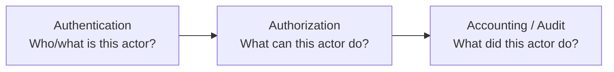
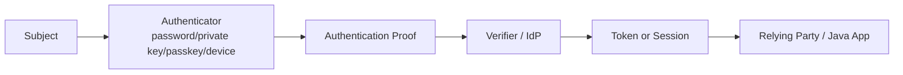
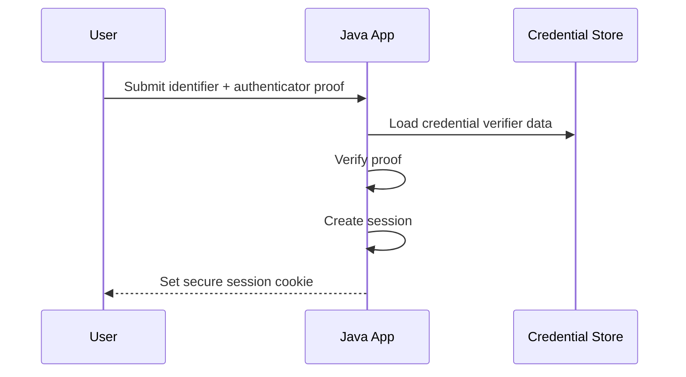
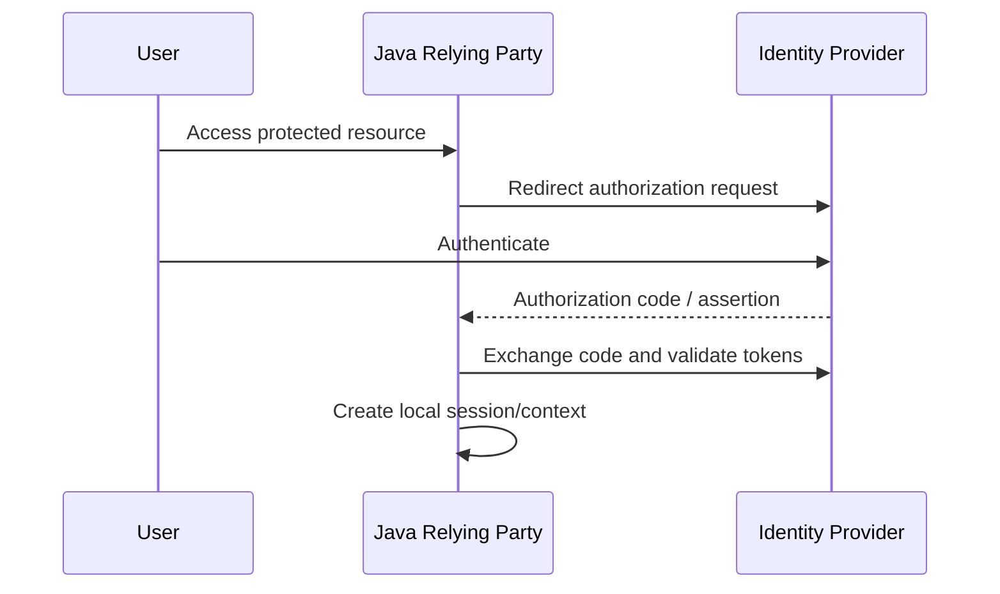
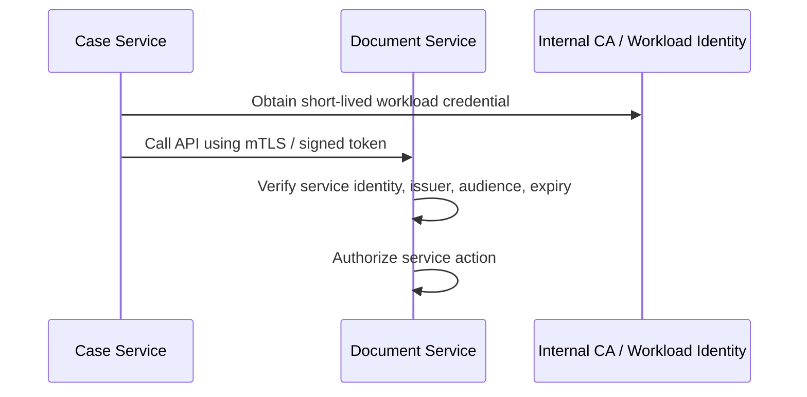
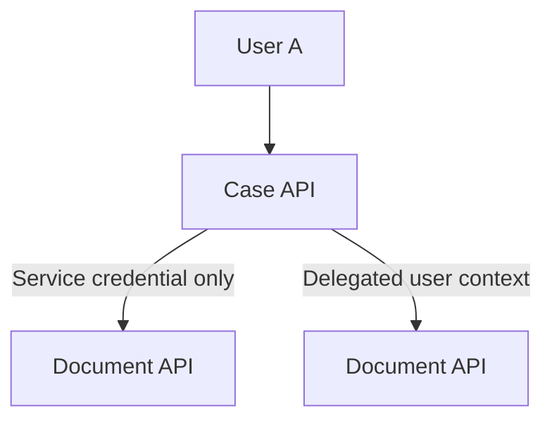
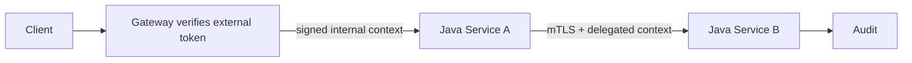

# Part 006 — Authentication and Identity Foundations

> Authentication bukan sekadar login. Authentication adalah proses membuktikan bahwa sebuah actor mengontrol authenticator tertentu, lalu menghasilkan identity context yang bisa dipercaya oleh sistem untuk keputusan berikutnya.

Part ini membangun fondasi identity dan authentication untuk sistem Java modern. Kita akan membedakan istilah yang sering tercampur: identity, subject, principal, credential, authenticator, token, session, claim, role, scope, dan permission.

Ini penting karena banyak bug authorization dan audit sebenarnya bermula dari model authentication yang kabur.

---

## 1. Posisi Part Ini dalam Framework Kaufman

Dalam Kaufman-style learning, kita tidak langsung menghafal OAuth, OIDC, SAML, JAAS, JWT, passkey, mTLS, atau session cookie. Kita pecah dulu skill authentication menjadi subskill kecil:

| Subskill | Pertanyaan inti |
|---|---|
| Identity vocabulary | Apa bedanya subject, principal, credential, authenticator, token, session? |
| Actor modeling | Siapa yang bertindak: human, service, batch job, device, CI runner? |
| Proof modeling | Bukti apa yang disajikan actor? Password, private key, hardware key, token, certificate? |
| Assurance reasoning | Seberapa kuat bukti itu dan untuk action apa cukup? |
| Session lifecycle | Apa yang terjadi setelah authentication berhasil? |
| Federation reasoning | Apakah identity dibuktikan lokal atau diassert oleh identity provider? |
| Failure modeling | Bagaimana token dicuri, session direplay, authenticator hilang, atau identity salah di-bind? |

Tujuan part ini bukan membuat implementasi login lengkap. Tujuannya membangun mental model agar desain authentication tidak keliru sejak awal.

---

## 2. Vocabulary yang Harus Jelas

| Istilah | Makna praktis |
|---|---|
| Entity | Sesuatu yang bisa dikenali: person, service, device, organization, workload. |
| Subject | Entity yang sedang dibicarakan dalam konteks security. |
| Principal | Nama/identifier yang merepresentasikan subject dalam sistem. |
| Credential | Data atau object yang digunakan untuk membuktikan identity atau authorization. |
| Authenticator | Sesuatu yang dimiliki/diketahui/dikontrol subject untuk membuktikan identity. |
| Authentication | Proses membuktikan subject mengontrol authenticator. |
| Authorization | Keputusan apakah subject boleh melakukan action pada resource. |
| Session | State setelah authentication yang menghindari pembuktian ulang di setiap request. |
| Token | Representasi portable dari klaim/otorisasi/session. |
| Claim | Pernyataan tentang subject, issuer, audience, expiry, scope, atau atribut lain. |
| Federation | Identity/authentication dilakukan oleh pihak lain lalu hasilnya diassert ke relying party. |

Kesalahan umum:

```text
"User punya role Admin, berarti user authenticated."
```

Itu salah framing. Role adalah input authorization. Authentication menjawab “siapa/apa subject ini dan bagaimana kita tahu?”

---

## 3. NIST Digital Identity Model: IAL, AAL, FAL

NIST SP 800-63-4 memisahkan digital identity menjadi beberapa assurance function:

| Assurance | Fokus |
|---|---|
| IAL — Identity Assurance Level | Seberapa kuat proses identity proofing/enrollment membuktikan identitas dunia nyata. |
| AAL — Authenticator Assurance Level | Seberapa kuat proses authentication dan binding authenticator ke subscriber. |
| FAL — Federation Assurance Level | Seberapa kuat assertion/federation antara identity provider dan relying party. |

Pemisahan ini penting.

Contoh:

| Sistem | IAL | AAL | FAL | Catatan |
|---|---:|---:|---:|---|
| Forum internal biasa | Rendah | Sedang | Bisa tidak federated | Identitas legal tidak terlalu penting. |
| Regulatory enforcement platform | Tinggi untuk officer | Tinggi untuk privileged action | Tinggi bila memakai IdP | Salah actor bisa berdampak legal. |
| Service-to-service API | Tidak relevan untuk person | Workload authentication | Federation/attestation bisa relevan | Machine identity berbeda dari human identity. |

Jangan mencampur “saya tahu orang ini siapa secara legal” dengan “request ini sekarang berasal dari session yang masih valid”. Itu dua problem berbeda.

---

## 4. Authentication vs Authorization vs Accounting

Gunakan model AAA:



Contoh pada Java API:

```text
Authentication:
- Request membawa session cookie/JWT/mTLS certificate.
- Sistem memverifikasi bukti dan membangun AuthenticatedActor.

Authorization:
- Actor mencoba approve Case C-123.
- Sistem mengecek actor punya capability approve untuk case tersebut.

Accounting/Audit:
- Sistem mencatat actor, action, resource, result, time, policy version, correlation id.
```

Bug sering terjadi ketika satu layer mengambil alih tugas layer lain.

Contoh anti-pattern:

```java
if (jwt.getClaim("role").equals("ADMIN")) {
    approveCase(caseId);
}
```

Masalah:

- Authentication token langsung dipakai sebagai authorization final.
- Tidak ada resource-level check.
- Tidak ada policy version.
- Tidak jelas issuer/audience/expiry/token binding.
- Tidak jelas apakah role masih valid saat action dilakukan.

Role dalam token adalah input, bukan keputusan final.

---

## 5. Java Identity Vocabulary: Subject dan Principal

Java punya vocabulary security lama melalui JAAS:

- `Subject` merepresentasikan grouping informasi security untuk satu entity.
- `Principal` merepresentasikan identity/nama yang berasosiasi dengan subject.
- `LoginContext` menyediakan cara melakukan authentication dengan `LoginModule` yang bisa diganti.

Contoh sederhana:

```java
import java.security.Principal;
import java.util.Set;

public record UserPrincipal(String name) implements Principal {
}

public record ServicePrincipal(String name) implements Principal {
}

public record AuthenticatedSubject(
        Set<Principal> principals,
        Set<String> authenticationMethods,
        String issuer,
        String sessionId
) {
    public boolean hasPrincipal(Class<? extends Principal> type) {
        return principals.stream().anyMatch(type::isInstance);
    }
}
```

Di aplikasi modern, terutama web service, kita jarang membangun sistem langsung di atas JAAS. Namun vocabulary-nya tetap berguna:

```text
Subject = entity yang authenticated.
Principal = identifier/nama subject dalam domain tertentu.
Credential/authenticator = bukti atau mekanisme pembuktian.
```

Catatan penting: karena Security Manager sudah tidak menjadi boundary modern, jangan menganggap JAAS permission model lama sebagai sandbox aplikasi. Gunakan vocabulary-nya bila berguna, tetapi desain boundary dengan kontrol modern: process isolation, container, OS policy, network policy, explicit authorization, dan audit.

---

## 6. Actor Modeling: Human, Service, Device, Job

Sistem Java produksi tidak hanya melayani user manusia.

| Actor type | Contoh | Authentication umum |
|---|---|---|
| Human user | Officer, supervisor, support agent | Password + MFA, passkey, SSO/OIDC. |
| Service | Case API memanggil Document API | mTLS, workload identity, signed token. |
| Batch job | Nightly reconciliation job | Service account, workload identity, short-lived credential. |
| CI runner | Build pipeline menerbitkan artifact | OIDC federation to cloud, signed provenance. |
| Device | Scanner/terminal lapangan | Device certificate, enrollment, rotation. |
| Third-party system | Payment/compliance provider | mTLS, client credential, signed webhook. |

Actor modeling harus menjawab:

1. Apakah actor human atau machine?
2. Siapa issuer identity-nya?
3. Bagaimana credential diterbitkan?
4. Bagaimana credential diputar/dicabut?
5. Apa blast radius jika credential bocor?
6. Apakah actor boleh membawa user context atau hanya service context?

---

## 7. Credential, Authenticator, dan Token Bukan Hal yang Sama

Perbedaan ini fundamental.



| Item | Contoh | Harus disimpan? | Catatan |
|---|---|---:|---|
| Password | User secret | Tidak dalam plaintext | Simpan hanya adaptive hash. |
| Private key | mTLS/client key | Ya, sangat dilindungi | Bisa di HSM/KMS/keystore. |
| Passkey credential | FIDO/WebAuthn credential | Public key server-side | Private key tetap di authenticator. |
| Session cookie | Opaque session id | Server menyimpan state atau signed/encrypted token | Harus punya expiry dan invalidation. |
| Access token | JWT/opaque token | Client membawa | Harus divalidasi issuer/audience/expiry/scope. |
| Refresh token | Long-lived token | Sangat sensitif | Rotation dan replay detection penting. |

Token adalah hasil dari proses authentication/authorization. Token bukan authenticator primer, kecuali dalam konteks session continuation.

---

## 8. Authentication Flow: Local vs Federated

### 8.1 Local Authentication



Risiko:

- password handling,
- credential stuffing,
- weak reset flow,
- session fixation,
- MFA bypass,
- credential store compromise.

### 8.2 Federated Authentication



Risiko:

- redirect URI mismatch,
- CSRF/state validation failure,
- nonce validation failure,
- issuer confusion,
- token substitution,
- audience confusion,
- over-trusting claims,
- account linking bugs.

IETF RFC 9700 menjadi rujukan security best current practice untuk OAuth 2.0 modern dan memperbarui threat model serta advice dari RFC OAuth sebelumnya.

---

## 9. Authentication Output: Jangan Hanya Simpan String Username

Setelah authentication berhasil, aplikasi harus membangun identity context yang eksplisit.

Contoh model:

```java
import java.time.Instant;
import java.util.Set;

public record AuthenticatedActor(
        String subjectId,
        ActorType type,
        String issuer,
        Set<String> authenticationMethods,
        Set<String> assuranceTags,
        Instant authenticatedAt,
        Instant expiresAt,
        String sessionId,
        String tenantId
) {
    public boolean isExpired(Instant now) {
        return !expiresAt.isAfter(now);
    }

    public boolean isHuman() {
        return type == ActorType.HUMAN;
    }
}

public enum ActorType {
    HUMAN,
    SERVICE,
    BATCH_JOB,
    DEVICE,
    CI_RUNNER,
    THIRD_PARTY
}
```

Mengapa ini lebih baik daripada `String username`?

- Bisa membedakan human vs service.
- Bisa menyimpan issuer.
- Bisa menyimpan assurance/context.
- Bisa mengecek expiry.
- Bisa dipakai audit.
- Bisa dipakai authorization policy.

Tetapi jangan memasukkan terlalu banyak data sensitif ke context. Identity context harus cukup untuk security decision, bukan menjadi dump semua claim.

---

## 10. Claim: Pernyataan, Bukan Kebenaran Absolut

Claim adalah pernyataan dari issuer.

Contoh claim JWT:

```json
{
  "iss": "https://idp.example.com",
  "sub": "user-123",
  "aud": "case-platform-api",
  "exp": 1782614400,
  "iat": 1782610800,
  "amr": ["pwd", "webauthn"],
  "tenant": "regulator-a",
  "scope": "case:read case:approve"
}
```

Aplikasi Java tidak boleh langsung percaya claim hanya karena token bisa di-decode. Ia harus memvalidasi:

- signature,
- algorithm policy,
- issuer,
- audience,
- expiry,
- not-before bila ada,
- nonce/state untuk flow tertentu,
- key source/JWKS,
- token type,
- tenant binding,
- replay/session policy bila relevan.

JWT decoding bukan verification.

Anti-pattern:

```java
String payload = new String(Base64.getUrlDecoder().decode(parts[1]));
// Parse role from payload and trust it.
```

Ini hanya membaca klaim, bukan membuktikan klaim.

---

## 11. Session Model

Setelah authentication, sistem biasanya memakai session.

Dua model umum:

| Model | Karakteristik | Trade-off |
|---|---|---|
| Server-side session | Client menyimpan opaque session id; state di server. | Mudah invalidation, butuh shared/session store. |
| Stateless token | Client membawa signed token. | Mudah scale, sulit revocation langsung. |

Session invariant:

```text
A session is valid only if:
1. It was issued by trusted authority.
2. It has not expired.
3. It has not been revoked or superseded when revocation is required.
4. It is bound to expected client/security context when binding is used.
5. It satisfies the assurance required by the attempted action.
```

Cookie hardening untuk web session:

```http
Set-Cookie: SID=<opaque>; HttpOnly; Secure; SameSite=Lax; Path=/; Max-Age=1800
```

Untuk action sensitif, session yang masih valid belum tentu cukup. Sistem bisa meminta step-up authentication.

Contoh:

| Action | Session biasa cukup? | Step-up? |
|---|---:|---:|
| View dashboard | Ya | Tidak |
| Export sensitive case data | Tergantung | Sering ya |
| Change role | Tidak cukup | Ya |
| Reset MFA | Tidak cukup | Ya + audit/dual control |
| Approve high-risk enforcement action | Tergantung policy | Sering ya |

---

## 12. MFA, Passkeys, dan Phishing Resistance

Multi-factor authentication bukan sekadar “ada OTP”. Faktor harus berbeda dan harus melawan ancaman yang ditargetkan.

| Authenticator | Kekuatan | Risiko |
|---|---|---|
| Password | Mudah dipakai | Phishing, reuse, stuffing. |
| SMS OTP | Lebih baik dari password saja | SIM swap, interception, phishing. |
| TOTP | Offline, umum | Phishable, seed leakage. |
| Push approval | Usability baik | Push fatigue, social engineering. |
| FIDO2/WebAuthn/passkey | Phishing-resistant bila benar | Recovery/account linking harus hati-hati. |
| Client certificate | Kuat untuk machine/device | Key storage dan rotation. |

Untuk sistem sensitif, pertanyaan yang lebih tepat bukan “apakah MFA ada?”, tetapi:

```text
Apakah authentication method ini cukup kuat untuk attack path yang ingin kita cegah?
```

---

## 13. Service Identity dan Workload Authentication

Service-to-service call tidak boleh hanya mengandalkan network location.

Anti-pattern:

```text
Jika request datang dari private subnet, berarti trusted.
```

Private network bukan identity. Private network hanya placement.

Model yang lebih baik:



Service identity harus menjawab:

- service apa yang memanggil,
- dari environment mana,
- credential diterbitkan oleh siapa,
- berapa lama valid,
- audience mana yang boleh menerima,
- scope/capability apa yang diberikan,
- bagaimana revocation/rotation dilakukan.

---

## 14. User Delegation vs Service Authority

Salah satu sumber bug besar adalah mencampur user delegation dan service authority.

Contoh:

```text
Case API receives request from User A.
Case API calls Document API.
Should Document API see User A or Case API?
```

Ada dua model:

| Model | Makna |
|---|---|
| Service authority | Case API bertindak sebagai dirinya sendiri. |
| User delegation | Case API bertindak atas nama User A. |

Keduanya valid, tetapi kontrolnya berbeda.



Pertanyaan desain:

- Apakah downstream butuh tahu user asli?
- Apakah downstream harus enforce resource-level authorization?
- Apakah user context bisa dipalsukan oleh service pemanggil?
- Apakah audit harus mencatat initiating user dan calling service?
- Apakah token exchange diperlukan?

Audit ideal sering menyimpan keduanya:

```json
{
  "initiatingActor": "user-123",
  "callingService": "case-api",
  "effectiveAction": "document.read",
  "resource": "document-789",
  "correlationId": "..."
}
```

---

## 15. Account Linking: Bahaya Identity Ambiguity

Federated login sering butuh account linking.

Anti-pattern:

```text
Jika email sama, account sama.
```

Email bisa berubah, tidak selalu verified, bisa reuse, dan bisa berasal dari issuer berbeda.

Model yang lebih aman:

```text
External identity key = issuer + subject
Internal account binding = explicit verified link between external identity and internal account
```

Contoh Java value object:

```java
public record ExternalIdentity(
        String issuer,
        String subject
) {
    public ExternalIdentity {
        if (issuer == null || issuer.isBlank()) {
            throw new IllegalArgumentException("issuer is required");
        }
        if (subject == null || subject.isBlank()) {
            throw new IllegalArgumentException("subject is required");
        }
    }
}
```

Jangan jadikan email sebagai primary security key kecuali policy domain benar-benar menjaminnya dan risiko sudah diterima.

---

## 16. Authentication Failure Modes

| Failure mode | Dampak | Mitigasi |
|---|---|---|
| Token theft | Account/session takeover. | Short TTL, secure cookie, token binding where applicable, anomaly detection. |
| Session fixation | Attacker memaksa victim memakai session attacker. | Regenerate session after login. |
| Credential stuffing | Password reuse diserang massal. | Rate limit, breached password check, MFA, bot defense. |
| MFA fatigue | User menyetujui push palsu. | Number matching, phishing-resistant authenticators, risk signals. |
| Issuer confusion | Token dari issuer lain diterima. | Strict issuer allowlist. |
| Audience confusion | Token untuk service A diterima service B. | Strict audience validation. |
| Algorithm confusion | Verifier menerima alg tidak sesuai policy. | Pin allowed algorithms. |
| Account linking bug | User masuk ke account orang lain. | Bind by issuer+subject, explicit verification. |
| Stale privilege | Token lama masih membawa role yang sudah dicabut. | Short-lived access token, introspection/revocation, policy check. |
| Weak recovery | Reset password/MFA bypass lebih lemah dari login. | Recovery flow threat modeled seperti login. |

Recovery flow sering menjadi jalur takeover paling mudah. Perlakukan password reset dan MFA reset sebagai authentication system, bukan fitur tambahan.

---

## 17. Authentication Invariants

Contoh invariant untuk Java API:

```text
For every protected request:
1. The actor identity must come from a verified authentication mechanism.
2. The issuer must be trusted for this application/environment.
3. The token/session must be intended for this audience.
4. The token/session must be unexpired and not revoked when revocation applies.
5. The actor type must be compatible with the action.
6. The assurance level must satisfy action sensitivity.
7. The resulting identity context must be propagated to authorization and audit without client-side mutation.
```

Invariant ini bisa diterjemahkan menjadi filter/interceptor.

Contoh skeleton:

```java
public final class AuthenticationContextFactory {

    private final TokenVerifier tokenVerifier;
    private final TrustedIssuerPolicy issuerPolicy;

    public AuthenticationContextFactory(
            TokenVerifier tokenVerifier,
            TrustedIssuerPolicy issuerPolicy
    ) {
        this.tokenVerifier = tokenVerifier;
        this.issuerPolicy = issuerPolicy;
    }

    public AuthenticatedActor authenticate(BearerToken token) {
        VerifiedToken verified = tokenVerifier.verify(token);

        if (!issuerPolicy.isTrusted(verified.issuer())) {
            throw new SecurityException("Untrusted token issuer");
        }

        return new AuthenticatedActor(
                verified.subject(),
                verified.actorType(),
                verified.issuer(),
                verified.authenticationMethods(),
                verified.assuranceTags(),
                verified.issuedAt(),
                verified.expiresAt(),
                verified.sessionId(),
                verified.tenantId()
        );
    }
}
```

Perhatikan bahwa `TokenVerifier.verify()` harus melakukan verifikasi kriptografis dan semantic validation. Nama method harus mencerminkan tanggung jawabnya, bukan sekadar `parse()`.

---

## 18. Authentication Context Propagation

Dalam sistem terdistribusi, identity context harus dipropagasi dengan hati-hati.

Anti-pattern:

```http
X-User-Id: user-123
X-Role: admin
```

Jika header ini datang dari client atau service tidak dipercaya, ia bisa dipalsukan.

Pattern yang lebih aman:

- Gateway memverifikasi token eksternal.
- Gateway menerbitkan internal token/header yang hanya valid antar service terpercaya.
- Downstream memverifikasi issuer internal atau mTLS identity.
- Header user context hanya diterima dari trusted boundary.
- Audit mencatat chain of custody.



Pertanyaan penting:

```text
Siapa yang boleh membuat identity context?
Siapa yang boleh meneruskannya?
Siapa yang harus memverifikasinya lagi?
```

---

## 19. Login Endpoint Threat Model

Login endpoint adalah high-value target.

Threats:

| Threat | Mitigation |
|---|---|
| User enumeration | Uniform response, careful timing, monitoring. |
| Brute force | Rate limit by account/IP/device/risk, lockout with care. |
| Credential stuffing | Breached password detection, bot defense, MFA. |
| Weak password policy | Length, blocklist, no arbitrary composition traps, password manager friendly. |
| Session fixation | Regenerate session after successful login. |
| CSRF on login/logout | CSRF protection where browser credentials involved. |
| Open redirect after login | Strict redirect allowlist. |
| MFA bypass | Ensure all login paths enforce same assurance policy. |
| Recovery bypass | Treat recovery as equivalent or stronger risk than login. |

Jangan hanya mengamankan `/login`. Amankan semua jalan menuju authenticated session.

---

## 20. Logout, Revocation, dan Session Expiry

Logout sulit pada sistem terdistribusi karena token bisa tersebar.

| Mechanism | Kelebihan | Kekurangan |
|---|---|---|
| Short-lived access token | Mengurangi window pencurian. | Tidak langsung revoke. |
| Refresh token rotation | Deteksi replay refresh token. | Butuh state. |
| Server-side session | Revocation mudah. | Butuh session store. |
| Token introspection | Centralized validation. | Latency/dependency. |
| Revocation list | Bisa revoke stateless token tertentu. | State dan propagation. |

Rule praktis:

```text
Jika action sensitif membutuhkan revocation cepat, jangan bergantung hanya pada long-lived stateless token.
```

---

## 21. Authentication Logging dan Audit

Authentication event harus cukup untuk investigasi, tetapi tidak boleh bocor secret.

Log yang berguna:

| Event | Fields |
|---|---|
| Login success | subject, issuer, method, assurance, IP/device coarse info, correlation id. |
| Login failure | identifier hash, reason category, source, correlation id. |
| MFA challenge | subject, method, result, risk context. |
| Token refresh | subject, session id, rotation result. |
| Logout/revocation | subject, session/token id hash, reason. |
| Account linking | internal account, external issuer+subject, actor, approval. |

Jangan log:

- password,
- OTP,
- raw token,
- refresh token,
- private key,
- full session cookie,
- sensitive recovery secret.

Untuk token/session id, log hash/fingerprint jika perlu korelasi.

---

## 22. Common Pitfalls

| Pitfall | Kenapa berbahaya | Perbaikan |
|---|---|---|
| Username string dipakai di seluruh aplikasi | Hilang issuer, actor type, assurance, expiry. | Gunakan identity context eksplisit. |
| Role dari token dianggap final authorization | Role bisa stale dan tidak resource-specific. | Gunakan policy decision di service layer. |
| JWT di-decode tanpa verify | Claim palsu diterima. | Verifikasi signature dan semantic claims. |
| Internal header dipercaya | Header bisa dipalsukan jika boundary salah. | Terima hanya dari trusted gateway/service dengan verification. |
| Machine identity disamakan dengan user identity | Audit dan authorization kacau. | Bedakan human/service/delegated context. |
| Email dipakai sebagai primary identity key | Account linking bug. | Gunakan issuer+subject sebagai external identity key. |
| Recovery flow lebih lemah dari login | Takeover via reset. | Threat model reset/MFA recovery. |
| Stateless token terlalu panjang umur | Revocation lambat. | Short TTL + refresh rotation/introspection untuk risiko tinggi. |
| MFA dianggap otomatis phishing-resistant | Banyak MFA masih phishable. | Gunakan method sesuai threat, prioritaskan phishing-resistant untuk action sensitif. |

---

## 23. Practice: 20 Jam Pertama Authentication Design

| Jam | Latihan | Output |
|---:|---|---|
| 1–2 | Ambil satu aplikasi Java yang kamu kenal. Identifikasi semua actor. | Actor table. |
| 3–4 | Bedakan human, service, batch, third-party, CI. | Actor type model. |
| 5–6 | Petakan authentication mechanism tiap actor. | Mechanism matrix. |
| 7–8 | Tulis identity context minimal. | `AuthenticatedActor` record. |
| 9–10 | Petakan session/token lifecycle. | Flow diagram. |
| 11–12 | Identifikasi issuer/audience/expiry validation. | Token validation checklist. |
| 13–14 | Threat model login/recovery/session. | Threat table. |
| 15–16 | Definisikan step-up policy untuk action sensitif. | Assurance decision table. |
| 17–18 | Tulis audit event taxonomy. | Auth event catalog. |
| 19–20 | Review failure modes dengan engineer lain. | Open risks + mitigation plan. |

---

## 24. Checklist Ringkas

Sebelum desain authentication dianggap cukup:

- [ ] Actor type eksplisit: human, service, batch, device, CI, third-party.
- [ ] Issuer identity jelas dan trusted.
- [ ] Credential/authenticator lifecycle jelas.
- [ ] Token/session expiry jelas.
- [ ] Revocation strategy sesuai risiko.
- [ ] Audience dan issuer divalidasi ketat.
- [ ] JWT/token tidak hanya di-decode, tetapi diverifikasi.
- [ ] Identity context memuat subject, issuer, actor type, assurance, expiry, tenant/context.
- [ ] Authorization tidak hanya bergantung pada role token.
- [ ] Step-up authentication didefinisikan untuk action sensitif.
- [ ] Recovery flow punya threat model.
- [ ] Authentication event diaudit tanpa membocorkan secret.

---

## 25. Ringkasan

Authentication adalah fondasi semua keputusan security berikutnya. Jika identity context kabur, authorization, audit, crypto, dan incident response akan ikut kabur.

Mental model utama:

```text
Authenticator proves control.
Authentication verifies the proof.
Identity context represents the verified subject.
Authorization decides allowed actions.
Audit preserves evidence of what happened.
```

Untuk sistem Java modern, jangan hanya bertanya “user sudah login atau belum?”. Tanyakan:

```text
Who or what is the actor?
Who asserted that identity?
What proof was verified?
How strong is the assurance?
What is the token/session lifecycle?
Can this context be safely used for this action?
```

Part berikutnya akan masuk ke authorization policy models: RBAC, ABAC, ReBAC, deny-by-default, confused deputy, segregation of duties, dan policy invariant.

---

## References

- NIST SP 800-63-4, Digital Identity Guidelines — https://pages.nist.gov/800-63-4/
- NIST SP 800-63B-4, Authentication and Authenticator Management — https://csrc.nist.gov/pubs/sp/800/63/b/4/final
- IETF RFC 9700, Best Current Practice for OAuth 2.0 Security — https://datatracker.ietf.org/doc/rfc9700/
- Oracle Java SE 25 API, `LoginContext` — https://docs.oracle.com/en/java/javase/25/docs/api/java.base/javax/security/auth/login/LoginContext.html
- Oracle Java SE, JAAS Reference Guide — https://docs.oracle.com/en/java/javase/23/security/java-authentication-and-authorization-service-jaas-reference-guide.html
- OWASP Application Security Verification Standard — https://owasp.org/www-project-application-security-verification-standard/
