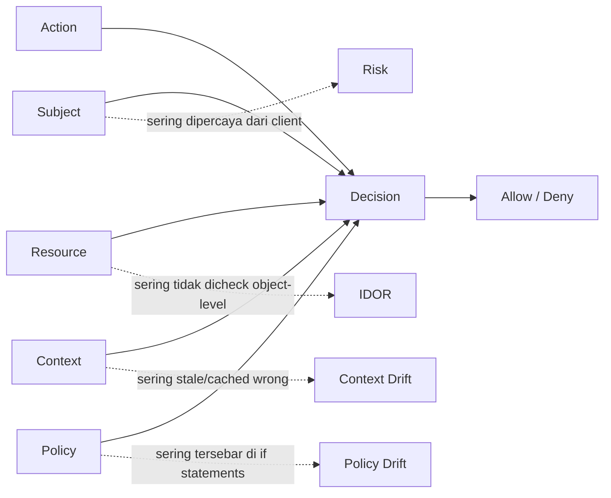
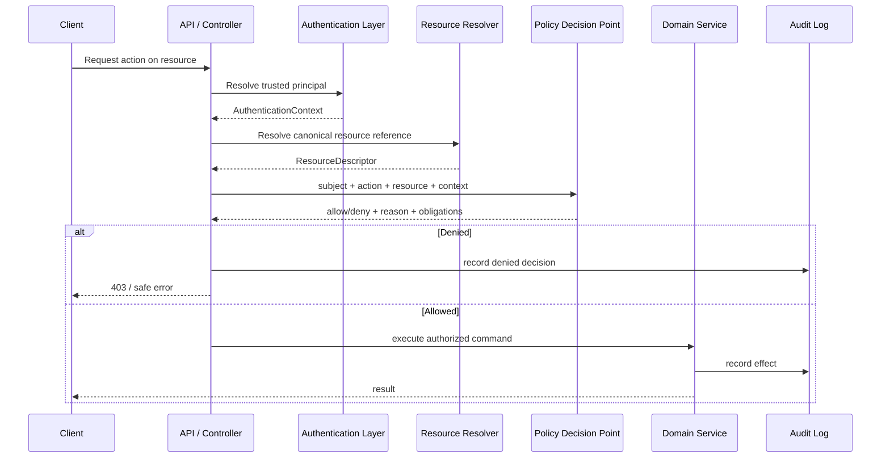
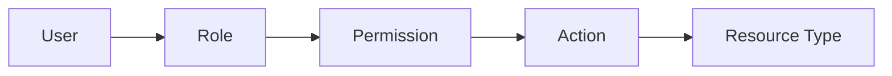
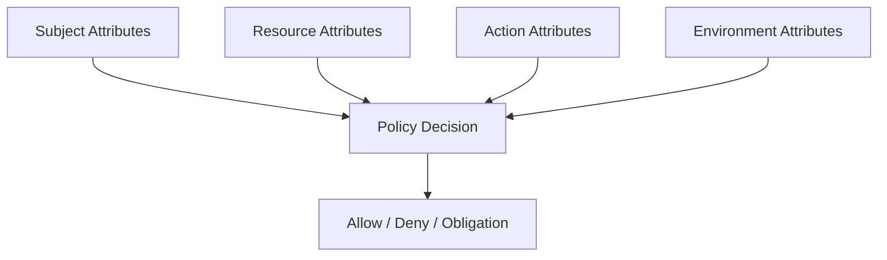
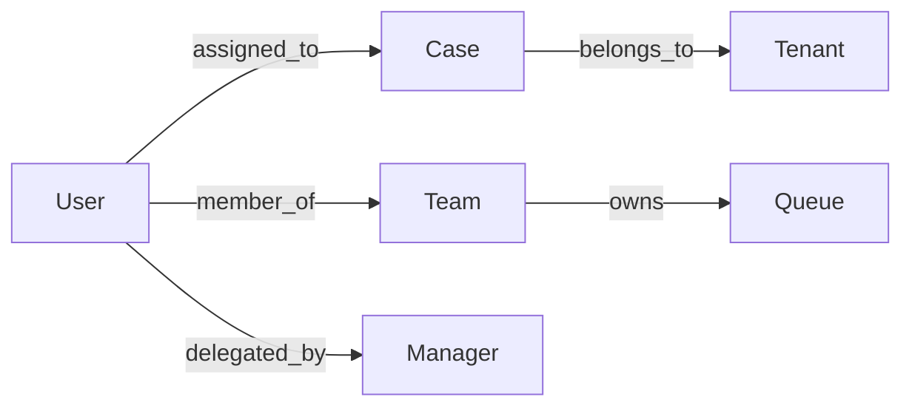
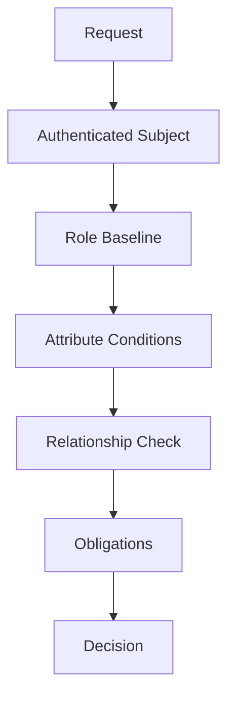
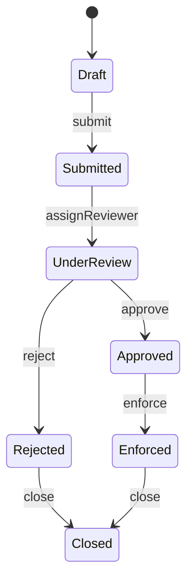

# Part 007 — Authorization Policy Models

> Authentication menjawab **siapa kamu**. Authorization menjawab **apa yang boleh kamu lakukan, terhadap objek apa, dalam kondisi apa, dengan alasan apa, dan apakah keputusan itu tetap benar saat sistem berubah**.

Part ini membahas authorization sebagai **decision system**, bukan sekadar anotasi `@PreAuthorize`, role string, atau `if (user.isAdmin())`. Untuk sistem Java produksi, authorization adalah salah satu boundary paling kritis karena kesalahannya sering tidak terlihat sebagai crash. Sistem tetap berjalan, response tetap `200 OK`, tetapi data atau aksi bocor ke actor yang salah.

Kita akan membangun mental model yang bisa dipakai di service monolith, microservice, BPM/workflow engine, event-driven system, regulatory case management, internal platform, dan public API.

---

## 1. Posisi Part Ini dalam Framework Kaufman

Dalam pendekatan Kaufman, authorization harus dipecah menjadi subskill yang bisa dilatih secara terpisah:

| Subskill | Tujuan Praktis |
|---|---|
| Resource modeling | Mampu mendefinisikan objek yang dilindungi: case, document, account, task, tenant, secret, artifact, transition. |
| Action modeling | Membedakan read, list, create, update, approve, assign, export, override, delete, impersonate, dan transition. |
| Subject modeling | Memisahkan user, service account, workload identity, delegated actor, admin, system job, dan integration partner. |
| Policy modeling | Mengubah aturan bisnis/security menjadi policy yang eksplisit, testable, dan reviewable. |
| Enforcement placement | Menentukan di mana keputusan harus ditegakkan: API, service, query, workflow transition, message consumer, atau storage. |
| Failure modeling | Membayangkan bypass: IDOR, confused deputy, stale permission, cache leak, tenant bleed, dan time-of-check/time-of-use. |
| Evidence modeling | Menghasilkan audit trail yang menjelaskan siapa meminta apa, terhadap resource mana, dan kenapa diizinkan/ditolak. |

Target part ini: kamu mampu mendesain authorization layer yang punya **invariant jelas**, bukan kumpulan check tersebar yang rapuh.

---

## 2. Core Invariant Authorization

Authorization yang matang bisa diringkas menjadi satu invariant:

> Untuk setiap operasi yang memengaruhi confidentiality, integrity, availability, accountability, atau regulatory state, sistem harus membuat keputusan akses berdasarkan subject, action, resource, context, dan policy yang trusted; keputusan itu harus ditegakkan sebelum efek terjadi; keputusan dan alasan pentingnya harus bisa diuji dan diaudit.

Invariant ini punya konsekuensi langsung:

1. Authorization bukan hanya di controller.
2. Authorization bukan hanya role.
3. Authorization bukan hanya UI hiding.
4. Authorization bukan hanya middleware global.
5. Authorization bukan hanya token claim.
6. Authorization harus terjadi sebelum resource dikembalikan, diubah, diekspor, dikirim ke queue, atau ditransisikan.
7. Authorization harus mempertimbangkan objek konkret, bukan hanya endpoint.

Broken authorization biasanya terjadi saat salah satu komponen berikut diasumsikan, bukan diverifikasi:



---

## 3. Vocabulary yang Harus Konsisten

Sebelum memilih RBAC, ABAC, ReBAC, atau policy engine, vocabulary harus stabil.

| Istilah | Makna |
|---|---|
| Subject | Actor yang meminta akses: user, service, job, integration, delegated user. |
| Principal | Identitas terverifikasi dari subject, biasanya hasil authentication. |
| Resource/Object | Objek yang dilindungi: document, case, account, tenant, workflow task, report. |
| Action/Operation | Perbuatan yang diminta: view, list, edit, approve, assign, export, delete. |
| Context/Environment | Kondisi request: tenant, time, network zone, assurance level, device posture, workflow state. |
| Policy | Aturan yang menentukan allow/deny. |
| Permission | Kemampuan spesifik yang diberikan oleh policy atau role. |
| Role | Pengelompokan permission atau tanggung jawab. |
| Entitlement | Hak akses yang dimiliki subject, sering dari IAM/external system. |
| PDP | Policy Decision Point: komponen yang memutuskan allow/deny. |
| PEP | Policy Enforcement Point: lokasi yang menegakkan keputusan. |
| PIP | Policy Information Point: sumber attribute/context untuk keputusan. |
| Obligation | Aksi tambahan jika allow, misalnya mask field, log reason, require step-up auth. |

Dalam sistem Java, vocabulary yang tidak konsisten menghasilkan bug yang sangat mahal. Contoh: `role`, `permission`, `scope`, dan `authority` dipakai bergantian, lalu engineer baru tidak tahu mana yang benar-benar enforceable.

---

## 4. Authorization Pipeline

Authorization sebaiknya dipikirkan sebagai pipeline eksplisit.



Pipeline ini penting karena banyak sistem hanya melakukan:

```java
if (currentUser.hasRole("ADMIN")) {
    return repository.findById(id);
}
```

Masalahnya:

- resource belum diselesaikan;
- tenant belum divalidasi;
- action belum eksplisit;
- policy tersembunyi di role check;
- tidak ada reason code;
- tidak ada audit decision;
- tidak ada cara menguji policy secara terpisah.

---

## 5. Deny by Default

Prinsip pertama access control: **deny by default**.

Artinya bukan hanya “kalau tidak punya role, tolak”. Artinya:

1. resource yang tidak ditemukan tidak boleh otomatis diasumsikan tidak sensitif;
2. policy yang gagal load harus fail-closed;
3. attribute yang missing harus dianggap tidak memenuhi syarat;
4. exception pada PDP tidak boleh berubah menjadi allow;
5. endpoint baru tidak boleh terbuka karena lupa anotasi;
6. action baru tidak boleh otomatis diwarisi oleh role lama;
7. data baru tidak boleh ikut list/export sebelum policy field-level jelas.

Model ini harus diwujudkan dalam code structure.

```java
public enum DecisionEffect {
    ALLOW,
    DENY
}

public record AuthorizationDecision(
        DecisionEffect effect,
        String policyId,
        String reasonCode,
        Map<String, Object> obligations
) {
    public static AuthorizationDecision deny(String policyId, String reasonCode) {
        return new AuthorizationDecision(
                DecisionEffect.DENY,
                policyId,
                reasonCode,
                Map.of()
        );
    }

    public boolean allowed() {
        return effect == DecisionEffect.ALLOW;
    }
}
```

Jangan desain API yang default-nya allow:

```java
// Buruk: null berarti allow? exception berarti allow? missing policy berarti allow?
Boolean canAccess(User user, Document document);
```

Lebih aman:

```java
public interface Authorizer {
    AuthorizationDecision decide(AuthorizationRequest request);
}

public record AuthorizationRequest(
        SubjectRef subject,
        ActionRef action,
        ResourceRef resource,
        EnvironmentContext environment
) {}
```

Setiap request menghasilkan decision eksplisit.

---

## 6. RBAC: Role-Based Access Control

RBAC cocok saat organisasi punya job function stabil:

- `CASE_OFFICER`
- `SUPERVISOR`
- `AUDITOR`
- `ADMIN`
- `READ_ONLY_ANALYST`
- `INTEGRATION_SERVICE`

RBAC mudah dipahami, mudah dikomunikasikan, dan relatif mudah diaudit.



Contoh model:

```java
public enum Role {
    CASE_OFFICER,
    SUPERVISOR,
    AUDITOR,
    SYSTEM_ADMIN
}

public enum Permission {
    CASE_READ,
    CASE_UPDATE,
    CASE_APPROVE,
    CASE_ASSIGN,
    CASE_EXPORT
}

public final class RolePermissionMap {
    private static final Map<Role, Set<Permission>> PERMISSIONS = Map.of(
            Role.CASE_OFFICER, Set.of(Permission.CASE_READ, Permission.CASE_UPDATE),
            Role.SUPERVISOR, Set.of(Permission.CASE_READ, Permission.CASE_APPROVE, Permission.CASE_ASSIGN),
            Role.AUDITOR, Set.of(Permission.CASE_READ, Permission.CASE_EXPORT),
            Role.SYSTEM_ADMIN, Set.of()
    );

    public static boolean hasPermission(Set<Role> roles, Permission permission) {
        return roles.stream()
                .flatMap(role -> PERMISSIONS.getOrDefault(role, Set.of()).stream())
                .anyMatch(permission::equals);
    }
}
```

Namun RBAC punya batas:

| Problem | Dampak |
|---|---|
| Role explosion | Terlalu banyak role kecil: `REGION_A_SUPERVISOR_EXPORT_APPROVER_TEMP`. |
| Poor object-level control | Role memberi hak ke tipe objek, bukan instance objek. |
| Context blind | Tidak tahu workflow state, tenant, risk score, location, time, ownership. |
| Admin overreach | Role admin jadi bypass universal. |
| Hard delegation | Sulit memodelkan acting-on-behalf-of atau temporary approval. |

RBAC baik sebagai baseline, tetapi jarang cukup untuk sistem regulatori atau multi-tenant yang serius.

---

## 7. ABAC: Attribute-Based Access Control

ABAC memutuskan akses berdasarkan attribute dari subject, resource, action, dan environment.

Definisi NIST SP 800-162 menekankan bahwa ABAC menentukan authorization dengan mengevaluasi attribute subject, object, requested operation, dan kondisi environment terhadap policy/rule/relationship.



Contoh attribute:

| Dimensi | Contoh |
|---|---|
| Subject | department, clearance, region, employment status, assurance level, assigned cases. |
| Resource | tenant, owner, classification, workflow state, jurisdiction, retention status. |
| Action | read, update, approve, export, override, bulk-download. |
| Environment | business hours, network zone, emergency mode, device risk, request origin. |

Contoh policy natural language:

> Case officer boleh membaca case jika officer berada di tenant yang sama, region case termasuk region officer, case tidak sealed, dan officer punya assignment aktif; jika case classified, authentication assurance harus tinggi.

Dalam Java, jangan langsung menanam semua attribute logic di controller. Bentuk request policy:

```java
public record SubjectAttributes(
        String subjectId,
        String tenantId,
        Set<String> roles,
        Set<String> regions,
        int authenticationAssuranceLevel,
        boolean active
) {}

public record ResourceAttributes(
        String resourceType,
        String resourceId,
        String tenantId,
        String region,
        String classification,
        String workflowState,
        boolean sealed
) {}

public record EnvironmentAttributes(
        Instant requestTime,
        String networkZone,
        boolean breakGlassMode
) {}
```

Policy bisa ditulis sebagai pure function:

```java
public final class CaseReadPolicy {
    public AuthorizationDecision decide(
            SubjectAttributes subject,
            ResourceAttributes resource,
            EnvironmentAttributes environment
    ) {
        if (!subject.active()) {
            return AuthorizationDecision.deny("case.read.v1", "subject_inactive");
        }
        if (!subject.tenantId().equals(resource.tenantId())) {
            return AuthorizationDecision.deny("case.read.v1", "tenant_mismatch");
        }
        if (resource.sealed() && !subject.roles().contains("SUPERVISOR")) {
            return AuthorizationDecision.deny("case.read.v1", "case_sealed");
        }
        if (!subject.regions().contains(resource.region())) {
            return AuthorizationDecision.deny("case.read.v1", "region_not_allowed");
        }
        if ("CLASSIFIED".equals(resource.classification())
                && subject.authenticationAssuranceLevel() < 2) {
            return AuthorizationDecision.deny("case.read.v1", "step_up_required");
        }
        return new AuthorizationDecision(
                DecisionEffect.ALLOW,
                "case.read.v1",
                "allowed",
                Map.of("maskFields", List.of("internalNotes"))
        );
    }
}
```

ABAC lebih ekspresif, tetapi lebih sulit diuji jika attribute tidak jelas sumbernya. Sumber attribute harus trusted.

---

## 8. ReBAC: Relationship-Based Access Control

ReBAC memutuskan akses berdasarkan hubungan antar entity.

Contoh:

- user assigned to case;
- manager supervises officer;
- reviewer belongs to review panel;
- user owns document;
- organization has contract with tenant;
- service acts on behalf of partner;
- case is linked to investigation group.



ReBAC cocok untuk case management, collaboration, document sharing, workflow task assignment, dan regulatory lifecycle.

Contoh decision:

```java
public interface RelationshipRepository {
    boolean exists(RelationshipQuery query);
}

public record RelationshipQuery(
        String subjectId,
        String relationship,
        String resourceType,
        String resourceId
) {}

public final class CaseAssignmentPolicy {
    private final RelationshipRepository relationships;

    public CaseAssignmentPolicy(RelationshipRepository relationships) {
        this.relationships = relationships;
    }

    public AuthorizationDecision canUpdateCase(String userId, String caseId) {
        boolean assigned = relationships.exists(new RelationshipQuery(
                userId,
                "assigned_to",
                "case",
                caseId
        ));

        if (!assigned) {
            return AuthorizationDecision.deny("case.update.assignment.v1", "not_assigned");
        }
        return new AuthorizationDecision(
                DecisionEffect.ALLOW,
                "case.update.assignment.v1",
                "assigned_user",
                Map.of()
        );
    }
}
```

Risiko utama ReBAC:

1. relationship graph stale;
2. circular delegation;
3. hidden inheritance;
4. relationship query mahal;
5. cache key salah;
6. revocation tidak instant;
7. edge direction ambigu.

Untuk sistem kritis, relationship harus punya lifecycle:

```text
created -> active -> suspended -> expired -> revoked
```

Jangan hanya menyimpan `user_case_assignment(user_id, case_id)`. Simpan juga:

- start time;
- end time;
- status;
- reason;
- granted by;
- correlation id;
- source system;
- revocation reason.

---

## 9. ACL dan Capability

### ACL

Access Control List melekatkan hak akses ke resource.

Contoh:

```text
Document D-1001:
  alice: read, comment
  bob: read, edit
  team-risk: read
```

ACL cocok untuk resource-sharing yang eksplisit. Namun ACL sulit dipakai saat policy bergantung pada regulasi, workflow state, tenant, atau clearance.

### Capability

Capability adalah token/handle yang memberi hak melakukan action tertentu. Contoh:

- pre-signed URL;
- one-time download token;
- reset password token;
- temporary export grant;
- short-lived service credential.

Capability harus:

1. unguessable;
2. scoped sempit;
3. time-bound;
4. revocable jika risikonya tinggi;
5. bound ke actor/context jika perlu;
6. diaudit saat dibuat dan dipakai.

Capability bukan pengganti authorization general. Ia adalah mekanisme delegation terbatas.

---

## 10. Hybrid Authorization Model

Sistem produksi biasanya memakai hybrid:



Contoh:

> User harus punya role `CASE_OFFICER`, berada di tenant yang sama, case tidak sealed, user assigned ke case, action sesuai workflow state, dan untuk export harus punya approval dua pihak.

Ini bukan overengineering. Ini realitas domain yang butuh security defensible.

---

## 11. Object-Level Authorization

Banyak bug authorization terjadi karena sistem hanya mengecek endpoint:

```text
GET /cases/{id}
```

Check buruk:

```java
if (!currentUser.hasPermission("CASE_READ")) {
    throw new ForbiddenException();
}
return caseRepository.findById(caseId);
```

Masalah: permission `CASE_READ` tidak menjawab apakah user boleh membaca **case id tersebut**.

Check lebih benar:

```java
CaseRecord record = caseRepository.findDescriptorById(caseId)
        .orElseThrow(NotFoundException::new);

AuthorizationDecision decision = authorizer.decide(new AuthorizationRequest(
        SubjectRef.from(currentUser),
        ActionRef.of("case.read"),
        ResourceRef.caseRecord(record.id(), Map.of(
                "tenantId", record.tenantId(),
                "region", record.region(),
                "sealed", record.sealed(),
                "classification", record.classification()
        )),
        EnvironmentContext.from(request)
));

if (!decision.allowed()) {
    audit.denied(decision, currentUser.id(), record.id());
    throw new ForbiddenException();
}

return caseRepository.findFullById(caseId);
```

Pola ini sengaja mengambil descriptor dulu, bukan full object. Tujuannya:

- cukup attribute untuk authorization;
- tidak memuat data sensitif sebelum decision;
- bisa audit denied decision;
- mengurangi risiko accidental exposure di memory/log.

---

## 12. List Authorization: Lebih Sulit dari Read by ID

`GET /cases/{id}` membutuhkan object-level check. Namun `GET /cases` membutuhkan **query-level authorization**.

Anti-pattern:

```java
List<CaseRecord> records = caseRepository.findAll();
return records.stream()
        .filter(record -> authorizer.canRead(user, record))
        .toList();
```

Problem:

1. data sensitif sudah keluar dari database;
2. pagination salah karena filter setelah query;
3. performa buruk;
4. total count bocor;
5. error/cache bisa leak;
6. export endpoint sulit dikontrol.

Lebih baik gunakan authorized query specification:

```java
public record CaseAccessScope(
        String tenantId,
        Set<String> allowedRegions,
        boolean includeSealed,
        Set<String> assignedCaseIds
) {}

public interface CaseAccessScopeResolver {
    CaseAccessScope resolveReadScope(SubjectRef subject);
}
```

Repository menerima scope:

```java
public Page<CaseSummary> searchCases(CaseSearchCriteria criteria, CaseAccessScope scope) {
    return jdbcClient.sql("""
            select id, title, status, region, classification
            from cases
            where tenant_id = :tenantId
              and region in (:regions)
              and (:includeSealed = true or sealed = false)
              and (:assignedOnly = false or id in (:assignedCaseIds))
              and status = :status
            order by updated_at desc
            limit :limit offset :offset
            """)
            .param("tenantId", scope.tenantId())
            .param("regions", scope.allowedRegions())
            .param("includeSealed", scope.includeSealed())
            .param("assignedOnly", !scope.assignedCaseIds().isEmpty())
            .param("assignedCaseIds", scope.assignedCaseIds())
            .param("status", criteria.status())
            .param("limit", criteria.limit())
            .param("offset", criteria.offset())
            .query(CaseSummary.class)
            .list();
}
```

Part SQL/JDBC sudah dibahas di seri lain; di sini poin security-nya adalah: **authorization harus memengaruhi query shape**, bukan sekadar filter setelah data diambil.

---

## 13. Field-Level Authorization dan Masking

Kadang user boleh melihat resource, tetapi tidak semua field.

Contoh case:

| Field | Risk |
|---|---|
| `caseId` | rendah |
| `title` | sedang |
| `complainantName` | tinggi |
| `internalNotes` | tinggi |
| `legalAdvice` | sangat tinggi |
| `riskScore` | tinggi jika bisa dimanipulasi |

Authorization decision bisa membawa obligation:

```java
public record FieldMaskingObligation(Set<String> maskedFields) {}
```

Contoh response mapper:

```java
public CaseResponse toResponse(CaseRecord record, AuthorizationDecision decision) {
    Set<String> masked = new HashSet<>();
    Object raw = decision.obligations().get("maskFields");
    if (raw instanceof Collection<?> collection) {
        collection.forEach(value -> masked.add(String.valueOf(value)));
    }

    return new CaseResponse(
            record.id(),
            record.title(),
            masked.contains("complainantName") ? null : record.complainantName(),
            masked.contains("internalNotes") ? null : record.internalNotes(),
            masked.contains("legalAdvice") ? null : record.legalAdvice()
    );
}
```

Field-level authorization perlu hati-hati:

- Jangan hanya mask di UI.
- Jangan serialize field lalu berharap frontend menyembunyikan.
- Jangan log full object sebelum masking.
- Jangan cache response masked tanpa memasukkan policy context di cache key.
- Jangan pakai `null` jika semantik domain membedakan “tidak ada” dan “disembunyikan”.

Kadang lebih baik pakai explicit redaction marker:

```json
{
  "complainantName": {
    "redacted": true,
    "reason": "insufficient_clearance"
  }
}
```

---

## 14. Workflow-State Authorization

Dalam sistem case management, authorization sering bergantung pada state.



Policy tidak cukup:

```text
SUPERVISOR can approve CASE
```

Harus lebih spesifik:

```text
SUPERVISOR can approve CASE only when:
- case.state == UNDER_REVIEW
- supervisor.tenant == case.tenant
- supervisor.region contains case.region
- supervisor is not the submitter
- case has required evidence
- no unresolved conflict-of-interest flag
```

Authorization dan state transition saling terkait. Jangan izinkan transition terjadi hanya karena user punya role.

```java
public AuthorizationDecision canApprove(SubjectAttributes subject, CaseSnapshot caze) {
    if (!subject.roles().contains("SUPERVISOR")) {
        return AuthorizationDecision.deny("case.approve.v1", "missing_supervisor_role");
    }
    if (!"UNDER_REVIEW".equals(caze.state())) {
        return AuthorizationDecision.deny("case.approve.v1", "invalid_workflow_state");
    }
    if (subject.subjectId().equals(caze.submittedBy())) {
        return AuthorizationDecision.deny("case.approve.v1", "self_approval_not_allowed");
    }
    if (caze.hasConflictOfInterestFlag()) {
        return AuthorizationDecision.deny("case.approve.v1", "conflict_of_interest");
    }
    return new AuthorizationDecision(
            DecisionEffect.ALLOW,
            "case.approve.v1",
            "approval_allowed",
            Map.of()
    );
}
```

---

## 15. Separation of Duties

Separation of duties mencegah actor yang sama melakukan kombinasi aksi berisiko.

Contoh:

- pembuat case tidak boleh menyetujui case yang sama;
- approver pertama tidak boleh menjadi approver kedua;
- user yang membuat vendor tidak boleh menyetujui payment vendor itu;
- engineer yang membuka break-glass harus direview oleh engineer lain;
- service yang menghasilkan artifact tidak boleh menjadi satu-satunya pihak yang menandatangani provenance.

Ada dua jenis:

| Jenis | Makna |
|---|---|
| Static separation of duties | Role/permission tertentu tidak boleh dimiliki bersamaan. |
| Dynamic separation of duties | Actor yang sama tidak boleh melakukan kombinasi action pada resource atau transaction tertentu. |

Dynamic separation biasanya lebih penting.

```java
public AuthorizationDecision canSecondApprove(String userId, ApprovalRecord firstApproval) {
    if (firstApproval.approvedBy().equals(userId)) {
        return AuthorizationDecision.deny("payment.second-approval.v1", "same_actor_as_first_approval");
    }
    return new AuthorizationDecision(
            DecisionEffect.ALLOW,
            "payment.second-approval.v1",
            "different_approver",
            Map.of()
    );
}
```

---

## 16. Confused Deputy

Confused deputy terjadi saat service yang punya privilege tinggi ditipu untuk melakukan aksi atas nama actor yang tidak berhak.

Contoh:

```text
User A tidak boleh membaca Document X.
User A memanggil Report Service.
Report Service punya akses database luas.
Report Service mengambil Document X untuk membuat report.
User A menerima data Document X lewat report.
```

Masalahnya bukan Report Service tidak authenticated. Masalahnya Report Service tidak membawa authorization context user.

Mitigasi:

1. bedakan service identity dan end-user identity;
2. propagate actor context secara aman;
3. policy decision harus tahu `onBehalfOf`;
4. downstream service tidak boleh hanya percaya “caller service trusted”;
5. jangan gunakan service token sebagai bypass universal;
6. audit harus mencatat service actor dan effective actor.

Model context:

```java
public record EffectiveActor(
        String serviceId,
        Optional<String> endUserId,
        Optional<String> delegationReason,
        String correlationId
) {}
```

Audit:

```json
{
  "eventType": "authorization_decision",
  "serviceActor": "report-service",
  "effectiveUser": "user-a",
  "action": "document.read_for_report",
  "resource": "document-x",
  "decision": "deny",
  "reason": "end_user_not_allowed"
}
```

---

## 17. Multi-Tenant Authorization

Tenant isolation adalah authorization invariant paling penting dalam SaaS dan platform internal multi-organization.

Invariant:

> Tidak ada subject, query, cache entry, job, message, export, log, metric, atau artifact yang boleh mencampur data tenant berbeda kecuali ada explicit cross-tenant policy yang diaudit.

Tempat tenant bleed sering terjadi:

| Surface | Failure Mode |
|---|---|
| API path | `tenantId` dari URL dipercaya tanpa matching token. |
| Query | lupa `where tenant_id = ?`. |
| Cache | cache key hanya `caseId`, bukan `tenantId:caseId`. |
| Async job | job payload tidak membawa tenant context. |
| Message consumer | event diproses tanpa tenant check. |
| Export | file gabungan dari beberapa tenant tanpa policy. |
| Search index | index global bocor melalui query. |
| Logs | tenant data bocor ke shared operational logs. |
| Admin tool | support admin melihat data tenant tanpa break-glass. |

Cache example:

```java
public record CaseCacheKey(String tenantId, String caseId, String policyVersion) {}
```

Jangan:

```java
cache.get(caseId);
```

Gunakan:

```java
cache.get(new CaseCacheKey(tenantId, caseId, policyVersion));
```

Policy version penting jika field masking atau entitlement berubah.

---

## 18. Authorization Caching

Authorization decision sering mahal karena butuh lookup role, relationship, tenant, dan resource attribute. Cache boleh, tetapi berbahaya.

Cache decision hanya jika kamu memahami invalidation.

| Cache Target | Relatif Aman? | Catatan |
|---|---:|---|
| Static role-permission map | Ya | Bisa cache lama dengan versioning. |
| Subject entitlements | Sedang | Harus punya TTL pendek dan revocation strategy. |
| Resource descriptor | Sedang | Harus invalidated saat resource state/classification berubah. |
| Final allow/deny decision | Berisiko | Key harus mencakup subject, action, resource, context, policy version. |
| Field masking result | Berisiko tinggi | Salah key bisa leak data. |

Decision cache key minimal:

```java
public record AuthorizationDecisionCacheKey(
        String subjectId,
        String action,
        String resourceType,
        String resourceId,
        String tenantId,
        String resourceVersion,
        String policyVersion,
        int assuranceLevel
) {}
```

Jangan cache decision untuk:

- break-glass mode;
- highly sensitive export;
- second approval;
- emergency access;
- actions dengan dynamic separation of duties;
- resource yang state-nya sering berubah;
- policy yang bergantung pada real-time risk.

---

## 19. Policy Versioning

Policy berubah. Jika sistem tidak menyimpan policy version, audit akan melemah.

Contoh audit buruk:

```json
{
  "decision": "allow",
  "reason": "role_allowed"
}
```

Contoh audit lebih defensible:

```json
{
  "eventType": "authorization_decision",
  "policyId": "case.approve.v3",
  "policyVersion": "2026-06-28.1",
  "subjectId": "u-123",
  "action": "case.approve",
  "resourceType": "case",
  "resourceId": "c-456",
  "resourceVersion": "17",
  "decision": "deny",
  "reasonCode": "self_approval_not_allowed",
  "correlationId": "01J..."
}
```

Saat policy berubah, kamu harus bisa menjawab:

1. request lama diputuskan dengan policy versi mana;
2. apakah decision lama masih valid;
3. apakah user terdampak perubahan;
4. apakah cache harus di-flush;
5. apakah migration role/entitlement dibutuhkan;
6. apakah audit report perlu menjelaskan perubahan kontrol.

---

## 20. Policy Placement dalam Java Architecture

Authorization bisa diletakkan di beberapa level. Tidak ada satu lokasi yang selalu cukup.

| Lokasi | Cocok Untuk | Risiko Jika Sendirian |
|---|---|---|
| API gateway | coarse-grained route protection | Tidak tahu object-level context. |
| Controller/filter | authentication, coarse action check | Mudah bypass oleh internal path. |
| Service layer | command-level decision | Bisa terlambat untuk list/query. |
| Repository/query | tenant/list filtering | Tidak cukup untuk workflow/business rule. |
| Domain model | invariant state transition | Sulit mengakses external attribute. |
| Message consumer | async command/event handling | Sering lupa effective actor. |
| Workflow engine | task/transition authorization | Bisa tidak melindungi API/data langsung. |

Prinsip praktis:

- coarse-grained check di edge;
- object/command-level check di service;
- query scope di repository;
- transition invariant di domain/workflow;
- decision audit di boundary yang tahu actor + effect;
- deny default saat context kurang.

---

## 21. Policy as Code: Internal vs External

Ada dua pendekatan besar:

1. Policy embedded di Java code.
2. Policy externalized ke policy engine/config/rule language.

### Embedded Policy

Kelebihan:

- type-safe;
- mudah refactor;
- mudah unit test;
- dekat dengan domain model;
- tidak perlu runtime dependency tambahan.

Kekurangan:

- deploy diperlukan untuk perubahan policy;
- policy sulit dibaca non-engineer;
- bisa tersebar jika tidak disiplin.

### Externalized Policy

Kelebihan:

- policy bisa dikelola terpisah;
- cocok untuk organization-wide governance;
- bisa dipakai lintas service;
- policy review bisa menjadi artifact formal.

Kekurangan:

- debugging lebih sulit;
- type mismatch runtime;
- latency/availability PDP;
- versioning lebih kompleks;
- engineer bisa kehilangan mental model.

Pilihan yang baik sering hybrid:

- invariant domain kritis tetap di Java;
- coarse policy/entitlement bisa external;
- policy result selalu dibungkus decision object internal;
- semua decision diaudit dengan policy id/version.

---

## 22. Testing Authorization

Authorization harus diuji sebagai matrix, bukan hanya happy path.

Contoh matrix:

| Subject | Action | Resource State | Relationship | Expected |
|---|---|---|---|---|
| assigned officer | read | open | assigned | allow |
| unassigned officer | read | open | none | deny |
| supervisor | approve | under review | not submitter | allow |
| supervisor | approve | draft | not submitter | deny |
| supervisor | approve | under review | submitter | deny |
| auditor | export | closed | audit scope | allow with masking |
| auditor | update | closed | audit scope | deny |

Unit test policy as pure function:

```java
class CaseReadPolicyTest {
    private final CaseReadPolicy policy = new CaseReadPolicy();

    @Test
    void deniesCrossTenantAccess() {
        SubjectAttributes subject = new SubjectAttributes(
                "u-1",
                "tenant-a",
                Set.of("CASE_OFFICER"),
                Set.of("JKT"),
                2,
                true
        );
        ResourceAttributes resource = new ResourceAttributes(
                "case",
                "c-1",
                "tenant-b",
                "JKT",
                "NORMAL",
                "OPEN",
                false
        );

        AuthorizationDecision decision = policy.decide(
                subject,
                resource,
                new EnvironmentAttributes(Instant.now(), "internal", false)
        );

        assertEquals(DecisionEffect.DENY, decision.effect());
        assertEquals("tenant_mismatch", decision.reasonCode());
    }
}
```

Jangan hanya test `admin can do everything`. Test terpenting adalah **negative test**.

---

## 23. Mutation Testing untuk Authorization

Authorization logic sering punya kondisi kecil yang fatal jika berubah:

```java
if (subject.tenantId().equals(resource.tenantId()))
```

Jika mutation test mengubah menjadi:

```java
if (!subject.tenantId().equals(resource.tenantId()))
```

Test harus gagal.

Kondisi yang harus diuji kuat:

- `==` vs `!=`;
- `and` vs `or`;
- missing condition;
- default allow;
- missing tenant;
- null/missing attribute;
- stale state;
- wrong action;
- wrong resource type;
- field masking obligation hilang.

Di security-sensitive policy, coverage line tidak cukup. Yang penting adalah apakah test membunuh mutation yang mengubah keputusan allow/deny.

---

## 24. Observability Authorization

Authorization harus terlihat di production tanpa membocorkan data.

Metrics yang berguna:

| Metric | Tujuan |
|---|---|
| authorization_decisions_total | Volume decision by service/action/effect. |
| authorization_denies_total | Deteksi spike deny. |
| authorization_policy_errors_total | Fail-closed event. |
| authorization_decision_latency | PDP latency. |
| authorization_cache_hit_ratio | Validasi cache behavior. |
| authorization_break_glass_total | Emergency access monitoring. |

Log/audit fields:

- event type;
- timestamp;
- correlation id;
- subject id;
- service actor;
- effective user;
- action;
- resource type/id;
- tenant id;
- decision;
- policy id/version;
- reason code;
- obligations summary;
- source IP/network zone jika relevan;
- assurance level;
- failure mode jika deny/error.

Jangan log raw credential, token, full PII, atau full object snapshot.

---

## 25. Common Anti-Patterns

### 25.1 UI-Only Authorization

Button disembunyikan, tetapi API tetap menerima request.

Mitigasi: enforce di server untuk setiap action.

### 25.2 Role String Everywhere

```java
if (user.getRoles().contains("admin"))
```

Tersebar di banyak file. Sulit audit, sulit test, sulit ubah.

Mitigasi: centralized policy/authorizer.

### 25.3 Admin as Root God

Admin bisa membaca/mengubah semua data tanpa audit khusus.

Mitigasi: admin capability harus scoped, audited, dan sering butuh break-glass.

### 25.4 Client-Supplied Role

Client mengirim:

```json
{"role":"SUPERVISOR"}
```

Mitigasi: role/entitlement hanya dari trusted identity/authorization store.

### 25.5 IDOR

User mengganti ID resource di URL dan mendapatkan data orang lain.

Mitigasi: object-level authorization.

### 25.6 Missing Tenant in Cache Key

Cache key `caseId` dipakai global.

Mitigasi: tenant-aware key.

### 25.7 Filter After Fetch

Data diambil semua, lalu difilter di memory.

Mitigasi: authorized query scope.

### 25.8 Confused Deputy

Privileged service melakukan aksi atas nama user tanpa mengecek hak user.

Mitigasi: propagate effective actor dan enforce downstream.

### 25.9 Authorization Before Canonicalization

Policy mengecek resource ID sebelum input dinormalisasi.

Mitigasi: canonical resource reference sebelum decision.

### 25.10 Policy Without Audit Reason

Deny/allow tanpa reason code.

Mitigasi: reason code wajib.

---

## 26. Authorization Review Checklist

Gunakan checklist ini saat design review atau PR review:

### Subject

- Apakah subject berasal dari authentication context trusted?
- Apakah service actor dan end-user actor dibedakan?
- Apakah delegated actor dimodelkan eksplisit?
- Apakah inactive/suspended subject ditolak?

### Action

- Apakah action eksplisit, bukan inferred dari endpoint saja?
- Apakah action high-risk seperti export, approve, override, delete dipisahkan?
- Apakah bulk action punya policy sendiri?

### Resource

- Apakah resource descriptor diselesaikan sebelum decision?
- Apakah tenant, owner, classification, state, dan version masuk decision?
- Apakah list/search memakai query-level scope?

### Policy

- Apakah default deny?
- Apakah missing attribute fail-closed?
- Apakah policy punya id/version?
- Apakah policy bisa diuji sebagai unit?
- Apakah reason code stabil?

### Enforcement

- Apakah PEP ada sebelum side effect?
- Apakah async consumer juga enforce?
- Apakah workflow transition enforce state-specific policy?
- Apakah repository query tidak leak cross-tenant data?

### Cache

- Apakah cache key memuat tenant, subject, action, resource, policy version?
- Apakah revocation strategy jelas?
- Apakah final decision cache benar-benar aman?

### Audit

- Apakah allow/deny high-risk diaudit?
- Apakah break-glass diaudit khusus?
- Apakah audit tidak bocor PII/token?

---

## 27. Latihan 20 Jam: Authorization

Untuk membangun keluwesan, latihan harus berbasis skenario.

| Jam | Latihan | Output |
|---:|---|---|
| 1–2 | Ambil satu service, daftar semua resource/action. | Resource-action matrix. |
| 3–4 | Tambahkan subject/context attribute. | Authorization vocabulary. |
| 5–6 | Definisikan deny-by-default invariant. | Policy baseline. |
| 7–8 | Implementasikan policy pure function untuk 3 action. | Unit-tested authorizer. |
| 9–10 | Tambahkan object-level authorization. | IDOR regression tests. |
| 11–12 | Tambahkan list/query-level scope. | Authorized query design. |
| 13–14 | Tambahkan field masking obligation. | Masked response mapper. |
| 15–16 | Simulasikan confused deputy. | Effective actor propagation. |
| 17–18 | Tambahkan audit decision. | Audit event schema. |
| 19–20 | Lakukan mutation/negative testing. | Authorization test matrix. |

---

## 28. Rangkuman

Authorization yang matang bukan `hasRole("ADMIN")`. Authorization adalah sistem keputusan dengan input, policy, enforcement, failure mode, dan evidence.

Mental model yang harus dibawa:

1. Authentication bukan authorization.
2. Endpoint-level authorization tidak cukup.
3. Object-level authorization wajib untuk resource by ID.
4. List/search/export membutuhkan query-level scope.
5. RBAC berguna, tetapi sering harus digabung ABAC/ReBAC.
6. Deny by default harus diwujudkan dalam API design.
7. Policy harus punya id/version/reason code.
8. Cache authorization adalah sumber bug berbahaya.
9. Confused deputy muncul saat service identity menggantikan user authorization.
10. Audit bukan tambahan; audit adalah bagian dari defensibility authorization.

Part berikutnya membahas input validation dan canonicalization. Itu penting karena authorization hanya benar jika subject/action/resource/context yang masuk ke PDP adalah representasi yang canonical dan trusted.

---

## References

- OWASP Cheat Sheet Series — Authorization Cheat Sheet
- NIST SP 800-162 — Guide to Attribute Based Access Control
- OWASP Application Security Verification Standard 5.0
- OWASP Web Security Testing Guide — Authorization Testing
- Oracle Secure Coding Guidelines for Java SE
