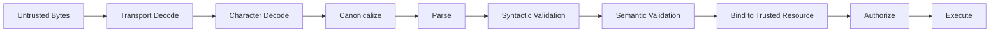
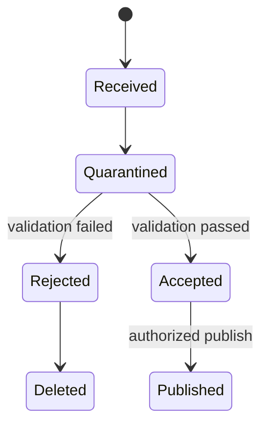
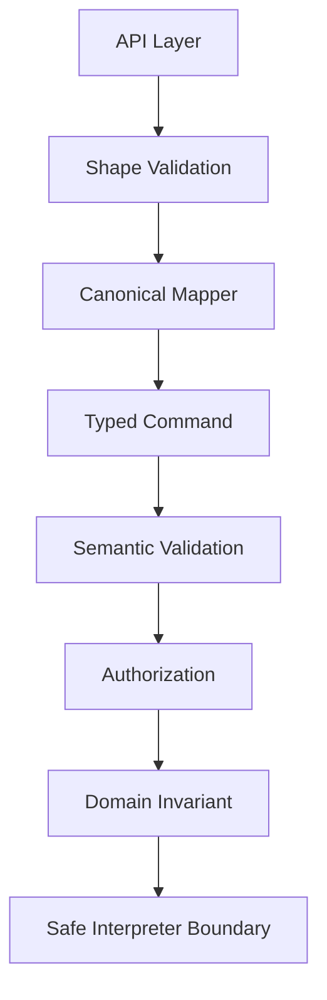

# Part 008 — Input Validation and Canonicalization

> Input validation bukan “regex di DTO”. Input validation adalah proses mengubah data tidak dipercaya menjadi **representasi domain yang canonical, terbatas, terstruktur, dan aman dipakai untuk keputusan berikutnya**.

Part ini membahas salah satu sumber bug security paling fundamental: sistem menerima byte/string dari dunia luar, lalu terlalu cepat memperlakukannya sebagai object, path, URL, ID, expression, query, command, filename, tenant, amount, date, role, atau policy input.

Dalam sistem Java modern, input tidak hanya berasal dari HTTP request. Input bisa berasal dari message broker, file upload, CSV import, batch job, environment variable, config server, database lama, webhook, gRPC metadata, JWT claim, SAML assertion, CLI argument, object storage event, template, atau response dari service lain.

---

## 1. Posisi Part Ini dalam Framework Kaufman

Dalam pendekatan Kaufman, input validation harus dipecah menjadi subskill kecil:

| Subskill | Tujuan Praktis |
|---|---|
| Boundary identification | Menentukan semua tempat data tidak dipercaya masuk ke sistem. |
| Decoding discipline | Memahami kapan data masih bytes, encoded string, escaped string, parsed value, atau domain value. |
| Canonicalization | Mengubah representasi berbeda menjadi bentuk standar sebelum perbandingan/security decision. |
| Syntactic validation | Memastikan bentuk input sesuai grammar/format yang diizinkan. |
| Semantic validation | Memastikan input masuk akal dalam domain dan state sistem. |
| Resource binding | Mengikat input ke resource canonical yang trusted sebelum authorization. |
| Injection defense | Memastikan input tidak ditafsirkan sebagai command/query/path/template/expression. |
| Failure design | Menolak input secara aman, konsisten, dan tidak membocorkan detail sensitif. |

Target part ini: kamu mampu mendesain pipeline input yang mencegah bug seperti IDOR karena resource ID non-canonical, path traversal, SSRF, Unicode spoofing, parser abuse, mass assignment, ReDoS, dan injection surface yang muncul dari input “valid” tetapi salah konteks.

---

## 2. Mental Model: Input Bukan Langsung Data Domain

Ketika sistem menerima input, input itu belum menjadi domain value.



Setiap tahap punya failure mode.

| Tahap | Contoh Failure |
|---|---|
| Transport decode | double encoding, mixed escaping, invalid percent encoding. |
| Character decode | salah charset, invalid UTF-8, replacement character tidak disadari. |
| Canonicalize | string visually sama tapi code point berbeda. |
| Parse | parser menerima format longgar yang tidak diinginkan. |
| Syntactic validation | regex terlalu longgar atau rentan ReDoS. |
| Semantic validation | amount negatif lolos, date di luar state domain lolos. |
| Bind resource | ID dari client dipercaya tanpa resolve ke tenant/resource trusted. |
| Authorize | policy memakai input mentah, bukan resource canonical. |
| Execute | input menjadi query/path/command/template. |

Input validation yang baik bukan satu fungsi. Ia adalah **pipeline**.

---

## 3. Prinsip Dasar

### 3.1 Treat All External Data as Untrusted

Untrusted bukan berarti malicious. Untrusted berarti sistem belum punya alasan untuk mempercayainya.

Untrusted sources:

- request body;
- query parameter;
- path variable;
- header;
- cookie;
- JWT/SAML claim sebelum diverifikasi;
- message payload;
- event metadata;
- uploaded file;
- CSV/Excel import;
- config file;
- environment variable;
- database field dari sistem legacy;
- third-party API response;
- webhook signature payload;
- serialized object;
- CLI argument.

### 3.2 Prefer Allowlist

Allowlist mendefinisikan apa yang boleh. Denylist mencoba menebak semua yang berbahaya.

Contoh allowlist:

```java
private static final Pattern CASE_ID = Pattern.compile("^[A-Z]{2}-[0-9]{8}$");

public static String parseCaseId(String raw) {
    String value = requireSmallText(raw, 32);
    if (!CASE_ID.matcher(value).matches()) {
        throw new InvalidInputException("invalid_case_id");
    }
    return value;
}
```

Denylist buruk:

```java
if (input.contains("../") || input.contains("<script>")) {
    throw new InvalidInputException();
}
```

Denylist gagal karena attacker bisa memakai encoding, Unicode, alternate syntax, parser quirks, dan konteks lain.

### 3.3 Validate for the Target Context

Input yang valid untuk satu konteks belum tentu valid untuk konteks lain.

| Input | Valid Untuk | Tidak Aman Untuk |
|---|---|---|
| `alice@example.com` | email identity | shell command argument tanpa escaping. |
| `2026-06-28` | date | SQL literal concatenation. |
| `CASE-123` | case ID | filesystem path. |
| `https://example.com/a` | display URL | server-side fetch tanpa SSRF guard. |
| `admin` | text label | authorization role dari client. |

Validation harus dekat dengan konteks pemakaian.

---

## 4. Canonicalization

Canonicalization adalah proses mengubah input menjadi bentuk standar sebelum dibandingkan, dicari, divalidasi, atau dipakai untuk security decision.

Contoh masalah:

- `é` bisa satu code point atau kombinasi `e` + accent;
- path `a/b/../c` secara string berbeda tetapi merujuk lokasi yang sama;
- hostname bisa dalam Unicode atau punycode;
- percent encoding bisa menyembunyikan `/`, `.`, atau karakter kontrol;
- case-insensitive identifier bisa punya variasi uppercase/lowercase;
- whitespace bisa normal atau non-breaking;
- fullwidth character bisa mirip ASCII;
- ID dengan leading zero bisa ambigu.

Java menyediakan `java.text.Normalizer` untuk normalisasi Unicode. Dokumentasi Java menjelaskan bahwa normalisasi mengubah teks Unicode ke bentuk composed/decomposed yang ekuivalen sehingga lebih mudah dibandingkan atau diproses.

```java
import java.text.Normalizer;

public final class TextCanonicalizer {
    private TextCanonicalizer() {}

    public static String normalizeNfc(String raw, int maxLength) {
        if (raw == null) {
            throw new InvalidInputException("missing_text");
        }
        if (raw.length() > maxLength) {
            throw new InvalidInputException("text_too_long");
        }
        String normalized = Normalizer.normalize(raw, Normalizer.Form.NFC);
        if (containsControlCharacters(normalized)) {
            throw new InvalidInputException("control_character_not_allowed");
        }
        return normalized;
    }

    private static boolean containsControlCharacters(String value) {
        return value.codePoints().anyMatch(cp ->
                Character.isISOControl(cp) && cp != '\n' && cp != '\t'
        );
    }
}
```

Jangan menganggap normalisasi Unicode menyelesaikan semua spoofing. Ia hanya satu langkah.

---

## 5. Unicode Security Traps

Unicode membuat aplikasi internasional mungkin, tetapi juga membuka ambiguity.

Contoh risiko:

| Risiko | Penjelasan |
|---|---|
| Homoglyph | Karakter terlihat sama tetapi berbeda code point. |
| Mixed script | Identifier menggabungkan Latin, Cyrillic, Greek, dsb. |
| Normalization mismatch | Database, UI, dan service membandingkan bentuk berbeda. |
| Case folding issue | Lowercase/uppercase tidak selalu sederhana lintas locale. |
| Invisible characters | Zero-width joiner/non-joiner, non-breaking space. |
| Bidi control | Arah teks bisa memanipulasi tampilan. |

Untuk identifier security-sensitive seperti username, tenant slug, role name, permission key, case ID, API key prefix, dan policy ID, gunakan charset sempit jika memungkinkan.

```java
private static final Pattern TENANT_SLUG = Pattern.compile("^[a-z0-9][a-z0-9-]{2,62}$");

public static String parseTenantSlug(String raw) {
    String value = raw == null ? "" : raw.trim();
    if (!TENANT_SLUG.matcher(value).matches()) {
        throw new InvalidInputException("invalid_tenant_slug");
    }
    return value;
}
```

Untuk nama manusia atau alamat, jangan pakai ASCII-only. Namun pisahkan:

- display name: boleh Unicode luas, disimpan/ditampilkan dengan encoding aman;
- security identifier: format sempit dan canonical;
- search key: normalized terpisah;
- audit key: stable immutable identifier.

---

## 6. Length Limit Lebih Penting dari yang Terlihat

Banyak vulnerability dimulai dari input terlalu panjang:

- memory exhaustion;
- slow regex/ReDoS;
- log flooding;
- parser overload;
- DB index bloat;
- UI rendering issue;
- header overflow;
- token abuse;
- batch import DoS.

Buat limit per field, bukan hanya global body size.

```java
public static String requireSmallText(String raw, int maxCodePoints) {
    if (raw == null) {
        throw new InvalidInputException("missing_text");
    }
    int count = raw.codePointCount(0, raw.length());
    if (count == 0) {
        throw new InvalidInputException("empty_text");
    }
    if (count > maxCodePoints) {
        throw new InvalidInputException("text_too_long");
    }
    return raw;
}
```

Perhatikan `length()` menghitung UTF-16 code units, bukan code points. Untuk security limit, sering lebih baik membatasi bytes di transport dan code points di domain.

---

## 7. Syntactic vs Semantic Validation

### Syntactic Validation

Memastikan bentuk input benar.

Contoh:

- case ID harus `AA-12345678`;
- date harus ISO-8601;
- amount harus decimal dengan scale maksimal 2;
- enum harus salah satu nilai allowed;
- tenant slug harus lowercase alnum dash.

### Semantic Validation

Memastikan input masuk akal dalam domain/state.

Contoh:

- due date tidak boleh sebelum submission date;
- amount tidak boleh melebihi approval limit;
- transition `approve` hanya valid dari state `UNDER_REVIEW`;
- `assigneeId` harus aktif di tenant yang sama;
- export date range maksimal 31 hari;
- document type harus compatible dengan case type.

Jangan campur semua validation dalam DTO annotation. DTO annotation bagus untuk shape, tetapi domain invariant harus di service/domain layer.

```java
public record CreateCaseCommand(
        String tenantId,
        String title,
        String caseType,
        LocalDate incidentDate
) {}

public final class CreateCaseValidator {
    public void validate(CreateCaseCommand command, TenantPolicy tenantPolicy, Clock clock) {
        if (!tenantPolicy.allowedCaseTypes().contains(command.caseType())) {
            throw new InvalidInputException("case_type_not_allowed_for_tenant");
        }
        if (command.incidentDate().isAfter(LocalDate.now(clock))) {
            throw new InvalidInputException("incident_date_in_future");
        }
    }
}
```

---

## 8. Parse, Do Not Pass Strings Around

Semakin lama input tetap berupa `String`, semakin besar risiko dipakai salah konteks.

Buruk:

```java
public void approveCase(String caseId, String approverId, String date) {
    // banyak layer masih menerima string mentah
}
```

Lebih baik:

```java
public record CaseId(String value) {
    private static final Pattern PATTERN = Pattern.compile("^[A-Z]{2}-[0-9]{8}$");

    public CaseId {
        if (value == null || !PATTERN.matcher(value).matches()) {
            throw new InvalidInputException("invalid_case_id");
        }
    }
}

public record UserId(UUID value) {
    public UserId {
        if (value == null) {
            throw new InvalidInputException("missing_user_id");
        }
    }
}

public record ApproveCaseCommand(CaseId caseId, UserId approverId, LocalDate decisionDate) {}
```

Domain wrapper memberi keuntungan:

- validation terpusat;
- type safety;
- mengurangi parameter tertukar;
- membuat policy lebih eksplisit;
- mengurangi stringly-typed security bugs.

---

## 9. Enum Parsing Harus Strict

Enum dari client sering menjadi sumber bug.

Buruk:

```java
CaseStatus status = CaseStatus.valueOf(raw.toUpperCase());
```

Masalah:

- locale issue;
- error message bisa bocor;
- status internal bisa terekspos;
- enum baru otomatis diterima;
- deprecated value tetap lolos.

Lebih baik pakai explicit map:

```java
public enum CaseSortField {
    UPDATED_AT,
    CREATED_AT,
    PRIORITY
}

public final class CaseSortParser {
    private static final Map<String, CaseSortField> ALLOWED = Map.of(
            "updatedAt", CaseSortField.UPDATED_AT,
            "createdAt", CaseSortField.CREATED_AT,
            "priority", CaseSortField.PRIORITY
    );

    public static CaseSortField parse(String raw) {
        CaseSortField field = ALLOWED.get(raw);
        if (field == null) {
            throw new InvalidInputException("invalid_sort_field");
        }
        return field;
    }
}
```

Ini penting untuk query ordering. Parameter sort yang langsung masuk query adalah injection surface.

---

## 10. Numeric Validation

Jangan parse angka tanpa batas.

Risiko:

- integer overflow;
- negative amount;
- precision loss;
- scientific notation tidak diinginkan;
- NaN/Infinity pada floating point;
- scale monetary tidak dikontrol;
- range domain tidak dicek.

Untuk uang, gunakan `BigDecimal` dengan scale/range explicit.

```java
public record MoneyAmount(BigDecimal value) {
    public MoneyAmount {
        if (value == null) {
            throw new InvalidInputException("missing_amount");
        }
        if (value.scale() > 2) {
            throw new InvalidInputException("amount_scale_too_large");
        }
        if (value.compareTo(BigDecimal.ZERO) < 0) {
            throw new InvalidInputException("amount_negative");
        }
        if (value.compareTo(new BigDecimal("1000000.00")) > 0) {
            throw new InvalidInputException("amount_too_large");
        }
    }
}
```

Hindari `double` untuk uang, risk score yang audited, limit, dan decision security-sensitive.

---

## 11. Date and Time Validation

Date/time input punya failure mode:

- timezone ambiguity;
- local date vs instant tertukar;
- inclusive/exclusive range salah;
- daylight saving issue;
- future/past bound tidak dicek;
- date range terlalu besar untuk export/search;
- parsing lenient.

Gunakan parser strict dan type yang sesuai.

```java
public record DateRange(LocalDate fromInclusive, LocalDate toExclusive) {
    public DateRange {
        if (fromInclusive == null || toExclusive == null) {
            throw new InvalidInputException("missing_date_range");
        }
        if (!fromInclusive.isBefore(toExclusive)) {
            throw new InvalidInputException("invalid_date_range");
        }
        if (ChronoUnit.DAYS.between(fromInclusive, toExclusive) > 31) {
            throw new InvalidInputException("date_range_too_large");
        }
    }
}
```

Untuk audit/event time, biasanya gunakan `Instant`. Untuk jadwal lokal, gunakan `LocalDate`, `LocalTime`, atau `ZonedDateTime` sesuai domain.

---

## 12. Path Traversal Defense

Filesystem path adalah input berbahaya karena string path punya banyak bentuk:

- `../`;
- absolute path;
- symlink;
- Windows drive path;
- UNC path;
- encoded slash;
- null byte legacy issue;
- case-insensitive filesystem;
- normalization mismatch;
- race condition antara check dan open.

Jangan membuat path dengan concat string:

```java
Path file = Path.of(baseDir + "/" + userFileName);
```

Gunakan `Path` dan resolve terhadap base directory.

```java
public final class SafePathResolver {
    private final Path baseDirectory;

    public SafePathResolver(Path baseDirectory) {
        try {
            this.baseDirectory = baseDirectory.toRealPath(LinkOption.NOFOLLOW_LINKS);
        } catch (IOException e) {
            throw new IllegalStateException("invalid_base_directory", e);
        }
    }

    public Path resolveUserFileName(String rawFileName) {
        String fileName = parseSafeFileName(rawFileName);
        Path candidate = baseDirectory.resolve(fileName).normalize();

        if (!candidate.startsWith(baseDirectory)) {
            throw new InvalidInputException("path_escape_attempt");
        }

        return candidate;
    }

    private static String parseSafeFileName(String raw) {
        String value = TextCanonicalizer.normalizeNfc(raw, 128);
        if (!value.matches("^[A-Za-z0-9._-]{1,128}$")) {
            throw new InvalidInputException("invalid_file_name");
        }
        if (value.equals(".") || value.equals("..")) {
            throw new InvalidInputException("invalid_file_name");
        }
        return value;
    }
}
```

Untuk operasi file sensitif, pertimbangkan:

- simpan file dengan generated internal ID, bukan filename user;
- pisahkan display filename dari storage key;
- jangan ikuti symlink jika tidak perlu;
- cek permission OS;
- gunakan directory khusus per tenant;
- jangan pernah menerima absolute path dari user;
- validasi extension bukan satu-satunya kontrol;
- content-type dari client tidak trusted.

---

## 13. URL Validation dan SSRF

URL input sering terlihat harmless, tetapi bisa menjadi SSRF jika server melakukan fetch.

Contoh risiko:

```text
POST /import-from-url
{"url":"http://169.254.169.254/latest/meta-data/"}
```

Aturan umum:

- parse URL dengan `URI`, bukan regex saja;
- allowlist scheme;
- allowlist host/domain jika mungkin;
- block private/internal IP ranges;
- resolve DNS dengan hati-hati;
- tangani redirect;
- set timeout dan size limit;
- jangan kirim credential internal ke URL user;
- jangan izinkan gopher/file/jar/ftp jika tidak perlu;
- audit outbound fetch.

Contoh parser dasar:

```java
public record ExternalHttpsUrl(URI value) {
    private static final Set<String> ALLOWED_HOSTS = Set.of(
            "partner.example.com",
            "api.partner.example.com"
    );

    public ExternalHttpsUrl {
        if (value == null) {
            throw new InvalidInputException("missing_url");
        }
        if (!"https".equalsIgnoreCase(value.getScheme())) {
            throw new InvalidInputException("invalid_url_scheme");
        }
        String host = value.getHost();
        if (host == null || !ALLOWED_HOSTS.contains(host.toLowerCase(Locale.ROOT))) {
            throw new InvalidInputException("host_not_allowed");
        }
        if (value.getUserInfo() != null) {
            throw new InvalidInputException("url_userinfo_not_allowed");
        }
    }

    public static ExternalHttpsUrl parse(String raw) {
        try {
            return new ExternalHttpsUrl(URI.create(raw));
        } catch (IllegalArgumentException e) {
            throw new InvalidInputException("invalid_url", e);
        }
    }
}
```

Untuk SSRF defense produksi, host allowlist saja bisa belum cukup jika DNS rebinding atau redirect tidak dikontrol. HTTP client layer harus enforce policy pada setiap redirect dan resolved destination.

---

## 14. Header, Cookie, and Metadata Validation

Header sering dipercaya berlebihan.

Contoh header berbahaya jika diterima mentah:

- `X-Forwarded-For`;
- `X-Forwarded-Host`;
- `Host`;
- `Origin`;
- `Referer`;
- `Content-Type`;
- `X-Tenant-Id`;
- `X-User-Role`;
- correlation ID;
- idempotency key.

Prinsip:

1. Hanya percaya forwarded headers dari trusted proxy.
2. Jangan percaya tenant/user/role dari header client biasa.
3. Correlation ID harus dibatasi length/charset sebelum masuk log.
4. Idempotency key harus scoped ke subject/tenant/action.
5. Content-Type harus diverifikasi, tetapi bukan jaminan isi valid.

```java
private static final Pattern CORRELATION_ID = Pattern.compile("^[A-Za-z0-9._:-]{1,100}$");

public static String parseCorrelationId(String raw) {
    if (raw == null || raw.isBlank()) {
        return UUID.randomUUID().toString();
    }
    if (!CORRELATION_ID.matcher(raw).matches()) {
        return UUID.randomUUID().toString();
    }
    return raw;
}
```

Jangan log correlation ID mentah jika charset tidak dibatasi. Log injection bukan hanya teori.

---

## 15. JSON Validation

JSON parser mengubah bytes menjadi object graph. Risiko:

- unknown fields diterima diam-diam;
- duplicate keys;
- deeply nested JSON;
- huge array;
- huge string;
- polymorphic deserialization;
- mass assignment;
- number precision ambiguity;
- date parsing longgar.

Prinsip:

- DTO request harus sempit;
- reject unknown field untuk endpoint sensitif;
- batasi request body size;
- batasi nesting/array size jika parser mendukung;
- jangan deserialize langsung ke entity persistence;
- jangan aktifkan polymorphic typing untuk input tidak dipercaya;
- mapping ke command domain harus explicit.

Buruk:

```java
public void updateUser(@RequestBody UserEntity entity) {
    repository.save(entity);
}
```

Masalah: client bisa mengirim field seperti `role`, `enabled`, `tenantId`, `passwordHash`, atau `verified`.

Lebih baik:

```java
public record UpdateProfileRequest(
        String displayName,
        String phoneNumber
) {}

public record UpdateProfileCommand(
        UserId userId,
        String displayName,
        Optional<String> phoneNumber
) {}
```

Mapping explicit:

```java
public UpdateProfileCommand toCommand(UserId currentUser, UpdateProfileRequest request) {
    return new UpdateProfileCommand(
            currentUser,
            TextCanonicalizer.normalizeNfc(request.displayName(), 100),
            Optional.ofNullable(request.phoneNumber())
                    .map(value -> TextCanonicalizer.normalizeNfc(value, 32))
    );
}
```

---

## 16. XML Validation

XML punya risiko khusus:

- XXE;
- entity expansion;
- external DTD;
- schema poisoning;
- XPath injection;
- huge tree memory usage.

Jika harus parse XML, aktifkan secure processing dan matikan external entity sesuai parser yang dipakai.

Contoh prinsip JAXP:

```java
DocumentBuilderFactory factory = DocumentBuilderFactory.newInstance();
factory.setFeature(XMLConstants.FEATURE_SECURE_PROCESSING, true);
factory.setExpandEntityReferences(false);
factory.setXIncludeAware(false);
factory.setNamespaceAware(true);
```

Konfigurasi detail tergantung parser dan versi. Security review harus memastikan external entity, external schema, dan external DTD tidak bisa diakses jika tidak dibutuhkan.

---

## 17. Regex and ReDoS

Regex bisa menjadi denial-of-service jika pattern punya backtracking eksplosif.

Contoh buruk:

```java
Pattern.compile("^(a+)+$");
```

Input seperti banyak `a` diikuti `!` bisa sangat lambat.

Prinsip:

- batasi length sebelum regex;
- hindari nested quantifier;
- hindari pattern ambigu;
- precompile pattern;
- gunakan parser khusus untuk format kompleks;
- pertimbangkan regex engine linear-time seperti RE2/J untuk input tidak dipercaya;
- test input adversarial.

Contoh aman-ish:

```java
private static final Pattern SAFE_CODE = Pattern.compile("^[A-Z0-9_-]{1,32}$");

public static String parseCode(String raw) {
    String value = requireSmallText(raw, 32);
    if (!SAFE_CODE.matcher(value).matches()) {
        throw new InvalidInputException("invalid_code");
    }
    return value;
}
```

Catatan: Java regex tidak menyediakan timeout native per match di API standar. Maka desain pattern dan length limit menjadi kontrol utama.

---

## 18. Injection Surfaces

Input menjadi berbahaya saat dikirim ke interpreter lain.

| Surface | Interpreter | Defense Utama |
|---|---|---|
| SQL | database engine | parameterized query, allowlist identifier. |
| LDAP | LDAP server | safe encoder/filter builder. |
| OS command | shell/process | hindari shell, argument list explicit. |
| Path | filesystem | canonical path under base dir. |
| URL fetch | network stack | SSRF allowlist and egress control. |
| HTML | browser | context-specific output encoding. |
| JSON | JS/client parser | safe serialization. |
| Log | log viewer/SIEM | control characters restriction/escaping. |
| Template | template engine | no user-controlled template/expression. |
| Regex | regex engine | safe pattern and length. |
| XPath | XML engine | parameterized XPath or strict escaping. |

Input validation bukan pengganti output encoding atau parameterization. Ia mengurangi domain input, tetapi interpreter-specific defense tetap wajib.

---

## 19. OS Command Input

Jangan gabungkan string untuk command.

Buruk:

```java
Runtime.getRuntime().exec("convert " + fileName + " output.pdf");
```

Lebih baik hindari shell dan gunakan argumen eksplisit:

```java
ProcessBuilder builder = new ProcessBuilder(
        "convert",
        safeInputPath.toString(),
        safeOutputPath.toString()
);
builder.redirectErrorStream(true);
Process process = builder.start();
```

Tetap perlu:

- path sudah resolved aman;
- command binary allowlisted;
- timeout;
- output size limit;
- working directory aman;
- environment minimal;
- user OS non-privileged;
- audit untuk action berisiko.

---

## 20. File Upload Validation

File upload adalah input kompleks: metadata + bytes + parser downstream.

Kontrol:

1. batasi size;
2. batasi jumlah file;
3. jangan percaya filename;
4. generate storage key internal;
5. sniff content jika perlu;
6. scan malware jika konteks membutuhkan;
7. simpan di lokasi non-executable;
8. jangan serve dengan content type berbahaya;
9. strip metadata jika perlu;
10. parse async/sandbox jika parser risk tinggi;
11. audit uploader, tenant, checksum, storage key;
12. gunakan quarantine state sebelum trusted.

Model lifecycle:



Jangan langsung menganggap uploaded file sebagai document domain yang aman.

---

## 21. Message and Event Validation

Message broker sering dianggap trusted internal. Itu keliru.

Event tetap harus divalidasi karena:

- producer bisa bug;
- schema bisa berubah;
- topic bisa salah konfigurasi;
- replay bisa terjadi;
- poison message bisa mematikan consumer;
- message bisa berasal dari integration partner;
- internal compromise mungkin terjadi.

Consumer harus melakukan:

- schema validation;
- version check;
- tenant validation;
- idempotency key validation;
- timestamp freshness jika relevan;
- signature verification jika cross-boundary;
- size limit;
- dead-letter handling;
- authorization/effective actor check jika event memicu command.

```java
public record CaseAssignedEvent(
        String eventId,
        String tenantId,
        String caseId,
        String assigneeId,
        Instant occurredAt,
        String schemaVersion
) {}
```

Jangan izinkan event langsung mengubah state tanpa validasi semantic.

---

## 22. Canonical Resource Binding Before Authorization

Part sebelumnya membahas authorization. Authorization hanya benar jika resource yang dipakai decision adalah resource canonical.

Buruk:

```java
authorizer.canRead(user, request.getParameter("caseId"));
```

Lebih baik:

```java
CaseId caseId = CaseId.parse(rawCaseId);
CaseDescriptor descriptor = caseRepository.findDescriptor(caseId)
        .orElseThrow(NotFoundException::new);

authorizer.decide(new AuthorizationRequest(
        SubjectRef.from(user),
        ActionRef.of("case.read"),
        ResourceRef.from(descriptor),
        EnvironmentContext.from(request)
));
```

Kenapa?

- parser memastikan format ID canonical;
- repository memastikan resource memang ada;
- descriptor membawa tenant/classification/state;
- policy tidak bergantung pada input mentah;
- audit memakai resource id canonical.

---

## 23. Error Handling

Validation error harus aman dan berguna.

Jangan:

```json
{
  "error": "Invalid SQL value near: ' OR 1=1 --"
}
```

Lebih baik:

```json
{
  "errorCode": "invalid_request",
  "violations": [
    {
      "field": "caseId",
      "code": "invalid_case_id"
    }
  ],
  "correlationId": "01J..."
}
```

Prinsip:

- jangan echo input berbahaya tanpa encoding;
- jangan bocorkan parser stack trace;
- gunakan stable error code;
- log detail internal secara aman;
- response untuk auth/resource tertentu kadang perlu menyamarkan not found vs forbidden sesuai threat model;
- jangan membuat validation oracle yang membantu brute force identifier sensitif.

---

## 24. Centralized Input Primitives

Buat library kecil internal untuk primitive umum:

- `CaseId`;
- `TenantId`;
- `UserId`;
- `SafeFileName`;
- `ExternalHttpsUrl`;
- `DateRange`;
- `SortField`;
- `PageRequest`;
- `CorrelationId`;
- `IdempotencyKey`;
- `MoneyAmount`.

Contoh:

```java
public record PageLimit(int value) {
    public PageLimit {
        if (value < 1 || value > 100) {
            throw new InvalidInputException("invalid_page_limit");
        }
    }
}

public record PageCursor(String value) {
    private static final Pattern CURSOR = Pattern.compile("^[A-Za-z0-9_-]{1,512}$");

    public PageCursor {
        if (value == null || !CURSOR.matcher(value).matches()) {
            throw new InvalidInputException("invalid_page_cursor");
        }
    }
}
```

Ini mengurangi duplikasi validation di controller.

---

## 25. Validation Placement

| Layer | Tanggung Jawab |
|---|---|
| Transport/API | body size, content type, basic parse, DTO shape. |
| Request mapper | canonicalize string, parse domain primitive. |
| Application service | semantic validation terhadap current state. |
| Domain model | invariant domain yang tidak boleh dilanggar. |
| Repository/integration | parameterization, safe query/path/protocol usage. |
| Authorization layer | resource/action/context decision setelah canonical binding. |

Jangan taruh semua validation di satu tempat. Taruh validation sesuai jenisnya.



---

## 26. Validation and Logging

Input invalid sering perlu dilog untuk deteksi serangan, tetapi logging input mentah berbahaya.

Aturan:

- log error code, endpoint, field name, actor, tenant, correlation id;
- jangan log full token/password/secret;
- jangan log file content;
- truncate input jika perlu;
- escape control characters;
- jangan membuat log forging lewat newline;
- agregasi metrics untuk invalid input spike.

Contoh safe logging:

```java
logger.warn("invalid input: field={}, code={}, subject={}, correlationId={}",
        "caseId",
        "invalid_case_id",
        subjectId,
        correlationId);
```

Hindari:

```java
logger.warn("invalid case id: " + rawCaseId);
```

---

## 27. Testing Input Validation

Input validation harus diuji dengan positive, negative, boundary, dan adversarial cases.

| Jenis Test | Contoh |
|---|---|
| Positive | `AB-12345678` valid. |
| Negative | `../secret`, empty, null, too long. |
| Boundary | max length, min length, max amount, max date range. |
| Encoding | `%2e%2e%2f`, mixed Unicode, non-breaking space. |
| Parser | duplicate JSON key, unknown field, huge array. |
| Semantic | inactive assignee, cross-tenant resource. |
| Injection | SQL-like payload, shell metacharacters, log newline. |
| ReDoS | long adversarial regex input. |

Example JUnit:

```java
class CaseIdTest {
    @ParameterizedTest
    @ValueSource(strings = {"AB-12345678", "ZX-00000001"})
    void acceptsValidCaseId(String raw) {
        assertDoesNotThrow(() -> new CaseId(raw));
    }

    @ParameterizedTest
    @ValueSource(strings = {"", "ab-12345678", "AB-123", "../secret", "AB-123456789"})
    void rejectsInvalidCaseId(String raw) {
        assertThrows(InvalidInputException.class, () -> new CaseId(raw));
    }
}
```

---

## 28. Common Anti-Patterns

### 28.1 Validation Only in Frontend

Frontend validation membantu UX, bukan security.

### 28.2 Regex Everything

Regex bukan parser universal. Pakai parser khusus untuk URI, date, JSON, XML, email, dan domain grammar kompleks.

### 28.3 Validate After Use

Jika input dipakai untuk query/path/command sebelum validasi, validation terlambat.

### 28.4 Decode Multiple Times

Double-decoding bisa mengubah input aman menjadi berbahaya setelah check.

### 28.5 Trust Internal Messages

Internal bukan berarti trusted. Bug producer bisa menjadi exploit consumer.

### 28.6 Entity Binding Directly From Request

Mass assignment terjadi saat request langsung masuk entity persistence.

### 28.7 Unknown Fields Accepted Silently

Untuk endpoint sensitif, unknown field bisa menyembunyikan bug atau probing.

### 28.8 Client-Supplied Security Context

Tenant, role, permission, user ID, assurance level dari client tidak boleh dipercaya tanpa verifikasi.

### 28.9 Filename as Storage Key

User filename bisa collision, traversal, spoofing, atau leak.

### 28.10 No Length Limit

Tanpa length limit, parser dan regex menjadi attack surface DoS.

---

## 29. Review Checklist

### Boundary

- Apakah semua source input sudah diidentifikasi?
- Apakah internal event/config/webhook ikut dianggap untrusted?
- Apakah body size dan field length dibatasi?

### Canonicalization

- Apakah input dinormalisasi sebelum comparison/security decision?
- Apakah Unicode ambiguity relevan untuk field ini?
- Apakah path/URL canonicalization dilakukan dengan API yang benar?

### Validation

- Apakah allowlist dipakai untuk identifier/security-sensitive field?
- Apakah enum parsing explicit?
- Apakah numeric/date range divalidasi?
- Apakah semantic validation dilakukan terhadap state trusted?

### Binding

- Apakah resource ID diparse menjadi domain type?
- Apakah resource descriptor di-resolve sebelum authorization?
- Apakah tenant/resource context berasal dari storage trusted, bukan client?

### Interpreter Boundary

- Apakah SQL/LDAP/command/path/template memakai mekanisme aman?
- Apakah sort/filter identifier allowlisted?
- Apakah URL fetch punya SSRF guard?

### Error and Logging

- Apakah error code stabil?
- Apakah input mentah tidak diecho/log sembarangan?
- Apakah invalid input spike bisa dideteksi?

### Testing

- Apakah ada negative/adversarial tests?
- Apakah boundary length dites?
- Apakah Unicode/path/encoding cases dites?
- Apakah parser-specific edge cases dites?

---

## 30. Latihan 20 Jam: Input Validation

| Jam | Latihan | Output |
|---:|---|---|
| 1–2 | Daftar semua input boundary di satu service. | Input boundary map. |
| 3–4 | Klasifikasi field: ID, text, enum, date, amount, URL, file, metadata. | Field risk matrix. |
| 5–6 | Buat domain primitive untuk 5 field paling penting. | Typed input primitives. |
| 7–8 | Tambahkan canonicalization Unicode/path sederhana. | Canonical parser. |
| 9–10 | Tambahkan semantic validation untuk satu command. | Command validator. |
| 11–12 | Perbaiki mass assignment request mapping. | Explicit DTO-command mapper. |
| 13–14 | Tambahkan URL/SSRF validation untuk satu feature. | URL allowlist guard. |
| 15–16 | Tambahkan test adversarial encoding/path. | Negative test suite. |
| 17–18 | Tambahkan logging safe invalid input. | Validation telemetry. |
| 19–20 | Review satu endpoint end-to-end dari input sampai authorization. | Secure boundary review. |

---

## 31. Rangkuman

Input validation yang matang bukan sekadar anotasi atau regex. Ia adalah pipeline yang memastikan input berubah dari untrusted bytes menjadi domain value yang canonical dan aman.

Mental model utama:

1. Semua input eksternal tidak trusted.
2. Input internal juga bisa tidak trusted jika melewati boundary.
3. Canonicalization harus terjadi sebelum comparison/security decision.
4. Allowlist lebih kuat daripada denylist.
5. Syntactic validation dan semantic validation berbeda.
6. String harus segera diparse menjadi domain primitive.
7. Resource ID harus di-bind ke descriptor trusted sebelum authorization.
8. Path, URL, regex, JSON, XML, dan command adalah interpreter boundary.
9. Length limit adalah kontrol security.
10. Error/logging validation harus aman.

Part berikutnya membahas output encoding dan data exposure. Setelah input aman masuk, kita harus memastikan data yang keluar tidak bocor lewat response, log, error, cache, export, metric, atau UI context yang salah.

---

## References

- OWASP Cheat Sheet Series — Input Validation Cheat Sheet
- OWASP Cheat Sheet Series — Authorization Cheat Sheet
- Oracle Java API Documentation — `java.text.Normalizer`
- Oracle Secure Coding Guidelines for Java SE
- OWASP Application Security Verification Standard 5.0
- Unicode Standard Annex #15 — Unicode Normalization Forms
