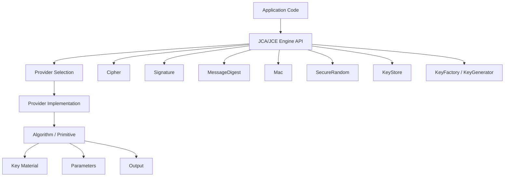
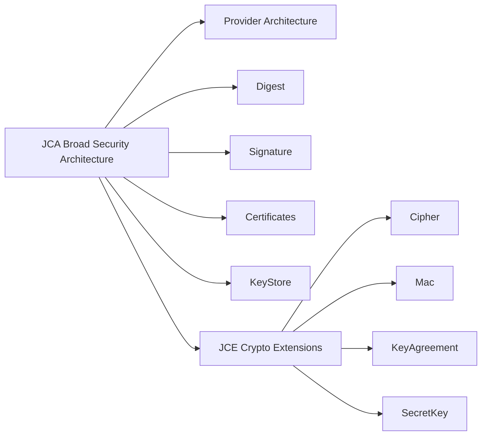
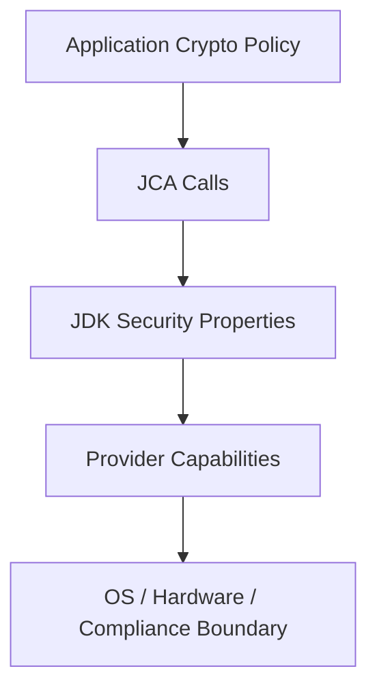
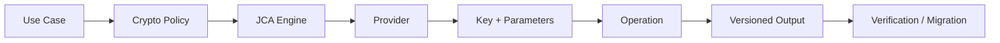

# Part 010 — Java Cryptography Architecture

> JCA bukan sekadar kumpulan class crypto. JCA adalah abstraction layer yang memisahkan **application code**, **cryptographic service**, **algorithm implementation**, **provider**, **key material**, dan **security policy**.

Part ini adalah fondasi sebelum kita membahas randomness, hashing, MAC, KDF, encryption, signature, certificate, TLS, keystore, KMS, dan HSM.

Kesalahan terbesar engineer saat memakai JCA adalah memperlakukan API crypto seperti utility biasa. Crypto bukan utility biasa. Crypto punya invariant matematis, operational constraint, provider behavior, key lifecycle, algorithm deprecation, dan failure mode yang tidak terlihat dari compiler.

---

## 1. Posisi Part Ini dalam Framework Kaufman

Dalam Kaufman-style learning, JCA perlu dipecah menjadi subskill kecil:

| Subskill | Tujuan Praktis |
|---|---|
| Provider mental model | Memahami bahwa implementasi crypto datang dari provider, bukan langsung dari class API. |
| Engine class vocabulary | Mengenali `Cipher`, `Signature`, `MessageDigest`, `Mac`, `SecureRandom`, `KeyStore`, dan factory classes. |
| Algorithm naming | Menghindari ambiguity pada nama algorithm/transformation. |
| Key representation | Membedakan public key, private key, secret key, key spec, encoded key, dan keystore entry. |
| Operation lifecycle | Memahami init → update → final, one-shot vs streaming, stateful object. |
| Provider selection | Menentukan kapan default provider cukup dan kapan perlu provider eksplisit/FIPS/HSM. |
| Misuse detection | Mengenali API call yang compile tetapi tidak aman. |
| Crypto boundary design | Membungkus JCA di service/domain-specific API agar developer tidak bebas memilih primitive sembarangan. |

Target part ini: kamu mampu membaca kode Java crypto dan menjawab:

1. Primitive apa yang dipakai?
2. Provider mana yang mengeksekusi?
3. Key material berasal dari mana?
4. Parameter keamanan apa yang eksplisit?
5. Apakah algorithm/transformation ambiguous?
6. Apa invariant yang harus dijaga?
7. Apa failure mode jika provider/config berubah?

---

## 2. Mental Model JCA

JCA menyediakan API standar. Provider menyediakan implementasi.



Aplikasi memanggil:

```java
Cipher cipher = Cipher.getInstance("AES/GCM/NoPadding");
```

Tetapi implementasinya dipilih dari provider yang tersedia dan urutan provider di runtime. Ini berarti crypto behavior bukan hanya source code; ia juga dipengaruhi runtime, provider list, security properties, JDK version, optional provider, dan environment.

---

## 3. Apa Itu Provider?

Provider adalah package implementasi cryptographic service.

Contoh service:

- `Cipher.AES/GCM/NoPadding`
- `MessageDigest.SHA-256`
- `Mac.HmacSHA256`
- `Signature.SHA256withRSA`
- `KeyPairGenerator.RSA`
- `CertificateFactory.X.509`
- `KeyStore.PKCS12`
- `SecureRandom.DRBG`

Kamu bisa melihat provider runtime:

```java
import java.security.Provider;
import java.security.Security;

public class ProviderPrinter {
    public static void main(String[] args) {
        for (Provider provider : Security.getProviders()) {
            System.out.printf("%s %s%n", provider.getName(), provider.getVersionStr());
        }
    }
}
```

Untuk melihat service tertentu:

```java
for (Provider provider : Security.getProviders()) {
    for (Provider.Service service : provider.getServices()) {
        if (service.getType().equals("Cipher")) {
            System.out.printf("%s -> %s%n", provider.getName(), service.getAlgorithm());
        }
    }
}
```

Ini penting di produksi karena dua environment dengan source code sama bisa punya provider behavior berbeda jika konfigurasi provider berbeda.

---

## 4. Engine Classes: Vocabulary Inti

JCA memakai konsep engine class: class API generik untuk jenis operasi crypto tertentu.

| Engine Class | Fungsi | Contoh |
|---|---|---|
| `SecureRandom` | Secure randomness | nonce, token, salt, key generation input |
| `MessageDigest` | Hash | SHA-256 digest |
| `Mac` | Message authentication code | HMAC-SHA256 |
| `Cipher` | Encryption/decryption/wrap/unwrap | AES-GCM |
| `Signature` | Digital signature | Ed25519, SHA256withRSA |
| `KeyPairGenerator` | Generate asymmetric key pair | RSA, EC, EdDSA |
| `KeyGenerator` | Generate symmetric key | AES |
| `KeyFactory` | Convert key spec ↔ key object | X.509 public key, PKCS#8 private key |
| `SecretKeyFactory` | Generate secret from key spec | PBKDF2 |
| `KeyAgreement` | Shared secret derivation | ECDH |
| `KeyStore` | Store/load keys/certs | PKCS12 |
| `CertificateFactory` | Parse certificates | X.509 |
| `CertPathValidator` | Certificate path validation | PKIX |
| `KEM` | Key encapsulation mechanism | post-quantum/hybrid readiness area |

Setiap engine punya lifecycle dan invariant sendiri. Jangan menyamakan `MessageDigest`, `Mac`, dan `Signature` hanya karena semuanya menghasilkan bytes.

---

## 5. JCA vs JCE

Secara historis, JCA mencakup security API umum seperti digest, signature, certificate, key, provider. JCE menambahkan encryption, key agreement, MAC, dan secret-key operations. Dalam praktik modern, engineer sering menyebut semuanya sebagai “JCA/JCE”.

Mental model praktis:



Yang penting bukan istilah historisnya. Yang penting adalah kamu memahami API engine dan provider behavior.

---

## 6. Algorithm Name vs Transformation

Untuk `Cipher`, string yang diberikan biasanya disebut transformation.

Format umum:

```text
algorithm/mode/padding
```

Contoh:

```java
Cipher.getInstance("AES/GCM/NoPadding");
```

Buruk:

```java
Cipher.getInstance("AES");
```

Kenapa buruk? Karena mode/padding bisa default ke sesuatu yang tidak kamu maksud, dan dalam banyak konteks historis `AES` berarti mode yang tidak aman seperti ECB.

Aturan:

> Untuk `Cipher`, selalu tulis transformation lengkap.

Contoh lebih eksplisit:

```java
private static final String TRANSFORMATION = "AES/GCM/NoPadding";

Cipher cipher = Cipher.getInstance(TRANSFORMATION);
```

Untuk `MessageDigest`:

```java
MessageDigest digest = MessageDigest.getInstance("SHA-256");
```

Untuk `Mac`:

```java
Mac mac = Mac.getInstance("HmacSHA256");
```

Untuk `Signature`:

```java
Signature signature = Signature.getInstance("Ed25519");
```

atau:

```java
Signature signature = Signature.getInstance("SHA256withRSA");
```

Nama algorithm bukan detail kosmetik. Ia adalah bagian dari security contract.

---

## 7. Crypto API Bisa Compile Tapi Salah

Contoh kode yang compile tetapi tidak aman:

```java
MessageDigest sha256 = MessageDigest.getInstance("SHA-256");
byte[] passwordHash = sha256.digest(password.getBytes(StandardCharsets.UTF_8));
```

Masalah: SHA-256 cepat, tidak cocok untuk password storage. Password storage membutuhkan adaptive password hashing/KDF dengan salt dan cost parameter.

Contoh lain:

```java
Cipher cipher = Cipher.getInstance("AES/ECB/PKCS5Padding");
```

Masalah: ECB tidak menyembunyikan pola plaintext.

Contoh lain:

```java
byte[] iv = new byte[12];
Cipher cipher = Cipher.getInstance("AES/GCM/NoPadding");
cipher.init(Cipher.ENCRYPT_MODE, key, new GCMParameterSpec(128, iv));
```

Masalah: IV/nonce konstan untuk GCM fatal.

JCA tidak bisa mencegah semua misuse karena API dibuat generik dan backward-compatible.

---

## 8. Key Material: Object Bukan Berarti Aman

JCA membedakan beberapa bentuk key.

| Bentuk | Contoh | Makna |
|---|---|---|
| `SecretKey` | AES key, HMAC key | Symmetric secret key object |
| `PublicKey` | RSA/EC/EdDSA public key | Public component |
| `PrivateKey` | RSA/EC/EdDSA private key | Private component |
| `KeySpec` | `PKCS8EncodedKeySpec`, `X509EncodedKeySpec` | Format material untuk factory |
| Encoded bytes | DER/PEM/Base64 | Serialized key material |
| `KeyStore.Entry` | private key entry, secret key entry | Key stored with metadata/protection |

Key object di Java tidak otomatis berarti key aman dari memory dump, logging, serialization, reflection, heap inspection, atau accidental exposure.

Aturan praktis:

- jangan log key;
- jangan serialize key ke JSON;
- jangan simpan key di `String`;
- jangan hardcode key di source;
- jangan simpan key di config biasa;
- gunakan KMS/HSM/keystore untuk lifecycle;
- minimalkan waktu key material berada dalam byte array;
- pahami bahwa JVM memory tidak memberi zeroization guarantee sempurna untuk semua object.

Key management akan dibahas mendalam di Part 018. Di sini cukup pahami bahwa JCA key object adalah handle/representasi, bukan boundary ajaib.

---

## 9. Operation Lifecycle: Init, Update, Final

Banyak engine JCA bersifat stateful.

Contoh `Mac`:

```java
Mac mac = Mac.getInstance("HmacSHA256");
mac.init(secretKey);
mac.update(headerBytes);
mac.update(payloadBytes);
byte[] tag = mac.doFinal();
```

Contoh `Signature`:

```java
Signature signer = Signature.getInstance("Ed25519");
signer.initSign(privateKey);
signer.update(messageBytes);
byte[] signature = signer.sign();
```

Contoh verify:

```java
Signature verifier = Signature.getInstance("Ed25519");
verifier.initVerify(publicKey);
verifier.update(messageBytes);
boolean valid = verifier.verify(signatureBytes);
```

Kaidah:

- jangan reuse object stateful lintas thread tanpa memahami kontraknya;
- jangan lupa `init` dengan mode/key/parameter yang benar;
- jangan campur data dari dua message ke satu operation;
- jangan treat partial output sebagai final output;
- jangan abaikan return `verify`;
- jangan catch exception lalu melanjutkan seolah operasi berhasil.

---

## 10. Provider Selection

Default provider sering cukup untuk aplikasi umum. Tetapi ada kasus provider selection harus eksplisit:

- FIPS boundary;
- HSM integration;
- algorithm tidak tersedia di provider default;
- compatibility requirement;
- compliance requirement;
- hardware-backed key;
- post-quantum/hybrid algorithm experimentation;
- deterministic test dengan provider tertentu.

Contoh provider eksplisit:

```java
Cipher cipher = Cipher.getInstance("AES/GCM/NoPadding", "SunJCE");
```

Namun provider eksplisit juga punya risiko:

- nama provider tidak tersedia di semua environment;
- upgrade provider bisa mengubah behavior;
- fallback manual bisa salah;
- provider third-party menambah supply-chain risk;
- compliance boundary bisa rusak jika provider salah dipakai.

Lebih baik buat abstraction:

```java
public interface CryptoProviderPolicy {
    Cipher newAeadCipher() throws GeneralSecurityException;
    Mac newMessageMac() throws GeneralSecurityException;
    Signature newSigner() throws GeneralSecurityException;
}
```

Lalu implementasi production/test/FIPS bisa dikontrol terpusat.

---

## 11. Security Properties dan Algorithm Constraints

Java runtime memiliki security properties yang memengaruhi crypto behavior, misalnya disabled algorithms untuk TLS/certpath/JAR verification. Ini akan dibahas lebih dalam di TLS/certificate/artifact-signing parts, tetapi kamu perlu tahu sejak awal: crypto policy tidak hanya ada di kode.

Ada minimal tiga layer:



Jika aplikasi memakai algorithm yang sudah dilarang oleh runtime policy, operasi bisa gagal. Itu bagus. Tetapi jika aplikasi punya fallback lemah, ia bisa menurunkan security.

Anti-pattern:

```java
try {
    return Signature.getInstance("SHA256withRSA");
} catch (GeneralSecurityException e) {
    return Signature.getInstance("SHA1withRSA");
}
```

Fallback crypto harus diperlakukan sebagai security decision, bukan convenience.

---

## 12. Jangan Bangun “Crypto Helper” yang Terlalu Generik

Anti-pattern populer:

```java
public final class CryptoUtils {
    public static byte[] encrypt(String algorithm, byte[] key, byte[] data) { ... }
    public static byte[] decrypt(String algorithm, byte[] key, byte[] data) { ... }
    public static byte[] hash(String algorithm, byte[] data) { ... }
}
```

Masalah:

- caller bebas memilih algorithm;
- parameter security tidak dipaksa;
- IV/nonce/tag handling rawan salah;
- tidak ada domain invariant;
- sulit audit;
- sulit migrasi;
- cenderung menjadi dumping ground.

Lebih baik buat service berdasarkan use case:

```java
public interface TokenProtector {
    ProtectedToken protect(PlainToken token, AssociatedData associatedData);
    PlainToken unprotect(ProtectedToken protectedToken, AssociatedData associatedData);
}

public interface PayloadSigner {
    SignedPayload sign(CanonicalPayload payload);
    boolean verify(SignedPayload signedPayload);
}

public interface PasswordHasher {
    PasswordHash hash(PlainPassword password);
    PasswordVerification verify(PlainPassword password, PasswordHash storedHash);
}
```

Use-case API memaksa invariant domain.

---

## 13. Algorithm Agility Tanpa Algorithm Chaos

Algorithm agility berarti sistem bisa bermigrasi saat algorithm usang, bukan membiarkan caller memilih algorithm random.

Pattern:

```java
public enum CryptoScheme {
    TOKEN_AEAD_V1("AES-GCM", 1),
    TOKEN_AEAD_V2("AES-GCM", 2);

    private final String family;
    private final int version;

    CryptoScheme(String family, int version) {
        this.family = family;
        this.version = version;
    }
}
```

Envelope:

```java
public record ProtectedPayload(
        String scheme,
        String keyId,
        byte[] nonce,
        byte[] ciphertext,
        byte[] tag
) {}
```

Dengan scheme version, sistem bisa:

- decrypt/verifikasi format lama;
- encrypt/sign format baru;
- migrasi bertahap;
- audit penggunaan legacy;
- menolak format terlalu lama;
- rotate key tanpa mengubah seluruh API.

Agility harus terkontrol oleh policy, bukan parameter user.

---

## 14. Canonical Bytes: Crypto Bekerja pada Bytes, Bukan Object

Crypto primitive memproses bytes. Jika object direpresentasikan berbeda, signature/MAC bisa berbeda walaupun makna domain sama.

Contoh masalah:

```json
{"amount":100,"currency":"IDR"}
```

vs

```json
{"currency":"IDR","amount":100}
```

Secara JSON object mungkin semantik sama, tetapi bytes berbeda.

Sebelum signing/MAC:

- tentukan canonical serialization;
- urutkan field jika perlu;
- normalisasi text;
- tentukan encoding charset;
- hindari floating point ambigu;
- tentukan timezone/date format;
- jangan sign pretty-print yang bisa berubah;
- jangan sign object graph yang field order-nya tidak stabil.

Pattern:

```java
public interface CanonicalPayloadEncoder<T> {
    byte[] encode(T payload);
}
```

Signature/MAC service harus menerima canonical bytes atau object yang punya canonical encoder.

Ini akan kembali penting di Part 015 tentang digital signatures dan integrity.

---

## 15. Exception Handling: Crypto Failure Harus Fail Closed

Crypto exception bukan error biasa.

Contoh buruk:

```java
try {
    return verifier.verify(payload);
} catch (GeneralSecurityException e) {
    log.warn("Verification failed", e);
    return true; // allow for compatibility
}
```

Ini fatal.

Lebih aman:

```java
public VerificationResult verify(SignedPayload payload) {
    try {
        boolean valid = signatureVerifier.verify(payload);
        return valid ? VerificationResult.valid() : VerificationResult.invalid();
    } catch (GeneralSecurityException | IllegalArgumentException e) {
        log.warn("signature_verification_error reason={} payload_id={}",
                e.getClass().getSimpleName(),
                payload.safeId());
        return VerificationResult.invalid();
    }
}
```

Kaidah:

- decrypt gagal berarti data tidak valid;
- signature verify gagal berarti tidak dipercaya;
- MAC mismatch berarti tampering/wrong key/wrong associated data;
- cert validation gagal berarti trust gagal;
- random generation gagal berarti jangan generate token/key;
- provider unavailable berarti fail startup atau degraded mode eksplisit, bukan fallback lemah.

---

## 16. Thread Safety dan Object Reuse

JCA engine object seperti `Cipher`, `Mac`, `Signature`, dan `MessageDigest` umumnya tidak boleh diasumsikan thread-safe.

Anti-pattern:

```java
public final class SharedMacVerifier {
    private final Mac mac;

    public boolean verify(byte[] payload, byte[] expectedTag) {
        mac.update(payload);
        byte[] actual = mac.doFinal();
        return Arrays.equals(actual, expectedTag);
    }
}
```

Masalah:

- race condition;
- state contamination antar request;
- invalid tag;
- potential verification bypass jika error-handling buruk;
- sulit direproduksi.

Lebih aman buat instance per operation atau gunakan thread-local dengan disiplin reset yang benar. Untuk kebanyakan service, overhead membuat instance JCA lebih murah daripada risiko state corruption. Optimasi hanya setelah profiling dan dengan test concurrency.

---

## 17. Constant-Time Comparison

Untuk MAC/signature/token comparison, gunakan comparison yang tidak short-circuit berdasarkan byte pertama yang berbeda.

Buruk:

```java
if (Arrays.equals(expected, actual)) {
    return true;
}
```

`Arrays.equals` bisa short-circuit. Untuk secret tag/token, gunakan:

```java
boolean valid = MessageDigest.isEqual(expectedTag, actualTag);
```

Catatan: constant-time comparison hanya satu bagian. Sistem tetap harus menghindari response timing yang terlalu informatif, error oracle, dan rate-limit failure.

---

## 18. Secure Defaults Wrapper

Contoh wrapper untuk AEAD factory. Detail AES-GCM akan dibahas di Part 013, tetapi di sini terlihat bagaimana JCA sebaiknya dibungkus.

```java
public final class AeadCipherFactory {
    private static final String TRANSFORMATION = "AES/GCM/NoPadding";
    private static final int TAG_BITS = 128;

    public Cipher forEncryption(SecretKey key, byte[] nonce) throws GeneralSecurityException {
        Cipher cipher = Cipher.getInstance(TRANSFORMATION);
        cipher.init(Cipher.ENCRYPT_MODE, key, new GCMParameterSpec(TAG_BITS, nonce));
        return cipher;
    }

    public Cipher forDecryption(SecretKey key, byte[] nonce) throws GeneralSecurityException {
        Cipher cipher = Cipher.getInstance(TRANSFORMATION);
        cipher.init(Cipher.DECRYPT_MODE, key, new GCMParameterSpec(TAG_BITS, nonce));
        return cipher;
    }
}
```

Wrapper ini belum cukup sebagai production encryption service karena belum mengatur nonce generation, associated data, envelope format, key ID, rotation, dan error semantics. Tetapi wrapper ini lebih baik daripada membiarkan setiap caller menulis `Cipher.getInstance(...)` sendiri.

---

## 19. Policy Object untuk Crypto

Alih-alih menyebar string algorithm di seluruh codebase, buat policy terpusat.

```java
public record CryptoPolicy(
        String aeadTransformation,
        int aeadTagBits,
        String macAlgorithm,
        String signatureAlgorithm,
        String digestAlgorithm,
        String keystoreType
) {
    public static CryptoPolicy productionDefault() {
        return new CryptoPolicy(
                "AES/GCM/NoPadding",
                128,
                "HmacSHA256",
                "Ed25519",
                "SHA-256",
                "PKCS12"
        );
    }
}
```

Keuntungan:

- mudah audit;
- mudah test;
- mudah migrasi;
- tidak ada string crypto liar;
- review bisa fokus ke policy;
- dependency scanning tidak cukup, crypto policy juga terlihat.

Tetapi jangan membuat policy bisa diubah user runtime tanpa kontrol. Crypto policy adalah security configuration.

---

## 20. JCA Misuse Map

| Misuse | Contoh | Risiko | Part Lanjutan |
|---|---|---|---|
| Non-secure random | `new Random()` untuk token | Predictable token | Part 011 |
| Raw fast hash untuk password | SHA-256(password) | Brute force murah | Part 012/019 |
| ECB mode | `AES/ECB/...` | Pattern leakage | Part 013 |
| CBC tanpa MAC | Encrypt-only | Padding oracle/tampering | Part 013 |
| GCM nonce reuse | IV sama | Confidentiality/integrity break | Part 013 |
| RSA wrong padding | raw/PKCS#1 misuse | Oracle attack risk | Part 014 |
| Signature tanpa canonicalization | Sign unstable bytes | Verification ambiguity | Part 015 |
| Trust all certificate | custom permissive trust manager | MITM | Part 016/017 |
| Hardcoded key | string constant | Secret leak | Part 018 |
| Logging key/token | debug log | Credential compromise | Part 009/018 |
| Silent fallback | SHA-256 → SHA-1 | Downgrade | Part 032 |

---

## 21. Minimal JCA Review Rubric

Saat review PR yang memakai JCA, tanyakan:

1. Apakah primitive sesuai use case?
2. Apakah algorithm/transformation eksplisit?
3. Apakah provider behavior diketahui?
4. Apakah key source aman?
5. Apakah key lifecycle jelas?
6. Apakah nonce/IV/salt dihasilkan benar?
7. Apakah associated data digunakan jika perlu?
8. Apakah output format punya version/key ID?
9. Apakah verification/decryption failure fail closed?
10. Apakah comparison tag/token constant-time?
11. Apakah exception/logging tidak membocorkan secret?
12. Apakah ada test negative/tampering?
13. Apakah ada migration/deprecation path?

Jika jawaban tidak jelas, kode crypto belum siap merge.

---

## 22. Example: Crypto Boundary untuk Token Protection

Buruk:

```java
String encrypted = CryptoUtils.encrypt("AES", key, token);
```

Lebih baik:

```java
public interface RefreshTokenProtector {
    ProtectedRefreshToken protect(PlainRefreshToken token, TokenContext context);
    PlainRefreshToken unprotect(ProtectedRefreshToken token, TokenContext context)
            throws InvalidProtectedTokenException;
}
```

Domain types:

```java
public record TokenContext(
        String issuer,
        String audience,
        UUID subjectId,
        String purpose
) {
    public byte[] associatedData() {
        return String.join("|", issuer, audience, subjectId.toString(), purpose)
                .getBytes(StandardCharsets.UTF_8);
    }
}

public record ProtectedRefreshToken(
        String scheme,
        String keyId,
        byte[] nonce,
        byte[] ciphertext
) {}
```

Keuntungan:

- caller tidak memilih algorithm;
- purpose masuk associated data;
- format bisa versioned;
- key ID eksplisit;
- misuse surface lebih kecil;
- review lebih mudah.

---

## 23. Testing JCA Usage

Test bukan hanya “encrypt lalu decrypt sukses”. Itu happy path.

Test minimal:

```java
@Test
void decryptionMustFailWhenAssociatedDataChanges() {
    ProtectedRefreshToken protectedToken = protector.protect(token, contextA);

    assertThrows(InvalidProtectedTokenException.class,
            () -> protector.unprotect(protectedToken, contextB));
}
```

```java
@Test
void tamperedCiphertextMustFail() {
    ProtectedRefreshToken protectedToken = protector.protect(token, context);
    byte[] tampered = protectedToken.ciphertext().clone();
    tampered[0] ^= 0x01;

    ProtectedRefreshToken modified = new ProtectedRefreshToken(
            protectedToken.scheme(),
            protectedToken.keyId(),
            protectedToken.nonce(),
            tampered
    );

    assertThrows(InvalidProtectedTokenException.class,
            () -> protector.unprotect(modified, context));
}
```

```java
@Test
void unknownSchemeMustFailClosed() {
    ProtectedRefreshToken token = new ProtectedRefreshToken(
            "unknown-v99",
            "key-1",
            new byte[12],
            new byte[32]
    );

    assertThrows(InvalidProtectedTokenException.class,
            () -> protector.unprotect(token, context));
}
```

Crypto test harus banyak negative path.

---

## 24. Startup Checks

Untuk sistem produksi, validasi crypto capability saat startup.

```java
public final class CryptoStartupCheck {
    private final CryptoPolicy policy;

    public void verify() {
        requireCipher(policy.aeadTransformation());
        requireMac(policy.macAlgorithm());
        requireSignature(policy.signatureAlgorithm());
        requireDigest(policy.digestAlgorithm());
        requireKeyStore(policy.keystoreType());
    }

    private void requireCipher(String transformation) {
        try {
            Cipher.getInstance(transformation);
        } catch (GeneralSecurityException e) {
            throw new IllegalStateException("Required cipher unavailable: " + transformation, e);
        }
    }

    private void requireMac(String algorithm) {
        try {
            Mac.getInstance(algorithm);
        } catch (GeneralSecurityException e) {
            throw new IllegalStateException("Required MAC unavailable: " + algorithm, e);
        }
    }

    private void requireSignature(String algorithm) {
        try {
            Signature.getInstance(algorithm);
        } catch (GeneralSecurityException e) {
            throw new IllegalStateException("Required signature unavailable: " + algorithm, e);
        }
    }

    private void requireDigest(String algorithm) {
        try {
            MessageDigest.getInstance(algorithm);
        } catch (GeneralSecurityException e) {
            throw new IllegalStateException("Required digest unavailable: " + algorithm, e);
        }
    }

    private void requireKeyStore(String type) {
        try {
            KeyStore.getInstance(type);
        } catch (KeyStoreException e) {
            throw new IllegalStateException("Required keystore unavailable: " + type, e);
        }
    }
}
```

Fail startup lebih baik daripada menemukan di tengah request bahwa provider tidak tersedia lalu fallback ke jalur lemah.

---

## 25. Deliberate Practice

Latihan efektif untuk Part 010:

1. Jalankan provider printer di JDK production target.
2. Catat provider dan algorithm service yang tersedia.
3. Cari semua `Cipher.getInstance`, `Signature.getInstance`, `Mac.getInstance`, `MessageDigest.getInstance` di codebase.
4. Buat inventory: location, algorithm, purpose, key source, output format, owner.
5. Tandai semua transformation ambiguous seperti `AES`.
6. Tandai semua SHA-1/MD5/ECB/static IV/non-secure random.
7. Buat `CryptoPolicy` terpusat untuk satu use case.
8. Tambahkan startup check.
9. Tambahkan test tampering/negative path.
10. Tulis Security Decision Record untuk primitive yang dipilih.

Output latihan bukan hanya kode yang jalan. Outputnya adalah crypto inventory dan crypto boundary yang bisa diaudit.

---

## 26. Review Checklist

- [ ] Tidak ada string algorithm liar tersebar tanpa policy.
- [ ] `Cipher` menggunakan transformation lengkap.
- [ ] Tidak ada ECB.
- [ ] Tidak ada fallback ke algorithm lemah.
- [ ] Provider selection dipahami.
- [ ] Key source dan lifecycle jelas.
- [ ] Engine object tidak dishare lintas thread secara unsafe.
- [ ] Crypto failure fail closed.
- [ ] Sensitive material tidak masuk log/trace/metric.
- [ ] Output format versioned jika perlu migration.
- [ ] Negative tests ada untuk tampering, wrong key, wrong associated data, unknown scheme, expired key/cert bila relevan.

---

## 27. Ringkasan

JCA memberi abstraksi kuat, tetapi abstraksi itu tidak otomatis aman. Compiler hanya memastikan API dipanggil dengan tipe yang benar; ia tidak memastikan primitive cocok, parameter benar, nonce unik, key aman, provider sesuai, atau failure semantics fail closed.

Mental model yang harus dibawa:



Pada Part 011, kita akan membahas `SecureRandom`: sumber dari token, nonce, salt, key generation, dan banyak failure mode crypto yang tidak terlihat sampai terlambat.

---

## Referensi

- Oracle Java 25 Java Cryptography Architecture Reference Guide — provider architecture, engine classes, keys, and high-level crypto APIs.
- OpenJDK Security Developer Guide — overview of JCA as provider architecture for signatures, digests, certificates, encryption, key management, and secure random.
- Oracle Secure Coding Guidelines for Java SE — secure handling of sensitive values and security API usage discipline.
- OWASP Cryptographic Storage Cheat Sheet — algorithm selection, key management, and common cryptographic misuse concerns.
- NIST guidance and FIPS publications will be used in later crypto-specific parts for approved algorithms, key management, and post-quantum readiness.
