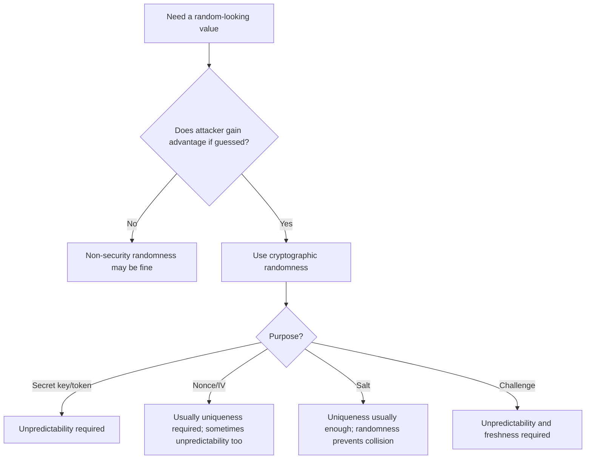
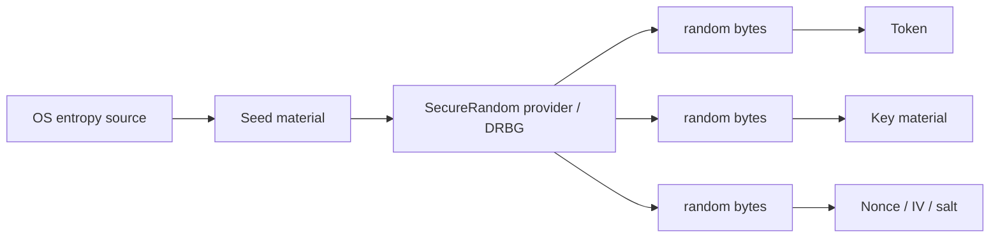
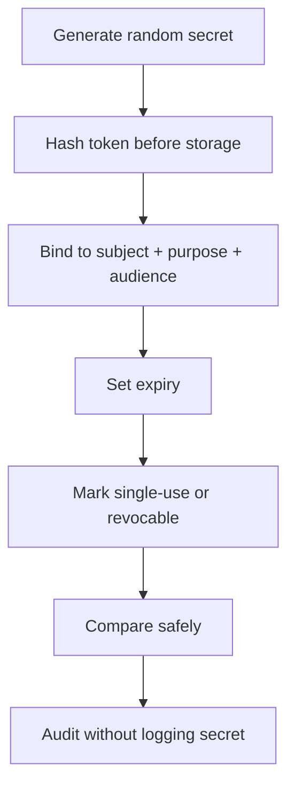

# Part 011 — Secure Randomness

Randomness is one of the few places in software engineering where a tiny implementation detail can silently destroy the security of an otherwise well-designed system.

A strong authorization model can be bypassed by predictable reset tokens.
A strong encryption algorithm can fail if nonces repeat.
A strong password hashing scheme can be weakened if salts are reused incorrectly.
A strong signing protocol can leak keys if randomness is broken.

This part focuses on the mental model and Java implementation discipline needed to use randomness safely in production systems.

We are not trying to become cryptographers here. We are trying to become the kind of Java engineer who can safely design, review, and operate systems where randomness carries security meaning.

---

## 1. Kaufman Deconstruction

Following the rapid skill acquisition method, we decompose “secure randomness” into a small number of operational subskills.

| Subskill | What You Must Be Able To Do |
|---|---|
| Distinguish random-looking from unpredictable | Know why `Random`, `ThreadLocalRandom`, and UUID convenience APIs are not equivalent to cryptographic randomness. |
| Classify randomness purpose | Separate key material, nonce, IV, salt, token, correlation ID, jitter, and load-balancing randomness. |
| Choose the correct Java API | Use `SecureRandom`, DRBG parameters, and provider checks intentionally. |
| Size tokens correctly | Estimate security strength in bits, encode safely, and avoid accidental truncation. |
| Enforce nonce uniqueness | Understand when unpredictability matters and when uniqueness matters more. |
| Test failure modes | Detect repeated nonces, low-entropy tokens, bad seeding, deterministic test leakage, and provider drift. |
| Operate safely | Avoid entropy starvation, unsafe container assumptions, secret exposure in logs, and broken startup behavior. |

The minimum useful goal: after this part, you should be able to review any Java code that creates tokens, keys, nonces, salts, IVs, session identifiers, reset links, or challenge values and answer:

1. What property is required: unpredictability, uniqueness, or both?
2. Which API provides that property?
3. What breaks if the generated value repeats or is guessed?
4. How would we detect or prevent that breakage?

---

## 2. The Core Mental Model

Randomness in security is not about “looking random”. It is about attacker capability.

A value is security-random only if an attacker cannot feasibly predict it before it is used, even after seeing many other outputs from the same system.



The most important distinction:

| Requirement | Meaning | Example |
|---|---|---|
| Unpredictability | Attacker cannot guess the value before it is valid. | Session ID, reset token, API key, CSRF token, OAuth state. |
| Uniqueness | Value must not repeat in a scope. | AES-GCM nonce under one key, database idempotency nonce, protocol sequence nonce. |
| Public randomness | Value may be public but must not collide or be attacker-controlled. | Salt, some message IDs, some protocol challenges. |
| Statistical distribution | Value should distribute load evenly. | Sharding, jitter, sampling. |

Do not use the same reasoning for all of these.

A salt does not need to be secret. A password reset token does. An AES-GCM nonce might not need to be secret, but repeating it with the same key can be catastrophic. A correlation ID might need uniqueness but should not be used as an authenticator.

---

## 3. Java API Map

Java has several random APIs. Most are not appropriate for security-sensitive values.

| API | Security Use? | Notes |
|---|---:|---|
| `java.security.SecureRandom` | Yes | Primary API for cryptographically strong random bytes. |
| `SecureRandom.getInstance("DRBG", ...)` | Yes | Explicit DRBG configuration when you need deterministic random bit generator parameters. |
| `SecureRandom.getInstanceStrong()` | Sometimes | Uses the `securerandom.strongAlgorithms` security property; may block depending on provider/source. Good for special key generation paths, not blindly for every request. |
| `java.util.Random` | No | Predictable PRNG, not for security. |
| `ThreadLocalRandom` | No | Good for concurrency/performance randomness, not secrets. |
| `SplittableRandom` | No | Good for simulations and parallel generation, not secrets. |
| `Math.random()` | No | Convenience random, not security. |
| `UUID.randomUUID()` | Usually not as a secret | Useful for identifiers, but do not treat UUIDs as high-assurance authenticators unless you have explicitly validated implementation and entropy assumptions. Prefer direct `SecureRandom` token generation for secrets. |

The default rule for Java security code:

```java
SecureRandom rng = new SecureRandom();
byte[] token = new byte[32]; // 256 bits
rng.nextBytes(token);
```

For most application-level tokens, `new SecureRandom()` is the right starting point. Use explicit algorithm/provider selection only when you have a concrete platform, compliance, or reproducibility reason.

---

## 4. What `SecureRandom` Actually Promises

`SecureRandom` is a cryptographically strong random number generator interface. Implementations can be PRNGs/DRBGs seeded from entropy sources, true random number generators, or hybrids.

The operational consequences:

1. You consume bytes from a generator, not directly from “pure entropy” every time.
2. The generator must be seeded with unpredictable seed material.
3. A provider may lazily seed on first use.
4. Some operations may block while gathering entropy.
5. Provider behavior can differ across JDKs, OSes, and security configurations.

A secure engineer should not treat `SecureRandom` as magic. Treat it as a dependency with a contract.



---

## 5. Randomness Vocabulary

### 5.1 Entropy

Entropy is uncertainty from the attacker’s perspective. A 128-bit token does not automatically have 128 bits of security if it was generated from a weak seed, truncated incorrectly, logged, or exposed through timing/side channels.

Good question:

> How hard is it for the attacker to guess this value while it is useful?

Bad question:

> Does this value look random when printed?

### 5.2 Seed

A seed initializes a deterministic generator. If the seed is predictable, the output can be predictable.

Avoid manual seeding in application code:

```java
// Bad: predictable seed source
SecureRandom rng = new SecureRandom();
rng.setSeed(System.currentTimeMillis());
```

`setSeed` does not necessarily replace all internal seed material in every implementation, but calling it with predictable data is still a strong smell. Let the provider seed itself unless you are implementing a carefully reviewed system-level entropy integration.

### 5.3 Nonce

A nonce is a “number used once”. In many protocols, the most important property is uniqueness within a scope, not secrecy.

For AEAD modes like AES-GCM, nonce reuse under the same key is dangerous. The safe design question is not merely “is this random enough?” but:

> Can this nonce ever repeat for this key across process restart, deployment, restore, retry, or concurrency path?

### 5.4 IV

An initialization vector is an algorithm/mode-specific parameter. Some IVs must be unpredictable. Some must be unique. Some can be public. You must follow the specific algorithm’s requirements.

Do not infer IV rules from another algorithm.

### 5.5 Salt

A salt is normally public and stored alongside a hash. Its job is to prevent precomputed attacks and ensure that identical inputs do not produce identical stored hashes under the same algorithm.

Salt should be unique per record. Random salts are the usual way to achieve this.

### 5.6 Token

A token used as a bearer secret must be unpredictable, sufficiently long, unguessable online, stored safely, compared safely, scoped, expired, and revocable.

Random generation is only the first part of token security.

---

## 6. Secure Token Generation

A secure token should have enough entropy, safe encoding, clear scope, and safe lifecycle.

### 6.1 Recommended Token Shape

For most application bearer tokens generated by your Java service:

| Use Case | Minimum Random Bytes | Encoded Length with Base64URL No Padding | Notes |
|---|---:|---:|---|
| CSRF token | 16 bytes | 22 chars | 128 bits is usually enough. |
| Password reset token | 32 bytes | 43 chars | Prefer 256 bits because token is high impact and often exposed via URLs/email. |
| Email verification token | 32 bytes | 43 chars | Expire and bind to intent. |
| API key secret part | 32 bytes | 43 chars | Add prefix and key id separately. |
| OAuth-like state/nonce | 16–32 bytes | 22–43 chars | Bind to session and redirect intent. |
| Temporary invitation token | 32 bytes | 43 chars | Scope and revoke on use. |

Example:

```java
import java.security.SecureRandom;
import java.util.Base64;

public final class SecureTokens {
    private static final SecureRandom RNG = new SecureRandom();
    private static final Base64.Encoder BASE64_URL = Base64.getUrlEncoder().withoutPadding();

    private SecureTokens() {}

    public static String randomUrlToken(int bytes) {
        if (bytes < 16) {
            throw new IllegalArgumentException("security token must be at least 128 bits");
        }

        byte[] raw = new byte[bytes];
        RNG.nextBytes(raw);
        return BASE64_URL.encodeToString(raw);
    }
}
```

Usage:

```java
String resetToken = SecureTokens.randomUrlToken(32);
```

### 6.2 Why Base64URL Without Padding?

For URL tokens, Base64URL without padding is compact and avoids characters that commonly require escaping in URLs.

Avoid hex unless readability is more important than length. Hex doubles the byte length in characters: 32 random bytes become 64 hex characters. Base64URL encodes the same bytes as about 43 characters.

### 6.3 Do Not Generate Tokens Like This

```java
// Bad: predictable and low entropy
String token = userId + "-" + System.currentTimeMillis();
```

```java
// Bad: Random is not cryptographic
String token = Long.toHexString(new Random().nextLong());
```

```java
// Bad: truncation may destroy security strength
String token = SecureTokens.randomUrlToken(32).substring(0, 8);
```

```java
// Bad: token is logged
log.info("Created reset token for user={}, token={}", userId, token);
```

---

## 7. Token Design Beyond Randomness

A random token is not automatically secure. A bearer token is equivalent to authority.

A production token should have this shape:



### 7.1 Store a Hash of the Token

For reset links and invitation tokens, store a hash of the token instead of the raw token. If the database leaks, attackers should not immediately be able to use outstanding tokens.

```java
import java.nio.charset.StandardCharsets;
import java.security.MessageDigest;
import java.security.NoSuchAlgorithmException;
import java.util.HexFormat;

public final class TokenDigests {
    private TokenDigests() {}

    public static String sha256Hex(String token) {
        try {
            MessageDigest digest = MessageDigest.getInstance("SHA-256");
            byte[] hash = digest.digest(token.getBytes(StandardCharsets.UTF_8));
            return HexFormat.of().formatHex(hash);
        } catch (NoSuchAlgorithmException e) {
            throw new IllegalStateException("SHA-256 unavailable", e);
        }
    }
}
```

Important nuance: this is acceptable for high-entropy random tokens. It is **not** acceptable for passwords. Passwords need password hashing/KDFs because user-chosen passwords have low entropy.

### 7.2 Bind Token to Intent

A reset token should not be usable as an email-verification token. An invite token should not be usable for another tenant. A device enrollment token should not be usable after device binding changes.

A token record should include:

```text
token_hash
subject_id
purpose
audience / tenant / client
created_at
expires_at
used_at
revoked_at
created_from_ip_or_context
```

Validation should check all of them.

### 7.3 Use Constant-Time Comparison for Secrets

Use `MessageDigest.isEqual` for byte arrays when comparing secret-derived values.

```java
import java.security.MessageDigest;

boolean matches(byte[] presentedHash, byte[] storedHash) {
    return MessageDigest.isEqual(presentedHash, storedHash);
}
```

String comparison may short-circuit and leak position information. In many web systems, network noise makes exploitation difficult, but security-sensitive comparison should still use constant-time primitives where available.

---

## 8. Nonce and IV Discipline

Nonce/IV mistakes are different from token mistakes.

A token fails when guessed.
A nonce fails when repeated in the wrong cryptographic context.

### 8.1 Scope Is Everything

A nonce uniqueness rule always has a scope.

| Nonce Type | Scope |
|---|---|
| AES-GCM nonce | Unique per encryption key. |
| Protocol challenge | Unique/fresh per challenge window. |
| Idempotency key | Unique per operation scope, usually tenant + endpoint + semantic operation. |
| Replay-prevention nonce | Unique per actor/session/window. |

Do not say “nonce must be unique” without saying “unique within what scope”.

### 8.2 Random Nonces vs Counter Nonces

Random nonce:

```java
byte[] nonce = new byte[12];
secureRandom.nextBytes(nonce);
```

Counter nonce:

```text
nonce = fixed_prefix || monotonically_increasing_counter
```

Random nonces are simple but rely on collision probability. Counter nonces provide deterministic uniqueness but require safe persistence, concurrency control, and restart behavior.

For high-throughput encryption under the same key, counter-based nonce allocation may be safer than pure random generation, but only if engineered carefully.

### 8.3 Restart and Restore Failure

Many nonce designs pass unit tests but fail under operational events:

| Event | Failure |
|---|---|
| Process restart | Counter resets. |
| Container replica scale-out | Two instances generate same sequence. |
| VM snapshot restore | RNG/counter state rewinds. |
| Database restore | Used nonce registry rolls back. |
| Retry logic | Same plaintext encrypted twice with same nonce by accident. |
| Clock rollback | Timestamp-derived nonce repeats. |

Design nonce allocation as part of the distributed system, not as a local helper method.

---

## 9. Salts

Salts are public uniqueness values. They prevent two identical inputs from producing the same stored output and prevent precomputed lookup tables from applying broadly.

For password hashing, let the password hashing library manage salts when possible. If you must generate salts directly:

```java
byte[] salt = new byte[16];
secureRandom.nextBytes(salt);
```

Good salt properties:

1. Unique per password/record.
2. Generated from secure randomness or a guaranteed unique source.
3. Stored alongside the derived hash.
4. Never reused globally.
5. Never treated as a secret.

Bad design:

```text
salt = applicationName
salt = tenantId
salt = userId
salt = emailAddress
```

These values may be stable and public, but they are predictable and can collide across environments or migrations. A random per-record salt is simpler and safer.

---

## 10. Randomness and Keys

Prefer `KeyGenerator` or `KeyPairGenerator` for cryptographic keys rather than manually generating bytes unless you understand the algorithm-specific requirements.

Example symmetric key generation:

```java
import javax.crypto.KeyGenerator;
import javax.crypto.SecretKey;

KeyGenerator kg = KeyGenerator.getInstance("AES");
kg.init(256);
SecretKey key = kg.generateKey();
```

If you generate raw bytes for an HMAC key:

```java
import javax.crypto.spec.SecretKeySpec;

byte[] keyBytes = new byte[32]; // 256-bit HMAC key
secureRandom.nextBytes(keyBytes);
SecretKeySpec key = new SecretKeySpec(keyBytes, "HmacSHA256");
```

Operationally, do not confuse:

| Thing | Should It Be Random? | Should It Be Stored? |
|---|---:|---:|
| Data encryption key | Yes | Usually encrypted/wrapped by KMS or HSM. |
| HMAC key | Yes | Store in KMS/secret manager. |
| Password salt | Random/unique | Store with hash. |
| Password pepper | Random secret | Store outside database, usually secret manager/HSM. |
| Token secret | Random | Usually store hash only. |
| Nonce | Unique, often random | Store/transmit with ciphertext depending on algorithm. |

---

## 11. DRBG in Java

A DRBG is a deterministic random bit generator: it expands seed entropy into cryptographically strong random output.

Java supports explicit DRBG requests using `DrbgParameters`.

```java
import java.security.DrbgParameters;
import java.security.NoSuchAlgorithmException;
import java.security.SecureRandom;

import static java.security.DrbgParameters.Capability.RESEED_ONLY;

public final class DrbgFactory {
    private DrbgFactory() {}

    public static SecureRandom createDefaultDrbg() {
        try {
            return SecureRandom.getInstance(
                    "DRBG",
                    DrbgParameters.instantiation(256, RESEED_ONLY, null)
            );
        } catch (NoSuchAlgorithmException e) {
            throw new IllegalStateException("DRBG not available", e);
        }
    }
}
```

Use explicit DRBG when:

1. You want predictable provider behavior across supported runtimes.
2. You need to request a security strength.
3. You have compliance requirements.
4. You want startup checks to fail fast if expected RNG capability is unavailable.

Do not use explicit DRBG merely because it looks more advanced. Provider defaults are often the best-supported path.

---

## 12. `getInstanceStrong()`

`SecureRandom.getInstanceStrong()` returns a strong RNG selected by the `securerandom.strongAlgorithms` security property.

It is tempting to use it everywhere. Resist that instinct.

Good use cases:

1. Generating long-lived root secrets at startup or administrative workflows.
2. Generating master keys in low-frequency paths.
3. Compliance-driven code where blocking is acceptable and documented.

Risky use cases:

1. Per-request token generation in latency-sensitive APIs.
2. High-throughput services that may block under entropy pressure.
3. Code paths without timeout/backpressure behavior.

A safe production policy:

```text
Use normal SecureRandom for application tokens by default.
Use getInstanceStrong only for explicitly reviewed low-frequency secret generation paths.
Measure startup and runtime behavior in the actual container/OS environment.
```

---

## 13. SecureRandom Lifecycle

### 13.1 Singleton Is Usually Fine

For application token generation, a shared `SecureRandom` instance is commonly acceptable.

```java
final class RandomSource {
    static final SecureRandom SECURE_RANDOM = new SecureRandom();

    private RandomSource() {}
}
```

Why not create a new instance per token?

1. It can add overhead.
2. It may increase provider initialization cost.
3. It does not automatically improve security.
4. It may make behavior harder to observe.

### 13.2 But Avoid Hidden Global Coupling in Tests

Inject a randomness interface where deterministic tests are required, but never allow deterministic test RNGs to leak into production.

```java
public interface RandomBytes {
    void nextBytes(byte[] target);
}

public final class SecureRandomBytes implements RandomBytes {
    private final SecureRandom random;

    public SecureRandomBytes(SecureRandom random) {
        this.random = random;
    }

    @Override
    public void nextBytes(byte[] target) {
        random.nextBytes(target);
    }
}
```

Test double:

```java
public final class FixedRandomBytes implements RandomBytes {
    private final byte value;

    public FixedRandomBytes(byte value) {
        this.value = value;
    }

    @Override
    public void nextBytes(byte[] target) {
        java.util.Arrays.fill(target, value);
    }
}
```

Production wiring should reject deterministic implementations.

---

## 14. Encoding Random Bytes Correctly

Random bytes often become strings. Encoding can weaken security if handled incorrectly.

| Encoding | Good For | Risk |
|---|---|---|
| Base64URL without padding | URL tokens, compact secrets | Case-sensitive; avoid transformations. |
| Hex | Debugging, fingerprints, hashes | Longer; may tempt truncation. |
| Base32 | Human entry | Longer; ambiguous characters if not careful. |
| Decimal numbers | Almost never for secrets | Low density and often truncated. |
| UUID string | IDs | Do not use as generic bearer secret unless explicitly reviewed. |

Avoid accidental normalization:

```text
Do not lowercase tokens.
Do not trim internal characters.
Do not URL-decode multiple times.
Do not store in case-insensitive columns.
Do not put tokens into logs or analytics events.
```

---

## 15. Collision Reasoning

A random token can collide. The question is whether collision probability is meaningful.

For a 128-bit random value, collision probability remains negligible for typical application token volumes.

But collision analysis must include scope and consequences:

| Value | Collision Consequence |
|---|---|
| Reset token | Could bind two flows if token hash is the only key. Use DB uniqueness. |
| API key id prefix | Could make lookup ambiguous. Use uniqueness constraint. |
| AES-GCM nonce | Catastrophic if repeated under same key. Use strict design, not just probability handwaving. |
| Salt | Usually minor but avoid with per-record randomness. |
| Correlation ID | Operational confusion, not usually security compromise. |

For any persisted security random value, add a uniqueness constraint where feasible.

```sql
CREATE UNIQUE INDEX ux_reset_token_hash ON password_reset_token(token_hash);
```

Randomness reduces expected collision. Constraints prevent silent collision.

---

## 16. Container and VM Randomness Pitfalls

Modern Linux/JDK combinations generally handle entropy far better than older deployments, but production engineers still need operational awareness.

Risks to watch:

1. Minimal containers missing expected OS devices/configuration.
2. Early startup entropy blocking.
3. VM snapshot/restore creating repeated RNG state in poorly designed environments.
4. Misconfigured `java.security` properties.
5. Custom base images with unusual entropy behavior.
6. FIPS mode changing provider behavior.

Startup check example:

```java
import java.security.SecureRandom;
import java.util.HexFormat;

public final class RandomnessStartupCheck {
    public static void verify() {
        SecureRandom rng = new SecureRandom();
        byte[] sample = new byte[32];
        rng.nextBytes(sample);

        // Do not log this in real production if generated from the same source used for secrets.
        // Instead log provider metadata only.
        System.out.println("SecureRandom provider=" + rng.getProvider().getName()
                + ", algorithm=" + rng.getAlgorithm());
    }
}
```

Do not log random sample bytes in production. The example shows provider metadata only.

---

## 17. Randomness Observability

Security observability should not leak secrets. You need enough telemetry to detect failure without exposing random values.

Log:

```text
provider name
algorithm name
startup success/failure
token issuance count by purpose
nonce allocation failures
uniqueness constraint violations
key generation events without key material
entropy blocking metrics if available
```

Do not log:

```text
raw token
raw nonce when it creates linkage risk
raw key material
seed material
password reset links
API key secrets
authorization headers
session cookies
```

Safe audit example:

```java
log.info("reset_token_issued userId={} purpose={} expiresAt={} tokenId={}",
        userId,
        "PASSWORD_RESET",
        expiresAt,
        tokenRecordId);
```

Unsafe audit example:

```java
log.info("reset link generated: https://example/reset?token={}", token);
```

---

## 18. Security Review Checklist

Use this checklist in PR reviews.

### 18.1 API Choice

- [ ] Does code use `SecureRandom` for security-sensitive randomness?
- [ ] Is `Random`, `Math.random`, `ThreadLocalRandom`, or `SplittableRandom` absent from security paths?
- [ ] Is `UUID.randomUUID()` not treated as a generic secret?
- [ ] Is manual seeding avoided?
- [ ] Is provider/algorithm selection intentional and documented?

### 18.2 Token Design

- [ ] Token has at least 128 bits of entropy; high-impact bearer tokens use 256 bits.
- [ ] Token is encoded with Base64URL/hex safely.
- [ ] Token is scoped by purpose, subject, tenant, and audience.
- [ ] Token expires.
- [ ] Token can be revoked or marked used.
- [ ] Raw token is not stored if a hash is sufficient.
- [ ] Raw token is not logged.
- [ ] DB uniqueness constraints prevent silent collision.

### 18.3 Nonce/IV Design

- [ ] Nonce uniqueness scope is documented.
- [ ] Nonce generation remains safe across restart, scaling, retry, and restore.
- [ ] Nonces are never reused with the same key for modes that require uniqueness.
- [ ] Tests simulate repeated nonce failure.

### 18.4 Operational Safety

- [ ] Provider metadata is observable.
- [ ] Startup behavior has been tested in the actual container/OS/FIPS environment.
- [ ] Secret values are redacted from logs, metrics, traces, and exception messages.
- [ ] Deterministic test RNG cannot be wired into production.

---

## 19. Common Anti-Patterns

### 19.1 Timestamp Tokens

```java
String token = userId + ":" + Instant.now().toEpochMilli();
```

This is not a token. It is a guessable timestamp with a user identifier.

### 19.2 Random With Current Time Seed

```java
Random random = new Random(System.nanoTime());
```

This is not cryptographic. Time-based seeds are often searchable.

### 19.3 Too-Short Numeric OTP as Bearer Reset Token

A 6-digit OTP has one million possibilities. That can be acceptable only with strict online rate limits, short expiry, attempt counters, and binding. It is not a replacement for a high-entropy reset link.

### 19.4 Reusing Randomness for Multiple Meanings

```text
same random value = database id + public tracking id + bearer secret
```

Separate public identifiers from secrets.

### 19.5 Global Salt

```text
hash = SHA-256(globalSalt || password)
```

This is not password hashing. It is fast hashing with a shared salt-like value.

### 19.6 Random Nonce Without Key Scope

```text
nonce = random 12 bytes
key = long-lived global key
volume = billions of messages
```

This may be acceptable in some regimes, but it needs collision analysis and operational constraints. Do not handwave.

---

## 20. Exercises

### Exercise 1 — Token Review

Review this code:

```java
String token = UUID.randomUUID().toString().replace("-", "");
repository.save(userId, token, Instant.now().plus(1, ChronoUnit.DAYS));
log.info("reset token created for {} token={}", userId, token);
```

Find at least five problems or improvement opportunities.

Expected direction:

1. Prefer direct `SecureRandom` token bytes.
2. Store token hash, not raw token.
3. Do not log token.
4. Bind purpose and tenant/audience.
5. Add single-use semantics.
6. Add uniqueness constraint.
7. Consider shorter expiry.
8. Audit by token id, not token value.

### Exercise 2 — Nonce Scope

Define the nonce uniqueness scope for each:

1. AES-GCM encrypting database fields.
2. mTLS handshake randomness.
3. Idempotency key for payment creation.
4. WebAuthn challenge.
5. Password reset token.

### Exercise 3 — Startup Randomness Check

Write a startup health check that logs `SecureRandom` provider and algorithm without logging random bytes. Add an alert if provider changes between releases.

### Exercise 4 — Deterministic Test Trap

Design a test-only `RandomBytes` implementation. Then design a production guard that prevents it from being used outside test profile.

---

## 21. Production Pattern: Token Issuer

A practical token issuer should separate token secret from token record metadata.

```java
import java.security.MessageDigest;
import java.security.SecureRandom;
import java.time.Clock;
import java.time.Duration;
import java.time.Instant;
import java.util.Base64;
import java.util.HexFormat;
import java.util.Objects;

public final class BearerTokenIssuer {
    private static final int TOKEN_BYTES = 32;

    private final SecureRandom random;
    private final Clock clock;
    private final Base64.Encoder encoder = Base64.getUrlEncoder().withoutPadding();

    public BearerTokenIssuer(SecureRandom random, Clock clock) {
        this.random = Objects.requireNonNull(random);
        this.clock = Objects.requireNonNull(clock);
    }

    public IssuedToken issue(String subjectId, String purpose, Duration ttl) {
        if (ttl.isZero() || ttl.isNegative()) {
            throw new IllegalArgumentException("ttl must be positive");
        }

        byte[] raw = new byte[TOKEN_BYTES];
        random.nextBytes(raw);

        String presentedToken = encoder.encodeToString(raw);
        String tokenHash = sha256Hex(presentedToken);
        Instant now = Instant.now(clock);

        return new IssuedToken(
                presentedToken,
                tokenHash,
                subjectId,
                purpose,
                now,
                now.plus(ttl)
        );
    }

    private static String sha256Hex(String token) {
        try {
            MessageDigest digest = MessageDigest.getInstance("SHA-256");
            return HexFormat.of().formatHex(digest.digest(token.getBytes(java.nio.charset.StandardCharsets.UTF_8)));
        } catch (Exception e) {
            throw new IllegalStateException("SHA-256 unavailable", e);
        }
    }

    public record IssuedToken(
            String presentedToken,
            String tokenHash,
            String subjectId,
            String purpose,
            Instant createdAt,
            Instant expiresAt
    ) {}
}
```

In a real application, return `presentedToken` only once to the caller. Persist the hash and metadata. Redact the presented token from logs and telemetry.

---

## 22. Failure Modeling Table

| Failure | Example | Prevention | Detection |
|---|---|---|---|
| Predictable token | Timestamp + user id | Use `SecureRandom` 128/256-bit tokens | Security review, entropy tests, code search |
| Token leak in logs | Reset URL logged | Redaction, structured logging policy | Log scanning, DLP rules |
| Token DB leak | Raw reset tokens stored | Store hash only | Incident drill, table review |
| Nonce reuse | AES-GCM same nonce/key | Counter allocation or random with limits | Nonce registry, encryption tests |
| Test RNG in prod | Fixed random source wired | Environment guard | Startup check |
| Provider drift | Runtime changes RNG provider | Provider allowlist/alert | Startup telemetry |
| Blocking RNG | `getInstanceStrong` in request path | Use normal `SecureRandom` per policy | Latency metrics, thread dumps |
| Salt reuse | Global salt | Per-record random salt | Schema and hash format review |

---

## 23. Design Heuristics

1. Use `SecureRandom` for security-sensitive random bytes.
2. Use direct random bytes, then encode; do not build secrets from timestamps, ids, or names.
3. Prefer 32 random bytes for high-impact bearer tokens.
4. Store hashes of random bearer tokens when possible.
5. Separate public ids from secret tokens.
6. Define nonce uniqueness scope before writing encryption code.
7. Treat nonce allocation as distributed-system design when throughput or multi-instance deployment is involved.
8. Let password hashing libraries manage salts unless you have a strong reason not to.
9. Do not log secrets, seeds, tokens, or key material.
10. Fail startup if required randomness/provider capability is unavailable.

---

## 24. What To Remember

Secure randomness is not a helper utility. It is a security boundary.

The core invariant:

> Any value that grants authority must be generated with cryptographic randomness, have enough entropy, be scoped, be expired/revocable, and never be exposed unnecessarily.

The second invariant:

> Any nonce used by a cryptographic algorithm must satisfy that algorithm’s uniqueness/unpredictability requirement across the entire key scope, including restarts and distributed deployment.

If you can enforce those two invariants, you will avoid a large class of subtle Java security failures.

---

## References

- Oracle Java SE 25 API — `SecureRandom`: https://docs.oracle.com/en/java/javase/25/docs/api/java.base/java/security/SecureRandom.html
- Oracle Java Security Standard Algorithm Names: https://docs.oracle.com/en/java/javase/11/docs/specs/security/standard-names.html
- NIST SP 800-90A Rev. 1 — Recommendation for Random Number Generation Using Deterministic Random Bit Generators: https://www.nist.gov/publications/recommendation-random-number-generation-using-deterministic-random-bit-generators-2
- RFC 4086 — Randomness Requirements for Security: https://www.rfc-editor.org/rfc/rfc4086
- OWASP Password Storage Cheat Sheet: https://cheatsheetseries.owasp.org/cheatsheets/Password_Storage_Cheat_Sheet.html
