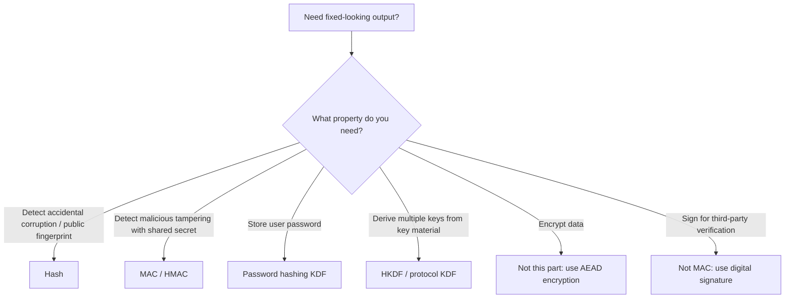
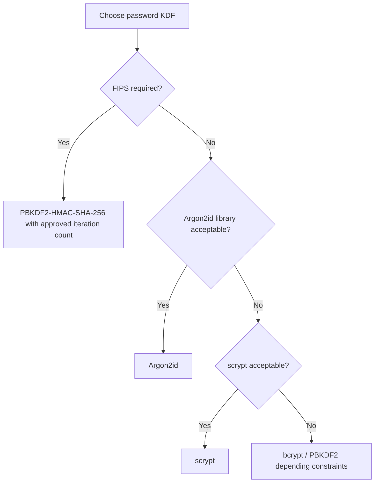
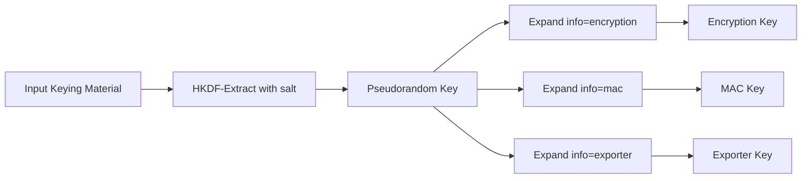
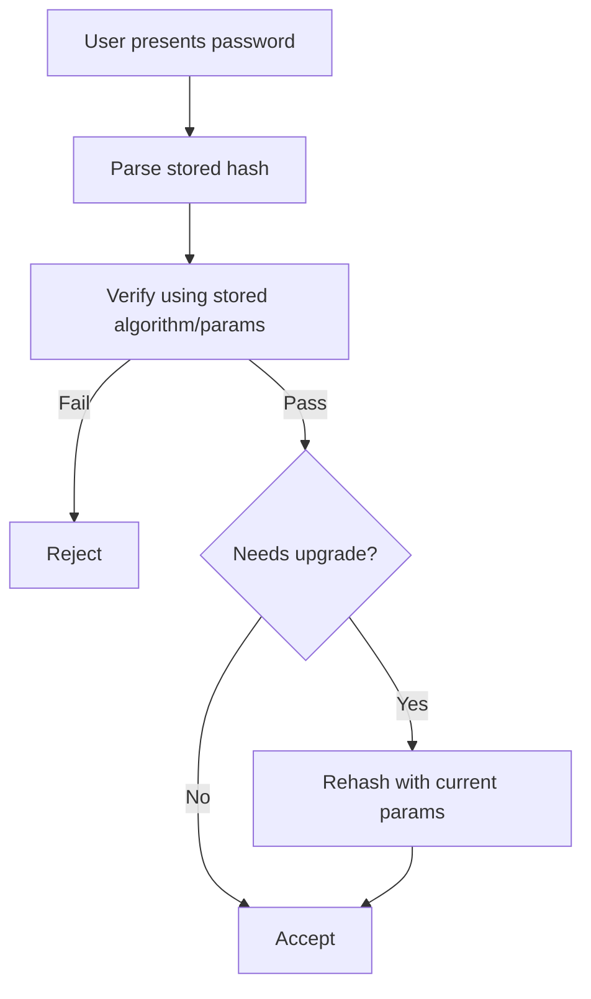

# Part 012 — Hashing, MAC, and KDF

Hashing, MAC, and key derivation are often confused because all three can output fixed-looking byte arrays.

That confusion causes serious security bugs.

A hash is not encryption.
A hash is not authentication.
A MAC is not a password hash.
A password hash is not a general-purpose KDF.
A KDF is not a random number generator.

This part builds the mental model and Java implementation discipline for three families of primitives:

1. **Hash functions** — integrity fingerprints for public/non-secret data.
2. **Message authentication codes** — integrity + authenticity using a secret key.
3. **Key derivation functions** — deriving keys from existing secrets or passwords with the correct security assumptions.

---

## 1. Kaufman Deconstruction

The useful subskills are small and precise.

| Subskill | What You Must Be Able To Do |
|---|---|
| Separate primitive purpose | Know whether you need collision resistance, authenticity, password resistance, or key expansion. |
| Use JCA correctly | Use `MessageDigest`, `Mac`, and `SecretKeyFactory` without unsafe algorithm choices or string confusion. |
| Design canonical input | Ensure the same semantic payload produces the same bytes, and different semantic payloads cannot collide through ambiguous concatenation. |
| Compare safely | Use constant-time comparison for secret-derived values. |
| Store passwords safely | Use Argon2id/scrypt/bcrypt/PBKDF2 according to platform and compliance constraints. |
| Add domain separation | Prevent one digest/MAC/KDF output from being reused across protocols or meanings. |
| Plan migration | Version hash formats, rotate MAC keys, upgrade KDF cost, and verify legacy values safely. |

The goal is not “know SHA-256”. The goal is:

> Given a data integrity problem in a Java system, choose the correct primitive, define the byte representation, encode metadata, test failures, and build migration paths.

---

## 2. Primitive Selection Mental Model

Start with the security property, not the API.



| Need | Primitive | Java Entry Point |
|---|---|---|
| File checksum where attacker cannot choose file | Hash | `MessageDigest` |
| Tamper-evident internal webhook with shared secret | HMAC | `Mac` |
| Password storage | Argon2id/bcrypt/scrypt/PBKDF2 | Library or `SecretKeyFactory` for PBKDF2 |
| Derive encryption and MAC keys from shared secret | HKDF or protocol KDF | Library or custom reviewed implementation |
| Public proof anyone can verify | Digital signature | `Signature` |
| Confidentiality | Encryption/AEAD | `Cipher` |

---

## 3. Hash Functions

A cryptographic hash function maps arbitrary bytes to fixed-size output.

Important properties:

| Property | Meaning |
|---|---|
| Preimage resistance | Given a digest, hard to find any input that hashes to it. |
| Second preimage resistance | Given one input, hard to find another input with same digest. |
| Collision resistance | Hard to find any two different inputs with same digest. |
| Avalanche behavior | Small input changes produce unrelated output. |

Typical Java usage:

```java
import java.security.MessageDigest;
import java.util.HexFormat;

public final class Hashes {
    private Hashes() {}

    public static String sha256Hex(byte[] input) {
        try {
            MessageDigest digest = MessageDigest.getInstance("SHA-256");
            return HexFormat.of().formatHex(digest.digest(input));
        } catch (Exception e) {
            throw new IllegalStateException("SHA-256 unavailable", e);
        }
    }
}
```

Good use cases:

1. Public file fingerprint.
2. Cache key for non-secret content.
3. Deduplication where adversarial collision risk is considered.
4. Hashing high-entropy random tokens before database storage.
5. Commitment-like internal fingerprints when not used as authentication.

Bad use cases:

1. Password storage with plain SHA-256.
2. Request authentication with `SHA-256(secret || message)`.
3. Encryption.
4. Authorization tokens based on predictable content.
5. Tamper proofing without a secret key.

---

## 4. Hashing Is Not Authentication

A hash proves only that some bytes produce a digest. It does not prove who produced it.

If an attacker can change both message and hash, a plain hash gives no protection.

Bad webhook design:

```text
payload = { "amount": 1000000 }
header = SHA-256(payload)
```

An attacker can modify the payload and recompute the hash.

Better design:

```text
header = HMAC-SHA256(secret, canonical_payload)
```

Now the attacker needs the secret key to create a valid tag.

---

## 5. Message Authentication Codes

A MAC provides integrity and authenticity for parties that share a secret key.

HMAC is the common default for Java application protocols.

```java
import javax.crypto.Mac;
import javax.crypto.spec.SecretKeySpec;
import java.util.HexFormat;

public final class Hmacs {
    private Hmacs() {}

    public static String hmacSha256Hex(byte[] key, byte[] message) {
        try {
            Mac mac = Mac.getInstance("HmacSHA256");
            mac.init(new SecretKeySpec(key, "HmacSHA256"));
            return HexFormat.of().formatHex(mac.doFinal(message));
        } catch (Exception e) {
            throw new IllegalStateException("HMAC-SHA-256 unavailable", e);
        }
    }
}
```

A MAC requires:

1. A secret key with sufficient entropy.
2. A canonical message representation.
3. Algorithm and key version metadata.
4. Constant-time verification.
5. Replay protection when freshness matters.

---

## 6. HMAC Verification Pattern

Bad verification:

```java
if (expectedHex.equals(providedHex)) {
    accept();
}
```

Better verification:

```java
import java.security.MessageDigest;
import java.util.HexFormat;

public final class MacVerifier {
    private MacVerifier() {}

    public static boolean constantTimeHexEquals(String expectedHex, String providedHex) {
        try {
            byte[] expected = HexFormat.of().parseHex(expectedHex);
            byte[] provided = HexFormat.of().parseHex(providedHex);
            return MessageDigest.isEqual(expected, provided);
        } catch (IllegalArgumentException malformedHex) {
            return false;
        }
    }
}
```

Even better: avoid hex if unnecessary and compare raw bytes decoded from Base64URL.

Important detail: length differences can still reveal metadata. Usually this is acceptable if the signature encoding has a fixed length, but your parser should reject malformed values uniformly.

---

## 7. Canonical Input Is Part of the Security Boundary

Most MAC failures in application code are not caused by HMAC itself. They are caused by ambiguous message construction.

Bad:

```java
String message = userId + tenantId + amount;
```

This is ambiguous:

```text
userId=12, tenantId=3, amount=45  -> 12345
userId=1,  tenantId=23, amount=45 -> 12345
```

Better:

```text
v1\n
user_id_length=2\n
12\n
tenant_id_length=1\n
3\n
amount_length=2\n
45\n
```

Or use a canonical serialization format with explicit field names and stable ordering.

### 7.1 Canonical JSON Trap

JSON object field order, whitespace, number representation, Unicode escaping, and duplicate fields can differ across serializers/parsers.

This is dangerous:

```java
byte[] message = objectMapper.writeValueAsBytes(payload);
```

It can be acceptable only if you control canonical serialization settings and test cross-version behavior.

For external protocols, prefer documented canonicalization rules.

---

## 8. Domain Separation

Domain separation means the same primitive/key is not accidentally reused for different meanings.

Bad:

```text
HMAC(key, userId)
```

Used for:

1. password reset token
2. email verification token
3. unsubscribe token
4. tenant invite token

If one context leaks or accepts a value, another context might be confused.

Better:

```text
HMAC(key, "password-reset:v1" || canonical_fields)
HMAC(key, "email-verification:v1" || canonical_fields)
HMAC(key, "tenant-invite:v1" || canonical_fields)
```

Domain separation should include:

1. Purpose.
2. Version.
3. Tenant/audience if relevant.
4. Algorithm/key identifier if needed.
5. Canonical field boundaries.

---

## 9. MAC-Based API Request Signing

A common Java platform requirement is internal request signing.

A secure request signature should bind:

| Field | Why |
|---|---|
| HTTP method | Prevent signature reuse across methods. |
| Canonical path | Prevent path confusion. |
| Canonical query | Prevent parameter reordering/duplication confusion. |
| Selected headers | Bind host/content type/date/idempotency key. |
| Body hash | Avoid signing huge body directly while still binding content. |
| Timestamp | Freshness window. |
| Nonce/request id | Replay detection. |
| Key id | Key lookup and rotation. |
| Algorithm/version | Migration and downgrade prevention. |

Example canonical string shape:

```text
JAVA-HMAC-SHA256-V1
method:POST
path:/v1/payments
query:currency=USD&tenant=t-123
host:api.internal.example
content-type:application/json
timestamp:2026-06-28T12:00:00Z
nonce:01J2...
body-sha256:4b68...
```

Then:

```text
signature = base64url(HMAC-SHA256(signingKey, canonicalStringBytes))
```

Verification must:

1. Parse signature metadata.
2. Find active key by key id.
3. Rebuild canonical string exactly.
4. Verify HMAC constant-time.
5. Enforce timestamp window.
6. Reject nonce replay within the window.
7. Audit failures without logging secrets.

---

## 10. Password Storage Is Different

User passwords are low entropy compared to random tokens. That changes the primitive.

Plain SHA-256 is fast. Fast is good for file checksums. Fast is bad for password cracking resistance.

Password storage needs a slow, adaptive, preferably memory-hard algorithm.

Recommended order in many modern systems:

1. Argon2id if available and acceptable.
2. scrypt where Argon2id is not available.
3. bcrypt for legacy compatibility, with input length caveats.
4. PBKDF2-HMAC-SHA-256 when FIPS constraints require it or platform support is limited.

Do not design your own password hashing scheme.

---

## 11. Password Hash Record Format

A password hash should be self-describing.

It should include:

```text
algorithm
version
parameters / cost
salt
hash output
optional pepper version outside the hash string
```

Example conceptual format:

```text
$argon2id$v=19$m=19456,t=2,p=1$base64(salt)$base64(hash)
```

For PBKDF2:

```text
$pbkdf2-sha256$v=1$i=600000$s=base64(salt)$h=base64(hash)
```

Why self-describing?

1. You can upgrade cost over time.
2. You can verify legacy hashes safely.
3. You can migrate algorithms without forcing all users to reset immediately.
4. You can detect weak records during login.
5. You can audit production state.

---

## 12. PBKDF2 in Java

Java provides PBKDF2 through `SecretKeyFactory`.

```java
import javax.crypto.SecretKeyFactory;
import javax.crypto.spec.PBEKeySpec;
import java.security.SecureRandom;
import java.util.Arrays;
import java.util.Base64;

public final class Pbkdf2PasswordHasher {
    private static final SecureRandom RNG = new SecureRandom();
    private static final int SALT_BYTES = 16;
    private static final int HASH_BITS = 256;
    private static final int ITERATIONS = 600_000;
    private static final String ALGORITHM = "PBKDF2WithHmacSHA256";

    public String hash(char[] password) {
        byte[] salt = new byte[SALT_BYTES];
        RNG.nextBytes(salt);
        byte[] derived = derive(password, salt, ITERATIONS, HASH_BITS);

        return "$pbkdf2-sha256$v=1$i=" + ITERATIONS
                + "$s=" + Base64.getEncoder().encodeToString(salt)
                + "$h=" + Base64.getEncoder().encodeToString(derived);
    }

    private static byte[] derive(char[] password, byte[] salt, int iterations, int bits) {
        PBEKeySpec spec = new PBEKeySpec(password, salt, iterations, bits);
        try {
            SecretKeyFactory factory = SecretKeyFactory.getInstance(ALGORITHM);
            return factory.generateSecret(spec).getEncoded();
        } catch (Exception e) {
            throw new IllegalStateException("PBKDF2 unavailable", e);
        } finally {
            spec.clearPassword();
        }
    }

    public boolean verify(char[] password, ParsedHash parsed) {
        byte[] candidate = derive(password, parsed.salt(), parsed.iterations(), parsed.hash().length * 8);
        try {
            return java.security.MessageDigest.isEqual(candidate, parsed.hash());
        } finally {
            Arrays.fill(candidate, (byte) 0);
        }
    }

    public record ParsedHash(int iterations, byte[] salt, byte[] hash) {}
}
```

This example is intentionally incomplete around parsing. In production, use a well-reviewed library or implement strict parsing with negative tests.

### 12.1 Why `char[]`?

Historically, Java security APIs often accept passwords as `char[]` so callers can clear them after use. In real applications, passwords often arrive as `String` from web frameworks, so do not overstate the benefit. Still, avoid unnecessary copies and clear buffers you control.

---

## 13. Argon2id in Java

Argon2id is not part of the standard JDK API. You need a library.

When choosing a Java Argon2 library, review:

1. Maintenance status.
2. Native dependency behavior.
3. Constant-time verification claims.
4. Parameter encoding format.
5. Memory limits under container constraints.
6. Side-channel considerations.
7. FIPS constraints if relevant.

Typical parameters must be chosen based on your environment. OWASP publishes baseline recommendations, but production teams should benchmark against their latency, CPU, memory, and attack-resistance goals.

Do not choose the highest cost blindly. Password hashing cost is a security-control and availability-control trade-off.



---

## 14. Pepper

A pepper is an application-level secret added to password verification, stored outside the database.

Salt:

```text
public, per-password, stored with hash
```

Pepper:

```text
secret, shared or versioned, stored in secret manager/HSM/KMS, not in password table
```

Pepper can help if the database leaks but the secret manager does not. It does not save you if the application runtime is compromised.

Two common pepper patterns:

### 14.1 Pre-hash Pepper

```text
password_input = HMAC(pepper, normalized_password)
password_hash = Argon2id(password_input, salt, params)
```

### 14.2 Post-hash Pepper

```text
stored_hash = HMAC(pepper, password_kdf_output)
```

Use a library-supported or security-reviewed approach. Pepper rotation is hard because you usually need the user password to recompute password hashes unless you store additional versioned wrapping data.

---

## 15. HKDF

HKDF is an HMAC-based key derivation function using extract-then-expand.

It is useful when you already have high-entropy keying material, such as a shared secret from key agreement, and need multiple independent keys.



HKDF is not a password hashing function. If your input is a user password, use a password KDF first.

### 15.1 HKDF Inputs

| Input | Meaning |
|---|---|
| IKM | Input keying material. Must have sufficient entropy for the use case. |
| Salt | Non-secret random or context-specific value used in extract stage. |
| Info | Context/domain separation string for expand stage. |
| Length | Desired output length. |

`info` is critical. It prevents different keys from accidentally being the same or being used across protocols.

---

## 16. Minimal HKDF-SHA-256 Implementation

Java does not expose HKDF as a universal standard JDK API in the same way it exposes `Mac` or `MessageDigest`. If you implement HKDF, keep it small, tested against RFC test vectors, and isolated.

```java
import javax.crypto.Mac;
import javax.crypto.spec.SecretKeySpec;
import java.io.ByteArrayOutputStream;
import java.util.Arrays;

public final class HkdfSha256 {
    private static final String HMAC = "HmacSHA256";
    private static final int HASH_LEN = 32;

    private HkdfSha256() {}

    public static byte[] extract(byte[] salt, byte[] ikm) {
        byte[] actualSalt = salt == null || salt.length == 0 ? new byte[HASH_LEN] : salt;
        return hmac(actualSalt, ikm);
    }

    public static byte[] expand(byte[] prk, byte[] info, int length) {
        if (length < 0 || length > 255 * HASH_LEN) {
            throw new IllegalArgumentException("invalid HKDF length");
        }

        byte[] actualInfo = info == null ? new byte[0] : info;
        ByteArrayOutputStream okm = new ByteArrayOutputStream(length);
        byte[] previous = new byte[0];
        int counter = 1;

        while (okm.size() < length) {
            byte[] input = concat(previous, actualInfo, new byte[] { (byte) counter });
            previous = hmac(prk, input);
            int remaining = length - okm.size();
            okm.write(previous, 0, Math.min(remaining, previous.length));
            counter++;
        }

        Arrays.fill(previous, (byte) 0);
        return okm.toByteArray();
    }

    public static byte[] derive(byte[] salt, byte[] ikm, byte[] info, int length) {
        byte[] prk = extract(salt, ikm);
        try {
            return expand(prk, info, length);
        } finally {
            Arrays.fill(prk, (byte) 0);
        }
    }

    private static byte[] hmac(byte[] key, byte[] message) {
        try {
            Mac mac = Mac.getInstance(HMAC);
            mac.init(new SecretKeySpec(key, HMAC));
            return mac.doFinal(message);
        } catch (Exception e) {
            throw new IllegalStateException("HmacSHA256 unavailable", e);
        }
    }

    private static byte[] concat(byte[]... parts) {
        int len = 0;
        for (byte[] part : parts) {
            len += part.length;
        }
        byte[] out = new byte[len];
        int pos = 0;
        for (byte[] part : parts) {
            System.arraycopy(part, 0, out, pos, part.length);
            pos += part.length;
        }
        return out;
    }
}
```

Production note: prefer a mature library where available. If you keep this code, add RFC 5869 test vectors, negative tests, and code ownership.

---

## 17. Key Separation

Never use one key for every purpose.

Bad:

```text
masterKey used for AES encryption
masterKey used for HMAC request signing
masterKey used for token signing
masterKey used for export checksum
```

Better:

```text
masterKey -> HKDF(info="java-platform:v1:field-encryption") -> encryptionKey
masterKey -> HKDF(info="java-platform:v1:webhook-signing") -> webhookMacKey
masterKey -> HKDF(info="java-platform:v1:audit-log-mac") -> auditMacKey
```

Key separation limits blast radius and prevents cross-protocol attacks.

A good derived key label includes:

```text
organization/system
service
environment
purpose
algorithm
version
tenant or domain when relevant
```

Example:

```text
acme-case-platform:prod:audit-log-mac:hmac-sha256:v1
```

---

## 18. Hashing Random Tokens vs Passwords

This distinction is crucial.

| Input | Entropy | Correct Storage Primitive |
|---|---:|---|
| User password | Often low | Argon2id/scrypt/bcrypt/PBKDF2 |
| 32-byte random reset token | High | SHA-256 or HMAC-SHA-256 hash can be acceptable |
| API key secret | High | Store keyed hash or SHA-256 hash depending threat model |
| Refresh token | High if generated correctly | Store hash; rotate on use |
| Session id | High if generated correctly | Usually store server-side session id hash or secure cookie/session framework |

Why is SHA-256 acceptable for random tokens?

Because the attacker cannot enumerate a 256-bit random token space. Passwords are different because users choose low-entropy values and attackers can guess likely candidates.

---

## 19. Algorithm Choices

### 19.1 Hashes

Prefer:

```text
SHA-256
SHA-384
SHA-512
SHA-3 family where platform and interoperability require it
```

Avoid:

```text
MD5
SHA-1
custom hashes
truncated hashes without analysis
```

### 19.2 MACs

Prefer:

```text
HmacSHA256
HmacSHA384
HmacSHA512
```

Avoid:

```text
raw SHA-256(secret || message)
CRC32 for security
ad hoc checksum + secret
```

### 19.3 Password KDFs

Prefer based on constraints:

```text
Argon2id
scrypt
bcrypt
PBKDF2WithHmacSHA256
```

Avoid:

```text
SHA-256(password)
MD5(password)
Base64(password)
AES(password)
homegrown stretching loops
```

---

## 20. Length Extension and Secret Prefix Hashing

This is a classic pitfall.

Bad MAC-like construction:

```text
SHA-256(secret || message)
```

Some hash constructions are vulnerable to length extension patterns when used incorrectly. Even when a specific construction avoids one known issue, ad hoc keyed hashes remain unnecessary risk.

Use HMAC:

```text
HMAC-SHA-256(secret, message)
```

HMAC exists to solve keyed integrity correctly.

---

## 21. Versioning and Migration

Cryptographic storage formats need versions.

Bad database schema:

```text
password_hash varchar(255)
```

Better:

```text
password_hash varchar(512) -- self-describing encoded format
password_algo varchar(64)  -- optional extracted field for query/reporting
password_params jsonb      -- optional operational reporting
password_updated_at timestamp
```

For MAC keys:

```text
key_id
algorithm
created_at
not_before
not_after
status = active | verify_only | retired | compromised
```

Verification migration pattern:



Never migrate by weakening verification. Always verify old format first, then upgrade after successful authentication.

---

## 22. Java Object Lifecycle and Sensitive Bytes

Java does not make memory zeroization easy. Still, reduce avoidable exposure.

Guidelines:

1. Prefer `char[]`/`byte[]` over `String` when you control the boundary.
2. Clear arrays after use when practical.
3. Do not log secrets.
4. Do not put secrets in exception messages.
5. Do not serialize secret objects accidentally.
6. Avoid long-lived static secret byte arrays unless they are intentionally managed.
7. Use secret managers/KMS/HSM for real key material.

Example:

```java
byte[] key = loadKey();
try {
    // use key
} finally {
    java.util.Arrays.fill(key, (byte) 0);
}
```

Be honest: zeroization in managed runtimes is best effort. It is not a substitute for process isolation, access control, and secret lifecycle management.

---

## 23. Testing Strategy

### 23.1 Known-Answer Tests

For cryptographic functions, known-answer tests are essential.

Test vectors should verify:

1. SHA-256 digest for known input.
2. HMAC-SHA-256 for known key/message.
3. HKDF extract/expand from RFC vectors.
4. PBKDF2 output for fixed password/salt/iterations.

### 23.2 Negative Tests

Test failures intentionally:

1. Modified message fails MAC verification.
2. Modified signature fails.
3. Wrong key id fails.
4. Expired timestamp fails.
5. Replay nonce fails.
6. Malformed hex/base64 fails safely.
7. Unsupported algorithm version fails closed.
8. Password hash with downgraded cost is flagged for upgrade.

### 23.3 Property Tests

Useful properties:

```text
same input + same key -> same MAC
same input + different key -> different MAC with overwhelming probability
modified input -> verification false
same password + different salt -> different hash
valid old hash -> verifies and rehashes when policy requires
```

Do not test randomness by asserting exact output. Test length, encoding, uniqueness constraints, and integration behavior.

---

## 24. Common Anti-Patterns

### 24.1 “Encrypting” Passwords

Passwords should almost never be encrypted for storage. Encryption is reversible. Password verification does not need reversibility.

Use password hashing.

### 24.2 Fast Hash Passwords

```java
MessageDigest.getInstance("SHA-256").digest(passwordBytes);
```

This is fast and cheap for attackers.

### 24.3 HMAC Without Canonicalization

```java
HMAC(key, request.toString())
```

`toString()` is not a protocol.

### 24.4 MAC With Public Key

An HMAC key must be secret. If everyone has the key, everyone can forge the MAC.

### 24.5 Reusing KDF Output Everywhere

```text
HKDF(..., info="key") -> one key used for all crypto
```

Use separate `info` labels.

### 24.6 Truncating Tags Too Much

Short MAC tags reduce forgery resistance. Do not truncate without protocol-level analysis.

### 24.7 Comparing Encoded Strings Naively

Use constant-time comparison for secret-derived values.

### 24.8 Ignoring Algorithm Metadata

A stored hash without algorithm/cost metadata becomes a migration trap.

---

## 25. Production Review Checklist

### 25.1 Hashing

- [ ] Hash is not being used as encryption.
- [ ] Hash is not being used as authentication unless combined with a secret via HMAC/MAC.
- [ ] Algorithm is SHA-256/SHA-384/SHA-512/SHA-3 family, not MD5/SHA-1.
- [ ] Input byte representation is canonical and tested.
- [ ] Truncation is intentional and justified.

### 25.2 HMAC/MAC

- [ ] HMAC key is random and secret.
- [ ] Message representation is canonical.
- [ ] Domain/version string is included.
- [ ] Verification uses constant-time comparison.
- [ ] Replay protection exists when needed.
- [ ] Key id and algorithm metadata are included.
- [ ] Key rotation supports active/verify-only/retired states.

### 25.3 Password Hashing

- [ ] Passwords are not stored plaintext or encrypted.
- [ ] Passwords use Argon2id/scrypt/bcrypt/PBKDF2 according to constraints.
- [ ] Per-password salt exists.
- [ ] Cost parameters are encoded and reviewable.
- [ ] Hash format is versioned.
- [ ] Login path upgrades old hashes after successful verification.
- [ ] Pepper, if used, is stored outside the database and versioned.
- [ ] Verification uses constant-time comparison or library equivalent.

### 25.4 KDF

- [ ] Input key material has appropriate entropy.
- [ ] HKDF is not used directly on user passwords.
- [ ] `info` provides domain separation.
- [ ] Derived keys are purpose-specific.
- [ ] Test vectors exist.

---

## 26. Exercises

### Exercise 1 — Pick the Primitive

Choose the primitive:

1. Store a user password.
2. Verify an internal webhook sent by another service.
3. Generate a file fingerprint for public downloads.
4. Store a 256-bit password reset token safely in the database.
5. Derive separate AES and HMAC keys from a key agreement output.
6. Let third parties verify that your service signed a document.

Expected answers:

1. Password KDF.
2. HMAC.
3. Hash.
4. SHA-256 hash or keyed hash of high-entropy token.
5. HKDF.
6. Digital signature, not HMAC.

### Exercise 2 — Find the Bug

```java
String signature = sha256(secret + payloadJson);
```

Problems:

1. Ad hoc keyed hash instead of HMAC.
2. String concatenation ambiguity.
3. JSON canonicalization likely undefined.
4. Secret may become a `String` with long lifetime.
5. No version/domain separation.
6. No timestamp or replay protection.
7. Unknown comparison behavior.

### Exercise 3 — Design a Hash Format

Design a self-describing password hash format that supports:

1. algorithm migration,
2. cost upgrade,
3. salt storage,
4. pepper version,
5. audit reporting.

### Exercise 4 — Request Signing Canonicalization

Create a canonical request format for:

```text
POST /v1/cases?tenant=t1
content-type: application/json
body: {"caseId":"C-123","action":"ESCALATE"}
```

Define exactly which fields are signed and how duplicate headers/query parameters are handled.

---

## 27. Decision Table

| Problem | Correct Tool | Not Correct |
|---|---|---|
| Password storage | Argon2id/scrypt/bcrypt/PBKDF2 | SHA-256, AES, Base64 |
| Random token DB storage | SHA-256/HMAC hash of token | Plain token, password KDF usually unnecessary |
| Internal message authenticity | HMAC | Plain hash |
| Public third-party verification | Digital signature | HMAC |
| Key expansion | HKDF | Repeated SHA-256 calls without structure |
| Data confidentiality | AEAD encryption | Hash/MAC |
| File integrity against accidental corruption | Hash | HMAC may be unnecessary |
| File integrity against malicious mirror | Signature or trusted hash channel | Untrusted hash beside file |

---

## 28. What To Remember

Hashing answers:

> Did these bytes map to this digest?

HMAC answers:

> Did someone with this secret key authenticate these exact canonical bytes?

Password hashing answers:

> Can we verify this low-entropy human password while making offline guessing expensive?

HKDF answers:

> Can we safely derive purpose-specific keys from existing high-entropy keying material?

The engineering invariant:

> Every digest, MAC, and derived key must have a defined purpose, canonical input, algorithm metadata, versioning strategy, and failure behavior.

Without those, the primitive may be strong, but the system is still weak.

---

## References

- Oracle Java Security Standard Algorithm Names: https://docs.oracle.com/en/java/javase/11/docs/specs/security/standard-names.html
- Oracle Java SE 25 API — `MessageDigest`: https://docs.oracle.com/en/java/javase/25/docs/api/java.base/java/security/MessageDigest.html
- Oracle Java SE 25 API — `Mac`: https://docs.oracle.com/en/java/javase/25/docs/api/java.base/javax/crypto/Mac.html
- Oracle Java SE 25 API — `SecretKeyFactory`: https://docs.oracle.com/en/java/javase/25/docs/api/java.base/javax/crypto/SecretKeyFactory.html
- RFC 5869 — HMAC-based Extract-and-Expand Key Derivation Function: https://datatracker.ietf.org/doc/html/rfc5869
- OWASP Password Storage Cheat Sheet: https://cheatsheetseries.owasp.org/cheatsheets/Password_Storage_Cheat_Sheet.html
- NIST SP 800-132 — Recommendation for Password-Based Key Derivation: https://csrc.nist.gov/pubs/sp/800/132/final
