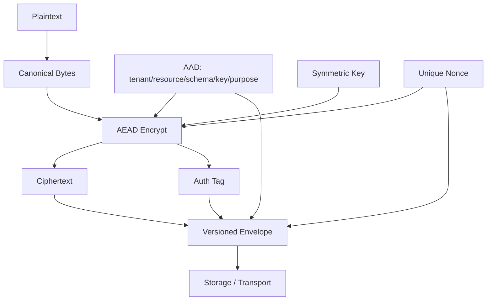
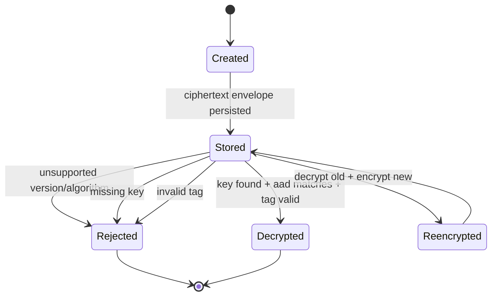
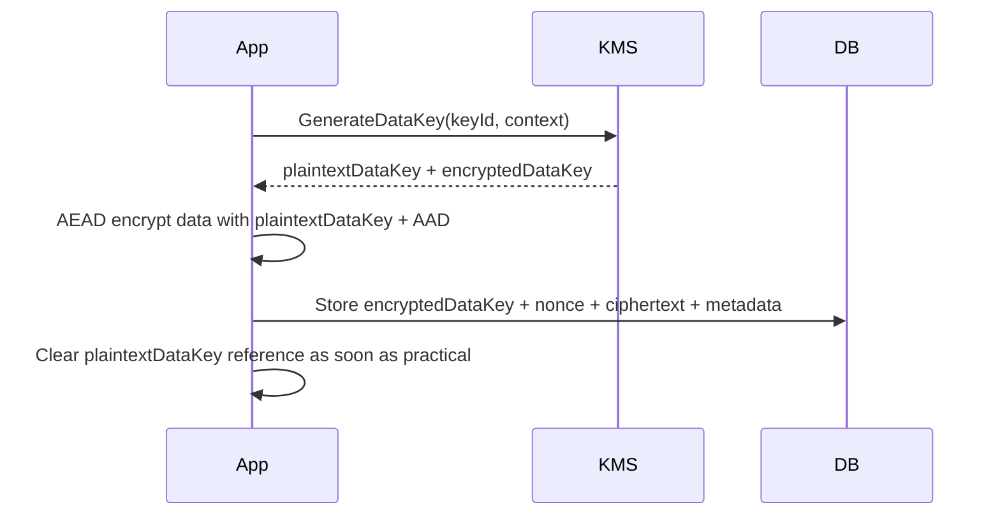
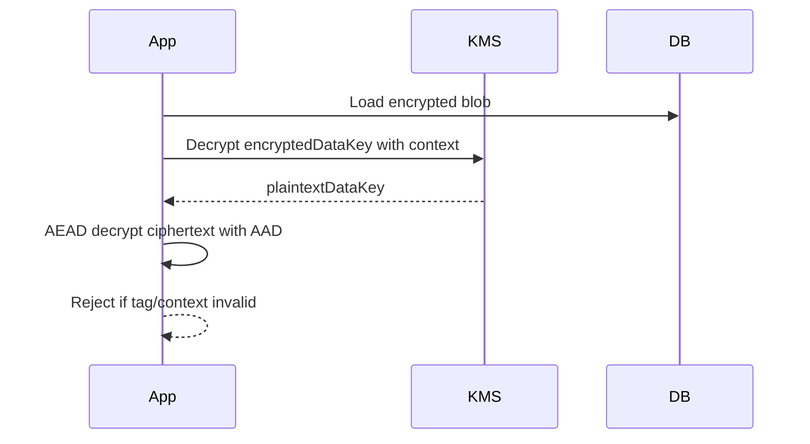
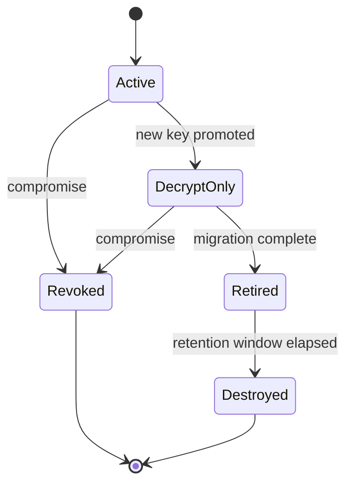
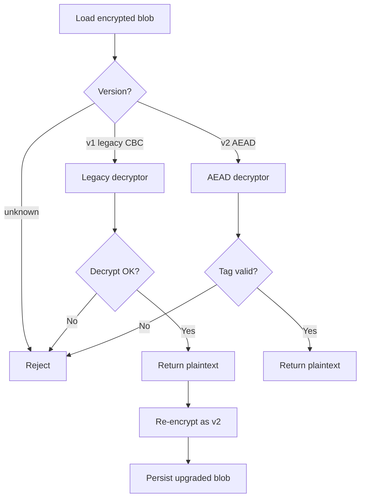

# Part 013 — Symmetric Encryption and AEAD

Symmetric encryption is the workhorse of application cryptography. It protects data with a shared secret key: the same key, or closely related key material, is used to encrypt and decrypt.

In production Java systems, symmetric encryption usually appears in these forms:

- encrypting sensitive database fields;
- encrypting payloads before storing them in object storage;
- encrypting tokens or state that must not be readable by clients;
- encrypting files, exports, and backups;
- protecting service-to-service payloads when TLS is not the only control;
- implementing envelope encryption with a KMS, HSM, or internal key service.

The important mental shift: **modern encryption is not just confidentiality**. If the system cannot detect tampering, the system is not safely encrypted. For most application-level encryption, the default primitive should be an **AEAD** mode: Authenticated Encryption with Associated Data.

Recommended defaults for modern Java service code:

1. Prefer `AES/GCM/NoPadding` when AES hardware acceleration and provider support are strong.
2. Prefer `ChaCha20-Poly1305` when supported by the runtime/provider and performance or platform consistency favors it.
3. Do not use ECB.
4. Do not use unauthenticated CBC for new designs.
5. Do not invent encryption formats.
6. Treat nonce uniqueness as a security invariant, not an implementation detail.
7. Version every encrypted payload.
8. Bind ciphertext to context through AAD.

## 1. Kaufman Skill Slice

This part decomposes symmetric encryption into a small set of subskills that can be practiced deliberately.

| Subskill | What You Must Be Able To Do |
|---|---|
| Primitive selection | Choose AEAD instead of obsolete or unauthenticated modes. |
| Key separation | Avoid reusing one key for unrelated purposes. |
| Nonce discipline | Guarantee nonce uniqueness per key. |
| AAD design | Bind ciphertext to tenant, subject, resource, schema, algorithm, and key version. |
| Payload format design | Store enough metadata to decrypt safely years later. |
| Failure handling | Fail closed on invalid tags, wrong keys, wrong AAD, expired keys, or unsupported versions. |
| Rotation | Support decrypt-old/encrypt-new without downtime. |
| Testing | Prove tamper detection, nonce behavior, context binding, and migration behavior. |

The goal is not to memorize every mode. The goal is to build this reflex:

> Before writing encryption code, define the key, nonce, AAD, payload format, rotation behavior, and failure semantics.

## 2. What Problem Symmetric Encryption Actually Solves

Symmetric encryption gives confidentiality: a party without the key should not recover plaintext.

AEAD gives more:

- confidentiality of plaintext;
- integrity of ciphertext;
- authenticity relative to the holder of the key;
- integrity of additional non-encrypted metadata through AAD;
- failure signal when ciphertext, tag, key, nonce, or AAD do not match.

It does **not** automatically give:

- authorization;
- replay protection;
- non-repudiation;
- key compromise recovery;
- protection from application memory disclosure;
- protection from plaintext exposure before encryption or after decryption;
- protection from malicious authorized decryptors.

Encryption is a control inside a larger system. It is not a replacement for access control, audit, isolation, or key management.

## 3. AEAD Mental Model

AEAD has four conceptual inputs:

```text
ciphertext, tag = encrypt(key, nonce, plaintext, associatedData)
plaintext       = decrypt(key, nonce, ciphertext, tag, associatedData)
```

`associatedData` is authenticated but not encrypted. If AAD changes, decryption fails.

Typical AAD examples:

```text
tenantId
resourceType
resourceId
fieldName
schemaVersion
algorithmVersion
keyId
purpose
issuer
audience
createdAt bucket
```

AAD prevents dangerous context confusion:

- ciphertext from tenant A being copied into tenant B;
- ciphertext for `email` being replayed into `bankAccountNumber`;
- encrypted refresh token being interpreted as encrypted password reset token;
- a blob encrypted under schema v1 being accepted as schema v3;
- payload encrypted for one business purpose being reused for another.

### AEAD Flow



The security invariant:

> The decryptor must reconstruct exactly the same AAD that the encryptor used. Any mismatch must fail closed.

## 4. Why ECB Is Broken

ECB encrypts identical plaintext blocks into identical ciphertext blocks under the same key. This leaks structure.

Bad transformation:

```java
Cipher.getInstance("AES/ECB/PKCS5Padding"); // Do not use
```

ECB is not just “less ideal”. It is categorically wrong for application data. It leaks patterns and gives no integrity.

## 5. Why CBC Is Not the Modern Default

CBC can be safe only when composed correctly with unpredictable IVs, authentication, and careful padding error handling. In real systems, it is often misused:

- static IV;
- IV derived from key or plaintext;
- no MAC;
- MAC checked after decryption or after parsing;
- padding oracle through error/timing behavior;
- custom encrypt-then-MAC format implemented inconsistently.

For new Java application designs, use AEAD instead of CBC.

A migration from CBC should be treated as a compatibility project, not a new design baseline.

## 6. AES-GCM in Java

AES-GCM is a widely used AEAD mode. It combines AES in counter-like mode with a Galois field authentication tag.

Important rules:

1. Use a 96-bit nonce/IV for normal GCM usage.
2. Never reuse a nonce with the same key.
3. Use a 128-bit authentication tag unless you have a strong protocol-specific reason not to.
4. Call `updateAAD(...)` before `doFinal(...)`.
5. Treat `AEADBadTagException` as a security failure.
6. Do not catch tag failure and return partial plaintext.
7. Do not log plaintext, key, nonce-derived internals, or decrypted secrets.

### Minimal AES-GCM Envelope

```java
public record EncryptedBlob(
        int version,
        String algorithm,
        String keyId,
        byte[] nonce,
        byte[] ciphertext
) {}
```

With Java providers, the authentication tag is usually appended to the ciphertext returned by `doFinal` for GCM.

### AES-GCM Encrypt Example

```java
import javax.crypto.Cipher;
import javax.crypto.SecretKey;
import javax.crypto.spec.GCMParameterSpec;
import java.security.SecureRandom;
import java.util.Arrays;

public final class AesGcmCrypto {
    private static final String TRANSFORMATION = "AES/GCM/NoPadding";
    private static final int NONCE_BYTES = 12;       // 96 bits
    private static final int TAG_BITS = 128;
    private final SecureRandom random = new SecureRandom();

    public EncryptedBlob encrypt(
            SecretKey key,
            String keyId,
            byte[] plaintext,
            byte[] aad
    ) throws Exception {
        byte[] nonce = new byte[NONCE_BYTES];
        random.nextBytes(nonce);

        Cipher cipher = Cipher.getInstance(TRANSFORMATION);
        cipher.init(Cipher.ENCRYPT_MODE, key, new GCMParameterSpec(TAG_BITS, nonce));
        cipher.updateAAD(aad);

        byte[] ciphertextWithTag = cipher.doFinal(plaintext);

        return new EncryptedBlob(
                1,
                TRANSFORMATION,
                keyId,
                nonce,
                ciphertextWithTag
        );
    }

    public byte[] decrypt(
            SecretKey key,
            EncryptedBlob blob,
            byte[] aad
    ) throws Exception {
        if (blob.version() != 1) {
            throw new UnsupportedOperationException("Unsupported encrypted blob version");
        }
        if (!TRANSFORMATION.equals(blob.algorithm())) {
            throw new UnsupportedOperationException("Unsupported encryption algorithm");
        }
        if (blob.nonce() == null || blob.nonce().length != NONCE_BYTES) {
            throw new IllegalArgumentException("Invalid nonce length");
        }

        Cipher cipher = Cipher.getInstance(TRANSFORMATION);
        cipher.init(Cipher.DECRYPT_MODE, key, new GCMParameterSpec(TAG_BITS, blob.nonce()));
        cipher.updateAAD(aad);

        return cipher.doFinal(blob.ciphertext());
    }
}
```

This is a teaching example, not the complete production abstraction. A production abstraction needs key lookup, algorithm policy, metrics, audit events, zeroization strategy where practical, and strict envelope encoding.

## 7. Nonce Discipline

Nonce reuse with AEAD can be catastrophic. In GCM, reusing a nonce with the same key can break confidentiality and authentication.

The key invariant:

> For a given AEAD key, the system must never encrypt two different plaintexts with the same nonce.

Three practical strategies:

| Strategy | Use Case | Risk |
|---|---|---|
| Random 96-bit nonce | Common service encryption | Collision probability must be managed by key lifetime/volume. |
| Counter-based nonce | High-volume controlled encryptor | Requires durable monotonic counter and concurrency correctness. |
| KMS-managed encryption | Envelope encryption / centralized crypto | Offloads nonce/key handling to managed service, but still requires envelope correctness. |

For most field/blob encryption with moderate volume per key, random 96-bit nonces from `SecureRandom` are practical. For very high-volume systems, random nonce collision analysis and key rotation limits must be explicit.

### Nonce Anti-Patterns

Do not do this:

```java
byte[] nonce = new byte[12]; // all zero
```

Do not do this:

```java
byte[] nonce = userId.getBytes(StandardCharsets.UTF_8); // predictable and likely reused
```

Do not do this:

```java
byte[] nonce = Arrays.copyOf(key.getEncoded(), 12); // derived from key
```

Do not do this:

```java
byte[] nonce = MessageDigest.getInstance("SHA-256")
        .digest(plaintext); // deterministic and reveals equality
```

## 8. AAD Design

AAD is one of the most underused features of AEAD.

Bad AAD:

```text
empty byte array
```

Better AAD:

```text
series=learn-java-security
purpose=customer-pii-field
tenant=tenant-123
entity=Customer
field=email
schema=v3
keyId=kms-key-2026-06
algorithm=AES-GCM-256
```

AAD should be canonical bytes. Avoid ad-hoc string concatenation without escaping or structure.

Example canonical AAD object:

```java
public record EncryptionContext(
        String purpose,
        String tenantId,
        String resourceType,
        String resourceId,
        String fieldName,
        int schemaVersion,
        String keyId,
        String algorithm
) {}
```

Canonicalization rule:

```java
public interface AadEncoder {
    byte[] encode(EncryptionContext context);
}
```

Use deterministic JSON with stable property order, CBOR with canonical encoding, protobuf with deterministic serialization, or a strict length-prefixed binary format.

Avoid:

```java
String aad = tenantId + resourceId + fieldName;
```

This can create ambiguity:

```text
tenant=ab, resource=c
tenant=a,  resource=bc
```

## 9. Payload Format

An encrypted blob must be self-describing enough to support safe decryption later.

Recommended envelope fields:

```text
magic/version
algorithm id
key id
nonce
ciphertext with tag
AAD schema id or context fields
created at
optional compression marker
optional tenant/purpose marker
```

Example compact JSON envelope:

```json
{
  "v": 1,
  "alg": "AES-GCM-256",
  "kid": "customer-pii-2026-06",
  "nonce": "base64url...",
  "ct": "base64url..."
}
```

Do not rely on external metadata only. External metadata can be lost during export, queueing, object copy, backup restore, or manual remediation.

### Envelope State Machine



Decryption must not silently degrade to a weaker algorithm or ignore AAD.

## 10. Key Management Boundary

Symmetric encryption is only as safe as key management.

The application should not casually own long-lived master keys in source code, config files, or environment variables.

Common production designs:

| Design | Description | Trade-Off |
|---|---|---|
| Direct app key | App loads raw key from secret store | Simple, but high blast radius. |
| Envelope encryption | Data encrypted with data key; data key wrapped by KMS/HSM | Good rotation and audit model. |
| KMS encrypt/decrypt | KMS performs crypto operation | Simpler API, potential latency/cost limits. |
| HSM-backed provider | Java provider routes crypto to HSM/PKCS#11 | Strong key isolation, operational complexity. |

Envelope encryption is often the best application-level pattern.



For decryption:



## 11. Key Rotation Model

Key rotation must be designed before the first encrypted record is written.

Core concepts:

```text
active encryption key: used for new writes
accepted decryption keys: used for old reads
retired key: cannot encrypt, may decrypt for migration window
revoked key: cannot decrypt except break-glass/forensic process
```

A clean rotation flow:

1. Add new key to key registry.
2. Mark new key as active for encryption.
3. Keep old key available for decryption.
4. Re-encrypt old data opportunistically or through batch migration.
5. Monitor old key usage.
6. Retire old key after usage approaches zero.
7. Revoke/destroy old key according to policy.

### Rotation State



If you do not store `keyId` in the envelope, rotation becomes guesswork.

## 12. Replay and Freshness

AEAD detects tampering. It does not detect replay by itself.

If replay matters, include freshness or sequence constraints outside or inside AAD:

- message id;
- monotonic sequence;
- created timestamp with bounded acceptance window;
- nonce registry for high-risk operations;
- request id bound to server-side state;
- one-time token record.

Example: encrypted password reset token.

AEAD can protect the token body, but the system still needs:

- expiration;
- one-time use;
- subject binding;
- purpose binding;
- revocation on password change;
- audit trail;
- replay detection.

AAD can bind `purpose=password-reset`, but replay control must be explicit.

## 13. Compression Before Encryption

Compression can leak information when an attacker can influence plaintext and observe ciphertext length. This class of risks is visible in compression side-channel attacks against protocols and web contexts.

Application rule:

> Do not compress attacker-controlled and secret data together before encryption unless the leakage model has been reviewed.

Safe-ish use cases:

- offline backup compression where attacker cannot adaptively influence plaintext and observe many outputs;
- large internal files with no attacker-controlled prefix/suffix interaction;
- batch archival with separate side-channel review.

Risky use cases:

- encrypted cookies containing secrets and attacker-controlled fields;
- web responses compressed before TLS with reflected attacker input and secret tokens;
- encrypted API tokens whose length is observable and attacker-influenced.

## 14. Streaming and Large Payloads

AEAD APIs usually authenticate at finalization. This matters for streaming.

A dangerous mistake:

```text
read decrypted bytes from stream
parse/process them incrementally
only later discover auth tag failure
```

If your API exposes plaintext before the tag is verified, an attacker may influence partial processing.

For large files:

1. Use a vetted streaming AEAD construction or library.
2. Encrypt in independent chunks with per-chunk nonces and sequence-bound AAD.
3. Authenticate manifest metadata.
4. Do not process plaintext chunks until their chunk tag is verified.
5. Include chunk number, total size, file id, and algorithm version in AAD.

Chunk AAD example:

```text
fileId=export-2026-06-28-001
chunkIndex=42
chunkSize=1048576
schema=v1
algorithm=AES-GCM-256
keyId=file-export-key-2026-06
```

## 15. Error Handling

Decryption failures are security events, not normal parsing failures.

Distinguish these internally:

| Failure | Likely Cause | External Response |
|---|---|---|
| Unsupported version | Old/new software mismatch | Generic failure |
| Unsupported algorithm | Policy mismatch or tampering | Generic failure |
| Missing key | rotation/config issue | Generic failure |
| Invalid tag | tampering, wrong key, wrong AAD, corruption | Generic failure |
| Malformed envelope | corruption or attack | Generic failure |

Externally, avoid detailed oracle behavior:

```text
Invalid encrypted payload
```

Internally, log safe structured metadata:

```json
{
  "event": "crypto.decrypt.failed",
  "reason": "invalid_tag",
  "algorithm": "AES-GCM-256",
  "keyId": "customer-pii-2026-06",
  "tenantIdHash": "...",
  "resourceType": "Customer"
}
```

Never log plaintext, raw key bytes, or full secret-bearing ciphertext unless a formal forensic process allows it.

## 16. Migration From Legacy Encryption

Legacy encrypted data usually cannot be fixed instantly. You need an incremental migration strategy.

Example old envelope:

```json
{
  "alg": "AES-CBC-PKCS5Padding",
  "iv": "...",
  "ct": "..."
}
```

Migration strategy:

1. Freeze legacy encryption for new writes.
2. Add versioned decryptor for legacy records.
3. Encrypt all new writes with AEAD.
4. On read, decrypt old then re-encrypt new if policy allows.
5. Run batch migration for cold data.
6. Measure remaining legacy population.
7. Remove legacy decryptor only after retention policy allows.

### Migration Decision Flow



Do not silently downgrade if AEAD decryption fails.

## 17. Testing Strategy

Security tests must include negative cases. Happy-path crypto tests are not enough.

### Required Unit Tests

| Test | Expected Result |
|---|---|
| decrypt valid blob with correct AAD | success |
| flip one ciphertext bit | failure |
| flip one tag bit | failure |
| change tenant AAD | failure |
| change field name AAD | failure |
| change key id without changing key lookup | failure or unsupported |
| use wrong key | failure |
| use malformed nonce | failure |
| unsupported version | failure |
| unsupported algorithm | failure |

### Example Tamper Test

```java
@Test
void decryptRejectsTamperedCiphertext() throws Exception {
    EncryptedBlob blob = crypto.encrypt(key, "kid-1", plaintext, aad);

    byte[] tampered = blob.ciphertext().clone();
    tampered[0] ^= 0x01;

    EncryptedBlob tamperedBlob = new EncryptedBlob(
            blob.version(),
            blob.algorithm(),
            blob.keyId(),
            blob.nonce(),
            tampered
    );

    assertThrows(Exception.class, () -> crypto.decrypt(key, tamperedBlob, aad));
}
```

### Property-Like Tests

For many random plaintexts:

```text
decrypt(encrypt(p, aad), aad) == p
```

For many random plaintexts and random AAD mutations:

```text
decrypt(encrypt(p, aad1), aad2) fails when aad1 != aad2
```

For many ciphertext mutations:

```text
decrypt(mutated(encrypt(p, aad)), aad) fails
```

## 18. Operational Metrics

Track crypto behavior without leaking secrets.

Useful metrics:

```text
crypto.encrypt.count{algorithm,keyId,purpose}
crypto.decrypt.count{algorithm,keyId,purpose}
crypto.decrypt.failure.count{reason,algorithm,keyId,purpose}
crypto.legacy.decrypt.count{algorithm,purpose}
crypto.rotation.old_key_usage{keyId,purpose}
crypto.kms.latency{operation,keyId}
crypto.kms.error.count{operation,reason}
```

Alert on:

- spike in invalid tags;
- old key still used after migration deadline;
- unsupported algorithm attempts;
- KMS decrypt failures;
- sudden increase in missing key errors;
- encryption using a retired key.

## 19. Common Anti-Patterns

### Anti-Pattern: Encryption Without Integrity

```java
Cipher.getInstance("AES/CBC/PKCS5Padding");
```

Risk: ciphertext tampering, padding oracle, malleability.

Better: AEAD.

### Anti-Pattern: One Global Application Key

```text
APP_SECRET_KEY encrypts all tenants, all fields, all purposes, forever
```

Risk: one compromise exposes everything and rotation is painful.

Better: key hierarchy, purpose-specific keys, envelope encryption, rotation.

### Anti-Pattern: AAD Is Empty

Risk: ciphertext can be copied across context.

Better: bind tenant, resource, field, schema, purpose, algorithm, key id.

### Anti-Pattern: Decrypt Then Authorize

Bad flow:

```text
load encrypted object -> decrypt -> parse -> then check whether caller can access it
```

Better flow:

```text
authenticate -> authorize metadata/resource -> decrypt -> parse -> enforce domain invariant
```

Do not decrypt secrets for callers who are not authorized to access the resource.

### Anti-Pattern: Swallowing Decryption Errors

```java
try {
    return decrypt(blob);
} catch (Exception e) {
    return new byte[0];
}
```

This converts security failures into ambiguous application behavior.

Better: fail closed, log safe metadata, emit alert if appropriate.

## 20. Design Review Questions

Before approving an encryption design, ask:

1. What asset is protected?
2. Who can encrypt?
3. Who can decrypt?
4. Where are plaintext bytes present?
5. Where are keys present?
6. What is the AEAD algorithm?
7. How is the nonce generated?
8. What prevents nonce reuse per key?
9. What is in AAD?
10. How is AAD canonicalized?
11. What is the envelope format?
12. Is the envelope versioned?
13. How is `keyId` stored?
14. How are keys rotated?
15. What happens when a key is missing?
16. What happens when tag validation fails?
17. Can ciphertext be replayed in another context?
18. Does decryption happen before authorization?
19. Are failures observable without leaking secrets?
20. How is migration from legacy encryption handled?

## 21. Production Checklist

Use this as the PR/review checklist.

- [ ] Uses AEAD, not ECB/CBC for new data.
- [ ] Uses provider-supported algorithm names, not custom crypto.
- [ ] Uses fresh nonce per encryption.
- [ ] Nonce uniqueness strategy is documented.
- [ ] AAD binds tenant/resource/field/schema/purpose/key/algorithm.
- [ ] AAD encoding is canonical.
- [ ] Envelope is versioned.
- [ ] Envelope stores algorithm id and key id.
- [ ] Decryption rejects unsupported versions.
- [ ] Decryption rejects unsupported algorithms.
- [ ] Decryption fails closed on invalid tag.
- [ ] No plaintext/key is logged.
- [ ] Key management boundary is explicit.
- [ ] Key rotation path exists.
- [ ] Legacy algorithm migration path exists if relevant.
- [ ] Negative tests cover tampering, wrong AAD, wrong key, malformed envelope.
- [ ] Metrics distinguish crypto failure reasons internally.
- [ ] Authorization occurs before decryption when metadata allows it.

## 22. Practice Drill

Implement a small encryption library with this API:

```java
public interface FieldEncryptor {
    EncryptedBlob encrypt(String tenantId, String entity, String field, byte[] plaintext);
    byte[] decrypt(String tenantId, String entity, String field, EncryptedBlob blob);
}
```

Requirements:

1. AES-GCM with 96-bit random nonce.
2. AAD contains tenant, entity, field, version, algorithm, and key id.
3. Envelope contains version, algorithm, key id, nonce, ciphertext.
4. Wrong tenant must fail.
5. Wrong field must fail.
6. Tampered ciphertext must fail.
7. Unsupported algorithm must fail.
8. Old key can decrypt, but new encryption uses active key.

Stretch requirement:

- Add `Reencryptor` that upgrades old blobs to the active key.

## 23. Key Takeaways

- Symmetric encryption is the main primitive for protecting application data at rest and in payloads.
- Modern Java designs should default to AEAD.
- AEAD protects confidentiality and detects tampering.
- AAD is how you bind ciphertext to business/security context.
- Nonce reuse under the same key is a critical failure.
- Payloads must be versioned and self-describing.
- Key rotation must be designed before production data exists.
- Decryption failure is a security event.
- Encryption does not replace authorization, replay protection, or audit.

## References

- Oracle, Java Cryptography Architecture Reference Guide, Java SE 25.
- Oracle, `javax.crypto.Cipher` API documentation.
- NIST SP 800-38D, Recommendation for Block Cipher Modes of Operation: Galois/Counter Mode and GMAC.
- RFC 5116, An Interface and Algorithms for Authenticated Encryption.
- RFC 7539 / RFC 8439, ChaCha20 and Poly1305 for IETF Protocols.
- OpenJDK JEP 329, ChaCha20 and Poly1305 Cryptographic Algorithms.
