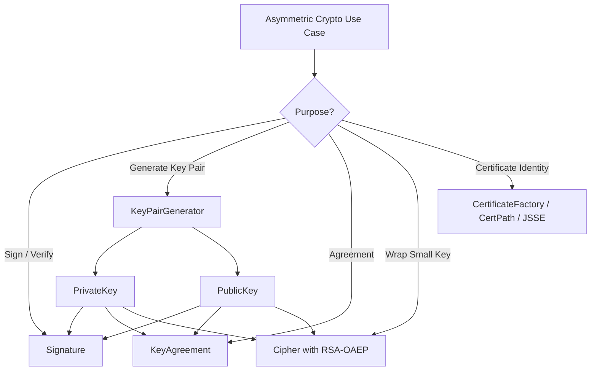
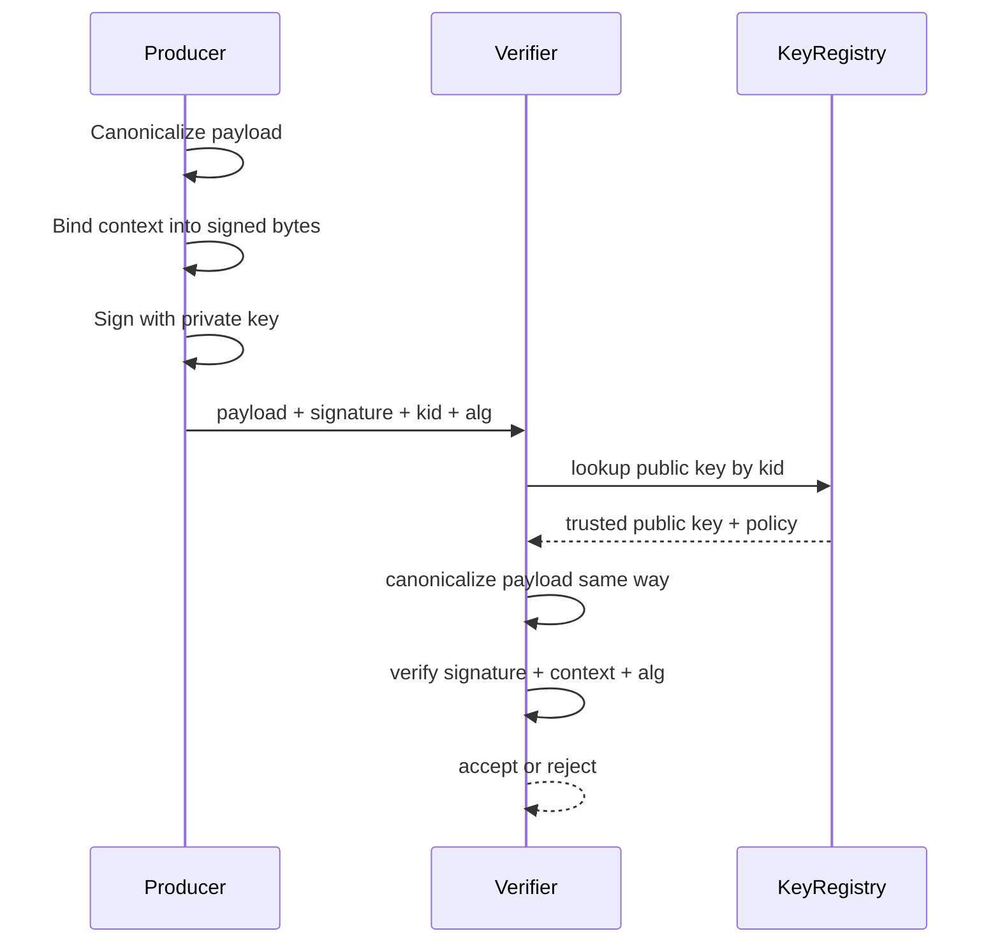
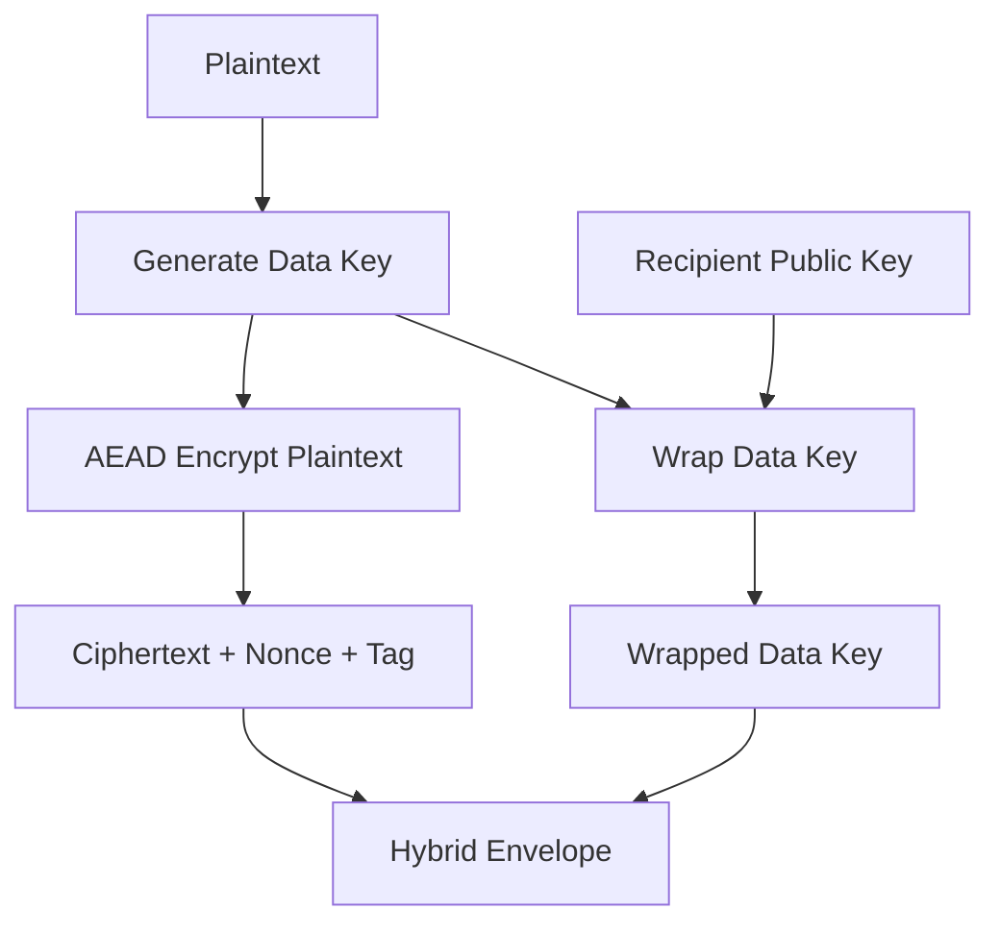
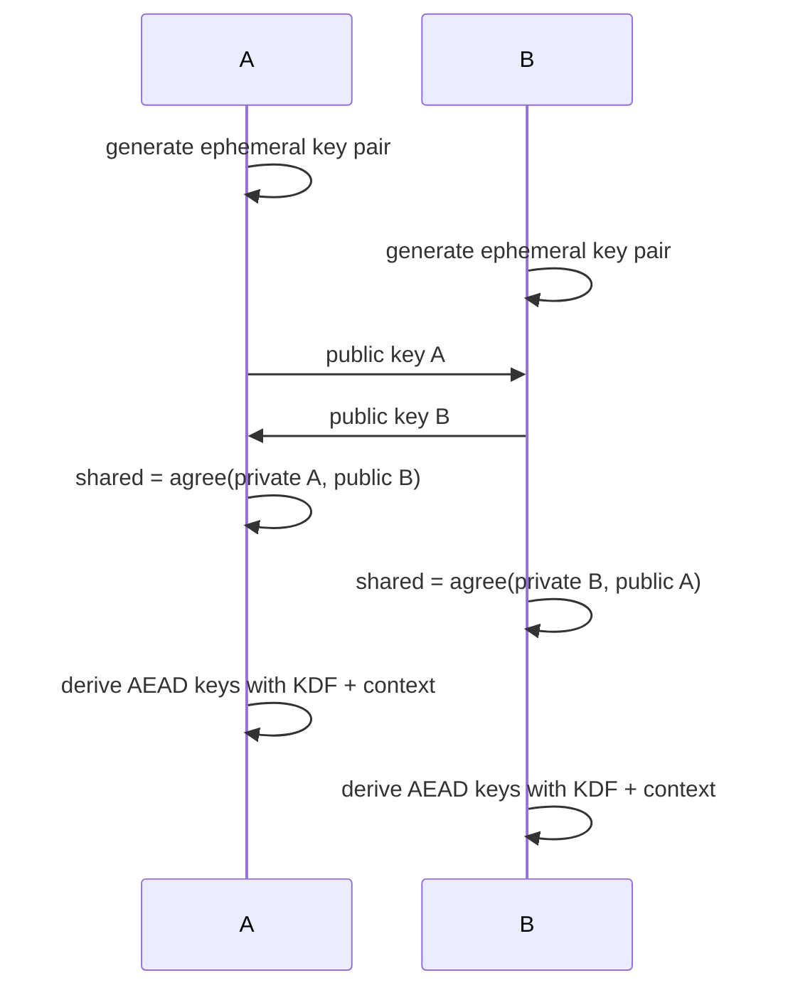
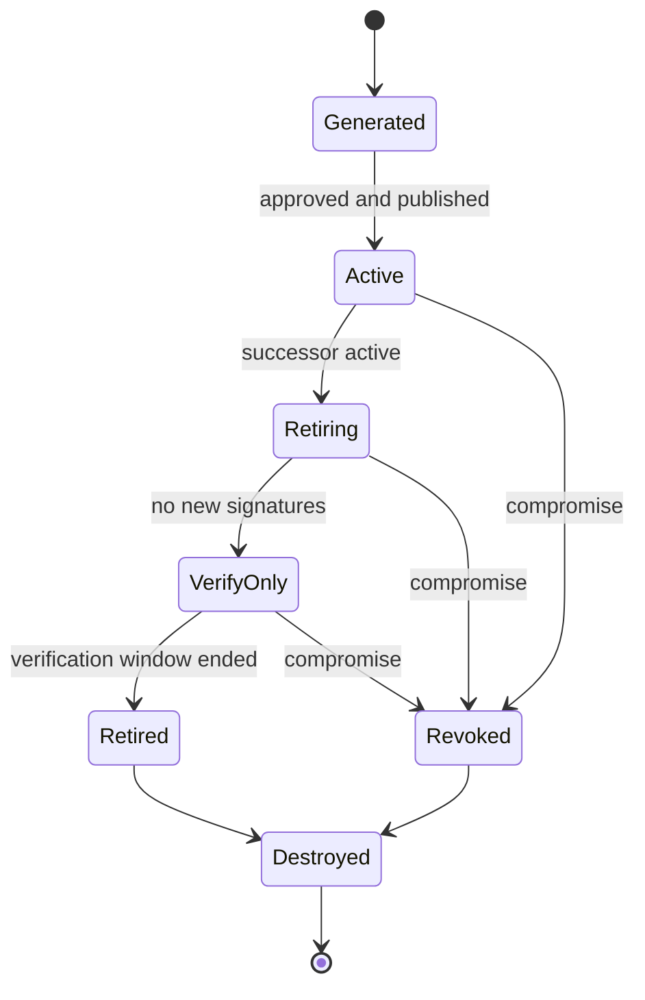

# Part 014 — Asymmetric Cryptography

Asymmetric cryptography uses a key pair: a public key and a private key. The public key can be distributed. The private key must remain secret.

In Java systems, asymmetric cryptography is commonly used for:

- digital signatures;
- verifying signed tokens, artifacts, or messages;
- certificate-based identity;
- TLS and mTLS;
- key agreement;
- wrapping or transporting symmetric keys;
- artifact signing and supply-chain integrity;
- non-repudiation-oriented workflows, with caveats;
- offline verification where the verifier must not possess the signing key.

The first mental correction:

> Asymmetric crypto is not “stronger symmetric crypto”. It solves different distribution, authentication, and trust problems.

Do not use asymmetric encryption for bulk data. Use it to establish trust, sign data, agree on keys, or wrap symmetric keys. Then use symmetric AEAD for the actual payload.

## 1. Kaufman Skill Slice

This part decomposes asymmetric cryptography into practical subskills.

| Subskill | What You Must Be Able To Do |
|---|---|
| Choose purpose | Distinguish signing, encryption, and key agreement. |
| Select algorithm | Prefer modern schemes and avoid obsolete padding/modes. |
| Represent keys safely | Understand public/private key encodings and key metadata. |
| Sign correct bytes | Canonicalize payloads and bind signature context. |
| Verify correctly | Use correct algorithm, key, context, and fail-closed behavior. |
| Design hybrid encryption | Use public-key crypto to protect data keys, not large data. |
| Plan agility | Version algorithm, key id, and signature/envelope format. |
| Model compromise | Know what happens when private keys leak or public keys are substituted. |

The goal: when you see `Signature`, `KeyPairGenerator`, `KeyAgreement`, or RSA `Cipher`, you should immediately ask: **what trust problem is this solving?**

## 2. Three Different Jobs

Asymmetric cryptography is often misused because teams collapse three jobs into one vague phrase: “public-key encryption”.

### 2.1 Digital Signature

```text
signature = sign(privateKey, message)
valid     = verify(publicKey, message, signature)
```

Purpose:

- authenticity;
- integrity;
- signer accountability relative to key control;
- offline verification;
- artifact/message trust.

Examples:

- signed domain events;
- signed JARs/artifacts;
- signed webhook requests;
- signed JWT/JWS;
- signed audit checkpoints;
- signed policy bundles.

### 2.2 Public-Key Encryption / Key Wrapping

```text
wrappedKey = encrypt(publicKey, dataKey)
dataKey    = decrypt(privateKey, wrappedKey)
```

Purpose:

- only holder of private key can unwrap/decrypt;
- often used to protect a symmetric data key;
- not used for large payloads.

Examples:

- RSA-OAEP wrapping an AES key;
- client uploads encrypted data key for server;
- offline envelope encryption.

### 2.3 Key Agreement

```text
sharedSecret = agree(myPrivateKey, peerPublicKey)
```

Purpose:

- two parties derive shared secret over insecure channel;
- usually followed by KDF and AEAD;
- core idea behind modern secure channels.

Examples:

- ECDH/X25519-style key exchange;
- TLS internals;
- application-specific secure channel designs, only when justified.

## 3. Decision Table

| Requirement | Primitive Category | Java API |
|---|---|---|
| Prove message came from private-key holder | Signature | `java.security.Signature` |
| Verify artifact or event offline | Signature | `Signature` |
| Protect a small symmetric key for recipient | Public-key encryption / wrapping | `javax.crypto.Cipher` with RSA-OAEP or KMS/HSM API |
| Encrypt large payload | Symmetric AEAD | `Cipher` with AES-GCM/ChaCha20-Poly1305 |
| Establish shared secret with peer | Key agreement | `javax.crypto.KeyAgreement` |
| Authenticate server/client identity | Certificates/TLS | JSSE / CertPath / X.509 APIs |

## 4. Java API Map



Important separation:

- `Signature` is for signing and verifying.
- `Cipher` with RSA is for encryption/wrapping, not signing.
- `KeyAgreement` is for deriving shared secrets.
- `KeyPairGenerator` creates key pairs.
- `KeyFactory` reconstructs keys from encoded specs.
- `CertificateFactory` reads certificates, not generic keys.

## 5. Algorithm Families

### RSA

RSA is mature and widely supported. Modern RSA usage must choose safe schemes:

- signatures: RSASSA-PSS for new designs where possible;
- encryption/wrapping: RSA-OAEP;
- avoid raw RSA;
- avoid RSA/ECB/PKCS1Padding for new encryption designs;
- use sufficient key size according to current policy;
- version padding/hash/MGF parameters explicitly.

Java transformation examples:

```java
Cipher.getInstance("RSA/ECB/OAEPWithSHA-256AndMGF1Padding");
```

The `ECB` token in RSA transformation names is a historical naming artifact in Java provider syntax, not block cipher ECB mode for bulk data. Still, prefer explicit OAEP transformations and provider policy checks.

### ECDSA

ECDSA is widely deployed, especially in certificates and signatures. It is sensitive to nonce quality. Bad randomness can leak the private key.

For new application-level signatures, consider EdDSA where provider/runtime support and interoperability are available.

### EdDSA / Ed25519

EdDSA, especially Ed25519, is attractive for application signatures:

- deterministic signing;
- compact keys/signatures;
- simpler parameter surface;
- good performance;
- less nonce-footgun than ECDSA.

Java supports EdDSA in modern JDKs through standard algorithm names such as `Ed25519`, depending on provider availability.

Example:

```java
Signature.getInstance("Ed25519");
```

### ECDH / XDH

Elliptic-curve Diffie-Hellman style algorithms are used for key agreement. Modern curves such as X25519 are common in protocols. In Java, check provider support and standard algorithm names for your JDK baseline.

The output of key agreement is not usually used directly as an AES key. It should go through a KDF with explicit context.

## 6. Digital Signature Mental Model

A signature proves that a specific private key signed specific bytes under a specific algorithm.

It does **not** automatically prove:

- the human intended the action;
- the signer was authorized;
- the private key was not compromised;
- the signed object is fresh;
- the public key belongs to the expected actor;
- the data means what the verifier thinks it means.

Signature security requires:

1. trusted public key binding;
2. canonical payload bytes;
3. context binding;
4. algorithm policy;
5. key lifecycle;
6. replay/freshness control;
7. fail-closed verification.

### Signature Flow



## 7. Sign the Right Bytes

The most common signature design mistake is signing bytes whose meaning is unstable.

Bad idea:

```text
sign(object.toString())
```

Bad idea:

```text
sign(raw JSON from whichever serializer happened to run today)
```

Better:

- define a canonical representation;
- include purpose/domain separation;
- include schema version;
- include key id or algorithm metadata outside and/or inside signed context;
- include timestamp or nonce if freshness matters;
- include tenant/resource/audience when context confusion matters.

Example signed context:

```json
{
  "sig_v": 1,
  "purpose": "payment-approval-event",
  "tenant": "tenant-123",
  "event_id": "evt-2026-000001",
  "issued_at": "2026-06-28T08:15:00Z",
  "payload_hash_alg": "SHA-256",
  "payload_hash": "base64url..."
}
```

Then sign canonical bytes of the context plus payload hash.

## 8. Ed25519 Signing Example

```java
import java.nio.charset.StandardCharsets;
import java.security.KeyPair;
import java.security.KeyPairGenerator;
import java.security.PrivateKey;
import java.security.PublicKey;
import java.security.Signature;

public final class Ed25519Signatures {

    public KeyPair generate() throws Exception {
        KeyPairGenerator generator = KeyPairGenerator.getInstance("Ed25519");
        return generator.generateKeyPair();
    }

    public byte[] sign(PrivateKey privateKey, byte[] canonicalMessage) throws Exception {
        Signature signature = Signature.getInstance("Ed25519");
        signature.initSign(privateKey);
        signature.update(canonicalMessage);
        return signature.sign();
    }

    public boolean verify(PublicKey publicKey, byte[] canonicalMessage, byte[] detachedSignature)
            throws Exception {
        Signature verifier = Signature.getInstance("Ed25519");
        verifier.initVerify(publicKey);
        verifier.update(canonicalMessage);
        return verifier.verify(detachedSignature);
    }

    public static byte[] canonicalMessage(String purpose, String payload) {
        return ("purpose=" + purpose + "\n" + "payload=" + payload + "\n")
                .getBytes(StandardCharsets.UTF_8);
    }
}
```

This is intentionally small. In production, replace string concatenation with canonical encoding and include version, key id, tenant/resource/audience, and freshness fields as required.

## 9. RSA-PSS Signature Example

RSA-PSS is preferable to legacy PKCS#1 v1.5 signatures for new systems when interoperability allows.

```java
import java.security.*;
import java.security.spec.MGF1ParameterSpec;
import java.security.spec.PSSParameterSpec;

public final class RsaPssSignatures {
    private static final PSSParameterSpec PSS_SHA256 = new PSSParameterSpec(
            "SHA-256",
            "MGF1",
            MGF1ParameterSpec.SHA256,
            32,
            1
    );

    public KeyPair generate() throws Exception {
        KeyPairGenerator generator = KeyPairGenerator.getInstance("RSA");
        generator.initialize(3072);
        return generator.generateKeyPair();
    }

    public byte[] sign(PrivateKey privateKey, byte[] message) throws Exception {
        Signature signer = Signature.getInstance("RSASSA-PSS");
        signer.setParameter(PSS_SHA256);
        signer.initSign(privateKey);
        signer.update(message);
        return signer.sign();
    }

    public boolean verify(PublicKey publicKey, byte[] message, byte[] signatureBytes)
            throws Exception {
        Signature verifier = Signature.getInstance("RSASSA-PSS");
        verifier.setParameter(PSS_SHA256);
        verifier.initVerify(publicKey);
        verifier.update(message);
        return verifier.verify(signatureBytes);
    }
}
```

The parameters are part of the signature policy. Store or infer them through a strict algorithm version, not ambiguous runtime defaults.

## 10. Verification Must Be Fail-Closed

Verification is often accidentally weakened by application logic.

Bad:

```java
if (!verify(signature)) {
    log.warn("Signature invalid, continuing for compatibility");
}
process(payload);
```

Better:

```java
if (!verify(signature)) {
    throw new SecurityException("Invalid signature");
}
process(payload);
```

But also avoid leaking detailed verification oracles externally:

```text
Invalid signed message
```

Internal logs can distinguish:

```text
unknown key id
unsupported algorithm
signature mismatch
expired signing key
payload canonicalization failure
replay detected
```

## 11. Public Key Trust Is the Real Problem

Signature verification is only meaningful if the verifier knows whose public key it is using.

Public key substitution attack:

```text
Attacker sends: payload + signature + attacker's public key
Verifier checks signature against supplied public key
Verifier accepts
```

This is not verification. It is self-attestation.

Correct model:

```text
payload + signature + keyId
verifier looks up keyId in trusted registry
verifier checks key is allowed for purpose/tenant/algorithm/time
verifier verifies signature
```

Trusted public key binding can come from:

- certificate chain;
- pinned key registry;
- JWKS endpoint with issuer/audience policy and cache controls;
- internal key registry;
- artifact transparency log;
- manually provisioned trust anchor;
- HSM/KMS-backed signing key metadata.

Part 016 will go deeper into PKI and certificate path validation.

## 12. Hybrid Encryption

Asymmetric encryption is not for large payloads. Use hybrid encryption:

1. Generate random data encryption key.
2. Encrypt payload with symmetric AEAD.
3. Wrap data key with recipient public key or KMS.
4. Store wrapped key plus AEAD envelope.



Envelope fields:

```json
{
  "v": 1,
  "enc_alg": "AES-GCM-256",
  "wrap_alg": "RSA-OAEP-SHA256-MGF1",
  "recipient_kid": "recipient-key-2026-06",
  "nonce": "...",
  "wrapped_key": "...",
  "ciphertext": "..."
}
```

## 13. RSA-OAEP Key Wrapping Example

```java
import javax.crypto.Cipher;
import javax.crypto.SecretKey;
import javax.crypto.spec.OAEPParameterSpec;
import javax.crypto.spec.PSource;
import java.security.PrivateKey;
import java.security.PublicKey;
import java.security.spec.MGF1ParameterSpec;

public final class RsaOaepKeyWrap {
    private static final String TRANSFORMATION = "RSA/ECB/OAEPPadding";

    private static final OAEPParameterSpec OAEP_SHA256 = new OAEPParameterSpec(
            "SHA-256",
            "MGF1",
            MGF1ParameterSpec.SHA256,
            PSource.PSpecified.DEFAULT
    );

    public byte[] wrap(PublicKey recipientPublicKey, SecretKey dataKey) throws Exception {
        Cipher cipher = Cipher.getInstance(TRANSFORMATION);
        cipher.init(Cipher.WRAP_MODE, recipientPublicKey, OAEP_SHA256);
        return cipher.wrap(dataKey);
    }

    public SecretKey unwrap(PrivateKey privateKey, byte[] wrappedKey) throws Exception {
        Cipher cipher = Cipher.getInstance(TRANSFORMATION);
        cipher.init(Cipher.UNWRAP_MODE, privateKey, OAEP_SHA256);
        return (SecretKey) cipher.unwrap(wrappedKey, "AES", Cipher.SECRET_KEY);
    }
}
```

Provider behavior differs. In production, test exact JDK/provider behavior for OAEP parameters, supported transformations, and interoperability.

## 14. Key Agreement Mental Model

Key agreement lets two parties derive a shared secret without transmitting that secret.



Security requirements:

- authenticate peer public keys;
- use fresh ephemeral keys when forward secrecy matters;
- use KDF before AEAD key use;
- bind protocol transcript/context into KDF;
- prevent downgrade;
- reject invalid public keys;
- avoid designing custom secure channels unless necessary.

Most application teams should use TLS/mTLS rather than designing their own key agreement protocol.

## 15. Key Encoding and Storage

Java key interfaces:

```text
PublicKey
PrivateKey
SecretKey
```

Common encodings:

| Key Type | Common Encoding | Java Spec |
|---|---|---|
| Public key | X.509 SubjectPublicKeyInfo | `X509EncodedKeySpec` |
| Private key | PKCS#8 | `PKCS8EncodedKeySpec` |
| Certificate | X.509 certificate | `CertificateFactory` |
| Symmetric key | Raw bytes / provider-specific | `SecretKeySpec` |

Example reconstruct public key:

```java
import java.security.KeyFactory;
import java.security.PublicKey;
import java.security.spec.X509EncodedKeySpec;

public PublicKey readPublicKey(byte[] encoded) throws Exception {
    KeyFactory factory = KeyFactory.getInstance("Ed25519");
    return factory.generatePublic(new X509EncodedKeySpec(encoded));
}
```

Example reconstruct private key:

```java
import java.security.KeyFactory;
import java.security.PrivateKey;
import java.security.spec.PKCS8EncodedKeySpec;

public PrivateKey readPrivateKey(byte[] encoded) throws Exception {
    KeyFactory factory = KeyFactory.getInstance("Ed25519");
    return factory.generatePrivate(new PKCS8EncodedKeySpec(encoded));
}
```

Do not store private keys as plain files casually. Use keystores, KMS, HSM, sealed secret mechanisms, or provider-backed keys where appropriate.

Part 018 will go deep into keystores, KMS, HSM, and secrets.

## 16. Algorithm Agility

Every signed or encrypted envelope should include enough metadata to support future migration.

For signatures:

```json
{
  "sig_v": 1,
  "alg": "Ed25519",
  "kid": "signing-key-2026-06",
  "payload_hash_alg": "SHA-256",
  "signature": "base64url..."
}
```

For RSA-PSS:

```json
{
  "sig_v": 2,
  "alg": "RSASSA-PSS-SHA256-MGF1-SALT32",
  "kid": "rsa-signing-2026-06",
  "signature": "base64url..."
}
```

For hybrid encryption:

```json
{
  "v": 1,
  "enc_alg": "AES-GCM-256",
  "wrap_alg": "RSA-OAEP-SHA256-MGF1",
  "recipient_kid": "...",
  "sender_kid": "..."
}
```

Do not rely on provider defaults as protocol. Defaults are implementation details, not durable security contracts.

## 17. Private Key Protection

Private keys have high blast radius.

Protection controls:

- generate keys in secure environment;
- prefer HSM/KMS-backed non-exportable keys for high-value signing;
- restrict key usage by purpose;
- maintain key inventory;
- rotate keys intentionally;
- log signing operations without logging sensitive payloads;
- require approval workflows for key export if export is allowed at all;
- separate signing keys by environment;
- use short-lived credentials to access signing service;
- monitor abnormal signing volume;
- support emergency key revocation.

### Key Lifecycle



A signing key should not remain active indefinitely just because rotation is inconvenient.

## 18. Replay and Freshness for Signatures

A valid signature can still be replayed.

Example:

```text
POST /transfer
payload signed correctly
attacker captures payload+signature
attacker resubmits it later
```

Signature verification says: “this payload was signed.” It does not say: “this request is fresh and unused.”

Add freshness controls:

- nonce stored server-side;
- timestamp with strict window;
- event id uniqueness;
- sequence number;
- idempotency key;
- expiration time;
- audience and purpose binding;
- resource version binding.

Signed request context example:

```json
{
  "purpose": "partner-api-request",
  "method": "POST",
  "path": "/v1/transfers",
  "body_sha256": "...",
  "timestamp": "2026-06-28T08:15:30Z",
  "nonce": "f3a2...",
  "audience": "payments-api-prod"
}
```

The verifier must check signature **and** freshness.

## 19. Common Anti-Patterns

### Anti-Pattern: User-Supplied Public Key Means Trusted Identity

Bad:

```text
request contains publicKey
request contains signature
verify with provided publicKey
accept caller as trusted
```

Better:

```text
request contains keyId
server resolves keyId from trusted registry
server verifies key is allowed for this issuer/audience/purpose
server verifies signature
```

### Anti-Pattern: Signing Non-Canonical JSON

Bad:

```java
signature.update(objectMapper.writeValueAsBytes(map));
```

If map ordering, formatting, null handling, number formatting, or serializer version changes, signatures become unstable.

Better: define canonical JSON, deterministic protobuf, canonical CBOR, or sign a stable hash over a formally defined representation.

### Anti-Pattern: RSA Encrypting the Whole Payload

Bad:

```text
RSA encrypt 5 MB file
```

Better:

```text
AES-GCM encrypt file
RSA-OAEP wrap AES key
```

### Anti-Pattern: One Signing Key for Everything

Bad:

```text
same key signs login tokens, webhook requests, build artifacts, audit checkpoints
```

Better:

```text
separate keys by purpose and environment
```

### Anti-Pattern: Algorithm Taken From Untrusted Header

Bad:

```text
header says alg=none or alg=weaker-compatible-mode
verifier obeys header blindly
```

Better:

```text
key registry defines allowed algorithm for key/purpose
header is checked against policy, not trusted as authority
```

### Anti-Pattern: Verification Failure Becomes Warning

Bad:

```text
signature invalid -> warn -> continue
```

Better:

```text
signature invalid -> reject -> audit safe metadata
```

## 20. Testing Strategy

### Signature Tests

| Test | Expected Result |
|---|---|
| valid signature with trusted key | accept |
| valid signature with untrusted key | reject |
| modified payload | reject |
| modified context | reject |
| wrong algorithm | reject |
| unknown key id | reject |
| retired signing key for new message | reject or policy-specific failure |
| verify-only old key for historical message | accept if within policy |
| expired timestamp | reject |
| replayed nonce | reject |

### RSA-OAEP Wrapping Tests

| Test | Expected Result |
|---|---|
| wrap with public key, unwrap with matching private key | success |
| unwrap with wrong private key | failure |
| tamper wrapped key | failure |
| use unsupported OAEP params | failure |
| unwrap under revoked key | failure |

### Key Agreement Tests

| Test | Expected Result |
|---|---|
| both parties derive same secret | success |
| different peer key | different secret |
| invalid public key | reject |
| KDF context mismatch | derived keys differ / decrypt fails |
| downgraded parameters | reject |

## 21. Operational Observability

Metrics:

```text
signature.sign.count{keyId,purpose,algorithm}
signature.verify.count{keyId,purpose,algorithm,result}
signature.verify.failure.count{reason,keyId,purpose,algorithm}
key.wrap.count{recipientKeyId,algorithm}
key.unwrap.failure.count{reason,recipientKeyId,algorithm}
key.registry.lookup.failure.count{reason,kid}
```

Alerts:

- spike in invalid signatures;
- signing volume anomaly;
- verification attempts with unknown key ids;
- use of deprecated algorithm;
- verification using key past policy window;
- unwrap failures after key rotation;
- public key registry change outside deployment window.

## 22. Design Review Questions

Ask these before approving asymmetric crypto design:

1. Is this signing, encryption/wrapping, or key agreement?
2. Why is asymmetric crypto needed here?
3. What data is signed or encrypted?
4. Is the payload canonicalized?
5. What context is bound to the signature?
6. How does verifier obtain trusted public key?
7. Can attacker substitute public key?
8. Is algorithm chosen by trusted policy or untrusted header?
9. Are algorithm parameters versioned?
10. Does signature include freshness/replay controls if needed?
11. What is the key lifecycle?
12. How are private keys protected?
13. What happens if private key leaks?
14. How is key rotation handled?
15. How are old signatures verified after rotation?
16. How are revoked keys treated?
17. What is logged on sign/verify?
18. Are failed verifications rejected consistently?
19. Are provider/runtime differences tested?
20. Does the design have crypto agility for future migration?

## 23. Production Checklist

- [ ] Purpose is explicit: sign, wrap, or agree.
- [ ] No raw RSA.
- [ ] RSA encryption/wrapping uses OAEP for new designs.
- [ ] RSA signatures use PSS for new designs where compatible.
- [ ] Ed25519/EdDSA considered for application signatures where supported.
- [ ] Public key trust comes from registry/cert chain/trust anchor, not user input.
- [ ] Payload bytes are canonical.
- [ ] Signature context includes purpose/audience/schema where required.
- [ ] Freshness/replay controls exist where required.
- [ ] Algorithm and key id are versioned.
- [ ] Algorithm is enforced by policy.
- [ ] Private key storage is protected.
- [ ] Key rotation and verify-only windows are defined.
- [ ] Verification failures are fail-closed.
- [ ] Metrics and audit logs avoid leaking secrets.
- [ ] Negative tests cover tampering, wrong key, unknown key, replay, and deprecated algorithm.

## 24. Practice Drill

Build a small signed event verifier.

Interface:

```java
public interface EventSigner {
    SignedEvent sign(String tenantId, String eventType, byte[] payload);
    VerifiedEvent verify(SignedEvent event);
}
```

Requirements:

1. Use Ed25519 or RSA-PSS.
2. Signed bytes include tenant id, event type, event id, issued-at timestamp, payload hash, schema version, and purpose.
3. Event contains `kid` and `alg`.
4. Verifier resolves key from trusted in-memory registry.
5. Verifier rejects unknown `kid`.
6. Verifier rejects algorithm mismatch.
7. Verifier rejects modified payload.
8. Verifier rejects expired timestamp.
9. Verifier rejects replayed event id.
10. Verifier supports old verify-only key for historical events.

Stretch requirement:

- Add key rotation: new events use active key, old events still verify with verify-only key until retention deadline.

## 25. Key Takeaways

- Asymmetric crypto solves trust and key distribution problems, not bulk encryption.
- Use signatures for authenticity and integrity.
- Use RSA-OAEP or managed key wrapping to protect small symmetric keys.
- Use key agreement only when you truly need protocol-level shared-secret establishment.
- Signing the wrong bytes is equivalent to signing the wrong statement.
- Public key trust is the core security problem in signature verification.
- Valid signatures can be replayed unless freshness is enforced.
- Algorithm agility and key lifecycle are production requirements, not optional polish.
- Private key compromise must have a predefined response plan.

## References

- Oracle, Java Cryptography Architecture Reference Guide, Java SE 25.
- Oracle, Java Security Standard Algorithm Names.
- Oracle, `java.security.Signature`, `KeyPairGenerator`, `KeyAgreement`, and `KeyFactory` API documentation.
- RFC 8017, PKCS #1: RSA Cryptography Specifications Version 2.2.
- RFC 8032, Edwards-Curve Digital Signature Algorithm.
- RFC 8410, Algorithm Identifiers for Ed25519, Ed448, X25519, and X448.
- NIST SP 800-56A, Recommendation for Pair-Wise Key-Establishment Schemes Using Discrete Logarithm Cryptography.
- NIST SP 800-56B, Recommendation for Pair-Wise Key-Establishment Schemes Using Integer Factorization Cryptography.
