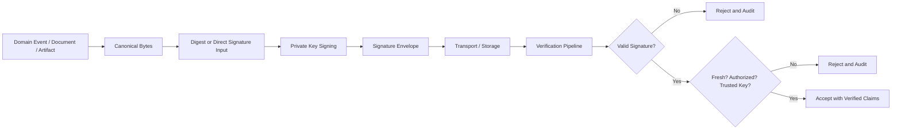
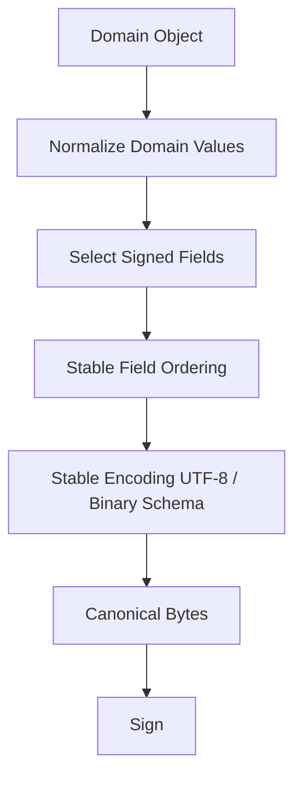
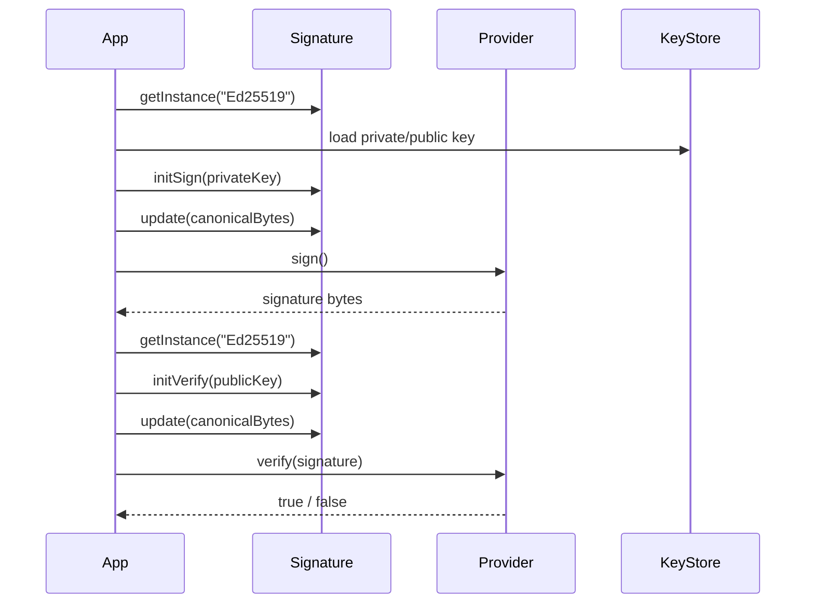
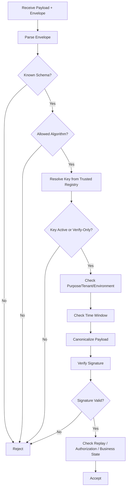
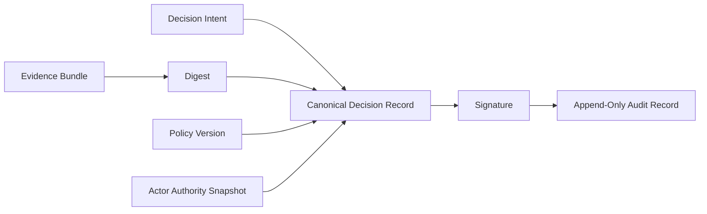

# Part 015 — Digital Signatures and Integrity

Digital signatures solve a precise problem: **given bytes, a public key, and a signature, can a verifier decide that someone controlling the corresponding private key approved those exact bytes?**

That sentence is intentionally strict. Signatures do not automatically prove human intent, business correctness, legal non-repudiation, freshness, authorization, or semantic validity. They prove that a private key was used over a specific byte sequence under a specific algorithm.

A top-level Java engineer treats signatures as a **verification protocol**, not as a method call around `Signature.getInstance(...)`.



## 1. Kaufman Skill Slice

This part decomposes digital signature engineering into a set of practical subskills.

| Subskill | What You Must Be Able To Do |
|---|---|
| Define signature purpose | Know whether you are proving artifact integrity, signer identity, delegation, approval, or message origin. |
| Choose the bytes | Convert objects/documents/events into stable canonical bytes. |
| Choose the algorithm | Select safe signature algorithms and avoid legacy options. |
| Bind context | Include tenant, environment, purpose, content type, version, and validity window where relevant. |
| Design envelope | Store algorithm, key id, signature, payload metadata, and timestamp safely. |
| Verify fail-closed | Reject on missing key, unknown algorithm, malformed envelope, expired timestamp, bad signature, or unauthorized signer. |
| Handle replay | Bind nonce, timestamp, request target, sequence, event id, or challenge. |
| Rotate keys | Support key versioning, validity windows, revocation, and old-signature verification policy. |
| Test adversarially | Write negative tests: changed bytes, swapped key, wrong algorithm, expired envelope, replayed payload. |

A signature implementation is not production-ready until it is clear which of these subskills it covers.

## 2. Integrity vs Authenticity vs Non-Repudiation

These words are often mixed together.

| Property | Meaning | Signature Relevance |
|---|---|---|
| Integrity | The bytes have not changed since signing. | Strongly supported if verification succeeds. |
| Authenticity | The signer controlled the private key. | Supported only if the public key is trusted and bound to the signer. |
| Authorization | The signer was allowed to approve this action. | Not provided by crypto; must be checked by application policy. |
| Freshness | The signed message is not stale or replayed. | Not provided unless timestamp/nonce/sequence is signed and checked. |
| Non-repudiation | A signer cannot plausibly deny the action. | Requires key custody, audit, identity proofing, policy, and legal context. |

The dangerous mistake:

> “The signature is valid, therefore the action is allowed.”

Correct model:

> “The signature is valid, therefore these bytes were signed by a trusted private key. Now we still verify purpose, signer authority, freshness, business state, and policy.”

## 3. Sign Bytes, Not Objects

Java objects are not stable signature payloads. The same logical object can have multiple byte representations depending on:

- field order;
- whitespace;
- locale;
- timezone;
- Unicode normalization;
- floating-point formatting;
- JSON serializer version;
- missing/null field rules;
- map iteration order;
- compression;
- default values;
- schema evolution.

A signature is over bytes. Therefore, a system must define a **canonicalization contract**.



### 3.1 Canonicalization Rules

A practical signed payload contract should specify:

| Rule | Example |
|---|---|
| Encoding | UTF-8, no BOM. |
| Field order | Lexicographic order or schema-defined order. |
| Time format | UTC ISO-8601 instant, no local timezone. |
| Number format | Integer minor units for money; no floating-point for signed financial amount. |
| Null handling | Either omit or include explicitly; never serializer-default ambiguity. |
| Unicode | Normalize where applicable before signing. |
| Content type | Bind `application/json; profile=...; version=...` or equivalent. |
| Domain separation | Include purpose string such as `invoice.approval.v1`, `webhook.delivery.v2`. |

### 3.2 Bad Pattern: Signing `toString()`

```java
byte[] bytes = invoice.toString().getBytes(StandardCharsets.UTF_8);
```

Why this is bad:

- `toString()` is usually for humans, not stable protocols;
- fields can be added or reordered;
- sensitive data can leak;
- the representation may change during refactoring;
- verifiers in other languages cannot reproduce it reliably.

### 3.3 Better Pattern: Explicit Canonical Representation

```java
public record SignedInvoiceApprovalV1(
        String purpose,
        String invoiceId,
        String tenantId,
        long amountMinor,
        String currency,
        Instant approvedAt,
        String approverId
) {
    public byte[] canonicalBytes() {
        String canonical = String.join("\n",
                "purpose=" + purpose,
                "invoiceId=" + invoiceId,
                "tenantId=" + tenantId,
                "amountMinor=" + amountMinor,
                "currency=" + currency,
                "approvedAt=" + approvedAt.toString(),
                "approverId=" + approverId
        );
        return canonical.getBytes(StandardCharsets.UTF_8);
    }
}
```

For high-value systems, prefer a formally specified canonical format rather than ad-hoc strings. For example, a fixed binary schema or a well-defined JSON canonicalization scheme can be better than arbitrary serializer output.

## 4. Signature Envelope Design

A detached signature alone is not enough for production use. You need metadata to know how to verify it.

```json
{
  "schema": "signature-envelope.v1",
  "purpose": "regulatory-case-decision.v1",
  "algorithm": "Ed25519",
  "keyId": "case-signing-key-2026-01",
  "signedAt": "2026-06-28T05:00:00Z",
  "expiresAt": "2026-06-29T05:00:00Z",
  "payloadDigestAlgorithm": "SHA-256",
  "payloadDigest": "base64url...",
  "signature": "base64url..."
}
```

A robust envelope usually contains:

| Field | Purpose |
|---|---|
| `schema` | Allows evolution without guessing. |
| `purpose` | Prevents cross-protocol signature reuse. |
| `algorithm` | Allows algorithm agility, but must be allowlisted. |
| `keyId` | Identifies the verification key or certificate. |
| `signedAt` | Supports time-window policy. |
| `expiresAt` | Reduces replay and stale approval risk. |
| `payloadDigestAlgorithm` | Makes digest algorithm explicit if using detached payload. |
| `payloadDigest` | Allows verification of large/external payload. |
| `signature` | The actual digital signature. |

Important invariant:

> Never let the attacker choose an algorithm that the verifier blindly accepts.

Algorithm names in envelopes are data. The verifier must map them through a local allowlist.

```java
private static final Map<String, String> ALLOWED_SIGNATURE_ALGORITHMS = Map.of(
        "ed25519.v1", "Ed25519",
        "rsa-pss-sha256.v1", "RSASSA-PSS"
);
```

## 5. Algorithm Selection

For new Java systems, strong default choices are typically:

| Use Case | Candidate | Notes |
|---|---|---|
| General signatures | Ed25519 | Simple API, deterministic signatures, good modern default where supported. |
| Existing RSA PKI | RSA-PSS with SHA-256 or stronger | Prefer PSS over older PKCS#1 v1.5 for new signatures. |
| Existing EC PKI | ECDSA with SHA-256/384 | Watch DER encoding and randomness requirements. |
| Artifact/JAR signing | Follow JDK tooling and policy | Uses JDK algorithm constraints and certificate chain rules. |
| Long-term archival | Policy-driven | Requires algorithm lifecycle and timestamping strategy. |

Avoid for new designs:

- MD5-based signatures;
- SHA-1-based signatures;
- small RSA keys;
- DSA legacy configurations;
- `NONEwithRSA` unless implementing a very specific low-level standard correctly;
- custom signature schemes;
- “encrypt with private key” terminology and mental model.

## 6. Java Signature API Mental Model

Java exposes digital signatures through `java.security.Signature`.

The lifecycle:



### 6.1 Ed25519 Example

```java
import java.nio.charset.StandardCharsets;
import java.security.KeyPair;
import java.security.KeyPairGenerator;
import java.security.Signature;
import java.util.Base64;

public final class Ed25519SignatureExample {

    public static void main(String[] args) throws Exception {
        KeyPairGenerator keyPairGenerator = KeyPairGenerator.getInstance("Ed25519");
        KeyPair keyPair = keyPairGenerator.generateKeyPair();

        byte[] message = "purpose=case.decision.v1\ncaseId=CASE-123".getBytes(StandardCharsets.UTF_8);

        Signature signer = Signature.getInstance("Ed25519");
        signer.initSign(keyPair.getPrivate());
        signer.update(message);
        byte[] signatureBytes = signer.sign();

        Signature verifier = Signature.getInstance("Ed25519");
        verifier.initVerify(keyPair.getPublic());
        verifier.update(message);
        boolean valid = verifier.verify(signatureBytes);

        System.out.println("signature=" + Base64.getUrlEncoder().withoutPadding().encodeToString(signatureBytes));
        System.out.println("valid=" + valid);
    }
}
```

For teaching purposes, this code generates an in-memory key pair. Production systems should use controlled key storage, KMS/HSM where appropriate, key identifiers, audit, and rotation.

### 6.2 RSA-PSS Example

RSA-PSS requires explicit parameter control.

```java
import java.nio.charset.StandardCharsets;
import java.security.KeyPair;
import java.security.KeyPairGenerator;
import java.security.Signature;
import java.security.spec.MGF1ParameterSpec;
import java.security.spec.PSSParameterSpec;

public final class RsaPssSignatureExample {
    private static final PSSParameterSpec PSS_SHA256 = new PSSParameterSpec(
            "SHA-256",
            "MGF1",
            MGF1ParameterSpec.SHA256,
            32,
            1
    );

    public static void main(String[] args) throws Exception {
        KeyPairGenerator generator = KeyPairGenerator.getInstance("RSA");
        generator.initialize(3072);
        KeyPair keyPair = generator.generateKeyPair();

        byte[] message = "purpose=artifact.approval.v1\nartifact=service.jar".getBytes(StandardCharsets.UTF_8);

        Signature signer = Signature.getInstance("RSASSA-PSS");
        signer.setParameter(PSS_SHA256);
        signer.initSign(keyPair.getPrivate());
        signer.update(message);
        byte[] signature = signer.sign();

        Signature verifier = Signature.getInstance("RSASSA-PSS");
        verifier.setParameter(PSS_SHA256);
        verifier.initVerify(keyPair.getPublic());
        verifier.update(message);

        if (!verifier.verify(signature)) {
            throw new SecurityException("Invalid signature");
        }
    }
}
```

Do not silently fall back from RSA-PSS to `SHA256withRSA`. A fallback can become a downgrade path.

## 7. Detached vs Attached Signatures

### 7.1 Attached Signature

Payload and signature travel together.

```json
{
  "payload": {
    "caseId": "CASE-123",
    "decision": "APPROVED"
  },
  "signatureEnvelope": {
    "algorithm": "Ed25519",
    "keyId": "case-key-2026-01",
    "signature": "..."
  }
}
```

Useful when:

- payload is small;
- signer and verifier share the same serialization contract;
- transport is simple;
- the whole object should be archived as one unit.

### 7.2 Detached Signature

Signature references external payload bytes or a digest.

```json
{
  "payloadUri": "s3://archive/case/CASE-123/decision.pdf",
  "payloadDigestAlgorithm": "SHA-256",
  "payloadDigest": "...",
  "signature": "..."
}
```

Useful when:

- payload is large;
- payload is immutable storage object;
- many signatures apply to the same payload;
- payload should not be duplicated;
- signatures must survive transport across systems.

Invariant:

> Detached signatures must bind enough payload identity to prevent substitution.

If the signature only covers `digest`, an attacker might move a valid digest into a different business context. Sign the context too.

## 8. Domain Separation

Domain separation prevents a signature created for one purpose from being valid for another.

Bad canonical bytes:

```text
caseId=CASE-123
approved=true
```

Better canonical bytes:

```text
purpose=regulatory.case.decision.approval.v1
tenantId=tenant-a
environment=production
caseId=CASE-123
approved=true
```

Why this matters:

- a signature for preview/test must not approve production;
- a signature for export must not authorize payment;
- a signature for one tenant must not be replayed in another tenant;
- a signature for one API endpoint must not be accepted by another endpoint.

## 9. Replay Protection

A valid signature can still be dangerous if it can be replayed.

| Replay Defense | When Useful |
|---|---|
| Timestamp + expiration | Webhooks, signed URLs, short-lived commands. |
| Nonce | Challenge-response and login/approval flows. |
| Sequence number | Ordered event streams. |
| Idempotency key | API command deduplication. |
| Event id uniqueness | Async signed messages. |
| One-time challenge | Human approval or device binding. |
| State transition check | Regulatory/case lifecycle systems. |

Example signed command invariant:

> A signed `APPROVE_CASE` command is accepted only if signature is valid, signer is authorized, timestamp is within 5 minutes, command id has not been used, tenant matches, and the case is currently in an approvable state.

### 9.1 Replay Cache Example

```java
public interface ReplayGuard {
    boolean rememberIfNew(String tenantId, String commandId, Instant expiresAt);
}

public final class SignedCommandVerifier {
    private final ReplayGuard replayGuard;

    public SignedCommandVerifier(ReplayGuard replayGuard) {
        this.replayGuard = replayGuard;
    }

    public void verifyReplay(String tenantId, String commandId, Instant expiresAt) {
        if (!replayGuard.rememberIfNew(tenantId, commandId, expiresAt)) {
            throw new SecurityException("Replay detected: commandId=" + commandId);
        }
    }
}
```

The replay guard must be backed by storage with atomic insert-if-absent semantics. A non-atomic check-then-insert is vulnerable under concurrency.

## 10. Key Identity and Trust

A valid signature only matters if the verification key is trusted.

A verifier needs answers to these questions:

1. Which key should verify this signature?
2. Who or what is that key bound to?
3. Is the key valid for this purpose?
4. Was the key valid at signing time?
5. Has the key been revoked or retired?
6. Is this signer authorized for this action?

### 10.1 Key ID Is Not Trust

`keyId` is an index, not proof.

Bad behavior:

```text
Envelope says keyId=attacker-key. Verifier downloads attacker-key and accepts it.
```

Better behavior:

```text
Envelope says keyId=case-signing-key-2026-01.
Verifier resolves keyId only from a trusted key registry.
Verifier checks key purpose, tenant, status, and validity window.
```

### 10.2 Key Registry Shape

```java
public record VerificationKeyRecord(
        String keyId,
        String algorithmPolicyId,
        String tenantId,
        String purpose,
        Instant notBefore,
        Instant notAfter,
        KeyStatus status,
        PublicKey publicKey
) {}

enum KeyStatus {
    ACTIVE,
    VERIFY_ONLY,
    REVOKED,
    RETIRED
}
```

A production verifier should not only fetch a public key. It should fetch the **policy attached to that key**.

## 11. Signature Verification Pipeline

A robust verification pipeline should be explicit.



Notice the separation:

- envelope validation;
- key policy validation;
- cryptographic verification;
- authorization;
- replay/business-state validation.

Keeping these steps separate makes failures easier to audit and test.

## 12. Error Handling

Signature verification errors are security events, but not all should have the same external response.

| Failure | External Response | Internal Audit Detail |
|---|---|---|
| Malformed envelope | Generic invalid request | parse error, schema, source. |
| Unknown algorithm | Generic invalid signature | algorithm value, source. |
| Unknown key id | Generic invalid signature | key id, tenant, source. |
| Revoked key | Generic invalid signature | key id, revocation reason. |
| Expired signature | Generic invalid signature | signedAt/expiresAt/skew. |
| Bad signature | Generic invalid signature | key id, algorithm, digest. |
| Replay | Generic invalid request | command id/event id, first seen. |

Do not tell attackers whether they guessed a valid key id, valid algorithm, or valid signer.

## 13. Logging and Audit

Never log:

- private keys;
- raw secrets;
- full sensitive payloads;
- bearer tokens;
- password reset links;
- high-risk PII inside signed payloads unless explicitly approved and protected.

Do log, where appropriate:

- signature envelope schema;
- key id;
- algorithm policy id;
- signer identity after trusted resolution;
- payload digest, not full payload;
- verification result;
- replay decision;
- authorization decision id;
- correlation id;
- source system;
- failure class.

Audit event example:

```json
{
  "eventType": "signature.verification.failed",
  "reason": "BAD_SIGNATURE",
  "keyId": "case-signing-key-2026-01",
  "algorithmPolicyId": "ed25519.v1",
  "tenantId": "tenant-a",
  "payloadDigest": "sha256:...",
  "correlationId": "..."
}
```

## 14. Common Anti-Patterns

### 14.1 Signing the Wrong Thing

Signing only the body but not method/path/query headers can break signed HTTP requests.

```text
Signed: body
Not signed: HTTP method, path, query, host, content-type, timestamp
```

Attackers may replay the body to another endpoint or context.

### 14.2 Allowing Algorithm Confusion

Bad:

```java
Signature signature = Signature.getInstance(envelope.algorithm());
```

Better:

```java
String jcaAlgorithm = allowedPolicy.resolveJcaAlgorithm(envelope.algorithmPolicyId());
Signature signature = Signature.getInstance(jcaAlgorithm);
```

### 14.3 Trusting Embedded Public Keys

A payload that contains its own public key is not self-authenticating.

```json
{
  "payload": "...",
  "publicKey": "attacker-controlled",
  "signature": "valid under attacker key"
}
```

This proves only that the attacker signed their own payload.

### 14.4 Ignoring Key Purpose

A key used for TLS server authentication should not automatically be allowed to sign business approvals.

Keys need purpose constraints.

### 14.5 No Freshness Check

A signature over a valid command from last year can still verify today.

Crypto does not expire a message unless the signed protocol includes expiry and the verifier checks it.

## 15. Verification Service Design

For larger Java systems, isolate signature verification behind a domain service.

```java
public interface SignatureVerifier {
    VerifiedSignature verify(SignatureEnvelope envelope, byte[] payload);
}

public record VerifiedSignature(
        String keyId,
        String signerId,
        String tenantId,
        String purpose,
        Instant signedAt,
        String payloadDigest
) {}
```

The domain layer should not handle raw `Signature` objects everywhere. It should receive a verified, policy-checked result.

Example usage:

```java
VerifiedSignature verified = signatureVerifier.verify(envelope, payloadBytes);

authorizationService.requirePermission(
        verified.signerId(),
        "CASE_APPROVE",
        caseId
);

caseService.approve(caseId, verified.signerId(), commandId);
```

## 16. Signed Webhook Pattern

A common pattern is provider-to-consumer webhook signing.

Canonical string:

```text
webhook.delivery.v1
POST
/webhooks/payment
content-type:application/json
x-event-id:evt_123
x-timestamp:2026-06-28T05:00:00Z
sha256:base64url(payloadDigest)
```

Verification checks:

1. timestamp within skew window;
2. event id not replayed;
3. public key resolved from trusted provider registry;
4. signature valid over canonical request;
5. event type allowed;
6. payload schema valid;
7. idempotency enforced.

Java sketch:

```java
public byte[] canonicalWebhookBytes(HttpRequestView request, byte[] body) {
    String payloadDigest = Base64.getUrlEncoder().withoutPadding().encodeToString(
            sha256(body)
    );

    String canonical = String.join("\n",
            "webhook.delivery.v1",
            request.method(),
            request.path(),
            "content-type:" + request.header("content-type"),
            "x-event-id:" + request.header("x-event-id"),
            "x-timestamp:" + request.header("x-timestamp"),
            "sha256:" + payloadDigest
    );

    return canonical.getBytes(StandardCharsets.UTF_8);
}
```

## 17. Signed Regulatory Decision Pattern

For enforcement lifecycle or complex case management platforms, signatures often need to preserve an auditable decision trail.

The signed object should bind:

- case id;
- tenant/regulator id;
- decision type;
- decision version;
- actor id;
- authority/role at signing time;
- policy version;
- evidence bundle digest;
- previous decision state;
- target state;
- timestamp;
- environment;
- signature purpose.



This design prevents later ambiguity about what exactly was approved.

## 18. Testing Strategy

A signature system needs both positive and negative tests.

### 18.1 Positive Tests

- valid Ed25519 signature verifies;
- valid RSA-PSS signature verifies;
- detached payload digest matches;
- old verify-only key can verify historical payload;
- rotated active key signs new payload;
- canonical bytes are stable across JVM runs.

### 18.2 Negative Tests

- one byte changed in payload;
- field order changed;
- purpose changed;
- tenant changed;
- timestamp expired;
- unknown algorithm;
- known weak algorithm;
- unknown key id;
- revoked key;
- wrong key purpose;
- signature from another tenant;
- replayed command id;
- malformed base64;
- truncated signature;
- extra unsigned field added.

### 18.3 Golden Canonicalization Test

```java
@Test
void canonicalBytesRemainStable() {
    SignedInvoiceApprovalV1 approval = new SignedInvoiceApprovalV1(
            "invoice.approval.v1",
            "INV-123",
            "tenant-a",
            12_500,
            "USD",
            Instant.parse("2026-06-28T05:00:00Z"),
            "user-42"
    );

    String expected = """
            purpose=invoice.approval.v1
            invoiceId=INV-123
            tenantId=tenant-a
            amountMinor=12500
            currency=USD
            approvedAt=2026-06-28T05:00:00Z
            approverId=user-42""";

    assertEquals(expected, new String(approval.canonicalBytes(), StandardCharsets.UTF_8));
}
```

This test protects the protocol from accidental serializer/refactoring changes.

## 19. Operational Controls

Production signature systems need controls beyond code.

| Control | Why It Matters |
|---|---|
| Private key custody | Prevents unauthorized signing. |
| Key access audit | Shows who or what signed. |
| Separation of signing and verification | Verification services should not need private keys. |
| Key purpose policy | Prevents cross-use. |
| Rotation schedule | Limits exposure window. |
| Emergency revocation | Handles compromise. |
| Historical verification policy | Keeps old records verifiable without allowing old keys for new signatures. |
| Timestamping | Supports long-term evidence when keys/certs expire. |
| Dual control | Protects high-impact signing operations. |

## 20. Review Checklist

Use this checklist when reviewing Java signature code.

### Protocol

- [ ] Is the exact signed byte representation specified?
- [ ] Is the purpose/domain signed?
- [ ] Are tenant/environment/resource/action signed where relevant?
- [ ] Is freshness signed and checked?
- [ ] Is replay prevention implemented atomically?
- [ ] Is authorization checked after cryptographic verification?

### Algorithm

- [ ] Is the algorithm allowlisted?
- [ ] Are weak algorithms rejected?
- [ ] Are RSA-PSS parameters explicit?
- [ ] Is algorithm agility designed without downgrade?

### Key Trust

- [ ] Is `keyId` resolved only from a trusted registry?
- [ ] Is key purpose checked?
- [ ] Is key status checked?
- [ ] Is key validity window checked?
- [ ] Is revocation handled?

### Implementation

- [ ] Are malformed envelopes rejected fail-closed?
- [ ] Are errors logged safely?
- [ ] Are negative tests present?
- [ ] Are canonicalization tests present?
- [ ] Is private key material kept out of logs, heap dumps, config files, and source control?

## 21. Practice: 90-Minute Drill

Build a small Java module with:

1. `SignatureEnvelopeV1` record.
2. `CanonicalPayload` interface.
3. Ed25519 signer.
4. Verifier with allowlisted algorithm policy.
5. In-memory trusted key registry.
6. Expiry check.
7. Replay guard interface.
8. Negative tests for tampering, wrong purpose, wrong tenant, expired envelope, and replay.

The point is not to build a library. The point is to make signature verification feel like a pipeline of invariants.

## 22. Summary

Digital signatures are powerful when their boundary is precise.

Key takeaways:

- signatures verify bytes, not object meaning;
- canonicalization is part of the security protocol;
- valid signature does not imply authorization;
- freshness and replay protection must be explicitly designed;
- key id is not trust;
- algorithms must be allowlisted;
- verification should be a fail-closed pipeline;
- long-term integrity requires operational key policy, not only Java code.

In the next part, we move from raw public keys to **certificates and PKI**, where trust is no longer just “this public key” but “this public key is bound to this identity through a certificate chain rooted in a trusted anchor”.

## References

- Oracle Java Security API: `java.security.Signature`.
- Oracle Java Security Standard Algorithm Names.
- Oracle Java Cryptography Architecture Reference Guide.
- RFC 8017: PKCS #1 RSA Cryptography Specifications.
- NIST SP 800-57 Part 1 Rev. 5: Recommendation for Key Management.
- OWASP Application Security Verification Standard.
