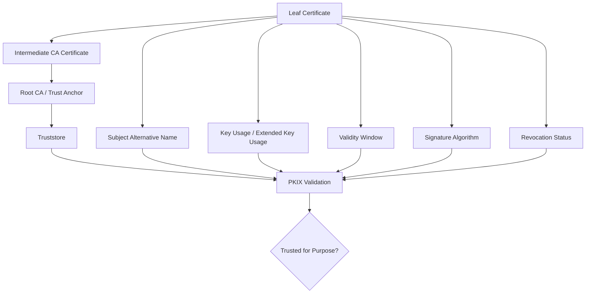
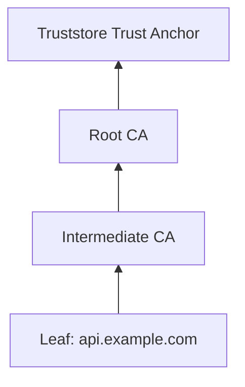
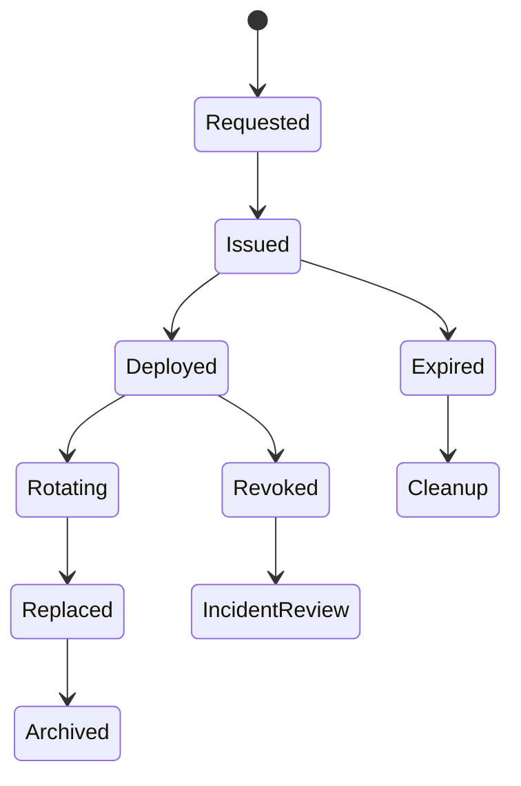

# Part 016 — Certificates, PKI, and CertPath

A raw public key can verify a signature, but it does not answer the more important question:

> Why should this public key be trusted for this identity and this purpose?

Certificates and PKI answer that question by binding a public key to an identity through signed assertions issued by certificate authorities.

In Java, this world appears through APIs like:

- `X509Certificate`;
- `CertificateFactory`;
- `CertPath`;
- `CertPathValidator`;
- `PKIXParameters`;
- `PKIXRevocationChecker`;
- `KeyStore`;
- `TrustManagerFactory`;
- JSSE/TLS configuration;
- `keytool` and `jarsigner`.

The critical mental model:

> A certificate is not trust. A certificate is a signed statement. Trust comes from validation against trusted anchors, constraints, policy, purpose, time, revocation, and identity matching.



## 1. Kaufman Skill Slice

This part decomposes PKI into practical subskills.

| Subskill | What You Must Be Able To Do |
|---|---|
| Read an X.509 certificate | Understand subject, issuer, SAN, validity, key usage, EKU, basic constraints, signature algorithm. |
| Explain a chain | Distinguish leaf, intermediate CA, root CA, trust anchor, and truststore. |
| Validate with PKIX | Use Java CertPath APIs or JSSE trust managers correctly. |
| Separate chain validation from identity matching | Know why hostname verification is not the same as certificate path validation. |
| Handle revocation | Understand OCSP, CRL, soft-fail/hard-fail, and operational trade-offs. |
| Manage truststores | Load, restrict, rotate, and audit trusted anchors. |
| Apply purpose policy | Prevent a certificate trusted for one use from being accepted for another. |
| Debug safely | Diagnose PKIX errors without disabling verification. |

## 2. Why Certificates Exist

Without certificates, public-key verification has a distribution problem.

```text
Verifier has payload + signature + public key.
Question: who says this public key belongs to service A?
```

A certificate says roughly:

```text
Issuer CA says:
  this public key belongs to subject/SAN X,
  for this time window,
  with these usages,
  under these constraints,
  and here is the CA signature over that statement.
```

A certificate chain lets the verifier connect that statement to a trust anchor it already trusts.

## 3. X.509 Certificate Anatomy

An X.509 certificate contains many fields. The ones Java engineers most often need to reason about are:

| Field | Why It Matters |
|---|---|
| Subject | Legacy identity field; often less important for TLS than SAN. |
| Subject Alternative Name | DNS/IP/URI/email identities; required for modern TLS hostname identity. |
| Issuer | Entity that signed this certificate. |
| Serial number | Unique per issuer; important for revocation. |
| Validity | `notBefore` and `notAfter`; certificate is not valid outside this interval. |
| Subject public key info | The actual public key and algorithm. |
| Signature algorithm | Algorithm used by issuer to sign certificate. |
| Basic Constraints | Whether certificate is a CA and optional path length. |
| Key Usage | What the key may be used for, e.g. digital signature, key encipherment, cert signing. |
| Extended Key Usage | Higher-level purpose, e.g. server auth, client auth, code signing. |
| Subject Key Identifier | Identifier for the subject public key. |
| Authority Key Identifier | Helps link to issuer key. |
| CRL Distribution Points | Where CRLs may be fetched. |
| Authority Information Access | Often includes OCSP responder and issuer access info. |

Java exposes these through `java.security.cert.X509Certificate`.

```java
import java.security.cert.X509Certificate;

public final class CertificateInspector {
    public static void printSummary(X509Certificate cert) throws Exception {
        System.out.println("Subject: " + cert.getSubjectX500Principal());
        System.out.println("Issuer: " + cert.getIssuerX500Principal());
        System.out.println("Serial: " + cert.getSerialNumber());
        System.out.println("Not before: " + cert.getNotBefore());
        System.out.println("Not after: " + cert.getNotAfter());
        System.out.println("Sig alg: " + cert.getSigAlgName());
        System.out.println("Public key alg: " + cert.getPublicKey().getAlgorithm());
        System.out.println("Basic constraints: " + cert.getBasicConstraints());
    }
}
```

Do not build security policy from string parsing of subject names. Prefer structured extensions such as SAN, EKU, and controlled metadata from a trusted registry.

## 4. Chain of Trust

A typical server certificate chain:



The server usually sends:

- leaf certificate;
- one or more intermediate certificates.

The client already has:

- trusted root certificates in a truststore;
- certificate validation policy;
- hostname/purpose expectations.

The root is often not sent by the server. It is already installed as a trust anchor.

## 5. Trust Anchor Is a Local Policy Decision

A trust anchor is not globally “true”. It is something your application/runtime chooses to trust.

In Java, trust anchors commonly come from:

- default JDK `cacerts` truststore;
- operating-system trust integration where applicable;
- application-specific truststore;
- internal CA bundle;
- pinned CA/public key policy;
- KMS/HSM-managed trust material;
- service mesh or platform-provided identity CA.

Important invariant:

> The smaller and more purpose-specific your truststore, the smaller your trust blast radius.

Using the global default truststore is convenient for outbound public internet TLS. It is often too broad for internal service-to-service identity.

## 6. PKIX Path Validation

PKIX validation attempts to build and validate a certificate path from a target certificate to a trusted anchor.

Validation includes checks such as:

- each certificate is signed by the next issuer;
- validity windows are acceptable;
- basic constraints permit CA signing;
- path length constraints are respected;
- key usage and extended key usage constraints are respected;
- policies and name constraints are processed where configured;
- algorithms are allowed by runtime policy;
- trust anchor is trusted;
- revocation is handled according to policy.

In Java, every implementation is required to support the `PKIX` algorithm for `CertPathValidator`.

## 7. Java CertPath API Example

This example shows the shape of explicit path validation. In many TLS use cases, JSSE handles this internally through `TrustManagerFactory`; explicit `CertPathValidator` is useful for custom certificate validation workflows, signed documents, code signing, or internal PKI tooling.

```java
import java.io.InputStream;
import java.security.KeyStore;
import java.security.cert.CertificateFactory;
import java.security.cert.CertPath;
import java.security.cert.CertPathValidator;
import java.security.cert.PKIXParameters;
import java.security.cert.X509Certificate;
import java.util.List;

public final class PkixValidationExample {

    public static void validate(
            List<X509Certificate> chainFromLeafToRoot,
            KeyStore trustStore
    ) throws Exception {
        CertificateFactory certificateFactory = CertificateFactory.getInstance("X.509");
        CertPath certPath = certificateFactory.generateCertPath(chainFromLeafToRoot);

        PKIXParameters parameters = new PKIXParameters(trustStore);
        parameters.setRevocationEnabled(false); // choose policy deliberately; do not leave as accidental default

        CertPathValidator validator = CertPathValidator.getInstance("PKIX");
        validator.validate(certPath, parameters);
    }

    public static X509Certificate readCertificate(InputStream inputStream) throws Exception {
        CertificateFactory certificateFactory = CertificateFactory.getInstance("X.509");
        return (X509Certificate) certificateFactory.generateCertificate(inputStream);
    }
}
```

Production code should make revocation policy explicit. Turning revocation off because it is operationally inconvenient may be acceptable only after conscious risk acceptance and compensating controls.

## 8. Keystore vs Truststore

Java teams often confuse these.

| Store | Contains | Used For |
|---|---|---|
| Keystore | Your private key and associated certificate chain. | Proving your identity; signing; server/client TLS identity. |
| Truststore | Trusted CA certificates or trust anchors. | Deciding whose certificates you trust. |

Example:

- service A keystore: service A private key + service A certificate chain;
- service A truststore: CAs/service identities service A trusts.

Do not put private keys in a truststore. Do not use a giant default truststore when only one internal CA should be trusted.

## 9. Key Usage and Extended Key Usage

A certificate should be valid only for intended purposes.

Common examples:

| Purpose | Relevant Constraint |
|---|---|
| TLS server | SAN DNS/IP plus EKU serverAuth. |
| TLS client / mTLS | EKU clientAuth. |
| Code signing | EKU codeSigning. |
| Certificate authority | Basic Constraints CA=true and keyCertSign usage. |
| OCSP responder | EKU OCSPSigning. |

A chain can be cryptographically valid but semantically wrong for a purpose.

Example failure:

```text
A client-auth certificate is accepted as a code-signing identity.
```

That is not a math failure. It is a policy failure.

## 10. Hostname Verification Is Separate

Certificate path validation answers:

> Is this certificate chain trusted?

Hostname verification answers:

> Is this trusted certificate valid for the DNS/IP identity I intended to reach?

Both are required for HTTPS.

Dangerous anti-pattern:

```java
// Never do this in production.
HostnameVerifier trustAll = (hostname, session) -> true;
```

Another dangerous anti-pattern:

```java
// Never do this in production.
TrustManager[] trustAllManagers = new TrustManager[] {
    new X509TrustManager() {
        public void checkClientTrusted(X509Certificate[] chain, String authType) {}
        public void checkServerTrusted(X509Certificate[] chain, String authType) {}
        public X509Certificate[] getAcceptedIssuers() { return new X509Certificate[0]; }
    }
};
```

These patterns convert TLS into encryption without authentication, making man-in-the-middle attacks possible.

## 11. JSSE TrustManagerFactory

For TLS, prefer configuring trust through `SSLContext` and `TrustManagerFactory` rather than writing certificate verification manually.

```java
import javax.net.ssl.SSLContext;
import javax.net.ssl.TrustManagerFactory;
import java.io.InputStream;
import java.security.KeyStore;

public final class SslContextFactory {

    public static SSLContext sslContextFromTruststore(
            InputStream truststoreBytes,
            char[] password
    ) throws Exception {
        KeyStore trustStore = KeyStore.getInstance("PKCS12");
        trustStore.load(truststoreBytes, password);

        TrustManagerFactory tmf = TrustManagerFactory.getInstance(
                TrustManagerFactory.getDefaultAlgorithm()
        );
        tmf.init(trustStore);

        SSLContext context = SSLContext.getInstance("TLS");
        context.init(null, tmf.getTrustManagers(), null);
        return context;
    }
}
```

This still does not remove the need for hostname verification. Good HTTP clients perform hostname verification by default. Problems usually occur when teams disable it during debugging and forget to re-enable it.

## 12. Revocation: OCSP and CRL

Certificates can be revoked before expiry.

Common reasons:

- private key compromise;
- CA compromise;
- certificate issued incorrectly;
- identity no longer valid;
- employee/device/service deprovisioned;
- domain/service ownership changed.

Mechanisms:

| Mechanism | Description | Trade-Off |
|---|---|---|
| CRL | Certificate Revocation List published periodically. | Can be large/stale; simple offline-ish model. |
| OCSP | Online Certificate Status Protocol query for certificate status. | Fresh but network-dependent; privacy and availability concerns. |
| OCSP stapling | Server provides OCSP response during TLS handshake. | Reduces client query overhead; needs server support. |
| Short-lived certificates | Expire quickly so revocation need is reduced. | Requires automated issuance/rotation. |

Java provides `PKIXRevocationChecker` for revocation checking in PKIX validation workflows.

```java
import java.security.cert.CertPathValidator;
import java.security.cert.PKIXParameters;
import java.security.cert.PKIXRevocationChecker;

public final class RevocationPolicyExample {
    public static void enableRevocation(PKIXParameters parameters) throws Exception {
        CertPathValidator validator = CertPathValidator.getInstance("PKIX");
        PKIXRevocationChecker checker =
                (PKIXRevocationChecker) validator.getRevocationChecker();

        // Pick options deliberately. SOFT_FAIL may be acceptable in some availability-sensitive paths,
        // but it is not the same as strong revocation enforcement.
        parameters.addCertPathChecker(checker);
        parameters.setRevocationEnabled(true);
    }
}
```

The engineering decision is not “OCSP good, CRL bad”. The real decision is:

> What should the system do when revocation status cannot be determined?

For high-risk actions, hard-fail may be necessary. For public web browsing, soft-fail is common because availability is critical. For internal service identity, short-lived certificates plus automated rotation can simplify revocation pressure.

## 13. Algorithm Constraints

Modern JDKs can disable or restrict weak algorithms through security properties such as:

- `jdk.certpath.disabledAlgorithms`;
- `jdk.tls.disabledAlgorithms`;
- `jdk.jar.disabledAlgorithms`;
- `jdk.disabled.namedCurves`;
- `jdk.security.legacyAlgorithms`.

This matters because old certificates or signed artifacts may fail validation after runtime upgrades.

Do not treat this as “Java broke TLS”. Usually, the runtime is refusing weak cryptography.

Operational invariant:

> Certificate and artifact signing algorithms must be inventoried before JDK upgrades.

## 14. Certificate Pinning

Pinning means restricting trust to a specific certificate, public key, or CA beyond normal truststore validation.

Forms:

| Pin Type | Meaning | Rotation Impact |
|---|---|---|
| Leaf certificate pin | Trust only exact certificate. | High breakage on renewal. |
| Public key pin | Trust same key across cert renewal. | Breaks on key rotation. |
| Intermediate CA pin | Trust a constrained issuing CA. | More flexible but broader. |
| Private/internal CA truststore | Trust your internal CA only. | Often better for internal services. |

Pinning can reduce blast radius, but it can also create outages if rotation is not designed.

Good pinning design requires:

- backup pins;
- staged rollout;
- expiration monitoring;
- emergency override process;
- clear ownership;
- test environment parity;
- explicit decision about leaf vs key vs CA pin.

For most internal Java platforms, a purpose-specific internal truststore is often safer than hardcoded leaf certificate pins.

## 15. Internal PKI and Service Identity

Internal PKI is common for mTLS, workload identity, service mesh, device identity, and private APIs.

Design questions:

1. What is the identity namespace?
2. Is identity DNS-based, URI-based, SPIFFE-like, workload-based, or application-specific?
3. Which CA issues identities?
4. How are private keys generated and stored?
5. How are certificates rotated?
6. What is the certificate lifetime?
7. How is revocation handled?
8. How is service decommissioning handled?
9. How is environment separation enforced?
10. How do you prevent one tenant/environment from being trusted as another?

Certificate identity should be mapped to application identity deliberately.

Bad mapping:

```text
Any certificate chaining to internal CA is admin.
```

Better mapping:

```text
Certificate SAN URI = spiffe://prod.example.com/ns/case-platform/sa/decision-service
maps to service principal decision-service@prod,
allowed only for decision API clientAuth.
```

## 16. Certificate Parsing Pitfalls

Avoid these mistakes:

- trusting `Subject CN` when SAN should be used;
- accepting expired certificates in production;
- ignoring EKU;
- accepting CA certificates as leaf identities;
- accepting leaf certificates as CA certificates;
- string-matching DNs without canonicalization;
- using `getSubjectDN()` legacy APIs instead of principal-aware APIs;
- assuming certificate validity implies user authorization;
- disabling verification to work around local dev issues;
- treating self-signed certificates as automatically bad or automatically trusted.

A self-signed certificate can be valid as a trust anchor if explicitly trusted. It is unsafe if accepted automatically without policy.

## 17. Common PKIX Failure Messages

Java developers frequently see errors like:

```text
PKIX path building failed
unable to find valid certification path to requested target
CertPathValidatorException: validity check failed
CertPathValidatorException: Algorithm constraints check failed
```

Interpretation:

| Error Class | Likely Cause | Safe Fix |
|---|---|---|
| Path building failed | Missing intermediate or root not trusted. | Install correct intermediate/root in truststore or fix server chain. |
| Validity check failed | Certificate expired or not yet valid. | Renew certificate or fix clock. |
| Algorithm constraints failed | Weak algorithm/key disabled by JDK policy. | Reissue certificate with stronger algorithm/key. |
| Name mismatch | SAN does not match hostname. | Fix certificate SAN or endpoint name. |
| Revocation failed | OCSP/CRL unreachable or revoked. | Fix revocation infra or policy; do not blindly disable. |

Unsafe fix:

```text
Disable certificate validation.
```

Safe mindset:

```text
Identify whether the failure is trust anchor, chain completeness, identity mismatch, expiry, revocation, algorithm policy, or clock.
```

## 18. Debugging TLS/PKI Safely

Useful runtime/debug tools:

```bash
java -Djavax.net.debug=ssl,handshake,certpath ...
```

Useful `keytool` operations:

```bash
keytool -list -v -keystore truststore.p12 -storetype PKCS12
keytool -printcert -file leaf.pem
keytool -importcert -alias internal-ca -file ca.pem -keystore truststore.p12 -storetype PKCS12
```

Use debug output carefully because it may expose sensitive operational details in logs.

Do not commit truststore passwords, private keys, or generated debug dumps to source control.

## 19. JAR Signing and Certificate Chains

Java certificates are also used in artifact signing workflows.

`jarsigner` can sign JARs using a private key and include certificate information so verifiers can validate the signature. But artifact trust is not just “signature exists”.

Questions for signed artifacts:

- who is trusted to sign releases?
- which certificate chain is trusted?
- what algorithms are allowed?
- is timestamping used?
- what happens after certificate expiry?
- are compromised signing keys revoked?
- are old artifacts still trusted?
- is the artifact digest recorded in build provenance?

Artifact signing will be covered more deeply in Part 027.

## 20. Certificate Lifecycle

A certificate lifecycle has states.



Operational requirements:

- inventory certificates;
- know owners;
- monitor expiry;
- automate renewal;
- rotate before expiry;
- preserve historical verification where needed;
- revoke compromised certificates;
- remove old trust anchors;
- test truststore rollout;
- avoid hidden certificates embedded in images or configs.

## 21. Certificate Inventory Model

A useful inventory record:

```java
public record CertificateInventoryRecord(
        String certificateId,
        String subject,
        String sanSummary,
        String issuer,
        String serialNumber,
        String environment,
        String ownerTeam,
        String purpose,
        Instant notBefore,
        Instant notAfter,
        String publicKeyAlgorithm,
        String signatureAlgorithm,
        String truststoreName,
        CertificateStatus status
) {}

enum CertificateStatus {
    REQUESTED,
    ACTIVE,
    ROTATING,
    REVOKED,
    EXPIRED,
    RETIRED
}
```

Certificate inventory prevents outages and supports incident response.

## 22. Security Review Checklist

### Certificate Content

- [ ] Does SAN contain the actual identity used by clients?
- [ ] Are validity periods appropriate?
- [ ] Are key sizes and algorithms acceptable?
- [ ] Are key usage and EKU correct?
- [ ] Are CA constraints correct?
- [ ] Is the certificate issued by the expected CA?

### Truststore

- [ ] Is the truststore purpose-specific?
- [ ] Are old roots/intermediates removed?
- [ ] Is truststore update tested before rollout?
- [ ] Is truststore content inventoried?
- [ ] Are passwords/secrets handled safely?

### Validation

- [ ] Is PKIX validation enabled?
- [ ] Is hostname verification enabled for TLS?
- [ ] Is revocation policy explicit?
- [ ] Are algorithm constraints respected?
- [ ] Is certificate purpose checked?
- [ ] Are validation failures fail-closed?

### Operations

- [ ] Is expiry monitored?
- [ ] Is rotation automated?
- [ ] Is emergency revocation documented?
- [ ] Are debug logs controlled?
- [ ] Are certificates and truststores kept out of accidental public exposure?

## 23. Practice: 90-Minute Drill

Build a small Java certificate validation lab.

1. Create a local root CA and leaf certificate using your preferred tool.
2. Import the root CA into a PKCS12 truststore.
3. Load the leaf certificate with `CertificateFactory`.
4. Validate a chain using `CertPathValidator` and `PKIXParameters`.
5. Repeat with an expired certificate and observe failure.
6. Repeat with a truststore that does not contain the root.
7. Repeat with a certificate that lacks expected EKU.
8. Document each failure as one of: chain, trust anchor, time, purpose, algorithm, revocation, or identity mismatch.

The goal is to stop treating PKIX errors as random Java pain and start classifying them by trust failure type.

## 24. Summary

Certificates are signed identity and policy statements around public keys.

Key takeaways:

- a certificate is not automatically trust;
- trust comes from local trust anchors and validation policy;
- PKIX validates chains, not business authorization;
- hostname verification is separate from chain validation;
- EKU/key usage/basic constraints matter;
- revocation is an operational policy choice;
- disabling validation is almost never a safe fix;
- truststores should be purpose-specific where possible;
- certificate lifecycle management is part of platform hardening.

In the next part, we use this PKI foundation to understand **TLS, JSSE, and mTLS** in Java production systems.

## References

- Oracle Java Security API: `java.security.cert.CertPathValidator`.
- Oracle Java Security API: `java.security.cert.PKIXParameters`.
- Oracle Java Security API: `java.security.cert.PKIXRevocationChecker`.
- Oracle Java Security API: `java.security.cert.X509Certificate`.
- Oracle Java Security Guide and Java Cryptography Architecture Reference Guide.
- RFC 5280: Internet X.509 Public Key Infrastructure Certificate and CRL Profile.
- NIST SP 800-57 Part 1 Rev. 5: Recommendation for Key Management.
- OWASP Application Security Verification Standard.
