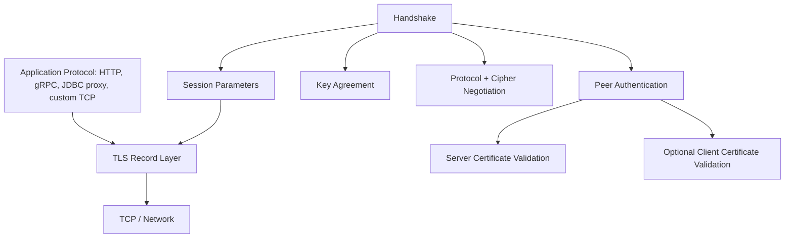
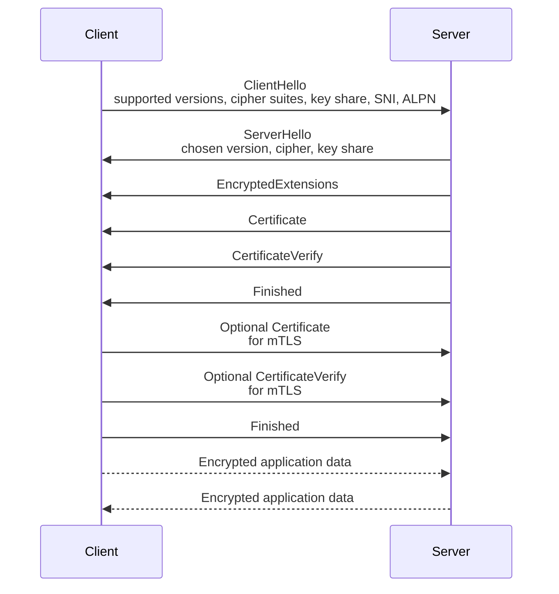
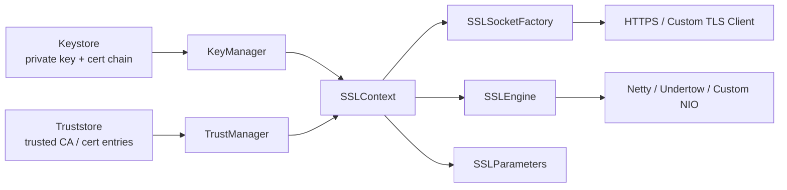
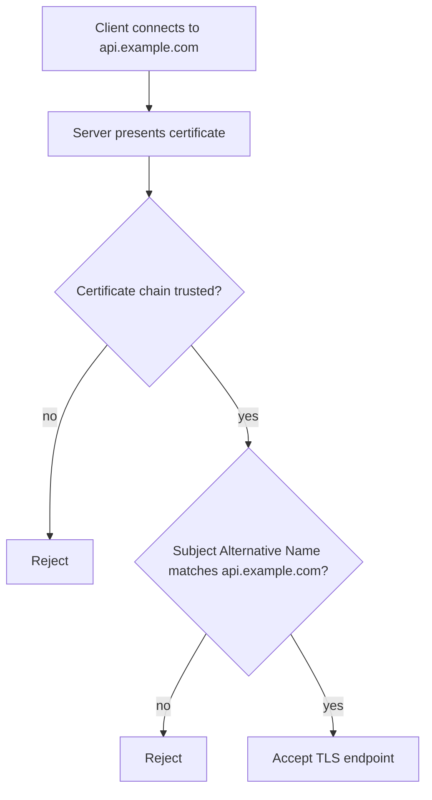
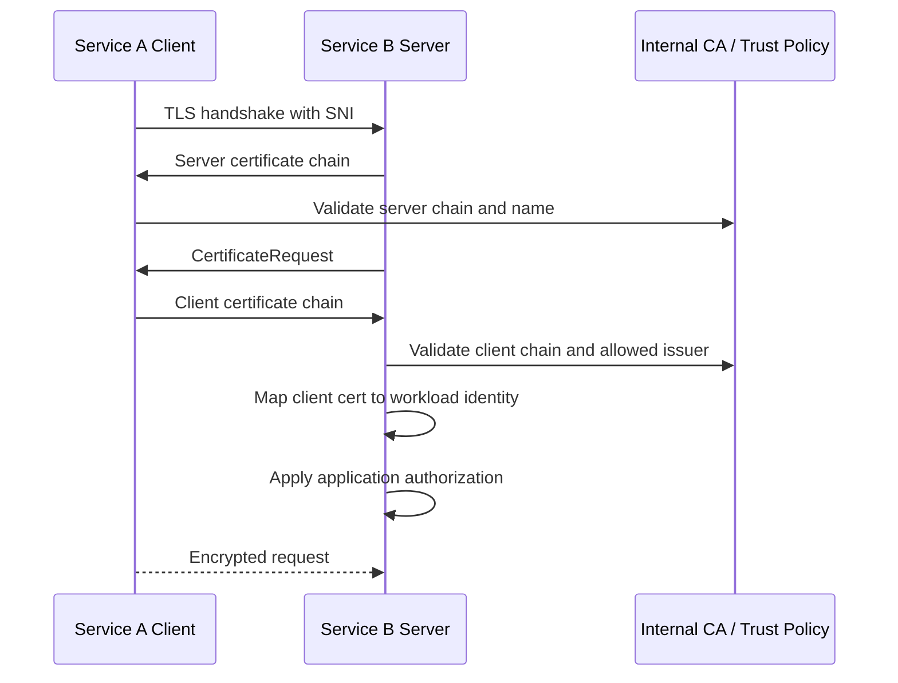
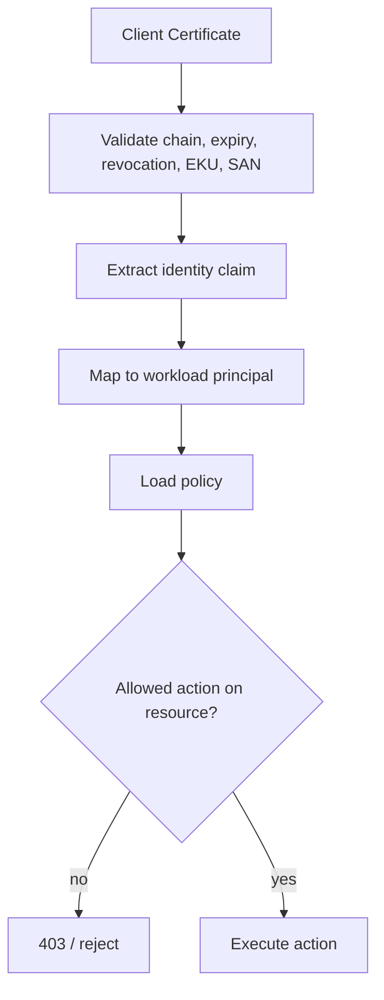
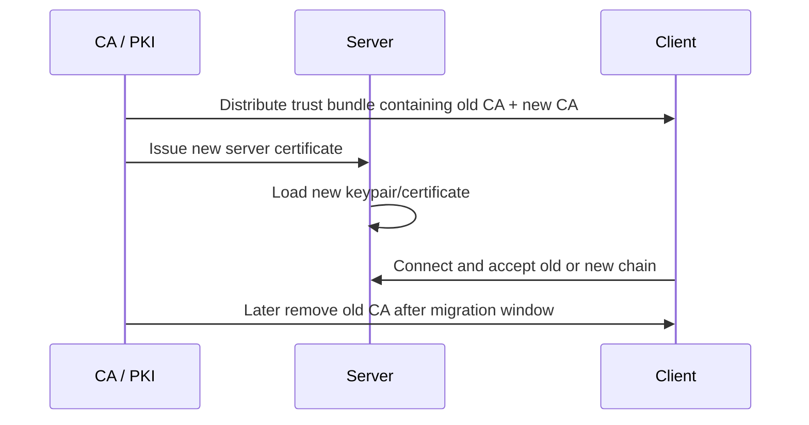
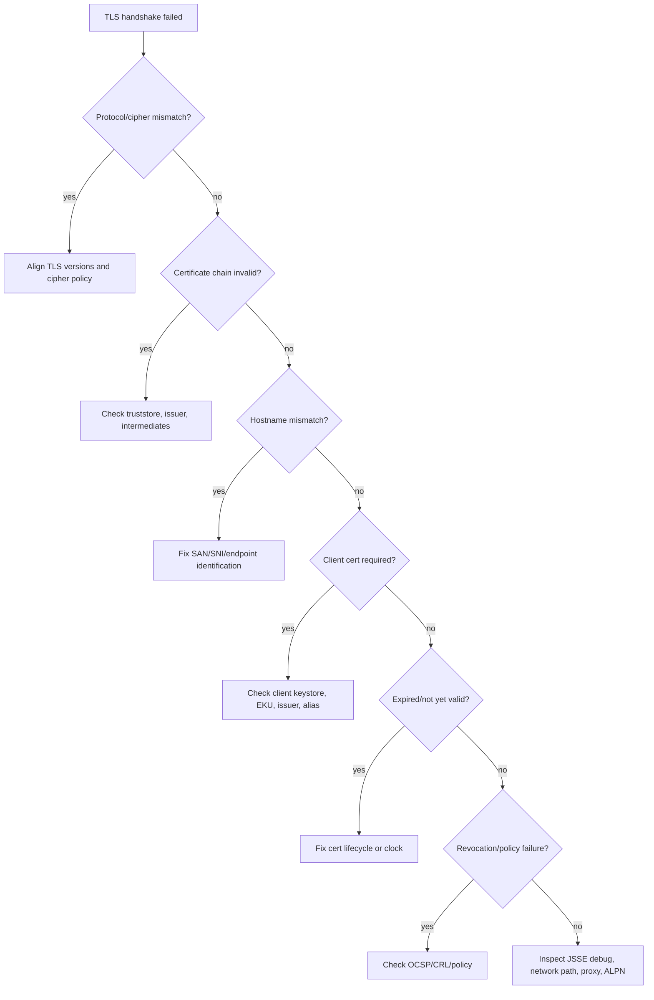
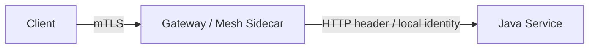

# Part 017 — TLS, JSSE, and mTLS

## 1. Why This Part Matters

TLS is often treated as a checkbox: "enable HTTPS" or "use mTLS". That mindset is dangerous.

In a real Java platform, TLS is a **transport trust boundary**. It answers several questions before application code exchanges meaningful data:

1. Am I talking to the endpoint I intended to talk to?
2. Did an attacker read the data in transit?
3. Did an attacker modify the data in transit?
4. Did both sides negotiate acceptable cryptographic parameters?
5. If mTLS is enabled, did the client also prove possession of an acceptable private key?

TLS does **not** answer these questions by itself:

1. Is the authenticated client authorized to perform this business action?
2. Is the authenticated service healthy, uncompromised, or correctly configured?
3. Is the payload semantically safe?
4. Is the downstream call idempotent?
5. Is the certificate mapped to the correct tenant, role, workload, or policy?

That distinction is the core mental model.

> TLS gives us a protected pipe and endpoint authentication. Application security still decides what the authenticated actor may do.

Java exposes TLS through **JSSE**: the Java Secure Socket Extension. JSSE provides the API and implementation framework for TLS/DTLS, including encryption, server authentication, message integrity, and optional client authentication. It is provider-based and integrates with JCA concepts such as providers, keystores, trust managers, and key managers.

## 2. Kaufman Skill Decomposition

Following Josh Kaufman's approach, we split TLS competence into small subskills that can be practiced deliberately.

| Subskill | You can self-correct when you can answer |
|---|---|
| TLS mental model | What security property does TLS provide, and what does it not provide? |
| JSSE architecture | Where do `SSLContext`, `KeyManager`, `TrustManager`, `SSLSocket`, `SSLEngine`, and `SSLParameters` fit? |
| Server authentication | How does the client validate the server certificate chain and hostname? |
| Client authentication / mTLS | How does the server request, validate, and map a client certificate? |
| Trust material design | Which CA roots are trusted by which component, and why? |
| Key material design | Which private keys exist, where are they stored, and who can use them? |
| Protocol policy | Which TLS versions, cipher suites, signature algorithms, and curves are allowed? |
| Rotation | Can certificates and trust bundles rotate without downtime? |
| Debugging | Can you diagnose handshake failures without disabling validation? |
| Operations | Can you monitor expiration, failed handshakes, identity mismatch, and weak negotiation? |

The goal is not to memorize all JSSE APIs. The goal is to form a reliable model that prevents catastrophic mistakes such as disabling hostname verification, trusting all certificates, reusing server keys as client identity, or treating mTLS as business authorization.

## 3. TLS Mental Model

TLS is a layered protocol that wraps an application protocol such as HTTP.



TLS has two major phases:

1. **Handshake phase**: peers negotiate protocol parameters, authenticate certificates, and derive shared traffic keys.
2. **Application data phase**: application bytes are encrypted and integrity-protected using negotiated keys.

A simplified TLS 1.3 flow:



TLS 1.3 is specified by RFC 8446. Its design goal is to let client/server applications communicate in a way that prevents eavesdropping, tampering, and message forgery.

## 4. JSSE Architecture

JSSE is Java's TLS framework. At a practical level, you work with these concepts:

| JSSE Concept | Responsibility |
|---|---|
| `SSLContext` | Factory for TLS sockets, engines, and parameters. Holds configured key/trust managers. |
| `KeyManager` | Chooses local key material used to authenticate this side. |
| `TrustManager` | Validates peer certificate chains. |
| `X509ExtendedTrustManager` | Trust manager variant with socket/engine context. Prefer for advanced validation. |
| `SSLSocket` | Blocking TLS socket. Easier API. |
| `SSLEngine` | Transport-independent TLS state machine. Used by high-performance frameworks. |
| `SSLParameters` | Protocols, cipher suites, endpoint identification, SNI, client-auth requirement, algorithm constraints. |
| `HttpsURLConnection` / `java.net.http.HttpClient` | Higher-level HTTP-over-TLS clients. |
| Keystore | Holds local private key/cert chain or trusted cert entries, depending on usage. |
| Truststore | Conventional name for keystore used as trust material. |

Mental model:



### 4.1 Server-side JSSE

For an inbound HTTPS or TLS server, the server usually needs:

1. A **private key**.
2. A **certificate chain** proving its service DNS name, workload identity, or SPIFFE-like identity.
3. A `KeyManager` capable of selecting that key.
4. Optionally, a `TrustManager` if the server validates client certificates for mTLS.

### 4.2 Client-side JSSE

For an outbound TLS client, the client usually needs:

1. A truststore containing acceptable trust anchors or CA roots.
2. Hostname verification / endpoint identification.
3. Optionally, a client private key and certificate chain for mTLS.

The common asymmetry:

| Side | Normal TLS | mTLS |
|---|---|---|
| Server | Presents certificate | Presents certificate and validates client certificate |
| Client | Validates server certificate + hostname | Validates server certificate + hostname and presents client certificate |

## 5. Endpoint Identification Is Not Optional

Certificate chain validation only proves that the certificate chains to a trusted issuer. It does **not** by itself prove that the certificate belongs to the host you intended to call.

You also need endpoint identification:



For raw `SSLSocket` or `SSLEngine`, Java documentation explicitly warns that applications should check peer credentials before sending data. Hostname verification can be handled during handshaking through `SSLParameters.setEndpointIdentificationAlgorithm("HTTPS")`.

Bad pattern:

```java
// Dangerous: this disables identity validation in practice.
HostnameVerifier trustEverything = (hostname, session) -> true;
```

Better pattern for raw TLS clients:

```java
SSLContext sslContext = buildSslContext(...);
SSLSocketFactory factory = sslContext.getSocketFactory();

try (SSLSocket socket = (SSLSocket) factory.createSocket("api.example.com", 443)) {
    SSLParameters parameters = socket.getSSLParameters();
    parameters.setEndpointIdentificationAlgorithm("HTTPS");
    parameters.setProtocols(new String[] { "TLSv1.3", "TLSv1.2" });
    socket.setSSLParameters(parameters);

    socket.startHandshake();

    // Send application data only after the handshake succeeds.
}
```

For `java.net.http.HttpClient`, the platform normally performs HTTPS verification for HTTPS URIs. Avoid custom trust managers unless there is a clear trust model.

## 6. mTLS Mental Model

mTLS is TLS where both sides authenticate using certificates.



mTLS gives the server a stronger signal than a bearer token in one important way: the client proves possession of a private key during the handshake. But mTLS still needs mapping and policy.

A client certificate might represent:

1. A workload identity.
2. A service account.
3. A device.
4. An organization.
5. A tenant gateway.
6. A human user certificate.

Those are different security models. Do not conflate them.

### 6.1 mTLS Is Not Authorization

A certificate says: "this peer possesses a private key corresponding to an acceptable certificate." It does not say: "this peer can approve enforcement case escalation."

For application authorization, derive a principal and evaluate policy:



Common mapping choices:

| Certificate field | Common use | Caution |
|---|---|---|
| DNS SAN | Service DNS identity | Good for service endpoint identity, but not always stable for workload identity. |
| URI SAN | Workload identity, SPIFFE-like identity | Good for service identity if governance exists. |
| Subject DN | Legacy identity mapping | Often brittle; subject naming conventions drift. |
| Issuer | CA-level grouping | Too broad by itself. |
| Serial number | Individual certificate instance | Good for revocation/audit, not stable identity. |
| Extended Key Usage | Server/client usage control | Must be validated as part of policy. |

## 7. Java mTLS Server Configuration Concepts

The exact configuration depends on your runtime: Spring Boot/Tomcat, Jetty, Netty, Undertow, Quarkus, Micronaut, or a platform ingress.

But the invariant is the same:

1. Server key material exists and is protected.
2. Server certificate chain matches the served identity.
3. Client authentication is `need`, not merely `want`, for endpoints requiring mTLS.
4. Server truststore contains only client CAs that are allowed for that boundary.
5. Certificate identity is mapped to an application principal.
6. Authorization is still evaluated after TLS succeeds.

JSSE raw server example:

```java
SSLContext context = buildServerSslContext(
    Path.of("server-keystore.p12"),
    "changeit".toCharArray(),
    Path.of("client-ca-truststore.p12"),
    "changeit".toCharArray()
);

SSLServerSocketFactory factory = context.getServerSocketFactory();

try (SSLServerSocket server = (SSLServerSocket) factory.createServerSocket(8443)) {
    SSLParameters parameters = server.getSSLParameters();
    parameters.setProtocols(new String[] { "TLSv1.3", "TLSv1.2" });
    server.setSSLParameters(parameters);

    // Use true only for endpoints where client certificate is mandatory.
    server.setNeedClientAuth(true);

    while (true) {
        try (SSLSocket socket = (SSLSocket) server.accept()) {
            socket.startHandshake();
            // Extract peer cert, map identity, then apply application policy.
        }
    }
}
```

## 8. Building an SSLContext Safely

A reusable `SSLContext` factory should make the trust boundary explicit.

```java
import javax.net.ssl.*;
import java.io.InputStream;
import java.nio.file.Files;
import java.nio.file.Path;
import java.security.KeyStore;

public final class TlsContexts {
    private TlsContexts() {}

    public static SSLContext forClient(
            Path trustStorePath,
            char[] trustStorePassword,
            Path clientKeyStorePath,
            char[] clientKeyStorePassword
    ) throws Exception {
        TrustManager[] trustManagers = trustManagers(trustStorePath, trustStorePassword);
        KeyManager[] keyManagers = clientKeyStorePath == null
                ? null
                : keyManagers(clientKeyStorePath, clientKeyStorePassword);

        SSLContext context = SSLContext.getInstance("TLS");
        context.init(keyManagers, trustManagers, null);
        return context;
    }

    public static SSLContext forServer(
            Path serverKeyStorePath,
            char[] serverKeyStorePassword,
            Path clientTrustStorePath,
            char[] clientTrustStorePassword
    ) throws Exception {
        SSLContext context = SSLContext.getInstance("TLS");
        context.init(
                keyManagers(serverKeyStorePath, serverKeyStorePassword),
                clientTrustStorePath == null ? null : trustManagers(clientTrustStorePath, clientTrustStorePassword),
                null
        );
        return context;
    }

    private static KeyManager[] keyManagers(Path path, char[] password) throws Exception {
        KeyStore keyStore = loadPkcs12(path, password);
        KeyManagerFactory factory = KeyManagerFactory.getInstance(KeyManagerFactory.getDefaultAlgorithm());
        factory.init(keyStore, password);
        return factory.getKeyManagers();
    }

    private static TrustManager[] trustManagers(Path path, char[] password) throws Exception {
        KeyStore trustStore = loadPkcs12(path, password);
        TrustManagerFactory factory = TrustManagerFactory.getInstance(TrustManagerFactory.getDefaultAlgorithm());
        factory.init(trustStore);
        return factory.getTrustManagers();
    }

    private static KeyStore loadPkcs12(Path path, char[] password) throws Exception {
        KeyStore store = KeyStore.getInstance("PKCS12");
        try (InputStream input = Files.newInputStream(path)) {
            store.load(input, password);
        }
        return store;
    }
}
```

Important design choices:

1. Prefer `PKCS12` for portable Java keystore files.
2. Keep separate stores for inbound server identity, outbound client identity, and trust anchors when boundaries differ.
3. Do not use `TrustManager` implementations that accept everything.
4. Do not load trust material from writable application directories without integrity controls.
5. Consider certificate identity mapping separately from TLS validation.

## 9. Truststore Design

A truststore is not just a file. It is a **policy artifact**.

Ask:

1. Which peers does this component need to trust?
2. Which CA is allowed to issue certificates for those peers?
3. Are public WebPKI roots acceptable, or should trust be private/internal?
4. Is trust scoped per environment, tenant, domain, or service group?
5. Who can update this truststore?
6. How do we audit truststore changes?
7. How do we roll back a bad trust bundle?

Bad truststore design:

```text
Every service trusts one giant corporate truststore for every outbound call.
```

Why it is risky:

1. Overly broad trust.
2. Harder incident containment.
3. Weak identity-to-boundary mapping.
4. Accidental trust of CAs intended for unrelated systems.
5. Complex rotation blast radius.

Better design:

```text
A payment service outbound client to payment-gateway.internal uses a trust bundle limited to the CA that issues payment gateway server certificates.
```

## 10. Protocol and Cipher Policy

For modern Java services, policy should be explicit even when defaults are reasonable.

General direction:

1. Prefer TLS 1.3.
2. Allow TLS 1.2 only when required by compatibility.
3. Disable SSLv3, TLS 1.0, and TLS 1.1.
4. Prefer AEAD cipher suites.
5. Avoid anonymous, null, export, RC4, 3DES, and weak DH parameters.
6. Use platform algorithm constraints to reject weak certificates and algorithms.

JSSE exposes protocol and cipher configuration through `SSLParameters`, server/container config, and security properties.

Example:

```java
SSLParameters parameters = sslContext.getDefaultSSLParameters();
parameters.setProtocols(new String[] { "TLSv1.3", "TLSv1.2" });
parameters.setEndpointIdentificationAlgorithm("HTTPS");
```

Avoid hardcoding a very narrow cipher list unless your organization owns a compatibility matrix and operational process. Hardcoded cipher lists rot.

## 11. SNI, ALPN, and OCSP Stapling

### 11.1 SNI

Server Name Indication lets the client tell the server which hostname it is trying to reach during the handshake. This matters when multiple certificates are served from one IP/port.

In Java, SNI also influences endpoint identification in advanced cases. If you connect to an IP address but expect a DNS certificate, you need to configure SNI and endpoint identity deliberately.

### 11.2 ALPN

Application-Layer Protocol Negotiation lets peers negotiate protocols such as HTTP/2 during TLS. In Java platform clients and server frameworks, this is usually managed by the HTTP/TLS stack, but it still matters for debugging negotiation failures.

### 11.3 OCSP Stapling

OCSP stapling allows the server to provide certificate status information during the handshake, reducing client-side revocation lookup cost. Revocation behavior needs explicit operational design. Do not assume revocation checking is always enabled, available, or fail-closed in every stack.

## 12. Certificate Rotation Without Downtime

Certificate rotation has two independent axes:

1. **Key/certificate material rotation**: the private key and certificate chain used by an endpoint.
2. **Trust material rotation**: the CA roots/intermediates trusted by clients or servers.

Safe rotation often uses overlap:



Rotation invariant:

> During the migration window, every peer must be able to validate both the old and new acceptable chain, but no peer should trust unrelated issuers.

### 12.1 Rotation Failure Modes

| Failure | Symptom | Prevention |
|---|---|---|
| New certificate deployed before trust bundle | Clients fail with chain validation errors | Trust-first rollout. |
| Trust bundle removed too early | Old instances fail after restart or delayed deploy | Observe rollout completion before removal. |
| Wrong SAN | Hostname verification failure | Pre-deploy certificate linting. |
| Missing EKU | Client or server auth rejected | Certificate profile tests. |
| Private key mismatch | Server cannot start or handshake fails | Preflight key/cert match check. |
| Expiry unnoticed | Sudden outage | Expiry monitoring and SLO. |
| Overbroad trust bundle | Unauthorized certificate accepted | Boundary-specific truststores. |

## 13. Debugging TLS Without Weakening It

Common bad debugging move:

```java
// "Temporary" code that becomes permanent incident fuel.
TrustManager[] trustAll = new TrustManager[] {
    new X509TrustManager() {
        public void checkClientTrusted(X509Certificate[] chain, String authType) {}
        public void checkServerTrusted(X509Certificate[] chain, String authType) {}
        public X509Certificate[] getAcceptedIssuers() { return new X509Certificate[0]; }
    }
};
```

Better debugging approach:

1. Enable JSSE debug logs in a controlled environment.
2. Inspect certificate chain, SAN, EKU, expiry, issuer, and trust anchor.
3. Verify SNI and hostname used by the client.
4. Check protocol/cipher mismatch.
5. Check system clock and certificate validity window.
6. Check truststore path, type, password, and alias contents.
7. Check whether client certificate was requested and sent.
8. Check whether intermediate certificates are missing.

Useful JVM debug flag for local diagnosis:

```bash
-Djavax.net.debug=ssl,handshake,certpath
```

Do not enable verbose TLS debug logging in production without strict controls. It can leak metadata and operational detail.

## 14. Handshake Failure Decision Tree



## 15. Java HTTP Client with Custom TLS Context

Example for outbound service calls with explicit trust material:

```java
import java.net.URI;
import java.net.http.HttpClient;
import java.net.http.HttpRequest;
import java.net.http.HttpResponse;
import javax.net.ssl.SSLContext;
import javax.net.ssl.SSLParameters;

public final class SecureOutboundClient {
    private final HttpClient client;

    public SecureOutboundClient(SSLContext sslContext) {
        SSLParameters parameters = sslContext.getDefaultSSLParameters();
        parameters.setProtocols(new String[] { "TLSv1.3", "TLSv1.2" });
        parameters.setEndpointIdentificationAlgorithm("HTTPS");

        this.client = HttpClient.newBuilder()
                .sslContext(sslContext)
                .sslParameters(parameters)
                .followRedirects(HttpClient.Redirect.NEVER)
                .build();
    }

    public String get(URI uri) throws Exception {
        if (!"https".equalsIgnoreCase(uri.getScheme())) {
            throw new IllegalArgumentException("HTTPS required");
        }

        HttpRequest request = HttpRequest.newBuilder(uri)
                .GET()
                .build();

        return client.send(request, HttpResponse.BodyHandlers.ofString()).body();
    }
}
```

Security details:

1. Reject non-HTTPS for security-sensitive clients.
2. Avoid automatic redirects unless the redirect policy is explicit.
3. Do not put secrets in query strings.
4. Use separate clients/contexts for distinct trust boundaries.
5. Treat TLS failure as a security failure, not a retryable business exception by default.

## 16. Identity Propagation After mTLS

When mTLS is terminated at an ingress, gateway, or service mesh, the backend Java service may not directly see the client certificate.

This creates a new trust boundary:



If the gateway injects headers such as `X-Client-Cert`, `X-Forwarded-Client-Cert`, or a custom workload identity header, the Java service must treat those headers as trusted **only if**:

1. The network path from gateway to service is protected.
2. Untrusted clients cannot directly reach the service.
3. The gateway strips any inbound spoofed headers before injecting its own.
4. The service authenticates the gateway or sidecar.
5. The identity format is signed, constrained, or otherwise protected against spoofing.

Otherwise, a client can spoof identity by sending headers directly.

## 17. Production Observability

Monitor these signals:

| Signal | Why it matters |
|---|---|
| Certificate expiry days | Prevents outage. |
| Handshake failure count by reason | Separates trust, hostname, protocol, and client-auth failures. |
| TLS protocol distribution | Detects legacy clients. |
| Cipher suite distribution | Detects weak or unexpected negotiation. |
| mTLS client identity distribution | Detects unknown clients. |
| Truststore version | Helps debug rollout mismatch. |
| Certificate serial number in use | Helps rotation audit. |
| Revocation check failures | Detects PKI availability/policy issues. |
| Gateway identity header source | Detects spoofing risk. |

Do not log full certificates unless there is a deliberate forensic need. Prefer fingerprints, serial numbers, issuer, subject/SAN summary, and expiry metadata.

## 18. Anti-Patterns

| Anti-pattern | Why it is dangerous |
|---|---|
| Trust-all `TrustManager` | Eliminates server/client certificate validation. |
| Always-true `HostnameVerifier` | Allows man-in-the-middle with any trusted certificate. |
| One global truststore for everything | Makes trust boundaries too broad. |
| mTLS as business authorization | Certificate possession becomes overpowered. |
| Ignoring SAN and relying on CN | Modern hostname validation should use SAN. |
| Long-lived internal certs | Increases compromise window and hides operational weakness. |
| No certificate expiry monitoring | Causes avoidable outages. |
| Deploying new cert before trust | Causes chain validation outages. |
| Terminating mTLS at gateway but trusting spoofable headers | Turns identity into user input. |
| Disabling validation during incident | Converts reliability incident into security incident. |

## 19. Security Review Checklist

Use this during PR, architecture review, or production readiness review.

### 19.1 Client-side TLS

- [ ] Is HTTPS/TLS required for this outbound boundary?
- [ ] Is hostname verification enabled?
- [ ] Is SNI correct for the expected certificate?
- [ ] Is trust material scoped to this boundary?
- [ ] Are TLS failures fail-closed?
- [ ] Are redirects controlled?
- [ ] Are cert expiry and truststore versions observable?

### 19.2 Server-side TLS

- [ ] Does the certificate SAN match served names?
- [ ] Is the private key protected and rotated?
- [ ] Are weak protocols disabled?
- [ ] Are weak algorithms rejected by policy?
- [ ] Is the complete certificate chain served?
- [ ] Is certificate expiry monitored?

### 19.3 mTLS

- [ ] Is client authentication set to required where intended?
- [ ] Is client truststore scoped to allowed client issuers?
- [ ] Are EKU and SAN/URI policies validated?
- [ ] Is certificate identity mapped to an application principal?
- [ ] Is authorization evaluated after authentication?
- [ ] Is identity propagation from gateways protected?
- [ ] Is revocation or short-lived certificate strategy defined?

## 20. Practice Lab

### Lab 1 — Build a Local CA and Two Services

1. Create a local CA.
2. Issue a server certificate for `service-b.local`.
3. Issue a client certificate for `service-a`.
4. Configure a Java client to call a Java server over mTLS.
5. Verify successful handshake.
6. Change the server certificate SAN and confirm hostname validation fails.
7. Remove the client certificate and confirm mTLS fails.

### Lab 2 — Trust Rotation Simulation

1. Create old CA and new CA.
2. Issue two server certificates.
3. Configure client to trust old CA only.
4. Deploy server with new certificate and observe failure.
5. Add new CA to client truststore.
6. Verify both old and new pass.
7. Remove old CA after simulated rollout.

### Lab 3 — Gateway Identity Spoofing Test

1. Simulate gateway-injected client identity header.
2. Send direct request to service with spoofed header.
3. Ensure service rejects direct path or requires gateway authentication.
4. Document the trust boundary.

## 21. Key Takeaways

1. TLS is a protected transport channel, not application authorization.
2. JSSE centers around `SSLContext`, `KeyManager`, `TrustManager`, `SSLParameters`, sockets, and engines.
3. Certificate chain validation without endpoint identification is incomplete.
4. mTLS authenticates peers, but application policy still decides permissions.
5. Truststore design is security architecture, not configuration plumbing.
6. Rotation must handle both key material and trust material with overlap.
7. Never debug TLS by disabling validation.
8. Production-grade TLS requires observability: expiry, handshake failures, protocol distribution, identity mapping, and trust bundle versions.

## References

- Oracle, Java SE 25, Java Secure Socket Extension JSSE Reference Guide: https://docs.oracle.com/en/java/javase/25/security/java-secure-socket-extension-jsse-reference-guide.html
- Oracle, Java SE 25, Java Cryptography Architecture Reference Guide: https://docs.oracle.com/en/java/javase/25/security/java-cryptography-architecture-jca-reference-guide.html
- Oracle, Java SE 25, KeyStore API: https://docs.oracle.com/en/java/javase/25/docs/api/java.base/java/security/KeyStore.html
- IETF RFC 8446, The Transport Layer Security TLS Protocol Version 1.3: https://datatracker.ietf.org/doc/html/rfc8446
