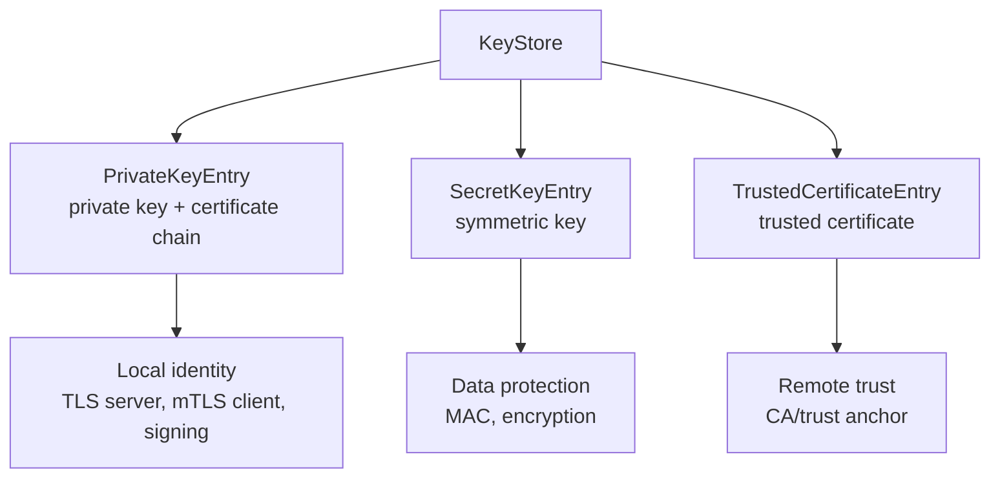
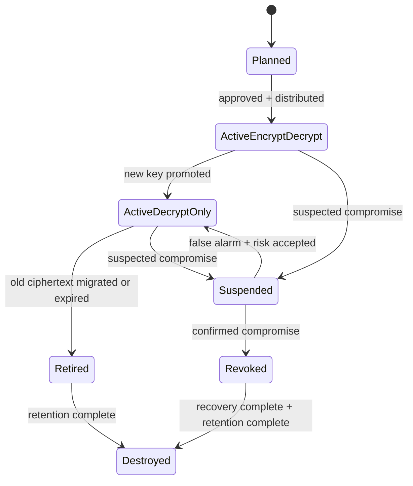
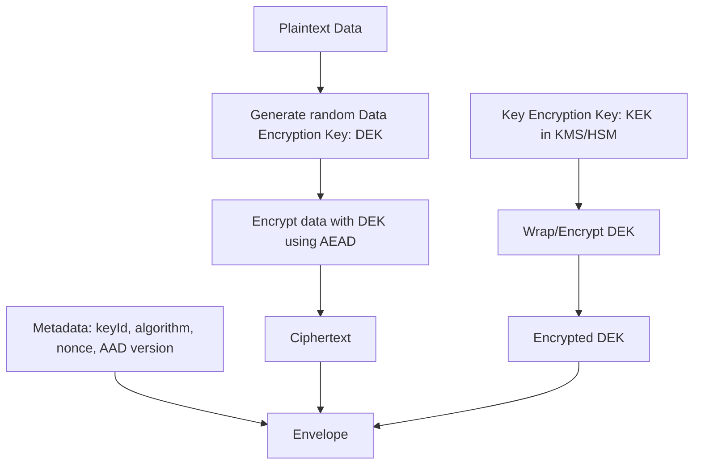
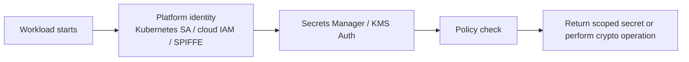
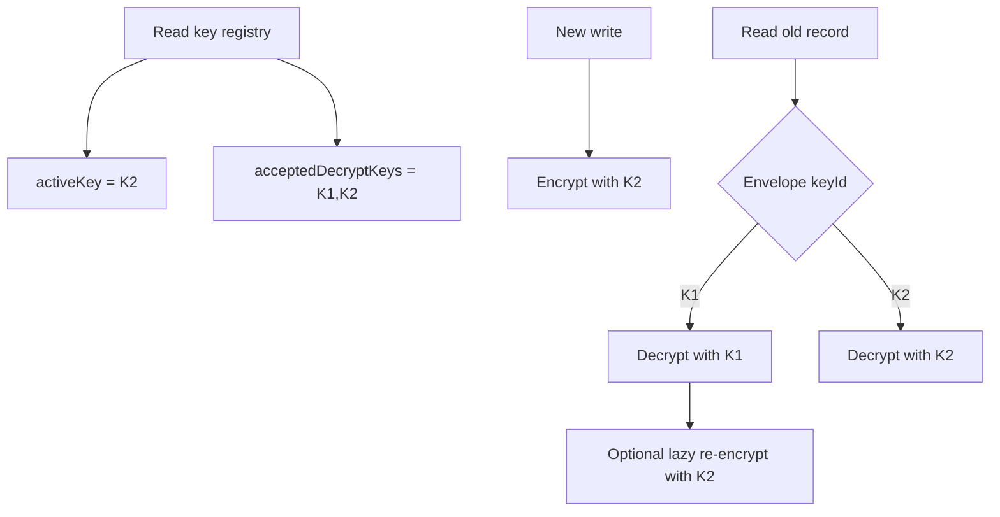
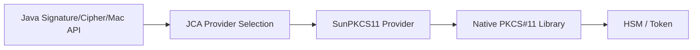
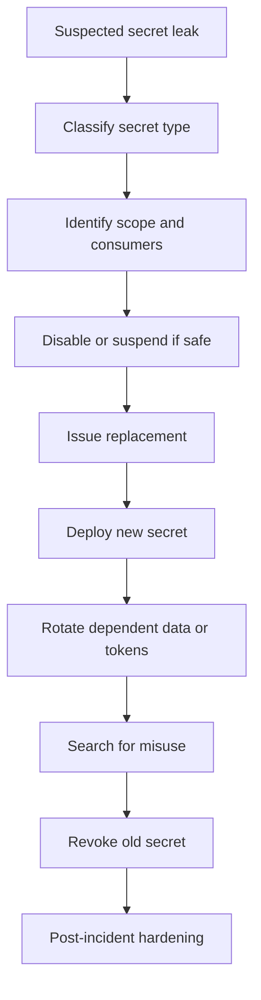

# Part 018 — Keystores, KMS, HSM, and Secrets

## 1. Why This Part Matters

Crypto failures are rarely caused by AES being mathematically broken. They are usually caused by bad key and secret lifecycle design:

1. Keys are stored next to encrypted data.
2. Long-lived credentials are copied into source code, CI logs, container images, or environment dumps.
3. One key protects too many domains.
4. Rotation is theoretically supported but operationally untested.
5. Applications cannot distinguish current, previous, disabled, compromised, and retired keys.
6. Secrets are readable by too many humans and workloads.
7. Disaster recovery depends on undocumented key material.
8. HSM/KMS is added as a product checkbox without a threat model.

This part builds the mental model for Java key material and secrets handling.

> Cryptography protects data only if key material has a stronger lifecycle than the data it protects.

## 2. Kaufman Skill Decomposition

Break the skill into practiceable subskills:

| Subskill | You can self-correct when you can answer |
|---|---|
| Secret taxonomy | Is this value a password, token, private key, symmetric key, API key, certificate, or trust anchor? |
| Java `KeyStore` model | Which `KeyStore.Entry` type holds this material? |
| Keystore vs truststore | Is this file proving local identity or deciding remote trust? |
| KMS/HSM boundary | Does the key leave the boundary, or is crypto performed inside it? |
| Envelope encryption | Which key encrypts data, and which key wraps the data key? |
| Secret zero | How does the app authenticate to retrieve its first secret? |
| Rotation | Can the system encrypt with the new key while decrypting old data? |
| Compromise response | What is the blast radius if this secret leaks? |
| Auditability | Can we prove who accessed, rotated, or used key material? |
| Recovery | Can we restore service without weakening key custody? |

## 3. Secret and Key Taxonomy

Do not treat all secrets as the same thing.

| Type | Example | Primary risk | Typical control |
|---|---|---|---|
| Password | Database password | Replay by anyone who knows it | Secrets manager, rotation, least privilege |
| API key | Third-party integration key | Unauthorized API use | Scoped key, rate limit, rotation |
| Bearer token | OAuth access token | Immediate impersonation | Short TTL, audience binding, refresh discipline |
| Refresh token | Long-lived session continuation | Persistent account takeover | Rotation, revocation, device binding |
| Private key | TLS/server signing key | Identity impersonation | Keystore, HSM/KMS, file permission, rotation |
| Symmetric data key | AES-GCM key | Data decryption | Envelope encryption, key hierarchy |
| HMAC key | Request signing key | Forged messages | Key ID, domain separation, rotation |
| Trust anchor | Root/intermediate CA cert | Unauthorized trust expansion | Change control, minimal truststore |
| Certificate | Public identity assertion | Expiry/misissuance | PKI lifecycle, linting, monitoring |
| Seed/pepper | Password hashing pepper | Large-scale credential compromise if leaked | KMS/HSM, split access, rotation plan |

A value becomes a secret if possession changes the security state.

## 4. Java KeyStore Mental Model

`java.security.KeyStore` represents a storage facility for cryptographic keys and certificates. It manages entries such as:

1. `PrivateKeyEntry`: private key plus certificate chain.
2. `SecretKeyEntry`: symmetric secret key.
3. `TrustedCertificateEntry`: trusted public certificate.



Every Java implementation must support `PKCS12` as a standard keystore type. `KeyStore.getDefaultType()` returns the configured default keystore type, or `pkcs12` if no security property overrides it.

## 5. Keystore vs Truststore

The difference is usage, not necessarily file format.

| Store | Contains | Used for | Example |
|---|---|---|---|
| Keystore | Local private key + certificate chain, or secret keys | Proving local identity / holding key material | Server TLS keypair, client mTLS keypair, signing key |
| Truststore | Trusted certificates / CA roots | Deciding whether remote identity is acceptable | Client trust of server CA, server trust of client CA |

The same `KeyStore` API may load both. The security meaning comes from how the material is used.

Bad naming pattern:

```text
security.p12 contains server key, client key, public CA roots, partner CA roots, and unrelated test certificates.
```

Better pattern:

```text
server-identity.p12
client-payment-gateway-identity.p12
trust-payment-gateway-server-ca.p12
trust-internal-workload-client-ca.p12
```

Naming should expose the trust boundary.

## 6. Key Lifecycle State Machine

Treat keys as stateful operational entities.



Key states should be represented in metadata, not tribal knowledge.

Minimum key metadata:

| Field | Purpose |
|---|---|
| `keyId` | Identifies the key used for encryption/signing/verifying. |
| `algorithm` | Prevents ambiguous interpretation. |
| `purpose` | Encryption, HMAC, signing, TLS, wrapping, password pepper, etc. |
| `scope` | Tenant, service, environment, data class, or boundary. |
| `state` | Active, decrypt-only, retired, suspended, revoked. |
| `createdAt` | Lifecycle audit. |
| `activatedAt` | Rotation audit. |
| `expiresAt` | Planned rotation/retirement. |
| `owner` | Operational accountability. |
| `protection` | File, KMS, HSM, Vault transit, PKCS#11 token. |

## 7. Envelope Encryption

Envelope encryption separates data encryption from key encryption.



Why this pattern is useful:

1. Large data does not need to pass through KMS/HSM.
2. Each object can use a unique DEK.
3. The KEK can stay inside KMS/HSM.
4. Rotation can rewrap DEKs without re-encrypting all data.
5. Metadata can support algorithm agility.

Envelope example:

```json
{
  "version": 1,
  "algorithm": "AES-256-GCM",
  "keyEncryptionKeyId": "kms://prod/case-data/kek-2026-06",
  "encryptedDataKey": "base64...",
  "nonce": "base64...",
  "aad": "case-data:v1:tenant-42",
  "ciphertext": "base64..."
}
```

Invariant:

> The envelope must carry enough metadata to decrypt safely without guessing algorithm, key, nonce, or domain context.

## 8. KMS, HSM, Vault, and PKCS#11

These tools solve related but different problems.

| Option | Main idea | Key exposure model | Common Java integration |
|---|---|---|---|
| File keystore | Key material stored in local encrypted file | Key loaded into JVM memory | `KeyStore`, `KeyManagerFactory`, `TrustManagerFactory` |
| Cloud KMS | Managed key service with policy/audit | KEK usually does not leave service | Cloud SDK, envelope encryption client |
| HSM | Dedicated hardware boundary for key operations | Private key often non-exportable | PKCS#11 provider, vendor SDK |
| Vault transit | Crypto-as-a-service; Vault holds keys | App sends data/DEK to Vault API | HTTP client, Vault SDK, sidecar |
| PKCS#11 token | Standard interface to native crypto token | Token-dependent, often non-exportable | SunPKCS11 provider via JCA/JCE |

Java's SunPKCS11 provider lets applications use standard JCA/JCE APIs to access native PKCS#11 libraries when configured. The provider itself is a conduit to the underlying native PKCS#11 implementation; availability of algorithms depends on that implementation.

### 8.1 KMS Is Not Magic

A KMS improves key custody, auditability, access control, and rotation primitives. It does not automatically solve:

1. Bad access policy.
2. Overbroad IAM role assignment.
3. Missing encryption context/AAD.
4. Application-level authorization bugs.
5. Data classification errors.
6. Logging decrypted plaintext.
7. Caching plaintext keys forever.

### 8.2 HSM Is Not Always Better

HSMs are valuable when you need strong non-exportability, compliance boundaries, signing key protection, root CA protection, or high-assurance key custody.

But HSMs add:

1. Operational complexity.
2. Latency.
3. Throughput limits.
4. Vendor-specific behavior.
5. Disaster recovery complexity.
6. Harder local testing.

Use HSM where the threat model justifies it.

## 9. The Secret Zero Problem

Secret zero is the first credential an application uses to obtain all other secrets.

Examples:

1. A Kubernetes service account token used to authenticate to a secrets manager.
2. A cloud workload identity used to call KMS.
3. A VM instance identity document.
4. A sidecar-issued token.
5. A bootstrap certificate.

Bad secret zero:

```text
APP_SECRET_MANAGER_PASSWORD=super-secret in container image
```

Better secret zero:

```text
Workload identity issued by platform -> short-lived token -> secrets manager policy -> scoped secret access
```



Secret zero invariant:

> Bootstrap identity must be short-lived, non-human, environment-scoped, auditable, and harder to exfiltrate than the secrets it unlocks.

## 10. Loading Keystores in Java

A safe keystore loader should make format and boundary explicit.

```java
import java.io.InputStream;
import java.nio.file.Files;
import java.nio.file.Path;
import java.security.KeyStore;
import java.util.Arrays;

public final class KeyStores {
    private KeyStores() {}

    public static KeyStore loadPkcs12(Path path, char[] password) throws Exception {
        KeyStore keyStore = KeyStore.getInstance("PKCS12");
        try (InputStream input = Files.newInputStream(path)) {
            keyStore.load(input, password);
            return keyStore;
        } finally {
            // Reduces lifetime of password copy. It does not erase copies made internally.
            if (password != null) {
                Arrays.fill(password, '\0');
            }
        }
    }
}
```

Important caveats:

1. `char[]` is preferable to `String` for passwords because it can be overwritten, but this is not perfect memory safety.
2. The JVM, libraries, heap dumps, logs, and crash reports can still expose secrets.
3. Never log keystore passwords, aliases that reveal sensitive topology, or raw key material.
4. Validate file permissions before loading local key material.
5. Avoid storing production keystores in application source repositories.

## 11. Extracting a SecretKey

```java
import javax.crypto.SecretKey;
import java.security.KeyStore;

public final class SecretKeys {
    private SecretKeys() {}

    public static SecretKey getSecretKey(
            KeyStore keyStore,
            String alias,
            char[] entryPassword
    ) throws Exception {
        KeyStore.ProtectionParameter protection =
                new KeyStore.PasswordProtection(entryPassword);

        KeyStore.Entry entry = keyStore.getEntry(alias, protection);

        if (!(entry instanceof KeyStore.SecretKeyEntry secretEntry)) {
            throw new IllegalStateException("Alias does not contain a SecretKeyEntry: " + alias);
        }

        return secretEntry.getSecretKey();
    }
}
```

Review questions:

1. Who can read the keystore file?
2. Who can read the keystore password?
3. Is this key exportable from the JVM?
4. Is this alias environment-specific?
5. Is the key purpose encoded in metadata?
6. Does the ciphertext store the `keyId`/alias used?

## 12. Rotation Pattern: Encrypt New, Decrypt Old

For data encryption, rotation should avoid breaking old data.



Java-style interface:

```java
public interface KeyRegistry {
    CryptoKey activeEncryptionKey(String purpose, String scope);
    CryptoKey decryptionKey(String keyId);
}

public record CryptoKey(
        String keyId,
        String algorithm,
        String purpose,
        String scope,
        KeyState state,
        Object handle
) {}

public enum KeyState {
    ACTIVE_ENCRYPT_DECRYPT,
    ACTIVE_DECRYPT_ONLY,
    RETIRED,
    SUSPENDED,
    REVOKED
}
```

Encryption invariant:

```text
New ciphertext MUST use exactly one active encrypt key for its purpose/scope.
```

Decryption invariant:

```text
Old ciphertext MAY use decrypt-only keys until retention/migration completes.
```

## 13. Versioned Envelope Design

A robust ciphertext record should include key metadata.

```java
public record EncryptedValue(
        int version,
        String algorithm,
        String keyId,
        byte[] nonce,
        byte[] encryptedDataKey,
        byte[] ciphertext,
        byte[] tag,
        String aad
) {}
```

Do not design ciphertext as just `byte[]` with hidden assumptions. Hidden assumptions become migration blockers.

Minimum envelope fields:

1. Version.
2. Algorithm.
3. Key ID.
4. Nonce/IV.
5. Ciphertext.
6. Authentication tag, if not appended.
7. AAD/domain context.
8. Optional encrypted DEK.
9. Creation timestamp.
10. Compression flag, if compression is used before encryption.

## 14. Secrets in Containers and CI/CD

Secrets often leak before the application starts.

Danger zones:

| Zone | Failure mode |
|---|---|
| Source repository | Hardcoded credentials. |
| Build logs | Secret printed by test/config output. |
| Dockerfile | `ENV SECRET=...` baked into image layer. |
| Container image | Keystore copied into immutable artifact. |
| Kubernetes Secret | Base64 mistaken for encryption. |
| Environment variables | Visible in process metadata, dumps, debug tooling. |
| CI artifacts | Test reports include config. |
| Crash dumps | Heap contains plaintext credentials. |
| Metrics/tags | Secret accidentally used as label. |
| Logs | Tokens included in request/response dump. |

Better controls:

1. Use workload identity instead of static cloud credentials.
2. Inject secrets at runtime, not build time.
3. Keep secret access scoped per service and environment.
4. Use short-lived credentials where possible.
5. Apply secret scanning in source and CI.
6. Redact known secret formats in logs.
7. Disable or protect heap dumps for sensitive services.
8. Rotate immediately after suspected exposure.

OWASP's Secrets Management guidance emphasizes lifecycle concerns such as creation, storage, access, rotation, detection, and incident response. Rotation should be a safe multi-step transition, not a single destructive overwrite.

## 15. Access Control for Secrets

Secret policy should be least privilege and purpose-specific.

Bad policy:

```text
service-* can read secret/* in prod
```

Better policy:

```text
case-service-prod can read:
  /prod/case-service/db/readonly
  /prod/case-service/jwt-verification-public-set
  /prod/case-service/payment-client-cert

case-service-prod cannot read:
  /prod/payment-service/db/admin
  /prod/root-ca/private-key
  /dev/*
```

Policy dimensions:

1. Service/workload identity.
2. Environment.
3. Tenant or business domain.
4. Secret purpose.
5. Read vs write vs rotate vs destroy.
6. Human vs workload access.
7. Break-glass conditions.
8. Audit and alerting.

## 16. Break-Glass Design

Break-glass access is emergency access outside normal paths.

It must be designed before incidents.

Minimum design:

1. Requires strong human identity and MFA.
2. Requires ticket/incident reference.
3. Is time-limited.
4. Is heavily audited.
5. Alerts security/on-call.
6. Exposes only needed secrets/actions.
7. Triggers post-incident review.
8. Has replayable evidence for regulators/auditors.

Break-glass should not mean "someone has a copy of prod root keys in a password manager forever."

## 17. HSM / PKCS#11 in Java

When using PKCS#11, Java code may still use JCA/JCE APIs, but operations are routed to the token/provider.

Conceptual flow:



Configuration is provider/token-specific, but the review questions are stable:

1. Are private keys non-exportable?
2. Which operations are allowed by the key policy?
3. What is the authentication mechanism to the token?
4. How are PINs or token credentials protected?
5. What is the throughput/latency limit?
6. Is high availability configured?
7. How are backups and disaster recovery handled?
8. Is audit logging tamper-resistant?
9. How is key destruction verified?
10. How are test/staging HSMs separated from production?

## 18. KMS Envelope Encryption Facade

Keep KMS-specific logic behind a small boundary.

```java
public interface KeyWrappingService {
    WrappedDataKey generateDataKey(String keyEncryptionKeyId, byte[] encryptionContext);
    byte[] decryptDataKey(WrappedDataKey wrappedDataKey, byte[] encryptionContext);
}

public record WrappedDataKey(
        String keyEncryptionKeyId,
        String wrappingAlgorithm,
        byte[] plaintextDataKey,
        byte[] encryptedDataKey
) {}
```

But be careful with `plaintextDataKey` lifetime:

1. Keep it in memory only as long as needed.
2. Avoid logging or serializing it.
3. Prefer byte arrays that can be overwritten when feasible.
4. Be aware that Java memory management does not guarantee perfect zeroization.
5. Consider whether high-sensitivity keys should never enter JVM memory.

## 19. Secret Caching

Secret caching improves reliability and latency, but it changes the security model.

| Cache choice | Benefit | Risk |
|---|---|---|
| No cache | Fresh policy/secret every time | Latency and dependency on secrets service. |
| Short TTL cache | Lower latency, tolerates brief outage | Revocation delay. |
| Long TTL cache | High availability | Large compromise window. |
| Persistent local cache | Survives restart | Secret-at-rest problem on app host. |

Cache invariant:

> Cache TTL must be shorter than the organization's acceptable revocation delay for that secret class.

For high-risk secrets, prefer short TTL, explicit refresh, and audit logs.

## 20. Compromise Response

When a secret leaks, the response depends on what the secret can do.



Response questions:

1. Was it a read credential, write credential, signing key, or decrypt key?
2. Can it be revoked immediately without outage?
3. What data or actions could be affected?
4. Are there logs proving use/non-use?
5. Do downstream systems need notification?
6. Are derived tokens or sessions still valid?
7. Is re-encryption required?
8. Is forensic retention required?

## 21. Testing Strategy

### 21.1 Unit Tests

Test metadata and state logic:

1. Cannot encrypt with retired key.
2. Cannot decrypt with revoked key.
3. New ciphertext includes key ID and algorithm.
4. Wrong AAD fails decryption.
5. Unknown key ID fails closed.
6. Missing envelope field fails closed.

### 21.2 Integration Tests

Test actual keystore/KMS behavior:

1. Load PKCS12 keystore with expected alias.
2. Fail on wrong password.
3. Fail on missing alias.
4. Validate certificate chain from keystore.
5. Generate/decrypt data key with KMS test key.
6. Verify IAM/workload policy denies unrelated secret.
7. Rotate key and verify old ciphertext still decrypts.

### 21.3 Chaos / Drill Tests

1. KMS unavailable.
2. Secrets manager latency spike.
3. Revoked key used for decryption.
4. Expired client certificate.
5. Missing truststore.
6. Corrupted encrypted DEK.
7. Wrong encryption context/AAD.
8. Emergency break-glass access.

## 22. Production Readiness Checklist

### Key Material

- [ ] Every key has owner, purpose, scope, state, and expiry.
- [ ] Production keys are separate from non-production keys.
- [ ] Key IDs are stored with ciphertext/signatures.
- [ ] Rotation path is tested.
- [ ] Compromise response is documented.
- [ ] Key access is audited.

### Keystores and Truststores

- [ ] Keystore/truststore files are not in source control.
- [ ] File permissions are minimal.
- [ ] Stores are boundary-specific.
- [ ] Passwords are runtime-injected.
- [ ] Alias naming is consistent and non-ambiguous.
- [ ] Expiry is monitored for certificate entries.

### Secrets

- [ ] No secrets are baked into images.
- [ ] No secrets appear in logs, metrics, traces, or crash dumps.
- [ ] Secret scanning runs in source and CI.
- [ ] Workload identity solves secret zero.
- [ ] Secret access policy is least privilege.
- [ ] Rotation is multi-step and reversible.

### KMS/HSM

- [ ] KMS/HSM key policy is scoped.
- [ ] Encryption context/AAD is used where supported.
- [ ] Rate limits and latency are understood.
- [ ] DR/backup process is tested.
- [ ] Break-glass access is controlled and audited.
- [ ] Non-exportability requirements are explicit.

## 23. Anti-Patterns

| Anti-pattern | Consequence |
|---|---|
| Store encryption key beside encrypted data | Attacker gets both lock and key. |
| Use one global key for all tenants/data | Huge blast radius. |
| Rotate by overwriting old key | Old data becomes undecryptable. |
| No key ID in ciphertext | Decryption requires guessing. |
| Use environment variables for all high-value secrets | Easy exposure through process/debug tooling. |
| Copy production keystore into container image | Secret becomes part of artifact supply chain. |
| Treat KMS as authorization | Decryption allowed does not mean business action allowed. |
| Use HSM without HA/DR testing | Security control becomes availability risk. |
| Keep break-glass credentials permanently shared | Emergency access becomes shadow admin access. |
| Log decrypted payload for debugging | Crypto boundary is bypassed by observability. |

## 24. Practice Lab

### Lab 1 — PKCS12 Keystore Exploration

1. Create a PKCS12 keystore.
2. Add a private key and certificate chain.
3. Add a trusted certificate entry.
4. Load it from Java.
5. List aliases and entry types.
6. Reject unexpected alias/type.

### Lab 2 — Envelope Encryption

1. Generate random DEK.
2. Encrypt payload with AES-GCM.
3. Simulate wrapping DEK with a fake KMS KEK.
4. Store envelope metadata.
5. Decrypt using key ID lookup.
6. Change AAD and verify decryption fails.

### Lab 3 — Rotation Drill

1. Create key `K1` and encrypt records.
2. Create key `K2` and mark as active.
3. Encrypt new records with `K2`.
4. Decrypt old records with `K1`.
5. Lazy re-encrypt old records with `K2`.
6. Mark `K1` decrypt-only, then retired.
7. Verify encrypt with `K1` fails.

### Lab 4 — Secret Leak Incident Tabletop

1. Pick a leaked secret type.
2. Determine blast radius.
3. Revoke/rotate safely.
4. Identify logs needed for misuse analysis.
5. Document permanent fixes.

## 25. Key Takeaways

1. Key and secret lifecycle design is usually more important than crypto algorithm selection after safe algorithms are chosen.
2. Java `KeyStore` can hold private keys, secret keys, and trusted certificates; usage determines whether we call it a keystore or truststore.
3. `PKCS12` is the portable standard keystore type every Java implementation must support.
4. KMS/HSM improves custody and auditability, but it does not replace application authorization or data classification.
5. Envelope encryption is the default mental model for scalable data encryption.
6. Rotation requires key states, metadata, and decrypt-old/encrypt-new behavior.
7. Secret zero must be solved with platform identity, not static credentials baked into artifacts.
8. Production readiness requires tests, drills, auditability, and compromise response.

## References

- Oracle, Java SE 25, KeyStore API: https://docs.oracle.com/en/java/javase/25/docs/api/java.base/java/security/KeyStore.html
- Oracle, Java SE 25, JDK Providers Documentation: https://docs.oracle.com/en/java/javase/25/security/oracle-providers.html
- Oracle, Java SE 25, Java Cryptography Architecture Reference Guide: https://docs.oracle.com/en/java/javase/25/security/java-cryptography-architecture-jca-reference-guide.html
- OWASP Secrets Management Cheat Sheet: https://cheatsheetseries.owasp.org/cheatsheets/Secrets_Management_Cheat_Sheet.html
- AWS Encryption SDK for Java examples: https://docs.aws.amazon.com/encryption-sdk/latest/developer-guide/java-example-code.html
- HashiCorp Vault Transit Secrets Engine: https://developer.hashicorp.com/vault/docs/secrets/transit
