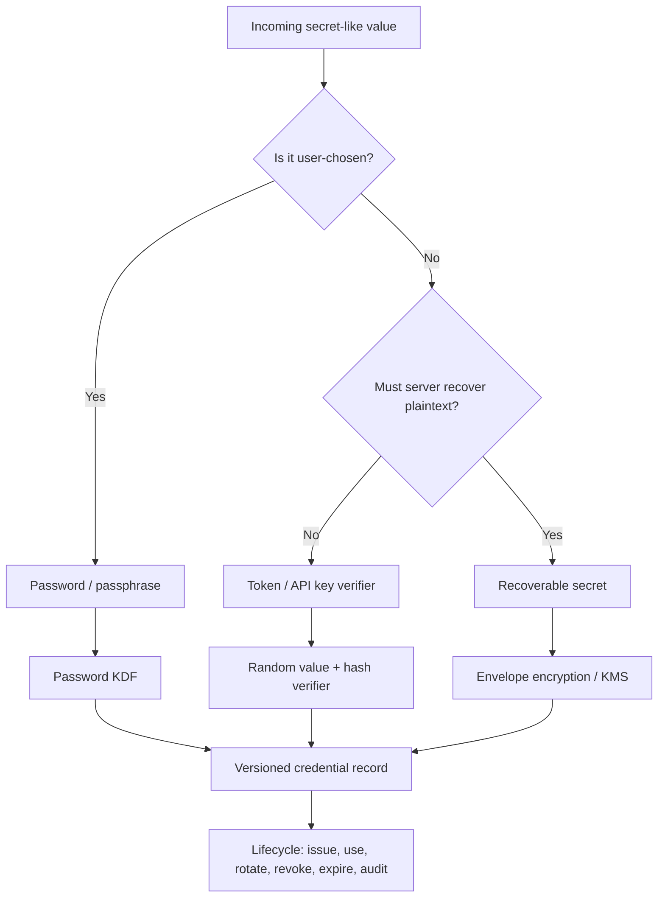
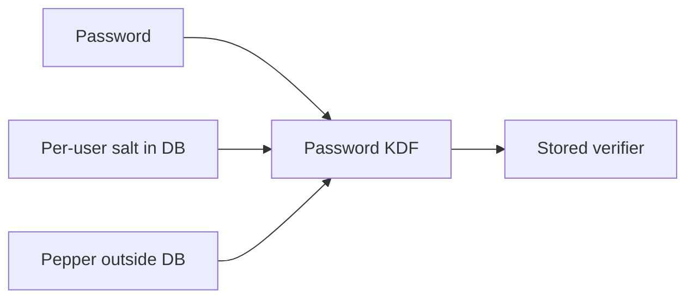
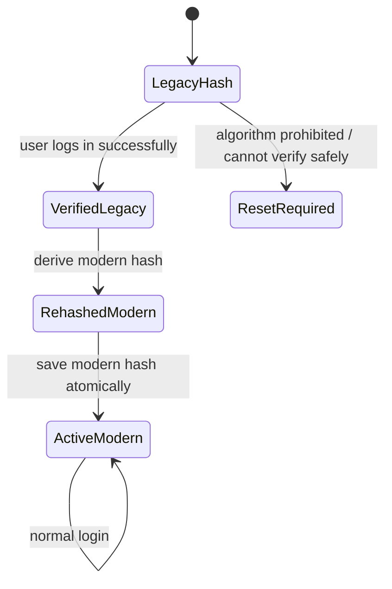
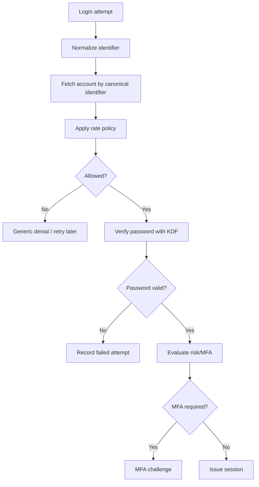
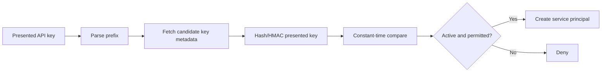
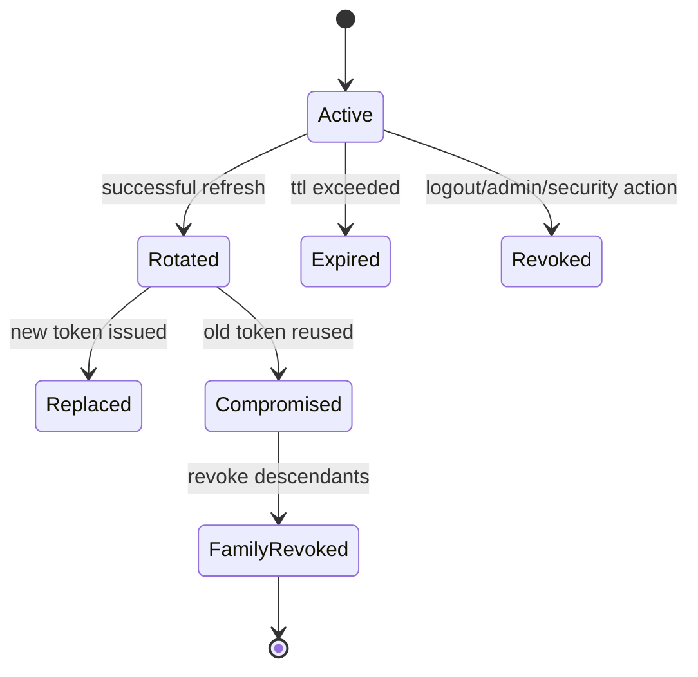
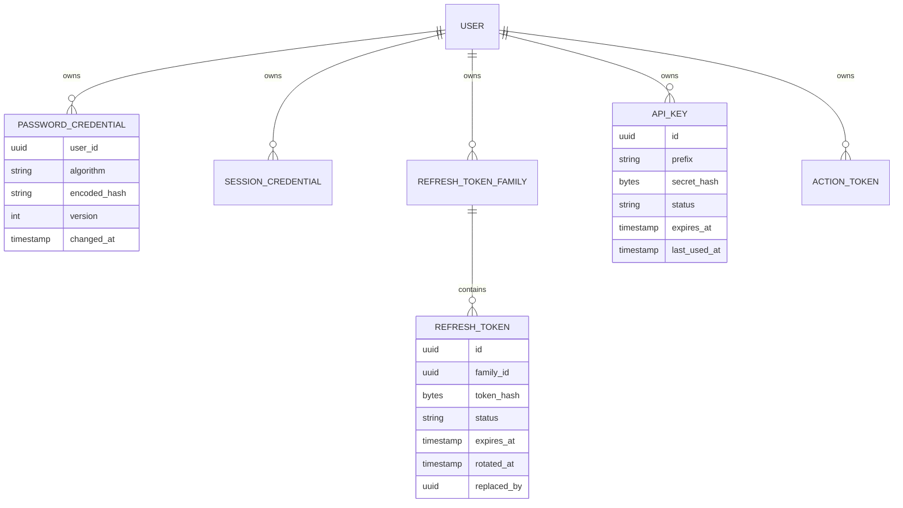

------
title: Learn Java Security, Cryptography, Integrity and Platform Hardening - Part 019
description: Passwords, credentials, API keys, reset tokens, refresh tokens, and session/token storage as a defensive lifecycle model in Java systems.
series: learn-java-security-cryptography-integrity-hardening
seriesTitle: Learn Java Security, Cryptography, Integrity and Platform Hardening
order: 19
partTitle: Passwords, Credentials and Token Storage
tags:
- java
- security
- cryptography
- credentials
- passwords
- tokens
- sessions
- hardening
date: 2026-06-28
---

# Part 019 — Passwords, Credentials and Token Storage

## 1. Position in the Kaufman Skill Map

At this point in the series, we already have enough primitives to reason about credential storage correctly:

- secure randomness for nonces, salts, secrets, reset tokens, API keys, and identifiers;
- hashing, MAC, and KDFs for integrity and password verification;
- AEAD and key management for secrets that must remain recoverable;
- signatures, certificates, and TLS for authenticity across system boundaries.

This part converts those primitives into a practical engineering model for credentials.

The goal is not to memorize one recipe such as “use bcrypt”. The real skill is to classify each secret by **how it is used**, **whether it must be recoverable**, **who can present it**, **how it can be revoked**, and **what happens when storage is compromised**.



A top-tier Java engineer should be able to look at a credential table and immediately answer:

1. What class of credential is this?
2. Is compromise of the database alone sufficient to impersonate users?
3. Can the credential be rotated without downtime?
4. Is verification constant-time where needed?
5. Is there a clear state machine for expiry, revocation, replay, and reuse?
6. Can we migrate the algorithm without forcing every user to reset immediately?

## 2. Core Mental Model

A credential is not “a string”. It is a **capability**.

Possession of a valid credential gives someone the ability to act. The defensive question is: what must an attacker steal to use that capability?

| Credential Type | Chosen By | Presented By | Server Needs Plaintext? | Storage Strategy |
|---|---:|---|---:|---|
| Password | Human | Human/user agent | No | Slow password KDF |
| Reset token | Server RNG | Email holder/browser | No | Hash token verifier |
| Email verification token | Server RNG | Email holder/browser | No | Hash token verifier |
| API key | Server RNG | Client system | Usually no | Prefix + hash verifier |
| Access token | Authorization server | Client/resource request | Usually no at resource server if JWT; yes if opaque introspection issuer | Short TTL, no long-term storage at client beyond necessity |
| Refresh token | Authorization server | Client | No for verifier | Hash + rotation family + reuse detection |
| Session ID | Server RNG | Browser/client | No | Hash or opaque lookup + expiry |
| Database password | Operator/KMS | Application runtime | Yes | Secret manager/KMS; never password-KDF |
| Private key | Generated | Service/runtime | Yes | Keystore/HSM/KMS, never hash |

The mistake is to use one storage pattern for all of them.

Passwords are low-entropy and human-chosen. They need a deliberately expensive verifier. Random server-generated tokens are high-entropy. They usually need a fast cryptographic hash or HMAC verifier plus lifecycle controls. Recoverable secrets need encryption and key management, not hashing.

## 3. Non-Negotiable Invariants

Use these as design review gates.

### 3.1 Password Invariants

- Passwords are never stored in plaintext.
- Passwords are never encrypted merely so the server can later decrypt them for login.
- Passwords are verified using a slow password hashing/KDF scheme.
- Every password hash carries its algorithm and parameters.
- Every user gets a unique salt.
- A pepper, if used, is stored outside the password database.
- Password verification does not leak whether the account exists through timing, error wording, or rate behavior.
- Password migration is versioned and incremental.

### 3.2 Token Invariants

- Reset tokens, verification tokens, API keys, refresh tokens, and session IDs are generated by a CSPRNG.
- Long-lived tokens are not stored in plaintext unless there is a strong operational reason and compensating controls.
- A token row has state: active, used, revoked, expired, replaced, or compromised.
- Token reuse after rotation is treated as a compromise signal.
- Token lookup does not require scanning the entire table.
- User-visible token prefixes are non-secret identifiers, not authenticators.
- Logs never contain the full credential.

### 3.3 Secret Invariants

- If the service must use a secret in plaintext, hashing is the wrong tool.
- Recoverable secrets must be protected with encryption and key lifecycle controls.
- Secrets are not passed through exception messages, MDC, metrics tags, or trace attributes.
- Runtime secret exposure is minimized by least privilege, environment hygiene, and short-lived credentials where possible.

## 4. Password Storage: Correct Shape

OWASP’s baseline remains simple: never store passwords in plaintext; use strong slow password hashing such as Argon2id, bcrypt, or PBKDF2; use unique salts; and avoid fast hashes such as SHA-256 for password storage.

The production-grade Java model should store password hashes like this:

```text
$algorithm$v=version$params$salt$hash
```

Examples:

```text
$argon2id$v=19$m=47104,t=1,p=1$<base64-salt>$<base64-hash>
$pbkdf2-sha256$v=1$i=600000,l=32$<base64-salt>$<base64-hash>
```

The exact string format depends on the library, but the architectural property is the same: **the verifier must know the algorithm and parameters used for that credential**.

Never store this:

```text
user_id | password_hash
123     | 5e884898da28047151d0e56f8dc6292773603d0d6aabbdd62a11ef721d1542d8
```

That is a fast hash shape. It is not a password storage shape.

## 5. Algorithm Choice in Java

### 5.1 Preferred Direction

For new systems, prefer Argon2id through a mature library that exposes safe parameter configuration and PHC-format encoded hashes.

The JDK standard library has PBKDF2 through `SecretKeyFactory`, which is useful when you need a no-extra-dependency baseline or compatibility with FIPS-oriented environments. PBKDF2 is CPU-hard, not memory-hard. It can still be acceptable when configured with strong iteration counts and governed by operational policy, but it should not be confused with Argon2id’s memory-hard design.

### 5.2 Practical Selection Table

| Context | Recommended Direction |
|---|---|
| New consumer app | Argon2id with parameter calibration |
| Existing bcrypt system | Keep bcrypt, migrate cost upward when users login |
| FIPS-constrained environment | PBKDF2-HMAC-SHA-256 or policy-approved KDF |
| Legacy SHA-1/SHA-256 hashes | Opportunistic migration on next successful login |
| High-risk admin accounts | Strong KDF + MFA + rate limiting + alerting |
| Machine secrets | Not password hashing; use KMS/secret manager |

### 5.3 Parameter Calibration

Do not copy parameters blindly. Calibrate.

You want verification to be expensive enough to slow offline attackers, but cheap enough that your own login system remains reliable under legitimate load.

A practical target:

- interactive login verification: often tens to hundreds of milliseconds, depending on system capacity;
- administrative or low-volume high-risk credentials: can be slower;
- bulk authentication or constrained mobile/serverless environments: must be capacity-tested.

The invariant is not “one exact number”. The invariant is:

> Credential verification cost must be intentionally selected, measured, versioned, and reviewed.

## 6. PBKDF2 Baseline in Plain Java

The JDK supports PBKDF2 through `SecretKeyFactory`. The following example is intentionally explicit so the storage shape is visible.

```java
package example.security.credentials;

import javax.crypto.SecretKeyFactory;
import javax.crypto.spec.PBEKeySpec;
import java.security.GeneralSecurityException;
import java.security.SecureRandom;
import java.util.Base64;
import java.util.Objects;

public final class Pbkdf2PasswordHasher {
    private static final SecureRandom RNG = new SecureRandom();

    private final String algorithm;
    private final int iterations;
    private final int saltBytes;
    private final int derivedKeyBits;

    public Pbkdf2PasswordHasher() {
        this("PBKDF2WithHmacSHA256", 600_000, 16, 256);
    }

    public Pbkdf2PasswordHasher(
            String algorithm,
            int iterations,
            int saltBytes,
            int derivedKeyBits
    ) {
        if (iterations < 100_000) {
            throw new IllegalArgumentException("PBKDF2 iterations are too low for this policy");
        }
        if (saltBytes < 16) {
            throw new IllegalArgumentException("salt must be at least 128 bits");
        }
        this.algorithm = Objects.requireNonNull(algorithm);
        this.iterations = iterations;
        this.saltBytes = saltBytes;
        this.derivedKeyBits = derivedKeyBits;
    }

    public String hash(char[] password) {
        requirePassword(password);
        byte[] salt = new byte[saltBytes];
        RNG.nextBytes(salt);
        byte[] derived = derive(password, salt, iterations, derivedKeyBits);

        return String.join("$",
                "pbkdf2-sha256",
                "v=1",
                "i=" + iterations + ",l=" + (derivedKeyBits / 8),
                Base64.getUrlEncoder().withoutPadding().encodeToString(salt),
                Base64.getUrlEncoder().withoutPadding().encodeToString(derived));
    }

    public boolean verify(char[] password, String encoded) {
        requirePassword(password);
        ParsedHash parsed = ParsedHash.parse(encoded);
        byte[] candidate = derive(password, parsed.salt(), parsed.iterations(), parsed.lengthBytes() * 8);
        return java.security.MessageDigest.isEqual(candidate, parsed.hash());
    }

    private byte[] derive(char[] password, byte[] salt, int iterations, int bits) {
        try {
            PBEKeySpec spec = new PBEKeySpec(password, salt, iterations, bits);
            try {
                return SecretKeyFactory.getInstance(algorithm).generateSecret(spec).getEncoded();
            } finally {
                spec.clearPassword();
            }
        } catch (GeneralSecurityException e) {
            throw new IllegalStateException("password KDF unavailable", e);
        }
    }

    private static void requirePassword(char[] password) {
        if (password == null || password.length == 0) {
            throw new IllegalArgumentException("password is required");
        }
    }

    private record ParsedHash(int iterations, int lengthBytes, byte[] salt, byte[] hash) {
        static ParsedHash parse(String encoded) {
            String[] parts = encoded.split("\\$");
            if (parts.length != 5 || !parts[0].equals("pbkdf2-sha256")) {
                throw new IllegalArgumentException("unsupported password hash format");
            }
            String[] params = parts[2].split(",");
            int iterations = Integer.parseInt(params[0].substring("i=".length()));
            int length = Integer.parseInt(params[1].substring("l=".length()));
            byte[] salt = Base64.getUrlDecoder().decode(parts[3]);
            byte[] hash = Base64.getUrlDecoder().decode(parts[4]);
            return new ParsedHash(iterations, length, salt, hash);
        }
    }
}
```

Important details:

- use `char[]` at the API edge where feasible, though modern JVM/string/framework layers still make perfect memory wiping hard;
- use `MessageDigest.isEqual` instead of `Arrays.equals` for secret comparison;
- version the encoded hash;
- parse strictly;
- do not silently accept unknown algorithms;
- make KDF unavailability a startup or hard failure, not a fallback to something weaker.

## 7. Pepper: Useful, But Often Misunderstood

A salt is per-password and usually stored with the hash. It prevents precomputed attacks and makes identical passwords produce different hashes.

A pepper is a server-side secret shared across many password hashes. It is stored outside the database, usually in KMS/HSM/secret manager configuration.

Pepper helps when the attacker steals only the database but not the application secret material. It does not help if the attacker also controls the application runtime.



Pepper trade-offs:

| Benefit | Cost |
|---|---|
| Raises cost of database-only breach | Adds secret rotation complexity |
| Separates database compromise from credential compromise | Pepper compromise may require mass password reset |
| Useful in high-risk environments | Can create outage if unavailable |

Do not add a pepper casually. Add it when you have operational maturity to rotate it and handle compromise.

## 8. Password Migration Without Breaking Users

Credential migration should be opportunistic.



A practical verifier:

```java
public LoginResult verifyAndMaybeUpgrade(User user, char[] password) {
    PasswordRecord record = user.passwordRecord();

    PasswordVerifier verifier = registry.verifierFor(record.algorithm());
    boolean ok = verifier.verify(password, record.encodedHash());
    if (!ok) {
        return LoginResult.denied();
    }

    if (policy.needsUpgrade(record)) {
        String upgraded = policy.currentHasher().hash(password);
        userRepository.updatePasswordHashIfVersionMatches(
                user.id(),
                record.version(),
                upgraded
        );
    }

    return LoginResult.authenticated(user.id());
}
```

The update must be conditional to avoid overwriting a password changed in another transaction.

## 9. Authentication Error Handling

The API should not expose account enumeration.

Bad:

```text
Unknown email address.
Password incorrect.
Account exists but is not verified.
```

Better:

```text
Invalid username or password.
```

However, internal telemetry may still distinguish reasons:

```text
auth.login.denied.reason = user_not_found | bad_password | locked | mfa_required | disabled
```

Do not put sensitive values in telemetry labels. Labels often have high cardinality and broad visibility.

## 10. Rate Limiting and Credential Stuffing Defense

Password hashing alone does not stop online guessing. It slows offline cracking after database compromise.

Online defense needs:

- per-account throttling;
- per-source throttling;
- adaptive risk checks;
- MFA escalation;
- breached password checks where appropriate;
- lockout policy that cannot be weaponized for denial-of-service;
- alerting on distributed low-and-slow attempts;
- uniform external error messages.

A mature login flow:



Rate limiting must be designed so attackers cannot easily lock out executives, administrators, or all users in a tenant.

## 11. Reset Tokens

Password reset tokens are credentials. Treat them as temporary bearer capabilities.

### 11.1 Shape

A good reset token has:

- at least 128 bits of CSPRNG entropy;
- short TTL;
- one-time use;
- hash-only storage;
- binding to account and purpose;
- state transition on use;
- audit trail;
- optional invalidation of active sessions after password change.

### 11.2 Storage Table

```sql
create table credential_action_token (
    id                 uuid primary key,
    user_id            uuid not null,
    purpose            varchar(64) not null,
    token_hash          bytea not null,
    token_prefix        varchar(16) not null,
    status             varchar(32) not null,
    expires_at          timestamp not null,
    used_at             timestamp null,
    revoked_at          timestamp null,
    created_at          timestamp not null,
    request_ip_hash     bytea null,
    user_agent_hash     bytea null,
    constraint uq_action_token_hash unique (token_hash)
);
```

Use `token_prefix` for support/debug lookup, not authentication.

### 11.3 Generation

```java
public final class ResetTokenService {
    private static final SecureRandom RNG = new SecureRandom();

    public IssuedResetToken issue(UserId userId) {
        byte[] raw = new byte[32]; // 256 bits
        RNG.nextBytes(raw);

        String token = Base64.getUrlEncoder().withoutPadding().encodeToString(raw);
        byte[] verifier = sha256(raw);
        String prefix = token.substring(0, 12);

        repository.insert(new ResetTokenRow(
                UUID.randomUUID(),
                userId,
                "PASSWORD_RESET",
                verifier,
                prefix,
                "ACTIVE",
                Instant.now().plus(Duration.ofMinutes(15))
        ));

        return new IssuedResetToken(token);
    }

    private static byte[] sha256(byte[] value) {
        try {
            return java.security.MessageDigest.getInstance("SHA-256").digest(value);
        } catch (java.security.NoSuchAlgorithmException e) {
            throw new IllegalStateException(e);
        }
    }
}
```

A SHA-256 hash is acceptable for a random 256-bit reset token because the token is high entropy. This is different from password hashing.

## 12. API Keys

API keys are often long-lived bearer tokens. They deserve a better structure than “one random string stored in plaintext”.

A production API key usually has:

```text
<public_prefix>_<secret_body>
```

Example:

```text
ak_live_8F4WQ2J9_Uq3sS3JqBvclxKj2JQn0VUR0m3XnQ9JLsQw
```

Where:

- `ak_live` says type/environment;
- `8F4WQ2J9` is a public key id/prefix;
- the body is the bearer secret;
- the database stores only a hash/HMAC of the secret body or full token;
- permissions are stored separately and evaluated server-side.



Do not encode authorization policy inside the key unless you have a signed and versioned token model. Even then, revocation and rotation become harder.

## 13. Refresh Tokens

Refresh tokens are high-value credentials because they can mint new access tokens.

A serious refresh token implementation includes:

- storage as hash, not plaintext;
- binding to client/user/device/session family;
- expiration and idle timeout;
- rotation on every use;
- reuse detection;
- revocation cascade for token family;
- audit trail with reason codes;
- support for sender-constrained tokens where applicable.



### 13.1 Reuse Detection

When token `T1` is used successfully, issue `T2` and mark `T1` as rotated. If `T1` appears again, assume theft or replay.

```java
public RefreshResult refresh(String presentedToken) {
    byte[] tokenHash = tokenHasher.hash(presentedToken);
    RefreshToken row = repository.findByHash(tokenHash)
            .orElseThrow(() -> new InvalidCredentialException());

    if (row.isExpired() || row.isRevoked()) {
        throw new InvalidCredentialException();
    }

    if (row.isRotated()) {
        repository.revokeFamily(row.familyId(), "REFRESH_TOKEN_REUSE");
        securityEvents.tokenReuseDetected(row.userId(), row.familyId());
        throw new InvalidCredentialException();
    }

    RefreshToken next = tokenFactory.nextToken(row.userId(), row.clientId(), row.familyId());
    repository.rotateAtomically(row.id(), row.version(), next);

    return new RefreshResult(next.plaintextOnce(), accessTokenIssuer.issue(row.userId()));
}
```

The token plaintext is returned once and never stored.

## 14. Sessions

A server-side session ID is also a credential.

Recommended properties:

- random opaque ID;
- `Secure`, `HttpOnly`, and appropriate `SameSite` cookie flags;
- session fixation protection by regenerating session ID after login/privilege elevation;
- idle timeout and absolute timeout;
- server-side revocation;
- hash-only storage for session ID where feasible;
- device/session listing for users;
- risk-based invalidation after password reset or MFA changes.

Session state should not become an unreviewed authorization cache. If role/tenant membership changes, session policy must define when the change takes effect.

## 15. Access Tokens

Access tokens are usually short-lived. The storage concern depends on token type.

| Token Type | Resource Server Verification | Storage Risk |
|---|---|---|
| Opaque token | Introspection or local lookup | Server stores verifier/state |
| JWT/JWS | Signature verification | Client theft until expiry |
| Sender-constrained token | Proof of possession required | Theft alone may be insufficient |

Common mistakes:

- long-lived bearer access tokens;
- storing access tokens in browser local storage without considering XSS;
- putting PII or authorization policy snapshots into JWTs without expiry/refresh strategy;
- failing to validate `iss`, `aud`, `exp`, `nbf`, algorithm, and key id;
- accepting `none` or unexpected algorithms;
- not handling signing key rotation.

Access tokens are not a replacement for authorization checks. They are authentication artifacts that can carry claims. The resource server still owns authorization decisions.

## 16. Credential Storage Architecture

A useful conceptual schema:



Store lifecycle separately from verifier bytes. This makes it possible to revoke, rotate, audit, and explain decisions.

## 17. Constant-Time Comparison

Use constant-time comparison for secret verifier bytes.

```java
public boolean matches(byte[] expected, byte[] actual) {
    if (expected == null || actual == null) {
        return false;
    }
    return java.security.MessageDigest.isEqual(expected, actual);
}
```

Also avoid early database response patterns that leak whether a token prefix exists. For high-risk systems, normalize response behavior for invalid, expired, revoked, and unknown tokens.

## 18. Logging and Observability

Never log full credentials.

Allowed:

```text
auth.api_key.denied key_prefix=ak_live_8F4WQ2J9 reason=revoked principal=unknown
```

Not allowed:

```text
auth.api_key.denied key=ak_live_8F4WQ2J9_Uq3sS3JqBvclxKj2JQn0VUR0m3XnQ9JLsQw
```

For incident response, you usually need:

- credential id or prefix;
- principal id;
- client id;
- tenant id;
- source IP bucket or privacy-preserving hash;
- user agent family;
- reason code;
- state transition;
- correlation id.

Do not log passwords even as hashes. Password hashes are sensitive breach material.

## 19. Failure Modes

| Failure | Consequence | Defensive Control |
|---|---|---|
| Fast password hash | Offline cracking becomes cheap | Argon2id/bcrypt/PBKDF2 policy |
| Global salt | Identical passwords correlate | Per-user random salt |
| Plaintext reset tokens | DB breach enables account takeover | Hash token verifier |
| Plaintext API keys | DB breach enables client impersonation | Prefix + hash/HMAC verifier |
| Refresh token reuse ignored | Stolen token remains useful | Rotation + reuse detection |
| No credential versioning | Algorithm migration is risky | Versioned encoded hash/token metadata |
| Full token in logs | Log reader can impersonate | Redaction and structured logging guardrails |
| Password reset does not revoke sessions | Attacker keeps active session | Session invalidation policy |
| Lockout too aggressive | Attacker can DoS accounts | Risk-based throttling |

## 20. Review Checklist

Use this checklist before approving credential-related code.

### Passwords

- [ ] Is the password verifier a slow KDF, not a fast hash?
- [ ] Is each password salted uniquely?
- [ ] Are algorithm and parameters versioned in storage?
- [ ] Is migration supported?
- [ ] Are login errors externally generic?
- [ ] Is rate limiting separate from password hashing?
- [ ] Are hashes treated as sensitive in logs/backups?

### Tokens

- [ ] Are tokens generated with `SecureRandom`?
- [ ] Are long-lived token verifiers stored hashed/HMACed?
- [ ] Is token state explicit?
- [ ] Are expiry and revocation enforced?
- [ ] Is refresh token rotation atomic?
- [ ] Is reuse detection implemented?
- [ ] Are full tokens absent from logs?

### Sessions

- [ ] Are session IDs random and opaque?
- [ ] Are cookie flags correct?
- [ ] Is session fixation handled?
- [ ] Are idle and absolute timeouts defined?
- [ ] Is session invalidation tied to password/MFA/security changes?

### Secrets

- [ ] Are recoverable secrets encrypted or stored in a secret manager?
- [ ] Is key/secret rotation documented?
- [ ] Is secret access least-privilege?
- [ ] Are secrets excluded from traces, metrics, and exception messages?

## 21. Exercises

### Exercise 1 — Classify Credentials

Take an existing service and list every credential-like value:

- password;
- reset token;
- verification token;
- API key;
- session id;
- refresh token;
- webhook secret;
- database password;
- private key;
- third-party OAuth token.

For each one, fill this table:

```text
Name:
Presented by:
Entropy source:
Recoverable plaintext required? yes/no
Stored as:
TTL:
Revocation path:
Rotation path:
Leakage consequence:
Audit event:
```

### Exercise 2 — Design Refresh Token Rotation

Design the table and transaction for refresh token rotation. Include:

- token family;
- old token status;
- new token creation;
- atomic update;
- reuse detection;
- revocation cascade;
- audit events.

### Exercise 3 — Password Migration Plan

Assume your system currently has SHA-256 password hashes. Design a migration plan that includes:

- risk assessment;
- login-time rehash;
- forced reset criteria;
- monitoring;
- rollback;
- user communication;
- incident response if old hashes are leaked.

## 22. Summary

Credential storage is a lifecycle design problem.

- Passwords are human-chosen and need slow KDFs.
- Random tokens are high entropy and usually need hash/HMAC verifiers plus lifecycle controls.
- Recoverable secrets need encryption and key management.
- Refresh tokens need rotation and reuse detection.
- Sessions need fixation defense, expiry, and revocation.
- Credential records must be versioned and auditable.

The mental model is simple but strict:

> Never store a capability in a form that makes database, log, or backup compromise automatically become account takeover unless that risk is explicitly accepted and compensated.

## References

- OWASP Password Storage Cheat Sheet — password storage, salts, peppers, Argon2id, bcrypt, PBKDF2.
- OWASP Session Management Cheat Sheet — session ID and cookie handling.
- RFC 9700 — Best Current Practice for OAuth 2.0 Security.
- RFC 5869 — HKDF.
- NIST SP 800-63B / SP 800-63-4 materials — digital identity and authenticator guidance.
- Oracle Java Security and JCA documentation — `SecureRandom`, `MessageDigest`, `SecretKeyFactory`, and related APIs.
