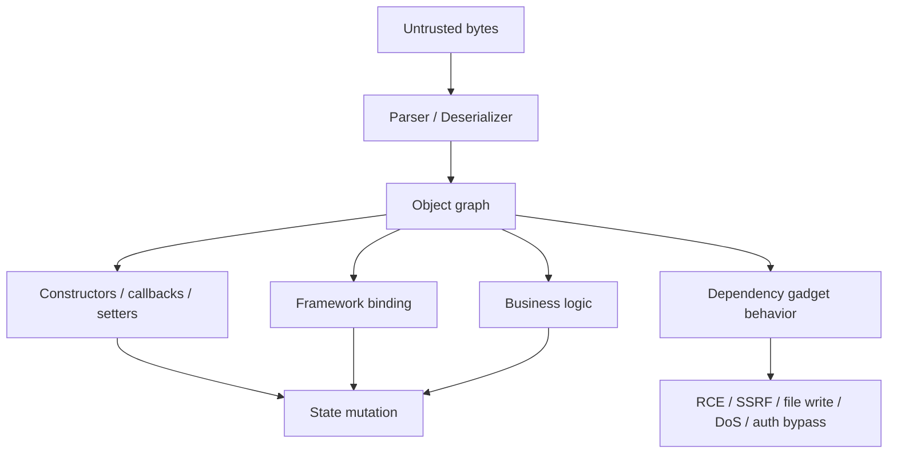
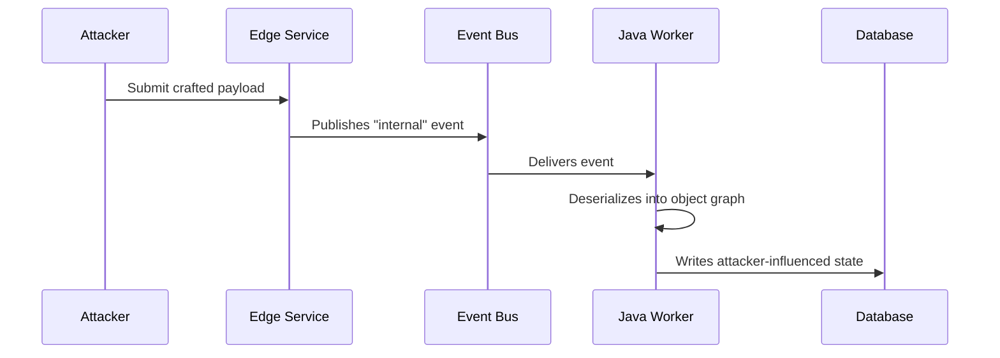
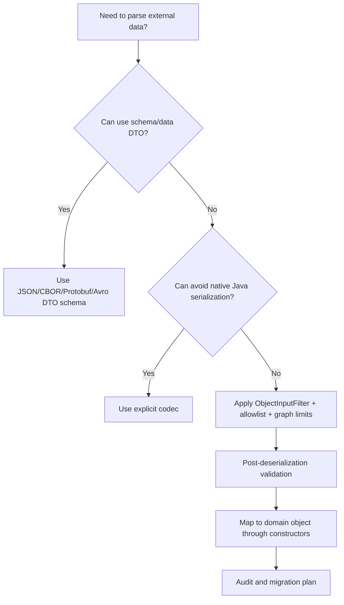
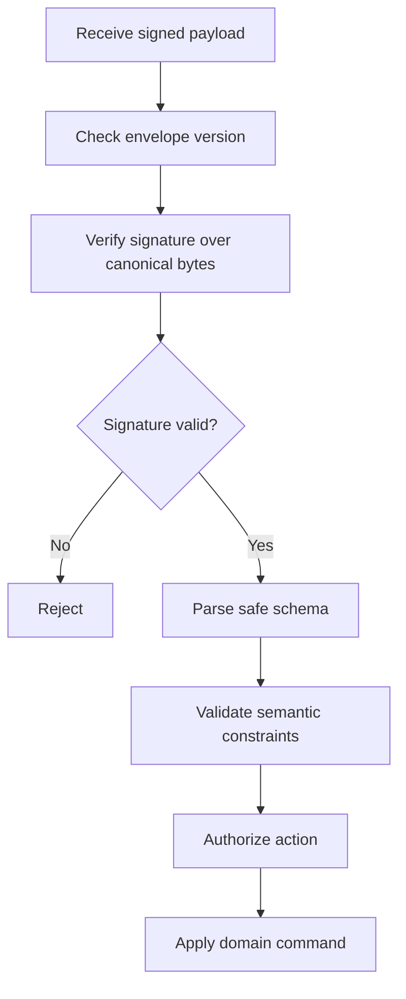
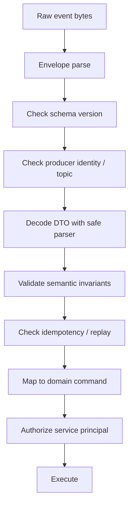
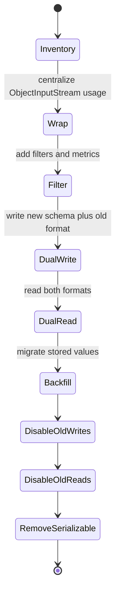

------
title: Learn Java Security, Cryptography, Integrity and Platform Hardening - Part 020
description: Secure serialization and deserialization in Java, covering native serialization, object filters, gadget chains, parser hardening, polymorphic JSON/XML risks, and safe schema-based alternatives.
series: learn-java-security-cryptography-integrity-hardening
seriesTitle: Learn Java Security, Cryptography, Integrity and Platform Hardening
order: 20
partTitle: Secure Serialization and Deserialization
tags:
- java
- security
- serialization
- deserialization
- objectinputfilter
- parser-hardening
- hardening
date: 2026-06-28
---

# Part 020 — Secure Serialization and Deserialization

## 1. Position in the Kaufman Skill Map

Serialization looks like a data-format problem. In Java security, it is a **trust-boundary and object-execution problem**.

A top-tier engineer should not ask only:

> Can this payload be parsed?

The better question is:

> What behavior becomes reachable when this untrusted byte stream is converted into an object graph inside my process?

That distinction matters because Java deserialization can trigger class loading, object construction paths, `readObject`, `readResolve`, validation callbacks, collection behavior, comparator behavior, proxy behavior, framework hooks, and gadget chains from dependencies already on the classpath.



The safest deserialization strategy is usually:

> Do not deserialize untrusted data into arbitrary Java object graphs.

When deserialization is unavoidable, narrow the schema, types, object graph size, and post-parse behavior.

## 2. Vocabulary

| Term | Meaning |
|---|---|
| Serialization | Converting an object/data structure into bytes/text for storage or transfer |
| Deserialization | Reconstructing objects/data structures from bytes/text |
| Native Java serialization | `java.io.Serializable` / `ObjectInputStream` object graph mechanism |
| Gadget | A class/method sequence that can be abused during deserialization |
| Gadget chain | A chain of reachable gadgets that creates attacker-controlled behavior |
| Polymorphic deserialization | Deserialization where input controls or influences concrete subtype selection |
| Type allowlist | Explicit set of allowed classes/types |
| Object graph limit | Limit on depth, references, bytes, array length, or number of objects |
| Canonical schema | Stable representation independent of arbitrary runtime class details |

## 3. Threat Model

Deserialization risk appears whenever an attacker can influence payload bytes and the application parses those bytes into objects.

Common sources:

- HTTP request body;
- cookies;
- session stores;
- cache values;
- message queues;
- Kafka/RabbitMQ events;
- database blobs;
- uploaded files;
- RPC payloads;
- signed but attacker-controlled payloads;
- encrypted payloads after decryption;
- internal admin APIs;
- CI/CD metadata;
- replicated state from another service.

Internal does not mean trusted. If one service accepts a malicious event and republishes it internally, every downstream deserializer becomes part of the exploit path.



## 4. Native Java Serialization Risk

Native Java serialization is dangerous because the stream describes classes and object graph structure, not merely plain data.

Risk properties:

- input can request classes present on the classpath;
- deserialization may execute special methods;
- constructors may be bypassed or invariants may not run normally;
- dependencies can introduce gadgets without business code changing;
- object graph size can cause denial-of-service;
- patching one gadget does not remove the underlying hazard;
- signing/encryption does not make arbitrary object graphs safe if the signer/encrypter accepts attacker-controlled objects upstream.

The first design rule:

> Do not expose `ObjectInputStream` to untrusted data.

If a system still uses Java native serialization for trusted internal persistence, isolate it, filter it, inventory it, and migrate it.

## 5. Deserialization Is Not Just RCE

Remote code execution is the famous outcome, but it is not the only one.

| Outcome | Example |
|---|---|
| RCE | Gadget chain triggers command execution |
| SSRF | Object triggers URL fetch during parsing/binding |
| File write/delete | Gadget or custom callback touches filesystem |
| Authentication bypass | Deserialized object sets trusted flags |
| Authorization bypass | Object graph binds user-controlled owner/tenant fields |
| DoS | Deep graph, huge arrays, recursive structures, parser bombs |
| Data corruption | Partially valid object bypasses domain constructors |
| Secret leakage | Error handling/logging prints internal object state |

For regulatory or enforcement systems, data corruption and authorization bypass can be as severe as RCE. A forged object graph that changes case ownership, evidence status, escalation level, or deadline calculation may create a defensibility failure even without shell access.

## 6. Defensive Hierarchy

Use this order. Do not start with filters if you can remove the dangerous mechanism.



Preferred controls:

1. Avoid native Java serialization for untrusted data.
2. Use explicit schemas and DTOs.
3. Disable or tightly restrict polymorphic type handling.
4. Use allowlists, not denylists.
5. Limit object graph size, depth, references, array length, and bytes.
6. Validate after parsing but before domain actions.
7. Convert DTOs into domain objects through invariant-enforcing constructors/factories.
8. Keep dangerous libraries/gadgets off the classpath when possible.
9. Add exploit regression tests.
10. Monitor deserialization failures and rejected types.

## 7. ObjectInputFilter

Modern Java provides serialization filters through `ObjectInputFilter`. Filters can reject classes, array sizes, graph depth, number of references, and byte counts before full deserialization completes.

A narrow allowlist example:

```java
package example.security.serialization;

import java.io.ByteArrayInputStream;
import java.io.IOException;
import java.io.InvalidClassException;
import java.io.ObjectInputFilter;
import java.io.ObjectInputStream;
import java.util.Set;

public final class SafeObjectReader {
    private static final Set<String> ALLOWED_CLASSES = Set.of(
            "example.messages.PaymentCommand",
            "example.messages.PaymentLine",
            "java.util.ArrayList",
            "java.lang.String",
            "java.math.BigDecimal"
    );

    public Object read(byte[] bytes) throws IOException, ClassNotFoundException {
        try (ObjectInputStream in = new ObjectInputStream(new ByteArrayInputStream(bytes))) {
            in.setObjectInputFilter(this::filter);
            return in.readObject();
        }
    }

    private ObjectInputFilter.Status filter(ObjectInputFilter.FilterInfo info) {
        if (info.depth() > 20) {
            return ObjectInputFilter.Status.REJECTED;
        }
        if (info.references() > 1_000) {
            return ObjectInputFilter.Status.REJECTED;
        }
        if (info.arrayLength() >= 0 && info.arrayLength() > 10_000) {
            return ObjectInputFilter.Status.REJECTED;
        }
        if (info.serialClass() == null) {
            return ObjectInputFilter.Status.UNDECIDED;
        }

        Class<?> clazz = info.serialClass();
        if (clazz.isArray()) {
            Class<?> component = clazz.getComponentType();
            return allowed(component) ? ObjectInputFilter.Status.ALLOWED : ObjectInputFilter.Status.REJECTED;
        }

        return allowed(clazz) ? ObjectInputFilter.Status.ALLOWED : ObjectInputFilter.Status.REJECTED;
    }

    private boolean allowed(Class<?> clazz) {
        if (clazz.isPrimitive()) {
            return true;
        }
        return ALLOWED_CLASSES.contains(clazz.getName());
    }
}
```

Caveats:

- filters reduce risk; they do not make arbitrary deserialization safe;
- allowlisting collection types can still allow attacker-shaped graphs;
- allowlisting framework or JDK types too broadly can reintroduce gadget risk;
- class-level filters should be combined with object graph limits;
- global filters need careful compatibility testing;
- logging rejected class names can leak internals if exposed externally.

## 8. Filter Pattern Strings

Java serialization filters can also be configured with pattern strings. A pattern can include class/package rules and limits.

Conceptual example:

```text
maxdepth=20;maxrefs=1000;maxarray=10000;example.messages.*;java.base/java.lang.String;!* 
```

Do not paste this blindly. The safe pattern depends on your actual serialized types. The important design is:

- set strict limits;
- allow only known packages/classes;
- reject everything else;
- test with real production-compatible payloads;
- monitor rejection rates after deployment.

## 9. Post-Deserialization Validation

Filtering classes is not enough. A deserialized allowed class can still carry invalid domain state.

Bad:

```java
PaymentCommand command = (PaymentCommand) safeReader.read(bytes);
paymentService.execute(command);
```

Better:

```java
PaymentCommandDto dto = (PaymentCommandDto) safeReader.read(bytes);
ValidatedPaymentCommand command = PaymentCommandValidator.validate(dto, authenticatedPrincipal);
paymentService.execute(command);
```

Validation must check:

- required fields;
- length/range;
- allowed enum values;
- tenant/owner consistency;
- principal authorization;
- idempotency key;
- timestamp freshness;
- replay protection;
- canonical representation if signatures are involved.

## 10. Signed Serialized Data

Signing data provides integrity and authenticity of the bytes. It does not automatically make the data semantically safe.

A secure pipeline:



Do not deserialize first and verify later. That defeats the purpose.

Also avoid signing arbitrary native serialized objects as the canonical representation. Native serialization is tied to Java class details and can be brittle across versions.

## 11. JSON Deserialization Risks

JSON feels safer than Java serialization because it is data-oriented. But unsafe binding can still create vulnerabilities.

Risky patterns:

- binding request JSON directly into domain entities;
- enabling polymorphic type metadata from untrusted input;
- mass assignment into fields such as `role`, `tenantId`, `status`, `approved`, `ownerId`;
- accepting unknown fields without review in high-integrity APIs;
- using custom deserializers that trigger network/file operations;
- treating validation annotations as authorization controls;
- relying on client-provided object IDs for ownership.

Safer pattern:

```java
public record CreateCaseRequest(
        String externalReference,
        String subjectName,
        String allegationCode,
        String idempotencyKey
) {}

public final class CreateCaseMapper {
    public CreateCaseCommand toCommand(CreateCaseRequest request, Principal principal) {
        return CreateCaseCommand.create(
                principal.tenantId(),
                principal.userId(),
                normalizeExternalReference(request.externalReference()),
                validateSubjectName(request.subjectName()),
                validateAllegationCode(request.allegationCode()),
                requireIdempotencyKey(request.idempotencyKey())
        );
    }
}
```

Notice what is absent from the request:

- `tenantId`;
- `ownerId`;
- `status`;
- `createdBy`;
- `riskScoreOverride`;
- `approved`.

Those values belong to server-side decisions.

## 12. Polymorphic JSON

Polymorphic JSON deserialization is dangerous when the input can choose a concrete Java type.

Risky conceptual payload:

```json
{
  "@type": "some.class.AvailableOnClasspath",
  "property": "attacker-controlled"
}
```

Safer model:

```json
{
  "type": "EMAIL_NOTIFICATION",
  "recipient": "case-owner",
  "template": "case-opened"
}
```

Then map `type` to an internal enum and explicit factory:

```java
public NotificationCommand toCommand(NotificationRequest request) {
    return switch (request.type()) {
        case EMAIL_NOTIFICATION -> emailFactory.create(request);
        case SMS_NOTIFICATION -> smsFactory.create(request);
        case WEBHOOK_NOTIFICATION -> webhookFactory.create(request);
    };
}
```

The external discriminator selects a business variant, not an arbitrary class.

## 13. XML Deserialization and Parser Hardening

XML has its own risks:

- XXE;
- entity expansion bombs;
- external DTD access;
- schema poisoning;
- XPath injection;
- unsafe JAXB binding;
- oversized documents;
- namespace confusion.

A hardened DOM parser shape:

```java
import javax.xml.XMLConstants;
import javax.xml.parsers.DocumentBuilderFactory;

public final class XmlFactory {
    public static DocumentBuilderFactory hardenedDocumentBuilderFactory() throws Exception {
        DocumentBuilderFactory factory = DocumentBuilderFactory.newInstance();
        factory.setNamespaceAware(true);
        factory.setFeature("http://apache.org/xml/features/disallow-doctype-decl", true);
        factory.setFeature("http://xml.org/sax/features/external-general-entities", false);
        factory.setFeature("http://xml.org/sax/features/external-parameter-entities", false);
        factory.setFeature("http://apache.org/xml/features/nonvalidating/load-external-dtd", false);
        factory.setXIncludeAware(false);
        factory.setExpandEntityReferences(false);
        factory.setAttribute(XMLConstants.ACCESS_EXTERNAL_DTD, "");
        factory.setAttribute(XMLConstants.ACCESS_EXTERNAL_SCHEMA, "");
        return factory;
    }
}
```

Parser features vary by implementation; test your actual runtime.

## 14. YAML, Expression Languages, and “Helpful” Formats

Some formats are dangerous because they can encode rich object types, anchors, aliases, or execution-like behavior.

Be careful with:

- YAML loaders that construct arbitrary objects;
- expression language fields;
- templating payloads;
- scripting hooks;
- spreadsheet formulas in uploads;
- archive formats with paths/symlinks;
- compressed payloads with high expansion ratio.

The safe default is:

> Use safe loaders, schema validation, resource limits, and DTO mapping. Never let untrusted data choose runtime classes or executable behavior.

## 15. Message Queue and Event Deserialization

Internal event systems often hide deserialization risk. A message from Kafka, RabbitMQ, SQS, or a database outbox may have crossed multiple services.

Event consumer pattern:



Do not consume events directly into JPA entities or domain aggregates. Events are external facts, not trusted internal objects.

## 16. Cache and Session Stores

Caches and session stores are frequently overlooked.

Risk scenarios:

- Redis value contains native Java serialized object;
- session deserialization loads old classes after deployment;
- attacker can write to cache through another vulnerability;
- cache poisoning changes authorization decisions;
- old serialized objects bypass new constructor validation;
- deserialization failure causes login outage.

Hardening approach:

- prefer JSON/CBOR/Protobuf DTOs over native serialization;
- version cache payloads;
- set TTLs;
- validate after cache read;
- do not cache high-risk authorization decisions without invalidation strategy;
- include cache payload migration plan.

## 17. Domain Invariants After Parsing

A secure parser can still produce a dangerous domain command if business invariants are missing.

For example, a case escalation command should not accept this from input:

```json
{
  "caseId": "C-123",
  "newLevel": "CRITICAL",
  "approvedBy": "chief-regulator",
  "effectiveAt": "2026-06-28T00:00:00Z"
}
```

A safer command has server-derived fields:

```java
public record EscalateCaseCommand(
        CaseId caseId,
        EscalationLevel requestedLevel,
        UserId requestedBy,
        TenantId tenantId,
        Instant requestedAt,
        IdempotencyKey idempotencyKey
) {}
```

Approval is a separate workflow step, not a user-controlled field.

## 18. Testing Strategy

Security tests should include negative and adversarial cases.

### 18.1 Native Serialization Tests

- unknown class rejected;
- unexpected collection rejected;
- excessive depth rejected;
- excessive references rejected;
- excessive array length rejected;
- valid legacy payload still accepted if migration requires it;
- rejection is logged internally without leaking externally.

### 18.2 JSON/XML Tests

- unknown fields policy is enforced;
- privileged fields cannot be mass-assigned;
- polymorphic type metadata is rejected;
- XXE payload is rejected;
- entity expansion is blocked;
- oversized payload is blocked;
- invalid enum values are rejected;
- parser errors return safe error responses.

### 18.3 Regression Test Shape

```java
@Test
void rejectsTypeMetadataInExternalJson() {
    String payload = """
            {
              "@type": "com.example.InternalAdminCommand",
              "userId": "attacker",
              "role": "SUPER_ADMIN"
            }
            """;

    assertThrows(BadRequestException.class, () -> api.parseCreateUserRequest(payload));
}
```

## 19. Operational Detection

Monitor:

- deserialization filter rejections by class/package;
- parser failures by endpoint/topic;
- oversized payload rejection;
- unknown schema versions;
- unexpected polymorphic metadata;
- XML DOCTYPE usage;
- sudden parse error spikes;
- class not found during deserialization after deploy;
- cache/session decode failures;
- message dead-letter queue growth.

A spike in deserialization failures may indicate probing.

## 20. Migration Away from Native Serialization

A realistic migration path:



Inventory questions:

- Where is `ObjectInputStream` used?
- Which classes implement `Serializable`?
- Which payloads cross trust boundaries?
- Which dependencies bring known gadget classes?
- Which caches/session stores use native serialization?
- Which queues/events use Java-specific encoding?
- Which signed/encrypted blobs contain serialized objects?
- Which stored payloads must remain readable for legal or audit reasons?

## 21. Anti-Patterns

| Anti-Pattern | Why It Fails |
|---|---|
| “It is internal, so it is safe” | Internal payloads can be attacker-influenced upstream |
| Native serialization over HTTP | Exposes arbitrary object graph surface |
| Denylisting known bad classes | Gadget space changes with dependencies |
| Deserializing before verifying signature | Exploit can happen before verification |
| Binding JSON directly into entities | Enables mass assignment and invariant bypass |
| Letting input choose Java class | Polymorphic gadget/type confusion risk |
| No object graph limits | DoS via depth, references, or arrays |
| Trusting cache/session values | Cache poisoning and stale class invariants |
| Logging full parse payloads | Sensitive data and exploit payload leakage |
| Treating validation as authorization | Valid fields can still be unauthorized |

## 22. Review Checklist

### Native Java Serialization

- [ ] Is untrusted native Java deserialization completely avoided?
- [ ] If not, is `ObjectInputFilter` applied?
- [ ] Is there a strict allowlist?
- [ ] Are depth/reference/array/byte limits enforced?
- [ ] Are rejected payloads monitored?
- [ ] Is there a migration plan away from native serialization?

### JSON / XML / YAML

- [ ] Is input bound to DTOs, not domain entities?
- [ ] Are privileged fields server-derived?
- [ ] Is polymorphic deserialization disabled or explicitly allowlisted?
- [ ] Are XML external entities and DTDs disabled?
- [ ] Are size limits enforced before parsing?
- [ ] Are unknown fields handled deliberately?
- [ ] Are parser errors safe externally and useful internally?

### Domain Mapping

- [ ] Are semantic invariants checked after parsing?
- [ ] Is authorization performed after resource binding?
- [ ] Is idempotency/replay handled where needed?
- [ ] Is schema versioning explicit?
- [ ] Are old schema versions migrated or rejected intentionally?

## 23. Exercises

### Exercise 1 — Find Deserialization Surfaces

Search a codebase for:

```text
ObjectInputStream
Serializable
readObject
readResolve
Externalizable
@JsonTypeInfo
default typing
JAXBContext
XMLInputFactory
DocumentBuilderFactory
Yaml
RedisSerializer
SessionSerializer
```

Classify each occurrence:

```text
Location:
Input source:
Trust boundary:
Format:
Allowed types:
Graph limits:
Post-parse validation:
Migration plan:
Owner:
```

### Exercise 2 — Replace Native Serialization

Take one internal Java-serialized cache value and design a replacement using a versioned DTO:

```json
{
  "schemaVersion": 2,
  "type": "CASE_SUMMARY_CACHE",
  "caseId": "C-123",
  "tenantId": "T-456",
  "status": "OPEN",
  "updatedAt": "2026-06-28T12:00:00Z"
}
```

Define:

- schema version;
- parser limits;
- validation rules;
- unknown field policy;
- rollout strategy;
- cache invalidation strategy;
- rollback strategy.

### Exercise 3 — Write an ObjectInputFilter Policy

For a legacy component that must read serialized `PaymentCommand` objects, create:

- allowed classes;
- max depth;
- max references;
- max array length;
- metrics;
- rejection tests;
- migration deadline.

## 24. Summary

Deserialization is dangerous because it turns data into behavior.

The defensive hierarchy is:

1. Avoid native Java serialization for untrusted data.
2. Prefer explicit schemas and DTOs.
3. Disable arbitrary polymorphic type selection.
4. Apply allowlists and object graph limits when native serialization remains.
5. Validate semantic invariants after parsing.
6. Derive privileged fields server-side.
7. Treat internal messages, caches, and sessions as attack surfaces.
8. Add tests and telemetry for rejected payloads.
9. Plan migration away from native serialization.

The key invariant:

> A parser should produce inert data. Domain authority should only appear after validation, authorization, and explicit construction inside trusted code.

## References

- Oracle Java ObjectInputFilter API documentation — serialization filter warnings and API behavior.
- Oracle Serialization Filtering guide — class allowlists and object graph limits.
- OWASP Deserialization Cheat Sheet — Java `ObjectInputStream` hardening guidance.
- OWASP Java Security Cheat Sheet — Java-specific secure coding considerations.
- OWASP XML External Entity Prevention Cheat Sheet — XML parser hardening.
- Oracle Secure Coding Guidelines for Java SE — serialization and deserialization guidance.
