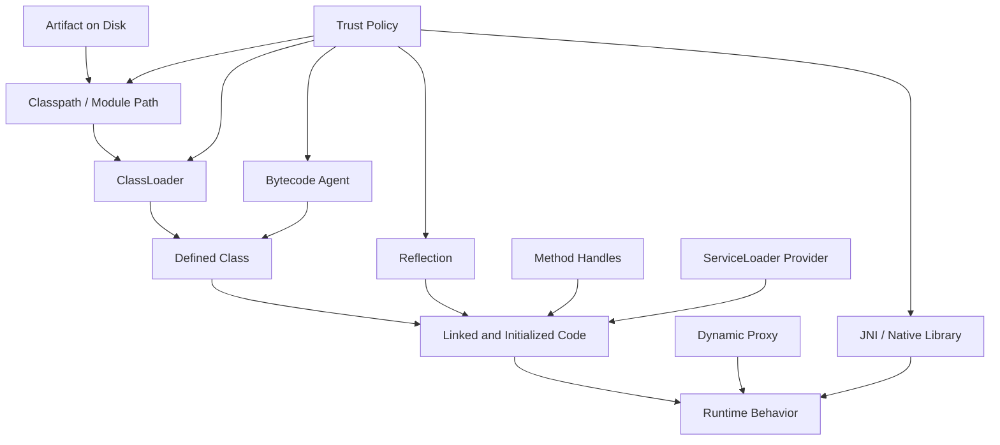
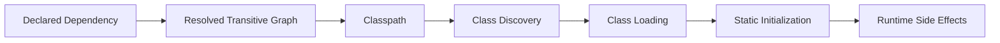
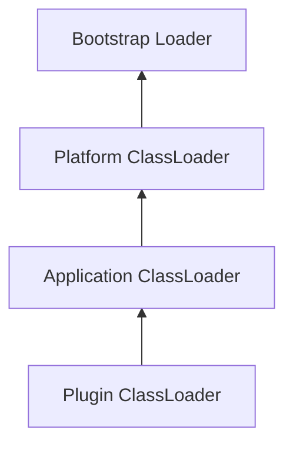
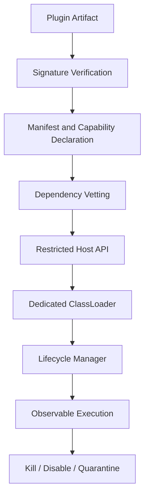
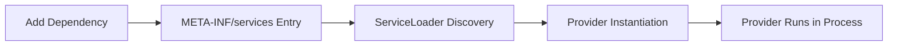
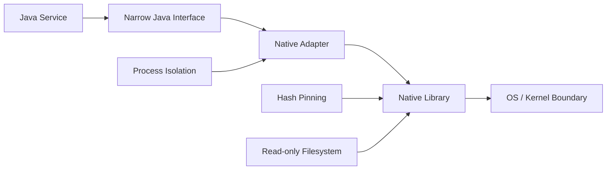
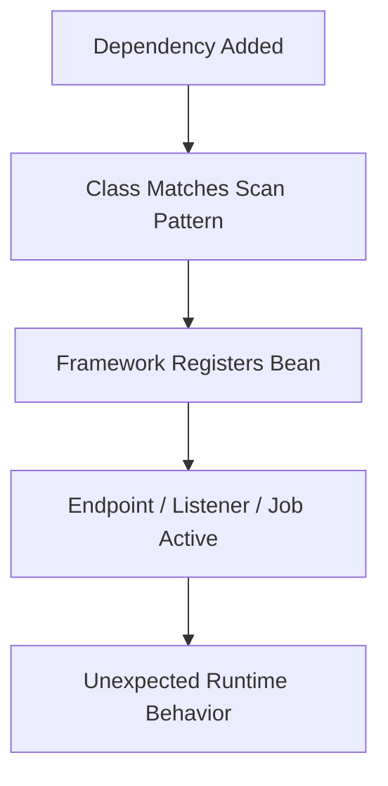
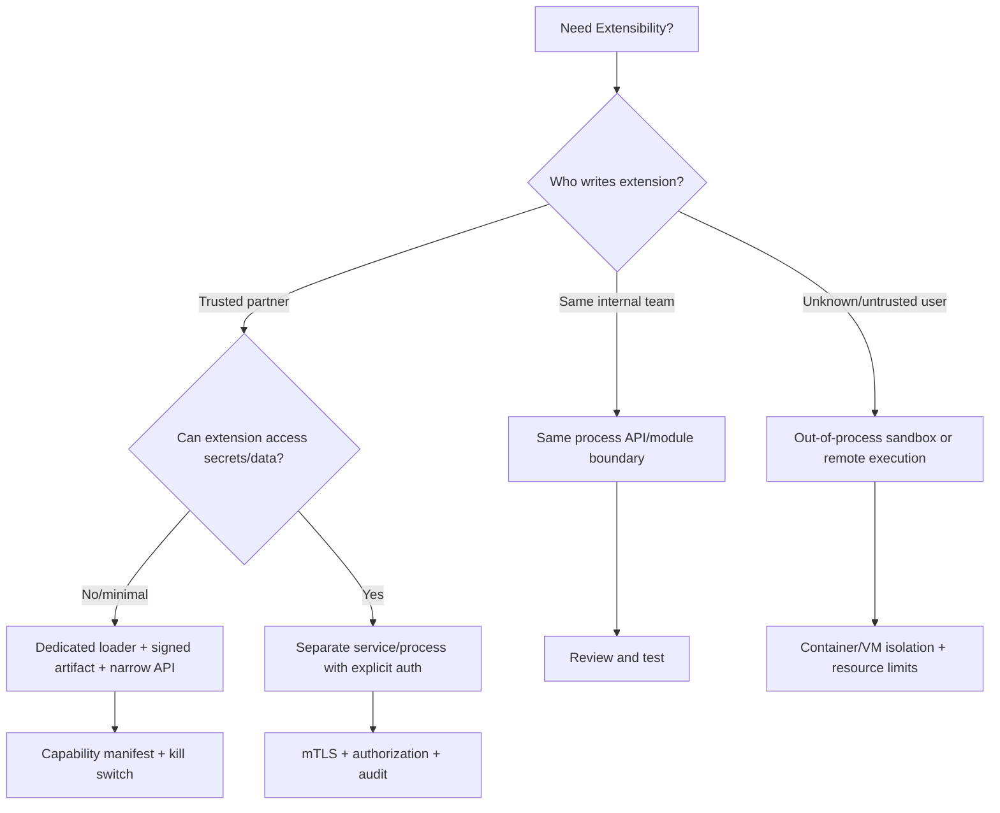

------
title: Learn Java Security, Cryptography, Integrity and Platform Hardening - Part 021
description: Classloading, reflection, JPMS modules, agents, bytecode manipulation, plugin boundaries, and hardening extensibility points in modern Java.
series: learn-java-security-cryptography-integrity-hardening
seriesTitle: Learn Java Security, Cryptography, Integrity and Platform Hardening
order: 21
partTitle: Classloading, Reflection, and Modules
tags:
- java
- security
- classloading
- reflection
- jpms
- modules
- agents
- hardening
date: 2026-06-28
---

# Part 021 — Classloading, Reflection, and Modules

This part is about one of the most misunderstood security boundaries in Java: the boundary between *code that is present*, *code that is loaded*, *code that is linked*, *code that is allowed to access internals*, and *code that can modify runtime behavior*.

In a normal business service, classloading and reflection feel like implementation details. In a hardened Java platform, they are part of the attack surface.

A top-tier engineer does not ask only:

> “Can this class be instantiated?”

They ask:

> “Who supplied this bytecode, who is allowed to load it, which loader defined it, which packages does it access, which modules are opened to it, which agents can transform it, and which operational controls prevent it from becoming a sandbox escape?”

This distinction matters because modern Java security cannot rely on the legacy Security Manager as a runtime sandbox. Encapsulation, dependency control, process isolation, module boundaries, classloader discipline, native access control, artifact integrity, and operational hardening must work together.

---

## 1. Kaufman Skill Slice

In Kaufman's learning model, this part is a *subskill*, not a complete security system.

The skill is:

> Given a Java runtime, identify every mechanism that can introduce, locate, load, transform, introspect, or access code, then turn that mechanism into an explicit trust boundary.

### 1.1 Why This Is a Separate Skill

Most Java engineers know `ClassLoader`, reflection, `ServiceLoader`, annotations, proxies, or agents as productivity tools.

Security engineers see the same tools differently:

| Mechanism | Productivity view | Security view |
|---|---|---|
| Classpath | Where dependencies live | Unscoped code authority pool |
| Module path | Better dependency structure | Readability/export/open boundary |
| Reflection | Framework convenience | Encapsulation bypass attempt |
| Dynamic proxy | Framework abstraction | Runtime behavior injection |
| Bytecode agent | Observability/profiling | Code transformation authority |
| Plugin system | Extensibility | Third-party code execution boundary |
| `ServiceLoader` | Auto-discovery | Provider injection surface |
| JNI/JNA/FFM | Native integration | JVM memory/process boundary crossing |

The core lesson: **runtime extensibility is a security boundary**.

---

## 2. Runtime Code Authority Mental Model

A Java process is not just your application source code. It is a living runtime graph.



Each arrow answers a different security question:

| Question | Example |
|---|---|
| Can code enter the distribution? | Dependency, plugin, shaded JAR, side-loaded file |
| Can code be discovered? | Classpath scanning, `ServiceLoader`, package scanning |
| Can code be loaded? | `ClassLoader#defineClass`, custom loader, URL loader |
| Can code access internals? | Reflection, `opens`, `--add-opens`, method handles |
| Can code change behavior? | Agents, transformers, proxies, instrumentation |
| Can code escape JVM assumptions? | Native library, process execution, filesystem access |

A hardened platform makes these questions explicit.

---

## 3. Classpath Is Not a Security Boundary

The classpath is historically simple: put classes and JARs somewhere, and the application class loader can find them.

That simplicity is useful. It is also dangerous.

### 3.1 Classpath Properties

A classpath-heavy application often has these properties:

- many libraries share one large namespace;
- transitive dependencies can introduce classes unexpectedly;
- split packages can create ambiguity;
- resource lookup can be order-dependent;
- service providers can be discovered implicitly;
- shaded JARs can hide duplicated classes;
- duplicate classes can create version confusion;
- all loaded code has similar in-process power once executed.

The classpath does not say:

- this library may read only these packages;
- this plugin may call only this API;
- this dependency may not use reflection;
- this provider was intentionally approved;
- this code may not start threads or open sockets.

It only participates in discovery and loading.

### 3.2 Security Consequence

A dependency that reaches the classpath is not just “available”. It is potentially executable.

That means dependency governance is runtime governance.



The dangerous edge is often `E -> F`.

Static initializers, service providers, logging bindings, serialization gadgets, annotation processors, framework scanners, and drivers can run before a developer thinks “business logic started”.

### 3.3 Classpath Hardening Checklist

Use this checklist for any production Java service:

- produce a deterministic dependency graph;
- lock dependency versions where possible;
- fail CI on duplicate classes in sensitive packages;
- fail CI on unexpected shaded packages;
- review all libraries that register service providers;
- restrict runtime directories that can be added to classpath;
- never build plugin loading from arbitrary filesystem paths;
- avoid wildcard classpath expansion in production launch scripts;
- make classpath/module path visible in startup diagnostics;
- treat changes to launch command as security-relevant changes.

---

## 4. ClassLoader Mental Model

A `ClassLoader` does three important things:

1. finds class bytes;
2. defines a class from those bytes;
3. participates in identity of the resulting class.

The same class name loaded by two different class loaders can represent two different runtime types.

```java
// Same binary name does not necessarily mean same runtime type.
// Identity is effectively: (binaryName, definingClassLoader).
com.example.Plugin pluginA;
com.example.Plugin pluginB;
```

This is the basis of application servers, plugin systems, test isolation, hot deployment, and module layers.

It is also a common source of confused security assumptions.

### 4.1 Built-in Loaders

Modern Java has built-in loaders such as:

| Loader | Role |
|---|---|
| Bootstrap loader | Core platform classes |
| Platform class loader | Platform classes and JDK-specific runtime classes |
| System/application class loader | Application classpath/module path classes |

The exact details evolve, but the important security principle is stable:

> A class loader is an authority boundary only if you design it as one and prevent untrusted code from using ambient process power.

A custom class loader alone is not a sandbox.

### 4.2 Parent Delegation

The common classloader model delegates upward first:



Parent-first delegation prevents plugins from shadowing platform classes, but it does not prevent plugins from calling allowed APIs.

Child-first loaders can be useful for isolation, but they increase risk of:

- dependency shadowing;
- inconsistent type identity;
- accidental framework duplication;
- class cast failures;
- security-sensitive class spoofing;
- gadget availability changes.

### 4.3 Defining a Class Is a Security Event

When a loader defines a class, several things become possible:

- bytecode verification occurs;
- package/module membership is assigned;
- static initialization may later execute;
- annotations may be scanned;
- reflective access may be attempted;
- service providers may become visible;
- frameworks may bind handlers automatically.

In high-assurance systems, loading unreviewed code is not a normal operational action.

It should require policy.

---

## 5. Plugin Systems: Extension Without Illusion

A plugin architecture is a local code execution architecture.

This statement is intentionally blunt.

If a plugin runs in the same JVM process, then unless strict external controls exist, it can usually:

- allocate memory;
- consume CPU;
- start threads;
- call accessible application APIs;
- use reflection if packages are open;
- interact with global singletons;
- observe process-level configuration;
- interfere with classpath resources;
- trigger logging/metrics side effects;
- exploit vulnerabilities in host libraries.

### 5.1 Three Plugin Trust Models

| Model | Description | Security posture |
|---|---|---|
| Trusted extension | Internal team code, reviewed and signed | Same-process acceptable with governance |
| Partner extension | Third-party but contractually trusted | Same-process risky; use restricted API and signing |
| Untrusted extension | User-uploaded/custom code | Do not run in same JVM; isolate out-of-process |

The common mistake is designing for “trusted extension” and later selling it as “untrusted sandbox”.

### 5.2 Same-Process Plugin Boundary

A same-process plugin boundary can help with architecture, but it is not a hard security boundary.

Use it for:

- API cleanliness;
- dependency isolation;
- controlled lifecycle;
- compatibility management;
- fault attribution;
- capability declaration.

Do not claim it provides:

- reliable filesystem isolation;
- network isolation;
- memory isolation;
- CPU isolation;
- secret isolation;
- strong tenant isolation.

For those, use process, container, VM, or remote execution isolation.

### 5.3 Safer Plugin Contract

A safer plugin model has these properties:



A plugin should declare:

- plugin id;
- version;
- required host API version;
- required capabilities;
- external network needs;
- filesystem needs;
- event subscriptions;
- data categories accessed;
- signing identity;
- minimum/maximum compatible platform version.

Example manifest:

```yaml
pluginId: fraud-risk-adapter
version: 2.4.1
hostApi: com.acme.platform.plugin.v3
requires:
  capabilities:
    - READ_CASE_SUMMARY
    - EMIT_RISK_SIGNAL
  network:
    outbound:
      - risk-api.internal.example.com:443
  data:
    - CASE_ID
    - PARTY_RISK_SCORE
signature:
  keyId: plugin-signing-2026-q2
  algorithm: Ed25519
```

The manifest is not enforcement by itself. It is the policy input.

---

## 6. ServiceLoader and Provider Injection

`ServiceLoader` is a powerful mechanism for discovering providers on the classpath or module path.

It is used by many Java systems and libraries.

Security issue: service discovery can become provider injection when an unexpected JAR contributes an implementation.

### 6.1 Risk Pattern



The risk is not that `ServiceLoader` is bad. The risk is implicit authority.

### 6.2 Hardening Rules

For sensitive service interfaces:

- do not load all providers blindly;
- explicitly allow provider class names;
- verify provider module/artifact identity;
- log selected provider at startup;
- fail closed if multiple providers compete unexpectedly;
- avoid loading providers before configuration integrity checks;
- separate provider discovery from provider activation;
- treat provider activation as a security decision.

Example:

```java
public final class ProviderSelector<T> {
    private final Set<String> allowedProviders;

    public ProviderSelector(Set<String> allowedProviders) {
        this.allowedProviders = Set.copyOf(allowedProviders);
    }

    public T select(Class<T> serviceType) {
        List<T> providers = ServiceLoader.load(serviceType)
                .stream()
                .map(ServiceLoader.Provider::get)
                .filter(provider -> allowedProviders.contains(provider.getClass().getName()))
                .toList();

        if (providers.size() != 1) {
            throw new SecurityException("Expected exactly one approved provider for " + serviceType.getName());
        }
        return providers.getFirst();
    }
}
```

The key idea: discovery is not authorization.

---

## 7. Reflection as an Encapsulation Pressure Valve

Reflection lets code inspect and invoke types dynamically.

Frameworks use it for:

- dependency injection;
- serialization;
- ORM mapping;
- testing;
- annotation processing;
- proxies;
- RPC frameworks;
- configuration binding.

Security engineers must track it because reflection can also:

- bypass intended object construction paths;
- access fields outside normal APIs if packages are open;
- mutate supposedly internal state;
- instantiate classes by name;
- trigger static initialization;
- call methods selected from untrusted input;
- weaken module encapsulation through operational flags.

### 7.1 Reflection Risk Taxonomy

| Risk | Example |
|---|---|
| Type confusion | Class name controlled by input |
| Constructor bypass | Framework instantiates object outside factory invariant |
| Private state mutation | Test utility leaks into production path |
| Method injection | User controls method name or expression |
| Deserialization bridge | Object mapper enables polymorphic gadget type |
| Encapsulation weakening | `--add-opens` broadly exposes internals |
| Secret exposure | Reflection-based logging dumps private fields |

### 7.2 Reflection Boundary Rule

Never reflect over a target selected directly by untrusted input.

Bad:

```java
String className = request.getParameter("handler");
Class<?> type = Class.forName(className);
Object handler = type.getDeclaredConstructor().newInstance();
```

Better:

```java
public enum HandlerId {
    CREATE_CASE,
    CLOSE_CASE,
    ESCALATE_CASE
}

private static final Map<HandlerId, Supplier<CommandHandler>> HANDLERS = Map.of(
        HandlerId.CREATE_CASE, CreateCaseHandler::new,
        HandlerId.CLOSE_CASE, CloseCaseHandler::new,
        HandlerId.ESCALATE_CASE, EscalateCaseHandler::new
);

public CommandHandler resolve(String rawHandlerId) {
    HandlerId id = HandlerId.valueOf(rawHandlerId);
    Supplier<CommandHandler> supplier = HANDLERS.get(id);
    if (supplier == null) {
        throw new IllegalArgumentException("Unsupported handler");
    }
    return supplier.get();
}
```

The safe pattern converts untrusted input into a closed domain value first.

### 7.3 Reflection in Secure DTO Mapping

Reflection-based mappers can create mass assignment vulnerabilities.

Bad domain object shape:

```java
public class UserAccount {
    public String displayName;
    public boolean admin;
    public boolean locked;
    public String passwordHash;
}
```

If a reflection mapper binds request fields blindly, the request can mutate privileged fields.

Better:

```java
public record UpdateProfileRequest(String displayName) {}

public final class UserAccount {
    private final UserId id;
    private String displayName;
    private boolean admin;
    private boolean locked;
    private String passwordHash;

    public void updateProfile(UpdateProfileRequest request) {
        this.displayName = DisplayName.normalize(request.displayName()).value();
    }
}
```

Do not let reflection become a generic write API into your domain model.

---

## 8. JPMS: Modules as Encapsulation, Not Complete Sandbox

The Java Platform Module System gives Java stronger structure:

- explicit module dependencies;
- exported packages;
- opened packages;
- service usage/provision;
- module layers;
- stronger encapsulation.

This is valuable for hardening.

But JPMS is not a complete security sandbox.

### 8.1 `exports` vs `opens`

| Directive | Meaning | Security implication |
|---|---|---|
| `exports` | Other modules can compile/access public types in package | Public API surface |
| `exports ... to` | Qualified export to specific modules | Narrower public API surface |
| `opens` | Reflective access allowed at runtime | Framework/serialization reflection surface |
| `opens ... to` | Qualified reflective access | Preferred for frameworks |
| `open module` | All packages open reflectively | Dangerous default for hardened modules |

A hardened module should export and open as little as possible.

Example:

```java
module com.acme.casecore {
    exports com.acme.casecore.api;
    exports com.acme.casecore.events;

    opens com.acme.casecore.dto to com.fasterxml.jackson.databind;

    requires java.sql;
    requires com.fasterxml.jackson.databind;
}
```

This is better than:

```java
open module com.acme.casecore {
    exports com.acme.casecore.api;
    exports com.acme.casecore.internal;
    requires com.fasterxml.jackson.databind;
}
```

### 8.2 Internal Packages Should Stay Internal

A module should distinguish:

- API packages;
- SPI packages;
- DTO packages;
- internal implementation packages;
- generated code packages;
- test-support packages.

Example layout:

```text
com.acme.casecore.api
com.acme.casecore.spi
com.acme.casecore.events
com.acme.casecore.dto
com.acme.casecore.internal.workflow
com.acme.casecore.internal.policy
com.acme.casecore.internal.persistence
```

Only the first few should be exported or opened.

### 8.3 Avoid Global `--add-opens`

Flags like `--add-opens` and `--add-exports` are migration tools. They should not become permanent production architecture.

Dangerous launch style:

```bash
java \
  --add-opens java.base/java.lang=ALL-UNNAMED \
  --add-opens java.base/java.util=ALL-UNNAMED \
  --add-opens java.base/java.time=ALL-UNNAMED \
  -jar app.jar
```

This weakens encapsulation broadly.

A better production policy:

- no `ALL-UNNAMED` opens unless explicitly approved;
- each `--add-opens` must have owner, reason, library, expiration date;
- startup logs must show all `add-opens` and `add-exports`;
- CI should fail on unapproved new opens;
- dependency upgrades should remove opens over time.

Example exception record:

```yaml
runtimeOpenException:
  package: java.base/java.lang
  target: com.example.legacy.mapper
  reason: Legacy reflection mapper pending upgrade
  owner: platform-runtime
  expires: 2026-09-30
  replacement: Upgrade mapper to JPMS-compatible version
```

### 8.4 Strong Encapsulation Failure Is a Signal

When Java throws `InaccessibleObjectException`, the answer is not automatically “add opens”.

It may mean:

- a library is using unsupported internals;
- your module boundary is correct;
- a mapper is too invasive;
- a test helper leaked into production code;
- a framework upgrade is needed;
- a runtime flag is masking architectural debt.

Treat reflective access failure as design feedback.

---

## 9. MethodHandles Are Not a Free Pass

`java.lang.invoke.MethodHandles` provides lower-level invocation mechanisms used by modern frameworks and the JVM.

They can be safer and faster than raw reflection when used correctly, but they still represent dynamic access.

Security questions remain:

- Who chooses the target class?
- Who chooses the method name?
- What lookup object is used?
- Does the lookup object have private access?
- Is access cached beyond intended scope?
- Can untrusted input influence invocation path?

Bad pattern:

```java
MethodHandle handle = lookup.findVirtual(type, methodFromRequest, methodType);
return handle.invoke(target, requestPayload);
```

Better pattern:

```java
enum Operation {
    APPROVE,
    REJECT,
    ESCALATE
}

final class OperationInvoker {
    private final Map<Operation, MethodHandle> handles;

    OperationInvoker(MethodHandles.Lookup lookup) throws ReflectiveOperationException {
        this.handles = Map.of(
                Operation.APPROVE, lookup.findVirtual(CaseService.class, "approve", methodType(void.class, CaseId.class)),
                Operation.REJECT, lookup.findVirtual(CaseService.class, "reject", methodType(void.class, CaseId.class)),
                Operation.ESCALATE, lookup.findVirtual(CaseService.class, "escalate", methodType(void.class, CaseId.class))
        );
    }

    void invoke(Operation operation, CaseService service, CaseId id) throws Throwable {
        handles.get(operation).invokeExact(service, id);
    }
}
```

Again: untrusted input must resolve to a closed domain value before dynamic invocation.

---

## 10. Dynamic Proxies and Generated Classes

Java systems often generate classes at runtime:

- JDK dynamic proxies;
- CGLIB/Byte Buddy proxies;
- framework interceptors;
- mock frameworks;
- RPC stubs;
- ORM proxies;
- AOP advice;
- observability agents.

Generated code is code.

### 10.1 Proxy Security Risks

| Risk | Example |
|---|---|
| Advice bypass | Direct call avoids proxy and skips authorization |
| Wrong proxy scope | Internal service method exposed through public proxy |
| Final/private method gap | Security advice does not apply |
| Self-invocation bypass | Method calls same-class method directly, bypassing interceptor |
| Mixed identity | Proxy class loader differs from target loader |
| Unsafe invocation handler | Handler reflects based on untrusted method names |

### 10.2 Authorization Must Not Depend Only on Proxy Magic

In framework systems, it is common to annotate service methods:

```java
@RequiresPermission("case:approve")
public void approve(CaseId id) {
    // ...
}
```

This is useful, but dangerous if the annotation is enforced only by proxy interception.

A secure service should have domain-level checks too:

```java
public void approve(Actor actor, CaseId id) {
    CaseRecord record = repository.get(id);
    authorization.require(actor, Permission.APPROVE_CASE, record.resourceRef());
    record.approve(actor);
    repository.save(record);
}
```

The invariant is in the domain/application service, not only in the proxy layer.

---

## 11. Java Agents and Instrumentation

Java agents are extremely powerful. They can observe or transform bytecode.

Common legitimate uses:

- APM agents;
- profiling;
- code coverage;
- security monitoring;
- tracing;
- metrics;
- hot instrumentation;
- test tooling.

Security view:

> A Java agent is code with runtime transformation authority.

### 11.1 Agent Threats

| Threat | Description |
|---|---|
| Malicious agent | Agent modifies security checks or exfiltrates data |
| Compromised vendor agent | Supply-chain compromise of observability/security agent |
| Over-privileged agent | Agent reads secrets, headers, payloads, stack traces |
| Runtime attach abuse | Process allows unexpected attach/instrumentation |
| Agent ordering issue | Multiple agents transform same class differently |
| Sensitive telemetry leak | Agent exports PII/secrets to third-party system |

### 11.2 Agent Governance

Production Java agent use should be explicit:

```yaml
javaAgents:
  - name: acme-observability-agent
    version: 4.12.3
    sha256: 7d7f...
    source: internal-artifact-registry
    owner: platform-observability
    allowedExports:
      - traces
      - metrics
      - redacted-errors
    forbiddenData:
      - access_tokens
      - authorization_headers
      - password_fields
      - encryption_keys
    reviewExpires: 2026-12-31
```

Hardening rules:

- pin agent version and checksum;
- fetch agent from trusted artifact registry only;
- prohibit ad-hoc `-javaagent` in production;
- record all agents in startup logs;
- monitor agent configuration drift;
- forbid agent telemetry from exporting secrets;
- treat agent upgrades as high-risk changes;
- disable runtime attach if not required;
- run sensitive workloads with stricter attach/process controls.

### 11.3 Attach API Concern

The attach mechanism can allow tools to connect to a running JVM for diagnostics or instrumentation depending on environment and configuration.

In hardened production:

- assume local process access is sensitive;
- restrict OS user permissions;
- avoid running multiple unrelated services under same OS user;
- restrict container escape and host PID visibility;
- disable or restrict attach where feasible;
- audit diagnostic tooling access.

A Java process is only as isolated as its OS/process boundary.

---

## 12. Annotation Processing and Build-Time Code Execution

Annotation processors run at compile time.

They are often forgotten in runtime security reviews, but they are part of supply-chain security.

Examples:

- Lombok;
- MapStruct;
- Immutables;
- AutoService;
- Dagger;
- custom code generators.

Security concerns:

- processors execute during build;
- processors can read source files;
- processors can generate code;
- compromised processors can alter generated logic;
- build logs may leak secrets;
- generated code may bypass reviews if not visible.

Hardening:

- pin annotation processor versions;
- separate processor path from normal compile classpath;
- review generated code for security-sensitive modules;
- fail CI if generated code changes unexpectedly;
- never allow arbitrary processors from transitive dependencies;
- treat processors as build-time executable code.

---

## 13. Native Access: JNI, JNA, FFM

Native integration crosses a major safety boundary.

Java memory safety does not automatically protect code once native libraries are loaded.

### 13.1 Risks

| Risk | Why it matters |
|---|---|
| Memory corruption | Native code can violate JVM assumptions |
| Secret exposure | Native code can read process memory depending on implementation |
| Platform dependency | Different behavior across OS/architecture |
| Library hijacking | Dynamic loader path manipulation |
| Unsigned native binary | Supply-chain tampering |
| Debug symbol leakage | Reverse engineering or sensitive symbol names |
| Unsafe file permissions | Writable native libraries can be replaced |

### 13.2 Native Library Hardening

- Load native libraries from immutable, controlled locations.
- Do not include writable directories in native library search path.
- Pin hashes for native artifacts.
- Prefer static container images with verified contents.
- Avoid extracting native libraries to shared temp directories.
- Use per-service OS users.
- Keep native libraries minimal and reviewed.
- Wrap native integration behind a narrow Java interface.
- Run high-risk native workloads out-of-process.



---

## 14. Classpath Scanning and Package Discovery

Frameworks scan classes for:

- annotations;
- controllers;
- entities;
- listeners;
- jobs;
- converters;
- validators;
- components;
- mappers.

Security risk: a class can become active because it matches a pattern.

### 14.1 Auto-Activation Risk



Controls:

- keep scan roots narrow;
- avoid scanning entire company package root;
- separate application and test packages;
- avoid broad wildcard component scanning;
- review auto-configuration effects;
- log registered endpoints/listeners/jobs at startup;
- require explicit activation for security-sensitive components.

Bad:

```java
@ComponentScan("com.acme")
```

Better:

```java
@ComponentScan({
    "com.acme.caseapp.web",
    "com.acme.caseapp.service",
    "com.acme.caseapp.config"
})
```

Even better for critical systems: explicit module configuration for privileged components.

---

## 15. Expression Languages and Script Engines

Dynamic expression evaluation is closely related to reflection risk.

Examples:

- rule expressions;
- template engines;
- workflow expressions;
- query DSLs;
- admin console expressions;
- policy scripts;
- dynamic mapping expressions.

Security issue: expression languages often expose object navigation, method invocation, type access, constructors, class references, or bean access.

### 15.1 Expression Boundary Rule

Never evaluate untrusted expressions in a context that can reach powerful objects.

Dangerous context:

```text
root = ApplicationContext
variables = all request headers + domain object + repository + environment
methods = unrestricted
```

Safer context:

```text
root = immutable projection
variables = allowlisted scalar values
methods = none or allowlisted pure functions
types = disabled
constructors = disabled
output = bounded scalar decision
```

### 15.2 Rule Engine Design

For regulatory/enforcement systems, rule engines are common. Avoid turning rule configuration into arbitrary code execution.

A safe rule model uses:

- typed operands;
- closed operator set;
- explicit data dictionary;
- no arbitrary method invocation;
- no class references;
- no filesystem/network access;
- deterministic execution;
- resource limits;
- audit-friendly rule versioning.

Example rule AST:

```json
{
  "all": [
    { "field": "case.riskScore", "op": ">=", "value": 80 },
    { "field": "case.status", "op": "==", "value": "OPEN" }
  ]
}
```

This is much safer than:

```text
case.getRepository().findAll().stream().anyMatch(...)
```

---

## 16. Secure Extensibility Architecture

When designing extensibility, pick the right isolation level.

| Isolation level | Mechanism | Suitable for |
|---|---|---|
| API-only | Interface + DI | Trusted internal extension |
| Module boundary | JPMS exports/opens | Internal platform structure |
| ClassLoader isolation | Dedicated loader | Version separation, semi-trusted plugins |
| Process isolation | Separate process | Partner extensions, risky native integration |
| Container isolation | Container runtime policy | Stronger resource and filesystem boundary |
| VM/microVM isolation | VM/firecracker-style isolation | Untrusted or high-risk execution |
| Remote service | Network API | Strong organizational/trust separation |

A strong architecture does not overclaim.

If code is untrusted, do not pretend JPMS or classloaders are enough.

### 16.1 Extension Decision Tree



---

## 17. Hardening Patterns

### 17.1 Pattern: Explicit Runtime Inventory

At startup, record:

- Java version;
- vendor;
- JVM arguments;
- classpath/module path fingerprint;
- module list;
- `--add-opens` and `--add-exports`;
- Java agents;
- native libraries loaded at startup;
- service providers selected;
- component scan roots;
- plugin artifacts loaded.

Example startup report:

```json
{
  "runtime": {
    "javaVersion": "25.0.3",
    "vendor": "Oracle Corporation",
    "modules": ["java.base", "java.sql", "com.acme.casecore"],
    "addOpens": [],
    "javaAgents": [
      { "name": "acme-observability-agent", "sha256": "7d7f..." }
    ],
    "serviceProviders": {
      "com.acme.crypto.KeyResolver": "com.acme.kms.KmsKeyResolver"
    }
  }
}
```

This makes runtime authority reviewable.

### 17.2 Pattern: Loader-Allowlisted Plugins

```java
public final class PluginCatalog {
    private final Map<String, ApprovedPlugin> approved;

    public ApprovedPlugin requireApproved(String pluginId, String version, String sha256) {
        ApprovedPlugin plugin = approved.get(pluginId + ":" + version);
        if (plugin == null || !plugin.sha256().equalsIgnoreCase(sha256)) {
            throw new SecurityException("Plugin is not approved: " + pluginId + ":" + version);
        }
        return plugin;
    }
}
```

Do not discover first and ask questions later.

### 17.3 Pattern: Qualified Opens

Instead of opening everything:

```java
open module com.acme.caseapp { }
```

Open only DTO packages to the mapper that needs it:

```java
module com.acme.caseapp {
    exports com.acme.caseapp.api;
    opens com.acme.caseapp.web.dto to com.fasterxml.jackson.databind;
}
```

### 17.4 Pattern: Dynamic Invocation Registry

```java
public final class CommandRegistry {
    private final Map<CommandName, CommandHandler> handlers;

    public CommandHandler resolve(String raw) {
        CommandName name = CommandName.parse(raw);
        CommandHandler handler = handlers.get(name);
        if (handler == null) {
            throw new IllegalArgumentException("Unknown command");
        }
        return handler;
    }
}
```

No raw class names. No raw method names. No expression string that calls arbitrary methods.

---

## 18. Anti-Patterns

### 18.1 “ClassLoader Sandbox”

A custom class loader does not stop code from using allowed APIs.

If the plugin can call `java.net`, `java.io`, your internal APIs, or loaded libraries, it has those powers.

### 18.2 “Just Add `--add-opens`”

This turns an encapsulation failure into permanent policy debt.

Every `--add-opens` should be treated like a firewall exception.

### 18.3 “Plugins Are Trusted Because They Are Signed”

A signature proves origin/integrity under a trust model. It does not prove behavior is safe.

Signed malicious code is still malicious if the signer is compromised or the trusted publisher ships bad code.

### 18.4 “Reflection Is Fine Because Frameworks Use It”

Framework reflection can be acceptable when bounded. Reflection over user-selected names or broad private field access is different.

### 18.5 “Agent Is Just Observability”

An agent can see and transform highly sensitive runtime behavior. Treat it as privileged code.

### 18.6 “Modules Solve Security”

Modules improve encapsulation. They do not replace authentication, authorization, process isolation, supply-chain integrity, or runtime hardening.

---

## 19. Review Checklist

Use this checklist in architecture or PR review.

### 19.1 Classpath and Module Path

- Are runtime artifacts pinned and deterministic?
- Are duplicate classes detected?
- Are shaded dependencies reviewed?
- Are service providers explicit?
- Is the launch command controlled?
- Are wildcard classpath entries avoided?

### 19.2 Modules

- Are only intended packages exported?
- Are `opens` qualified where possible?
- Is `open module` avoided?
- Are `--add-opens` exceptions documented?
- Are internal packages inaccessible to consumers?

### 19.3 Reflection

- Can untrusted input select classes, methods, fields, or expressions?
- Is reflection limited to known packages/classes?
- Are private fields exposed to logging/mapping?
- Can reflection bypass domain constructors or invariants?
- Are framework reflection needs documented?

### 19.4 Plugins

- Are plugins trusted, partner-trusted, or untrusted?
- Is same-process execution justified?
- Are plugins signed and hash-pinned?
- Is capability declaration enforced?
- Is there a kill switch?
- Are plugin APIs narrow and versioned?

### 19.5 Agents and Native Code

- Are all agents approved and pinned?
- Is runtime attach restricted?
- Are native libraries loaded from immutable paths?
- Are native artifacts signed/hash-pinned?
- Is high-risk native code isolated out-of-process?

---

## 20. Practice Lab

### Lab 1 — Runtime Inventory

Add a startup diagnostic endpoint or log section that records:

- Java version;
- JVM arguments;
- modules;
- classpath fingerprint;
- Java agents;
- selected service providers;
- `--add-opens` / `--add-exports` usage.

Do not expose this endpoint publicly. It should be internal/admin-only or emitted to secure startup logs.

### Lab 2 — Reflection Boundary Audit

Search your codebase for:

```text
Class.forName
getDeclaredField
getDeclaredMethod
setAccessible
trySetAccessible
MethodHandle
ExpressionParser
ScriptEngine
ObjectMapper default typing
```

For each usage, classify:

| Usage | Input source | Target allowlisted? | Can bypass invariant? | Action |
|---|---|---|---|---|
| `Class.forName(handler)` | Request param | No | Yes | Replace with enum registry |

### Lab 3 — JPMS Open Exception Register

Create a small YAML file containing every runtime `--add-opens` and `--add-exports` exception.

Fail CI if a new one appears without approval.

### Lab 4 — Plugin Threat Model

For an existing extension/plugin mechanism, answer:

- Who writes plugins?
- How are artifacts verified?
- How are capabilities declared?
- Which APIs are reachable?
- Can plugin code read secrets?
- Can it open network connections?
- Can it consume unbounded CPU/memory?
- How is it disabled during incident response?

---

## 21. Production Invariants

A mature Java platform should enforce these invariants:

1. No unapproved artifact enters runtime code discovery.
2. No untrusted input selects raw class/method/field names.
3. No broad reflective opening exists without owner, reason, and expiration.
4. No plugin is loaded without identity, integrity, and capability policy.
5. No Java agent runs in production without approval and hash pinning.
6. No native library is loaded from a writable or uncontrolled path.
7. No same-process plugin is marketed as an untrusted-code sandbox.
8. No security decision relies only on proxy interception.
9. No runtime extension mechanism lacks observability and kill switch.
10. No classloading/reflection/module exception is invisible to review.

---

## 22. Key Takeaways

- The classpath is a code availability mechanism, not a security boundary.
- Classloaders can structure code, but they do not sandbox untrusted behavior by themselves.
- JPMS improves encapsulation, especially through exports/opens, but it is not a full security model.
- Reflection and method handles are acceptable only when target selection is controlled.
- Dynamic proxies must not be the only place where security invariants live.
- Java agents and native libraries are privileged runtime code.
- Same-process plugins are appropriate only for trusted or carefully governed extensions.
- For untrusted code, use process/container/VM isolation instead of pretending classloaders are enough.

---

## 23. References

- Oracle Java SE 25 API: `java.lang.ClassLoader`.
- Oracle Java SE 25 API: `java.lang.ModuleLayer`.
- Oracle Java SE API: `java.lang.reflect.AccessibleObject` and `InaccessibleObjectException`.
- Oracle Java SE API: `java.lang.instrument`.
- OpenJDK JEP 261: Module System.
- OpenJDK JEP 403: Strongly Encapsulate JDK Internals.
- OpenJDK JEP 411: Deprecate the Security Manager for Removal.
- OpenJDK JEP 486: Permanently Disable the Security Manager.
- Oracle Secure Coding Guidelines for Java SE.
