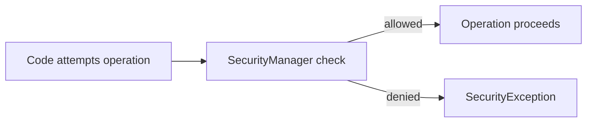
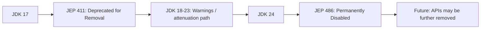
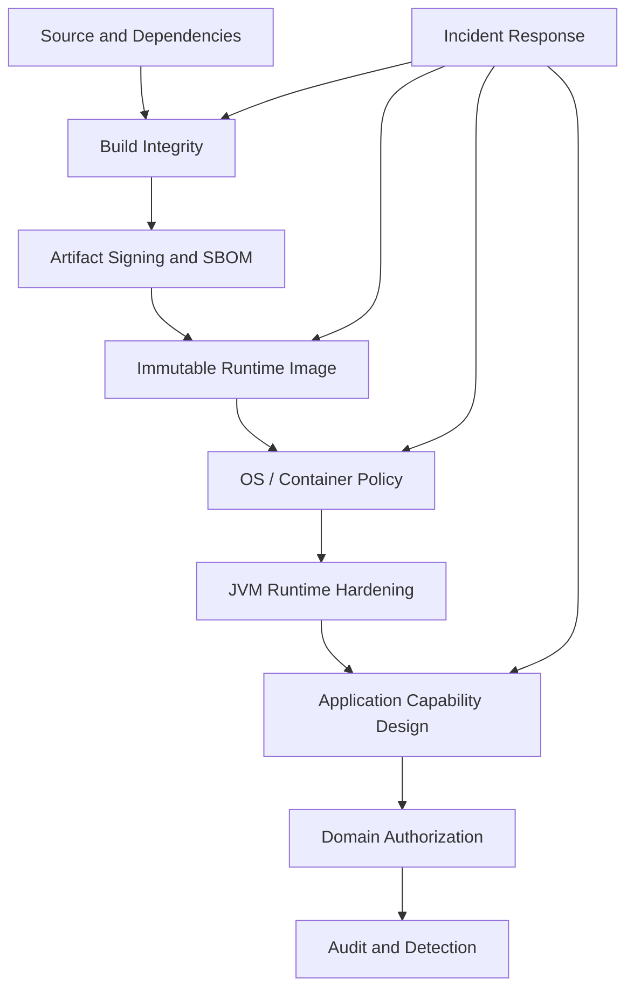
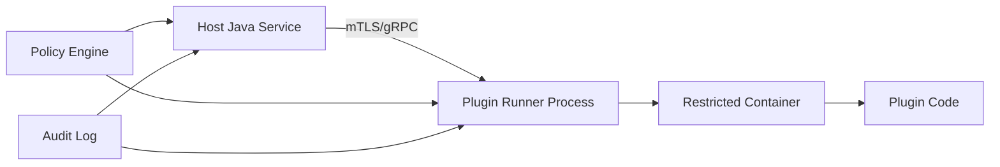
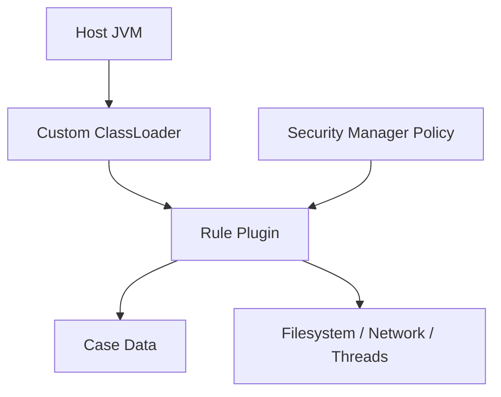
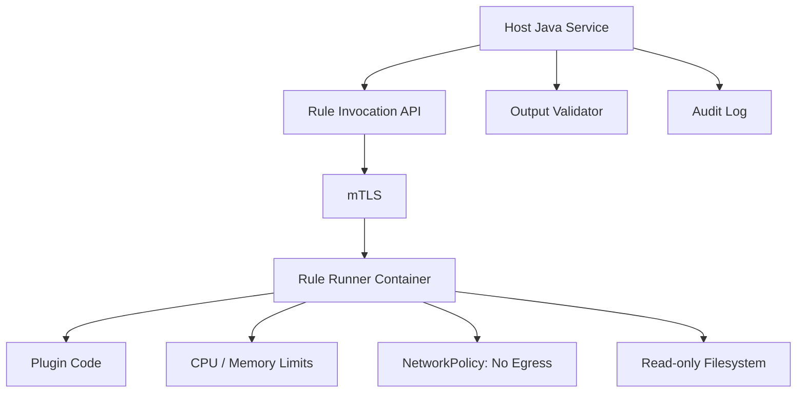

------
title: Learn Java Security, Cryptography, Integrity and Platform Hardening - Part 022
description: Why the Java Security Manager is no longer a viable sandbox, what changed in JDK 24+, and how to replace it with modern isolation, capability minimization, OS/container controls, and explicit security architecture.
series: learn-java-security-cryptography-integrity-hardening
seriesTitle: Learn Java Security, Cryptography, Integrity and Platform Hardening
order: 22
partTitle: Security Manager Is Dead — Now What?
tags:
- java
- security
- security-manager
- jep-411
- jep-486
- sandboxing
- isolation
- platform-hardening
date: 2026-06-28
---

# Part 022 — Security Manager Is Dead — Now What?

For many years, Java had a feature called the Security Manager. It was designed to let code check whether an operation was allowed before doing something sensitive, such as reading a file, opening a socket, accessing a system property, or exiting the JVM.

That era is over.

As of JDK 24, the Security Manager is permanently disabled. In modern Java, you should not design new systems that depend on it as a sandbox or policy enforcement mechanism.

This part answers the practical engineering question:

> If Security Manager is gone, how do we harden Java systems now?

The answer is not one replacement API. The answer is architectural:

- minimize capabilities in the application;
- isolate risky code outside the process;
- enforce permissions at OS/container/cloud boundaries;
- make trust boundaries explicit;
- use modules and classloaders for structure, not as a sandbox;
- use cryptographic integrity for artifacts/configuration;
- make dangerous runtime features visible and governed;
- design incident response for capability revocation.

---

## 1. Kaufman Skill Slice

The subskill here is:

> Given a Java feature that used to be controlled by Security Manager policy, identify the real resource boundary and move enforcement to a modern control plane.

This is a skill because many legacy Java systems still carry old assumptions:

- “We can run untrusted plugins in-process.”
- “A policy file will prevent filesystem access.”
- “The library cannot call `System.exit`.”
- “Reflection can be controlled by permissions.”
- “The JVM is our sandbox.”

Modern Java hardening requires a different mental model.

The JVM is a runtime. The sandbox is your **architecture**.

---

## 2. What the Security Manager Used to Represent

The Security Manager tried to mediate sensitive operations through permission checks.

Typical areas included:

| Area | Example old control |
|---|---|
| Filesystem | `FilePermission` |
| Network | `SocketPermission` |
| Reflection | `ReflectPermission` |
| Runtime behavior | `RuntimePermission` |
| Class loading | `RuntimePermission("createClassLoader")` |
| System properties | `PropertyPermission` |
| Security config | `SecurityPermission` |
| Serialization | `SerializablePermission` |
| AWT/UI | `AWTPermission` |

Conceptually, this was attractive:



But the real world moved.

Java became mostly server-side. Applications became large dependency graphs. Frameworks used reflection heavily. Native/cloud/container controls became normal. Maintaining a JVM-wide permission-checking model became costly and rarely used as the primary isolation mechanism.

---

## 3. What Changed in Modern JDKs

The deprecation/removal path matters because it affects migration planning.



Important practical consequence:

> Do not design a new Java platform where Security Manager policy is part of the security architecture.

If your code still assumes it can install, enable, or rely on a Security Manager, that assumption must be removed.

---

## 4. The Replacement Is Not “One Thing”

There is no direct one-for-one replacement for Security Manager.

That is uncomfortable, but healthy.

Security Manager tried to centralize many unrelated controls into the JVM. Modern hardening distributes those controls to the layer that actually owns the resource.

| Old Security Manager use case | Modern replacement direction |
|---|---|
| Restrict file reads | OS permissions, container read-only FS, volume mounts, app allowlists |
| Restrict network access | Kubernetes NetworkPolicy, service mesh, firewall, egress proxy |
| Restrict process execution | Container policy, seccomp, no shell/tools in image, app-level no-exec design |
| Restrict `System.exit` | Process supervisor, code review, wrapper API, static analysis, separate process |
| Restrict reflection | JPMS strong encapsulation, avoid broad `opens`, code review, library choice |
| Restrict class loading | Artifact integrity, plugin policy, immutable runtime image |
| Restrict native libraries | Image hardening, filesystem control, signed native artifacts, no writable lib path |
| Restrict untrusted code | Out-of-process sandbox, container, VM, microVM, remote execution |
| Restrict secrets | KMS/HSM, workload identity, least privilege, secret scoping |
| Restrict dependency behavior | SCA, SBOM, provenance, allowlists, runtime egress controls |

The better question is:

> Which layer can actually enforce this control reliably?

---

## 5. The New Java Hardening Stack

A modern Java security architecture is layered.



Each layer has a role.

| Layer | Responsibility |
|---|---|
| Source | Prevent unsafe patterns and dependency injection |
| Build | Ensure artifact came from reviewed source |
| Artifact | Preserve integrity and provenance |
| Image | Remove tools and mutable attack surface |
| OS/container | Enforce resource capabilities |
| JVM | Avoid dangerous flags/features, control agents/attach |
| Application | Enforce domain permissions and trust boundaries |
| Audit | Prove what happened and detect compromise |

Security Manager used to blur these responsibilities. Modern architecture separates them.

---

## 6. Capability Minimization

Capability minimization means the process should not have powers it does not need.

This is broader than Java permissions.

### 6.1 Capability Inventory

For each Java service, list required capabilities:

```yaml
service: enforcement-case-service
capabilities:
  filesystem:
    read:
      - /app/config
      - /app/certs/truststore.p12
    write:
      - /tmp/app-cache
  network:
    outbound:
      - postgres.internal:5432
      - kafka.internal:9093
      - kms.internal:443
    inbound:
      - 8080
  process:
    executeExternalCommands: false
  native:
    loadNativeLibraries: false
  runtime:
    javaAgents:
      - acme-observability-agent
    attachApiRequired: false
  secrets:
    - db-readwrite-credential
    - kafka-client-cert
    - kms-workload-identity
```

Then enforce this inventory outside the JVM where possible.

### 6.2 Capability Invariant

A hardened service should satisfy:

> The process does not possess capabilities unrelated to its declared role.

This means:

- no write access to application code directories;
- no broad host filesystem mounts;
- no unrestricted egress;
- no shell tools unless operationally justified;
- no cloud IAM wildcard permissions;
- no shared service account across unrelated services;
- no access to secrets for other domains;
- no writable classpath/plugin directories.

---

## 7. Replacing File Permissions

Old idea:

```text
Grant this code permission to read /app/config but not /etc/passwd.
```

Modern idea:

```text
The process filesystem view should not contain unnecessary files, and the OS/container should prevent writes/reads where possible.
```

### 7.1 Controls

- Run as non-root.
- Use read-only root filesystem.
- Mount only required volumes.
- Mount secrets as narrow files or use memory-backed mechanisms.
- Avoid hostPath mounts for normal services.
- Make application directory immutable.
- Make temp directories service-specific.
- Avoid extracting plugins/native libraries into shared writable directories.

Example container posture:

```yaml
securityContext:
  runAsNonRoot: true
  readOnlyRootFilesystem: true
  allowPrivilegeEscalation: false
  capabilities:
    drop: ["ALL"]
```

The point is not Kubernetes syntax. The point is that filesystem authority belongs at OS/container level.

### 7.2 Application-Level File Allowlist

OS/container controls should be primary, but application allowlists are still useful for defense in depth.

```java
public final class SafeFileResolver {
    private final Path baseDirectory;

    public SafeFileResolver(Path baseDirectory) {
        this.baseDirectory = baseDirectory.toAbsolutePath().normalize();
    }

    public Path resolve(String userProvidedName) throws IOException {
        if (!userProvidedName.matches("[a-zA-Z0-9._-]{1,80}")) {
            throw new IllegalArgumentException("Invalid file name");
        }

        Path resolved = baseDirectory.resolve(userProvidedName).normalize();
        if (!resolved.startsWith(baseDirectory)) {
            throw new SecurityException("Path escapes base directory");
        }
        return resolved;
    }
}
```

Do both:

- restrict what the process can reach;
- restrict what the application chooses to open.

---

## 8. Replacing Network Permissions

Old idea:

```text
Allow this code to connect only to host X.
```

Modern idea:

```text
The service should have network-level egress policy and application-level destination policy.
```

### 8.1 Network Controls

Use one or more:

- Kubernetes NetworkPolicy;
- service mesh authorization;
- egress gateway/proxy;
- cloud security groups/firewalls;
- DNS policy;
- workload identity;
- mTLS service identity;
- explicit allowlists in client configuration.

### 8.2 SSRF Connection

Network egress hardening is also SSRF hardening.

If an attacker can make your Java service call arbitrary URLs, but the service has no egress to metadata endpoints, internal admin endpoints, or arbitrary internet hosts, blast radius drops dramatically.

Application controls still matter:

```java
public URI requireAllowedDestination(String rawUrl) {
    URI uri = URI.create(rawUrl).normalize();

    if (!"https".equalsIgnoreCase(uri.getScheme())) {
        throw new IllegalArgumentException("Only HTTPS is allowed");
    }

    String host = uri.getHost();
    if (!Set.of("api.partner.example", "files.partner.example").contains(host)) {
        throw new SecurityException("Destination is not allowlisted");
    }

    return uri;
}
```

But the stronger control is: even if this code fails, the network should still deny unexpected egress.

---

## 9. Replacing `System.exit` Control

Some systems used Security Manager to prevent libraries from calling `System.exit`.

Modern replacement depends on why you care.

| Concern | Replacement |
|---|---|
| Library accidentally exits process | Static analysis, tests, wrapper abstraction, dependency review |
| Plugin can kill host JVM | Do not run plugin in host JVM |
| Service exits unexpectedly | Supervisor restarts process, alerting, crash diagnostics |
| Admin action needs controlled shutdown | Explicit lifecycle API with authorization |

### 9.1 Wrapper Pattern

Instead of letting code call runtime directly:

```java
public interface ProcessTerminator {
    void requestShutdown(ShutdownReason reason);
}
```

Production implementation:

```java
public final class ControlledProcessTerminator implements ProcessTerminator {
    private final AuditLog auditLog;

    @Override
    public void requestShutdown(ShutdownReason reason) {
        auditLog.record("shutdown_requested", Map.of("reason", reason.name()));
        throw new UnsupportedOperationException("Direct shutdown is not allowed here");
    }
}
```

This does not stop arbitrary malicious code in the same process. It prevents your own architecture from normalizing direct process control.

For untrusted plugins, isolation is the answer.

---

## 10. Replacing Reflection Permissions

Old idea:

```text
Deny ReflectPermission unless granted.
```

Modern idea:

```text
Use module encapsulation, avoid broad opens, control reflection targets, and do not expose powerful objects to dynamic evaluators.
```

### 10.1 Controls

- Prefer constructor/factory/domain APIs over reflective mutation.
- Avoid reflecting over user-provided class/method names.
- Use JPMS `exports` and `opens` deliberately.
- Avoid `open module` for hardened modules.
- Avoid `--add-opens ...=ALL-UNNAMED` in production.
- Treat `InaccessibleObjectException` as a design signal.
- Keep expression language contexts narrow.
- Avoid object mappers that require broad private access for sensitive types.

### 10.2 Stronger Object Design

Reflection is less dangerous when domain objects have strong invariants.

Better domain modeling:

```java
public final class CaseDecision {
    private final CaseId caseId;
    private final DecisionStatus status;
    private final Instant decidedAt;
    private final ActorId decidedBy;

    private CaseDecision(CaseId caseId, DecisionStatus status, Instant decidedAt, ActorId decidedBy) {
        this.caseId = Objects.requireNonNull(caseId);
        this.status = Objects.requireNonNull(status);
        this.decidedAt = Objects.requireNonNull(decidedAt);
        this.decidedBy = Objects.requireNonNull(decidedBy);
    }

    public static CaseDecision approve(CaseId caseId, ActorId actorId, Clock clock) {
        return new CaseDecision(caseId, DecisionStatus.APPROVED, Instant.now(clock), actorId);
    }
}
```

If your object model exposes mutable privileged fields, no runtime policy will save you consistently.

---

## 11. Replacing Class Loading Restrictions

Old idea:

```text
Prevent code from creating class loaders or loading classes.
```

Modern idea:

```text
Make runtime code supply deterministic, immutable, verified, and observable.
```

Controls:

- immutable container image;
- no writable classpath directories;
- no arbitrary URL class loading;
- signed plugin artifacts;
- plugin allowlist;
- SBOM and provenance;
- dependency lock and verification;
- startup classpath/module path fingerprint;
- no production hot-deploy from shared filesystem;
- no downloading executable code at runtime.

### 11.1 Runtime Code Loading Policy

Example policy:

```yaml
runtimeCodeLoading:
  classpathMutable: false
  pluginLoading: true
  allowedPluginSource: internal-registry
  requireSignature: true
  requireSha256Pin: true
  allowRemoteJarDownload: false
  allowWritablePluginDirectory: false
  allowUrlClassLoaderFromRequest: false
  startupInventoryRequired: true
```

Make this a platform policy, not tribal knowledge.

---

## 12. Replacing Untrusted Code Sandboxing

This is the most important section.

Do not run untrusted Java code in the same JVM and rely on Java-level controls for isolation.

### 12.1 Isolation Options

| Option | Boundary strength | Use case |
|---|---:|---|
| Same JVM | Weak | Trusted internal extension |
| Custom classloader | Weak/moderate structure | Version separation, not untrusted sandbox |
| JPMS module | Moderate encapsulation | Internal API hygiene |
| Separate JVM process | Stronger | Partner/risky code with OS policy |
| Container | Stronger | Resource/filesystem/network boundaries |
| VM/microVM | Strong | Untrusted code or strong tenant isolation |
| Remote service | Strong organizational boundary | Third-party integration |

### 12.2 Same-JVM Risk

Same JVM means same process memory and broad ambient authority.

A plugin may not have intended API access, but if it can execute arbitrary Java code, it can often:

- allocate memory until OOM;
- consume CPU;
- create threads;
- use accessible libraries;
- call public JDK APIs;
- exploit framework/library bugs;
- inspect classpath resources;
- trigger side effects;
- interfere with global state.

Classloaders can reduce type collision. They cannot provide strong resource containment.

### 12.3 Out-of-Process Plugin Pattern



Controls:

- plugin runner has limited filesystem;
- plugin runner has limited network;
- plugin runner has CPU/memory limits;
- host communicates through narrow protocol;
- host validates every plugin output;
- plugin identity is authenticated;
- audit logs capture all invocations;
- plugin process can be killed independently.

### 12.4 Validation of Plugin Output

Even if plugin execution is isolated, its output is untrusted.

```java
public RiskSignal acceptPluginSignal(PluginId pluginId, RawRiskSignal raw) {
    PluginTrustProfile profile = trustRegistry.requireActive(pluginId);

    RiskSignal signal = RiskSignalParser.parse(raw);
    signal.validateAgainst(profile.allowedSignalTypes());
    signal.requireFreshness(Duration.ofMinutes(5));

    audit.record("plugin_signal_received", Map.of(
            "pluginId", pluginId.value(),
            "signalType", signal.type().name(),
            "confidence", signal.confidence().toString()
    ));

    return signal;
}
```

Isolation does not remove input validation. It gives you a stronger failure boundary.

---

## 13. OS and Container Controls

Security Manager tried to enforce inside the JVM. Modern Java systems should lean on runtime platform controls.

### 13.1 Minimum Container Hardening

For most server-side Java services:

- run as non-root;
- drop Linux capabilities;
- deny privilege escalation;
- use read-only root filesystem;
- mount only required volumes;
- use resource limits;
- define network egress policy;
- avoid host PID/network namespaces;
- avoid hostPath mounts;
- keep image minimal;
- remove shell/package managers where feasible;
- pin base image digest;
- scan image and dependencies;
- keep CA/truststore intentional.

### 13.2 Java-Specific Container Notes

Java services often need:

- writable temp directory;
- heap dump location policy;
- truststore/keystore mount;
- timezone data;
- DNS resolution;
- entropy source;
- observability exporter endpoint;
- JFR/diagnostic policy.

Do not solve these by making the container broadly writable or privileged.

Be precise.

---

## 14. JVM Runtime Controls

Without Security Manager, JVM runtime hardening becomes more important.

Important areas:

| Area | Concern |
|---|---|
| JVM flags | Dangerous opens/exports, debug options |
| Java agents | Runtime transformation authority |
| Attach API | Local process instrumentation |
| JMX/RMI | Remote management exposure |
| JDWP | Debugger can control execution |
| Heap dumps | Secret/PII leakage |
| Thread dumps | Token/header/path leakage |
| Environment variables | Secret leakage |
| System properties | Credential/config leakage |
| Temp directories | File replacement and disclosure |

These will be covered more deeply in Part 023, but the key here is conceptual:

> JVM hardening is now an explicit production platform responsibility.

---

## 15. Application-Level Policy Still Matters

Moving enforcement out of Security Manager does not mean everything belongs to infrastructure.

Some decisions must remain in application/domain logic:

- user authorization;
- tenant isolation;
- workflow state transitions;
- data minimization;
- document access;
- case escalation authority;
- decision signing;
- audit event generation;
- idempotency/replay protection;
- business rule enforcement.

Do not push domain authorization into the network layer.

Example invariant:

> A case decision can only be approved by an actor with approval authority for the case jurisdiction, while the case is in a state that permits approval, and the decision must be auditable.

No container policy can express that cleanly. Java application code must.

---

## 16. Defense-in-Depth Control Matrix

| Threat | Application control | JVM control | Platform control | Supply-chain control |
|---|---|---|---|---|
| Arbitrary file read | File allowlist | No secret in system props | Read-only FS, narrow mounts | Image review |
| SSRF | URL allowlist | N/A | Egress policy | Dependency review |
| Plugin abuse | Capability protocol | No same-JVM untrusted plugins | Process/container isolation | Signed plugin |
| Reflection abuse | Closed registries | No broad opens | N/A | Library review |
| Malicious agent | N/A | Approved agents only | Immutable launch config | Agent checksum/signature |
| Native library hijack | No dynamic load | Native access governance | Immutable filesystem | Signed native artifact |
| Dependency compromise | Least privilege behavior | N/A | Egress restrictions | SCA, SBOM, provenance |
| Token exfiltration | Redaction, token scope | Heap dump policy | Secret scoping | Dependency trust |

This matrix is how you replace a monolithic permission mindset with layered controls.

---

## 17. Migration Playbook From Security Manager

If you maintain legacy code that relied on Security Manager, use this sequence.

### Step 1 — Inventory Usage

Search for:

```text
System.setSecurityManager
System.getSecurityManager
SecurityManager
AccessController
AccessControlContext
Policy
Permission
doPrivileged
checkPermission
Subject.doAs
Subject.getSubject
```

Classify each usage:

| Usage | Purpose | Still needed? | Replacement |
|---|---|---|---|
| `System.setSecurityManager` | Sandbox plugin | Yes | Out-of-process plugin runner |
| `checkPermission(FilePermission)` | Restrict file reads | Yes | Container mounts + app allowlist |
| `doPrivileged` | Library compatibility | Maybe | Remove or refactor call path |
| `Subject.doAs` | JAAS identity propagation | Yes | Modern `Subject.current`/`callAs` where applicable, or app identity context |

### Step 2 — Identify Real Resource

For every permission, ask:

- What resource is being protected?
- Which layer owns that resource?
- Can the process be denied this capability entirely?
- If not, can the capability be scoped?
- What is the failure mode if enforcement fails?

### Step 3 — Replace With Layered Control

Example:

```text
Old: Plugin code cannot read arbitrary files due to Security Manager policy.
New:
  - Plugin runs in separate container.
  - Container has read-only root filesystem.
  - Only plugin config is mounted.
  - No hostPath mounts.
  - Host sends input over mTLS.
  - Plugin output is validated.
  - Plugin process has CPU/memory limits.
```

### Step 4 — Add Tests

Do not migrate by configuration only. Create adversarial tests:

- plugin attempts file read;
- plugin attempts network egress;
- plugin attempts process execution;
- plugin sends malformed output;
- plugin hangs;
- plugin consumes memory;
- plugin returns stale/replayed response;
- plugin exits abruptly.

### Step 5 — Add Operational Controls

- kill switch;
- quarantine mechanism;
- capability revocation;
- per-plugin metrics;
- audit trail;
- incident playbook;
- rollback path.

---

## 18. Example: Migrating a Same-JVM Rule Plugin

### 18.1 Legacy Design



Problems:

- plugin is in same memory space;
- policy no longer works in modern JDK;
- plugin can affect JVM stability;
- resource usage is hard to isolate;
- host secrets may be exposed;
- incident containment is weak.

### 18.2 Modern Design



Host sends minimal input:

```json
{
  "invocationId": "inv-2026-000123",
  "caseId": "CASE-1001",
  "ruleSetVersion": "fraud-rules-2026.06.1",
  "facts": {
    "riskScore": 84,
    "jurisdiction": "ID-JK",
    "openDays": 14
  }
}
```

Plugin returns constrained output:

```json
{
  "invocationId": "inv-2026-000123",
  "signals": [
    {
      "type": "ESCALATE_REVIEW",
      "confidence": 0.91,
      "reasonCode": "HIGH_RISK_SCORE"
    }
  ]
}
```

The host validates output and performs authorization-sensitive decisions itself.

---

## 19. Example: Replacing FilePermission for Export Jobs

### 19.1 Old Model

A batch export job is granted write permission only to `/exports`.

### 19.2 Modern Model

- container has only `/exports` mounted writable;
- root filesystem is read-only;
- process runs as non-root;
- app validates export filename;
- export directory is not shared with executable classpath;
- output is signed or checksummed;
- audit event records export metadata;
- object storage upload uses scoped identity.

Example application invariant:

```java
public ExportFile createExport(Actor actor, ExportRequest request) {
    authorization.require(actor, Permission.EXPORT_CASE_DATA, request.scope());

    ExportName name = ExportName.from(request.name());
    Path target = exportDirectory.resolve(name.safeFileName());

    ExportFile file = writer.write(target, request.scope());
    audit.recordExport(actor, request.scope(), file.sha256());
    return file;
}
```

Container policy limits where the process can write. Application policy limits what should be written and by whom.

---

## 20. Example: Replacing SocketPermission for Partner Calls

### 20.1 Old Model

A policy grants socket access to a partner host.

### 20.2 Modern Model

- app has allowlisted partner endpoint;
- outbound HTTP client resolves only configured endpoints;
- mTLS authenticates workload;
- DNS pinning/egress proxy used where appropriate;
- Kubernetes NetworkPolicy/service mesh restricts egress;
- request signing prevents tampering;
- response validation prevents malicious payloads;
- timeout/retry/circuit breaker prevents resource exhaustion.

```java
public PartnerClient createPartnerClient(PartnerConfig config) {
    URI endpoint = requireAllowedPartnerEndpoint(config.endpoint());
    return new PartnerClient(endpoint, mtlsHttpClient, responseValidator);
}
```

Again: application policy and platform policy reinforce each other.

---

## 21. Security Review Questions

Use these when someone says “we used to rely on Security Manager”.

1. What exact operation was Security Manager supposed to prevent?
2. Was it protecting against malicious code, buggy code, or operator mistake?
3. Is the code trusted, semi-trusted, or untrusted?
4. What happens if that code runs without restriction?
5. Can the code be moved out-of-process?
6. Can the process be stripped of the capability entirely?
7. Can OS/container/cloud policy enforce it?
8. What application invariant still needs to be checked?
9. How do we test the new boundary?
10. How do we detect and respond when the boundary is violated?

The most important distinction:

> Bug containment and malicious-code containment require different strength boundaries.

---

## 22. Anti-Patterns After Security Manager

### 22.1 Pretending Nothing Changed

If a legacy system still has policy files but runs on a JDK where Security Manager is disabled, you may have a placebo control.

### 22.2 Replacing Security Manager With Custom Reflection Guards

A custom wrapper around dangerous APIs does not restrict arbitrary same-process code.

It only restricts code that voluntarily uses the wrapper.

### 22.3 Running Untrusted Code With a Custom ClassLoader

Classloader isolation is not resource isolation.

### 22.4 Allowing Broad Runtime Flags

A production launch command full of broad `--add-opens`, debug options, attach permissions, and arbitrary agents weakens your hardening story.

### 22.5 Giving the Container More Power Than the App Needs

If the container runs as root with a writable filesystem and broad egress, the absence of Security Manager hurts more.

### 22.6 Treating Signed Artifacts as Safe Artifacts

Signing proves provenance/integrity under trust assumptions. It does not prove behavior is safe or least-privileged.

---

## 23. Practical Replacement Matrix

### 23.1 Filesystem

```text
Security Manager permission -> OS/container filesystem policy + app path allowlist
```

Minimum:

- non-root;
- read-only root;
- narrow mounts;
- app path normalization;
- no writable code dirs.

### 23.2 Network

```text
SocketPermission -> NetworkPolicy/service mesh/firewall + destination allowlist
```

Minimum:

- explicit egress;
- mTLS where possible;
- no metadata endpoint access;
- SSRF-safe URL parsing.

### 23.3 Reflection

```text
ReflectPermission -> JPMS encapsulation + no broad opens + closed registries
```

Minimum:

- no user-selected class names;
- qualified opens;
- dependency upgrade instead of permanent `add-opens`.

### 23.4 Runtime Modification

```text
RuntimePermission / instrumentation concerns -> agent governance + attach restriction
```

Minimum:

- approved `-javaagent` list;
- checksums;
- startup inventory;
- restricted local process access.

### 23.5 Untrusted Code

```text
Security Manager sandbox -> out-of-process execution
```

Minimum:

- separate process/container;
- CPU/memory limits;
- no broad egress;
- narrow protocol;
- output validation;
- kill switch.

---

## 24. What Still Belongs in Java Code

Do not overcorrect by moving everything to infrastructure.

Java code must still enforce:

- authentication context binding;
- authorization decisions;
- tenant/resource ownership;
- workflow state invariants;
- input validation;
- cryptographic verification;
- replay protection;
- idempotency;
- audit event generation;
- data minimization;
- safe error handling;
- secure serialization boundaries.

Infrastructure cannot know your domain semantics.

For an enforcement lifecycle system, domain security might look like:

```java
public void escalateCase(Actor actor, CaseId caseId, EscalationRequest request) {
    CaseRecord record = caseRepository.require(caseId);

    authorization.require(actor, Permission.ESCALATE_CASE, record.resourceRef());
    record.requireState(CaseState.UNDER_REVIEW);
    record.requireJurisdiction(actor.jurisdictions());

    Escalation escalation = Escalation.create(actor.id(), request.reason(), clock.instant());
    record.escalate(escalation);

    audit.record("case_escalated", AuditEvent.of(actor, record, escalation));
    caseRepository.save(record);
}
```

No Security Manager replacement can infer this.

---

## 25. Testing the New Boundary

A migration is not done until the new controls are tested.

### 25.1 Boundary Tests

| Test | Expected result |
|---|---|
| Process tries to write app directory | Denied by filesystem |
| Process tries to connect to unknown host | Denied by network policy |
| Plugin tries to read host secret | Secret absent or permission denied |
| Plugin hangs | Timeout and kill |
| Plugin allocates memory | Cgroup/container limit enforced |
| App receives malicious plugin output | Rejected by validator |
| New `--add-opens` added | CI fails without approval |
| Unknown agent added | Startup fails or alert triggers |

### 25.2 Chaos/Security Drill

Run a quarterly drill:

- revoke plugin signing key;
- rotate workload identity;
- block dependency artifact;
- simulate partner endpoint compromise;
- inject unexpected JVM arg;
- deny filesystem write;
- expire certificate;
- force KMS failure.

The goal is to prove controls are real, not documentation.

---

## 26. Architecture Decision Record Template

Use this ADR when replacing Security Manager dependencies.

```md
# ADR: Replace Security Manager Control for <Capability>

## Context
Legacy system relied on Security Manager to restrict <operation>.
Modern JDK versions no longer support this as an enforceable sandbox.

## Protected Resource
- Resource:
- Actor/code being restricted:
- Threat scenario:

## Old Control
- Permission/policy:
- Known limitations:

## New Controls
### Application
-

### JVM
-

### OS/Container
-

### Cloud/Network
-

### Supply Chain
-

## Residual Risk
-

## Tests
-

## Incident Response
-

## Decision
Accepted by:
Date:
Review date:
```

This forces security migration to become explicit engineering work.

---

## 27. Production Invariants

After Security Manager, mature Java systems should enforce these invariants:

1. No untrusted code runs in the same JVM as privileged application code.
2. Every Java process has a declared capability inventory.
3. Filesystem access is constrained by OS/container policy, not only app logic.
4. Network egress is deny-by-default or narrowly allowlisted.
5. Runtime classpath/module path is immutable in production.
6. Java agents are approved, pinned, and visible at startup.
7. Runtime attach/debug/JMX exposure is governed.
8. Broad reflective opens are exceptions, not defaults.
9. Secrets are scoped by workload identity and not globally available.
10. Domain authorization remains in Java application logic.
11. Plugin outputs are treated as untrusted input.
12. Every replacement control has an adversarial test.

---

## 28. Key Takeaways

- Security Manager is no longer a viable foundation for modern Java hardening.
- There is no single replacement API; the replacement is layered architecture.
- Classloaders and modules help with structure and encapsulation, but not strong untrusted-code isolation.
- Filesystem, network, process, and resource controls belong primarily to OS/container/cloud layers.
- Domain authorization, validation, crypto verification, and audit still belong in application code.
- Java agents, native libraries, debug interfaces, and runtime flags must be governed as privileged runtime mechanisms.
- The correct modern replacement for untrusted same-process code is usually out-of-process isolation.

---

## 29. References

- OpenJDK JEP 411: Deprecate the Security Manager for Removal.
- OpenJDK JEP 486: Permanently Disable the Security Manager.
- Oracle Java SE 25 Security Guide: The Security Manager Is Permanently Disabled.
- Oracle Secure Coding Guidelines for Java SE.
- Oracle Java SE 25 API documentation.
- OWASP Application Security Verification Standard.
- OWASP Cheat Sheet Series: Authorization, Input Validation, SSRF Prevention, Logging.
- SLSA framework for supply-chain integrity.
