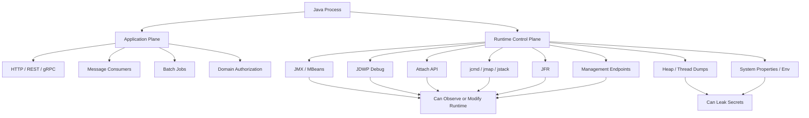
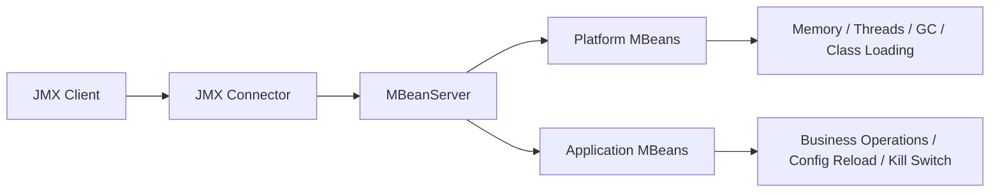
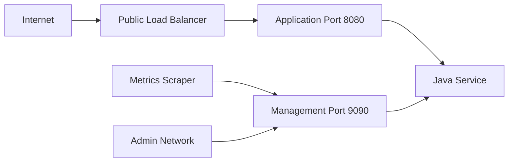

------
title: Learn Java Security, Cryptography, Integrity and Platform Hardening - Part 023
description: JVM runtime hardening for production Java systems: diagnostics, debug surfaces, JMX, attach API, heap dumps, environment leakage, filesystem safety, and operational invariants.
series: learn-java-security-cryptography-integrity-hardening
seriesTitle: Learn Java Security, Cryptography, Integrity and Platform Hardening
order: 23
partTitle: JVM Runtime Hardening
tags:
- java
- security
- jvm
- hardening
- runtime
- production
- jmx
- diagnostics
date: 2026-06-28
---

# Part 023 — JVM Runtime Hardening

> Target: mampu menjalankan service Java di production dengan mental model bahwa JVM bukan hanya runtime eksekusi kode, tetapi juga **runtime control plane** yang punya channel observability, diagnostics, attach, dump, debug, management, file access, process metadata, dan native integration.

Kita sudah membahas classloading, reflection, module boundary, agent, dan fakta bahwa Security Manager tidak lagi bisa dipakai sebagai sandbox utama. Sekarang kita turun satu level: bagaimana JVM benar-benar berjalan di production, surface apa yang terbuka, bagaimana surface itu dimatikan atau dipersempit, dan invariant apa yang harus diuji.

Security runtime hardening bukan tentang membuat JVM “tidak bisa diamati”. Production tetap butuh observability, profiling, dump, JFR, JMX, metrics, dan diagnostics. Masalahnya: channel diagnostics sering punya privilege jauh lebih tinggi daripada endpoint bisnis. Jika channel ini bocor, attacker bisa membaca secret, melihat memory, mengubah runtime state, memuat agent, atau mengeksekusi code path yang tidak pernah melewati authorization aplikasi.

## 1. Kaufman Skill Decomposition

Agar tidak belajar hardening sebagai daftar flag acak, pecah skill ini menjadi lima subskill:

| Subskill | Pertanyaan Utama | Output Praktis |
|---|---|---|
| Runtime surface inventory | Channel apa saja yang bisa mengamati/mengubah JVM? | Runtime surface map per service |
| Privilege reduction | Capability apa yang tidak dibutuhkan saat normal operation? | Hardened JVM launch profile |
| Sensitive-data containment | Apa yang bisa bocor dari heap, stack, env, logs, dumps? | Dump/log/env handling policy |
| Safe diagnostics | Bagaimana tetap bisa troubleshoot tanpa membuka RCE/leak surface? | Break-glass diagnostic runbook |
| Verification | Bagaimana membuktikan hardening aktif? | Runtime hardening tests dan deployment checks |

20 jam pertama untuk topik ini sebaiknya tidak dihabiskan membaca semua JVM flag. Fokuskan pada kemampuan membuat keputusan: **surface mana harus mati by default, surface mana boleh aktif dengan guardrail, dan surface mana hanya boleh aktif saat incident break-glass**.

## 2. Mental Model: JVM Has Two Planes

Java service production selalu punya dua plane:

1. **Application plane**: HTTP/gRPC/message consumer/job scheduler/domain logic.
2. **Runtime control plane**: JMX, JDWP, attach API, `jcmd`, heap dump, thread dump, JFR, GC logs, system properties, environment, signal handling, process metadata, management endpoints, dan operator shell.

Attack sering melewati plane kedua karena lebih privileged dan kurang diuji.



The core invariant:

> A production JVM must not expose a runtime control capability to a less-trusted actor than the actor allowed to administer that production workload.

Ini berarti endpoint debug, JMX remote, attach tooling, heap dump file, dan admin endpoints harus diperlakukan sebagai privileged administration surface, bukan sebagai “ops utility biasa”.

## 3. Runtime Surface Inventory

Mulai setiap service dengan inventory berikut.

| Surface | Normal Production Default | Risiko Jika Bocor | Hardening Direction |
|---|---|---|---|
| JDWP remote debug | Off | Code execution, data inspection, bypass app auth | Disabled; never bind public interface |
| JMX remote | Off unless explicitly needed | Runtime mutation, sensitive metrics, MBean operations | Auth + TLS + network isolation |
| Attach API | Off where not needed | Agent loading, heap/thread inspection | Disable or restrict OS access |
| Dynamic agent loading | Off for locked-down runtime where possible | Runtime bytecode modification | Prefer startup agents only |
| Heap dump | Controlled, encrypted, restricted | Secrets, tokens, PII, private keys | Break-glass only; secure storage |
| Thread dump | Controlled | Credentials in stack/local variables, endpoint paths | Restricted access; redaction by process |
| JFR | Controlled | Payload snippets, class/method names, timings | Profile template review |
| Env/system props | Minimized | Secret leakage via dump/log/proc | Avoid secret-in-env where possible |
| Temp directory | Restricted | Symlink race, data leakage, executable drop | Dedicated tmp, permissions, cleanup |
| Working directory | Read-only where possible | Config tamper, classpath pollution | Immutable app directory |
| Native libraries | Strict | Load malicious native code | No writable library path |
| Management HTTP endpoints | Split/guarded | Kill switches, metrics leak, env leak | Separate port/network/auth |

Inventory ini harus menjadi bagian dari security review, bukan hanya SRE checklist.

## 4. JDWP Debugging: Treat It as Production-RCE Equivalent

JDWP atau remote debugging memungkinkan debugger mengontrol execution state. Pada development, ini sangat berguna. Pada production, ini setara dengan memberi operator kemampuan melihat memory, men-set breakpoint, memanggil method, dan mengubah flow.

Contoh konfigurasi development:

```bash
-agentlib:jdwp=transport=dt_socket,server=y,suspend=n,address=*:5005
```

Masalah besar pada production:

- `address=*` dapat bind ke semua interface.
- Tidak semua deployment layer memblok port debug.
- Debug port sering tertinggal karena image/container yang sama dipakai dev dan prod.
- Jika attacker mendapat akses network ke port ini, boundary aplikasi bisa runtuh.

Production invariant:

```text
No JDWP agent must be active in standard production launch profile.
```

Verification example:

```bash
jcmd <pid> VM.command_line
# pastikan tidak ada -agentlib:jdwp atau -Xrunjdwp
```

Deployment policy:

```yaml
runtimeProfile:
  debugAgent: disabled
  remoteDebugPort: none
  prodOverrideAllowed: false
```

Jika production debugging benar-benar diperlukan, gunakan break-glass process:

1. require incident ticket,
2. deploy temporary debug build/profile,
3. bind hanya ke loopback atau private admin network,
4. enforce short TTL,
5. capture operator identity,
6. rollback ke hardened profile,
7. audit semua dump/log/artifact yang dibuat.

## 5. JMX: Powerful, Useful, Dangerous

JMX menyediakan management dan monitoring untuk JVM dan aplikasi. Java VM punya built-in instrumentation untuk monitoring/manajemen melalui JMX, dan remote management dapat dikonfigurasi lewat system properties. Itu berarti JMX bukan hanya metrics endpoint; MBean dapat mengekspos operation yang mengubah runtime state.

### 5.1 JMX Risk Model



Risiko utama:

- unauthenticated remote JMX,
- plaintext JMX credentials,
- RMI registry exposure,
- broad firewall rule,
- application MBean yang menjalankan privileged operation,
- sensitive data melalui attributes,
- MBean operation tanpa audit.

### 5.2 Production JMX Policy

Default policy:

```text
Remote JMX is disabled unless there is a documented operational need.
```

Jika remote JMX dipakai:

- require authentication,
- require TLS,
- bind ke management network,
- restrict firewall/security group,
- use least-privilege access file,
- disable write operations unless needed,
- audit MBean operations,
- do not expose sensitive values as MBean attributes,
- separate platform monitoring from application administration.

Bad pattern:

```bash
-Dcom.sun.management.jmxremote
-Dcom.sun.management.jmxremote.port=9010
-Dcom.sun.management.jmxremote.authenticate=false
-Dcom.sun.management.jmxremote.ssl=false
```

Better direction:

```bash
-Dcom.sun.management.jmxremote=true
-Dcom.sun.management.jmxremote.port=9010
-Dcom.sun.management.jmxremote.authenticate=true
-Dcom.sun.management.jmxremote.password.file=/run/secrets/jmx.password
-Dcom.sun.management.jmxremote.access.file=/etc/app/jmx.access
-Dcom.sun.management.jmxremote.ssl=true
```

Even better for many cloud-native systems: jangan expose JMX remote; scrape metrics via hardened metrics endpoint atau sidecar/agent yang sudah masuk threat model.

## 6. Attach API, `jcmd`, `jmap`, `jstack`, and Serviceability Tools

JDK menyediakan diagnostic tools seperti `jcmd`, `jps`, `jstat`, `jmap`, dan `jstack`. Tool ini sangat penting untuk troubleshooting. Oracle JDK 25 documentation menyebut `jcmd` sebagai tool yang direkomendasikan untuk beberapa operasi diagnostics, termasuk heap dump.

Namun dari sudut security, attach/serviceability adalah privileged local administration channel.

### 6.1 What Attach Enables

Attach mechanisms dapat memungkinkan:

- membaca command line JVM,
- mencetak system properties,
- membuat thread dump,
- membuat heap dump,
- memulai JFR,
- memuat agent tertentu,
- melihat class histogram,
- menjalankan diagnostic commands.

Contoh:

```bash
jcmd <pid> VM.command_line
jcmd <pid> VM.system_properties
jcmd <pid> Thread.print
jcmd <pid> GC.heap_dump /secure-dumps/app-heap.hprof
```

Ini berarti user OS yang bisa attach ke process sering bisa membaca data yang jauh lebih sensitif daripada data aplikasi normal.

### 6.2 Attach Hardening

Pertimbangkan runtime profile:

```bash
-XX:+DisableAttachMechanism
```

Gunakan ini jika:

- service tidak membutuhkan live diagnostics via attach,
- ada mekanisme observability alternatif,
- heap/thread dump hanya boleh lewat break-glass redeploy,
- workload menjalankan data sensitif.

Trade-off:

- beberapa tools APM/profiler mungkin butuh attach,
- incident troubleshooting menjadi lebih sulit,
- harus ada mekanisme fallback.

Mental model yang benar:

```text
Disable attach by default for high-sensitivity workloads; enable only when serviceability need is stronger than integrity risk.
```

### 6.3 Dynamic Agents

Java agent bisa memodifikasi runtime melalui instrumentation. JEP 451 memperkenalkan warning ketika agents dimuat dinamis ke JVM yang sedang berjalan, sebagai persiapan menuju masa depan yang lebih membatasi dynamic agent loading demi integrity by default.

Production policy:

- Prefer startup agents yang eksplisit di command line.
- Jangan izinkan arbitrary runtime agent loading.
- Lock down file system path tempat agent JAR berada.
- Pin version dan checksum agent observability.
- Pisahkan test-time instrumentation dari production runtime.

Example launch direction:

```bash
-javaagent:/opt/agents/otel-javaagent.jar
```

Better than:

```text
operator can dynamically attach any agent jar at runtime
```

Untuk runtime yang mendukung dan policy yang sesuai, pertimbangkan disabling dynamic agent loading. Validasi flag terhadap JDK/vendor yang dipakai karena perilaku dan default dapat berubah antar versi.

## 7. Heap Dumps: Most Expensive Secret Leak You Will Create Yourself

Heap dump berisi object graph. Jika aplikasi pernah memegang token, password, private key material, session, PII, API response, request payload, atau decrypted data, kemungkinan data itu bisa muncul di heap dump.

### 7.1 Common Leak Sources

| Data | Mengapa Bisa Ada di Heap |
|---|---|
| Password input | `String`, request body, logs buffer |
| JWT/access token | HTTP header, security context, cache |
| Refresh token | session store client, DB row object |
| Private key | keystore load, TLS context, signing component |
| PII/regulatory data | DTO, entity, response model, batch job |
| Secrets from env | config object, system properties, diagnostics |

### 7.2 Heap Dump Policy

Recommended invariant:

```text
Heap dumps are classified as highly sensitive security artifacts.
```

Policy controls:

- heap dump disabled by default unless operationally justified,
- dump location not world-readable,
- dump not written to shared persistent volume by accident,
- dump encrypted at rest,
- dump upload requires secure channel,
- retention short and explicit,
- dump access audited,
- dump deletion verified,
- dump generation tied to incident ticket.

Be careful with:

```bash
-XX:+HeapDumpOnOutOfMemoryError
-XX:HeapDumpPath=/tmp
```

This is convenient, but risky when `/tmp` is shared, persisted, scraped, or accessible by sidecars.

Better:

```bash
-XX:+HeapDumpOnOutOfMemoryError
-XX:HeapDumpPath=/var/lib/app/secure-dumps
```

Then enforce OS/container permissions:

```bash
chmod 700 /var/lib/app/secure-dumps
chown app:app /var/lib/app/secure-dumps
```

For high-sensitivity workloads, prefer no automatic dump; trigger dump only through break-glass.

## 8. Thread Dumps and Stack Safety

Thread dumps are less obviously sensitive than heap dumps, but still risky.

They can reveal:

- endpoint paths,
- query text,
- class names,
- tenant IDs in thread names,
- lock/resource identifiers,
- file paths,
- library versions,
- sometimes credentials if included in thread names, exception messages, or method parameters captured by tools.

Bad practice:

```java
Thread.currentThread().setName("job-token-" + token);
```

Better:

```java
Thread.currentThread().setName("job-worker-" + shardId);
```

Do not put secrets or PII in:

- thread names,
- exception messages,
- MDC values,
- span names,
- metric labels,
- lock names,
- file names,
- queue names.

## 9. Environment Variables and System Properties

Secrets in environment variables are common because deployment systems make it easy. They are also easy to leak through:

- process inspection,
- diagnostics endpoints,
- startup logs,
- crash reports,
- heap dumps,
- support bundles,
- `/proc` on Linux depending on permissions,
- accidental metrics/config exposure.

Hardening direction:

| Secret Form | Risk | Better Direction |
|---|---|---|
| Long-lived secret in env | High leakage surface | Short-lived secret from secret manager |
| Secret in JVM system property | Appears in command line/diagnostics | File descriptor/volume/secret provider |
| Secret in config file | File permission risk | Dedicated secret mount, strict perms |
| Secret cached forever | Compromise persistence | TTL + rotation + revocation |

Production invariant:

```text
No endpoint, log line, dump bundle, support archive, or metrics stream may expose raw secret material.
```

Implementation guidance:

- redact config dumps,
- separate secret config from ordinary config,
- never log all env/system props in production,
- expose config fingerprint, not config value,
- store only secret reference/id where possible,
- build an allowlist of safe diagnostic keys.

## 10. Filesystem and Working Directory Hardening

A Java process interacts with filesystem through:

- classpath/module path,
- config files,
- temp files,
- logs,
- dumps,
- native libraries,
- uploaded files,
- cache directories,
- generated reports,
- lock files.

Security concerns:

1. **Classpath pollution**: writable application/lib directory may allow malicious JAR insertion.
2. **Native library injection**: writable `java.library.path` or uncontrolled `LD_LIBRARY_PATH`.
3. **Temp file attacks**: predictable filename, symlink race, wrong permissions.
4. **Dump leakage**: heap/thread/JFR dumps stored in world-readable path.
5. **Config tamper**: writable config directory changes runtime behavior.

Production layout:

```text
/opt/app              read-only application files
/opt/app/lib          read-only dependencies
/etc/app              read-only non-secret config
/run/secrets/app      secret mount, read-only, app-only
/var/log/app          writable log target or stdout only
/var/lib/app/tmp      writable tmp, app-only
/var/lib/app/dumps    writable only if dump policy allows
```

Code-level pattern for temp files:

```java
import java.nio.file.Files;
import java.nio.file.Path;
import java.nio.file.attribute.PosixFilePermissions;

Path base = Path.of("/var/lib/app/tmp");
Path file = Files.createTempFile(base, "upload-", ".bin");

try {
    // write/process data
} finally {
    Files.deleteIfExists(file);
}
```

For POSIX environments, apply restrictive permissions when creating directories/files. Avoid relying on default umask.

## 11. Management Endpoints Are Runtime Control Plane Too

Framework endpoints such as health, metrics, env, config props, heapdump, threaddump, loggers, refresh, shutdown, or custom admin APIs often map directly to runtime control plane.

Classify them:

| Endpoint Type | Sensitivity | Exposure Rule |
|---|---:|---|
| `/health/live` | Low | Public/internal depending architecture |
| `/health/ready` | Medium | Internal load balancer only |
| `/metrics` | Medium/High | Scraper network only |
| `/env`, `/configprops` | High | Disabled or admin only |
| `/heapdump` | Critical | Disabled by default |
| `/threaddump` | High | Admin/break-glass only |
| `/loggers` mutation | High | Admin only with audit |
| `/shutdown` | Critical | Disabled or strongly guarded |

Invariant:

```text
Management endpoints must never be exposed on the same trust level as public business endpoints unless each endpoint is independently authorized and safe for that audience.
```

Better architecture:



Do not rely only on obscurity or path names.

## 12. JVM Flags: Security-Relevant Baseline

Flags are not a replacement for architecture, but they encode runtime intent.

### 12.1 Example Hardened Launch Profile

```bash
java \
  -XX:+DisableAttachMechanism \
  -XX:+ExitOnOutOfMemoryError \
  -Djava.io.tmpdir=/var/lib/app/tmp \
  -Dfile.encoding=UTF-8 \
  -Duser.timezone=UTC \
  -jar /opt/app/app.jar
```

Notes:

- `-XX:+DisableAttachMechanism` reduces local attach surface.
- `-XX:+ExitOnOutOfMemoryError` avoids limping process state after severe memory failure; operationally this relies on supervisor restart.
- `java.io.tmpdir` points to dedicated restricted directory.
- fixed timezone/encoding reduces parsing/canonicalization surprises.

### 12.2 Flags Requiring Care

| Flag / Property | Risk |
|---|---|
| `-agentlib:jdwp=...` | Debug/RCE-class surface; avoid in prod |
| `-Dcom.sun.management.jmxremote...` | JMX remote; must be authenticated/TLS/network-restricted |
| `-XX:+HeapDumpOnOutOfMemoryError` | Creates sensitive artifact |
| `-XX:HeapDumpPath=...` | Must be restricted and monitored |
| `-Djavax.net.debug=...` | Can leak TLS/handshake detail; debug only |
| `-Djava.library.path=...` | Native load path; must not include writable dirs |
| `--add-opens` / `--add-exports` | Weakens module encapsulation; justify and minimize |
| `-javaagent:...` | Privileged instrumentation; pin and verify |

## 13. Runtime Verification

Do not trust intended config. Verify actual process state.

### 13.1 Command-Line Verification

```bash
jcmd <pid> VM.command_line
```

Check:

- no JDWP in prod,
- attach disabled where expected,
- heap dump path safe,
- no secret in command line,
- agents are expected and pinned,
- temp directory safe,
- no broad `--add-opens` unless documented.

### 13.2 File Permission Verification

```bash
stat -c "%U %G %a %n" /opt/app /opt/app/lib /etc/app /run/secrets/app /var/lib/app/tmp
```

Expected direction:

- app/lib not writable by runtime user,
- secrets app-only readable,
- tmp app-only writable,
- dump dir absent or app-only restricted.

### 13.3 Network Verification

```bash
ss -lntp
```

Expected:

- no debug port,
- no JMX remote unless approved,
- management port bound only to intended interface or isolated network,
- no surprise embedded server ports.

### 13.4 Endpoint Verification

Automated test example:

```bash
curl -fsS http://service/public/health
curl -fsS http://service/actuator/heapdump && exit 1 || true
curl -fsS http://service/actuator/env && exit 1 || true
```

Better: run this as a deployment admission/check in CI/CD or smoke test.

## 14. Failure Modeling

### 14.1 Exposed JDWP

Exploit path:

```text
debug port exposed -> attacker attaches debugger -> reads memory or invokes code -> bypasses application auth -> persists or exfiltrates
```

Controls:

- no JDWP in prod image/command,
- port scanning admission,
- runtime command-line check,
- network deny by default,
- break-glass debug only.

### 14.2 Open JMX

Exploit path:

```text
JMX remote no auth/no TLS -> attacker connects -> invokes MBean operation -> changes logging/config/executes admin operation
```

Controls:

- disable remote JMX,
- require auth/TLS,
- network isolate,
- audit MBean operations,
- remove dangerous app MBeans.

### 14.3 Heap Dump on Shared Volume

Exploit path:

```text
OOM -> heap dump written to /tmp/shared -> support sidecar uploads bundle -> secrets/PII exposed
```

Controls:

- no auto dump for sensitive workload,
- restricted dump path,
- encryption/retention,
- support bundle redaction,
- incident-only dump process.

### 14.4 Dynamic Agent Abuse

Exploit path:

```text
attacker gets local/container exec -> attaches agent -> instruments auth or exfiltrates secrets -> app keeps running
```

Controls:

- no shell in runtime image where possible,
- disable attach/dynamic loading where possible,
- non-root user,
- read-only filesystem,
- agent allowlist,
- runtime detection.

## 15. Secure Runtime Decision Record

Use this template per service:

```md
# Runtime Hardening Decision Record

## Service
<service name>

## Data Classification
<public/internal/confidential/restricted>

## Runtime Control Plane
- JDWP: disabled
- Remote JMX: disabled/enabled with auth+TLS
- Attach API: disabled/enabled, reason
- Dynamic agents: disabled/startup-only/enabled, reason
- Heap dump: disabled/incident-only/auto-on-OOM, storage path
- Thread dump: incident-only/admin endpoint/tooling
- JFR: enabled/disabled, profile, retention
- Management endpoints: exposed endpoints, network boundary

## Secrets and Sensitive Data
- Secret source:
- Secret rotation:
- Env/system property exposure:
- Dump classification:

## Verification
- Deployment checks:
- Runtime checks:
- Incident runbook:

## Accepted Residual Risk
<what remains and why>
```

## 16. Review Checklist

Use this before approving production deployment:

- [ ] No JDWP/debug agent in production command line.
- [ ] Remote JMX disabled, or protected with auth, TLS, and network isolation.
- [ ] Attach mechanism disabled for sensitive workloads, or risk accepted.
- [ ] Dynamic agent loading policy documented.
- [ ] Startup agents are pinned, versioned, and integrity-checked.
- [ ] Heap dump policy documented; dump path restricted.
- [ ] Thread/JFR dump access restricted.
- [ ] No secrets in JVM args, system properties, logs, metrics, thread names, or management endpoint output.
- [ ] Application/lib directory is read-only to runtime user.
- [ ] `java.io.tmpdir` points to restricted application temp directory.
- [ ] Native library path does not include writable directories.
- [ ] Management endpoints split from public traffic and authorized.
- [ ] Runtime verification commands are automated.
- [ ] Break-glass diagnostics process exists.

## 17. Practice Lab

### Lab 1 — Runtime Surface Map

Take one Java service and list:

```text
ports:
  public:
  management:
  debug:
  jmx:

jvm_args:
  agents:
  add_opens:
  heap_dump:
  attach:
  tmpdir:

artifacts:
  logs:
  dumps:
  jfr:
  support_bundles:
```

Then classify each as public, internal, admin, or break-glass.

### Lab 2 — Hardened Launch Profile

Create two profiles:

1. `local-dev`: debug allowed, broad diagnostics allowed.
2. `prod-secure`: debug off, attach off, restricted tmp, no auto dump unless policy allows.

Diff them. Every difference should have a reason.

### Lab 3 — Secret Leak Simulation

Create a dummy secret:

```java
String token = "demo-secret-token-123";
```

Trigger a heap dump in a non-production lab. Search the dump. The lesson is not “never use String” in all places; the lesson is that heap dumps are sensitive artifacts.

### Lab 4 — Management Endpoint Audit

List all management endpoints. For each endpoint, answer:

- Who can call it?
- What can they learn?
- What can they change?
- Is the response safe for logs/support bundles?
- Is every call audited?

## 18. Summary

JVM runtime hardening is about constraining the control plane around a Java process. The highest-value controls are usually simple:

- no production debug port,
- no unauthenticated remote JMX,
- restrict or disable attach,
- treat heap dumps as sensitive,
- avoid secrets in env/props/logs/metrics,
- lock down file paths,
- split management from public traffic,
- verify actual runtime state.

A top-tier engineer does not memorize flags. They maintain a runtime capability model and can explain exactly why each capability is enabled, who can reach it, what it can reveal, what it can mutate, and how it is audited.

## References

- Oracle Java SE 25 Troubleshooting Guide — Diagnostic Tools: https://docs.oracle.com/en/java/javase/25/troubleshoot/diagnostic-tools.html
- Oracle Java SE 25 `jdk.jcmd` module: https://docs.oracle.com/en/java/javase/25/docs/api/jdk.jcmd/module-summary.html
- Oracle Monitoring and Management Using JMX Technology: https://docs.oracle.com/javase/8/docs/technotes/guides/management/agent.html
- OpenJDK JEP 451 — Prepare to Disallow the Dynamic Loading of Agents: https://openjdk.org/jeps/451
- OpenJDK JEP 486 — Permanently Disable the Security Manager: https://openjdk.org/jeps/486
