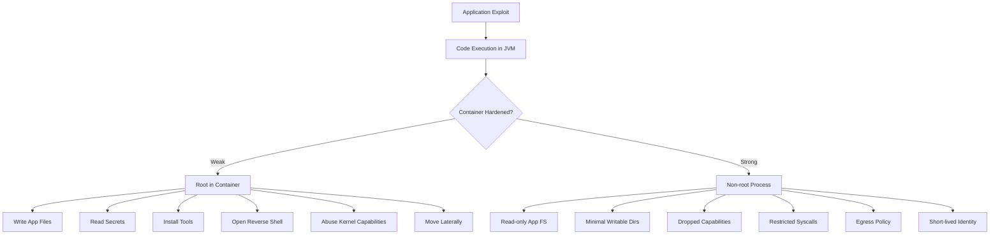

------
title: Learn Java Security, Cryptography, Integrity and Platform Hardening - Part 024
description: Container and OS hardening for production Java workloads: non-root execution, read-only filesystem, Linux capabilities, seccomp/AppArmor/SELinux, Kubernetes security context, network policy, and Java-specific runtime constraints.
series: learn-java-security-cryptography-integrity-hardening
seriesTitle: Learn Java Security, Cryptography, Integrity and Platform Hardening
order: 24
partTitle: Container and OS Hardening for Java
tags:
- java
- security
- hardening
- containers
- docker
- kubernetes
- linux
- platform
- production
date: 2026-06-28
---

# Part 024 — Container and OS Hardening for Java

> Target: mampu menjalankan Java service dalam container/Kubernetes dengan boundary yang jelas: process tidak root, filesystem immutable, privilege minimum, syscall dibatasi, network terkendali, secrets tidak bocor, dan JVM tetap operasional dalam constraint tersebut.

Kita sudah membahas bahwa Security Manager tidak lagi bisa menjadi sandbox Java modern. Jadi hardening runtime harus dipindahkan ke layer yang memang dirancang untuk containment: OS, container runtime, orchestrator, identity, network policy, filesystem policy, dan deployment admission.

Container bukan VM kecil. Container adalah process biasa yang diberi isolation via Linux primitives seperti namespaces, cgroups, capabilities, seccomp, LSM profile, mounts, dan network namespace. Karena itu, hardening Java container harus dimulai dari capability model: **apa yang boleh dilakukan process Java jika aplikasinya diambil alih?**

## 1. Kaufman Skill Decomposition

Pecah container hardening menjadi subskill berikut:

| Subskill | Pertanyaan Utama | Artifact |
|---|---|---|
| Process identity | User/group apa yang menjalankan JVM? | non-root runtime user |
| Filesystem boundary | Path mana read-only, writable, secret, temporary? | filesystem layout |
| Kernel privilege | Capability/syscall apa yang dibutuhkan? | security context/seccomp profile |
| Network boundary | Egress/ingress mana yang valid? | network policy |
| Resource containment | CPU/memory/temp/disk limit apa yang aman? | requests/limits + JVM config |
| Operational access | Bagaimana debugging tanpa membuka shell permanen? | break-glass runbook |
| Verification | Bagaimana membuktikan container hardened? | admission checks + runtime tests |

20 jam pertama harus menghasilkan satu kemampuan utama: membaca manifest/container image dan langsung melihat **privilege yang tidak perlu**.

## 2. Mental Model: If Java Is Compromised, What Can the Process Do?

Hardening harus dimulai dari asumsi realistis:

```text
Assume the Java application has an RCE or deserialization bug. What can the attacker do next?
```

Container/OS hardening tidak mencegah semua bug aplikasi. Ia mengurangi blast radius.



Core invariant:

> A compromised Java process should not be able to write its own executable code path, expand its OS privilege, read unrelated secrets, access unrelated network destinations, or persist outside its intended writable state.

## 3. Baseline Container Threats for Java Workloads

| Threat | Why Java Workloads Are Exposed | Hardening Control |
|---|---|---|
| Runs as root | Many base images default historically allowed root | `USER`, `runAsNonRoot` |
| Writable app directory | Fat JAR/app files placed under writable workdir | read-only root FS; immutable `/opt/app` |
| Debug tools in image | Full JDK/shell/package manager in runtime | minimal runtime, no package manager where possible |
| Excess Linux capabilities | Defaults may include more than needed | drop all, add only required |
| Privilege escalation | setuid/capabilities can increase privilege | `allowPrivilegeEscalation: false` |
| Broad syscalls | Kernel attack surface | seccomp `RuntimeDefault` or custom profile |
| Weak network boundary | App can call metadata/internal services | egress deny-by-default |
| Secret overexposure | Mounted all secrets/service account token | mount only needed secrets, disable unnecessary automount |
| Dump/log leakage | Heap dumps/logs written to shared volume | restricted volumes, retention, encryption |
| Resource exhaustion | JVM can consume memory/disk/temp aggressively | cgroup limits + JVM tuning |

## 4. Non-Root Execution

Running Java as root in a container is almost never necessary for application workloads.

Dockerfile direction:

```dockerfile
FROM eclipse-temurin:25-jre

RUN groupadd --system app && useradd --system --gid app --home-dir /nonexistent app
WORKDIR /opt/app
COPY --chown=app:app app.jar /opt/app/app.jar

USER app:app
ENTRYPOINT ["java", "-jar", "/opt/app/app.jar"]
```

Kubernetes direction:

```yaml
securityContext:
  runAsNonRoot: true
  runAsUser: 10001
  runAsGroup: 10001
  fsGroup: 10001
```

Do not assume `USER app` in Dockerfile is enough. Verify at runtime:

```bash
id
cat /proc/1/status | grep -E 'Uid|Gid'
```

Invariant:

```text
The JVM process must not run as UID 0 in production.
```

Exception handling:

- If binding privileged ports is the reason, use port mapping or service proxy instead of root.
- If writing to protected path is the reason, fix directory ownership.
- If installing packages at startup is the reason, move installation to build stage.

## 5. Read-Only Root Filesystem

A Java app normally needs to write only to known paths:

- temp directory,
- logs if not stdout,
- optional dump directory,
- application data directory if stateful,
- cache directory if explicitly designed.

Everything else should be immutable.

Kubernetes:

```yaml
securityContext:
  readOnlyRootFilesystem: true
```

Then mount explicit writable paths:

```yaml
volumeMounts:
  - name: tmp
    mountPath: /var/lib/app/tmp
  - name: logs
    mountPath: /var/log/app
volumes:
  - name: tmp
    emptyDir:
      sizeLimit: 256Mi
  - name: logs
    emptyDir:
      sizeLimit: 256Mi
```

JVM launch:

```bash
-Djava.io.tmpdir=/var/lib/app/tmp
```

Filesystem design:

```text
/opt/app            read-only application artifact
/opt/app/lib        read-only dependencies
/etc/app            read-only config
/run/secrets/app    read-only secret mount
/var/lib/app/tmp    writable temp
/var/log/app        writable only if not stdout
```

Why this matters:

- attacker cannot replace JAR/classes after RCE,
- attacker cannot persist tool/script under app path,
- accidental runtime mutation becomes visible,
- support/debug artifacts are constrained to known paths.

## 6. Linux Capabilities: Drop by Default

Root is not the only privilege concept on Linux. Capabilities split privileged operations into smaller units. A container can run non-root but still have dangerous capabilities, or run root with capabilities reduced.

Production Java apps usually need no extra capabilities.

Kubernetes:

```yaml
securityContext:
  capabilities:
    drop:
      - ALL
```

Only add capabilities when there is a clear, documented need.

Common mistake:

```yaml
securityContext:
  privileged: true
```

This should be treated as a critical exception, not a convenience.

Invariant:

```text
No Java application pod should run privileged or with broad Linux capabilities unless it is a platform/system component with explicit risk acceptance.
```

## 7. Prevent Privilege Escalation

Kubernetes `allowPrivilegeEscalation` controls whether a process can gain more privileges than its parent. Official Kubernetes docs state that this directly controls the Linux `no_new_privs` flag for the container process.

Set:

```yaml
securityContext:
  allowPrivilegeEscalation: false
```

This protects against paths where a process tries to use setuid binaries or file capabilities to gain more privilege.

Runtime verification:

```bash
cat /proc/1/status | grep NoNewPrivs
# Expected: NoNewPrivs: 1
```

## 8. Seccomp, AppArmor, and SELinux

Container isolation relies heavily on kernel boundary. Do not give the JVM access to every syscall if the platform can restrict it.

Kubernetes seccomp:

```yaml
securityContext:
  seccompProfile:
    type: RuntimeDefault
```

AppArmor example annotation style varies by Kubernetes version/distribution, but the principle is:

```yaml
metadata:
  annotations:
    container.apparmor.security.beta.kubernetes.io/app: runtime/default
```

SELinux example:

```yaml
securityContext:
  seLinuxOptions:
    type: container_t
```

Use platform defaults first. Custom profiles are valuable but expensive to maintain. A top-tier platform usually starts with default hardened profiles, then creates custom profiles only for high-risk workloads.

## 9. Minimal Runtime Image

A production Java image should contain what is needed to run, not what was needed to build.

Bad pattern:

```dockerfile
FROM maven:latest
COPY . .
RUN mvn package
CMD ["java", "-jar", "target/app.jar"]
```

Problems:

- build tools in runtime,
- source code in runtime,
- shell/package manager available,
- larger CVE surface,
- non-reproducible base tag.

Better multi-stage direction:

```dockerfile
FROM maven:3.9-eclipse-temurin-25 AS build
WORKDIR /src
COPY pom.xml .
COPY src ./src
RUN mvn -DskipTests package

FROM eclipse-temurin:25-jre
RUN groupadd --system app && useradd --system --gid app --home-dir /nonexistent app
WORKDIR /opt/app
COPY --from=build --chown=app:app /src/target/app.jar /opt/app/app.jar
USER app:app
ENTRYPOINT ["java", "-jar", "/opt/app/app.jar"]
```

Even better for mature platforms:

- use digest-pinned base images,
- use slim/distroless runtime where operationally feasible,
- use `jlink` for custom runtime image if appropriate,
- keep CA certificates/timezone data explicitly understood,
- scan and sign image in CI,
- avoid `latest` tags in production.

Supply-chain integrity will be covered more deeply in Parts 025–027. Here the point is runtime minimization: fewer tools and fewer writable paths reduce post-exploit leverage.

## 10. Java and cgroups: Resource Boundaries Are Security Boundaries

Resource limits are not just performance controls. They are DoS containment.

Without sane limits:

- one compromised process can consume node memory,
- temp files can fill disk,
- log spam can create outage,
- thread creation can exhaust process/node resources,
- GC thrash can destabilize service.

Kubernetes example:

```yaml
resources:
  requests:
    cpu: "500m"
    memory: "512Mi"
  limits:
    cpu: "2"
    memory: "1Gi"
```

Java memory direction:

```bash
-XX:MaxRAMPercentage=75
-XX:InitialRAMPercentage=50
-XX:+ExitOnOutOfMemoryError
```

Do not blindly set `-Xmx` equal to container limit. Native memory, metaspace, thread stacks, direct buffers, code cache, JIT, TLS/native libraries, and agent overhead need headroom.

Security invariant:

```text
The JVM must fail predictably under resource pressure and must not destabilize the node or leak sensitive crash artifacts during failure.
```

## 11. Network Hardening

A Java service often needs outbound access to:

- database,
- message broker,
- auth server,
- KMS/secret manager,
- telemetry collector,
- internal APIs.

It usually does not need arbitrary egress.

Kubernetes NetworkPolicy direction:

```yaml
apiVersion: networking.k8s.io/v1
kind: NetworkPolicy
metadata:
  name: app-egress
spec:
  podSelector:
    matchLabels:
      app: orders
  policyTypes:
    - Egress
    - Ingress
  ingress:
    - from:
        - namespaceSelector:
            matchLabels:
              name: ingress-system
      ports:
        - protocol: TCP
          port: 8080
  egress:
    - to:
        - namespaceSelector:
            matchLabels:
              name: database
      ports:
        - protocol: TCP
          port: 5432
    - to:
        - namespaceSelector:
            matchLabels:
              name: security-platform
      ports:
        - protocol: TCP
          port: 443
```

Important caveats:

- NetworkPolicy enforcement depends on the CNI plugin.
- DNS egress must be handled intentionally.
- Cloud metadata endpoint must be blocked or mediated unless workload identity needs it.
- Management port should have stricter ingress than application port.
- Egress policy must be maintained as architecture evolves.

## 12. Secret Mounts and Service Account Tokens

Secrets handling is not only crypto. It is also mount scope and runtime exposure.

Guidelines:

- mount only secrets required by this workload,
- mount secrets read-only,
- avoid sharing broad secret volumes across containers,
- do not mount secrets into paths writable by app,
- rotate secrets and test reload behavior,
- avoid dumping secret files in support bundles,
- disable service account token automount if not needed.

Kubernetes:

```yaml
automountServiceAccountToken: false
```

If the app needs Kubernetes API access, use a narrow service account and RBAC policy.

Secret mount example:

```yaml
volumeMounts:
  - name: app-secrets
    mountPath: /run/secrets/app
    readOnly: true
volumes:
  - name: app-secrets
    secret:
      secretName: orders-secrets
      defaultMode: 0400
```

Then make Java read from file path, not print value:

```java
Path secretPath = Path.of("/run/secrets/app/db-password");
String password = Files.readString(secretPath).trim();
```

Immediately consider lifecycle: how is this rotated, reloaded, and revoked?

## 13. Management Port Isolation

A common Java production mistake is exposing business and management endpoints through the same public ingress.

Better:

```text
8080 application traffic
9090 management traffic
```

Management traffic should be reachable only by:

- metrics scraper,
- health checker,
- admin network,
- service mesh control plane, if relevant.

Kubernetes example direction:

```yaml
ports:
  - name: http
    containerPort: 8080
  - name: management
    containerPort: 9090
```

Then use NetworkPolicy/Ingress/Service separation:

- public service exposes only 8080,
- internal service exposes 9090 only inside monitoring namespace,
- sensitive endpoints disabled or admin-authenticated.

## 14. Pod Security Standards: Baseline vs Restricted

Kubernetes Pod Security Standards define policy levels including Baseline and Restricted. Restricted is aimed at enforcing current pod hardening best practices, with some compatibility trade-offs.

For ordinary Java application pods, aim for Restricted-compatible posture:

```yaml
securityContext:
  runAsNonRoot: true
  seccompProfile:
    type: RuntimeDefault
containers:
  - name: app
    securityContext:
      allowPrivilegeEscalation: false
      readOnlyRootFilesystem: true
      capabilities:
        drop: ["ALL"]
```

If a service cannot run with this posture, document why. Common legitimate reasons include:

- legacy native library expects writable path,
- old app writes temp files under current directory,
- profiler/debug tooling requires attach,
- image expects root-owned runtime path.

For each, prefer fixing the runtime layout rather than weakening policy.

## 15. Full Hardened Java Pod Example

```yaml
apiVersion: apps/v1
kind: Deployment
metadata:
  name: orders
spec:
  replicas: 3
  selector:
    matchLabels:
      app: orders
  template:
    metadata:
      labels:
        app: orders
    spec:
      automountServiceAccountToken: false
      securityContext:
        runAsNonRoot: true
        runAsUser: 10001
        runAsGroup: 10001
        fsGroup: 10001
        seccompProfile:
          type: RuntimeDefault
      containers:
        - name: app
          image: registry.example.com/orders@sha256:REPLACE_WITH_DIGEST
          imagePullPolicy: IfNotPresent
          ports:
            - name: http
              containerPort: 8080
            - name: management
              containerPort: 9090
          env:
            - name: JAVA_TOOL_OPTIONS
              value: >-
                -XX:+DisableAttachMechanism
                -XX:+ExitOnOutOfMemoryError
                -XX:MaxRAMPercentage=75
                -Djava.io.tmpdir=/var/lib/app/tmp
          securityContext:
            allowPrivilegeEscalation: false
            readOnlyRootFilesystem: true
            capabilities:
              drop:
                - ALL
          resources:
            requests:
              cpu: "500m"
              memory: "512Mi"
            limits:
              cpu: "2"
              memory: "1Gi"
          volumeMounts:
            - name: tmp
              mountPath: /var/lib/app/tmp
            - name: app-secrets
              mountPath: /run/secrets/app
              readOnly: true
          readinessProbe:
            httpGet:
              path: /health/ready
              port: management
          livenessProbe:
            httpGet:
              path: /health/live
              port: management
      volumes:
        - name: tmp
          emptyDir:
            sizeLimit: 256Mi
        - name: app-secrets
          secret:
            secretName: orders-secrets
            defaultMode: 0400
```

This is a direction, not a universal template. The exact profile depends on the service, platform, observability model, service mesh, and incident process.

## 16. Docker Run Equivalent

For non-Kubernetes deployment, the equivalent idea is:

```bash
docker run --rm \
  --user 10001:10001 \
  --read-only \
  --tmpfs /var/lib/app/tmp:rw,noexec,nosuid,nodev,size=256m \
  --cap-drop ALL \
  --security-opt no-new-privileges:true \
  --security-opt seccomp=default \
  --memory 1g \
  --cpus 2 \
  -p 8080:8080 \
  registry.example.com/orders@sha256:REPLACE_WITH_DIGEST
```

Not every option maps perfectly across runtimes/platforms, but the capability model is the same.

## 17. Debugging Hardened Containers

Hardening creates friction. That is intentional. The solution is not to run weakly forever; the solution is controlled diagnostics.

Recommended break-glass model:

1. Standard pods are hardened and minimal.
2. Debug shell/tools are not permanently available in runtime image.
3. Ephemeral debug container or temporary diagnostic deployment is used during incident.
4. Access requires operator identity and ticket.
5. Network and secret access remain constrained.
6. Captured artifacts are classified and retained safely.
7. Temporary access is removed after incident.

Avoid this anti-pattern:

```text
Keep curl, bash, netcat, package manager, debugger, and writeable filesystem in every production image because it helps incidents.
```

That makes every application exploit easier to turn into lateral movement.

## 18. Java-Specific Container Pitfalls

### 18.1 App Writes to Current Directory

Many apps accidentally write under `/opt/app`.

Fix:

```bash
-Djava.io.tmpdir=/var/lib/app/tmp
-Dapp.storage.dir=/var/lib/app/data
```

Then mount only needed writable directories.

### 18.2 Libraries Expect `/tmp`

Some Java/native libraries assume `/tmp`. Either provide a restricted tmpfs at `/tmp` or set `java.io.tmpdir` and test.

```yaml
volumeMounts:
  - name: tmp
    mountPath: /tmp
volumes:
  - name: tmp
    emptyDir:
      sizeLimit: 128Mi
```

### 18.3 Truststore and CA Certificates

Minimal images may not include the expected CA bundle. If TLS suddenly fails, do not disable verification. Fix trust distribution.

Direction:

- bake approved CA bundle into image,
- or mount truststore read-only,
- pin truststore path explicitly,
- rotate CA bundle through controlled release.

```bash
-Djavax.net.ssl.trustStore=/etc/app/truststore.p12
-Djavax.net.ssl.trustStoreType=PKCS12
```

### 18.4 Heap Dump With Read-Only Root

If heap dump is enabled but no writable path exists, dump generation fails. That is okay only if intentional. If dumps are required, create a specific restricted dump mount.

```bash
-XX:HeapDumpPath=/var/lib/app/dumps
```

```yaml
volumeMounts:
  - name: dumps
    mountPath: /var/lib/app/dumps
volumes:
  - name: dumps
    emptyDir:
      sizeLimit: 2Gi
```

Classify this volume as sensitive.

### 18.5 Attach/Profiler Needs

APM agents may need startup `-javaagent`; some profilers may need attach. Decide intentionally:

- startup agent: generally easier to reason about,
- dynamic attach: stronger operational capability but higher integrity risk,
- no agent: lower risk but less observability.

Do not let APM requirements silently weaken production security.

## 19. Admission Checks

Convert hardening into automated policy. Example checks:

- image must use digest, not mutable tag,
- `runAsNonRoot=true`,
- no privileged containers,
- `allowPrivilegeEscalation=false`,
- `readOnlyRootFilesystem=true`,
- capabilities drop all,
- seccomp runtime default,
- no hostPath unless approved,
- no hostNetwork unless approved,
- service account token disabled unless needed,
- resources requests/limits present,
- management port not exposed publicly.

Policy-as-code tools vary: OPA Gatekeeper, Kyverno, built-in Pod Security Admission, custom CI checks, or platform admission controllers. The specific tool matters less than the invariant: weak runtime privilege must not depend on human review alone.

## 20. Runtime Verification Commands

Inside pod/container:

```bash
id
cat /proc/1/status | grep -E 'Uid|Gid|NoNewPrivs|CapEff'
mount | grep ' / '
touch /opt/app/test-write && echo bad || echo read-only-ok
```

From Kubernetes:

```bash
kubectl get pod <pod> -o yaml | yq '.spec.securityContext, .spec.containers[].securityContext'
kubectl auth can-i --as system:serviceaccount:<ns>:<sa> get secrets
kubectl describe networkpolicy
```

From image scanner/admission:

```text
- no root user
- no package manager in runtime stage if using minimal image
- no writable app files
- no shell unless explicitly accepted
- pinned base image
```

## 21. Failure Modeling

### 21.1 RCE in Java App

Weak posture:

```text
RCE -> root container -> write malicious JAR -> install curl -> read service account token -> call API server -> lateral movement
```

Hardened posture:

```text
RCE -> non-root JVM -> cannot write app dir -> no package manager -> limited secrets -> no SA token -> egress restricted -> short-lived incident scope
```

### 21.2 Deserialization Bug With Writable Classpath

Weak posture:

```text
attacker writes JAR/plugin -> triggers classloading path -> persistence after restart
```

Controls:

- read-only `/opt/app`,
- no writable classpath/module path,
- plugin directory separate and signed/verified,
- no runtime write permission to plugin install path.

### 21.3 Secret File Overexposure

Weak posture:

```text
all app secrets mounted in every pod -> one RCE leaks multiple service credentials
```

Controls:

- per-service secrets,
- least-privilege secret mount,
- no broad namespace secret RBAC,
- rotate after incident.

### 21.4 Unbounded Temp Files

Weak posture:

```text
attacker uploads/causes temp files -> node disk pressure -> multi-service outage
```

Controls:

- `emptyDir.sizeLimit`,
- upload size limit,
- streaming parsers,
- cleanup finally blocks,
- node disk alerts.

## 22. Security Review Checklist

- [ ] Container runs as non-root UID/GID.
- [ ] Root filesystem is read-only.
- [ ] Writable directories are explicit, minimal, and size-limited.
- [ ] `/opt/app` and dependency paths are not writable by runtime user.
- [ ] Linux capabilities are dropped; no privileged container.
- [ ] `allowPrivilegeEscalation=false`.
- [ ] Seccomp `RuntimeDefault` or stronger is applied.
- [ ] AppArmor/SELinux profile is applied where platform supports it.
- [ ] Service account token is not auto-mounted unless needed.
- [ ] Kubernetes RBAC is least privilege.
- [ ] Secrets are mounted read-only and scoped to the service.
- [ ] Resource requests/limits are set.
- [ ] JVM memory settings leave native memory headroom.
- [ ] Management port is not publicly exposed.
- [ ] Egress is restricted to known dependencies.
- [ ] Runtime image does not contain unnecessary build tools.
- [ ] Debug tooling is break-glass, not permanent.
- [ ] Heap dump/JFR/log paths are classified and controlled.
- [ ] Hardening is enforced by admission/CI policy.

## 23. Practice Lab

### Lab 1 — Harden a Weak Dockerfile

Start from:

```dockerfile
FROM maven:latest
COPY . /app
WORKDIR /app
RUN mvn package
CMD java -jar target/app.jar
```

Refactor to:

- multi-stage build,
- JRE runtime only,
- non-root user,
- read-only-compatible layout,
- no source code in runtime,
- explicit `java.io.tmpdir`,
- pinned version/digest where possible.

### Lab 2 — Apply Restricted Security Context

Take one existing deployment and add:

```yaml
runAsNonRoot: true
allowPrivilegeEscalation: false
readOnlyRootFilesystem: true
capabilities.drop: ["ALL"]
seccompProfile.type: RuntimeDefault
```

Then fix all failures without removing the controls. Usually failures reveal hidden writes to app directory, `/tmp`, or logs.

### Lab 3 — Egress Inventory

Run service in staging with egress logging. Build allowlist:

```text
database: host/port
broker: host/port
auth: host/port
kms: host/port
telemetry: host/port
dns: host/port
```

Then implement NetworkPolicy and test what breaks.

### Lab 4 — Compromise Simulation

In a safe environment, simulate shell access inside container and ask:

```bash
whoami
id
cat /proc/1/status | grep CapEff
touch /opt/app/x
cat /run/secrets/app/*
curl http://metadata.google.internal || true
curl http://169.254.169.254 || true
```

The goal is not to hack; the goal is to measure blast radius.

## 24. Summary

Container and OS hardening is the replacement boundary for what many engineers used to wish Security Manager could do. For production Java services, the strongest baseline is:

- non-root JVM,
- read-only root filesystem,
- explicit writable dirs,
- dropped capabilities,
- no privilege escalation,
- seccomp/LSM profile,
- least-privilege secrets and service account,
- bounded resources,
- restricted egress,
- separated management plane,
- minimal runtime image,
- automated admission checks.

The right question is not “does it run in Docker?” The right question is:

> If this Java process is compromised, what can it still read, write, execute, call, persist, and mutate?

Top-tier engineers can answer that question from the Dockerfile, manifest, runtime flags, and platform policy—before an incident forces the answer.

## References

- OWASP Docker Security Cheat Sheet: https://cheatsheetseries.owasp.org/cheatsheets/Docker_Security_Cheat_Sheet.html
- Kubernetes Pod Security Standards: https://kubernetes.io/docs/concepts/security/pod-security-standards/
- Kubernetes Security Context: https://kubernetes.io/docs/tasks/configure-pod-container/security-context/
- Oracle Java SE 25 Troubleshooting Guide — Diagnostic Tools: https://docs.oracle.com/en/java/javase/25/troubleshoot/diagnostic-tools.html
- OpenJDK JEP 486 — Permanently Disable the Security Manager: https://openjdk.org/jeps/486
