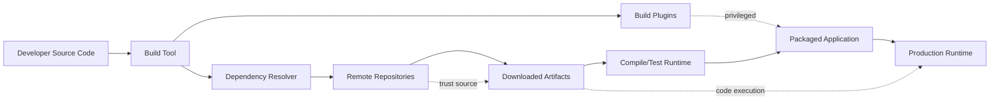
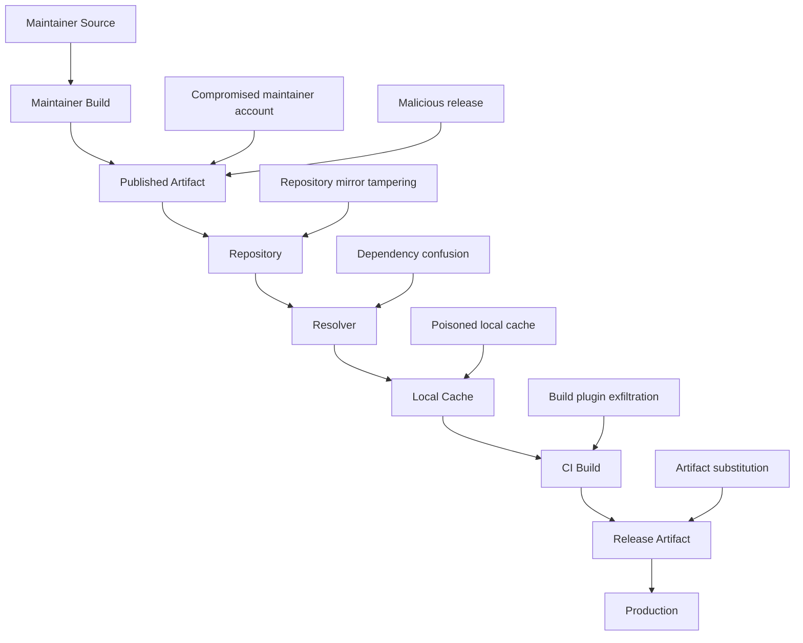
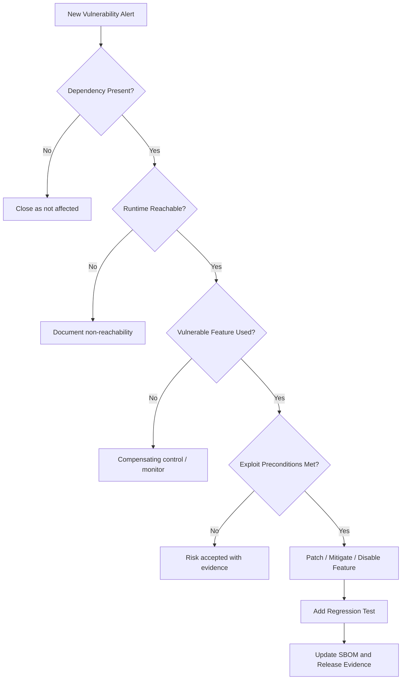
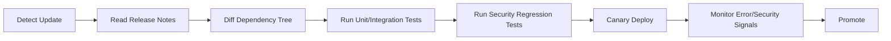

------
title: Learn Java Security, Cryptography, Integrity and Platform Hardening - Part 025
description: Dependency supply-chain risk untuk Java: Maven/Gradle dependency graph, transitive risk, repository trust, checksum/signature verification, lock discipline, vulnerable dependency triage, dan policy gate produksi.
series: learn-java-security-cryptography-integrity-hardening
seriesTitle: Learn Java Security, Cryptography, Integrity and Platform Hardening
order: 25
partTitle: Dependency Supply Chain Risk
tags:
- java
- security
- cryptography
- integrity
- platform-hardening
- supply-chain
- maven
- gradle
date: 2026-06-28
---

# Part 025 — Dependency Supply Chain Risk

Tujuan bagian ini: membuat kita mampu melihat dependency Java bukan sebagai “library tambahan”, tetapi sebagai **kode pihak ketiga yang ikut berjalan dengan trust dan privilege aplikasi kita**.

Di aplikasi Java modern, dependency bisa masuk melalui Maven/Gradle, plugin build, annotation processor, test fixture, container image, native library, parent POM, BOM, internal repository mirror, atau transitive dependency. Setiap jalur itu bisa mengubah binary yang kita compile, package, test, deploy, atau load saat runtime.

Mental model penting:

> Dependency supply-chain security bukan hanya “scan CVE”. Ini adalah kontrol atas **apa yang masuk**, **dari mana asalnya**, **bagaimana diverifikasi**, **kapan berubah**, **siapa yang menyetujui**, dan **apa dampaknya jika dependency itu malicious, vulnerable, atau berubah diam-diam**.

Referensi utama:

- Gradle Dependency Verification: https://docs.gradle.org/current/userguide/dependency_verification.html
- Maven Repository Settings / checksum policy: https://maven.apache.org/settings.html
- Maven Enforcer Plugin: https://maven.apache.org/enforcer/maven-enforcer-plugin/
- OWASP Dependency-Check: https://owasp.org/www-project-dependency-check/
- OWASP Software Component Verification Standard: https://owasp.org/www-project-software-component-verification-standard/
- OWASP Top 10 2025: https://owasp.org/www-project-top-ten/
- SLSA Framework: https://slsa.dev/
- OpenSSF Scorecard: https://securityscorecards.dev/

---

## 1. Posisi Bagian Ini dalam Framework Kaufman

Dalam gaya Josh Kaufman, kita tidak mulai dari daftar tools. Kita pecah skill “secure dependency management” menjadi subskill kecil yang bisa dilatih.

| Subskill | Pertanyaan Latihan | Output Praktis |
|---|---|---|
| Dependency graph reading | Dependency mana yang benar-benar masuk runtime? | Graph direct/transitive/runtime/test/plugin |
| Trust classification | Dependency ini dipercaya karena apa? | Repository trust map |
| Change control | Apa yang bisa berubah tanpa review? | Version/lock policy |
| Integrity verification | Bagaimana memastikan artifact tidak berubah? | Checksum/signature verification |
| Vulnerability triage | CVE ini exploitable di konteks kita? | Triage note dan risk decision |
| Build plugin risk | Plugin build bisa melakukan apa? | Build privilege review |
| Runtime impact analysis | Kalau dependency malicious, apa blast radius-nya? | Mitigation plan |
| Evidence | Bagaimana membuktikan dependency yang dirilis sama dengan yang disetujui? | SBOM/provenance link ke Part 026 |

Target 20 jam pertama untuk skill ini bukan menguasai semua tool SCA. Targetnya adalah mampu menjawab secara defensible:

1. Dependency apa saja yang masuk ke produk?
2. Mana yang direct, transitive, runtime, build-only, atau test-only?
3. Dari repository mana artifact diambil?
4. Apakah artifact diverifikasi dengan checksum/signature/lock?
5. Apakah dependency bisa berubah tanpa perubahan source?
6. Apakah upgrade/downgrade memiliki security impact?
7. Apakah build plugin dan annotation processor diperlakukan sebagai privileged code?
8. Apakah ada policy gate sebelum deploy?

---

## 2. Dependency adalah Privileged Code

Kesalahan paling umum adalah menganggap dependency sebagai “data”. Dependency adalah **kode**.

Jika dependency masuk ke runtime classpath, ia dapat:

- membaca environment variables;
- membuka koneksi network;
- membaca file yang bisa diakses process;
- mengeksekusi static initializer;
- mempengaruhi serialization/deserialization;
- mengubah behavior via service provider;
- melakukan reflection;
- memuat native library;
- menulis log/metric/trace;
- memperluas attack surface dengan parser, protocol handler, atau endpoint baru.

Jika dependency adalah build plugin, ia bahkan dapat:

- membaca source code;
- membaca secrets di environment CI;
- mengubah generated source;
- mengubah compiler arguments;
- mengubah packaged artifact;
- mengirim artifact atau metadata ke network;
- menanam payload sebelum test berjalan.

Jadi trust boundary-nya seperti ini:



Security invariant:

> Tidak ada dependency, plugin, processor, atau binary artifact yang boleh masuk ke build atau runtime tanpa identitas, asal, versi, integrity check, dan ownership yang jelas.

---

## 3. Java Dependency Surface

Dependency surface Java lebih luas dari sekadar `dependencies { implementation(...) }` atau `<dependency>`.

| Surface | Contoh | Risiko |
|---|---|---|
| Direct dependency | `spring-core`, `jackson-databind`, `netty` | Vulnerability, malicious release, API misuse |
| Transitive dependency | Library A membawa Library B | Risk tidak terlihat oleh reviewer |
| Build plugin | Maven plugin, Gradle plugin | Bisa memodifikasi build output |
| Annotation processor | Lombok, MapStruct, custom processor | Code execution saat compile |
| Test dependency | JUnit extension, testcontainers | Bisa membaca CI secrets saat test |
| Parent POM | Corporate parent atau external parent | Mengubah plugin/dependency management |
| BOM | Spring Boot BOM, Jakarta BOM | Mengontrol versi banyak dependency |
| Repository config | Maven Central, internal Nexus/Artifactory | Dependency confusion, mirror tampering |
| Snapshot/dynamic version | `1.0-SNAPSHOT`, `latest.release`, `+` | Build tidak reproducible |
| Shaded dependency | Fat JAR membawa copy internal | CVE sulit terlihat |
| Native dependency | JNI/JNA/native transport | Bypass memory-safety Java |
| Container base image | JRE/JDK image | CVE OS/JVM, hidden tools |
| Generated source | OpenAPI, protobuf, annotation output | Generated vulnerable code |

Rule penting:

> Build-time code sering lebih berbahaya daripada runtime dependency karena berjalan di CI saat secrets, tokens, signing keys, dan publishing credentials tersedia.

---

## 4. Maven dan Gradle: Dependency Graph Bukan Satu Graph

Aplikasi Java punya beberapa graph sekaligus.

### 4.1 Maven Scope

Maven dependency scope mempengaruhi kapan dependency tersedia.

| Scope | Masuk Compile? | Masuk Runtime? | Catatan Security |
|---|---:|---:|---|
| `compile` | Ya | Ya | Default paling berisiko karena masuk semua phase |
| `provided` | Ya | Tidak oleh artifact | Runtime disediakan container/platform; mismatch bisa fatal |
| `runtime` | Tidak | Ya | Sering luput review compile-time |
| `test` | Test saja | Tidak produksi | Tetap berisiko di CI |
| `system` | Ya | Ya | Hindari; path lokal sulit diverifikasi |
| `import` | BOM | N/A | Mengubah dependency management |

Maven juga punya plugin dependencies yang berbeda dari project dependencies. Ini penting karena plugin berjalan saat build.

Contoh surface:

```xml
<build>
  <plugins>
    <plugin>
      <groupId>org.apache.maven.plugins</groupId>
      <artifactId>maven-compiler-plugin</artifactId>
      <version>3.14.0</version>
      <configuration>
        <annotationProcessorPaths>
          <path>
            <groupId>org.mapstruct</groupId>
            <artifactId>mapstruct-processor</artifactId>
            <version>${mapstruct.version}</version>
          </path>
        </annotationProcessorPaths>
      </configuration>
    </plugin>
  </plugins>
</build>
```

Annotation processor di atas bukan sekadar dependency. Ia adalah code execution di compile phase.

### 4.2 Gradle Configurations

Gradle memisahkan dependency berdasarkan configuration.

| Configuration | Makna | Catatan Security |
|---|---|---|
| `implementation` | Runtime internal dependency | Tidak bocor ke API consumer |
| `api` | Dependency menjadi API surface | Upgrade bisa break consumer/security |
| `runtimeOnly` | Hanya runtime | Sering luput compile review |
| `compileOnly` | Compile saja | Hati-hati mismatch runtime |
| `testImplementation` | Test only | CI exposure tetap penting |
| `annotationProcessor` | Compile-time processor | Privileged build code |
| `buildscript` / plugin portal | Build logic | Risiko supply-chain tinggi |

Gradle juga mendukung dependency verification dengan file metadata yang membuat Gradle memverifikasi checksum dan/atau signature dependency saat build.

---

## 5. Threat Model Dependency Supply Chain

Kita modelkan ancaman berdasarkan tahap supply chain.



### 5.1 Vulnerable Dependency

Ini kasus paling umum: dependency punya vulnerability known.

Contoh kategori:

- RCE parser/deserialization;
- path traversal;
- SSRF;
- XML external entity;
- unsafe temporary file;
- auth bypass;
- weak crypto default;
- denial of service;
- log injection;
- template injection.

Kontrol:

- SCA scan;
- dependency inventory;
- upgrade policy;
- reachability analysis;
- exploitability review;
- compensating controls;
- exploit regression test.

### 5.2 Malicious Dependency

Dependency sengaja berbahaya.

Contoh:

- typosquatting package;
- compromised maintainer account;
- malicious post-install/build logic;
- artifact diganti setelah release;
- dependency mengambil secrets dari environment;
- dependency melakukan network callback;
- malware hanya aktif di CI atau produksi.

Kontrol:

- repository allowlist;
- namespace/groupId ownership review;
- checksum/signature verification;
- dependency pinning;
- no dynamic versions;
- sandboxed build;
- egress restriction di CI;
- review source/release diff untuk critical dependency.

### 5.3 Dependency Confusion

Dependency confusion terjadi ketika resolver memilih package dari repository publik karena nama/group/version lebih cocok atau lebih tinggi daripada internal package.

Java risk-nya muncul ketika:

- internal groupId tidak unik;
- repository order salah;
- mirror config longgar;
- artifact internal punya nama mirip public;
- build bisa resolve dari public repository saat internal repository down;
- plugin repository tidak dikunci.

Invariant:

> Dependency internal harus berasal hanya dari internal repository yang dipercaya. Public repository tidak boleh menjadi fallback untuk namespace internal.

### 5.4 Transitive Surprise

Direct dependency terlihat aman, tetapi transitive dependency membawa risk.

Contoh:

```text
app
 └── library-a:1.4.0
     └── parser-b:2.1.0  <-- vulnerable / abandoned / malicious
```

Kontrol:

- dependency tree review;
- lock/verification metadata;
- BOM yang dikurasi;
- explicit constraints;
- fail build untuk banned dependency;
- upgrade test matrix.

### 5.5 Shaded/Fat JAR Blind Spot

Shading membuat dependency disalin ke artifact lain, sering dengan package relocation.

Risiko:

- scanner tidak mendeteksi versi asli;
- CVE mapping hilang;
- dua versi class hidup bersamaan;
- patch upstream tidak otomatis masuk;
- classpath behavior sulit diprediksi.

Policy:

- shaded dependency harus dicatat dalam SBOM;
- artifact shading harus punya owner;
- relocation map harus terdokumentasi;
- security scanner harus bisa inspect nested JAR/fat JAR;
- critical library tidak boleh di-shade tanpa exception.

---

## 6. Dependency Identity: Koordinat Tidak Cukup

Maven coordinate terlihat seperti identitas:

```text
groupId:artifactId:version
```

Namun untuk security, coordinate belum cukup. Kita butuh:

| Field | Kenapa Penting |
|---|---|
| groupId/artifactId/version | Identitas package versi |
| repository source | Dari mana artifact diambil |
| checksum | Artifact byte-level integrity |
| signature/key | Siapa yang menandatangani, bila tersedia |
| license | Legal risk |
| scope/configuration | Build/test/runtime exposure |
| transitive path | Kenapa dependency masuk |
| owner internal | Tim yang bertanggung jawab |
| justification | Alasan dependency diperlukan |
| upgrade policy | Bagaimana update dikelola |
| criticality | Dampak jika compromised |

Dependency tanpa owner adalah liability.

Prinsip:

> Dependency yang tidak bisa dijelaskan jalur masuknya tidak boleh masuk production artifact.

---

## 7. Version Discipline

### 7.1 Hindari Dynamic Versions

Anti-pattern:

```groovy
implementation "com.example:security-lib:+"
implementation "com.example:security-lib:latest.release"
```

```xml
<version>LATEST</version>
```

Masalah:

- build hari ini dan besok bisa beda;
- review source tidak menjelaskan binary final;
- sulit reproduce incident;
- signature/checksum sulit dikunci;
- malicious release bisa masuk otomatis.

Policy:

```text
Production build must use fixed versions.
No dynamic version, no floating snapshot, no implicit plugin version.
```

### 7.2 Snapshot Policy

Snapshot berguna untuk development internal, tetapi buruk untuk release production.

Risiko snapshot:

- mutable artifact;
- checksum berubah;
- provenance tidak stabil;
- rollback tidak jelas;
- audit sulit.

Policy:

- snapshot boleh untuk feature branch internal;
- snapshot tidak boleh deploy ke production;
- release artifact harus immutable;
- repository harus enforce immutability.

### 7.3 BOM Discipline

BOM membantu konsistensi versi, tetapi juga menciptakan central authority.

Contoh Maven:

```xml
<dependencyManagement>
  <dependencies>
    <dependency>
      <groupId>org.springframework.boot</groupId>
      <artifactId>spring-boot-dependencies</artifactId>
      <version>${spring.boot.version}</version>
      <type>pom</type>
      <scope>import</scope>
    </dependency>
  </dependencies>
</dependencyManagement>
```

Policy:

- BOM harus punya owner;
- BOM upgrade harus direview sebagai platform change;
- override versi dari BOM harus didokumentasikan;
- security patch boleh override dengan time-boxed exception;
- BOM internal harus diterbitkan seperti artifact production.

---

## 8. Repository Trust Model

Dependency resolver harus diarahkan ke repository yang jelas.

### 8.1 Repository Allowlist

Good policy:

```text
Allowed repositories:
- internal artifact repository
- Maven Central proxy through internal repository
- approved vendor repository by exception

Disallowed:
- arbitrary repository in project POM/build.gradle
- HTTP repository
- developer-local file repository for production
- public fallback for internal namespace
```

### 8.2 Maven Repository Checksum Policy

Maven repository configuration dapat memakai checksum policy. Minimal, repository internal harus menolak artifact dengan checksum mismatch.

Contoh conceptual Maven settings:

```xml
<settings>
  <mirrors>
    <mirror>
      <id>company-mirror</id>
      <mirrorOf>*</mirrorOf>
      <url>https://repo.company.example/maven</url>
    </mirror>
  </mirrors>

  <profiles>
    <profile>
      <id>secure-repos</id>
      <repositories>
        <repository>
          <id>company-releases</id>
          <url>https://repo.company.example/releases</url>
          <releases>
            <enabled>true</enabled>
            <checksumPolicy>fail</checksumPolicy>
          </releases>
          <snapshots>
            <enabled>false</enabled>
          </snapshots>
        </repository>
      </repositories>
    </profile>
  </profiles>
</settings>
```

Catatan: checksum policy melindungi dari mismatch terhadap metadata repository, tetapi tidak otomatis membuktikan maintainer asli atau provenance. Untuk itu kita butuh signature, provenance, dan repository governance.

### 8.3 Gradle Repository Filtering

Gradle dapat memfilter repository berdasarkan group.

Contoh:

```kotlin
repositories {
    maven {
        name = "companyInternal"
        url = uri("https://repo.company.example/internal")
        content {
            includeGroupByRegex("com\\.company(\\..*)?")
        }
    }
    mavenCentral {
        content {
            excludeGroupByRegex("com\\.company(\\..*)?")
        }
    }
}
```

Invariant:

> Namespace internal tidak boleh resolve dari public repository.

---

## 9. Checksum dan Signature Verification

### 9.1 Checksum

Checksum menjawab:

> Apakah bytes artifact sama dengan yang diharapkan?

Checksum tidak menjawab:

- apakah artifact dibuat dari source yang benar;
- apakah maintainer asli yang publish;
- apakah source aman;
- apakah artifact malicious sejak awal.

Namun checksum tetap penting untuk mencegah silent drift dan tampering setelah approval.

### 9.2 Signature

Signature menjawab:

> Apakah artifact ditandatangani oleh key tertentu?

Signature tetap bergantung pada trust terhadap key:

- siapa pemilik key;
- bagaimana key diverifikasi;
- apakah key compromised;
- apakah key rotation/revocation jelas;
- apakah policy menerima key tersebut.

### 9.3 Gradle Dependency Verification

Gradle dependency verification memakai `gradle/verification-metadata.xml` untuk memverifikasi checksum dan signature dependency selama build.

Contoh perintah inisialisasi umum:

```bash
gradle --write-verification-metadata sha256 help
```

Contoh conceptual metadata:

```xml
<verification-metadata>
  <components>
    <component group="com.fasterxml.jackson.core" name="jackson-databind" version="2.17.2">
      <artifact name="jackson-databind-2.17.2.jar">
        <sha256 value="..." />
      </artifact>
    </component>
  </components>
</verification-metadata>
```

Policy:

- verification metadata harus di-commit;
- perubahan checksum harus direview;
- dependency update PR harus menampilkan diff metadata;
- CI harus fail kalau verification gagal;
- verification tidak boleh dimatikan untuk “fix cepat”.

---

## 10. Maven Control Patterns

Maven tidak punya satu mekanisme native yang identik dengan Gradle dependency verification untuk semua use case, jadi kontrol biasanya dikombinasikan:

- internal repository manager;
- checksum policy `fail`;
- Maven Enforcer Plugin;
- dependency lock/plugin eksternal bila dipilih;
- SBOM generation;
- artifact repository immutability;
- SCA gate;
- repository mirror enforcement;
- CI build isolation.

### 10.1 Maven Enforcer: Require Explicit Versions

Contoh:

```xml
<plugin>
  <groupId>org.apache.maven.plugins</groupId>
  <artifactId>maven-enforcer-plugin</artifactId>
  <version>3.5.0</version>
  <executions>
    <execution>
      <id>enforce-dependency-rules</id>
      <goals>
        <goal>enforce</goal>
      </goals>
      <configuration>
        <rules>
          <requireMavenVersion>
            <version>[3.9.0,)</version>
          </requireMavenVersion>
          <requireJavaVersion>
            <version>[21,)</version>
          </requireJavaVersion>
          <banDuplicatePomDependencyVersions />
          <dependencyConvergence />
        </rules>
      </configuration>
    </execution>
  </executions>
</plugin>
```

### 10.2 Ban Dependencies

Contoh conceptual banned dependencies:

```xml
<bannedDependencies>
  <excludes>
    <exclude>commons-collections:commons-collections</exclude>
    <exclude>log4j:log4j</exclude>
    <exclude>*:*:*:tests</exclude>
  </excludes>
  <searchTransitive>true</searchTransitive>
</bannedDependencies>
```

Policy banned dependency harus punya alasan:

```yaml
bannedDependencies:
  - coordinate: log4j:log4j
    reason: EOL legacy Log4j 1.x; replaced by maintained logging facade/backend
    allowedException: false
  - coordinate: commons-collections:commons-collections
    reason: historical gadget-chain risk; only allowed after architecture review
    allowedException: true
    exceptionRequires: security-architecture-review
```

---

## 11. Build Plugin dan Annotation Processor Risk

Build plugin harus diperlakukan lebih ketat dari runtime dependency.

Mengapa?

Karena plugin berjalan saat CI memiliki:

- repository credentials;
- deploy token;
- signing key access;
- cloud credentials;
- source code;
- generated artifacts;
- test secrets;
- network access.

### 11.1 Plugin Policy

```text
Build plugin policy:
1. Every plugin must have explicit version.
2. Plugin repositories must be allowlisted.
3. No plugin from arbitrary GitHub URL or local path in production build.
4. New plugin requires security review if it can publish, sign, generate code, or run external processes.
5. Annotation processors are reviewed as build-time code execution.
6. Build must run with least privilege credentials.
7. Publishing/signing credentials only available in release job, not normal PR job.
```

### 11.2 Annotation Processor Boundary

Annotation processors can inspect source and generate code.

Risk questions:

- Does it read environment variables?
- Does it access network?
- Does it generate security-sensitive code?
- Does it affect serialization, mapping, DTO exposure, or authorization?
- Is generated code reviewed or at least diffed?
- Is processor pinned and verified?

---

## 12. Vulnerability Management Bukan “Upgrade Semua”

SCA output sering noisy. Top 1% engineer tidak hanya bilang “CVE ada, upgrade”. Ia membuat keputusan berdasarkan exploitability, exposure, blast radius, dan release risk.

### 12.1 Triage Model



### 12.2 Triage Fields

```yaml
vulnerabilityTriage:
  id: CVE-YYYY-NNNN
  dependency: group:artifact:version
  scope: runtime
  directOrTransitive: transitive
  introducedBy: group:artifact:version
  vulnerableFeatureUsed: true
  exposedToUntrustedInput: true
  authenticationRequired: false
  reachablePath:
    - HTTP request body
    - JSON parser
    - vulnerable method
  compensatingControls:
    - request size limit
    - schema validation
  decision: patch-now
  targetVersion: x.y.z
  owner: platform-security
  deadline: 2026-07-02
  regressionTest: added
```

### 12.3 Risk Ranking

Gunakan ranking praktis:

| Priority | Kondisi |
|---|---|
| P0 | Exploitable RCE/auth bypass/data exfiltration exposed to internet atau untrusted tenant |
| P1 | Exploitable dengan auth atau internal access, high business impact |
| P2 | Vulnerable code present tetapi precondition terbatas |
| P3 | Build/test-only atau not reachable dengan evidence |
| P4 | False positive / not affected |

Jangan menyembunyikan P0 sebagai “technical debt”. Itu incident waiting to happen.

---

## 13. Reachability Analysis: Useful, Tapi Jangan Buta

Reachability analysis membantu mengurangi false positive, tetapi tidak boleh menjadi satu-satunya dasar.

Keterbatasan Java:

- reflection;
- dynamic proxies;
- `ServiceLoader`;
- serialization;
- expression language;
- dependency injection;
- frameworks dengan convention;
- classpath scanning;
- native calls;
- optional runtime modules.

Policy:

> Kalau vulnerability berada di parser, deserializer, auth, crypto, classloading, logging, template engine, atau network stack yang menerima untrusted input, perlakukan sebagai high concern meskipun static reachability tidak jelas.

---

## 14. Dependency Upgrade Strategy

Upgrade dependency bisa memperbaiki CVE, tetapi juga bisa mengubah behavior.

### 14.1 Safe Upgrade Pipeline



### 14.2 What to Review

| Area | Pertanyaan |
|---|---|
| API behavior | Apakah parsing/serialization berubah? |
| Security default | Apakah default TLS/crypto/auth berubah? |
| Transitive graph | Dependency baru apa yang masuk? |
| License | License berubah? |
| CVE status | CVE fixed atau hanya moved? |
| Binary size | Ada native dependency baru? |
| Config compatibility | Config lama masih aman? |
| Performance | Ada regression yang bisa jadi DoS vector? |

### 14.3 Emergency Patch

Untuk P0/P1:

- patch cepat;
- disable vulnerable feature jika patch belum bisa;
- WAF/ingress filter sebagai temporary mitigation;
- block exploit payload jika mungkin;
- rotate affected credentials jika ada exfil risk;
- add regression test;
- document incident/risk decision.

---

## 15. Dependency Policy as Code

Policy harus dieksekusi otomatis.

Contoh policy ringkas:

```yaml
dependencyPolicy:
  versioning:
    dynamicVersions: denied
    snapshotsInProduction: denied
    explicitPluginVersions: required
  repositories:
    httpRepositories: denied
    publicFallbackForInternalGroup: denied
    approvedRepositories:
      - company-maven-proxy
      - company-releases
  verification:
    checksums: required
    signatures: requiredForCriticalDependencies
    verificationMetadataCommitted: required
  vulnerability:
    p0MaxAge: 24h
    p1MaxAge: 7d
    p2MaxAge: 30d
    exceptionRequiresOwner: true
  buildPlugins:
    newPluginRequiresReview: true
    publishJobOnlyHasPublishCredentials: true
  sbom:
    requiredForRelease: true
```

Policy yang tidak otomatis akan kalah oleh deadline.

---

## 16. Critical Dependency Classification

Tidak semua dependency punya risiko yang sama. Klasifikasikan.

| Class | Contoh | Minimum Control |
|---|---|---|
| Critical-runtime | crypto, auth, parser, network, serialization, logging | owner, pin, verification, fast patch SLA |
| High-runtime | database driver, HTTP client, template engine | SCA, version discipline, test coverage |
| Build-critical | compiler plugin, shading plugin, publishing plugin | strict review, pinned, isolated credentials |
| Observability | metrics/logging/tracing agent | data exposure review |
| Test-only | test framework, fixtures | CI secret exposure review |
| Internal | company libraries | internal provenance and repository isolation |

Special concern:

- crypto libraries;
- token/JWT libraries;
- XML/JSON/YAML parsers;
- template engines;
- expression language;
- logging frameworks;
- deserialization frameworks;
- database drivers;
- HTTP clients;
- bytecode/agent libraries;
- native wrappers.

---

## 17. Local Cache and Developer Machine Risk

Maven and Gradle use local caches.

Risk:

- corrupted local artifact;
- poisoned cache from previous experiment;
- developer uses local install artifact;
- `mvn install` artifact masks remote artifact;
- CI cache persists malicious artifact;
- cache shared across trust zones.

Policy:

- release build should be clean or cache-verified;
- CI cache must not bypass verification;
- local-only dependency cannot release;
- internal artifact repository is source of truth;
- build logs should reveal repository source for artifact.

---

## 18. Network Egress Control in Build

A secure build should not be allowed to contact arbitrary network destinations.

Why?

- malicious plugin can exfiltrate secrets;
- dependency resolver can use rogue repository;
- build scripts can download binary blobs;
- tests can call external endpoints;
- generated code can fetch remote schema.

Policy:

```text
CI egress allowlist:
- internal artifact repository
- source control
- approved container registry
- approved vulnerability database mirror
- approved signing/attestation service

Deny:
- arbitrary internet access from release job
- curl | bash in build scripts
- remote binary download without checksum/provenance
```

---

## 19. Anti-Patterns

### 19.1 “It Is Only a Transitive Dependency”

Transitive code still runs.

Better:

- know why it enters;
- constrain version;
- exclude if unused;
- test after exclusion;
- document owner.

### 19.2 “We Trust Maven Central”

Maven Central is important infrastructure, but trusting repository availability is not the same as verifying artifact identity, maintainer intent, build provenance, or runtime safety.

Better:

- proxy through internal repo;
- verify checksums/signatures;
- use immutable internal cache;
- enforce repository policy;
- generate SBOM.

### 19.3 “CVE Scan Passed, So We Are Secure”

CVE scan misses:

- unknown vulnerabilities;
- malicious packages;
- logic flaws;
- unsafe configuration;
- shaded dependencies;
- custom forks;
- exploitability in your flow;
- build plugin compromise.

### 19.4 “Upgrade Everything Automatically”

Automated updates are useful, but security-critical dependency updates need tests and sometimes architecture review.

Better:

- automated PR;
- diff dependency tree;
- run test suite;
- annotate security impact;
- human review for critical libs.

### 19.5 “Disable Verification Temporarily”

Verification disabled under pressure often becomes permanent.

Better:

- update verification metadata through reviewed process;
- allow emergency exception with expiry;
- track exception owner.

---

## 20. Practical Java Examples

### 20.1 Inspect Maven Dependency Tree

```bash
mvn dependency:tree \
  -Dscope=runtime \
  -Dverbose
```

Look for:

- unexpected runtime dependency;
- multiple versions;
- old parser libraries;
- legacy logging libraries;
- optional dependency accidentally included;
- test library in runtime.

### 20.2 Inspect Gradle Runtime Classpath

```bash
./gradlew dependencies --configuration runtimeClasspath
```

For a specific dependency:

```bash
./gradlew dependencyInsight \
  --dependency jackson-databind \
  --configuration runtimeClasspath
```

### 20.3 Fail Build for Dynamic Versions in Gradle

Conceptual Kotlin DSL:

```kotlin
configurations.all {
    resolutionStrategy.eachDependency {
        if (requested.version == null || requested.version!!.contains("+") || requested.version!!.contains("SNAPSHOT")) {
            throw GradleException("Dynamic/SNAPSHOT dependency denied: $requested")
        }
    }
}
```

### 20.4 Separate Release Credentials

Bad:

```text
Every CI job has repository publish token.
```

Good:

```text
PR job:
- read-only source
- read-only dependency repository
- no signing key
- no publish token

Release job:
- protected branch/tag only
- short-lived credential
- signing/attestation enabled
- egress restricted
```

---

## 21. Review Checklist

### 21.1 New Dependency Checklist

```text
[ ] Why is this dependency needed?
[ ] Is it direct, transitive, runtime, build, test, or annotation processor?
[ ] Who owns it internally?
[ ] Is the version fixed?
[ ] Is it resolved only from approved repositories?
[ ] Are checksum/signature/verification controls updated?
[ ] Does it introduce native code?
[ ] Does it parse untrusted input?
[ ] Does it handle auth, crypto, serialization, logging, or network?
[ ] Does it bring high-risk transitives?
[ ] Is license acceptable?
[ ] Is it maintained?
[ ] Is there a smaller safer alternative?
[ ] Are tests added for security-sensitive behavior?
```

### 21.2 Dependency Update Checklist

```text
[ ] What changed in direct version?
[ ] What changed in transitive graph?
[ ] Does update fix known vulnerabilities?
[ ] Does update introduce new vulnerabilities?
[ ] Are security defaults changed?
[ ] Are behavior changes covered by tests?
[ ] Is verification metadata updated?
[ ] Is SBOM updated?
[ ] Is rollout plan defined for high-risk dependency?
```

### 21.3 Build Plugin Checklist

```text
[ ] Is plugin version explicit?
[ ] Is plugin repository approved?
[ ] Does plugin execute external processes?
[ ] Does plugin publish/sign/upload artifacts?
[ ] Does plugin generate source or bytecode?
[ ] Does plugin need network access?
[ ] Does plugin run in PR builds with secrets?
[ ] Are plugin dependencies reviewed?
```

---

## 22. Exercises

### Exercise 1 — Build a Dependency Inventory

Pick one Java service.

Produce:

```yaml
service: case-management-api
runtimeDependencies:
  direct: 42
  transitive: 188
buildPlugins: 17
annotationProcessors: 3
repositories:
  - company-maven-proxy
  - maven-central-via-proxy
criticalDependencies:
  - jackson-databind
  - netty-codec-http
  - postgresql
  - spring-security-core
  - nimbus-jose-jwt
```

Questions:

- Which dependencies parse untrusted input?
- Which dependencies handle auth/crypto/token?
- Which are build-time privileged code?
- Which are not owned by any team?

### Exercise 2 — Remove One Unnecessary Dependency

Find one dependency that exists only for convenience. Remove it.

Measure:

- transitive dependencies removed;
- artifact size change;
- attack surface reduced;
- test impact.

### Exercise 3 — Simulate Dependency Confusion

In a safe local lab:

- create internal-looking groupId;
- configure repository order incorrectly;
- observe resolver behavior;
- fix with repository filtering/mirror policy.

Do not run this against real public repositories.

### Exercise 4 — CVE Triage Note

Take one real alert from your project and write:

```yaml
isPresent: true
isRuntime: true
isReachable: unknown
untrustedInputPath: yes
mitigation: upgrade
regressionTest: required
riskDecision: patch within 7 days
```

---

## 23. Summary

Dependency supply-chain security in Java is a control problem over graph, repository, version, artifact integrity, build privilege, and runtime exposure.

Key takeaways:

1. Dependency is code, not data.
2. Build plugin and annotation processor are privileged code.
3. Transitive dependency still creates production risk.
4. Fixed versions and repository allowlists are baseline controls.
5. Checksum/signature verification reduces silent tampering risk.
6. SCA is necessary but not sufficient.
7. Vulnerability triage needs exploitability and reachability reasoning.
8. Shaded/fat JARs can hide vulnerable code.
9. Release builds need stricter policy than local builds.
10. SBOM and provenance in Part 026 provide evidence that this dependency graph is known and traceable.

Security invariant akhir:

> A Java artifact is not production-ready until its dependency graph is known, pinned, verified, owned, scanned, reviewed, and reproducible enough to support incident response.

