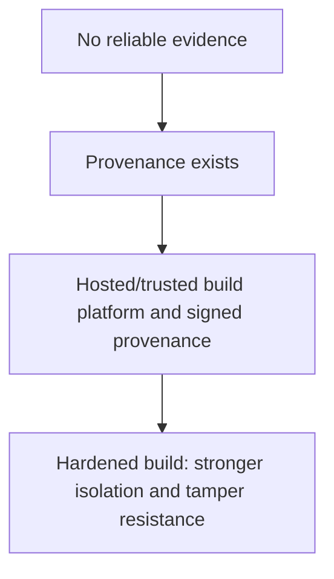
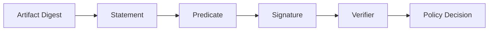
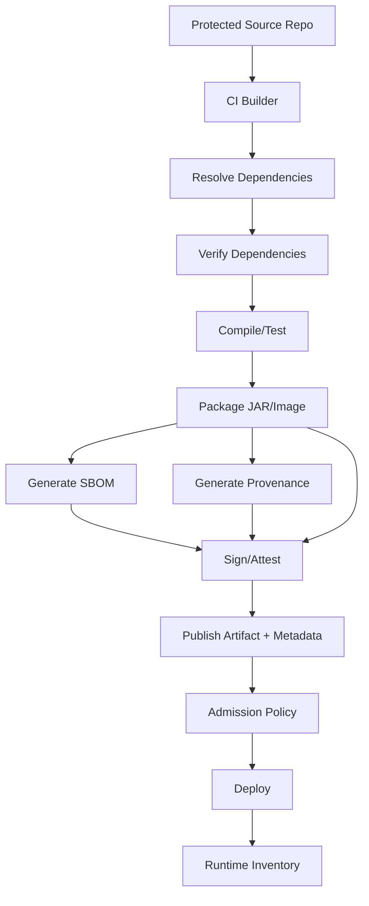

------
title: Learn Java Security, Cryptography, Integrity and Platform Hardening - Part 026
description: SBOM, provenance, SLSA, build integrity, reproducible build, signed metadata, artifact lineage, dan cara membuktikan bahwa binary Java yang dideploy berasal dari source dan dependency yang disetujui.
series: learn-java-security-cryptography-integrity-hardening
seriesTitle: Learn Java Security, Cryptography, Integrity and Platform Hardening
order: 26
partTitle: SBOM, Provenance and SLSA
tags:
- java
- security
- cryptography
- integrity
- platform-hardening
- sbom
- provenance
- slsa
- supply-chain
date: 2026-06-28
---

# Part 026 — SBOM, Provenance and SLSA

Tujuan bagian ini: membangun kemampuan untuk menjawab pertanyaan yang sangat sederhana tetapi sering tidak bisa dijawab tim engineering:

> Binary Java yang sedang berjalan di production ini berasal dari source commit mana, dibangun oleh pipeline mana, memakai dependency apa, diverifikasi bagaimana, dan siapa/apa yang bisa membuktikannya?

Part 025 membahas dependency supply-chain risk. Part 026 membahas **evidence layer**: SBOM, provenance, attestation, SLSA, build integrity, dan artifact lineage.

Mental model:

> SBOM menjelaskan “apa isi artifact”. Provenance menjelaskan “bagaimana artifact dibuat”. Signature/attestation menjelaskan “siapa/apa yang mengikat metadata itu ke artifact”. Policy menjelaskan “apakah artifact boleh dipakai”.

Referensi utama:

- SLSA Framework: https://slsa.dev/
- SLSA v1.2 Specification: https://slsa.dev/spec/v1.2/
- SLSA Provenance: https://slsa.dev/spec/draft/build-provenance
- in-toto Attestation Framework: https://in-toto.io/
- CycloneDX: https://cyclonedx.org/
- CycloneDX Specification Overview: https://cyclonedx.org/specification/overview/
- SPDX Specification: https://spdx.dev/specifications/
- Package URL (purl): https://github.com/package-url/purl-spec
- Sigstore: https://www.sigstore.dev/
- OWASP Software Component Verification Standard: https://owasp.org/www-project-software-component-verification-standard/
- NIST Secure Software Development Framework: https://csrc.nist.gov/Projects/ssdf

---

## 1. Posisi Bagian Ini dalam Framework Kaufman

Dalam Kaufman-style skill acquisition, skill “supply-chain evidence” dipecah menjadi subskill:

| Subskill | Pertanyaan | Output |
|---|---|---|
| Artifact identity | Binary mana yang sedang kita bicarakan? | Digest dan coordinate |
| Component inventory | Apa isi binary? | SBOM |
| Build traceability | Dibuat dari source apa? | Provenance |
| Builder trust | Siapa/apa yang membangun? | Builder identity |
| Tamper evidence | Apakah metadata bisa dipalsukan? | Signature/attestation |
| Policy evaluation | Artifact ini boleh deploy? | Admission decision |
| Incident response | Kalau dependency/key compromised, artifact mana affected? | Impact query |
| Regulatory evidence | Bagaimana membuktikan kontrol dijalankan? | Audit packet |

Target kita bukan sekadar “generate SBOM”. Targetnya adalah membangun pipeline yang bisa memberikan evidence yang dipercaya.

---

## 2. Problem yang Ingin Diselesaikan

Tanpa SBOM dan provenance, incident response menjadi tebak-tebakan.

Saat ada CVE kritis, pertanyaan yang muncul:

- Service mana yang memakai dependency vulnerable?
- Versi mana yang terkena?
- Apakah dependency masuk runtime atau hanya test?
- Artifact production dibuat sebelum atau sesudah patch?
- Build berasal dari branch/tag mana?
- Siapa yang approve release?
- Apakah binary yang running sama dengan binary yang diuji?
- Apakah artifact pernah diganti di registry?
- Apakah deploy memakai image lama?
- Apakah ada shaded JAR yang menyembunyikan dependency?

Tanpa evidence, jawaban sering berupa:

```text
Sepertinya aman.
Kayaknya sudah upgrade.
Coba cek build log lama.
Mungkin image ini dari commit itu.
```

Dalam sistem regulatori, finansial, kesehatan, publik, atau enforcement lifecycle, jawaban seperti itu tidak cukup defensible.

---

## 3. Vocabulary: Jangan Campur Aduk

| Istilah | Menjawab | Bukan |
|---|---|---|
| SBOM | Apa saja komponen dalam artifact? | Bukti bahwa artifact aman |
| Lockfile | Versi/checksum apa yang dipakai build? | Inventory runtime lengkap |
| Vulnerability report | CVE apa yang ditemukan? | Bukti asal artifact |
| Provenance | Bagaimana artifact dibangun? | Daftar lengkap semua komponen |
| Attestation | Klaim terstruktur yang ditandatangani | Kebenaran mutlak tanpa trust policy |
| Signature | Metadata/artifact ditandatangani key tertentu | Bukti source aman |
| Reproducible build | Build bisa menghasilkan output sama | Bukti dependency tidak vulnerable |
| SLSA | Framework kontrol supply chain | Tool tunggal |

Security invariant:

> Artifact production harus punya identity, SBOM, provenance, signature/attestation, dan policy decision yang bisa diverifikasi ulang setelah release.

---

## 4. Artifact Identity

Sebelum bicara SBOM/provenance, kita harus tahu artifact mana yang dimaksud.

Untuk Java, artifact bisa berupa:

- JAR;
- WAR;
- EAR;
- fat/uber JAR;
- Spring Boot executable JAR;
- container image;
- native image;
- deployment package;
- Helm chart;
- OCI artifact;
- Maven package;
- Gradle module publication.

Identity minimal:

```yaml
artifact:
  name: case-management-api
  type: container-image
  version: 2026.06.28.4
  digest: sha256:...
  sourceCommit: 4f28c6c7...
  buildRunId: github-actions:123456789
  createdAt: 2026-06-28T10:15:30Z
```

Important:

> Tag is not identity. Digest is identity.

Container tag seperti `latest`, `prod`, atau `1.2.3` bisa dipindah. Digest menunjuk content-addressed artifact.

Untuk JAR:

```bash
sha256sum build/libs/case-management-api.jar
```

Untuk image:

```bash
docker buildx imagetools inspect registry.example.com/case-management-api@sha256:...
```

---

## 5. SBOM: Apa Isi Artifact?

SBOM adalah inventory komponen. Untuk Java, SBOM harus menjawab:

- direct dependency apa saja?
- transitive dependency apa saja?
- scope/configuration apa?
- versi dan checksum apa?
- package URL/purl apa?
- license apa?
- dependency relationship seperti apa?
- apakah ada component internal?
- apakah ada shaded/nested JAR?
- apakah ada container OS packages?
- apakah ada runtime/JDK/base image component?

### 5.1 SBOM Bukan CVE Report

SBOM tidak otomatis mengatakan sistem aman.

SBOM adalah bahan baku untuk:

- vulnerability matching;
- license review;
- incident impact analysis;
- dependency ownership;
- regulatory reporting;
- release comparison;
- artifact verification.

### 5.2 CycloneDX vs SPDX

Keduanya umum dipakai.

| Format | Kekuatan Praktis |
|---|---|
| CycloneDX | Fokus kuat pada software supply-chain, security metadata, dependency relationship, services, vulnerabilities, dan extensibility |
| SPDX | Kuat untuk licensing, legal/compliance, software package metadata, dan standardisasi industri |

Tidak perlu fanatik. Pilih berdasarkan consumer:

- security scanner menerima apa?
- regulator/vendor meminta apa?
- repository/pipeline mendukung apa?
- organisasi punya standar apa?

### 5.3 Package URL

Package URL atau purl memberi identitas package lintas ecosystem.

Contoh Maven purl:

```text
pkg:maven/com.fasterxml.jackson.core/jackson-databind@2.17.2
```

Dengan purl, vulnerability system bisa mencocokkan dependency lebih akurat daripada string bebas.

---

## 6. SBOM untuk Java: Level Kedalaman

SBOM bisa dangkal atau dalam.

| Level | Isi | Risiko Jika Hanya Ini |
|---|---|---|
| Declared dependencies | Yang tertulis di POM/build.gradle | Tidak melihat transitive/runtime final |
| Resolved dependencies | Graph setelah resolution | Lebih baik, tapi belum tentu isi artifact final |
| Packaged dependencies | Isi JAR/WAR/image | Lebih dekat production |
| Runtime inventory | Yang benar-benar loaded/running | Sulit, tapi bagus untuk incident response |
| Multi-layer SBOM | App + JDK + OS image + config | Paling berguna untuk container production |

Untuk service Java containerized, idealnya punya:

1. SBOM aplikasi Java;
2. SBOM container image;
3. link dari image digest ke app artifact digest;
4. provenance build;
5. vulnerability scan result;
6. deploy record.

---

## 7. Example SBOM Shape

Contoh simplified CycloneDX-like structure:

```json
{
  "bomFormat": "CycloneDX",
  "specVersion": "1.6",
  "metadata": {
    "component": {
      "type": "application",
      "name": "case-management-api",
      "version": "2026.06.28.4"
    }
  },
  "components": [
    {
      "type": "library",
      "group": "com.fasterxml.jackson.core",
      "name": "jackson-databind",
      "version": "2.17.2",
      "purl": "pkg:maven/com.fasterxml.jackson.core/jackson-databind@2.17.2",
      "hashes": [
        {
          "alg": "SHA-256",
          "content": "..."
        }
      ]
    }
  ],
  "dependencies": [
    {
      "ref": "case-management-api",
      "dependsOn": [
        "pkg:maven/com.fasterxml.jackson.core/jackson-databind@2.17.2"
      ]
    }
  ]
}
```

What to verify:

- application component correct;
- purl present;
- hashes present;
- dependencies relationship present;
- transitive dependencies included;
- metadata has build timestamp/source when appropriate;
- SBOM file itself is attached to artifact/release;
- SBOM is signed or covered by attestation.

---

## 8. Generating SBOM in Java Builds

### 8.1 Maven Concept

Common Maven pattern:

```xml
<plugin>
  <groupId>org.cyclonedx</groupId>
  <artifactId>cyclonedx-maven-plugin</artifactId>
  <version>${cyclonedx.maven.plugin.version}</version>
  <executions>
    <execution>
      <phase>package</phase>
      <goals>
        <goal>makeAggregateBom</goal>
      </goals>
    </execution>
  </executions>
  <configuration>
    <schemaVersion>1.6</schemaVersion>
    <includeBomSerialNumber>true</includeBomSerialNumber>
    <includeCompileScope>true</includeCompileScope>
    <includeRuntimeScope>true</includeRuntimeScope>
    <includeTestScope>false</includeTestScope>
  </configuration>
</plugin>
```

Security notes:

- pin plugin version;
- verify plugin source/repository;
- commit policy, not generated SBOM unless organization chooses that model;
- release artifact should store generated SBOM;
- multi-module builds need aggregate SBOM;
- include runtime dependencies;
- decide whether test scope is excluded or emitted separately.

### 8.2 Gradle Concept

Common Gradle pattern:

```kotlin
plugins {
    id("org.cyclonedx.bom") version "<pinned-version>"
}

cyclonedxBom {
    includeConfigs.set(listOf("runtimeClasspath"))
    skipConfigs.set(listOf("testRuntimeClasspath"))
    projectType.set("application")
    schemaVersion.set("1.6")
    outputFormat.set("json")
}
```

Security notes:

- plugin version explicit;
- plugin resolved from approved plugin repository;
- generated SBOM attached to release;
- Gradle dependency verification covers plugin and dependency artifacts where configured;
- dependency locking/verification metadata diff reviewed.

---

## 9. SBOM Quality Gates

A bad SBOM is false confidence.

Minimum SBOM quality gate:

```yaml
sbomQualityGate:
  required: true
  format:
    allowed:
      - CycloneDX JSON
      - SPDX JSON
  mustContain:
    - application identity
    - package URL for Maven dependencies
    - version for every component
    - dependency relationship
    - hashes when available
    - license when available
  mustNotContain:
    - unknown version for runtime dependency
    - unresolved dynamic version
    - local file dependency without provenance
  attachToRelease: true
  signedOrAttested: true
```

Useful checks:

- component count diff vs previous release;
- new critical dependency requires approval;
- missing purl is warning/error;
- unknown license blocks release if policy requires;
- vulnerable component blocks release based on severity/exploitability;
- shaded dependency must be represented.

---

## 10. Provenance: Bagaimana Artifact Dibuat?

Provenance adalah metadata build. Ia menjawab:

- builder apa yang menjalankan build?
- source repo mana?
- commit/tag mana?
- build command/config apa?
- dependency/material apa yang masuk?
- artifact digest apa yang keluar?
- kapan build terjadi?
- apakah build dari protected branch/tag?
- apakah build reproducible/hermetic?

Simplified provenance shape:

```json
{
  "subject": [
    {
      "name": "registry.example.com/case-management-api",
      "digest": {
        "sha256": "..."
      }
    }
  ],
  "predicateType": "https://slsa.dev/provenance/v1",
  "predicate": {
    "buildDefinition": {
      "buildType": "https://github.com/actions/workflow",
      "externalParameters": {
        "repository": "company/case-management-api",
        "ref": "refs/tags/v2026.06.28.4"
      }
    },
    "runDetails": {
      "builder": {
        "id": "https://github.com/actions/runner/github-hosted"
      },
      "metadata": {
        "invocationId": "123456789"
      }
    }
  }
}
```

Core invariant:

> Provenance must bind artifact digest to source, builder, and build invocation.

---

## 11. SLSA Mental Model

SLSA is a framework for improving artifact integrity across software supply chains. It is not one tool.

In practical terms, SLSA pushes us from:

```text
"We built this somewhere from something."
```

to:

```text
"This artifact digest was produced by this trusted builder, from this source, using this workflow, with this provenance, and the metadata is verifiable."
```

### 11.1 SLSA-Style Progression



Do not treat levels as badges. Treat them as threat reduction.

| Capability | Threat Reduced |
|---|---|
| Build script automated | Manual release tampering |
| Provenance generated | Unknown build origin |
| Hosted build platform | Developer workstation compromise |
| Signed provenance | Metadata tampering |
| Isolated/hardened builder | Cross-build contamination |
| Protected source refs | Unauthorized source changes |
| Artifact digest binding | Artifact substitution |

---

## 12. Attestation

An attestation is a signed statement about an artifact.

Common statements:

- “This artifact was built by workflow X from commit Y.”
- “This artifact has SBOM Z.”
- “This artifact passed tests.”
- “This artifact passed vulnerability policy.”
- “This artifact was signed by keyless identity X.”

Attestation model:



A signature alone does not tell us whether an artifact is acceptable. Policy decides.

Example policy checks:

```yaml
admissionPolicy:
  require:
    - image digest, not tag
    - SLSA provenance
    - SBOM attestation
    - vulnerability scan attestation
    - source repository allowlist
    - protected branch or signed tag
    - builder identity allowlist
  denyIf:
    - provenance missing
    - artifact subject digest mismatch
    - build from pull_request_target with untrusted code
    - source repo not approved
    - critical CVE without exception
```

---

## 13. Build Integrity Architecture

A hardened Java release pipeline should look like this:



Key design points:

- build from protected source refs;
- dependency graph pinned/verified;
- CI runner isolated;
- release job has minimal credentials;
- artifact digest captured immediately;
- SBOM and provenance generated during release;
- signatures/attestations created before publish or immediately after;
- deployment verifies metadata, not just build success;
- runtime records artifact digest.

---

## 14. Source Integrity

Build provenance is weak if source control is weak.

Controls:

- branch protection;
- required reviews;
- required CI checks;
- signed commits/tags where feasible;
- CODEOWNERS for security-critical files;
- protected release workflow files;
- restricted write access;
- audit log retention;
- no force-push for release branches;
- dependency update bots constrained by policy.

Security-critical files:

```text
pom.xml
build.gradle.kts
settings.gradle.kts
gradle.properties
maven settings
Dockerfile
.github/workflows/*
Jenkinsfile
release scripts
SBOM/provenance scripts
signing config
container deployment manifests
```

Rule:

> A change to build workflow is a change to production artifact trust, even if application source did not change.

---

## 15. Builder Integrity

Builder is part of the trust chain.

Questions:

- Is builder ephemeral or long-lived?
- Can previous builds contaminate future builds?
- Can PR build access release secrets?
- Can untrusted contributor modify workflow?
- Are dependencies downloaded from approved repository only?
- Are signing keys exposed to runner filesystem?
- Is network egress restricted?
- Are build logs protected from leaking secrets?
- Is build environment pinned?

### 15.1 Hosted vs Self-Hosted Runner

| Builder Type | Strength | Risk |
|---|---|---|
| Hosted ephemeral runner | Better isolation, less maintenance | Trust provider, limited customization |
| Self-hosted runner | More control | Persistence, credential leakage, cross-job contamination |
| Developer laptop | Fast/manual | Weak provenance, high tamper risk |

Policy:

```text
Production release artifact must not be built on a developer laptop.
```

---

## 16. Reproducible Build

A reproducible build means same inputs can produce identical or equivalent output.

For Java, obstacles include:

- timestamps inside JAR;
- file ordering;
- generated build metadata;
- non-deterministic code generation;
- dependency resolution drift;
- compiler/JDK version differences;
- locale/timezone;
- container base image tag drift;
- random IDs in generated resources.

Controls:

- fixed JDK version;
- fixed build tool version;
- fixed dependency versions;
- no snapshots in release;
- normalized timestamps;
- deterministic JAR packaging;
- pinned container base image by digest;
- generated metadata controlled;
- build environment declared.

Reproducibility is not always required to be perfect, but the closer you get, the easier it is to detect artifact substitution.

---

## 17. Artifact Signing

Artifact signing binds identity to bytes.

For Java ecosystem, signing can exist at multiple layers:

| Layer | Example |
|---|---|
| JAR | JAR signing / Maven publication signing |
| Container image | cosign / registry signature |
| SBOM | signed SBOM attestation |
| Provenance | signed provenance attestation |
| Git tag | signed release tag |
| Deployment manifest | signed policy bundle / GitOps commit |

Important distinction:

```text
Signing an artifact says: this signer signed these bytes.
It does not automatically say: these bytes are secure.
```

Policy must evaluate signer identity, source, builder, vulnerabilities, and environment.

---

## 18. Admission Control

A strong pipeline does not stop at generating metadata. Deployment must verify it.

Admission questions:

- Is image referenced by digest?
- Is artifact signed by approved identity?
- Is provenance present?
- Does provenance subject digest match artifact digest?
- Is source repo approved?
- Is source ref protected?
- Is builder approved?
- Is SBOM present?
- Are critical vulnerabilities below threshold?
- Is environment allowed for this artifact classification?

Example conceptual Kubernetes/GitOps gate:

```yaml
releaseAdmission:
  artifactDigest: required
  signature:
    required: true
    trustedIdentities:
      - release-bot@company.example
  provenance:
    required: true
    allowedBuilders:
      - github-actions/company-release-builder
    allowedSourceRepos:
      - company/case-management-api
    requireProtectedRef: true
  sbom:
    required: true
  vulnerabilities:
    denyCritical: true
    denyHighOlderThanDays: 14
```

---

## 19. Runtime Lineage

Build-time evidence is incomplete if runtime cannot tell what is running.

Runtime should expose or record:

- service name;
- version;
- git commit;
- artifact digest;
- image digest;
- build run ID;
- SBOM/provenance reference;
- deployment ID;
- config version;
- environment.

Example `/actuator/info`-like output should be sanitized but useful:

```json
{
  "service": "case-management-api",
  "version": "2026.06.28.4",
  "commit": "4f28c6c7",
  "imageDigest": "sha256:...",
  "buildRunId": "123456789",
  "sbomRef": "oci://registry.example.com/attestations/...",
  "provenanceRef": "oci://registry.example.com/attestations/..."
}
```

Do not expose secrets, internal tokens, or full environment variables.

---

## 20. Incident Response Queries

Good SBOM/provenance makes these queries fast.

### 20.1 CVE Impact Query

```text
Find all production artifacts where:
- dependency purl = pkg:maven/com.fasterxml.jackson.core/jackson-databind
- version < fixed version
- deployed environment = production
- runtime date overlaps vulnerability window
```

### 20.2 Compromised Builder Query

```text
Find all artifacts where:
- builder.id = compromised-runner-pool
- builtAt between T1 and T2
- deployed = true
```

### 20.3 Compromised Signing Identity Query

```text
Find all artifacts where:
- signature.identity = release-bot@company.example
- signedAt between compromiseStart and keyRevocation
```

### 20.4 Malicious Dependency Query

```text
Find all artifacts where:
- SBOM contains purl X
- directOrTransitive = any
- scope = runtime
```

This is where SBOM becomes operational, not decorative.

---

## 21. Regulatory Defensibility

For regulated systems, evidence must be:

- complete enough;
- tamper-evident;
- tied to release decisions;
- retained for audit period;
- queryable during incident;
- understandable by reviewers;
- linked to risk acceptance when policy is bypassed.

A defensible release packet can contain:

```yaml
releaseEvidence:
  artifact:
    name: case-management-api
    digest: sha256:...
  source:
    repository: company/case-management-api
    commit: 4f28c6c7
    ref: refs/tags/v2026.06.28.4
  build:
    runId: 123456789
    builder: github-actions/company-release-builder
    workflow: release.yml
  sbom:
    format: CycloneDX JSON
    digest: sha256:...
  provenance:
    format: SLSA provenance
    digest: sha256:...
  signatures:
    artifact: present
    provenance: present
    sbom: present
  vulnerabilityGate:
    result: pass
    exceptions: []
  approvals:
    codeOwners: pass
    securityReview: not-required
  deployment:
    environment: production
    deployedAt: 2026-06-28T12:00:00Z
```

---

## 22. Common Anti-Patterns

### 22.1 SBOM Generated After the Fact

Bad:

```text
Production artifact deployed first. SBOM generated later from source branch.
```

Problem:

- source may have changed;
- dependency resolution may drift;
- artifact may differ;
- evidence does not bind to deployed digest.

Better:

```text
Generate SBOM in release build and bind it to artifact digest.
```

### 22.2 Provenance Without Verification

Bad:

```text
Pipeline uploads provenance, but deploy does not check it.
```

Better:

```text
Admission control verifies provenance subject digest, builder identity, source repo, and policy.
```

### 22.3 Tag-Based Deployment

Bad:

```yaml
image: registry.example.com/case-management-api:latest
```

Better:

```yaml
image: registry.example.com/case-management-api@sha256:...
```

### 22.4 SBOM Stored Separately Without Link

Bad:

```text
SBOM in random CI artifact. Image in registry. No digest binding.
```

Better:

```text
SBOM attached as signed attestation to artifact digest.
```

### 22.5 Trusting Build Logs as Evidence

Build logs are useful but not enough. Logs are not structured, not always retained, and often not cryptographically bound to artifact.

Better:

- structured provenance;
- signed attestation;
- release metadata;
- immutable artifact registry.

---

## 23. Java-Specific Evidence Pitfalls

### 23.1 Fat JARs

Spring Boot fat JARs contain nested dependencies.

SBOM must reflect nested JARs, not only declared dependencies.

Review:

```bash
jar tf build/libs/app.jar | head
jar tf build/libs/app.jar | grep 'BOOT-INF/lib'
```

### 23.2 Shaded JARs

Shaded dependencies can hide original identity.

Policy:

- require relocation report;
- include shaded components in SBOM;
- avoid shading security-critical libraries;
- document why shading is necessary.

### 23.3 Generated Code

Generated code may not appear as dependency, but it affects artifact behavior.

Examples:

- OpenAPI generated clients;
- protobuf generated classes;
- MapStruct mappers;
- Lombok transformations;
- annotation-driven security configuration.

Provenance should include generator/plugin versions as materials when possible.

### 23.4 Multi-Module Builds

Multi-module builds can produce many artifacts.

Policy:

- each deployable gets its own SBOM;
- aggregate SBOM can exist, but does not replace per-artifact SBOM;
- module dependency relationship must be clear;
- release packet maps modules to deployables.

### 23.5 JDK and Base Image

Java application security includes JDK/runtime image.

SBOM should answer:

- which JDK distribution?
- which JDK version/update?
- which base image digest?
- which OS packages?
- is image distroless/minimal?
- are CA certificates included/updated?

---

## 24. Minimal Implementation Roadmap

### Phase 1 — Inventory

- generate SBOM for each Java service;
- attach SBOM to CI artifact;
- publish artifact by digest;
- record git commit/build ID in artifact metadata.

### Phase 2 — Verification

- pin dependency versions;
- enable Gradle dependency verification or Maven equivalent controls;
- enforce repository allowlist;
- deny dynamic versions/snapshots for release;
- vulnerability gate in CI.

### Phase 3 — Provenance

- generate provenance in release pipeline;
- sign/attest provenance;
- store provenance with artifact;
- link provenance to artifact digest.

### Phase 4 — Admission

- deploy only by digest;
- verify signature;
- verify provenance source/builder;
- require SBOM;
- enforce vulnerability/exception policy.

### Phase 5 — Incident Query

- index SBOM/provenance metadata;
- map artifact digest to runtime deployment;
- support CVE/component/builder/signing-key queries;
- build incident playbooks.

---

## 25. Example Release Pipeline Skeleton

```yaml
name: release

on:
  push:
    tags:
      - 'v*'

jobs:
  release:
    permissions:
      contents: read
      id-token: write
      packages: write
    runs-on: ubuntu-latest

    steps:
      - name: Checkout
        uses: actions/checkout@v4
        with:
          fetch-depth: 0

      - name: Setup JDK
        uses: actions/setup-java@v4
        with:
          distribution: temurin
          java-version: '21'

      - name: Build and test
        run: ./gradlew clean test build

      - name: Generate SBOM
        run: ./gradlew cyclonedxBom

      - name: Build image
        run: |
          docker build -t registry.example.com/case-management-api:${GITHUB_REF_NAME} .

      - name: Push image and capture digest
        run: |
          docker push registry.example.com/case-management-api:${GITHUB_REF_NAME}
          # capture digest here

      - name: Sign and attest
        run: |
          # sign artifact digest
          # attach SBOM attestation
          # attach provenance attestation
```

This skeleton is intentionally incomplete. Real production pipeline must handle:

- pinned actions or trusted action policy;
- protected release tags;
- dependency verification;
- build provenance generation;
- signature policy;
- secret isolation;
- environment approval;
- registry immutability.

---

## 26. Policy Examples

### 26.1 Release Must Have Evidence

```rego
package release.policy

default allow = false

allow {
  input.artifact.digest != ""
  input.sbom.present == true
  input.provenance.present == true
  input.signature.valid == true
  input.provenance.builder in allowed_builders
  input.provenance.sourceRepository in allowed_repositories
  input.vulnerability.critical == 0
}

allowed_builders := {
  "github-actions/company-release-builder",
  "tekton/company-release-pipeline"
}

allowed_repositories := {
  "company/case-management-api"
}
```

### 26.2 Deny Mutable Tags

```rego
deny[msg] {
  startswith(input.image, "registry.example.com/")
  not contains(input.image, "@sha256:")
  msg := "production deployment must reference image by digest"
}
```

---

## 27. Evidence Storage

Evidence must be stored where it remains available.

Options:

| Storage | Use |
|---|---|
| Artifact repository | Attach SBOM/provenance to release artifact |
| OCI registry | Store image, signature, attestation |
| Security data lake | Query across services/releases |
| GRC/audit system | Regulatory evidence packet |
| GitOps repo | Deployment decision record |

Retention policy:

```yaml
evidenceRetention:
  productionRelease: 7 years
  nonProductionRelease: 90 days
  failedBuild: 30 days
  vulnerabilityException: 7 years
  signingKeyAudit: 7 years
```

Tune retention to legal/regulatory requirements.

---

## 28. Testing SBOM/Provenance Pipeline

Security evidence pipeline must be tested.

Test cases:

```text
[ ] Build fails if SBOM generation fails.
[ ] Build fails if dependency verification fails.
[ ] Release fails if provenance missing.
[ ] Deploy fails if artifact uses tag instead of digest.
[ ] Deploy fails if source repo not allowlisted.
[ ] Deploy fails if builder identity not allowlisted.
[ ] Deploy fails if artifact digest does not match provenance subject.
[ ] Deploy fails if critical CVE exists without exception.
[ ] Incident query finds artifact by vulnerable purl.
[ ] Incident query finds artifact by build run ID.
```

Chaos/security drill:

- remove SBOM file;
- alter artifact after signing;
- change source repo field in provenance;
- deploy image by tag;
- introduce fake critical vulnerability;
- use unapproved builder;
- use unprotected branch.

Expected result: pipeline blocks or alerts.

---

## 29. What Good Looks Like

A mature Java platform can answer within minutes:

```text
Which production services include log4j-core version X?
Which images were built by runner pool Y last week?
Which artifacts were built from commit range A..B?
Which releases have SBOM but missing provenance?
Which deploys used mutable tags?
Which services use vulnerable transitive dependency through library Z?
Which artifacts were signed by identity K before rotation?
```

This is the difference between “security theater” and operational supply-chain integrity.

---

## 30. Checklist

### 30.1 SBOM Checklist

```text
[ ] SBOM generated for every release artifact.
[ ] SBOM includes runtime dependencies.
[ ] SBOM includes transitive dependencies.
[ ] SBOM includes purl where possible.
[ ] SBOM includes hashes where possible.
[ ] SBOM represents shaded/nested JARs or documents limitations.
[ ] SBOM is attached to artifact/release.
[ ] SBOM is signed or covered by attestation.
[ ] SBOM is indexed for incident response.
```

### 30.2 Provenance Checklist

```text
[ ] Provenance generated by release pipeline.
[ ] Provenance subject digest matches artifact digest.
[ ] Provenance includes source repo and commit/ref.
[ ] Provenance includes builder identity.
[ ] Provenance includes build invocation/run ID.
[ ] Provenance is signed/attested.
[ ] Deployment verifies provenance.
[ ] Provenance retained for audit period.
```

### 30.3 SLSA-Style Control Checklist

```text
[ ] Build is automated.
[ ] Build runs on trusted/approved builder.
[ ] Release source refs are protected.
[ ] Build workflow changes require review.
[ ] Dependencies are pinned/verified.
[ ] Artifact is identified by digest.
[ ] Provenance is generated and verifiable.
[ ] Metadata is tamper-evident.
[ ] Deployment policy consumes evidence.
```

---

## 31. Exercises

### Exercise 1 — Create a Release Evidence Packet

For one Java service, produce:

```yaml
artifactDigest: sha256:...
sourceCommit: ...
buildRunId: ...
sbomDigest: sha256:...
provenanceDigest: sha256:...
imageDigest: sha256:...
```

Then answer:

- where is each evidence item stored?
- who can modify it?
- how is it verified?
- how long is it retained?

### Exercise 2 — SBOM Diff Review

Compare two releases:

```text
release A -> release B
```

Find:

- new dependencies;
- removed dependencies;
- upgraded dependencies;
- downgraded dependencies;
- new critical-runtime libraries;
- new license concerns.

### Exercise 3 — Provenance Failure Drill

Simulate:

- provenance missing;
- source repo mismatch;
- builder mismatch;
- subject digest mismatch.

Expected result:

```text
Deployment denied.
```

### Exercise 4 — Incident Query Drill

Pick one dependency purl and answer:

```text
Which production artifacts include this purl?
Which environments run them?
Who owns them?
What release introduced them?
What is the patch plan?
```

---

## 32. Summary

SBOM, provenance, and SLSA-style controls transform Java release security from belief into evidence.

Key takeaways:

1. SBOM says what is inside an artifact.
2. Provenance says how the artifact was built.
3. Signature/attestation makes metadata tamper-evident.
4. SLSA gives a control model for supply-chain integrity.
5. Artifact digest matters more than mutable tags.
6. Java-specific packaging like fat JAR and shading must be handled explicitly.
7. Release evidence must be generated during the release, not reconstructed later.
8. Deployment should verify evidence, not merely trust CI success.
9. Runtime should record artifact lineage.
10. Incident response becomes fast only when SBOM/provenance are indexed and queryable.

Security invariant akhir:

> A Java production release is defensible only when its artifact digest can be linked to source, build, dependency inventory, provenance, signature, policy decision, and runtime deployment record.

