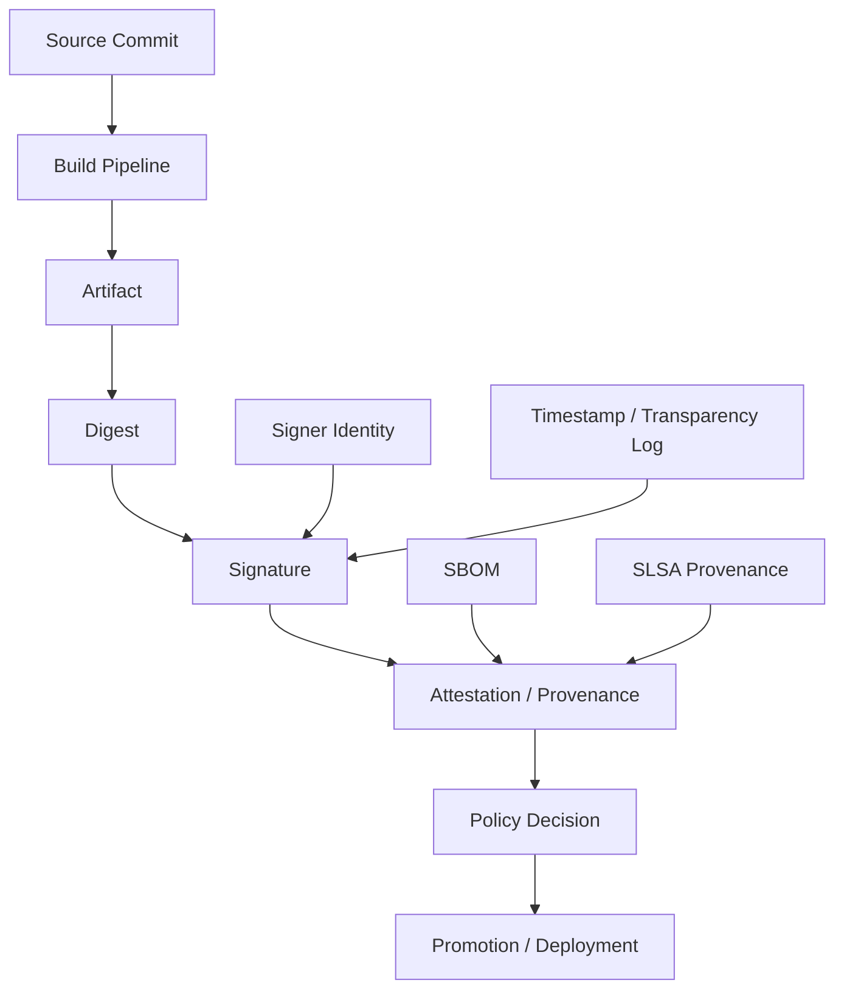
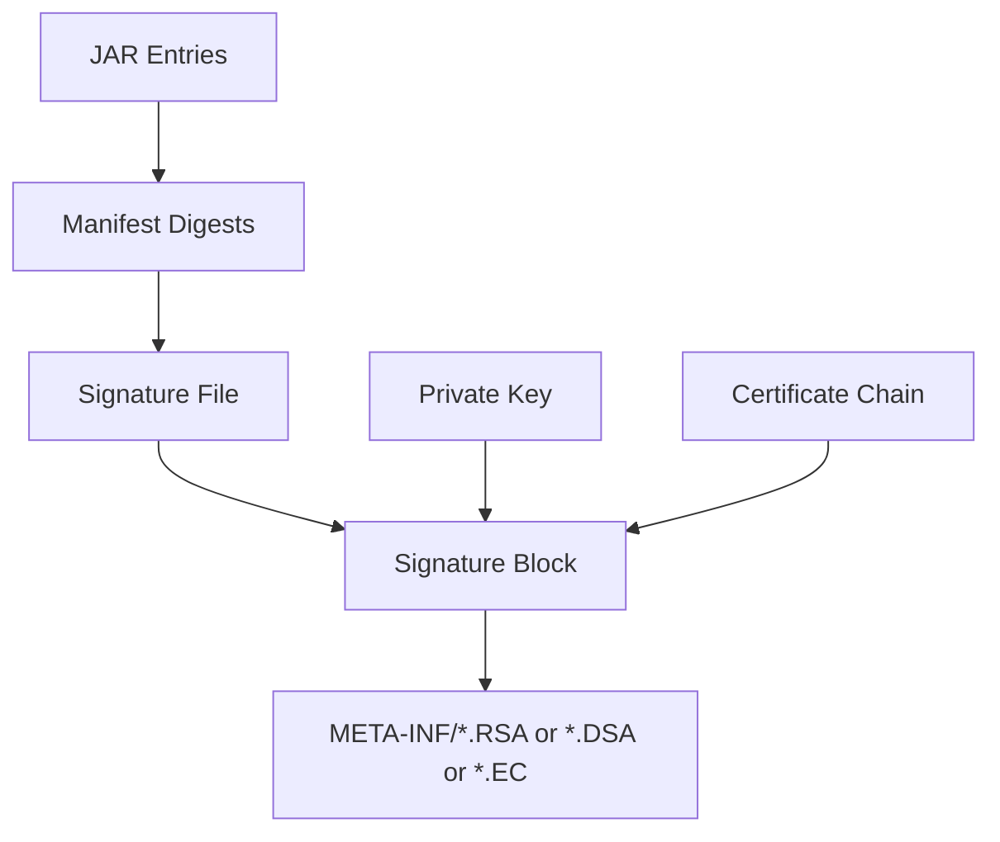
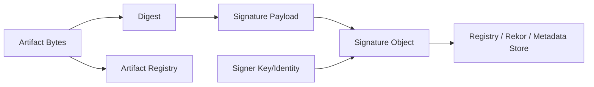
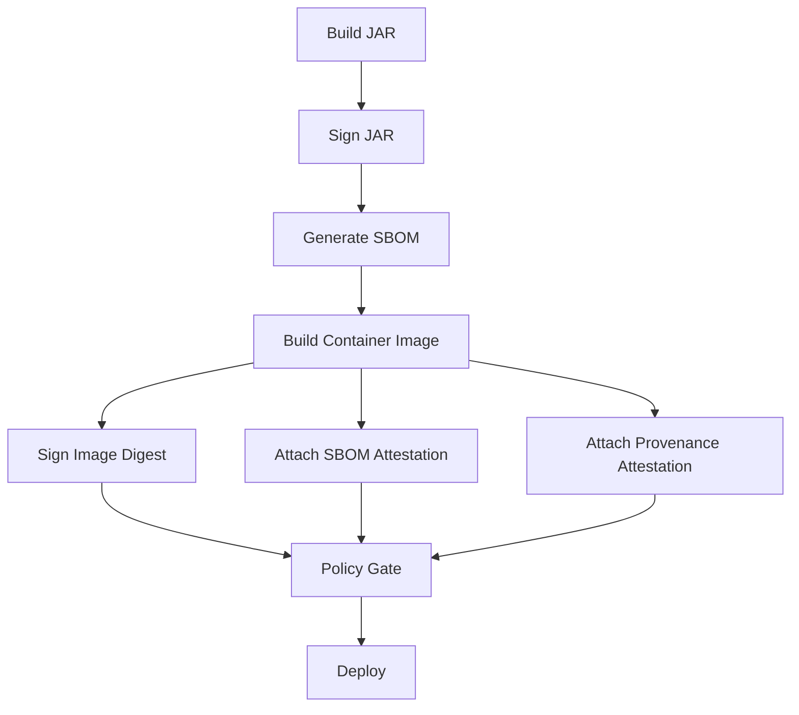
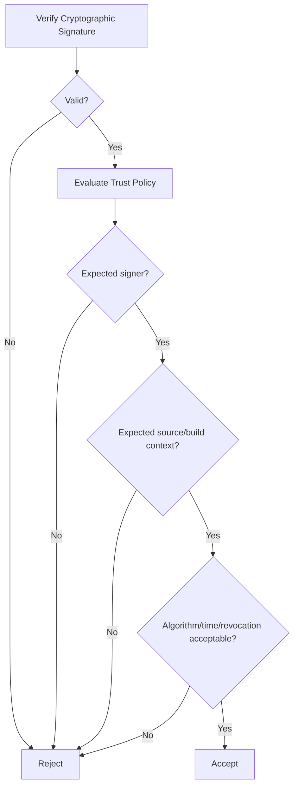
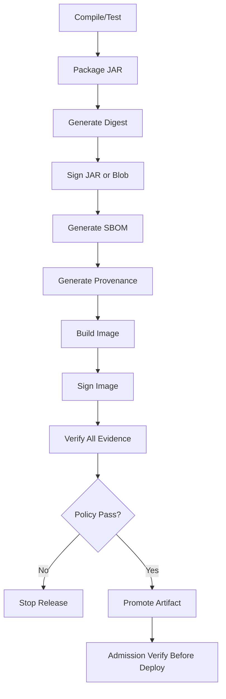
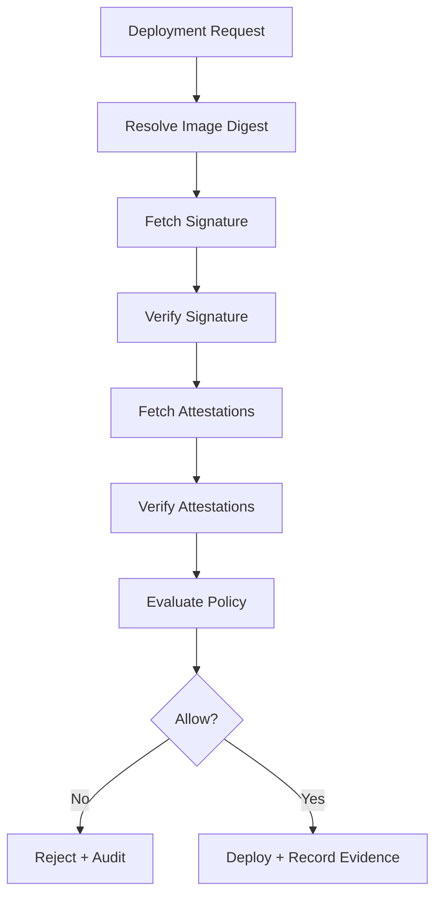

------
title: Learn Java Security, Cryptography, Integrity and Platform Hardening - Part 027
description: Artifact signing untuk Java: JAR signing, jarsigner, Maven artifact signing, Sigstore/cosign, container image verification, trust policy, timestamping, revocation, dan release gate yang fail-closed.
series: learn-java-security-cryptography-integrity-hardening
seriesTitle: Learn Java Security, Cryptography, Integrity and Platform Hardening
order: 27
partTitle: Artifact Signing, jarsigner and cosign
tags:
- java
- security
- cryptography
- integrity
- platform-hardening
- artifact-signing
- jarsigner
- cosign
- sigstore
- supply-chain
date: 2026-06-28
---

# Part 027 — Artifact Signing, `jarsigner` and `cosign`

Tujuan bagian ini: membangun kemampuan untuk menjawab pertanyaan berikut secara teknis, operasional, dan defensible:

> Apakah artifact Java yang kita build, publish, promote, dan deploy masih sama dengan artifact yang disetujui, berasal dari signer yang dipercaya, dan belum dimodifikasi setelah proses release?

Part 025 membahas dependency supply-chain risk. Part 026 membahas SBOM, provenance, dan SLSA. Part 027 membahas **artifact signing**: mekanisme cryptographic binding antara artifact, signer identity, metadata, waktu, dan trust policy.

Mental model:

> Hash memberi identity. Signature memberi authenticity dan tamper evidence. Certificate memberi binding ke identity. Timestamp memberi konteks waktu. Policy memberi keputusan boleh/tidak boleh dipakai.

Referensi utama:

- Oracle `jarsigner` command: https://docs.oracle.com/en/java/javase/25/docs/specs/man/jarsigner.html
- Java Tutorial — Signing JAR Files: https://docs.oracle.com/javase/tutorial/deployment/jar/signing.html
- Java Tutorial — Verifying Signed JAR Files: https://docs.oracle.com/javase/tutorial/deployment/jar/verify.html
- Java `JarFile` API: https://docs.oracle.com/en/java/javase/25/docs/api/java.base/java/util/jar/JarFile.html
- Java `CodeSigner` API: https://docs.oracle.com/en/java/javase/25/docs/api/java.base/java/security/CodeSigner.html
- Sigstore: https://www.sigstore.dev/
- Cosign quickstart: https://docs.sigstore.dev/quickstart/quickstart-cosign/
- Cosign verification: https://docs.sigstore.dev/cosign/verifying/verify/
- in-toto Attestation Framework: https://in-toto.io/
- SLSA Framework: https://slsa.dev/
- Maven Central publishing requirements: https://central.sonatype.org/publish/requirements/

---

## 1. Posisi Bagian Ini dalam Framework Kaufman

Dalam Kaufman-style skill acquisition, artifact signing dipecah menjadi subskill kecil:

| Subskill | Pertanyaan | Output |
|---|---|---|
| Artifact identity | Artifact mana yang sedang diverifikasi? | Digest, coordinate, tag, immutable reference |
| Signing primitive | Apa yang ditandatangani? | Bytes/canonical payload |
| Signer identity | Siapa/apa signer-nya? | Certificate, key, Fulcio identity, GPG key |
| Verification | Bagaimana membuktikan signature valid? | Verification command/library result |
| Trust policy | Signature valid saja cukup? | Allow/deny decision |
| Timestamping | Valid pada waktu kapan? | Signed timestamp / transparency log evidence |
| Revocation and compromise | Bagaimana kalau key bocor? | Key rotation and distrust plan |
| Release gate | Di titik mana verification wajib? | CI/CD/admission policy |
| Evidence retention | Bagaimana audit nanti membuktikan? | Release evidence packet |

Target kita bukan hafal command `jarsigner`. Targetnya adalah mampu mendesain **integrity chain** dari source sampai runtime.

---

## 2. Problem yang Ingin Diselesaikan

Tanpa signing dan verification policy, pipeline modern mudah jatuh ke kondisi berikut:

- CI membangun artifact yang benar, tetapi artifact yang berbeda masuk registry.
- Developer meng-upload JAR manual tanpa provenance.
- Container tag `latest` berubah tanpa bukti siapa yang mengubah.
- Dependency internal diserang lewat repository poisoning.
- Build plugin menghasilkan bytecode tambahan yang tidak terlihat dalam review.
- Artifact production tidak bisa dibuktikan berasal dari commit tertentu.
- Incident response tidak tahu artifact mana yang harus dicabut.

Artifact signing tidak membuat kode aman. Ia menjawab pertanyaan lebih sempit:

> Apakah artifact ini masih artifact yang sama dan ditandatangani oleh identity yang kita percaya?

Security mistake paling umum: menganggap “signed” berarti “safe”. Signature tidak membuktikan kode bebas vulnerability. Signature hanya membuktikan origin dan integrity relatif terhadap trust policy.

---

## 3. Empat Layer Integrity Artifact



Layer yang perlu dipisahkan:

| Layer | Menjawab | Contoh |
|---|---|---|
| Digest | Artifact ini byte-for-byte apa? | SHA-256 digest |
| Signature | Siapa/apa menandatangani digest/payload? | JAR signature, cosign signature |
| Attestation | Metadata apa yang diikat ke artifact? | SBOM, provenance, test result |
| Policy | Artifact boleh dipakai? | Required signer, builder, branch, environment |

Signature tanpa policy hanya dekorasi. Policy tanpa signature mudah dipalsukan. Provenance tanpa artifact digest tidak mengikat ke binary tertentu.

---

## 4. Artifact Identity: Jangan Mulai dari Nama File

Nama file bukan identity keamanan.

Buruk:

```text
case-management-service-1.8.4.jar
registry.example.com/case-management-service:prod
```

Lebih baik:

```text
case-management-service-1.8.4.jar
sha256:7d2c...f91a

registry.example.com/case-management-service@sha256:3ae4...18bc
```

Invariant:

> Semua verification, signing, SBOM, provenance, dan deployment decision harus mengikat ke immutable digest, bukan mutable name/tag.

Untuk Java build, coordinate seperti `groupId:artifactId:version` berguna untuk dependency management, tetapi bukan bukti integrity. Coordinate harus dipasangkan dengan digest dan sumber repository yang dipercaya.

---

## 5. Model JAR Signing

JAR adalah ZIP archive dengan manifest dan metadata di `META-INF`. Signing JAR secara konseptual membuat digest entry, lalu signature atas manifest/digest tersebut.



Komponen umum signed JAR:

| Komponen | Fungsi |
|---|---|
| `META-INF/MANIFEST.MF` | Metadata JAR dan digest per entry |
| `META-INF/*.SF` | Signature file yang memuat digest manifest/sections |
| `META-INF/*.RSA`, `*.DSA`, `*.EC` | Signature block dan certificate |
| Keystore | Tempat private key dan certificate signer |
| Timestamp authority | Membuktikan waktu signing |

JAR signing cocok untuk beberapa use case:

- plugin JAR yang dimuat oleh platform internal;
- distribusi library ke repository publik;
- artifact yang perlu origin verification di runtime;
- compliance evidence bahwa release ditandatangani identity resmi.

Tetapi JAR signing bukan silver bullet:

- tidak membuktikan source commit;
- tidak membuktikan build reproducible;
- tidak membuktikan dependency aman;
- tidak otomatis diverifikasi oleh semua runtime path;
- bisa rusak bila artifact dimodifikasi setelah signing.

---

## 6. Signing JAR dengan `jarsigner`

Minimal signing flow:

```bash
# 1. Buat atau pakai keystore yang dikelola secure
keytool -genkeypair \
  -alias release-signing \
  -keyalg RSA \
  -keysize 3072 \
  -validity 365 \
  -keystore release-signing.p12 \
  -storetype PKCS12

# 2. Sign JAR
jarsigner \
  -keystore release-signing.p12 \
  -storetype PKCS12 \
  -signedjar app-signed.jar \
  app.jar \
  release-signing

# 3. Verify JAR
jarsigner -verify -verbose -certs app-signed.jar
```

Untuk production, jangan berhenti di minimal flow. Tambahkan:

- dedicated release signing key;
- key generated/stored di HSM/KMS bila memungkinkan;
- timestamping authority;
- explicit digest/signature algorithm;
- CI-controlled signing step;
- verification step setelah upload/download dari repository;
- evidence retention.

Contoh dengan timestamp dan algorithm explicit:

```bash
jarsigner \
  -keystore release-signing.p12 \
  -storetype PKCS12 \
  -tsa https://timestamp.example.com \
  -digestalg SHA-256 \
  -sigalg SHA256withRSA \
  -signedjar app-signed.jar \
  app.jar \
  release-signing
```

Catatan penting:

- Algorithm yang acceptable harus mengikuti kebijakan kriptografi organisasi.
- Hindari key dan password di command history/log CI.
- Jangan menandatangani artifact lokal developer untuk release resmi.
- Signing harus terjadi setelah build final, bukan sebelum shading/repackaging.

---

## 7. Verification Bukan Formalitas

Command verify dasar:

```bash
jarsigner -verify app-signed.jar
```

Untuk gate, gunakan output verbose dan fail bila ada warning terkait:

```bash
jarsigner -verify -strict -verbose -certs app-signed.jar
```

Verification harus menjawab beberapa pertanyaan:

| Pertanyaan | Harus dicek? |
|---|---|
| Signature cryptographically valid? | Ya |
| Semua entry relevan signed? | Ya |
| Certificate chain trusted? | Ya |
| Certificate expired/revoked? | Ya, sesuai policy |
| Timestamp valid? | Ya untuk release panjang umur |
| Signer termasuk allowlist? | Ya |
| Algorithm allowed? | Ya |
| Artifact digest cocok dengan provenance/SBOM? | Ya |

Anti-pattern:

```bash
jarsigner -verify app.jar || true
```

Ini mengubah control menjadi theater. Verification gate harus fail-closed.

---

## 8. Runtime Verification untuk Plugin JAR

Untuk platform yang memuat plugin, JAR signing bisa diverifikasi sebelum classloading.

Sketch:

```java
import java.io.IOException;
import java.nio.file.Path;
import java.security.CodeSigner;
import java.security.cert.Certificate;
import java.util.jar.JarEntry;
import java.util.jar.JarFile;

public final class SignedJarVerifier {

    public void verifyAllEntriesSigned(Path jarPath) throws IOException {
        try (JarFile jar = new JarFile(jarPath.toFile(), true)) {
            var entries = jar.entries();
            byte[] buffer = new byte[8192];

            while (entries.hasMoreElements()) {
                JarEntry entry = entries.nextElement();

                if (entry.isDirectory() || entry.getName().startsWith("META-INF/")) {
                    continue;
                }

                // Reading the entire entry triggers signature verification.
                try (var in = jar.getInputStream(entry)) {
                    while (in.read(buffer) != -1) {
                        // consume stream
                    }
                }

                CodeSigner[] signers = entry.getCodeSigners();
                Certificate[] certs = entry.getCertificates();

                if ((signers == null || signers.length == 0) && (certs == null || certs.length == 0)) {
                    throw new SecurityException("Unsigned JAR entry: " + entry.getName());
                }
            }
        }
    }
}
```

Ini belum cukup untuk production. Tambahkan:

- certificate chain validation terhadap trust anchor internal;
- signer allowlist;
- algorithm policy;
- expiry/revocation policy;
- plugin manifest policy;
- version compatibility;
- isolated classloader atau process isolation.

Invariant plugin platform:

> Tidak ada bytecode plugin yang boleh dimuat sebelum artifact identity, signature, signer, manifest policy, dan capability policy diverifikasi.

---

## 9. Detached Signature untuk Artifact Non-JAR

Tidak semua artifact cocok disigned secara embedded. Container image, SBOM, provenance, native binary, ZIP bundle, dan config bundle sering memakai detached signature.



Keuntungan detached signature:

- tidak mengubah artifact bytes;
- cocok untuk content-addressed image;
- bisa menyimpan banyak signature untuk artifact yang sama;
- cocok untuk attestations;
- lebih mudah dipakai di policy engine.

Risiko:

- signature object harus ditemukan dan diikat ke digest yang benar;
- registry/tag mutation tetap harus dicegah;
- verification policy harus jelas;
- metadata store menjadi bagian dari trust model.

---

## 10. Sigstore dan `cosign`

Sigstore/cosign populer untuk signing dan verifying container images serta blobs. Ada dua mode besar:

| Mode | Karakteristik |
|---|---|
| Keyful | Signer memakai key yang dikelola sendiri/KMS/HSM |
| Keyless | Identity berasal dari OIDC, certificate short-lived, dan transparency log |

Contoh keyless signing image:

```bash
cosign sign registry.example.com/case-management-service@sha256:3ae4...
```

Contoh verification dengan identity policy:

```bash
cosign verify \
  --certificate-identity "https://github.com/acme/case-management/.github/workflows/release.yml@refs/heads/main" \
  --certificate-oidc-issuer "https://token.actions.githubusercontent.com" \
  registry.example.com/case-management-service@sha256:3ae4...
```

Contoh signing blob:

```bash
cosign sign-blob \
  --output-signature app.jar.sig \
  --output-certificate app.jar.pem \
  app.jar
```

Contoh verify blob:

```bash
cosign verify-blob \
  --certificate app.jar.pem \
  --signature app.jar.sig \
  --certificate-identity "release@acme.example" \
  --certificate-oidc-issuer "https://issuer.example" \
  app.jar
```

Security point:

> Jangan hanya menjalankan `cosign verify`. Selalu nyatakan identity/issuer/key policy yang diharapkan.

Tanpa identity policy, Anda bisa membuktikan artifact ditandatangani oleh seseorang, tetapi belum tentu oleh signer yang benar.

---

## 11. JAR Signing vs Container Signing

| Aspek | JAR Signing | Container Signing |
|---|---|---|
| Target | Isi JAR/ZIP | Image digest |
| Signature | Embedded di JAR | Detached di registry/transparency log |
| Tool | `jarsigner` | `cosign` |
| Runtime use | Plugin verification, library distribution | Admission control, deploy gate |
| Metadata | Certificate dalam signature block | Certificate/attestation external |
| Risk utama | Repackaging invalidates signature | Tag mutation, weak policy |

Untuk service Java modern, biasanya keduanya relevan:

- JAR internal bisa signed untuk artifact integrity.
- Container image signed untuk deployment integrity.
- SBOM/provenance attested untuk supply-chain evidence.



---

## 12. Artifact Signing in Maven/Gradle Publishing

Public Maven publishing often requires signed artifacts. Common outputs:

```text
my-library-1.2.3.jar
my-library-1.2.3.jar.asc
my-library-1.2.3.pom
my-library-1.2.3.pom.asc
my-library-1.2.3-sources.jar
my-library-1.2.3-sources.jar.asc
```

This is usually PGP/GPG signing, not `jarsigner` embedded signing.

Difference:

| Type | What it signs | Typical verification |
|---|---|---|
| PGP artifact signature | Whole file as detached signature | Repository/client/tool policy |
| JAR signing | JAR entries inside archive | `jarsigner`, runtime API |
| Container signing | Image digest | `cosign`, admission policy |

For internal organizations, standardize:

- which artifacts must be signed;
- who/what may sign release artifacts;
- whether developer-local signatures are accepted;
- how keys are rotated;
- where public keys/certificates are distributed;
- whether unsigned artifacts can enter artifact repositories.

---

## 13. Trust Policy: The Part Most Teams Skip

Signature verification has two stages:



Example policy fields:

```yaml
artifactPolicy:
  artifact: case-management-service
  required:
    imageSignature: true
    provenance: true
    sbom: true
  signer:
    oidcIssuer: https://token.actions.githubusercontent.com
    identity: https://github.com/acme/case-management/.github/workflows/release.yml@refs/heads/main
  source:
    repository: github.com/acme/case-management
    branch: main
  builder:
    type: github-actions
  algorithms:
    disallow:
      - SHA1
      - MD5
  deployment:
    environment: production
    requireImmutableDigest: true
```

Policy should be versioned like code. A production incident often depends on knowing what policy was active at release time.

---

## 14. CI/CD Release Gate Pattern

Recommended gates:



Important design choice:

> Verification must happen after artifact crosses each trust boundary.

Examples:

- after build before upload;
- after upload by downloading from repository and verifying again;
- before promotion from dev to staging;
- before production deploy;
- at Kubernetes admission;
- during periodic runtime inventory audit.

---

## 15. Admission Control for Java Services

For Kubernetes-deployed Java services, signing policy belongs near admission control.

Bad model:

```text
CI signs image, but cluster deploys any image tag if someone has kubectl access.
```

Better model:

```text
Cluster refuses image unless digest is signed by approved identity and has required attestations.
```

Pseudo-policy:

```text
allow deployment if:
  image reference uses digest, not mutable tag
  image digest has valid signature
  signer identity is trusted release workflow
  provenance exists and references expected repository
  SBOM exists and passes vulnerability/license gate
  environment matches release approval
otherwise reject
```

For high-risk systems, combine:

- registry immutability;
- signed image digest;
- provenance attestation;
- namespace admission policy;
- runtime inventory reporting;
- break-glass logging.

---

## 16. Key Management for Signing Keys

Signing key compromise is severe because it can authorize malicious artifacts.

Signing key controls:

| Control | Reason |
|---|---|
| Dedicated release key | Avoid reuse with developer identity |
| HSM/KMS-backed signing | Reduce key exfiltration risk |
| Short-lived credentials | Reduce blast radius |
| OIDC-bound signing | Bind signing to pipeline identity |
| MFA for manual release | Reduce account takeover risk |
| Separation of duties | Build cannot silently approve itself |
| Key rotation runbook | Prepare for compromise |
| Revocation/disallow list | Stop trusting bad signer |

Do not store signing private key as plain CI secret if a KMS/HSM/keyless approach is available. If CI secret is unavoidable, treat it as crown-jewel secret with strict access, masking, rotation, and audit.

---

## 17. Timestamping and Long-Lived Verification

Without timestamping, an artifact signed with an expired certificate creates ambiguity:

- Was it signed while certificate was valid?
- Was it signed after compromise?
- Should old releases remain trusted?

Timestamping helps separate:

| Concept | Meaning |
|---|---|
| Signing time | When signer produced signature |
| Certificate validity | Whether cert was valid at that time |
| Verification time | When verifier checks artifact |
| Revocation time | When trust was withdrawn |
| Policy time | Which policy was active |

For regulated/release systems, keep evidence packet:

```text
artifact digest
signature
signer certificate/identity
timestamp evidence
provenance
SBOM
policy version
CI run ID
approver record
verification output
```

---

## 18. Revocation, Distrust, and Re-Signing

Revocation strategy depends on why trust changes.

| Scenario | Response |
|---|---|
| Certificate expired normally | Keep old timestamped artifacts valid if policy allows |
| Signing key leaked | Distrust signatures after suspected compromise time; investigate prior signatures |
| CI workflow compromised | Revoke trust in workflow identity; review provenance and release window |
| Artifact registry compromised | Re-verify all promoted digests from trusted evidence |
| Algorithm deprecated | Stop new signatures; plan re-signing/migration |

Key compromise playbook should answer:

- Which artifacts were signed by this key?
- Which environments accepted them?
- Which artifacts are currently running?
- What was the first suspicious signing event?
- Can we distinguish legitimate vs malicious signatures?
- How do we rotate trust without bricking production?

---

## 19. Common Anti-Patterns

### 19.1 Signing Mutable Tags

```bash
cosign sign registry.example.com/app:latest
```

This can be misleading. Prefer digest references.

```bash
cosign sign registry.example.com/app@sha256:...
```

### 19.2 Verifying Signature but Not Identity

```bash
cosign verify registry.example.com/app@sha256:...
```

Better:

```bash
cosign verify \
  --certificate-identity "...expected workflow identity..." \
  --certificate-oidc-issuer "...expected issuer..." \
  registry.example.com/app@sha256:...
```

### 19.3 Signing Before Final Mutation

If the artifact is modified after signing, signature no longer protects the final artifact.

Bad sequence:

```text
package -> sign -> shade/rewrite -> upload
```

Good sequence:

```text
package -> shade/rewrite -> sign -> upload -> download -> verify
```

### 19.4 Trusting Any Corporate Key

“Signed by any internal key” is too broad. Production release should require specific signer identity and workflow context.

### 19.5 Treating Signature as Vulnerability Scan

Signed vulnerable code is still vulnerable. Signing is integrity, not vulnerability elimination.

---

## 20. Java Implementation Pattern: Release Evidence Manifest

Create a small release evidence manifest that binds everything together.

```json
{
  "artifact": {
    "name": "case-management-service",
    "version": "1.8.4",
    "jarDigest": "sha256:...",
    "imageDigest": "sha256:..."
  },
  "source": {
    "repository": "github.com/acme/case-management",
    "commit": "8c0f...",
    "branch": "main"
  },
  "build": {
    "pipeline": "release.yml",
    "runId": "123456789",
    "builder": "github-actions"
  },
  "signatures": {
    "jar": "app.jar.sig",
    "image": "cosign"
  },
  "attestations": {
    "sbom": "cyclonedx-json",
    "provenance": "slsa"
  },
  "policy": {
    "version": "release-policy-2026-06-28",
    "decision": "allow"
  }
}
```

Store this manifest as signed metadata, not as an editable wiki entry.

---

## 21. Verification Service Design

For large platforms, create a verification service or library used by deployment tools.



API sketch:

```java
public interface ArtifactVerifier {
    VerificationDecision verify(ArtifactReference artifact, DeploymentContext context);
}

public record ArtifactReference(
        String registry,
        String repository,
        String digest
) {}

public record DeploymentContext(
        String environment,
        String serviceName,
        String namespace,
        String requestedBy,
        String policyVersion
) {}

public record VerificationDecision(
        boolean allowed,
        String reason,
        String signerIdentity,
        String provenanceDigest,
        String sbomDigest
) {}
```

Avoid returning only boolean. Security decisions need explainability.

---

## 22. Policy Failure Classification

Not all failures are equal.

| Failure | Meaning | Action |
|---|---|---|
| Missing signature | No authenticity evidence | Reject |
| Invalid signature | Artifact/signature mismatch | Reject and investigate |
| Unknown signer | Valid but untrusted signer | Reject |
| Wrong issuer | Possible identity confusion | Reject |
| Missing provenance | Cannot prove build origin | Reject or quarantine |
| Vulnerable SBOM | Known risk | Reject/exception workflow |
| Expired cert with valid timestamp | Depends policy | Allow/review |
| Revoked signer | Trust withdrawn | Reject and incident review |

Never collapse all failures into “verification failed”. Auditors and responders need cause.

---

## 23. Release Evidence Packet

For every production release, retain:

```text
1. Source repository and commit
2. Build pipeline ID and logs digest
3. Test report digest
4. JAR digest
5. Container image digest
6. JAR/container signatures
7. SBOM digest and content
8. Provenance attestation
9. Policy version and decision
10. Approver identity and timestamp
11. Deployment target and time
12. Runtime inventory confirmation
```

Evidence packet must itself be tamper-evident. Store it in append-only storage or sign it.

---

## 24. Review Checklist

Use this checklist for Java release pipelines:

- Are release artifacts identified by digest?
- Are mutable tags disallowed in production deployment?
- Is JAR signing needed, container signing needed, or both?
- Are signatures verified after upload/download boundary?
- Is signer identity restricted to release workflow?
- Is verification fail-closed?
- Are weak algorithms disallowed?
- Are timestamps captured for long-lived artifacts?
- Is key compromise playbook documented?
- Are SBOM and provenance attached to the same digest?
- Is policy versioned and auditable?
- Are break-glass deployments logged and reviewed?
- Can incident response query all artifacts signed by a compromised signer?

---

## 25. Hands-on Lab

### Lab 1 — Sign and Verify JAR

1. Build a small Java JAR.
2. Sign it with `jarsigner`.
3. Verify it with `jarsigner -verify -strict -verbose -certs`.
4. Modify one file in the JAR.
5. Verify again and observe failure.

Expected lesson:

> Signature protects bytes. Any post-signing mutation must be detected.

### Lab 2 — Build Release Evidence Manifest

Create JSON containing:

- artifact name/version;
- JAR digest;
- image digest;
- source commit;
- signer identity;
- policy version.

Sign the manifest separately.

Expected lesson:

> Release evidence must bind artifact, source, signer, and policy.

### Lab 3 — Cosign Verification Policy

1. Sign an image digest using cosign.
2. Verify without identity policy.
3. Verify with expected identity/issuer.
4. Change identity expectation and confirm rejection.

Expected lesson:

> Valid signature is not enough. The signer must be the expected signer.

---

## 26. Decision Record Template

```md
# ADR: Artifact Signing Policy for <Service>

## Context
<Why this service needs signing and verification.>

## Artifacts Covered
- JAR: yes/no
- Container image: yes/no
- SBOM: yes/no
- Provenance: yes/no

## Signer Identity
<Expected key/certificate/OIDC identity.>

## Verification Points
- CI post-build
- Repository post-upload
- Promotion gate
- Admission control
- Runtime inventory audit

## Trust Policy
<Allowed signer, issuer, branch, builder, algorithm, timestamp.>

## Failure Behavior
<Fail-closed behavior, exception process, break-glass.>

## Key Rotation / Revocation
<Rotation schedule and compromise handling.>

## Evidence Retention
<What evidence is stored, where, and for how long.>
```

---

## 27. Summary

Artifact signing is not about adding a signature file to a release. It is about controlling trust transitions.

Key takeaways:

- Use digest as artifact identity.
- Use signature to prove authenticity and tamper evidence.
- Use policy to decide whether valid signature is acceptable.
- Use timestamp/provenance/SBOM to make release evidence defensible.
- Verify after every trust boundary.
- Fail closed on missing/invalid/untrusted signatures.
- Prepare key compromise and revocation before incident day.

The top 1% engineering move is not “we sign artifacts”. It is:

> We can prove exactly what was built, who/what signed it, what policy accepted it, where it ran, and how we would revoke trust if that signer was compromised.

---

## 28. What Comes Next

Part 028 moves from artifact integrity to operational evidence:

- secure logging;
- audit trail design;
- tamper-evident logs;
- forensic readiness;
- actor attribution;
- privacy-safe observability;
- incident investigation evidence.
