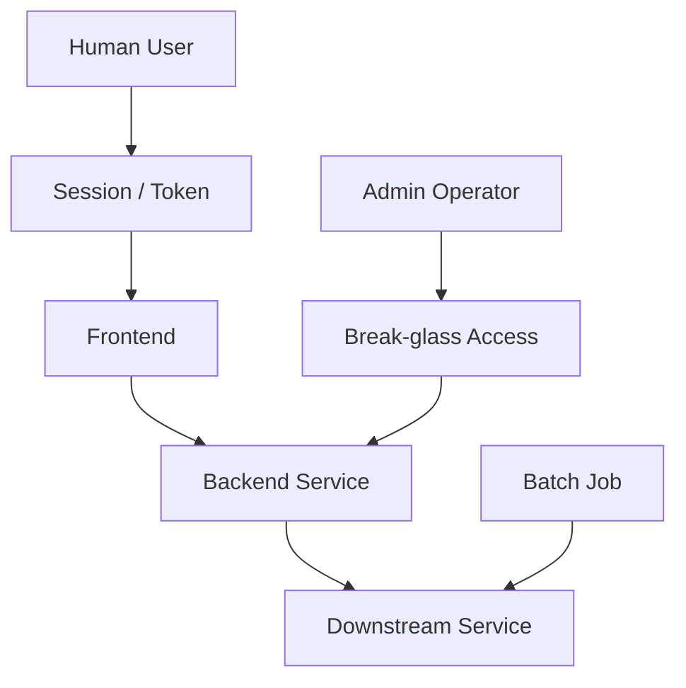
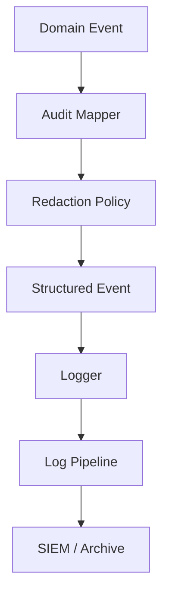
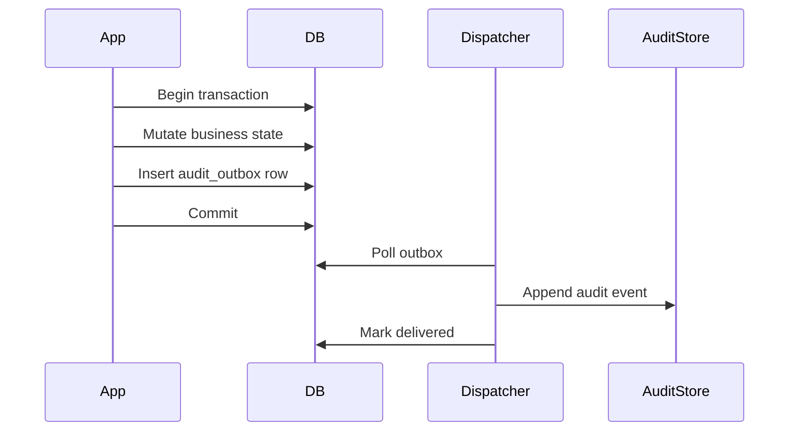
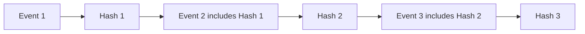
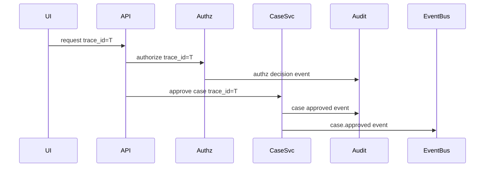
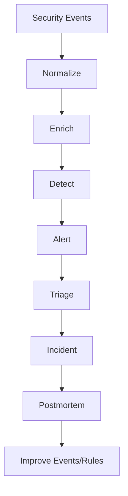
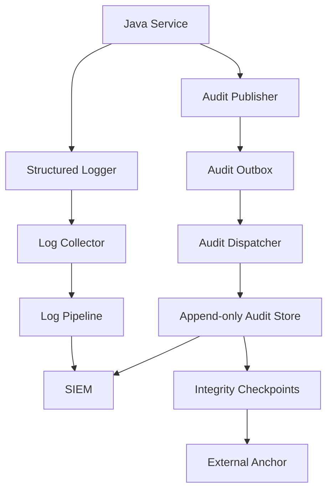

------
title: Learn Java Security, Cryptography, Integrity and Platform Hardening - Part 028
description: Secure logging, audit, dan forensics untuk Java systems: event taxonomy, actor attribution, tamper-evident logs, privacy-safe observability, chain of custody, dan regulatory defensibility.
series: learn-java-security-cryptography-integrity-hardening
seriesTitle: Learn Java Security, Cryptography, Integrity and Platform Hardening
order: 28
partTitle: Secure Logging, Audit and Forensics
tags:
- java
- security
- integrity
- platform-hardening
- logging
- audit
- forensics
- observability
- incident-response
date: 2026-06-28
---

# Part 028 — Secure Logging, Audit and Forensics

Tujuan bagian ini: membangun logging dan audit layer yang bisa dipakai untuk security detection, incident investigation, compliance evidence, dan regulatory defensibility tanpa membocorkan data sensitif.

Pertanyaan inti:

> Jika terjadi insiden, apakah kita bisa membuktikan siapa melakukan apa, terhadap resource mana, dengan decision apa, dari context mana, dan apakah evidence itu dapat dipercaya?

Mental model:

> Logs menceritakan kejadian. Audit trail membuktikan keputusan penting. Forensics menghubungkan evidence lintas sistem. Tamper evidence menjaga agar cerita itu tidak mudah ditulis ulang setelah insiden.

Referensi utama:

- OWASP Logging Cheat Sheet: https://cheatsheetseries.owasp.org/cheatsheets/Logging_Cheat_Sheet.html
- OWASP Top 10 A09 — Security Logging and Monitoring Failures: https://owasp.org/Top10/A09_2021-Security_Logging_and_Monitoring_Failures/
- OWASP ASVS: https://owasp.org/www-project-application-security-verification-standard/
- NIST SP 800-92 — Guide to Computer Security Log Management: https://csrc.nist.gov/publications/detail/sp/800-92/final
- NIST Cybersecurity Framework: https://www.nist.gov/cyberframework
- OpenTelemetry: https://opentelemetry.io/
- SLF4J: https://www.slf4j.org/
- Logback: https://logback.qos.ch/

---

## 1. Posisi Bagian Ini dalam Framework Kaufman

Dalam Kaufman-style skill acquisition, secure logging dipecah menjadi subskill:

| Subskill | Pertanyaan | Output |
|---|---|---|
| Event taxonomy | Event apa yang penting? | Security event catalog |
| Actor attribution | Siapa/apa yang bertindak? | Actor model dan correlation fields |
| Decision logging | Keputusan apa yang dibuat? | Authorization/audit event |
| Data minimization | Data apa yang tidak boleh masuk log? | Redaction/masking policy |
| Integrity | Bagaimana mencegah log dimanipulasi diam-diam? | Append-only / hash chain / signing |
| Correlation | Bagaimana menghubungkan event lintas service? | Trace/correlation/request ID |
| Detection | Event mana yang memicu alert? | Detection rules |
| Forensics | Bagaimana investigasi dilakukan? | Evidence packet dan timeline |
| Retention | Berapa lama evidence disimpan? | Retention and legal policy |

Target kita bukan “menambahkan log”. Targetnya adalah evidence system.

---

## 2. Log, Audit, Trace, Metric: Jangan Dicampur

| Jenis | Tujuan | Contoh |
|---|---|---|
| Application log | Debugging dan operational visibility | service started, retry failed |
| Security log | Deteksi abuse dan anomaly | login failed, token reuse detected |
| Audit log | Bukti aksi/keputusan penting | case approved, role granted |
| Trace | Causal chain request lintas service | trace/span ID |
| Metric | Agregasi numerik | authz_denied_total |
| Forensic evidence | Paket investigasi | signed timeline, artifact digest, raw evidence |

Kesalahan umum:

- menganggap trace sama dengan audit;
- menganggap log debug cukup untuk compliance;
- menyimpan payload sensitif lengkap “untuk jaga-jaga”;
- membuat audit event tetapi tidak immutable;
- tidak mencatat decision reason;
- tidak bisa menghubungkan event antar service.

Invariant:

> Audit trail untuk aksi penting harus didesain sebagai domain evidence, bukan sisa samping dari logger debug.

---

## 3. Event Taxonomy untuk Java Systems

Security-relevant event harus diklasifikasi secara konsisten.

| Kategori | Event contoh |
|---|---|
| Authentication | login success/failure, MFA challenge, credential reset |
| Session/token | token issued, token refreshed, token revoked, replay detected |
| Authorization | access denied, policy decision, privilege escalation attempt |
| Administration | role granted/revoked, config changed, tenant setting changed |
| Data access | sensitive record viewed/exported/downloaded |
| Data mutation | regulatory case approved/reopened/escalated |
| Crypto/key | key rotated, decrypt failed, signature verification failed |
| Supply chain | unsigned artifact rejected, provenance mismatch |
| Runtime/platform | debug port enabled, JMX access, heap dump generated |
| Integration | webhook signature failed, mTLS client mismatch |
| Abuse/anomaly | rate limit triggered, impossible travel, credential stuffing |

Good event names are stable and queryable:

```text
auth.login.failed
authz.decision.denied
audit.case.status_changed
crypto.signature.verification_failed
supply_chain.artifact.rejected
runtime.heap_dump.generated
```

Avoid vague names:

```text
error
failed
bad request
security issue
```

---

## 4. Anatomy of a Security Event

Minimum useful fields:

```json
{
  "event_id": "01J...",
  "event_type": "authz.decision.denied",
  "event_version": 1,
  "occurred_at": "2026-06-28T09:15:30.123Z",
  "service": "case-management-service",
  "environment": "prod",
  "trace_id": "4bf92f...",
  "correlation_id": "corr-...",
  "actor": {
    "type": "user",
    "id": "usr_123",
    "tenant_id": "tenant_a",
    "authn_method": "oidc+mfa"
  },
  "action": "case.approve",
  "resource": {
    "type": "case",
    "id": "case_789",
    "tenant_id": "tenant_a"
  },
  "decision": {
    "outcome": "deny",
    "policy_id": "case-approval-policy",
    "policy_version": "2026-06-01",
    "reason_code": "MISSING_APPROVER_ROLE"
  },
  "network": {
    "client_ip_hash": "sha256:...",
    "user_agent_class": "browser"
  },
  "integrity": {
    "schema_hash": "sha256:..."
  }
}
```

Avoid storing:

- raw password;
- full session token;
- full API key;
- private key;
- raw authorization header;
- unrestricted PII payload;
- full payment/identity documents;
- full JWT if it contains sensitive claims.

---

## 5. Actor Attribution Model

In distributed Java systems, “userId” is not enough.

Model actor as:



Fields to consider:

| Field | Why it matters |
|---|---|
| `actor.type` | human, service, job, admin, support, system |
| `actor.id` | stable subject ID |
| `actor.tenant_id` | tenant isolation evidence |
| `actor.authn_strength` | MFA/session assurance |
| `actor.delegated_by` | impersonation/support flows |
| `actor.service_identity` | workload identity |
| `actor.break_glass` | privileged exception path |
| `actor.on_behalf_of` | delegation chain |

For regulatory systems, support/admin impersonation must be explicit:

```json
{
  "actor": {
    "type": "support_operator",
    "id": "support_17",
    "on_behalf_of": "usr_123",
    "break_glass": true,
    "approval_ticket": "INC-2026-1029"
  }
}
```

Never overwrite real actor with impersonated actor. Preserve both.

---

## 6. Decision Logging: The Most Important Audit Skill

A security audit event is strongest when it records **decision context**, not just outcome.

Weak:

```text
User 123 approved case 789
```

Better:

```json
{
  "event_type": "audit.case.approved",
  "actor_id": "usr_123",
  "resource_id": "case_789",
  "tenant_id": "tenant_a",
  "decision_id": "dec_456",
  "policy_id": "case-approval-policy",
  "policy_version": "2026-06-01",
  "pre_state": "PENDING_REVIEW",
  "post_state": "APPROVED",
  "reason_code": "ALL_REQUIRED_CHECKS_PASSED"
}
```

For enforcement lifecycle systems, audit should record:

- previous state;
- new state;
- decision rule/policy version;
- required approvals;
- evidence IDs reviewed;
- actor role at time of decision;
- tenant/jurisdiction;
- time source;
- correlation ID;
- command/request ID;
- idempotency key.

Invariant:

> If a business decision can affect rights, obligations, enforcement, money, access, or legal position, it deserves a first-class audit event.

---

## 7. Log Injection and Encoding

Logs are also output. Untrusted input can poison log lines.

Example risk:

```java
log.info("Login failed for username={}", username);
```

If `username` contains newline/control characters, downstream log viewer or parser may be confused.

Safer approach:

```java
public final class LogSafe {
    public static String safeText(String input) {
        if (input == null) return null;
        return input
                .replace("\r", "\\r")
                .replace("\n", "\\n")
                .replace("\t", "\\t");
    }
}
```

Better: use structured logging and encode as JSON through a trusted encoder.

Avoid manually concatenating JSON:

```java
log.info("{\"user\": \"" + username + "\"}");
```

Prefer structured arguments supported by your logging stack.

---

## 8. Sensitive Data Redaction

Redaction must happen before data leaves the process boundary.



Redaction strategies:

| Data | Strategy |
|---|---|
| Password | Never log |
| Access token | Never log; at most token ID/hash |
| API key | Last 4 chars only + hash |
| Email | Hash or partial mask depending use case |
| IP address | Hash/truncate depending jurisdiction |
| National ID | Never log raw; use stable pseudonymous reference |
| Case description | Avoid raw; log case ID and classification |
| Exception | Remove secrets from message/stack context |

Example:

```java
public final class SecretRedactor {
    private static final Pattern AUTH_HEADER =
            Pattern.compile("(?i)(authorization\\s*[:=]\\s*bearer\\s+)[a-z0-9._~+/=-]+ ");

    public static String redact(String value) {
        if (value == null) return null;
        return AUTH_HEADER.matcher(value).replaceAll("$1<redacted> ");
    }
}
```

Better than regex-only: design DTOs so secrets are not present in loggable objects.

---

## 9. Java Pattern: Explicit Audit Event Publisher

Do not scatter audit logs across controllers.

```java
public interface AuditPublisher {
    void publish(AuditEvent event);
}

public record AuditEvent(
        String eventId,
        String eventType,
        int eventVersion,
        Instant occurredAt,
        Actor actor,
        ResourceRef resource,
        String action,
        Decision decision,
        Map<String, String> context
) {}

public record Actor(
        String type,
        String id,
        String tenantId,
        String delegatedBy,
        boolean breakGlass
) {}

public record ResourceRef(
        String type,
        String id,
        String tenantId
) {}

public record Decision(
        String outcome,
        String policyId,
        String policyVersion,
        String reasonCode
) {}
```

Usage:

```java
public void approveCase(ApproveCaseCommand command, SecurityContext security) {
    CaseRecord record = caseRepository.getForUpdate(command.caseId());

    AuthorizationDecision decision = authorizer.canApprove(security.actor(), record);
    if (!decision.allowed()) {
        auditPublisher.publish(AuditEvents.caseApprovalDenied(command, security, record, decision));
        throw new AccessDeniedException(decision.reasonCode());
    }

    CaseState previous = record.state();
    record.approve(command.reason());
    caseRepository.save(record);

    auditPublisher.publish(AuditEvents.caseApproved(command, security, record, previous, decision));
}
```

Design rule:

> Audit event should be emitted at the domain decision point, not merely at HTTP boundary.

---

## 10. Transactional Integrity of Audit Events

If business mutation succeeds but audit event fails, system loses evidence. If audit event succeeds but business mutation rolls back, audit lies.

Options:

| Pattern | Pros | Cons |
|---|---|---|
| Same DB transaction | Strong coupling | Audit store may affect domain transaction |
| Outbox pattern | Reliable async delivery | Requires dispatcher and replay |
| Append-only audit DB | Strong evidence model | More operational complexity |
| Event sourcing | Native history | Large architecture decision |

Recommended for many Java services: transactional outbox.



Invariant:

> The audit event describing a committed security-relevant mutation must be durably recorded in the same transactional boundary or through a reliable outbox.

---

## 11. Tamper-Evident Logging

Normal logs are editable by privileged operators. Tamper-evident design makes modification detectable.

Common mechanisms:

| Mechanism | Idea |
|---|---|
| Append-only storage | Prevent overwrite/delete through storage policy |
| Hash chain | Each event hash includes previous hash |
| Merkle tree | Batch commitment root proves inclusion |
| Digital signature | Sign event/batch/root |
| External timestamp | Anchor time outside application |
| WORM storage | Write once read many retention |
| Cross-system replication | Attacker must compromise multiple boundaries |

Simple hash chain:



Event hash:

```text
current_hash = SHA-256(canonical_event_json || previous_hash)
```

Security caveat:

- If attacker can rewrite all events and final anchor, hash chain is insufficient.
- Anchor roots externally: separate account, separate system, timestamp service, or signed checkpoint.

---

## 12. Canonical Audit Event Bytes

Signing or hashing JSON requires canonicalization. Different field order/spacing creates different bytes.

Options:

- canonical JSON library;
- deterministic protobuf serialization;
- stable field ordering;
- explicit event schema version;
- avoid unordered maps in signed payload;
- include schema hash.

Pseudo-code:

```java
public final class AuditIntegrity {
    public byte[] canonicalize(AuditEvent event) {
        // Use deterministic serialization in real systems.
        // Do not rely on arbitrary ObjectMapper defaults without testing.
        return canonicalJsonWriter.write(event);
    }

    public byte[] hash(byte[] canonicalBytes, byte[] previousHash) {
        MessageDigest digest = MessageDigest.getInstance("SHA-256");
        digest.update(previousHash);
        digest.update(canonicalBytes);
        return digest.digest();
    }
}
```

Test canonicalization across JVM versions, library versions, and field ordering changes.

---

## 13. Time, Clock, and Ordering

Forensics depends on time, but clocks lie.

Record:

| Field | Purpose |
|---|---|
| `occurred_at` | Application event time |
| `observed_at` | Log pipeline receive time |
| `persisted_at` | Audit store commit time |
| `sequence_number` | Per-stream ordering |
| `trace_id` | Request correlation |
| `previous_hash` | Integrity ordering |
| `time_source` | Clock trust context |

Never rely only on wall-clock for ordering. Use monotonic sequence per audit stream where possible.

For distributed systems:

- expect clock skew;
- preserve causal IDs;
- record upstream event ID;
- avoid overwriting original timestamp;
- use receive timestamp at each boundary.

---

## 14. Correlation Across Services

A single action may produce many events.



Required fields:

- `trace_id` for technical path;
- `correlation_id` for business request;
- `command_id` for domain command;
- `idempotency_key` for duplicate protection;
- `causation_id` for event chains;
- `actor_session_id` or token ID/hash;
- `deployment_id` and artifact digest.

Add release context:

```json
{
  "runtime": {
    "artifact_digest": "sha256:...",
    "image_digest": "sha256:...",
    "git_commit": "8c0f...",
    "deployment_id": "deploy_20260628_01"
  }
}
```

This connects Part 027 artifact integrity with Part 028 forensic evidence.

---

## 15. Logging Authorization Decisions

Authorization failures are high-value security signals.

Log denied decision:

```json
{
  "event_type": "authz.decision.denied",
  "actor_id": "usr_123",
  "action": "case.view",
  "resource_type": "case",
  "resource_id": "case_789",
  "actor_tenant_id": "tenant_a",
  "resource_tenant_id": "tenant_b",
  "policy_id": "tenant-isolation-policy",
  "policy_version": "2026-06-01",
  "reason_code": "TENANT_MISMATCH"
}
```

Detection rule examples:

- same actor denied across many tenants;
- service account denied on unusual resource type;
- sudden spike in denied admin actions;
- tenant mismatch from internal service;
- policy version unknown in production;
- break-glass access without approval ticket.

---

## 16. Logging Crypto and Integrity Events

Crypto failures must be logged carefully: enough to investigate, not enough to leak secret material.

Events:

| Event | Log details |
|---|---|
| Signature verification failed | key ID, algorithm, payload type, reason, digest |
| Decryption failed | key ID, envelope version, reason class, not plaintext |
| Key rotation | old key ID, new key ID, actor/service, scope |
| Certificate expiry warning | cert fingerprint, subject, service, days remaining |
| mTLS client mismatch | expected identity, presented fingerprint, SAN summary |
| Nonce reuse detected | key ID, nonce hash, payload type |
| Artifact signature rejected | digest, signer identity, policy reason |

Never log:

- private key;
- plaintext secret;
- raw encrypted secret if unnecessary;
- full token;
- password hash if not needed;
- complete decrypted payload.

---

## 17. Forensic Readiness

Forensic readiness means designing before incident day.

A forensic-ready Java system can answer:

- What artifact version was running at time T?
- Which actor initiated action X?
- Which authorization policy allowed/denied it?
- Which data records were accessed/exported?
- Were logs modified after the event?
- Which admin/support actions happened around the event?
- Which keys/certificates were active?
- Which deployment introduced behavior change?
- Which external calls were made?
- Which evidence is admissible/defensible internally or legally?

Forensic evidence packet for incident:

```text
incident_id
scope definition
relevant audit events
log integrity proof
artifact digest and signature evidence
deployment timeline
authentication/session timeline
authorization decisions
admin/break-glass events
key/certificate state
network/integration events
chain-of-custody record
analyst notes and query hashes
```

---

## 18. Chain of Custody

Chain of custody records who accessed, exported, transformed, or transferred evidence.

Example:

```json
{
  "evidence_id": "ev_20260628_001",
  "source": "prod-audit-store",
  "query_hash": "sha256:...",
  "exported_by": "sec_analyst_7",
  "exported_at": "2026-06-28T10:03:00Z",
  "purpose": "INC-2026-1029 investigation",
  "destination": "forensic-vault",
  "digest": "sha256:...",
  "signature": "..."
}
```

Do not let analysts copy CSV files into local laptops without evidence tracking for serious incidents.

---

## 19. Detection Engineering Basics

Logging is not useful if nobody looks.

Detection pipeline:



Good alerts:

- have clear owner;
- include severity and reason;
- link to runbook;
- include enough context to triage;
- suppress duplicates;
- avoid leaking sensitive data;
- are tested with simulated events.

Example rule:

```yaml
rule: cross_tenant_access_denied_spike
window: 10m
condition:
  event_type: authz.decision.denied
  reason_code: TENANT_MISMATCH
  group_by: actor.id
  threshold: 5
severity: high
runbook: RB-AUTHZ-004
```

---

## 20. Secure Logging Architecture

Recommended architecture:



Separate application logs and audit store when needed. Application logs may be high-volume and short-retention. Audit logs may be lower-volume, structured, longer-retention, and immutable.

---

## 21. Production Controls

| Control | Why |
|---|---|
| Centralized log collection | Local logs disappear with containers |
| Append-only audit storage | Resist post-incident editing |
| Least privilege log access | Logs contain sensitive metadata |
| Field-level redaction | Prevent secret leakage |
| Schema validation | Keep event quality stable |
| Event versioning | Allow evolution without breaking detection |
| Time sync monitoring | Preserve timeline integrity |
| Retention policy | Balance compliance/privacy/cost |
| Integrity checkpoints | Detect tampering |
| Access audit for logs | Detect insider abuse |

Log platform itself is high-value infrastructure. Treat SIEM/audit store as security-critical.

---

## 22. Testing Secure Logging

Security logs need tests.

### 22.1 Unit Test Audit Event Emission

```java
@Test
void approvalDeniedEmitsAuditEvent() {
    AuditPublisherSpy audit = new AuditPublisherSpy();
    CaseService service = new CaseService(repository, authorizerDenying(), audit);

    assertThrows(AccessDeniedException.class,
            () -> service.approveCase(command, securityContext));

    AuditEvent event = audit.singleEvent();
    assertEquals("authz.decision.denied", event.eventType());
    assertEquals("deny", event.decision().outcome());
    assertEquals("MISSING_APPROVER_ROLE", event.decision().reasonCode());
}
```

### 22.2 Secret Leakage Test

```java
@Test
void logsDoNotContainAuthorizationHeader() {
    String renderedLog = renderLogForRequest("Authorization: Bearer abc.def.secret");

    assertFalse(renderedLog.contains("abc.def.secret"));
    assertTrue(renderedLog.contains("<redacted>"));
}
```

### 22.3 Integrity Chain Test

- append 100 audit events;
- verify chain;
- modify event 37;
- verify chain fails;
- delete event 52;
- verify chain fails;
- reorder events;
- verify chain fails.

---

## 23. Common Anti-Patterns

### 23.1 Logging Everything

“Log everything” creates cost, privacy, and breach risk. Log what is needed for operations, security, audit, and forensics.

### 23.2 Logging Nothing on Deny

Authorization deny events are often more important than allow events for detecting abuse.

### 23.3 Stack Trace with Secrets

Exception messages often contain URLs, headers, payloads, or SQL fragments. Redact before logging.

### 23.4 Audit Event After Response Only

If service crashes after mutation but before audit log, evidence is lost. Use transaction/outbox.

### 23.5 Mutable Audit Tables

If admin can update/delete audit rows without separate evidence, audit trail is weak.

### 23.6 Ambiguous Actor

`updatedBy = system` is useless if it hides real initiator. Preserve delegation chain.

### 23.7 No Policy Version

Without policy version, you cannot explain why a decision was made at that time.

---

## 24. Review Checklist

Use this checklist before production:

- Is there a security event taxonomy?
- Are authentication, authorization, admin, data export, crypto, and supply-chain events logged?
- Are audit events emitted at domain decision points?
- Are actor, resource, action, decision, policy version, and correlation fields present?
- Are secrets excluded by design, not only regex?
- Are logs structured and parser-safe?
- Is log injection mitigated?
- Are audit events transactionally reliable?
- Is audit storage append-only or tamper-evident?
- Are integrity checkpoints anchored outside the app boundary?
- Are access to logs and exports audited?
- Are detection rules tested?
- Is retention policy documented?
- Can incident response reconstruct artifact/runtime context?

---

## 25. Hands-on Lab

### Lab 1 — Build Security Event Catalog

Create a catalog with at least 30 events for your Java service:

- event name;
- category;
- severity;
- required fields;
- sensitive fields prohibited;
- alert rule yes/no;
- retention class.

### Lab 2 — Implement Audit Outbox

Implement:

- domain mutation;
- audit outbox insert in same transaction;
- dispatcher;
- append-only audit table/store;
- retry and idempotency.

### Lab 3 — Tamper-Evident Hash Chain

Implement:

- canonical JSON event;
- previous hash;
- current hash;
- verification job;
- external root checkpoint file.

Then simulate:

- modified event;
- deleted event;
- reordered event;
- changed timestamp.

### Lab 4 — Secret Leakage Test Suite

Create tests proving logs do not contain:

- password;
- access token;
- refresh token;
- API key;
- private key;
- raw authorization header;
- sensitive document content.

---

## 26. Decision Record Template

```md
# ADR: Secure Logging and Audit Design for <Service>

## Context
<Why logging/audit is security-critical for this service.>

## Event Taxonomy
<List categories and critical events.>

## Audit Boundary
<Which actions require first-class audit events.>

## Actor Model
<How user, service, admin, delegation, and break-glass are represented.>

## Sensitive Data Policy
<Fields never logged, masked, hashed, or allowed.>

## Integrity Model
<Append-only, hash chain, Merkle root, signature, external anchor.>

## Storage and Retention
<Where logs/audit events live and for how long.>

## Detection Rules
<Security alerts derived from events.>

## Forensic Procedure
<How evidence is exported, hashed, signed, and tracked.>

## Failure Behavior
<What happens if audit write fails.>
```

---

## 27. Summary

Secure logging is not about verbosity. It is about trustworthy evidence.

Key takeaways:

- Separate app logs, security logs, audit logs, traces, and metrics.
- Record actor, action, resource, decision, policy version, and correlation context.
- Log deny decisions and privileged changes.
- Prevent secrets from entering logs by design.
- Use structured logging and avoid log injection.
- Make important audit events transactionally reliable.
- Add tamper evidence for high-value audit trails.
- Preserve artifact/runtime identity for forensic reconstruction.
- Test logs the same way you test business behavior.

The top 1% engineering move:

> Build a system where production decisions can be reconstructed, verified, and defended without trusting memory, screenshots, or mutable log files.

---

## 28. What Comes Next

Part 029 moves into security testing strategy:

- unit-level security assertions;
- authorization mutation tests;
- property-based tests;
- fuzzing;
- SAST/DAST/IAST/SCA;
- exploit regression tests;
- security test gates in Java CI/CD.
