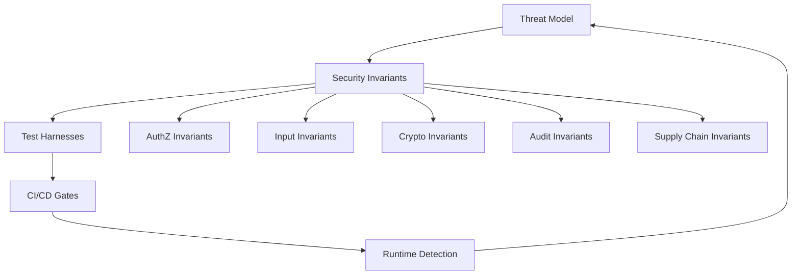
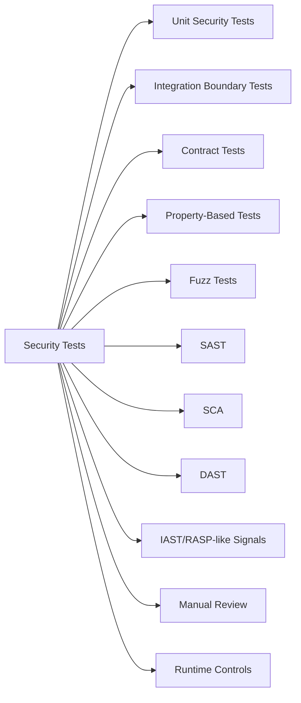
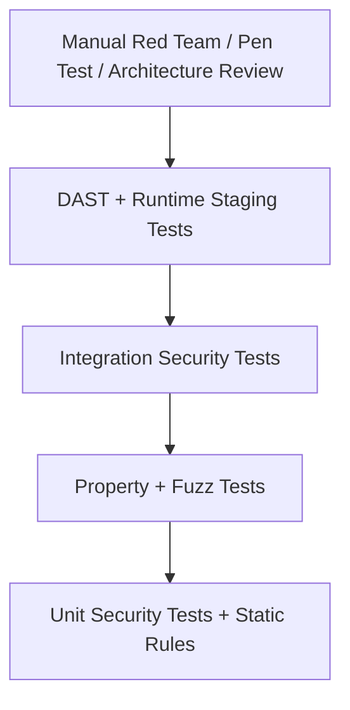
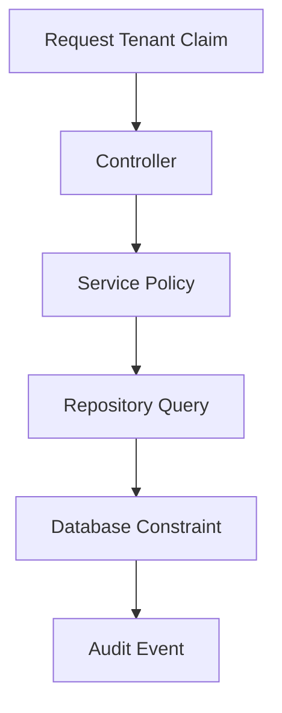
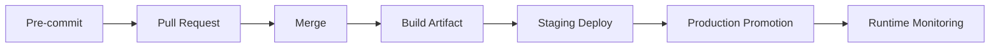

------
title: Learn Java Security, Cryptography, Integrity and Platform Hardening - Part 029
description: Security testing strategy for advanced Java systems: verification mindset, test taxonomy, authorization and trust-boundary tests, SAST/SCA/DAST/IAST, fuzzing, regression, and CI/CD security gates.
series: learn-java-security-cryptography-integrity-hardening
seriesTitle: Learn Java Security, Cryptography, Integrity and Platform Hardening
order: 29
partTitle: Security Testing Strategy
tags:
- java
- security
- testing
- owasp
- sast
- dast
- sca
- fuzzing
- series
date: 2026-06-28
---

# Part 029 — Security Testing Strategy

Security testing is not “run a scanner before release.”

For high-grade Java systems, security testing is a **verification system**. Its job is to prove that security invariants hold under realistic failure, malicious input, concurrency, drift, and dependency change.

A top engineer does not ask only:

> “Do we have security tests?”

They ask:

> “Which attacker capability does this test constrain, which invariant does it prove, and which production failure would escape it?”

This part builds that model.

References used for the testing philosophy in this part include OWASP ASVS, OWASP Web Security Testing Guide, OWASP Testing Guide practices, Jazzer JVM fuzzing, and Project Wycheproof for crypto test vectors.

---

## 1. Kaufman Skill Decomposition

From *The First 20 Hours* perspective, “security testing” is too broad to practice directly. We decompose it into subskills that give fast feedback.

| Subskill | What You Must Be Able To Do |
|---|---|
| Security invariant design | State what must always be true, regardless of request shape, user role, race, or system state. |
| Abuse-case generation | Convert a normal user story into attacker stories. |
| Boundary test design | Test trust transitions: HTTP → DTO, DTO → domain, domain → persistence, service → external system. |
| Authorization regression | Prove object-level and tenant-level access cannot regress silently. |
| Input parser testing | Attack parser assumptions, canonicalization, Unicode, resource limits, and type confusion. |
| Scanner interpretation | Treat SAST/SCA/DAST output as evidence, not truth. |
| Fuzz harness design | Build small fuzz targets around parsers, decoders, validators, and policy engines. |
| CI gate design | Decide which tests block merge, release, deploy, or runtime promotion. |
| Evidence packaging | Preserve enough test, scan, and review evidence for audit and incident response. |

Your 20-hour practice target is not to master all tools. It is to build a repeatable loop:

```text
threat model → invariant → test harness → failing exploit case → fix → regression gate
```

---

## 2. Security Testing Is Different From Functional Testing

Functional tests usually prove expected behavior works.

Security tests must also prove **forbidden behavior stays impossible**.

Functional test:

```text
A case owner can update a case note.
```

Security test:

```text
A case owner cannot update a note in another tenant even if:
- the note ID is valid,
- the user owns another case,
- the endpoint accepts the DTO,
- the object is fetched from cache,
- the request uses a stale session,
- the caller sends a forged tenant ID,
- the case is in an unusual lifecycle state.
```

The difference is not syntax. It is mindset.

Functional tests usually test the happy path.
Security tests test the **security boundary under adversarial composition**.

---

## 3. The Core Mental Model

Security testing should be organized around four layers:



A test without an invariant becomes noise.
An invariant without a test becomes hope.
A test without a gate becomes optional.
A gate without runtime detection becomes blind to drift.

---

## 4. Define Invariants Before Tools

A scanner cannot tell you your business-specific invariant.

It can warn about patterns like SQL injection, weak crypto, or vulnerable dependencies. But it cannot fully understand:

```text
Only the assigned enforcement unit may approve a sanction recommendation
after all mandatory evidentiary checks are complete.
```

That invariant is domain-specific.

For regulatory or case-management platforms, strong invariants often look like this:

| Invariant Type | Example |
|---|---|
| Tenant isolation | A user from tenant A must never read, infer, update, export, or search tenant B data. |
| Object-level authorization | Access is based on the protected object, not just endpoint role. |
| Workflow integrity | State transitions require valid actor, role, precondition, and evidence. |
| Evidence immutability | Finalized evidence cannot be modified without a new auditable version. |
| Audit completeness | Every security-sensitive decision emits an audit event with actor, target, decision, reason, and correlation ID. |
| Token validity | Expired, revoked, malformed, replayed, wrong-audience, wrong-issuer tokens are rejected. |
| Crypto integrity | Tampered ciphertext, signatures, MACs, or key IDs fail closed. |
| Supply-chain integrity | Build artifacts are traceable to source revision and verified dependency set. |

Write invariants in the language of failure:

```text
It must be impossible for <actor> to <forbidden action> on <asset>
when <condition>, even if <attacker-controlled input>.
```

Example:

```text
It must be impossible for a reviewer to approve their own enforcement decision,
even if they call the approval endpoint directly with a valid JWT and forged assigneeId.
```

That sentence becomes a test design seed.

---

## 5. Test Taxonomy For Java Security

A mature Java security test strategy has multiple test families.



No single family is enough.

| Test Family | Catches Well | Misses Often |
|---|---|---|
| Unit security tests | Policy logic, validators, crypto envelope parsing, permission matrix. | Framework config, integration drift, real network behavior. |
| Integration tests | Filter chains, DB constraints, transaction boundaries, service interaction. | Huge input search spaces. |
| Contract tests | Service-to-service auth assumptions, event schema security, API gateway expectations. | Internal implementation vulnerabilities. |
| Property-based tests | Invariant violations across many generated inputs. | Specific exploit payloads without generators. |
| Fuzz tests | Parser bugs, crashers, timeout/resource exhaustion, edge encoding. | Business authorization unless harnessed intentionally. |
| SAST | Dangerous APIs, injection patterns, insecure crypto usage. | Business logic, false positives, framework-specific context. |
| SCA | Known vulnerable dependencies, license/policy issues. | Unknown vulnerabilities, shaded/relocated code, reachable exploitability. |
| DAST | Runtime web/API exposure, auth/session/config issues. | Internal code paths, hidden state machines, low coverage. |
| Manual review | Architecture flaws, trust boundary mistakes, abuse cases. | Exhaustiveness, regression persistence. |
| Runtime detection | Real attacks, drift, impossible transitions. | Pre-release prevention. |

Top engineers combine them intentionally.

---

## 6. The Security Test Pyramid

A useful security pyramid for Java systems:



The base should be cheap, fast, and deterministic.
The top should be deeper, slower, and more realistic.

A common anti-pattern is an inverted pyramid:

```text
little invariant testing + lots of scanner output + annual pen test
```

That creates theatre, not security.

---

## 7. Security Unit Tests

Security unit tests target small, explicit decision functions.

Good security unit targets:

- authorization policy engines
- tenant scoping utilities
- token validators
- signature verifiers
- canonicalization logic
- safe path resolvers
- redaction/masking utilities
- state transition guards
- rate-limit key derivation
- audit event builders

Poor unit targets:

- a whole controller with framework magic
- a giant service with database, clock, network, and auth mixed together
- tests that only assert HTTP 200 on happy path

### 7.1 Authorization Unit Test Example

```java
class CaseAuthorizationPolicyTest {

    private final CaseAuthorizationPolicy policy = new CaseAuthorizationPolicy();

    @Test
    void investigatorCannotReadCaseFromOtherTenant() {
        Actor actor = Actor.user("u-123")
                .tenant("tenant-a")
                .role("INVESTIGATOR")
                .build();

        EnforcementCase target = EnforcementCase.builder()
                .id("case-999")
                .tenantId("tenant-b")
                .assignedInvestigatorId("u-123")
                .build();

        Decision decision = policy.canReadCase(actor, target);

        assertThat(decision.allowed()).isFalse();
        assertThat(decision.reason()).isEqualTo("TENANT_MISMATCH");
    }
}
```

Notice the test asserts the reason.

Why?

Because “deny” is not enough. A deny caused by accidental null input can hide a broken policy branch. Security decisions should be explainable enough to audit and debug.

### 7.2 Parameterized Matrix Tests

Authorization failures often hide in role/action/state matrices.

```java
@ParameterizedTest
@CsvSource({
        "INVESTIGATOR, DRAFT, SUBMIT, true",
        "INVESTIGATOR, SUBMITTED, APPROVE, false",
        "SUPERVISOR, SUBMITTED, APPROVE, true",
        "SUPERVISOR, APPROVED, APPROVE, false",
        "AUDITOR, SUBMITTED, APPROVE, false"
})
void transitionPermissionMatrix(
        String role,
        String state,
        String action,
        boolean expectedAllowed
) {
    Actor actor = Actor.user("u-1").tenant("t-1").role(role).build();
    CaseState current = CaseState.valueOf(state);
    CaseAction requested = CaseAction.valueOf(action);

    Decision decision = policy.canTransition(actor, current, requested);

    assertThat(decision.allowed()).isEqualTo(expectedAllowed);
}
```

Matrix tests are simple, but they force you to make authorization explicit.

---

## 8. Object-Level Authorization Tests

Endpoint-level role checks are not enough.

Bad test:

```java
mockMvc.perform(get("/cases/case-123")
        .with(jwt().authorities(new SimpleGrantedAuthority("ROLE_INVESTIGATOR"))))
        .andExpect(status().isOk());
```

This proves only that a role can call an endpoint.
It does not prove the actor can access that object.

Better test:

```java
@Test
void userCannotFetchCaseFromDifferentTenantEvenWithValidRole() throws Exception {
    given(caseRepository.findById("case-b")).willReturn(Optional.of(
            EnforcementCase.builder()
                    .id("case-b")
                    .tenantId("tenant-b")
                    .build()
    ));

    mockMvc.perform(get("/cases/case-b")
            .with(jwt().jwt(jwt -> jwt
                    .claim("sub", "user-a")
                    .claim("tenant", "tenant-a"))
                    .authorities(new SimpleGrantedAuthority("ROLE_INVESTIGATOR"))))
            .andExpect(status().isForbidden());
}
```

Best test also checks repository query shape:

```java
verify(caseRepository).findByIdAndTenantId("case-b", "tenant-a");
verify(caseRepository, never()).findById("case-b");
```

This catches “fetch then check” mistakes where data can leak through timing, cache, logs, or exception messages.

---

## 9. Tenant Isolation Testing

Tenant isolation should be tested at multiple levels.



Test each layer:

| Layer | Test |
|---|---|
| API | Forged tenant ID in path/body/query/header is ignored or denied. |
| Service | Actor tenant is required for every protected operation. |
| Repository | Query includes tenant predicate or row-level policy. |
| DB | Unique constraints include tenant where appropriate. |
| Cache | Cache keys include tenant/security context where needed. |
| Search | Search index queries are tenant-scoped. |
| Audit | Cross-tenant deny emits a security event. |

A serious test suite includes “tenant B object ID known by tenant A” cases.

Attackers often know valid IDs through logs, browser history, URLs, exports, or predictable references.

---

## 10. Negative Testing

Security lives in negative tests.

For each sensitive endpoint, test at least:

- no authentication
- malformed token
- expired token
- valid token with wrong audience
- valid token with wrong issuer
- valid token with insufficient role
- valid role with wrong tenant
- valid role and tenant but wrong object relationship
- stale version/state
- replayed idempotency key
- forged actor ID in request body
- oversized body
- unexpected content type
- duplicate parameters
- unknown enum value
- Unicode confusable input
- path traversal input
- valid-looking but unauthorized resource ID

A compact table-driven approach is often better than dozens of one-off tests.

---

## 11. Property-Based Security Tests

Property-based tests generate many inputs and assert invariants.

This is powerful for security because attackers explore input space better than humans.

Example property:

```text
For any user U, tenant T1, tenant T2, and case C belonging to T2,
if T1 != T2, then U from T1 cannot read C.
```

With jqwik:

```java
@Property
void tenantMismatchAlwaysDenies(
        @ForAll("tenantIds") String actorTenant,
        @ForAll("tenantIds") String caseTenant,
        @ForAll("userIds") String userId
) {
    Assume.that(!actorTenant.equals(caseTenant));

    Actor actor = Actor.user(userId).tenant(actorTenant).role("INVESTIGATOR").build();
    EnforcementCase target = EnforcementCase.builder()
            .id("case-1")
            .tenantId(caseTenant)
            .assignedInvestigatorId(userId)
            .build();

    Decision decision = policy.canReadCase(actor, target);

    Assertions.assertThat(decision.allowed()).isFalse();
}
```

Good security properties:

| Property | Meaning |
|---|---|
| Deny by default | Unknown roles/actions/states must deny. |
| Tenant monotonicity | Adding request parameters must not expand tenant access. |
| Role monotonicity | Lower privilege role must not gain higher privilege action. |
| Canonicalization stability | Equivalent encoded paths normalize to same safe representation. |
| Redaction completeness | Sensitive fields never appear in serialized log output. |
| Signature tamper rejection | Any byte modification invalidates verification. |
| Token expiry | Any time after expiry rejects token. |

Property tests are not a replacement for example tests. They are a multiplier.

---

## 12. Fuzz Testing For Java

Fuzzing feeds generated or mutated inputs into a target and observes crashes, hangs, memory blowups, assertion failures, or sanitizer findings.

For Java systems, excellent fuzz targets include:

- URL/path canonicalizers
- file upload metadata parsers
- JSON/XML/YAML parsers
- expression/query/filter parsers
- custom DSL interpreters
- authorization policy expression engines
- token decoders
- signature envelope parsers
- webhook payload validators
- CSV/import parsers
- compression/decompression code

Jazzer is a coverage-guided, in-process fuzzer for the JVM.

### 12.1 Fuzz Harness Example

```java
import com.code_intelligence.jazzer.api.FuzzedDataProvider;

public final class SafePathResolverFuzzTest {

    public static void fuzzerTestOneInput(FuzzedDataProvider data) {
        String base = "/srv/app/uploads";
        String rawPath = data.consumeRemainingAsString();

        try {
            Path resolved = SafePathResolver.resolveUnderBase(base, rawPath);

            if (!resolved.normalize().startsWith(Path.of(base).normalize())) {
                throw new AssertionError("Resolved path escaped base directory: " + resolved);
            }
        } catch (InvalidPathException | SecurityException expected) {
            // Rejecting malicious or malformed input is acceptable.
        }
    }
}
```

The point is not to assert every exact output.
The point is to assert the invariant:

```text
Resolved path never escapes base directory.
```

### 12.2 Fuzzing Anti-Patterns

| Anti-Pattern | Why It Fails |
|---|---|
| Fuzzing the whole application | Too slow and noisy. |
| Catching all exceptions | Hides real bugs. |
| No assertions | Finds only crashes, not invariant violations. |
| No corpus retention | Losing regression cases. |
| Fuzzing without resource limits | Hangs CI and gets disabled. |
| Treating fuzz as one-time task | Security regressions return. |

Fuzz targets should be small, deterministic, and isolated.

---

## 13. SAST: Static Application Security Testing

SAST scans code without running it.

It is good at finding patterns like:

- dangerous deserialization APIs
- command execution with user input
- path traversal sinks
- SQL injection sinks
- weak crypto algorithms
- insecure random usage
- hardcoded secrets
- unsafe XML parser configuration
- logging of sensitive values
- missing authorization annotations in known patterns

But SAST has structural limits.

It often cannot understand:

- business authorization rules
- tenant ownership relationships
- lifecycle state preconditions
- runtime framework configuration
- generated code semantics
- false-positive context
- whether vulnerable dependency code is reachable

Use SAST as a **review amplifier**, not a substitute for engineering judgment.

### 13.1 SAST Triage Model

Every finding should be classified:

```text
finding → source → sink → exploitability → impacted asset → control gap → decision
```

Possible decisions:

| Decision | Meaning |
|---|---|
| Fix now | Real issue, unacceptable risk. |
| Fix with deadline | Real issue, bounded risk, tracked. |
| Compensating control | Risk controlled elsewhere; document clearly. |
| False positive | Tool misunderstood code; suppress with evidence. |
| Won't fix | Explicit accepted risk with owner and expiry. |

Suppressions without evidence become security debt.

---

## 14. SCA: Software Composition Analysis

SCA detects vulnerable or policy-violating dependencies.

For Java, SCA must reason about:

- Maven/Gradle dependency graph
- transitive dependencies
- plugins and annotation processors
- test vs runtime scope
- shaded/relocated dependencies
- container image packages
- JDK version vulnerabilities
- reachable vulnerable code paths
- license and provenance policies

### 14.1 Vulnerability Triage

Do not treat CVSS as the only priority.

A better triage model:

```text
severity × exploit maturity × exposure × reachability × compensating controls × upgrade cost
```

Example:

| Factor | Question |
|---|---|
| Severity | What is the vulnerability class and impact? |
| Exploit maturity | Is exploit code public? Is exploitation active? |
| Exposure | Is the affected path internet-facing, internal, batch, or unused? |
| Reachability | Is the vulnerable method reachable from attacker-controlled input? |
| Privilege | What privileges does the process have? |
| Data | What sensitive data is accessible? |
| Upgrade risk | Is upgrade safe or does it require migration? |

A low-CVSS issue in a highly exposed parser may matter more than a high-CVSS issue in unreachable test code.

---

## 15. DAST: Dynamic Application Security Testing

DAST scans a running application.

It is useful for:

- HTTP security headers
- cookie attributes
- authentication/session issues
- common injection behavior
- reflected/stored XSS patterns
- misconfigured endpoints
- access-control smoke tests
- TLS exposure
- error disclosure

But DAST sees only what it can reach.

If your app requires complex workflows, DAST must be given:

- authenticated sessions
- role-specific users
- seeded data
- workflow navigation scripts
- API schema/OpenAPI
- safe test environment
- rate-limit-aware configuration

Without this, DAST mostly tests the login page and public endpoints.

---

## 16. IAST And Runtime Security Signals

IAST instruments the application while tests run.

It can connect runtime behavior to code-level sinks:

- user input reached SQL sink
- tainted data reached command execution
- weak crypto was used at runtime
- sensitive data reached logs
- unsafe deserialization path executed

IAST is useful when integration test coverage is strong.

Weak test coverage means weak IAST coverage.

Runtime security signals also include:

- denied authorization attempts
- impossible state transitions
- tenant mismatch attempts
- repeated token failures
- deserialization filter rejections
- signature/MAC failures
- unexpected outbound network attempts
- debug/JMX/actuator exposure alerts

Runtime detection does not replace tests. It catches drift and attacks tests did not predict.

---

## 17. Contract Security Tests

Distributed Java systems fail when security assumptions differ between services.

Examples:

| Producer Assumption | Consumer Assumption | Failure |
|---|---|---|
| Gateway validates JWT | Service validates JWT again | Safe if both validate. |
| Gateway validates JWT | Service trusts all internal traffic | Dangerous if internal route bypassed. |
| Event contains safe actor ID | Consumer treats actor ID as authoritative | Forged event can impersonate actor. |
| Producer signs webhook | Consumer ignores signature failure | Integrity bypass. |
| Service includes tenant ID | Consumer does not enforce tenant | Cross-tenant leak. |

Contract tests should assert security-relevant fields and validation behavior.

Example:

```java
@Test
void consumerRejectsUnsignedCaseEvent() {
    CaseEvent event = new CaseEvent("case-1", "tenant-a", "APPROVED");
    SignedEnvelope unsigned = SignedEnvelope.unsigned(event);

    assertThatThrownBy(() -> consumer.handle(unsigned))
            .isInstanceOf(SignatureVerificationException.class);
}
```

---

## 18. API Security Regression Pack

Every sensitive API should have a regression pack.

Minimum structure:

```text
/api/cases/{id}
  authentication
    - no token
    - malformed token
    - expired token
    - wrong issuer
    - wrong audience
  authorization
    - wrong role
    - wrong tenant
    - wrong object relationship
    - lifecycle state disallows action
  input
    - invalid id shape
    - duplicate query parameter
    - unsupported content type
    - oversized payload
  output
    - no sensitive fields
    - error response does not disclose internals
  audit
    - allowed action emits success event
    - denied action emits denied event
```

This can be generated from API inventory plus threat model metadata.

---

## 19. Security Testing For State Machines

State machines are security-critical.

A workflow transition is usually an authorization, integrity, and audit decision.

Example transition:

```text
DRAFT → SUBMITTED → REVIEWED → APPROVED → FINALIZED
```

Security tests should cover:

- illegal transition rejected
- stale version rejected
- actor role required
- actor cannot approve own submission
- tenant mismatch rejected
- required evidence exists
- required review exists
- idempotent retry safe
- duplicate approval impossible
- audit event emitted
- state transition atomic
- concurrent transitions do not bypass guard

### 19.1 Concurrent Transition Test

```java
@Test
void onlyOneConcurrentApprovalCanWin() throws Exception {
    String caseId = seedSubmittedCase();

    ExecutorService pool = Executors.newFixedThreadPool(2);
    CountDownLatch start = new CountDownLatch(1);

    Callable<Result> approve = () -> {
        start.await();
        return caseService.approve(caseId, supervisorActor());
    };

    Future<Result> a = pool.submit(approve);
    Future<Result> b = pool.submit(approve);

    start.countDown();

    List<Result> results = List.of(a.get(), b.get());

    assertThat(results.stream().filter(Result::success)).hasSize(1);
    assertThat(results.stream().filter(Result::conflict)).hasSize(1);
}
```

Security is not only about external attackers. Race conditions can violate integrity.

---

## 20. Test Data For Security

Security tests need adversarial fixtures.

Create fixture sets for:

| Fixture Type | Examples |
|---|---|
| Users | anonymous, disabled, expired, low privilege, high privilege, cross-tenant. |
| Tokens | malformed, expired, future `nbf`, wrong audience, wrong issuer, missing claim, duplicated claim. |
| Resources | same tenant, other tenant, deleted, archived, finalized, locked, hidden, assigned to someone else. |
| Inputs | Unicode, control characters, path traversal, null bytes, overlong strings, invalid enum, duplicate keys. |
| Crypto | wrong key ID, tampered ciphertext, bad tag, reused nonce, expired cert, wrong trust anchor. |
| Dependencies | vulnerable version, patched version, policy-violating license, checksum mismatch. |

Do not rely only on random data.
Curated malicious examples are high value.

---

## 21. Mutation Testing For Authorization

Mutation testing changes code and checks if tests fail.

For security, mutation testing is valuable when focused on policy logic.

Example mutations:

- change `&&` to `||`
- remove tenant predicate
- invert role check
- remove state precondition
- allow unknown role
- skip ownership check
- skip audit event
- ignore signature verification result

If tests still pass, the security test suite is weak.

You do not need mutation testing everywhere. Use it where policy bugs are catastrophic.

---

## 22. Security CI/CD Gates

Security checks should run at different stages.



| Stage | Recommended Checks |
|---|---|
| Pre-commit | Secret scan, formatting, fast unit tests. |
| Pull request | Security unit tests, policy matrix, SAST diff scan, dependency diff, threat-model checklist. |
| Merge | Full unit/integration, SCA, build verification, SBOM generation. |
| Artifact | Signing, provenance, container scan, dependency verification. |
| Staging | DAST, API abuse tests, mTLS/cert tests, runtime config checks. |
| Production promotion | Evidence packet, policy exceptions, release approval. |
| Runtime | Detection rules, anomaly alerts, audit completeness, drift detection. |

Not every finding should block every stage.

But every critical invariant violation should block before production.

---

## 23. Designing Good Security Gates

A gate needs:

- a clear owner
- severity criteria
- exception process
- expiry date for exceptions
- evidence attached to bypass
- low false-positive rate
- fast feedback when possible
- dashboards that show trend, not only pass/fail

Bad gate:

```text
Block if scanner reports anything.
```

Better gate:

```text
Block production promotion when:
- critical/high reachable dependency vulnerability exists without exception,
- new SAST finding touches known dangerous sink,
- security invariant tests fail,
- artifact signature/provenance missing,
- SBOM generation fails,
- mTLS staging smoke test fails,
- authorization regression pack fails.
```

Security gates that are too noisy get bypassed.
Security gates that are too weak become theatre.

---

## 24. Test Evidence Packet

For high-regulation systems, every release should produce evidence.

Example evidence packet:

```yaml
release: enforcement-platform-2026.06.28
commit: 9f3a...
artifact:
  image: registry.example.com/enforcement/api@sha256:...
  signature: verified
  provenance: verified
security_tests:
  unit: passed
  integration: passed
  authorization_matrix: passed
  property_tests: passed
  fuzz_regression_corpus: passed
  dast: passed_with_exceptions
sca:
  critical: 0
  high_reachable: 0
sast:
  new_critical: 0
exceptions:
  - id: SEC-EX-2026-014
    expires: 2026-07-15
    owner: platform-security
```

This is not bureaucracy. It gives you auditability and incident response speed.

---

## 25. Security Test Review Checklist

Use this checklist during PR review:

```text
Security Test Review

[ ] What security invariant does this change affect?
[ ] Is there a negative test for unauthorized access?
[ ] Are tenant/object ownership checks tested?
[ ] Are lifecycle/state preconditions tested?
[ ] Are malformed/expired/wrong-audience tokens tested?
[ ] Are parser/canonicalization edge cases tested?
[ ] Are sensitive fields absent from outputs/logs/errors?
[ ] Are crypto failures tested fail-closed?
[ ] Are audit events tested for allow and deny decisions?
[ ] Are dependency/build changes covered by SCA/provenance checks?
[ ] Does the CI gate fail on this invariant violation?
```

---

## 26. Common Anti-Patterns

| Anti-Pattern | Better Approach |
|---|---|
| Scanner-driven security | Invariant-driven testing with scanner support. |
| Only testing happy path auth | Test negative access by role, object, tenant, state, and stale version. |
| One admin test user | Use adversarial identity fixture matrix. |
| SAST findings ignored forever | Require owner, decision, and expiry for suppressions. |
| DAST without authenticated workflows | Seed data and authenticated role-specific scans. |
| Fuzzing huge systems | Fuzz small parsers and security boundaries. |
| Dependency upgrade panic | Maintain version discipline and emergency upgrade playbooks. |
| Pen test once per year | Continuous regression plus periodic expert review. |
| Audit logs not tested | Assert audit event shape in security-sensitive tests. |
| Security tests separated from developers | Put invariant tests near code and run them in PRs. |

---

## 27. Practice Lab

Build a mini security test strategy for a Java case-management API.

### Scenario

A service exposes:

```text
GET    /cases/{id}
POST   /cases/{id}/submit
POST   /cases/{id}/approve
POST   /cases/{id}/evidence
GET    /cases/{id}/audit-events
```

Actors:

```text
INVESTIGATOR
SUPERVISOR
AUDITOR
SYSTEM
```

Core invariants:

```text
1. Tenant mismatch always denies.
2. An investigator cannot approve their own submitted case.
3. Evidence cannot be modified after finalization.
4. Audit events are append-only and tenant-scoped.
5. Every denied sensitive action emits an audit event.
```

### Tasks

1. Write five negative authorization tests.
2. Write one property-based tenant isolation test.
3. Write one concurrent approval test.
4. Write one output redaction test.
5. Write one audit completeness test.
6. Define which tests run in PR vs nightly.
7. Define which failures block production promotion.

---

## 28. Key Takeaways

Security testing is not tool execution. It is invariant verification.

A mature Java security testing strategy:

- starts from threat model and assets
- states forbidden behavior explicitly
- turns invariants into cheap regression tests
- uses scanners as evidence, not authority
- fuzzes small risky boundaries
- tests authorization at object, tenant, and state level
- checks crypto failures fail closed
- validates audit and logging behavior
- ties tests to CI/CD gates
- preserves evidence for audit and incident response

The next part goes deeper into crypto-specific testing, because crypto bugs are often silent until compromise.

