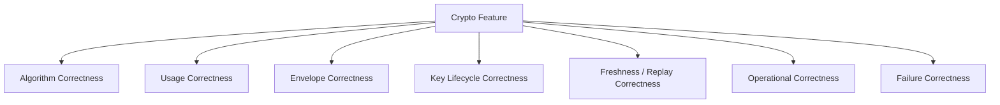
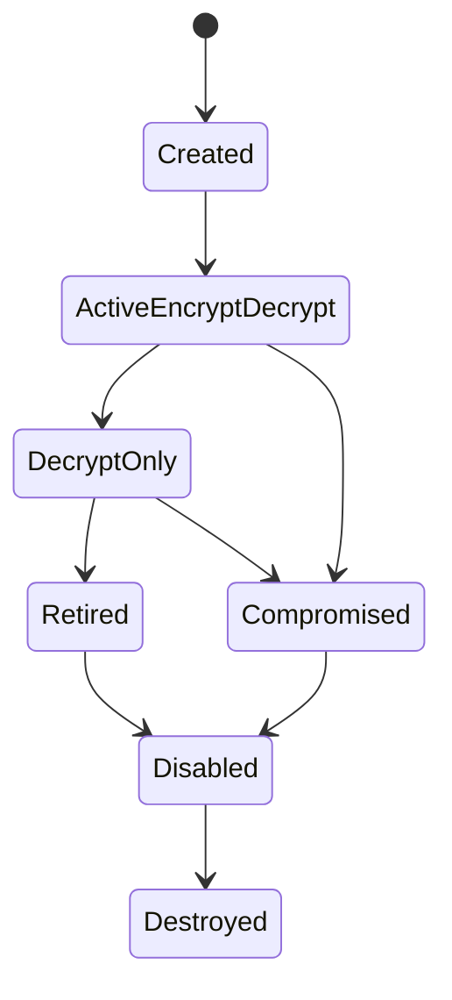
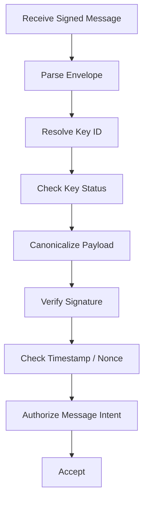
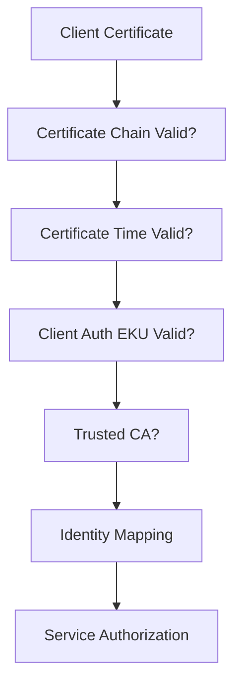

------
title: Learn Java Security, Cryptography, Integrity and Platform Hardening - Part 030
description: Crypto testing and failure simulation for Java systems: known-answer tests, negative tests, nonce reuse, key rotation drills, certificate failures, replay simulation, and fail-closed verification.
series: learn-java-security-cryptography-integrity-hardening
seriesTitle: Learn Java Security, Cryptography, Integrity and Platform Hardening
order: 30
partTitle: Crypto Testing and Failure Simulation
tags:
- java
- security
- cryptography
- testing
- jca
- tls
- key-management
- failure-simulation
- series
date: 2026-06-28
---

# Part 030 — Crypto Testing and Failure Simulation

Cryptography is unforgiving because many broken systems still pass normal functional tests.

An encrypted payload can decrypt in happy-path tests while still being unsafe because:

- nonce reuse is possible,
- keys are not rotated safely,
- algorithm metadata is unauthenticated,
- wrong-key failures leak information,
- expired certificates are accepted,
- signatures verify over a different canonical representation,
- replay is possible,
- fallback accepts deprecated algorithms,
- error handling reveals too much,
- tests only use one key, one payload, one clock, and one provider.

This part focuses on testing crypto as an engineering system, not as isolated API calls.

The goal is not to “test AES.” You should not revalidate standard cryptographic algorithms yourself. The goal is to test **your usage, envelope, key lifecycle, metadata, error behavior, and integration boundaries**.

---

## 1. Kaufman Skill Decomposition

Crypto testing becomes manageable when decomposed into subskills.

| Subskill | Capability |
|---|---|
| Known-answer testing | Verify your wrapper produces/accepts expected vectors where appropriate. |
| Negative testing | Prove tampering, wrong key, wrong AAD, wrong signature, expired cert, and malformed envelope fail closed. |
| Envelope testing | Verify metadata, version, key ID, algorithm ID, nonce, AAD, and ciphertext are bound correctly. |
| Key lifecycle testing | Simulate key creation, activation, rotation, retirement, disablement, and compromise. |
| Replay simulation | Prove freshness controls prevent reuse of old valid cryptographic messages. |
| Provider compatibility | Test behavior across supported JDK/provider versions. |
| Cert/TLS failure simulation | Test expired, wrong-host, wrong-CA, revoked, and missing-client-cert cases. |
| Observability testing | Verify failures emit safe, actionable audit/security events without leaking secrets. |

Practice target:

```text
For every crypto boundary, build a table of accepted and rejected cases.
```

If you cannot name the rejected cases, your design is under-specified.

---

## 2. The Crypto Testing Mental Model

A crypto feature has more than one correctness dimension.



You mostly rely on JCA/provider libraries for algorithm correctness.

You are responsible for everything else.

| Dimension | Example Failure |
|---|---|
| Usage correctness | AES-GCM nonce reused with same key. |
| Envelope correctness | Algorithm field not authenticated. |
| Key lifecycle | Old key removed before old data can be decrypted. |
| Freshness | Signed webhook can be replayed forever. |
| Operational correctness | Key rotation silently fails in one region. |
| Failure correctness | Bad signature logs full payload and secret metadata. |

---

## 3. What Not To Test

Do not write tests that pretend to prove AES, RSA, SHA-256, or Ed25519 are mathematically correct.

Bad test goal:

```text
Prove AES-GCM is secure.
```

Good test goal:

```text
Prove our Encryptor:
- generates a fresh nonce per message,
- authenticates the envelope metadata as AAD,
- rejects modified ciphertext/tag/AAD/version/keyId,
- preserves key version metadata,
- does not log plaintext on failure,
- supports old-key decrypt and new-key encrypt during rotation.
```

Test your **composition**.

---

## 4. Crypto Boundary Inventory

Before writing tests, inventory every crypto boundary.

Example inventory:

| Boundary | Primitive | Data | Key Source | Freshness | Failure Action |
|---|---|---|---|---|---|
| Database field encryption | AES-GCM | PII fields | KMS data key | Nonce uniqueness | Reject read / quarantine record |
| Webhook verification | HMAC-SHA-256 | Request body | Partner secret | Timestamp + nonce | HTTP 401 + audit event |
| Internal command signing | Ed25519 | Canonical command | Service signing key | Command ID expiry | Reject command |
| Password storage | Argon2id/PBKDF2 | Password verifier | Salt + pepper | N/A | Login deny |
| mTLS | TLS cert validation | Service connection | Truststore/CA | Certificate validity | Connection fail |
| Artifact verification | Signature | Build artifact | Release trust policy | Timestamp/provenance | Block deploy |

Each row needs a test matrix.

---

## 5. Test Matrix Pattern

For every crypto boundary, create an accept/reject matrix.

Example for AEAD payload encryption:

| Case | Expected |
|---|---|
| Valid envelope, active key | decrypt succeeds |
| Ciphertext byte modified | fail closed |
| Tag byte modified | fail closed |
| Nonce modified | fail closed |
| AAD modified | fail closed |
| Key ID modified | fail closed if key ID is authenticated metadata |
| Version modified | fail closed if version is authenticated metadata |
| Unknown key ID | fail closed with safe error |
| Retired decrypt-allowed key | decrypt succeeds, re-encrypt recommended |
| Disabled key | fail closed |
| Malformed base64 | fail closed |
| Oversized envelope | fail closed before excessive allocation |
| Empty ciphertext | reject unless explicitly valid by design |

This table should be close to the test code.

---

## 6. Known-Answer Tests

Known-answer tests compare implementation output against known vectors.

They are useful when:

- you implement a wrapper around a standard primitive,
- you need cross-language compatibility,
- you have a canonical signing format,
- you need deterministic signatures or test-mode fixed nonce,
- you consume external crypto protocols.

They are less useful for random encryption because secure encryption should produce different ciphertext for the same plaintext when a fresh nonce is used.

### 6.1 AES-GCM Known Vector Pattern

In production, nonce must be random or generated according to a safe uniqueness policy.

In test, inject a deterministic nonce supplier.

```java
final class AeadEncryptorTest {

    @Test
    void encryptsKnownVectorWhenNonceIsInjected() {
        byte[] key = Hex.decode("000102030405060708090a0b0c0d0e0f");
        byte[] nonce = Hex.decode("101112131415161718191a1b");
        byte[] aad = "case:v1:tenant-a".getBytes(StandardCharsets.UTF_8);
        byte[] plaintext = "restricted finding".getBytes(StandardCharsets.UTF_8);

        AeadEncryptor encryptor = new AeadEncryptor(
                new StaticKeyResolver("k-1", key),
                () -> nonce
        );

        EncryptedEnvelope envelope = encryptor.encrypt(plaintext, aad);

        assertThat(envelope.keyId()).isEqualTo("k-1");
        assertThat(envelope.nonce()).isEqualTo(nonce);
        assertThat(envelope.ciphertext()).isNotEqualTo(plaintext);
        assertThat(encryptor.decrypt(envelope, aad)).isEqualTo(plaintext);
    }
}
```

Avoid hardcoding provider-specific output unless your mode is deterministic and stable.

---

## 7. Negative Tests Are The Core

Crypto code is only safe if malicious modification fails.

### 7.1 Tampered Ciphertext

```java
@Test
void decryptRejectsTamperedCiphertext() {
    EncryptedEnvelope envelope = encryptor.encrypt(
            bytes("classified"),
            bytes("tenant:t-1:field:ssn")
    );

    byte[] modified = envelope.ciphertext().clone();
    modified[0] ^= 0x01;

    EncryptedEnvelope tampered = envelope.withCiphertext(modified);

    assertThatThrownBy(() -> encryptor.decrypt(tampered, bytes("tenant:t-1:field:ssn")))
            .isInstanceOf(CryptoIntegrityException.class);
}
```

### 7.2 Tampered AAD

```java
@Test
void decryptRejectsWrongAssociatedData() {
    EncryptedEnvelope envelope = encryptor.encrypt(
            bytes("classified"),
            bytes("tenant:t-1:field:ssn")
    );

    assertThatThrownBy(() -> encryptor.decrypt(envelope, bytes("tenant:t-2:field:ssn")))
            .isInstanceOf(CryptoIntegrityException.class);
}
```

This proves the ciphertext is bound to tenant and field context.

### 7.3 Wrong Key

```java
@Test
void decryptRejectsWrongKeyMaterial() {
    EncryptedEnvelope envelope = encryptorWithKeyA.encrypt(bytes("payload"), bytes("ctx"));

    assertThatThrownBy(() -> encryptorWithKeyB.decrypt(envelope, bytes("ctx")))
            .isInstanceOf(CryptoIntegrityException.class);
}
```

Never let wrong-key failure become fallback-to-another-key unless fallback is explicit and bounded by key ID policy.

---

## 8. AEAD Envelope Testing

A robust encrypted envelope usually looks like:

```json
{
  "version": 1,
  "alg": "AES-256-GCM",
  "keyId": "customer-pii-2026-06",
  "nonce": "base64url...",
  "ciphertext": "base64url...",
  "tag": "base64url..."
}
```

The dangerous question:

> Is the metadata authenticated?

With AEAD, put security-relevant metadata into AAD.

Recommended AAD:

```text
version || alg || keyId || tenantId || recordType || fieldName || schemaVersion
```

### 8.1 Envelope Metadata Tampering Test

```java
@Test
void decryptRejectsModifiedKeyIdWhenKeyIdIsBoundAsAad() {
    EncryptionContext context = EncryptionContext.builder()
            .tenantId("tenant-a")
            .recordType("case")
            .fieldName("summary")
            .build();

    EncryptedEnvelope envelope = encryptor.encrypt(bytes("secret"), context);

    EncryptedEnvelope tampered = envelope.withKeyId("another-valid-key");

    assertThatThrownBy(() -> encryptor.decrypt(tampered, context))
            .isInstanceOf(CryptoIntegrityException.class);
}
```

If this test passes unexpectedly, metadata may not be authenticated.

---

## 9. Nonce Reuse Testing

AES-GCM security depends on nonce uniqueness per key.

Your tests should verify the system makes reuse structurally hard.

### 9.1 Fresh Nonce Test

```java
@Test
void encryptUsesDifferentNonceForRepeatedPlaintext() {
    Set<String> nonces = new HashSet<>();

    for (int i = 0; i < 10_000; i++) {
        EncryptedEnvelope envelope = encryptor.encrypt(bytes("same plaintext"), bytes("same aad"));
        assertThat(nonces.add(Base64.getEncoder().encodeToString(envelope.nonce())))
                .as("nonce reused at iteration " + i)
                .isTrue();
    }
}
```

This does not mathematically prove uniqueness forever.
It catches broken implementations such as static nonce, deterministic test supplier accidentally used in production, or low-entropy nonce source.

### 9.2 Production Guardrail

For high-risk systems, add runtime detection:

```text
(keyId, nonce) pair must not repeat within observed encryption stream.
```

This is expensive at large scale, but can be sampled or applied to critical encryption domains.

---

## 10. Key Rotation Testing

Crypto tests often ignore time. Key management is mostly time and state.

Model key lifecycle explicitly:



### 10.1 Rotation Invariants

| Invariant | Meaning |
|---|---|
| New encrypt uses active key | New data should not use retired key. |
| Old decrypt works during migration | Existing data remains readable while old key is decrypt-allowed. |
| Disabled key fails closed | Compromised/disabled key cannot decrypt. |
| Rewrap is idempotent | Re-encrypting already migrated data does not corrupt it. |
| Key ID is trustworthy | Key ID cannot be tampered to force wrong-key behavior. |

### 10.2 Rotation Test

```java
@Test
void rotationEncryptsWithNewKeyButDecryptsOldPayload() {
    KeyRegistry registry = new InMemoryKeyRegistry()
            .add(activeKey("k-2026-01", keyA));

    AeadEncryptor encryptor = new AeadEncryptor(registry);
    EncryptedEnvelope oldEnvelope = encryptor.encrypt(bytes("pii"), bytes("ctx"));

    registry.markDecryptOnly("k-2026-01");
    registry.add(activeKey("k-2026-06", keyB));

    EncryptedEnvelope newEnvelope = encryptor.encrypt(bytes("pii"), bytes("ctx"));

    assertThat(oldEnvelope.keyId()).isEqualTo("k-2026-01");
    assertThat(newEnvelope.keyId()).isEqualTo("k-2026-06");
    assertThat(encryptor.decrypt(oldEnvelope, bytes("ctx"))).isEqualTo(bytes("pii"));
    assertThat(encryptor.decrypt(newEnvelope, bytes("ctx"))).isEqualTo(bytes("pii"));
}
```

### 10.3 Disabled Key Test

```java
@Test
void disabledKeyCannotDecryptEvenIfEnvelopeReferencesIt() {
    EncryptedEnvelope envelope = encryptor.encrypt(bytes("payload"), bytes("ctx"));

    keyRegistry.disable(envelope.keyId());

    assertThatThrownBy(() -> encryptor.decrypt(envelope, bytes("ctx")))
            .isInstanceOf(KeyDisabledException.class);
}
```

This test encodes compromise response.

---

## 11. Password Hash Migration Testing

Password verification must handle algorithm upgrades.

Example stored verifier:

```text
$argon2id$v=19$m=65536,t=3,p=1$<salt>$<hash>
```

or legacy:

```text
{pbkdf2-sha256}iterations=210000$salt$hash
```

Test cases:

| Case | Expected |
|---|---|
| Correct password modern hash | success |
| Wrong password modern hash | deny |
| Correct password legacy hash | success + needs rehash |
| Correct password weak legacy hash | success + force rehash before session issuance, depending policy |
| Malformed verifier | deny + security event |
| Unknown algorithm ID | deny |
| Extremely large cost value | deny before DoS |
| Pepper unavailable | fail closed or degraded policy explicitly documented |

### 11.1 Rehash-on-Login Test

```java
@Test
void successfulLegacyPasswordVerificationRequestsRehash() {
    StoredPassword legacy = StoredPassword.parse("{pbkdf2-sha256}...");

    PasswordVerification result = verifier.verify("correct horse battery staple", legacy);

    assertThat(result.success()).isTrue();
    assertThat(result.needsRehash()).isTrue();
}
```

---

## 12. HMAC Request Signing Tests

For HMAC-signed webhooks or service requests, test canonicalization and freshness.

Canonical string example:

```text
METHOD + "\n" +
PATH + "\n" +
QUERY_CANONICAL + "\n" +
TIMESTAMP + "\n" +
SHA256_HEX(BODY)
```

### 12.1 HMAC Test Matrix

| Case | Expected |
|---|---|
| Valid signature | accept |
| Body changed | reject |
| Path changed | reject |
| Method changed | reject |
| Query parameter order changed but canonical equivalent | accept |
| Extra query parameter added | reject if signed query differs |
| Timestamp outside window | reject |
| Reused nonce/request ID | reject |
| Unknown key ID | reject |
| Signature length wrong | reject |
| Different encoding of same path | canonicalize or reject consistently |

### 12.2 Tamper Test

```java
@Test
void signedRequestRejectsModifiedBody() {
    SignedRequest request = signer.sign(
            "POST",
            "/webhooks/case-events",
            Map.of("tenant", "t-1"),
            bytes("{\"caseId\":\"c-1\"}")
    );

    SignedRequest tampered = request.withBody(bytes("{\"caseId\":\"c-2\"}"));

    assertThat(verifier.verify(tampered).accepted()).isFalse();
}
```

---

## 13. Signature Verification Tests

Digital signature verification should test the complete verification pipeline.

Pipeline:



Each stage needs rejection tests.

### 13.1 Canonicalization Mismatch Test

```java
@Test
void signatureVerificationUsesCanonicalBytesNotPrettyPrintedJson() {
    String compact = "{\"caseId\":\"c-1\",\"action\":\"APPROVE\"}";
    String pretty = "{\n  \"action\": \"APPROVE\",\n  \"caseId\": \"c-1\"\n}";

    SignedEnvelope signed = signer.signJson(compact);

    assertThat(verifier.verify(signed.withPayload(pretty)).accepted())
            .isFalse();
}
```

Or, if your design canonicalizes JSON before signing, the test should assert both forms produce the same canonical bytes.

The point is to remove ambiguity.

---

## 14. Replay Simulation

A valid cryptographic message can still be malicious if replayed.

Replay controls include:

- timestamp window
- nonce/request ID cache
- idempotency key
- monotonic sequence number
- signed expiration
- event ID deduplication
- state transition guard

### 14.1 Webhook Replay Test

```java
@Test
void sameSignedWebhookCannotBeProcessedTwice() {
    SignedWebhook webhook = partner.signWebhook(
            "event-123",
            clock.instant(),
            bytes("{\"caseId\":\"c-1\",\"status\":\"APPROVED\"}")
    );

    assertThat(consumer.handle(webhook).accepted()).isTrue();
    assertThat(consumer.handle(webhook).accepted()).isFalse();

    verify(audit).securityEvent("WEBHOOK_REPLAY_REJECTED", "event-123");
}
```

### 14.2 Timestamp Window Test

```java
@Test
void signedWebhookOutsideAllowedClockSkewIsRejected() {
    Instant old = clock.instant().minus(Duration.ofHours(2));
    SignedWebhook webhook = partner.signWebhook("event-124", old, bytes("{}"));

    assertThat(consumer.handle(webhook).accepted()).isFalse();
}
```

Use injectable clocks. Do not make time tests flaky.

---

## 15. Certificate And PKI Testing

Certificate validation has many edge cases.

Test at least:

| Case | Expected |
|---|---|
| Valid chain to trusted CA | accept |
| Expired leaf cert | reject |
| Not-yet-valid cert | reject |
| Wrong hostname/SAN | reject |
| Unknown CA | reject |
| Missing intermediate | reject unless fetched/supplied by design |
| Revoked cert | reject if revocation checking required |
| Wrong key usage / extended key usage | reject |
| Weak signature algorithm | reject by algorithm constraints |
| Client cert missing for mTLS endpoint | reject |
| Client cert valid but unmapped service identity | reject |

### 15.1 Hostname Verification Test

For HTTP clients, do not only test TLS connection success. Test endpoint identity.

```java
@Test
void httpsClientRejectsCertificateForWrongHostname() {
    TestHttpsServer server = TestHttpsServer.withCertificateFor("other.example.test");

    SecureHttpClient client = SecureHttpClient.usingTrustAnchor(server.caCertificate());

    assertThatThrownBy(() -> client.get("https://api.example.test:" + server.port()))
            .isInstanceOf(TlsIdentityException.class);
}
```

If this test succeeds unexpectedly, hostname verification may be disabled.

---

## 16. mTLS Failure Simulation

mTLS failure tests should cover both cryptographic validation and identity mapping.



Test cases:

| Case | Expected |
|---|---|
| No client cert | TLS handshake or request rejected. |
| Cert from untrusted CA | rejected. |
| Valid cert but unknown SPIFFE/service ID | rejected. |
| Valid service identity but unauthorized endpoint | rejected. |
| Expired client cert | rejected. |
| Rotated cert from same identity | accepted if trust policy allows. |

Identity mapping deserves tests:

```text
certificate valid != caller authorized
```

A cert proves an identity under a trust policy. It does not automatically grant every action.

---

## 17. TLS Configuration Smoke Tests

Runtime TLS config should be tested in staging.

Examples:

- TLS 1.0/1.1 disabled
- only approved protocols enabled
- weak cipher suites disabled
- hostname verification enabled on clients
- server requires client cert where expected
- truststore contains expected trust anchors only
- certificate expiry alert fires before deadline
- OCSP/revocation behavior matches policy
- debug logging does not expose secrets

Do not rely on documentation alone. Test the running endpoint.

---

## 18. Provider And JDK Compatibility Tests

Java crypto behavior can vary across:

- JDK versions
- providers
- FIPS-mode providers
- operating systems
- hardware-backed keys
- container base images
- disabled algorithm policies
- key size restrictions in policy/config

Test startup checks:

```java
@Test
void requiredCryptoAlgorithmsAreAvailableAtStartup() {
    assertThat(Cipher.getInstance("AES/GCM/NoPadding")).isNotNull();
    assertThat(Mac.getInstance("HmacSHA256")).isNotNull();
    assertThat(Signature.getInstance("Ed25519")).isNotNull();
}
```

Also test policy expectations:

```java
@Test
void deprecatedAlgorithmsAreRejectedByPolicy() {
    assertThatThrownBy(() -> cryptoPolicy.requireApproved("DES/ECB/PKCS5Padding"))
            .isInstanceOf(AlgorithmNotApprovedException.class);
}
```

The system should fail at startup if required crypto support is unavailable.

---

## 19. Constant-Time Comparison Testing

You cannot easily prove constant-time behavior with ordinary unit tests.

But you can enforce usage patterns:

- centralize MAC/signature comparison
- ban `String.equals` for secrets/tags
- use `MessageDigest.isEqual` or library constant-time comparison
- static analysis rule for dangerous comparisons
- code review checklist

Test that your API does not expose raw equality choices.

```java
@Test
void verifierRejectsWrongMacWithoutExposingComparisonPrimitive() {
    SignedRequest request = signer.sign("POST", "/x", Map.of(), bytes("body"));
    SignedRequest tampered = request.withSignature(randomBytes(request.signature().length));

    assertThat(verifier.verify(tampered).accepted()).isFalse();
}
```

Pair this with static checks. Timing side-channel testing is specialized and noisy.

---

## 20. Malformed Envelope Tests

Crypto envelopes are parsers. Parsers need hostile tests.

Test malformed cases:

- missing version
- unsupported version
- missing algorithm
- unsupported algorithm
- missing key ID
- unknown key ID
- empty nonce
- wrong nonce length
- empty ciphertext
- invalid base64
- huge base64 field
- duplicate JSON keys
- null values
- unexpected extra fields
- wrong field type
- algorithm/key mismatch
- compressed payload bomb if compression exists

Example:

```java
@ParameterizedTest
@MethodSource("malformedEnvelopes")
void malformedEnvelopeFailsClosed(String json) {
    assertThatThrownBy(() -> envelopeParser.parse(json))
            .isInstanceOf(InvalidCryptoEnvelopeException.class);
}
```

Fail before excessive allocation.

---

## 21. Crypto Error Handling Tests

Crypto failures must be safe and diagnosable.

Bad error:

```json
{
  "error": "AES-GCM tag mismatch for key customer-pii-2026-06, plaintext was ..."
}
```

Better external error:

```json
{
  "error": "invalid_protected_payload",
  "correlationId": "..."
}
```

Internal security event:

```json
{
  "eventType": "CRYPTO_INTEGRITY_FAILURE",
  "keyId": "customer-pii-2026-06",
  "envelopeVersion": 1,
  "tenantId": "tenant-a",
  "field": "summary",
  "correlationId": "..."
}
```

No plaintext. No raw secret. No full token. No private key. No password.

### 21.1 Error Hygiene Test

```java
@Test
void cryptoFailureDoesNotLogPlaintextOrKeyMaterial() {
    LogCapture logs = LogCapture.startFor(CryptoEnvelopeService.class);

    EncryptedEnvelope envelope = encryptor.encrypt(bytes("very-secret-pii"), bytes("ctx"));
    EncryptedEnvelope tampered = envelope.withCiphertext(flipOneBit(envelope.ciphertext()));

    assertThatThrownBy(() -> encryptor.decrypt(tampered, bytes("ctx")))
            .isInstanceOf(CryptoIntegrityException.class);

    assertThat(logs.text()).doesNotContain("very-secret-pii");
    assertThat(logs.text()).doesNotContain(Base64.getEncoder().encodeToString(keyMaterial));
}
```

---

## 22. Crypto Observability Tests

Security events should distinguish failure categories without leaking secrets.

Recommended categories:

| Event | Meaning |
|---|---|
| `CRYPTO_ENVELOPE_MALFORMED` | Cannot parse envelope. |
| `CRYPTO_UNKNOWN_KEY_ID` | Key ID not recognized. |
| `CRYPTO_KEY_DISABLED` | Envelope references disabled key. |
| `CRYPTO_INTEGRITY_FAILURE` | Tag/MAC/signature mismatch. |
| `CRYPTO_REPLAY_REJECTED` | Valid message reused. |
| `CRYPTO_ALGORITHM_REJECTED` | Unsupported/deprecated algorithm. |
| `CERTIFICATE_EXPIRED` | Cert outside validity window. |
| `TLS_IDENTITY_MISMATCH` | Host/service identity mismatch. |

Test both behavior and event emission.

```java
@Test
void tamperedCiphertextEmitsIntegrityFailureEvent() {
    EncryptedEnvelope tampered = tamper(encryptor.encrypt(bytes("payload"), bytes("ctx")));

    assertThatThrownBy(() -> service.decryptProtectedField(tampered, context))
            .isInstanceOf(CryptoIntegrityException.class);

    verify(audit).securityEvent(argThat(event ->
            event.type().equals("CRYPTO_INTEGRITY_FAILURE") &&
            event.correlationId() != null &&
            !event.attributes().containsKey("plaintext")
    ));
}
```

---

## 23. Failure Injection Drills

Some crypto failures require integration or staging drills.

| Drill | Expected Result |
|---|---|
| KMS unavailable | Service fails safe or enters documented degraded mode. |
| Truststore missing CA | Startup fails or outbound connection fails closed. |
| Expired service certificate | Alerts before expiry; connection fails after expiry. |
| Disabled key | Decryption rejects; incident path triggered. |
| Unknown key ID in data | Record quarantined or rejected. |
| Bad signature from partner | Request rejected and security event emitted. |
| Replay valid webhook | Second attempt rejected. |
| Artifact signature missing | Deployment blocked. |
| Clock skew beyond tolerance | Signed requests rejected and alert emitted. |

Run these drills before the first real incident.

---

## 24. KMS/HSM Integration Testing

For KMS/HSM-backed systems, test the boundary contract.

Important cases:

- key alias resolves to expected key version
- encrypt/decrypt permissions are separated
- service cannot export non-exportable key
- disabled key cannot be used
- key policy denies unexpected principal
- region/partition failure behavior is known
- latency/timeouts are bounded
- retries do not duplicate unsafe operations
- audit logs exist in both app and KMS/HSM system

Example pattern:

```java
@Test
void servicePrincipalCannotExportKmsKeyMaterial() {
    assertThatThrownBy(() -> kmsClient.exportKeyMaterial("pii-key"))
            .isInstanceOf(AccessDeniedException.class);
}
```

This is a security integration test, not just a unit test.

---

## 25. Testing Algorithm Agility

Crypto migration is inevitable.

Design tests that prove the system can support multiple versions safely.

Example envelope versions:

```text
v1: AES-256-GCM + HKDF-SHA256
v2: AES-256-GCM + different AAD schema
v3: hybrid post-quantum key encapsulation for envelope keys
```

Test cases:

| Case | Expected |
|---|---|
| v1 decrypt supported | old data readable. |
| v2 encrypt default | new data uses latest version. |
| v0 unsupported | reject. |
| unknown future v99 | reject unless explicit forward-compat mode. |
| deprecated algorithm encrypt | blocked. |
| deprecated algorithm decrypt | allowed only within migration policy. |

### 25.1 Latest-Version Encrypt Test

```java
@Test
void newEncryptionUsesLatestEnvelopeVersion() {
    EncryptedEnvelope envelope = encryptor.encrypt(bytes("payload"), bytes("ctx"));

    assertThat(envelope.version()).isEqualTo(2);
    assertThat(envelope.algorithm()).isEqualTo("AES-256-GCM");
}
```

### 25.2 Old-Version Decrypt Test

```java
@Test
void oldEnvelopeVersionCanBeReadDuringMigrationWindow() {
    EncryptedEnvelope old = fixture.load("v1-envelope.json");

    assertThat(encryptor.decrypt(old, bytes("ctx"))).isEqualTo(bytes("payload"));
}
```

---

## 26. Crypto Regression Corpus

Maintain a corpus of crypto fixtures.

Recommended structure:

```text
src/test/resources/crypto-corpus/
  aead/
    valid-v1.json
    valid-v2.json
    tampered-ciphertext.json
    tampered-aad.json
    unknown-key.json
    malformed-base64.json
  signatures/
    valid-ed25519.json
    bad-signature.json
    wrong-key-id.json
    replayed-message.json
  tls/
    valid-chain.pem
    expired-leaf.pem
    wrong-host.pem
    untrusted-ca.pem
  passwords/
    argon2id-current.txt
    pbkdf2-legacy.txt
    malformed-verifier.txt
```

The corpus gives you regression power during refactors and provider/JDK upgrades.

---

## 27. Wycheproof And External Test Vectors

Project Wycheproof provides test vectors designed to catch known crypto library weaknesses and edge cases.

Use external vectors when:

- implementing protocol compatibility,
- validating provider behavior during JDK/provider migration,
- testing edge cases in signature verification,
- validating padding rejection behavior,
- checking known weak or malformed cases.

Do not copy vectors blindly.
Map them to your supported algorithms and providers.

Example use:

```text
For each ECDSA verification vector:
- load public key,
- load message,
- load signature,
- verify result matches expected accept/reject.
```

External vectors supplement your envelope and lifecycle tests. They do not replace them.

---

## 28. Performance And DoS Testing For Crypto

Crypto operations can be abused for resource exhaustion.

Test:

- password hashing cost under expected concurrency
- KDF cost upper bound from stored verifier metadata
- RSA/ECDSA verification load under attack
- oversized token/signature envelope rejection
- XML/JSON signature parser limits
- KMS latency and retry behavior
- TLS handshake rate and connection limits

Example password verifier guard:

```java
@Test
void passwordVerifierRejectsUnreasonablyHighCostMetadata() {
    StoredPassword malicious = StoredPassword.parse(
            "{pbkdf2-sha256}iterations=999999999$salt$hash"
    );

    assertThatThrownBy(() -> verifier.verify("password", malicious))
            .isInstanceOf(InvalidPasswordHashMetadataException.class);
}
```

Security features must not become DoS primitives.

---

## 29. Clock And Time Testing

Crypto protocols often depend on time:

- token expiry
- certificate validity
- signed request timestamp
- nonce cache TTL
- key activation/retirement
- artifact timestamping
- replay window

Use injectable clocks.

Bad:

```java
Instant.now()
```

Better:

```java
class SignedRequestVerifier {
    private final Clock clock;

    SignedRequestVerifier(Clock clock) {
        this.clock = clock;
    }
}
```

Test boundary conditions:

| Time Case | Expected |
|---|---|
| exactly at `nbf` | accept or reject according to policy. |
| one millisecond before `nbf` | reject. |
| exactly at expiry | define explicitly. |
| one millisecond after expiry | reject. |
| within allowed skew | accept. |
| beyond allowed skew | reject. |

Ambiguous time semantics produce production bugs.

---

## 30. Secrets In Test Environments

Security tests must not create secret leaks.

Rules:

- never commit real private keys
- use generated test-only keys
- mark fixtures as test-only
- avoid production-like secret names in fixtures
- do not log generated secrets in CI
- rotate shared test credentials
- prefer ephemeral local CA for TLS tests
- avoid using production KMS keys in CI
- isolate integration test IAM permissions

Test key names should be unmistakable:

```text
TEST_ONLY_DO_NOT_USE_case-signing-key.pem
```

---

## 31. CI Placement

Not every crypto test runs on every commit.

| Test Type | PR | Nightly | Release | Staging |
|---|---:|---:|---:|---:|
| Unit negative tests | yes | yes | yes | no |
| Known-answer tests | yes | yes | yes | no |
| Envelope parser corpus | yes | yes | yes | no |
| Property tests small sample | yes | yes | yes | no |
| Fuzz short run | optional | yes | yes | no |
| Provider compatibility | no | yes | yes | no |
| KMS/HSM integration | no | yes | yes | yes |
| TLS staging scan | no | no | yes | yes |
| Certificate expiry drill | no | no | yes | yes |
| Replay integration test | yes | yes | yes | yes |

Fast negative tests should run in PRs.
Long integration and drill tests can run nightly or before release.

---

## 32. Crypto Test Checklist

Use this checklist for every crypto design:

```text
Crypto Test Checklist

[ ] Are known-answer tests present where deterministic vectors apply?
[ ] Are tampered ciphertext/tag/signature/MAC tests present?
[ ] Is AAD/context mismatch tested?
[ ] Is metadata tampering tested?
[ ] Is unknown/disabled/retired key behavior tested?
[ ] Is key rotation tested?
[ ] Is replay tested?
[ ] Are malformed envelopes tested?
[ ] Are oversized envelopes rejected safely?
[ ] Are expired/not-yet-valid certificates tested?
[ ] Is hostname/service identity verification tested?
[ ] Are wrong trust anchor and missing client cert tested?
[ ] Are crypto failures fail-closed?
[ ] Are logs checked for plaintext/secret leakage?
[ ] Are algorithm deprecation rules tested?
[ ] Are provider/JDK compatibility checks defined?
[ ] Are KMS/HSM permission boundaries tested?
[ ] Are time boundary conditions tested with injectable clock?
```

---

## 33. Common Anti-Patterns

| Anti-Pattern | Why Dangerous | Better Approach |
|---|---|---|
| Only happy-path encrypt/decrypt test | Broken metadata, replay, and rotation can pass. | Accept/reject matrix. |
| Static nonce in production accidentally | Catastrophic AEAD failure. | Inject nonce supplier only in tests; startup guard. |
| Not authenticating metadata | Algorithm/key/context substitution. | Bind metadata as AAD or signed bytes. |
| Removing old key immediately | Old data unreadable. | Decrypt-only migration window. |
| Accepting unknown algorithm field | Downgrade risk. | Strict allowlist. |
| Logging crypto exception details | Secret/plaintext leakage. | Safe error taxonomy. |
| No replay test | Valid messages reusable. | Timestamp + nonce/event ID cache. |
| Disabled hostname verification in tests | Unsafe client pattern reaches production. | Test wrong-host rejection. |
| Using production keys in CI | Secret exposure. | Test-only ephemeral keys. |
| No corpus | Refactors silently break compatibility. | Versioned regression fixtures. |

---

## 34. Practice Lab

Design tests for a Java service with:

- AES-GCM database field encryption for PII
- HMAC-signed incoming webhooks
- Ed25519-signed internal commands
- mTLS between services
- KMS-managed data keys

### Tasks

1. Build an accept/reject matrix for each boundary.
2. Write AEAD tests for ciphertext tamper, AAD mismatch, nonce uniqueness, and key rotation.
3. Write webhook tests for body tamper, timestamp expiry, and replay.
4. Write signature tests for wrong key ID and canonicalization mismatch.
5. Write mTLS tests for wrong hostname, unknown CA, expired client cert, and unauthorized service identity.
6. Write observability tests proving no plaintext or key material appears in logs.
7. Define PR, nightly, release, and staging placement for each test.

---

## 35. Key Takeaways

Crypto testing should prove your security composition, not the mathematics of standard primitives.

The strongest tests are usually negative:

- tamper one byte
- change AAD
- replay the request
- use the wrong key
- disable the key
- expire the cert
- modify metadata
- corrupt the envelope
- break the truststore
- rotate the key
- skew the clock
- inspect the logs

A high-quality Java crypto test suite makes failure boring: every unsafe condition fails closed, emits safe evidence, and never silently downgrades into insecure behavior.

