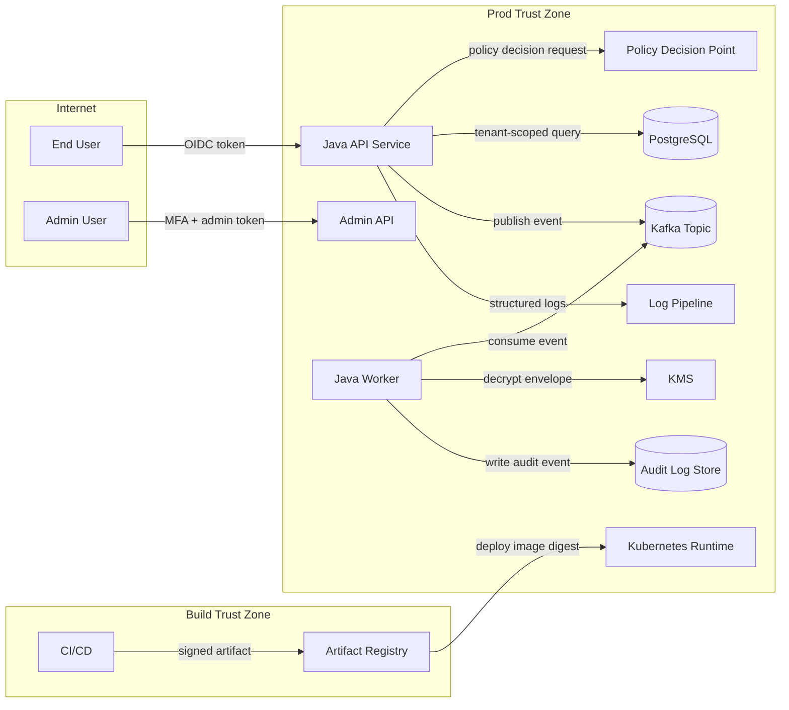
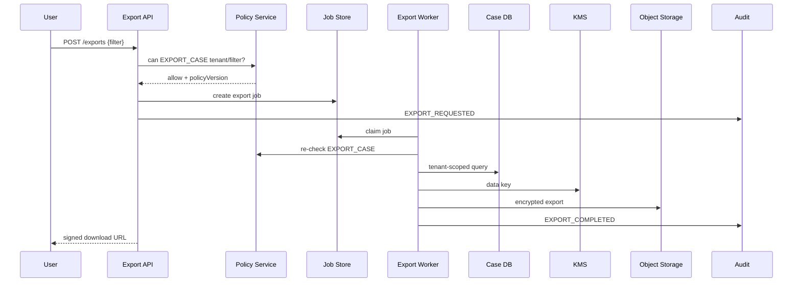
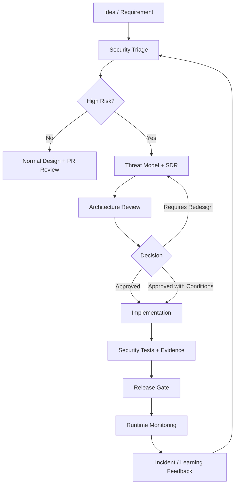

------
title: Learn Java Security, Cryptography, Integrity and Platform Hardening - Part 031
description: Secure architecture review untuk sistem Java produksi: dari threat model, security decision record, control mapping, invariants, abuse-case review, sampai review rubric yang bisa dipakai di design review dan PR review.
series: learn-java-security-cryptography-integrity-hardening
seriesTitle: Learn Java Security, Cryptography, Integrity and Platform Hardening
order: 31
partTitle: Secure Architecture Review
tags:
- java
- security
- architecture
- threat-modeling
- secure-design
- asvs
- hardening
- series
date: 2026-06-28
---

# Part 031 — Secure Architecture Review

Security architecture review adalah proses untuk menjawab satu pertanyaan utama:

> Apakah desain sistem ini masih aman ketika dipakai oleh actor yang salah, dengan input yang salah, dalam urutan yang salah, pada kondisi gagal yang salah?

Review security yang matang tidak hanya mencari bug. Bug adalah gejala lokal. Architecture review mencari **kelas kegagalan**: boundary yang kabur, authority yang terlalu luas, state transition yang tidak defensif, crypto yang tidak punya lifecycle, audit yang tidak bisa membuktikan keputusan, dan runtime yang memberi blast radius terlalu besar.

Dalam sistem Java, architecture review harus membaca sistem di beberapa lapisan sekaligus:

1. domain model,
2. identity dan authorization,
3. data boundary,
4. cryptographic boundary,
5. persistence dan message boundary,
6. runtime/JVM/container boundary,
7. build dan supply-chain boundary,
8. observability, audit, dan incident response.

Kita sudah membahas lapisan-lapisan teknis tersebut di part sebelumnya. Part ini menggabungkannya menjadi satu metode review yang bisa dipakai untuk design review, architecture governance, readiness review, dan critical PR review.

---

## 1. Tujuan Pembelajaran

Setelah bagian ini, kita ingin mampu:

- membaca desain Java system sebagai peta trust boundary dan authority flow,
- membedakan security requirement, security assumption, security invariant, dan compensating control,
- menulis Security Decision Record yang bisa dipakai ulang saat audit atau incident,
- melakukan abuse-case review sebelum implementation terlalu jauh,
- menghubungkan threat model dengan OWASP ASVS-like verification requirement,
- membuat rubric review untuk service, library, batch job, worker, dan platform component,
- menilai residual risk secara defensible, bukan berdasarkan intuisi kosong,
- menghindari review yang berubah menjadi checklist compliance tanpa reasoning.

---

## 2. Mental Model: Architecture Review Bukan Checklist

Checklist berguna sebagai guardrail, tetapi tidak cukup untuk sistem kompleks. Checklist bisa berkata:

- gunakan TLS,
- validasi input,
- jangan log secret,
- gunakan least privilege,
- aktifkan dependency scanning.

Namun checklist tidak otomatis menjawab:

- actor mana yang boleh membuat keputusan ini?
- apakah service A boleh bertindak atas nama user B?
- kapan token masih valid setelah privilege berubah?
- apakah audit log bisa membuktikan authorization context pada saat keputusan dibuat?
- apakah signed payload masih aman jika field baru ditambahkan?
- apakah key rotation bisa dilakukan tanpa downtime dan tanpa decrypt-all migration?
- apakah worker bisa memproses event lama dengan policy baru?

Security architecture review adalah proses menemukan **invariant**.

Contoh invariant:

```text
A tenant-scoped actor must never read, mutate, export, or infer resources outside its tenant,
including through API response, async event, report, cache, log, metric, search index, or retry queue.
```

Invariant seperti ini lebih kuat daripada checklist “tambahkan tenant_id di query”. Ia memaksa reviewer memeriksa semua jalur: API, async worker, cache, export, audit, observability, dan failure path.

---

## 3. Empat Artefak Minimal Review

Setiap security architecture review yang serius sebaiknya menghasilkan empat artefak:

| Artefak | Fungsi |
|---|---|
| Security Context Diagram | Menunjukkan actor, system boundary, trust boundary, data flow, dan authority flow. |
| Threat / Abuse Case Register | Menunjukkan cara sistem dapat disalahgunakan, bukan hanya cara sistem dipakai normal. |
| Security Decision Record | Menjelaskan keputusan desain, alternatif, alasan, assumption, dan residual risk. |
| Verification Plan | Menjelaskan bagaimana requirement akan dibuktikan melalui test, review, scan, config gate, atau runtime evidence. |

Tanpa artefak ini, review sering menjadi diskusi oral yang hilang setelah meeting.

---

## 4. Security Context Diagram

Diagram security context tidak perlu indah. Ia harus jujur.

Minimal tampilkan:

- external actor,
- internal service,
- data store,
- queue/topic,
- cache,
- KMS/HSM/secrets provider,
- identity provider,
- CI/CD/build system,
- admin/operator surface,
- observability/log pipeline,
- trust boundary,
- data classification,
- authentication mechanism,
- authorization decision point.

Contoh:



Diagram ini belum threat model. Namun diagram ini memberi reviewer daftar pertanyaan:

- apakah admin surface dipisah dari user surface?
- apakah worker memverifikasi event authenticity?
- apakah queue dianggap trusted atau untrusted?
- apakah policy decision terjadi sebelum DB query, setelah query, atau dua-duanya?
- apakah KMS access dibatasi per service identity?
- apakah audit path dapat dimatikan oleh service yang sedang diinvestigasi?
- apakah artifact registry hanya menerima signed artifacts?

---

## 5. Authority Flow Lebih Penting Daripada Data Flow

Banyak diagram sistem menunjukkan data flow, tetapi security review membutuhkan **authority flow**.

Data flow menjawab:

```text
Data bergerak dari A ke B.
```

Authority flow menjawab:

```text
Bolehkan A menyebabkan B melakukan tindakan C terhadap resource D?
Atas nama siapa?
Dengan bukti apa?
Dalam batas waktu apa?
Dapat dibatalkan atau diaudit tidak?
```

Contoh authority flow yang berbahaya:

```text
Frontend sends userId in request body.
API uses userId to load account.
Worker receives event with userId and executes payout.
```

Masalahnya bukan hanya input validation. Masalahnya adalah authority. User tidak boleh memilih identity/subject miliknya melalui request body. Identity harus berasal dari authenticated context. Worker tidak boleh percaya event hanya karena event ada di queue.

Review rule:

> Field dari client atau event tidak otomatis menjadi authority. Authority harus berasal dari trusted authentication context, policy decision, signed delegation, atau controlled service identity.

---

## 6. Security Requirement vs Assumption vs Invariant

Banyak desain gagal karena semua hal disebut “requirement”. Kita perlu membedakan empat hal.

### 6.1 Security Requirement

Requirement adalah sesuatu yang harus dilakukan sistem.

Contoh:

```text
The service must reject export requests when the requester lacks EXPORT_CASE permission for the target tenant.
```

### 6.2 Security Assumption

Assumption adalah sesuatu yang dipercaya benar, tetapi berada di luar kontrol langsung komponen.

Contoh:

```text
The identity provider issues tokens only after MFA for admin roles.
```

Assumption harus bisa diverifikasi atau dimonitor. Jika tidak, ia adalah harapan.

### 6.3 Security Invariant

Invariant adalah properti yang harus tetap benar di semua jalur dan semua state.

Contoh:

```text
A user cannot approve their own enforcement action, directly or through delegation.
```

Invariant harus diuji melalui positive, negative, race, replay, and async-flow tests.

### 6.4 Compensating Control

Compensating control adalah kontrol alternatif ketika kontrol ideal tidak feasible.

Contoh:

```text
Legacy report generator cannot enforce row-level policy internally. It can only receive pre-authorized, pre-filtered dataset from ReportAccessService, and its network egress is restricted to object storage write-only endpoint.
```

Compensating control tidak boleh menjadi “kita akan monitor saja”. Monitoring bukan pengganti prevention kecuali risk memang diterima.

---

## 7. Security Decision Record

Security Decision Record, atau SDR, mirip Architecture Decision Record, tetapi berorientasi pada risk, control, dan evidence.

Template minimal:

```md
# SDR-012: Tenant Isolation for Case Export

## Context
Case export allows users to download large datasets for a tenant.
The export is asynchronous and processed by a worker.

## Assets
- case records
- subject personal data
- enforcement decisions
- audit trail

## Actors
- tenant analyst
- tenant supervisor
- platform operator
- export worker service identity

## Decision
Export authorization is evaluated synchronously at request creation and re-evaluated by the worker before data extraction.
The export job stores requester identity, tenant id, policy version, requested filter, and immutable decision context.

## Alternatives Considered
1. Authorize only at API request time.
2. Authorize only at worker execution time.
3. Authorize at both request and execution time.

## Selected Rationale
Both checks are required because privilege may change between request and worker execution.

## Security Invariants
- requester must have EXPORT_CASE permission for tenant at execution time.
- worker must not accept tenant id from unsigned or mutable job payload.
- audit event must include requester, tenant, policy version, job id, and decision outcome.

## Residual Risk
If policy service is unavailable, export fails closed.
Operators may need manual retry after policy service recovery.

## Verification
- authorization negative tests
- stale privilege test
- worker tampered job payload test
- audit event contract test
- chaos test: policy service unavailable
```

Good SDR memiliki ciri:

- menjelaskan kenapa keputusan diambil,
- menyebut alternatif yang ditolak,
- menyebut assumption eksplisit,
- menyebut residual risk,
- punya verification plan,
- bisa dibaca 1 tahun kemudian saat incident.

---

## 8. Review Lens: STRIDE yang Diadaptasi untuk Java

STRIDE bukan tujuan akhir, tetapi lensa awal yang efektif.

| Threat | Pertanyaan Java-oriented |
|---|---|
| Spoofing | Apakah identity berasal dari token/session/cert yang diverifikasi? Apakah service identity jelas? |
| Tampering | Apakah payload/event/file/config bisa dimodifikasi tanpa terdeteksi? Apakah signature/HMAC/AAD dibutuhkan? |
| Repudiation | Apakah audit bisa membuktikan actor, decision, policy version, dan time? |
| Information Disclosure | Apakah response/log/export/cache/event/metric membocorkan data? |
| Denial of Service | Apakah parser, regex, decompression, queue, thread pool, DB, dan crypto operation punya limit? |
| Elevation of Privilege | Apakah authorization berlaku pada object, tenant, action, state transition, dan async worker? |

Contoh review untuk Java worker:

```text
Spoofing:
- Apakah worker tahu siapa producer event?
- Apakah event signed atau berasal dari trusted topic saja?

Tampering:
- Apakah event payload immutable?
- Apakah event schema punya version dan digest?

Repudiation:
- Apakah worker menulis audit event saat menerima dan saat menyelesaikan job?

Information Disclosure:
- Apakah event membawa full PII atau hanya reference id?

Denial of Service:
- Apakah worker punya max payload size, max retries, DLQ policy, dan idempotency key?

Elevation of Privilege:
- Apakah worker mengecek ulang policy atau hanya percaya event?
```

---

## 9. Abuse-Case Review

Use case menggambarkan happy path. Abuse case menggambarkan bagaimana sistem dipakai untuk tujuan salah.

Contoh use case:

```text
Supervisor approves case escalation.
```

Abuse cases:

```text
- Analyst attempts to approve their own escalation using supervisorId in request body.
- Former supervisor uses stale token after role revocation.
- Supervisor approves escalation from another tenant by modifying caseId.
- Worker processes replayed approval event.
- Admin bulk endpoint bypasses normal approval rule.
- Audit event records approval but not policy version.
```

Abuse-case review lebih berguna daripada pertanyaan generik “apakah sudah aman?” karena memaksa desain menghadapi tindakan konkret.

---

## 10. Control Mapping

Security control harus dipetakan ke threat, bukan ditempel sembarang.

Contoh mapping:

| Threat | Control | Verification |
|---|---|---|
| Cross-tenant read | Tenant-scoped policy + DB predicate + response projection | negative integration test + query review |
| Replay event | event idempotency key + expiry + signature timestamp | replay simulation test |
| Secret leakage | no secret in env dump/log + secret scanner + redaction | unit test + CI scanner + log sampling |
| Malicious dependency | lockfile + dependency verification + SCA + signed artifact | CI gate + release evidence |
| Key compromise | key versioning + rotation + revoke + re-encrypt strategy | rotation drill |
| Admin misuse | MFA assumption + dual control + audit | IdP policy evidence + workflow test |

Control mapping membantu reviewer melihat gap:

- threat tanpa control,
- control tanpa threat,
- control tanpa verification,
- verification tanpa evidence.

---

## 11. ASVS sebagai Requirement Library, Bukan Pengganti Reasoning

OWASP ASVS sangat berguna sebagai requirement library untuk application security. Namun ASVS tidak menggantikan architecture reasoning.

Cara tepat memakai ASVS:

1. gunakan ASVS untuk memastikan kategori kontrol tidak terlupa,
2. pilih level sesuai criticality,
3. mapping requirement ke desain dan test,
4. dokumentasikan pengecualian,
5. jadikan hasil mapping sebagai evidence.

Cara yang salah:

```text
"Kita comply ASVS, berarti desain aman."
```

ASVS menjawab apakah kontrol teknis tertentu ada. Architecture review menjawab apakah kontrol tersebut benar-benar menutup threat pada desain spesifik.

---

## 12. Review Rubric untuk Java Service

Gunakan rubric berikut untuk service Java produksi.

### 12.1 Identity

- Dari mana authenticated identity berasal?
- Apakah identity bisa dipilih oleh client?
- Apakah service-to-service identity berbeda dari user identity?
- Apakah delegation eksplisit?
- Apakah token audience, issuer, expiry, dan key id diverifikasi?
- Apakah role/permission refresh ditangani setelah privilege berubah?

### 12.2 Authorization

- Apakah authorization dilakukan pada action dan object?
- Apakah tenant boundary enforced di API, query, cache, event, dan export?
- Apakah admin path memakai policy yang sama atau bypass?
- Apakah worker melakukan re-authorization jika state/privilege dapat berubah?
- Apakah deny-by-default?
- Apakah policy decision diaudit?

### 12.3 Data Boundary

- Apa klasifikasi data yang masuk dan keluar?
- Apakah input canonicalization dilakukan sebelum validation?
- Apakah DTO response audience-aware?
- Apakah error response membocorkan internal state?
- Apakah logs/metrics/traces membawa PII/secret?
- Apakah export punya approval, limit, dan audit?

### 12.4 Crypto

- Apa tujuan crypto: confidentiality, integrity, authenticity, non-repudiation, atau key agreement?
- Apakah primitive sesuai tujuan?
- Apakah key lifecycle jelas?
- Apakah nonce/IV unik dan tidak reused?
- Apakah signature input canonical dan versioned?
- Apakah key rotation tested?
- Apakah algorithm agility tersedia?

### 12.5 Runtime

- Apakah debug/JMX/attach/heap dump surface dibatasi?
- Apakah service berjalan non-root?
- Apakah filesystem read-only jika mungkin?
- Apakah management port terisolasi?
- Apakah secret tidak bocor via env/log/dump?
- Apakah resource limits mencegah DoS internal?

### 12.6 Supply Chain

- Apakah dependency verification aktif?
- Apakah build plugin dan annotation processor trusted?
- Apakah artifact signed?
- Apakah SBOM dihasilkan?
- Apakah provenance tersedia?
- Apakah image digest dipakai, bukan tag mutable?

### 12.7 Observability and Audit

- Apakah audit event mencatat actor, action, resource, decision, policy version, correlation id, dan outcome?
- Apakah audit log tamper-evident atau append-only?
- Apakah failure path juga diaudit?
- Apakah detection rule untuk abuse-case utama tersedia?
- Apakah forensic evidence packet bisa dibuat?

---

## 13. Review Rubric untuk Java Library

Library security review berbeda dari service review. Library sering dipakai di banyak context, sehingga risiko utamanya adalah misuse.

Pertanyaan:

- Apakah API sulit disalahgunakan?
- Apakah default aman?
- Apakah insecure option jelas diberi nama berbahaya?
- Apakah caller harus menyediakan secret, random, key, atau clock?
- Apakah exception semantics fail-closed?
- Apakah object immutable?
- Apakah thread-safety didokumentasikan?
- Apakah sensitive data lifecycle jelas?
- Apakah serialization dilarang atau dibatasi?
- Apakah library membawa transitive dependency besar?

Anti-pattern library security:

```java
// Bad: boolean flag hides security meaning.
TokenVerifier verifier = new TokenVerifier(false);
```

Lebih baik:

```java
TokenVerifier verifier = TokenVerifier.strictProductionVerifier(policy);
```

Atau jika insecure mode hanya untuk test:

```java
TokenVerifier verifier = TokenVerifier.insecureTestOnlyVerifier();
```

Nama API adalah security control. API yang ambigu mendorong misuse.

---

## 14. Review Rubric untuk Batch Job dan Worker

Worker sering lebih berbahaya dari API karena ia memproses data besar dan kadang punya privilege tinggi.

Pertanyaan:

- Dari mana job/event berasal?
- Apakah payload trusted?
- Apakah payload signed atau minimal berasal dari topic trusted?
- Apakah worker mengecek authorization atau hanya percaya event?
- Apakah job bisa replay?
- Apakah idempotency benar?
- Apakah retry bisa memperbesar dampak?
- Apakah DLQ berisi data sensitif?
- Apakah worker punya tenant limit?
- Apakah worker bisa menulis audit sebelum dan sesudah tindakan?
- Apakah worker secret lebih luas dari kebutuhan?

Contoh invariant worker:

```text
A worker must not gain broader domain authority than the request that created the job,
unless the workflow explicitly transitions into a system-authorized operation and records that transition.
```

---

## 15. Review Rubric untuk Admin dan Operator Surface

Admin surface sering menjadi blind spot karena dianggap internal.

Pertanyaan:

- Apakah admin endpoint terpisah dari public endpoint?
- Apakah admin action membutuhkan MFA atau stronger assurance?
- Apakah admin action punya dual control untuk destructive operation?
- Apakah admin bisa impersonate user? Jika iya, apakah ada consent/audit/banner/scope limit?
- Apakah break-glass punya expiry dan post-action review?
- Apakah admin actions immutable-audited?
- Apakah admin bypass policy normal? Jika iya, siapa mengotorisasi?

Prinsip:

> Internal bukan berarti trusted. Internal hanya berarti threat model berbeda.

---

## 16. Residual Risk: Jangan Disembunyikan

Residual risk adalah risk yang tersisa setelah control diterapkan. Ia bukan tanda desain buruk. Ia tanda desain jujur.

Format yang baik:

```text
Risk:
If the policy service is unavailable, export jobs cannot be authorized.

Decision:
Fail closed.

Impact:
Export jobs may be delayed during policy outage.

Compensating operation:
Manual retry after policy recovery. No manual approval bypass.

Owner:
Platform Security + Case Management Team.
```

Format yang buruk:

```text
Risk accepted because unlikely.
```

“Unlikely” harus punya dasar. Jika tidak ada data, gunakan language yang lebih jujur:

```text
Risk accepted due to limited exposure and strong detection, pending redesign in Q3.
```

---

## 17. Security Review Meeting Structure

Meeting review yang efektif tidak dimulai dengan membaca slide panjang.

Struktur 60 menit:

1. 5 menit — scope dan non-goals,
2. 10 menit — context diagram dan trust boundaries,
3. 10 menit — critical assets dan actors,
4. 15 menit — top abuse cases,
5. 10 menit — key security decisions dan alternatives,
6. 5 menit — residual risks,
7. 5 menit — verification plan dan action owners.

Output meeting harus berupa:

- approved,
- approved with conditions,
- requires redesign,
- blocked pending evidence.

Bukan “looks good”.

---

## 18. Pull Request Security Review

PR review tidak boleh mencoba mengulang architecture review dari nol. PR security review harus memverifikasi apakah implementation setia pada decision dan invariant.

Checklist PR security:

```text
- Does this PR introduce a new trust boundary?
- Does it parse new input format?
- Does it expose new output field?
- Does it add new privilege/action?
- Does it add async/event behavior?
- Does it touch crypto/key/secret/token/session?
- Does it modify policy decision logic?
- Does it add dependency/plugin/agent/native code?
- Does it change logs/audit events?
- Does it change deployment/runtime config?
```

Jika jawaban “ya”, PR membutuhkan security-focused review.

---

## 19. Example: Architecture Review of Secure Export Service

### 19.1 Context

Sistem menyediakan export case data untuk tenant analyst.

Flow:



### 19.2 Top Abuse Cases

```text
- user modifies tenant id in filter
- user requests huge export to cause DoS
- user loses permission after job is created
- worker processes tampered job row
- download URL shared outside tenant
- export includes fields not visible in UI
- export object remains accessible forever
- audit logs show job completed but not requester
```

### 19.3 Decisions

| Area | Decision |
|---|---|
| Authorization | Check at request and worker execution time. |
| Tenant boundary | Tenant id from authenticated context, not request body. |
| Data projection | Export schema is separate from DB entity. |
| Crypto | Export encrypted with envelope encryption. |
| Download | Short-lived signed URL, bound to object and expiry. |
| Audit | Request, denial, start, completion, failure, download generated. |
| DoS | Max rows, max file size, rate limit, async quota. |
| Residual risk | Export can be shared after download; mitigated by watermarking and audit. |

### 19.4 Verification

```text
- cross-tenant filter test
- permission revoked after job creation test
- tampered job payload test
- oversized export rejection test
- export projection test
- encrypted object test
- signed URL expiry test
- audit contract test
```

This is architecture review as engineering artifact, not ceremonial approval.

---

## 20. Common Anti-Patterns

### 20.1 “Security Will Be Added Later”

Security boundary retrofits are expensive because they affect data model, state transition, API contract, cache key, event schema, and audit trail.

If authorization, identity, and data classification are absent from design, the design is incomplete.

### 20.2 “Internal Service Is Trusted”

Internal service may be compromised, misconfigured, or invoked by another internal service with confused authority.

Use service identity, audience restriction, mTLS, authorization, network policy, and audit.

### 20.3 “Encryption Solves Integrity”

Encryption without authentication may not prevent tampering. AEAD or separate MAC/signature is needed depending on use case.

### 20.4 “Audit Means Log a String”

Audit event is not arbitrary log text. It is structured evidence.

It needs actor, action, resource, decision, policy version, timestamp, correlation id, result, and reason.

### 20.5 “Policy in UI Is Enough”

UI security is usability. Server-side authorization is enforcement.

### 20.6 “Scanning Equals Security”

SAST/SCA can find known classes of issue. It cannot prove business authorization, tenant isolation, or workflow integrity by itself.

---

## 21. Decision Quality Rubric

A security decision is strong if it is:

| Quality | Meaning |
|---|---|
| Specific | Names actor, resource, action, boundary, and condition. |
| Testable | Can be proven by tests, config checks, or runtime evidence. |
| Fail-closed | Defines safe behavior when dependency fails. |
| Observable | Produces useful audit/telemetry without leaking data. |
| Revocable | Can be changed after compromise or policy update. |
| Scoped | Limits authority and blast radius. |
| Versioned | Supports schema/policy/key/protocol evolution. |
| Documented | Has rationale, alternatives, and residual risk. |

Weak decision:

```text
Use encryption for sensitive data.
```

Strong decision:

```text
Encrypt export files using envelope encryption with AES-GCM.
AAD must include tenantId, exportId, schemaVersion, and keyVersion.
The object is readable only through short-lived signed URL generated after authorization check.
```

---

## 22. Integrating Review into Delivery Flow

Security architecture review should happen at these points:



High-risk triggers:

- new authentication or authorization path,
- new tenant boundary,
- new admin operation,
- new crypto/key/secret design,
- new parser/deserializer,
- new dependency execution path,
- new plugin/scripting/agent mechanism,
- new data export/reporting capability,
- new public endpoint,
- new cross-service delegation,
- new sensitive audit/regulatory decision flow.

---

## 23. Practice: 90-Minute Architecture Review Drill

Pick one existing Java service and produce:

1. context diagram,
2. top 5 assets,
3. top 5 actors,
4. top 10 abuse cases,
5. 5 security invariants,
6. 3 SDRs,
7. verification plan,
8. residual risk list.

Timebox:

| Minute | Activity |
|---:|---|
| 0–10 | Draw system boundary. |
| 10–20 | Identify actors and assets. |
| 20–35 | Map trust boundaries and authority flows. |
| 35–55 | Write abuse cases. |
| 55–70 | Convert abuse cases into invariants. |
| 70–85 | Draft SDRs and verification plan. |
| 85–90 | Decide: approved, conditional, redesign, or blocked. |

Do not spend 60 minutes arguing diagram notation. The purpose is to expose risk.

---

## 24. Review Template

Use this template for every high-risk feature.

```md
# Security Architecture Review: <Feature/System>

## Scope

## Non-Goals

## Context Diagram

## Assets

## Actors

## Trust Boundaries

## Authority Flows

## Data Classification

## Abuse Cases

## Security Invariants

## Key Decisions

## Alternatives Rejected

## Control Mapping

## Verification Plan

## Operational Requirements

## Residual Risks

## Decision
- [ ] Approved
- [ ] Approved with conditions
- [ ] Requires redesign
- [ ] Blocked pending evidence
```

---

## 25. Summary

Secure architecture review is the bridge between security knowledge and production-grade system design.

The core shift:

```text
From: Did we add security controls?
To: Can we prove security invariants still hold under abuse, failure, replay, drift, and compromise?
```

A top-tier Java engineer should be able to:

- draw trust boundaries quickly,
- identify authority flow,
- write security invariants,
- map controls to threats,
- write Security Decision Records,
- define verification evidence,
- explain residual risk clearly,
- stop weak designs before they become expensive incidents.

The next part extends this thinking into long-term cryptographic survivability: crypto agility and post-quantum readiness.

---

## References

- OWASP Application Security Verification Standard, version 5.0 project page.
- OWASP Threat Modeling Cheat Sheet.
- OWASP Logging Cheat Sheet.
- OWASP Authorization Cheat Sheet.
- Oracle Secure Coding Guidelines for Java SE.
- Oracle Java Cryptography Architecture Reference Guide.
- NIST SP 800-57 Part 1 Revision 5, Recommendation for Key Management.
