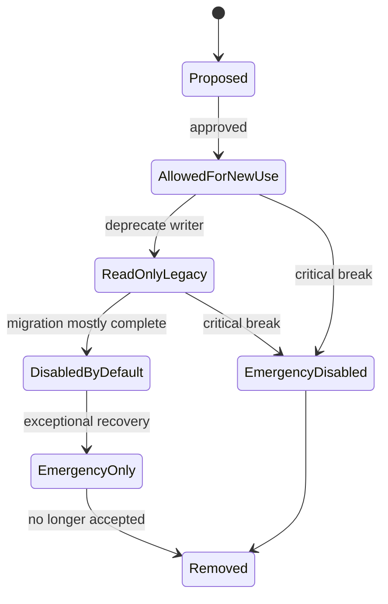
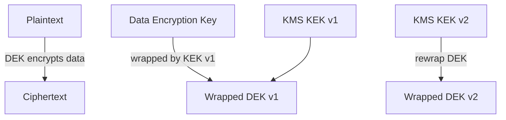
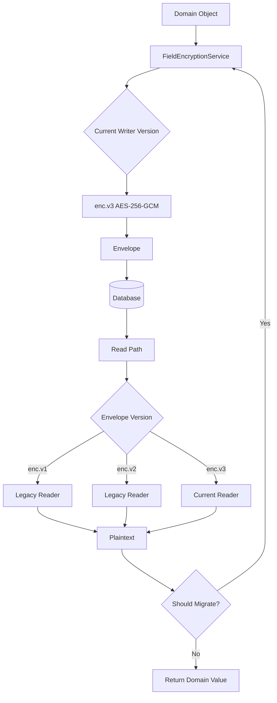

------
title: Learn Java Security, Cryptography, Integrity and Platform Hardening - Part 032
description: Crypto agility dan post-quantum readiness untuk sistem Java: inventory cryptographic assets, algorithm lifecycle, key lifecycle, hybrid migration, PQC standards, dan desain abstraction agar platform tidak terkunci pada algoritma lama.
series: learn-java-security-cryptography-integrity-hardening
seriesTitle: Learn Java Security, Cryptography, Integrity and Platform Hardening
order: 32
partTitle: Post-Quantum and Crypto Agility
tags:
- java
- security
- cryptography
- post-quantum
- crypto-agility
- key-management
- jca
- series
date: 2026-06-28
---

# Part 032 — Post-Quantum and Crypto Agility

Cryptography yang aman hari ini tidak otomatis aman untuk seluruh umur data dan sistem. Algoritma bisa melemah, implementation bisa rusak, key bisa bocor, parameter bisa deprecated, compliance bisa berubah, dan quantum-capable attacker dapat mengubah asumsi keamanan asymmetric cryptography.

Karena itu, target engineer senior bukan hanya “pakai AES-GCM” atau “pakai TLS”. Targetnya adalah membangun sistem yang bisa **bermigrasi** ketika crypto landscape berubah.

Itulah crypto agility.

> Crypto agility adalah kemampuan sistem untuk mengganti algoritma, key, provider, parameter, certificate, encoding, protocol, atau trust policy secara terkendali tanpa rewrite besar, downtime besar, atau kehilangan kemampuan membaca data lama.

Post-quantum readiness adalah salah satu alasan paling kuat untuk crypto agility, tetapi bukan satu-satunya.

---

## 1. Tujuan Pembelajaran

Setelah bagian ini, kita ingin mampu:

- membedakan crypto agility dari sekadar “configurable algorithm name”,
- membuat inventory cryptographic assets di sistem Java,
- memahami dampak post-quantum terhadap RSA, ECC, ECDH, ECDSA, EdDSA, dan TLS,
- memahami posisi ML-KEM, ML-DSA, dan SLH-DSA pada standar NIST,
- mendesain envelope format yang versioned dan migratable,
- membuat key lifecycle dan algorithm lifecycle yang eksplisit,
- menentukan kapan hybrid migration masuk akal,
- merancang abstraction Java yang tidak menyembunyikan security semantics,
- membuat test dan operational drill untuk crypto migration.

---

## 2. Masalah Utama: Crypto Biasanya Tersebar

Dalam sistem Java besar, crypto jarang berada di satu tempat.

Biasanya tersebar di:

- TLS configuration,
- JWT validation,
- password hashing,
- API key hashing,
- request signing,
- webhook verification,
- database field encryption,
- object storage encryption,
- message/event signature,
- PDF/document signature,
- JAR signing,
- container image signing,
- dependency signature,
- mTLS service identity,
- KMS/HSM integration,
- backup encryption,
- audit log hash chain,
- cache token,
- reset token,
- OAuth/OIDC client secret,
- SSH deploy keys,
- CI/CD signing keys.

Jika tidak ada inventory, migration akan berubah menjadi archaeological project.

---

## 3. Crypto Agility Bukan Ini

Crypto agility bukan sekadar:

```java
Cipher.getInstance(config.getAlgorithm());
```

Itu justru bisa menciptakan vulnerability jika config dapat mengaktifkan algoritma lemah.

Crypto agility juga bukan:

```text
Support all algorithms for maximum compatibility.
```

Security membutuhkan curated allowlist, bukan infinite flexibility.

Crypto agility yang benar berarti:

- format payload punya version,
- metadata menyimpan algorithm id dan key version,
- verifier bisa membaca versi lama secara terbatas,
- writer hanya memakai versi baru,
- policy bisa menolak algoritma deprecated,
- migration path jelas,
- observability menunjukkan algoritma/key yang masih dipakai,
- test membuktikan backward compatibility dan forward migration.

---

## 4. Algorithm Lifecycle

Algoritma harus diperlakukan sebagai lifecycle object.



Definisi status:

| Status | Meaning |
|---|---|
| Proposed | Sedang dievaluasi; belum boleh produksi. |
| AllowedForNewUse | Boleh untuk writer baru dan verifier. |
| ReadOnlyLegacy | Tidak boleh menulis data baru, tetapi masih boleh membaca/verifikasi data lama. |
| DisabledByDefault | Tidak aktif kecuali override terbatas. |
| EmergencyOnly | Hanya untuk recovery/forensics dengan approval. |
| Removed | Tidak didukung sama sekali. |
| EmergencyDisabled | Dimatikan karena break/incident. |

Lifecycle ini harus ada di code, config, dokumentasi, dan dashboard.

---

## 5. Cryptographic Asset Inventory

Inventory adalah fondasi crypto agility.

Minimal field:

| Field | Example |
|---|---|
| Asset ID | `case-export-file-encryption` |
| Purpose | confidentiality + integrity |
| Data lifetime | 7 years |
| Algorithm | AES-256-GCM |
| Key type | symmetric data encryption key |
| Key storage | KMS CMK + envelope DEK |
| Key rotation | quarterly CMK rotation, per-file DEK |
| Format version | `enc.v2` |
| Owner | Case Platform Team |
| Reader components | Export API, Export Worker |
| Writer components | Export Worker |
| Migration strategy | lazy re-encryption on read, batch for hot objects |
| Break-glass | security approval required |
| Evidence | test suite, rotation drill, dashboard |

For asymmetric crypto:

| Field | Example |
|---|---|
| Asset ID | `webhook-signature` |
| Purpose | payload authenticity + integrity |
| Algorithm | Ed25519 / future ML-DSA candidate |
| Canonicalization | JSON canonical form v1 |
| Key distribution | JWKS endpoint |
| Key id | `kid` in header |
| Replay control | timestamp + nonce/idempotency key |
| Verification window | 5 minutes |
| Legacy support | HMAC-SHA256 until 2026-12-31 |

Tanpa inventory ini, organisasi tidak bisa menjawab pertanyaan sederhana:

```text
Di mana kita masih memakai RSA-2048 untuk signature jangka panjang?
```

---

## 6. Post-Quantum Threat Model

Quantum threat terutama memukul public-key cryptography tertentu.

Secara umum:

| Crypto Area | Quantum Impact |
|---|---|
| RSA encryption/signature | Terancam oleh sufficiently large cryptographically relevant quantum computer. |
| ECC/ECDH/ECDSA/EdDSA | Terancam oleh sufficiently large cryptographically relevant quantum computer. |
| AES symmetric encryption | Dampak Grover-style: biasanya mitigasi dengan key length lebih besar, misalnya AES-256. |
| Hash functions | Dampak lebih moderat; output length dan security margin tetap penting. |
| HMAC | Masih kuat jika hash/key length dipilih benar. |
| Password hashing | Masalah utama tetap offline guessing; parameter dan password entropy penting. |

Risiko post-quantum tidak sama untuk semua data.

Risiko tertinggi:

- data dienkripsi hari ini dan harus tetap rahasia puluhan tahun,
- attacker bisa capture ciphertext sekarang dan decrypt nanti,
- long-lived certificate/signature trust,
- firmware/software update signature jangka panjang,
- regulatory/legal records yang memerlukan authenticity lama,
- root/intermediate CA lifecycle panjang,
- embedded device dengan upgrade sulit.

Konsep penting:

```text
Harvest now, decrypt later.
```

Jika confidentiality data harus bertahan lama, attacker dapat menyimpan traffic/ciphertext hari ini dan menunggu kemampuan masa depan.

---

## 7. NIST PQC Standards: Posisi Praktis

NIST telah menstandarkan tiga algoritma post-quantum utama:

| Standard | Algorithm | Use Case |
|---|---|---|
| FIPS 203 | ML-KEM | Key encapsulation / key establishment. |
| FIPS 204 | ML-DSA | Digital signature. |
| FIPS 205 | SLH-DSA | Stateless hash-based digital signature, backup/signature alternative. |

Mapping mental model:

```text
ECDH/RSA key transport area  -> ML-KEM family
ECDSA/EdDSA signature area    -> ML-DSA or SLH-DSA family
```

Namun migration bukan “replace class name”. Protocol, key encoding, signature size, certificate support, provider support, interoperability, performance, storage, audit, compliance, dan operational tooling harus siap.

---

## 8. Java Reality: JCA Provider Model Membantu, Tapi Tidak Cukup

Java Cryptography Architecture memakai provider model. Ini membantu karena algorithm implementation dapat berasal dari provider berbeda.

Namun provider abstraction tidak otomatis memberi crypto agility penuh.

Contoh:

```java
Signature signature = Signature.getInstance("Ed25519");
```

Ini hanya memilih algorithm engine. Agility desain juga butuh:

- key id,
- algorithm id,
- policy id,
- payload canonicalization version,
- signature envelope version,
- supported verifier set,
- deprecation policy,
- error handling,
- metrics,
- migration job.

JCA provider adalah infrastructure. Crypto agility adalah architecture.

---

## 9. Versioned Envelope Design

Setiap encrypted atau signed payload yang long-lived harus punya envelope.

Bad format:

```text
base64(ciphertext)
```

Masalah:

- tidak tahu algorithm,
- tidak tahu key version,
- tidak tahu nonce length,
- tidak tahu AAD,
- tidak tahu compression,
- tidak tahu schema version,
- tidak bisa migrate aman.

Better format:

```json
{
  "version": "enc.v2",
  "alg": "AES-256-GCM",
  "kid": "kms:case-export:v12",
  "nonce": "base64url...",
  "aad": {
    "tenantId": "t-123",
    "resourceType": "case-export",
    "schemaVersion": "export.v4"
  },
  "ciphertext": "base64url...",
  "tag": "base64url..."
}
```

Untuk signature:

```json
{
  "version": "sig.v3",
  "alg": "Ed25519",
  "kid": "signing:webhook:v7",
  "createdAt": "2026-06-28T09:00:00Z",
  "canonicalization": "json-c14n.v1",
  "payloadDigest": "sha-256:base64url...",
  "signature": "base64url..."
}
```

Envelope harus cukup eksplisit untuk membantu migration, tetapi jangan memberi attacker pilihan arbitrary algorithm.

Rule:

> Envelope declares what was used; policy decides whether it is accepted.

---

## 10. Policy-Driven Verification

Verifier tidak boleh menerima semua algorithm yang muncul di envelope.

Contoh policy:

```java
public enum AlgorithmStatus {
    ALLOWED_FOR_NEW_USE,
    READ_ONLY_LEGACY,
    DISABLED_BY_DEFAULT,
    EMERGENCY_ONLY,
    REMOVED
}

public record CryptoPolicy(
        Map<String, AlgorithmStatus> algorithms,
        Instant notAfterLegacyAcceptance,
        Set<String> allowedKeyIds
) {
    public void requireCanVerify(String alg, String kid, Instant now) {
        AlgorithmStatus status = algorithms.getOrDefault(alg, AlgorithmStatus.REMOVED);
        if (status == AlgorithmStatus.REMOVED || status == AlgorithmStatus.DISABLED_BY_DEFAULT) {
            throw new SecurityException("Algorithm not accepted: " + alg);
        }
        if (!allowedKeyIds.contains(kid)) {
            throw new SecurityException("Key not accepted: " + kid);
        }
    }

    public void requireCanWrite(String alg) {
        if (algorithms.getOrDefault(alg, AlgorithmStatus.REMOVED)
                != AlgorithmStatus.ALLOWED_FOR_NEW_USE) {
            throw new SecurityException("Algorithm not allowed for new writes: " + alg);
        }
    }
}
```

Policy harus testable.

Test case:

```text
- writer rejects legacy algorithm
- verifier accepts legacy until cutoff
- verifier rejects removed algorithm
- verifier rejects unknown key id
- emergency override requires explicit config and audit
```

---

## 11. Crypto Abstraction yang Aman

Abstraction yang terlalu generic berbahaya.

Bad:

```java
public interface CryptoService {
    byte[] encrypt(String algorithm, byte[] key, byte[] plaintext);
    byte[] decrypt(String algorithm, byte[] key, byte[] ciphertext);
}
```

Masalah:

- caller memilih algorithm,
- tidak ada domain purpose,
- tidak ada AAD,
- tidak ada version,
- tidak ada key lifecycle,
- tidak ada policy,
- tidak ada observability.

Better:

```java
public interface CaseExportEncryption {
    EncryptedExport encrypt(ExportPlaintext plaintext, ExportSecurityContext context);
    ExportPlaintext decrypt(EncryptedExport envelope, ExportReadContext context);
}
```

Domain-specific abstraction membuat purpose jelas.

Implementation internal bisa menggunakan JCA, KMS, HSM, atau provider lain. Caller tidak perlu tahu nonce, AAD, atau key version.

Namun jangan terlalu menyembunyikan security semantics. Expose metadata yang dibutuhkan untuk audit:

```java
public record EncryptionEvidence(
        String envelopeVersion,
        String algorithm,
        String keyId,
        String policyVersion,
        Instant encryptedAt
) {}
```

---

## 12. Hybrid Migration

Hybrid crypto menggabungkan classical dan post-quantum mechanism. Tujuannya: keamanan tidak sepenuhnya bergantung pada satu keluarga algoritma selama masa transisi.

Contoh key agreement mental model:

```text
sharedSecret = KDF(
  classicalSharedSecret || postQuantumSharedSecret,
  contextInfo
)
```

Namun hybrid design tidak boleh dibuat sembarangan.

Pertanyaan review:

- combiner KDF apa yang dipakai?
- apakah domain separation jelas?
- apakah failure salah satu component fail-closed?
- apakah transcript/protocol binding mencegah downgrade?
- apakah algorithm negotiation authenticated?
- apakah telemetry menunjukkan hybrid vs classical path?
- apakah fallback bisa dieksploitasi?

Hybrid migration sering lebih tepat di protocol/library layer yang sudah matang, misalnya TLS stack, daripada dibuat manual di application code.

---

## 13. Downgrade Resistance

Crypto agility sering membuka risiko downgrade.

Contoh buruk:

```text
Client sends supportedAlgorithms: ["Modern", "Legacy"]
Server picks Legacy because easiest.
```

Jika negotiation tidak diautentikasi dan tidak policy-driven, attacker bisa memaksa pilihan lemah.

Mitigasi:

- server-side policy memilih algorithm,
- client preference tidak menentukan security floor,
- negotiation transcript ditandatangani/diautentikasi di protocol yang mendukung,
- legacy fallback punya explicit cutoff,
- downgrade event diaudit,
- metrics memantau legacy usage.

Invariant:

```text
A system must never select a weaker algorithm merely because peer input says stronger algorithms are unavailable, unless a server-side policy explicitly allows legacy fallback for that peer and time window.
```

---

## 14. Long-Lived Data Strategy

Data lifetime menentukan urgency post-quantum.

| Data Type | Lifetime | PQ Concern |
|---|---:|---|
| short-lived access token | minutes/hours | low, unless signature ecosystem long-lived. |
| session cookie | hours/days | low. |
| payment authorization event | years | integrity/audit concern. |
| legal/regulatory record | 7–30 years | high for signature and non-repudiation evidence. |
| medical/government secret | decades | high for confidentiality. |
| build artifact signature | years | high for integrity and provenance. |
| root CA | decades | very high. |

For long-lived encrypted data:

- prefer symmetric encryption with strong key length,
- ensure key wrapping/key establishment layer is upgradeable,
- store algorithm/key version metadata,
- plan re-encryption or re-wrapping,
- avoid one massive decrypt/re-encrypt event without testing.

For long-lived signatures:

- preserve signing algorithm metadata,
- timestamp signatures,
- preserve certificate chain/status evidence,
- consider periodic re-signing / archival timestamp strategy,
- plan PQ-capable signature verification path.

---

## 15. Re-Wrapping vs Re-Encrypting

Envelope encryption gives migration flexibility.



Re-wrapping changes how DEK is protected. Re-encrypting changes ciphertext itself.

| Operation | Changes Data Ciphertext? | Use Case |
|---|---|---|
| Re-wrap | No | KMS key rotation / key wrapping migration. |
| Re-encrypt | Yes | Algorithm/mode change, compromised DEK, AAD/schema change. |

Crypto agility benefits from separating DEK and KEK.

---

## 16. Key Lifecycle and Algorithm Lifecycle Are Different

Key rotation is not algorithm migration.

You can rotate from:

```text
AES-GCM key v1 -> AES-GCM key v2
```

without changing algorithm.

Algorithm migration is:

```text
AES-CBC+HMAC -> AES-GCM
RSA-PSS -> ML-DSA/hybrid signature strategy
ECDH -> ML-KEM/hybrid key establishment strategy
```

Both need versioning, but the risk and compatibility rules differ.

Data model should store at least:

```text
algorithm id
algorithm version/policy id
key id
key version
format version
created timestamp
```

---

## 17. Java Implementation Pattern: Versioned Encryptor Registry

Example structure:

```java
public interface PayloadEncryptor {
    String envelopeVersion();
    boolean canDecrypt(String envelopeVersion);
    EncryptedPayload encrypt(byte[] plaintext, EncryptionContext context);
    byte[] decrypt(EncryptedPayload payload, DecryptionContext context);
}
```

Registry:

```java
public final class EncryptorRegistry {
    private final PayloadEncryptor writer;
    private final Map<String, PayloadEncryptor> readers;

    public EncryptorRegistry(PayloadEncryptor writer, List<PayloadEncryptor> all) {
        this.writer = Objects.requireNonNull(writer);
        this.readers = all.stream()
                .collect(Collectors.toUnmodifiableMap(
                        PayloadEncryptor::envelopeVersion,
                        Function.identity()
                ));
    }

    public EncryptedPayload encrypt(byte[] plaintext, EncryptionContext context) {
        return writer.encrypt(plaintext, context);
    }

    public byte[] decrypt(EncryptedPayload payload, DecryptionContext context) {
        PayloadEncryptor reader = readers.get(payload.version());
        if (reader == null) {
            throw new SecurityException("Unsupported encrypted payload version");
        }
        return reader.decrypt(payload, context);
    }
}
```

Rule:

```text
One writer, many readers.
```

This prevents new data from being written in legacy format while keeping controlled backward compatibility.

---

## 18. Java Implementation Pattern: Signature Verifier Registry

```java
public interface PayloadSigner {
    SignedPayload sign(byte[] canonicalPayload, SigningContext context);
}

public interface PayloadVerifier {
    boolean supports(SignatureEnvelope envelope);
    VerificationResult verify(byte[] canonicalPayload, SignatureEnvelope envelope, VerificationContext context);
}
```

Verification should return structured result, not boolean only:

```java
public record VerificationResult(
        boolean valid,
        String algorithm,
        String keyId,
        String policyVersion,
        String failureCode
) {}
```

But avoid leaking detailed failure to attackers in API response. Detailed result belongs in internal audit/logging.

---

## 19. Canonicalization Is Part of Crypto Agility

Signature migration often fails because payload canonicalization is implicit.

Bad:

```java
byte[] bytes = objectMapper.writeValueAsBytes(payload);
```

ObjectMapper config can change field order, null handling, date format, or escaping. Signature verification breaks.

Better:

- define canonicalization version,
- include canonicalization id in envelope,
- test canonical bytes as golden vectors,
- never sign ambiguous object representation,
- avoid signing only selected fields unless explicitly documented.

Envelope:

```json
{
  "alg": "Ed25519",
  "kid": "signing:v7",
  "canonicalization": "case-decision-json-c14n.v2",
  "signature": "..."
}
```

---

## 20. Observability for Crypto Agility

Crypto migration without observability is unsafe.

Metrics:

```text
crypto_encrypt_total{purpose, algorithm, key_id, envelope_version}
crypto_decrypt_total{purpose, algorithm, key_id, envelope_version, result}
crypto_verify_total{purpose, algorithm, key_id, result}
crypto_legacy_read_total{purpose, legacy_version}
crypto_policy_reject_total{purpose, algorithm, reason}
crypto_rotation_age_seconds{key_id}
crypto_unknown_kid_total{purpose}
```

Dashboard questions:

- masih ada writer legacy?
- masih ada reader legacy aktif?
- data lama berapa banyak?
- key mana yang mendekati expiry?
- algorithm deprecated masih dipakai siapa?
- unknown key id berasal dari mana?
- apakah migration batch gagal pada subset tertentu?

---

## 21. Testing Crypto Agility

Test suite minimal:

### 21.1 Golden Vector Tests

```text
Given fixed plaintext, AAD, nonce, key, and envelope version,
output must match expected ciphertext/signature.
```

Golden vectors membantu mendeteksi accidental format drift.

### 21.2 Backward Compatibility Tests

```text
v3 reader can decrypt v1/v2/v3 payloads allowed by policy.
v3 writer only writes v3.
```

### 21.3 Policy Cutoff Tests

```text
legacy payload accepted before cutoff.
legacy payload rejected after cutoff.
writer rejects legacy always.
```

### 21.4 Tamper Tests

```text
change alg -> reject
change kid -> reject
change aad -> reject
change canonicalization id -> reject
change ciphertext -> reject
change signature -> reject
```

### 21.5 Migration Tests

```text
read legacy payload -> decrypt -> re-encrypt v3 -> verify metadata and plaintext.
```

### 21.6 Failure Simulation

```text
KMS unavailable -> fail closed
unknown provider -> startup failure
missing algorithm -> deployment blocked
invalid key version -> reject
clock skew -> signature timestamp validation behaves as expected
```

---

## 22. Migration Strategy Patterns

### 22.1 Lazy Migration on Read

When object is read successfully, rewrite it using latest format.

Pros:

- low upfront cost,
- naturally migrates hot data.

Cons:

- cold data remains legacy,
- read path gets more complex,
- needs idempotent write-back.

### 22.2 Batch Migration

Background job migrates all objects.

Pros:

- predictable progress,
- measurable completion.

Cons:

- resource intensive,
- failure handling needed,
- may touch sensitive data at scale.

### 22.3 Dual Write

Write both old and new format temporarily.

Pros:

- supports rollback.

Cons:

- doubles complexity,
- can create inconsistency,
- should be time-limited.

### 22.4 Read Old / Write New

Most common and clean.

```text
Verifier/decryptor supports old + new.
Writer only produces new.
```

This is usually the preferred default.

---

## 23. Operational Runbook: Algorithm Deprecation

Example: deprecating `HMAC-SHA1` for internal webhook verification.

Steps:

1. Inventory all producers and consumers.
2. Add support for new algorithm, e.g. `HMAC-SHA256` or signature-based design.
3. Add envelope version and `alg` if missing.
4. Deploy readers that accept both old and new.
5. Move writers to new algorithm.
6. Monitor legacy verification count.
7. Notify remaining producers.
8. Set cutoff date.
9. Reject old algorithm after cutoff.
10. Remove old code after evidence shows zero usage.

Do not remove reader before all producers migrate unless the risk requires emergency disable.

---

## 24. Post-Quantum Readiness Checklist for Java Systems

### 24.1 Inventory

- [ ] List every asymmetric algorithm use.
- [ ] List every long-lived encrypted data use.
- [ ] List every signature that must remain valid for years.
- [ ] List every TLS/mTLS boundary.
- [ ] List every certificate authority dependency.
- [ ] List every artifact signing mechanism.

### 24.2 Data Lifetime

- [ ] Classify confidentiality lifetime.
- [ ] Classify integrity/non-repudiation lifetime.
- [ ] Identify harvest-now-decrypt-later risk.

### 24.3 Architecture

- [ ] Payload format versioned.
- [ ] Algorithm/key id stored.
- [ ] Reader/writer separated.
- [ ] Policy controls algorithm status.
- [ ] Legacy cutoff supported.
- [ ] Observability exists.

### 24.4 Provider and Dependency

- [ ] JCA/provider support evaluated.
- [ ] FIPS/compliance requirements understood.
- [ ] Third-party crypto library risk reviewed.
- [ ] Native library/runtime support reviewed.
- [ ] Interoperability test exists.

### 24.5 Operations

- [ ] Key rotation drill performed.
- [ ] Algorithm migration drill performed.
- [ ] Emergency disable path tested.
- [ ] Evidence packet available.

---

## 25. PQC Migration Readiness Matrix

| Area | Low Readiness | Medium Readiness | High Readiness |
|---|---|---|---|
| Inventory | Unknown crypto usage | Partial inventory | Complete owner-tagged inventory |
| Payload Format | Raw ciphertext/signature | Some metadata | Versioned envelope with policy |
| Key Management | Manual keys | KMS but weak metadata | KMS/HSM with lifecycle and telemetry |
| Algorithm Policy | Hardcoded | Configurable | Lifecycle state machine + gates |
| Testing | Happy path | Tamper + rotation tests | Golden vectors + migration + failure drills |
| Observability | None | basic errors | algorithm/key/version metrics |
| Migration | ad hoc | planned per component | rehearsed playbooks |

The goal is not to switch everything to PQC immediately. The goal is to avoid being unable to switch later.

---

## 26. Common Anti-Patterns

### 26.1 Algorithm Name From User Input

```java
Cipher.getInstance(request.getAlgorithm());
```

Never let attacker-controlled input select algorithm.

### 26.2 No Metadata

```text
ciphertext = encrypt(plaintext)
```

Without metadata, future migration is guesswork.

### 26.3 One Key Forever

Long-lived key without versioning makes compromise response painful.

### 26.4 No Legacy Cutoff

Supporting old algorithms forever is not agility. It is permanent exposure.

### 26.5 Roll-Your-Own PQC Hybrid

Combining cryptographic secrets incorrectly can destroy security. Prefer mature protocols/libraries and reviewed combiners.

### 26.6 Confusing Signature Validity With Trust Validity

A mathematically valid signature may no longer be acceptable if key expired, was revoked, algorithm deprecated, or policy changed.

---

## 27. Example: Crypto-Agile Signed Regulatory Decision

Use case:

```text
A regulatory system signs enforcement decisions so future reviewers can verify integrity and authenticity.
```

Requirements:

- signature validity must be verifiable for 10+ years,
- payload schema evolves,
- signing keys rotate,
- old decisions remain readable,
- signature evidence must include policy and timestamp,
- future PQ signature support should be possible.

Envelope:

```json
{
  "version": "decision-signature.v2",
  "payloadType": "enforcement-decision",
  "payloadSchema": "decision.v5",
  "canonicalization": "decision-json-c14n.v2",
  "alg": "Ed25519",
  "kid": "decision-signing-2026-q2",
  "signedAt": "2026-06-28T10:15:30Z",
  "policyVersion": "crypto-policy-2026.06",
  "payloadDigest": "sha-256:...",
  "signature": "...",
  "evidence": {
    "signerService": "decision-service",
    "signerBuildDigest": "sha256:...",
    "keyStatusAtSigning": "active"
  }
}
```

Future migration can add:

```json
{
  "version": "decision-signature.v3",
  "alg": "hybrid-ed25519-ml-dsa65",
  "signatures": [
    { "alg": "Ed25519", "kid": "...", "signature": "..." },
    { "alg": "ML-DSA-65", "kid": "...", "signature": "..." }
  ]
}
```

Do not invent such hybrid format casually in production. This example shows structural readiness, not a recommendation to deploy custom crypto protocol without expert review.

---

## 28. Example: Crypto-Agile Field Encryption



Key points:

- writer only writes current version,
- readers support allowed legacy versions,
- migration is policy-driven,
- unknown version rejects fail-closed,
- metrics count legacy reads.

---

## 29. Crypto Agility Governance

Ownership matters.

Every crypto asset should have:

- technical owner,
- business owner,
- security owner,
- data classification,
- migration owner,
- deprecation date if legacy,
- emergency contact,
- test evidence.

Governance without ownership becomes spreadsheet theater.

Practical lightweight governance:

```text
- Crypto inventory as repository file.
- Pull request required for crypto asset changes.
- CI validates policy schema.
- Dashboard reads runtime metrics.
- Quarterly rotation/migration drill.
- Annual algorithm review.
```

Example inventory-as-code:

```yaml
assets:
  - id: case-export-file-encryption
    owner: case-platform
    purpose: confidentiality-integrity
    data_lifetime: P7Y
    writer_version: enc.v3
    allowed_read_versions:
      - enc.v2
      - enc.v3
    deprecated_versions:
      enc.v1:
        cutoff: 2026-12-31
    key_store: kms
    rotation: quarterly
```

---

## 30. Security Review Questions

Use these in architecture review:

```text
1. What exact security property does this crypto provide?
2. What data or decision depends on this crypto remaining secure?
3. How long must the data remain confidential or verifiable?
4. Where is the algorithm recorded?
5. Where is the key id recorded?
6. Can new writes stop using an old algorithm before old reads stop?
7. How do we know legacy usage is zero?
8. Can we disable an algorithm in emergency?
9. What breaks if provider support changes?
10. What is the rollback plan?
11. What is the evidence that migration works?
12. Does post-quantum risk affect this asset now, later, or not meaningfully?
```

---

## 31. Practice: Build a Crypto Inventory

Take one existing Java system. Fill this table:

| Asset | Purpose | Algorithm | Key | Lifetime | Versioned? | Owner | Migration Path |
|---|---|---|---|---|---|---|---|
| TLS external API | transport confidentiality/integrity | TLS 1.3 suite | cert private key | months | cert yes / protocol partial | platform | cert rotation |
| JWT validation | token authenticity | RS256? ES256? | IdP JWKS | minutes | kid yes | identity | alg migration via IdP |
| password hashes | credential protection | Argon2id/PBKDF2 | salt/pepper | years | hash format yes/no | auth team | rehash on login |
| export encryption | data confidentiality | AES-GCM | KMS | 7 years | envelope yes/no | data team | rewrap/re-encrypt |
| webhook signing | payload authenticity | HMAC/EdDSA | signing key | months/years | envelope yes/no | integration | dual sign/read-old-write-new |

Then ask:

```text
Which row would be hardest to migrate under emergency pressure?
```

That is your highest priority crypto agility improvement.

---

## 32. Summary

Crypto agility is not optional engineering polish. It is a survival property for long-lived systems.

The essential mental model:

```text
Cryptography is not a one-time implementation detail.
It is a governed lifecycle of algorithms, keys, providers, formats, policies, and evidence.
```

A strong Java crypto-agile design has:

- cryptographic asset inventory,
- versioned envelopes,
- one writer and multiple controlled readers,
- algorithm lifecycle policy,
- key lifecycle metadata,
- canonicalization version,
- runtime metrics,
- migration drills,
- emergency disable path,
- post-quantum readiness for long-lived asymmetric use cases.

The next part moves from planned migration to crisis operation: production incident playbooks for leaked secrets, compromised keys, dependency zero-days, malicious artifacts, cert expiry, and audit tampering.

---

## References

- NIST FIPS 203, Module-Lattice-Based Key-Encapsulation Mechanism Standard.
- NIST FIPS 204, Module-Lattice-Based Digital Signature Standard.
- NIST FIPS 205, Stateless Hash-Based Digital Signature Standard.
- NIST SP 800-57 Part 1 Revision 5, Recommendation for Key Management.
- Oracle Java Cryptography Architecture Reference Guide.
- Oracle Java Secure Socket Extension Reference Guide.
- OWASP Cryptographic Storage Cheat Sheet.
- OWASP Key Management Cheat Sheet.
