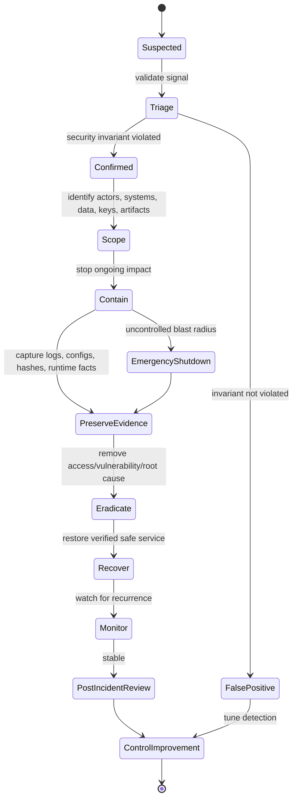
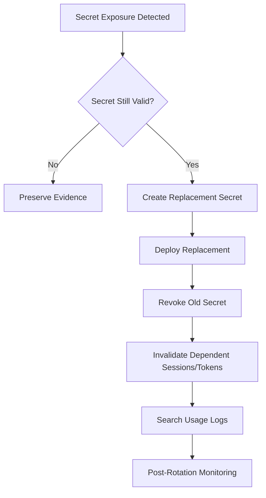
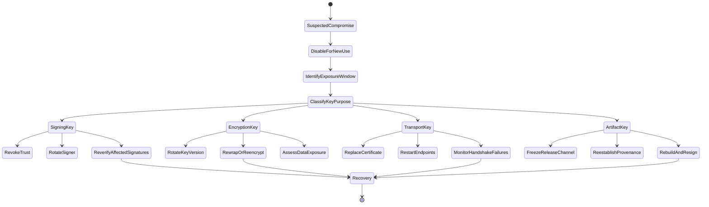
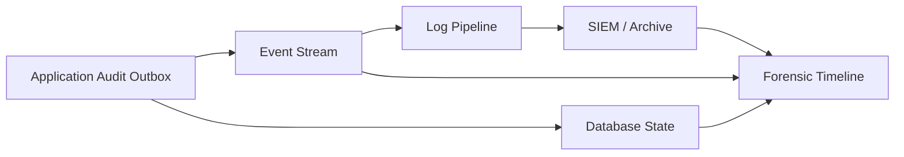

# Part 033 — Production Incident Playbooks

Security engineering is not complete until the system can fail under attack in a controlled, explainable, and recoverable way.

A top-tier Java engineer does not only ask:

> “Is the code secure?”

They also ask:

> “When the assumption breaks at 03:00, what exactly do we revoke, rotate, isolate, preserve, prove, and restore?”

This part turns the previous material into **operational playbooks**. We are no longer designing controls in isolation. We are designing the response system around those controls.

The goal is not theater. The goal is fast, disciplined action with defensible evidence.

---

## 1. Kaufman Deconstruction

Using Kaufman’s approach, incident response is decomposed into repeatable subskills:

| Subskill | What You Must Be Able To Do |
|---|---|
| Classify | Identify the type of security event without overfitting to symptoms. |
| Scope | Determine affected actors, data, keys, services, artifacts, and time windows. |
| Contain | Stop further damage without destroying evidence. |
| Preserve | Capture logs, traces, artifact hashes, configuration, and runtime facts. |
| Eradicate | Remove attacker access, vulnerable components, or compromised credentials. |
| Recover | Restore safe service with verified integrity. |
| Communicate | Keep engineering, security, product, legal, compliance, and customer-facing teams aligned. |
| Learn | Convert the incident into stronger invariants, controls, tests, and runbooks. |

The minimum useful skill is not “know NIST incident response.”

The minimum useful skill is:

> Given a Java production security incident, produce a concrete action sequence that preserves evidence, limits blast radius, restores safe operation, and leaves an auditable trail.

---

## 2. Incident Response Mental Model

A security incident is a **state transition** from trusted operation into suspected or confirmed violation of a security invariant.

Examples:

| Invariant | Incident Signal |
|---|---|
| Only valid tokens authorize access | Token used after revocation or from impossible geography. |
| Only trusted artifacts run in production | Runtime artifact digest does not match release manifest. |
| Private keys never leave controlled boundary | KMS audit shows unexpected decrypt/sign operation. |
| Audit logs are append-only and attributable | Missing sequence numbers or hash chain mismatch. |
| Tenant data is isolated | Actor from tenant A reads resource from tenant B. |
| Debug interfaces are unavailable in production | JDWP/JMX port exposed or accessed. |

An incident playbook starts with the violated invariant, not with the first alert name.

---

## 3. Universal Java Security Incident State Machine



Important ordering:

1. **Do not destroy evidence before preservation.**
2. **Do not rotate only the obvious credential. Rotate dependent trust.**
3. **Do not patch without scoping exposure.**
4. **Do not restore from an artifact whose provenance is uncertain.**
5. **Do not declare recovery before monitoring the original invariant.**

---

## 4. Incident Roles

For serious incidents, roles matter more than hierarchy.

| Role | Responsibility |
|---|---|
| Incident Commander | Owns coordination, priority, timeline, and decision cadence. |
| Technical Lead | Owns technical diagnosis, containment, and recovery plan. |
| Scribe | Records timeline, decisions, commands, evidence references, and unresolved questions. |
| Security Lead | Owns threat hypothesis, attacker path, forensic requirements, and control implications. |
| Platform Lead | Owns runtime, Kubernetes, VM, network, IAM, KMS, and observability surfaces. |
| Application Owner | Owns domain impact, data exposure, feature flags, business workflow impact. |
| Communications Lead | Owns internal/external updates, customer/support/legal alignment. |
| Compliance/Legal | Owns notification obligations, regulatory preservation, and disclosure constraints. |

A common engineering failure is letting the best debugger become the incident commander. That usually reduces coordination quality.

---

## 5. Evidence Packet Standard

Every incident should produce an evidence packet.

Minimum fields:

```yaml
incident_id: SEC-2026-000123
status: confirmed
severity: sev2
first_detected_at: 2026-06-28T03:17:41Z
confirmed_at: 2026-06-28T03:31:00Z
incident_commander: name-or-team
technical_lead: name-or-team
systems:
  - service: case-api
    version: 2026.06.28-rc4
    artifact_digest: sha256:...
    environment: prod-ap-southeast-1
violated_invariants:
  - Tenant isolation: actor must not access another tenant resource.
affected_assets:
  - tenant_data
  - audit_events
  - access_tokens
suspected_root_cause:
  - object-level authorization missing in evidence download endpoint
containment_actions:
  - disabled endpoint via feature flag
  - revoked active sessions for affected actors
evidence:
  - log_query: siem://queries/SEC-2026-000123-actor-timeline
  - artifact_manifest: s3://release-evidence/...
  - config_snapshot: s3://incident-config/...
open_questions:
  - Was export endpoint also affected?
```

The packet is not a report. It is the raw material for reliable response and post-incident review.

---

## 6. Java-Specific Incident Classes

This series focuses on these production incidents:

| Class | Example |
|---|---|
| Secret exposure | DB password committed, KMS credential leaked, API key in logs. |
| Token compromise | Refresh token replay, session theft, stolen service account token. |
| Key compromise | Signing key, TLS private key, encryption key, webhook secret. |
| Certificate failure | Expired cert, wrong SAN, untrusted issuer, broken mTLS chain. |
| Dependency zero-day | Vulnerable transitive dependency or build plugin. |
| Malicious artifact | Runtime JAR/image not matching expected digest/provenance. |
| Authorization bypass | Cross-tenant read, admin endpoint accessible, confused deputy. |
| Deserialization/RCE | Gadget chain, unsafe polymorphic binding, remote code execution. |
| Runtime exposure | JDWP/JMX/Actuator/admin port exposed. |
| Log/audit tampering | Missing audit events, sequence gap, hash-chain mismatch. |

Each class needs a different containment strategy.

---

# Playbook 1 — Leaked Secret

## Trigger Signals

- Secret found in Git history.
- Secret printed in application logs.
- Secret exposed in environment dump, heap dump, stack trace, support bundle, or CI logs.
- Secret scanner alert from repository, container image, artifact, or ticket attachment.
- Unexpected authentication using a credential from an unusual source.

## Immediate Questions

1. What secret type is it?
2. Is it still valid?
3. What capability does it grant?
4. What systems accepted it?
5. Was it observed externally or only internally?
6. Is there evidence of use?
7. Are there derivative credentials or cached sessions?

## Containment



Do not simply delete the secret from Git and move on. Git history, build caches, package registries, container layers, CI logs, and observability sinks may still contain it.

## Java-Specific Checks

Search for exposure in:

- `application.properties`
- `application.yml`
- environment variables
- JVM system properties
- Docker image layers
- Kubernetes Secrets mounted as environment variables
- Spring Boot `/actuator/env` or config endpoints
- exception logs
- `toString()` output
- heap dumps
- CI build logs
- test fixtures

Example grep patterns:

```bash
rg -n "password|secret|token|api[_-]?key|private[_-]?key|BEGIN .*PRIVATE KEY" .
```

Check container image history:

```bash
docker history --no-trunc registry.example.com/team/service:tag
```

Check Kubernetes environment exposure:

```bash
kubectl get deploy case-api -o yaml | rg -n "secretKeyRef|env:|value:|mountPath"
```

## Eradication

- Remove secret from source, configuration, logs, support artifacts, and documentation.
- Rewrite Git history only when policy permits and downstream clones are handled.
- Rebuild artifact from clean source.
- Rotate all credentials with equivalent or derived authority.
- Invalidate sessions/tokens minted using the old credential.
- Add scanner rule or policy gate to prevent recurrence.

## Recovery Verification

- Old secret is rejected by all dependent systems.
- New secret is in use by all live workloads.
- No live pod/container has old secret in environment or mounted file.
- No alert fires for old secret usage after revocation window.
- Release evidence references clean artifact digest.

## Common Mistake

Rotating the database password but forgetting:

- connection pool cached credentials,
- read replicas,
- migration jobs,
- batch workers,
- BI/reporting users,
- test/staging clones,
- break-glass credentials,
- old Kubernetes pods not restarted.

---

# Playbook 2 — Compromised Token or Session

## Trigger Signals

- Token used after logout or revocation.
- Same refresh token used twice.
- Impossible travel or device mismatch.
- Access token used from suspicious IP/ASN.
- Token appears in logs, browser history, crash dump, support ticket, or referrer header.
- Unexpected API calls with valid authentication but abnormal authorization behavior.

## Token Taxonomy

| Token | Typical Risk |
|---|---|
| Access token | Short-lived bearer access to APIs. |
| Refresh token | Long-lived minting capability. Higher risk. |
| Session cookie | Browser session authority. Theft enables impersonation. |
| Reset token | Account takeover if not single-use and short-lived. |
| API key | Often long-lived and under-rotated. |
| Service account token | Lateral movement risk. |

## Containment

- Revoke affected token identifiers or session IDs.
- Rotate refresh token family if replay is detected.
- Invalidate all sessions for affected actor if scope is uncertain.
- Force re-authentication for affected actor population.
- Disable suspicious client integration if API key compromise is suspected.
- Add temporary deny rules for suspicious IP/device/client_id where safe.

## Java Implementation Pattern

Token verification must check more than cryptographic validity.

```java
public final class TokenVerifier {
    private final SignatureVerifier signatureVerifier;
    private final RevocationStore revocationStore;
    private final TokenPolicy policy;

    public VerifiedToken verify(String compactToken, RequestContext ctx) {
        ParsedToken token = signatureVerifier.verifyAndParse(compactToken);

        if (token.expiresAt().isBefore(ctx.now())) {
            throw new UnauthorizedException("token_expired");
        }

        if (revocationStore.isRevoked(token.jwtId())) {
            throw new UnauthorizedException("token_revoked");
        }

        if (!policy.audienceAllowed(token.audience(), ctx.serviceName())) {
            throw new UnauthorizedException("invalid_audience");
        }

        if (!policy.issuerAllowed(token.issuer())) {
            throw new UnauthorizedException("invalid_issuer");
        }

        return new VerifiedToken(token.subject(), token.claims(), token.jwtId());
    }
}
```

A signed JWT is not “safe” if the system ignores revocation, audience, issuer, tenant, or policy version.

## Evidence to Preserve

- Token ID / session ID / refresh token family ID.
- Actor ID and tenant ID.
- Client ID, device ID, IP, ASN, user agent.
- First seen / last seen timestamps.
- API endpoints accessed.
- Authorization decisions made.
- Resource IDs touched.
- Revocation timeline.

## Recovery Verification

- Compromised token is rejected.
- Refresh token family cannot mint new access tokens.
- Affected actor must re-authenticate.
- Suspicious access attempts continue to be denied.
- Downstream services no longer accept cached authorization context.

---

# Playbook 3 — Key Compromise

Key compromise is more severe than credential compromise because keys often protect many credentials, tokens, signatures, or encrypted records.

## Key Classes

| Key | Impact If Compromised |
|---|---|
| JWT signing key | Attacker may mint valid tokens. |
| HMAC webhook secret | Attacker may forge callbacks. |
| Data encryption key | Confidentiality loss for encrypted data. |
| Key encryption key | Many wrapped DEKs may be affected. |
| TLS private key | Server impersonation risk, depending on protocol and capture conditions. |
| Artifact signing key | Malicious release can appear trusted. |
| Audit log signing key | Tamper-evidence chain may be forgeable. |

## Containment Principle

> A compromised signing key invalidates trust in future signatures immediately, but previously signed data requires time-scoped analysis.

For signing keys, you need:

- disable key for new signing,
- publish/propagate distrust policy,
- rotate to new key,
- identify signatures created during exposure window,
- re-sign known-good artifacts or records if necessary.

For encryption keys, you need:

- stop new encryption with compromised key,
- determine whether ciphertext was accessed,
- rotate/wrap/re-encrypt depending on architecture,
- evaluate data exposure obligation.

## State Machine



## Java-Specific Checks

- Which `kid` values are accepted by token verifiers?
- Is the key cached in-memory by all service instances?
- Is JWKS fetched and cached with long TTL?
- Are old public keys still accepted for verification?
- Does the verifier enforce `alg`, `kid`, issuer, audience, and policy version?
- Are signatures logged with key version?
- Are encrypted envelopes self-describing with key ID and algorithm version?

## Recovery Verification

- Old key cannot sign/decrypt/unwrap in KMS/HSM.
- Old key is not accepted for new trust decisions except explicitly allowed legacy verification.
- Services have refreshed key cache.
- Key version metrics show new version usage.
- Affected signatures/ciphertexts are inventoried.

---

# Playbook 4 — Certificate Expiry or TLS/mTLS Failure

TLS incidents are often reliability incidents with security consequences.

## Trigger Signals

- `PKIX path building failed`
- `certificate_unknown`
- `bad_certificate`
- `No subject alternative DNS name matching ...`
- `Received fatal alert: handshake_failure`
- sudden mTLS 401/403/connection resets
- certificate expiry alert
- truststore rollout mismatch

## First Diagnostic Steps

```bash
openssl s_client -connect api.example.com:443 -servername api.example.com -showcerts </dev/null
```

```bash
keytool -list -v -keystore truststore.p12 -storetype PKCS12
```

For Java TLS debugging in a controlled non-public environment:

```bash
-Djavax.net.debug=ssl,handshake,certpath
```

Do not enable verbose TLS debug broadly in production logs; it may leak sensitive operational detail.

## Common Java Causes

| Symptom | Likely Cause |
|---|---|
| `PKIX path building failed` | Missing CA/intermediate in truststore. |
| Hostname verification failure | Cert SAN does not match endpoint. |
| mTLS client rejected | Wrong client cert, expired cert, missing EKU, unknown issuer. |
| Works with curl but not Java | Java truststore differs from OS truststore. |
| Works on one pod only | Stale mounted secret or partial rollout. |
| Handshake failure after upgrade | Protocol/cipher/algorithm constraint mismatch. |

## Containment

- Roll back to previous known-good truststore/certificate if still safe.
- Rotate certificate with valid chain and SAN.
- Restart workloads if mounted secrets are not hot-reloaded.
- Temporarily route traffic to healthy endpoints.
- Do not disable hostname verification or trust-all managers.

## Recovery Verification

- `openssl s_client` shows expected chain.
- Java client validates chain and hostname.
- mTLS identity maps to expected service principal.
- Handshake failure metric returns to baseline.
- Certificate expiry monitor has sufficient lead time.

---

# Playbook 5 — Dependency Zero-Day

## Trigger Signals

- CVE announcement for direct/transitive dependency.
- SCA alert.
- Vendor advisory.
- Exploit observed in the wild.
- Unexpected behavior in dependency parser, logger, template engine, expression engine, or serialization stack.

## Triage Questions

1. Is the vulnerable dependency present in runtime artifact?
2. Is the vulnerable code path reachable?
3. Is it exposed to untrusted input?
4. Is exploitability affected by configuration?
5. Is there a fixed version?
6. Is mitigation available before upgrade?
7. Which services and jobs include it?

## Java Supply-Chain Commands

Maven:

```bash
mvn -q dependency:tree -Dincludes=groupId:artifactId
```

Gradle:

```bash
./gradlew dependencyInsight --dependency artifact-name --configuration runtimeClasspath
```

Container artifact:

```bash
syft registry.example.com/team/service:tag -o table
```

## Containment Options

| Option | Use When | Risk |
|---|---|---|
| Feature disable | Vulnerable path behind feature flag | Incomplete if alternate paths exist. |
| WAF/rule block | Exploit pattern visible at edge | Bypass possible. |
| Config mitigation | Vendor recommends safe setting | Must verify effective at runtime. |
| Version upgrade | Fixed version available | Regression risk. |
| Service isolation | Blast radius high | Operational impact. |
| Emergency shutdown | Active exploitation and severe impact | Availability impact. |

## Recovery Verification

- Runtime SBOM no longer contains vulnerable version, or accepted mitigation is proven.
- Exploit regression test fails against patched system.
- Dependency lock/provenance evidence updated.
- All runtime variants patched: API, worker, migration job, CLI, admin service, test harness.

---

# Playbook 6 — Malicious or Untrusted Artifact

## Trigger Signals

- Running image digest differs from deployment manifest.
- JAR checksum differs from release evidence.
- Signature verification fails.
- Build provenance missing or inconsistent.
- Artifact was built from untrusted branch/runner.
- Dependency or plugin downloaded from unexpected repository.

## Containment

- Freeze deployments from affected pipeline.
- Stop or isolate workloads running suspect artifact.
- Preserve running container image digest, command line, environment, mounted secrets, and network connections.
- Rebuild from known-good source with trusted builder.
- Re-sign artifacts and publish new release manifest.
- Rotate secrets exposed to suspect runtime.

## Runtime Verification

```bash
kubectl get pod -l app=case-api -o jsonpath='{range .items[*]}{.metadata.name}{" "}{.status.containerStatuses[*].imageID}{"\n"}{end}'
```

Compare against release manifest:

```yaml
release: 2026.06.28.4
source_commit: 9f3a...
image_digest: sha256:abc...
jar_digest: sha256:def...
sbom_digest: sha256:123...
provenance_digest: sha256:456...
signer: release-signing-key-v4
```

## Recovery Verification

- Every running workload uses expected digest.
- Admission policy rejects unsigned/untrusted artifacts.
- Provenance links source commit, builder, dependencies, SBOM, and signature.
- No suspect artifact remains in registry promotion path.

---

# Playbook 7 — Authorization Bypass

## Trigger Signals

- Cross-tenant data access.
- User accesses admin-only resource.
- API allows object ID enumeration.
- Background job processes resource under wrong tenant.
- Support/admin impersonation not logged or scoped.
- Policy cache returns stale allow decision.

## Immediate Containment

- Disable affected endpoint/action via feature flag or gateway rule.
- Apply deny rule for unsafe operation.
- Invalidate authorization cache.
- Revoke sessions for actors involved if misuse is suspected.
- Stop asynchronous workers if they may propagate unauthorized action.

## Scoping Queries

You need answerable questions:

- Which actors accessed resources outside their authorized scope?
- Which resources were read, modified, exported, or deleted?
- Which tenant/account boundaries were crossed?
- Was the issue read-only, write-impacting, or workflow-state-impacting?
- Did downstream events leak data?
- Did cached/materialized projections include unauthorized data?

## Java Testing Pattern After Fix

```java
@Test
void tenantMemberCannotReadOtherTenantEvidence() {
    User alice = fixtures.userInTenant("tenant-a");
    Evidence evidenceB = fixtures.evidenceInTenant("tenant-b");

    assertThrows(ForbiddenException.class, () ->
        evidenceService.download(alice.context(), evidenceB.id())
    );
}
```

The test name must encode the invariant, not the implementation detail.

## Recovery Verification

- Exploit reproduction fails.
- Authorization decision is checked close to object access.
- Audit events show denied attempts.
- Historical access is scoped and classified.
- Downstream derived data is corrected if contaminated.

---

# Playbook 8 — Deserialization or Remote Code Execution

## Trigger Signals

- Unexpected process execution.
- Suspicious outbound connections from Java service.
- Unknown classloading or dynamic bytecode activity.
- Parser/deserialization CVE in runtime dependency.
- JNDI/classloading-like behavior.
- Unexpected files written by service user.
- Unusual CPU/memory spike after crafted payload.

## Containment

- Remove public access to vulnerable endpoint.
- Block suspicious egress.
- Snapshot pod/container/VM state if forensics is required.
- Preserve logs, command line, environment, loaded libraries, network connections, filesystem artifacts.
- Rotate secrets accessible to the compromised process.
- Rebuild and redeploy patched artifact from trusted source.

## Java Runtime Evidence

Use carefully and preserve outputs:

```bash
jcmd <pid> VM.command_line
jcmd <pid> VM.system_properties
jcmd <pid> VM.flags
jcmd <pid> Thread.print
jcmd <pid> GC.class_histogram
```

In Kubernetes:

```bash
kubectl logs pod/case-api-xxx --previous
kubectl describe pod case-api-xxx
kubectl get events --sort-by=.lastTimestamp
```

Do not attach arbitrary agents or run invasive diagnostics before deciding forensic requirements.

## Eradication

- Patch vulnerable dependency/configuration.
- Disable unsafe polymorphic deserialization.
- Add object input filters or parser allowlists where applicable.
- Remove expression evaluation for untrusted input.
- Reduce runtime egress and filesystem write permissions.
- Rotate all secrets accessible to the compromised process.

## Recovery Verification

- Exploit payload no longer triggers vulnerable behavior.
- Egress attempts blocked or absent.
- Runtime runs as non-root with minimal permissions.
- Secrets are rotated.
- No unauthorized persistence remains.

---

# Playbook 9 — Audit or Log Tampering

## Trigger Signals

- Missing audit sequence numbers.
- Hash chain mismatch.
- Actor action observed without audit event.
- Time gaps in logs.
- Log source stopped unexpectedly.
- Different systems disagree about same event.
- Admin action lacks attribution.

## Containment

- Freeze deletion/retention jobs for affected log partitions.
- Preserve raw logs from all sinks.
- Capture config for logging pipeline and access policy.
- Restrict write/delete access to log storage.
- Compare application logs, audit outbox, database state, event stream, and SIEM ingestion.

## Reconciliation Model



No single log sink should be treated as absolute truth.

## Recovery Verification

- Audit pipeline is append-only or tamper-evident.
- Gaps are explained and classified.
- Admin actions have actor, reason, target, and approval context.
- Future missing-audit conditions trigger alerts.

---

# Playbook 10 — Exposed Debug, JMX, or Management Surface

## Trigger Signals

- Open JDWP port.
- JMX/RMI reachable externally.
- Actuator/admin endpoints exposed without strong auth.
- Heap dump endpoint accessible.
- Unexpected remote attach or management operations.

## Containment

- Block network access immediately.
- Disable exposed interface.
- Rotate secrets accessible via heap/env/system properties.
- Preserve access logs and network flow logs.
- Determine whether code execution, heap dump, config read, or management action occurred.

## Java-Specific Risks

| Surface | Why Dangerous |
|---|---|
| JDWP | Can allow code execution/debug manipulation if exposed. |
| JMX/RMI | Can expose management operations and sensitive runtime state. |
| Heap dump | May contain secrets, tokens, PII, credentials. |
| Thread dump | May contain request details, tokens, SQL, file paths. |
| Env/config endpoint | May expose secrets and topology. |
| Dynamic attach | Can load agents into running JVM. |

## Recovery Verification

- External scan cannot reach management/debug ports.
- Kubernetes NetworkPolicy/security group blocks access.
- Admin endpoint requires strong authz and audit.
- Runtime starts with safe production profile.
- Secrets potentially exposed through memory/config are rotated.

---

## 7. Severity Model

Severity should be based on impact and control loss, not emotional intensity.

| Severity | Criteria | Example |
|---|---|---|
| SEV1 | Active compromise, broad data exposure, key compromise, production RCE, malicious artifact in prod. | JWT signing key stolen. |
| SEV2 | Confirmed security invariant violation with limited scope or contained exploitation. | Cross-tenant read for small actor set. |
| SEV3 | Vulnerability present but no evidence of exploitation; mitigation required. | Reachable vulnerable dependency with no observed exploit. |
| SEV4 | Weakness, misconfiguration, or near miss with low immediate impact. | Expiring cert alert with enough lead time. |

Severity can go up or down as scoping improves.

---

## 8. Communication Cadence

A good incident update is concise and stateful:

```text
Status: Confirmed SEV2 authorization bypass in evidence download endpoint.
Impact: 14 unauthorized reads across 3 tenants between 02:14 and 03:02 UTC.
Containment: Endpoint disabled at 03:31 UTC. Sessions for 2 actors revoked.
Current Work: Scoping exports and downstream audit events.
Next Update: 04:30 UTC or earlier if impact expands.
Risks: Derived data in async export queue still under review.
```

Avoid vague updates like “we are investigating.” Say what is known, what changed, what is unknown, and what is next.

---

## 9. Post-Incident Review Template

```md
# Post-Incident Review: SEC-YYYY-NNNN

## Summary
What happened in one paragraph?

## Timeline
- first signal
- confirmation
- containment
- recovery
- customer/regulatory milestones

## Violated Invariants
Which security guarantees failed?

## Impact
- actors
- tenants/accounts
- records
- keys/secrets
- artifacts
- time window

## Root Cause
Technical and process root cause.

## Detection
How was it detected? How could it have been detected earlier?

## Response Quality
What slowed containment? What preserved evidence well?

## Control Improvements
- code changes
- tests
- alerts
- platform policy
- runbook changes
- training/docs

## Open Risk
What remains accepted, mitigated, or scheduled?
```

---

## 10. Practice Drills

Run these drills before a real incident:

1. Rotate JWT signing key and verify old tokens fail according to policy.
2. Simulate leaked DB password in staging and rotate all consumers.
3. Break mTLS truststore and recover without disabling verification.
4. Deploy vulnerable dependency in a test service and prove SCA gate blocks it.
5. Simulate cross-tenant authorization bug and produce impact report from audit logs.
6. Corrupt audit log hash chain and verify detection.
7. Run malicious artifact digest mismatch through admission policy.
8. Force certificate expiry alert and validate escalation timing.
9. Revoke refresh token family after replay detection.
10. Recover from compromised API key for external integration.

A playbook that is not rehearsed is only documentation.

---

## 11. Engineering Review Checklist

Before production launch, answer:

- Can we revoke every credential type independently?
- Can we rotate every key without full outage?
- Can we identify all data touched by an actor in a time window?
- Can we prove which artifact is running?
- Can we prove which source produced that artifact?
- Can we disable high-risk features quickly?
- Can we distinguish authentication failure from authorization failure?
- Can we detect audit-log gaps?
- Can we preserve evidence without granting broad production access?
- Can we recover from TLS/mTLS failure without weakening verification?
- Can we patch a dependency across API, worker, batch, and admin surfaces?
- Can we answer whether a vulnerable code path was reachable?

---

## 12. Key Takeaways

- Incident response is security architecture under time pressure.
- The right unit of response is the violated invariant.
- Java incidents often involve keys, tokens, classloading, deserialization, dependencies, runtime management surfaces, or artifact integrity.
- Evidence preservation must happen before destructive cleanup.
- Containment must include dependent trust: sessions, caches, downstream services, build artifacts, and derived data.
- Recovery is not “service is up.” Recovery is “the violated invariant is restored and monitored.”

In the final part, we will compose everything into a complete secure Java platform design.
